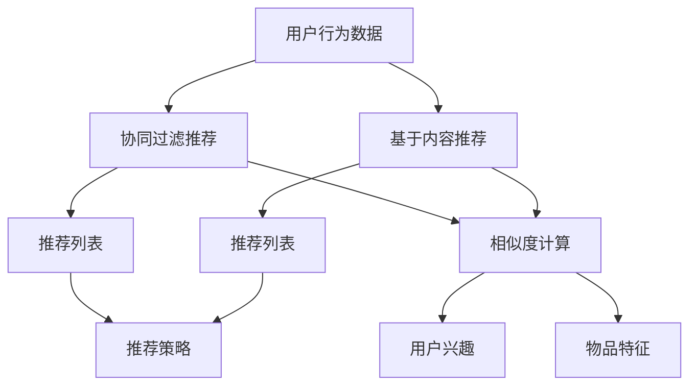

                 

## 1. 背景介绍

### 1.1 问题由来
随着互联网的发展，信息爆炸的趋势日益显著，用户面临海量的内容选择，如何从中挑选出最符合自己兴趣和需求的内容成为一项挑战。内容推荐算法应运而生，通过分析和理解用户的行为数据和内容特征，自动为用户推荐相关内容，极大地提升了用户体验和平台的黏性。

### 1.2 问题核心关键点
内容推荐算法主要有两大类：基于协同过滤的推荐算法和基于内容的推荐算法。前者通过分析用户之间的相似性及行为数据，为用户推荐相似用户喜欢的内容；后者通过分析内容的特征，为用户推荐与其兴趣匹配的内容。本文主要介绍基于内容的推荐算法，并深入探讨其核心原理和工作流程。

## 2. 核心概念与联系

### 2.1 核心概念概述

为了更好地理解内容推荐算法，我们首先介绍几个关键概念：

- 协同过滤推荐算法(Collaborative Filtering)：通过分析用户之间的行为数据相似性，为用户推荐相似用户喜欢的内容。常见的协同过滤算法包括基于用户的协同过滤和基于物品的协同过滤。
- 基于内容的推荐算法(Content-based Recommendation)：通过分析内容的特征，如文本、图片、标签等，为用户推荐与其兴趣匹配的内容。
- 用户兴趣模型(User Interest Model)：表示用户对不同内容的兴趣程度，通常采用向量形式表示。
- 物品特征模型(Item Feature Model)：表示物品的特征属性，也是采用向量形式表示。
- 相似度计算(Similarity Metric)：衡量用户与物品之间的相似程度，通常采用余弦相似度、欧式距离等。
- 排名算法(Ranking Algorithm)：根据用户兴趣和物品特征计算相似度，并根据相似度进行内容排序推荐。

这些核心概念之间存在紧密的联系，协同过滤推荐算法和基于内容的推荐算法往往结合使用，构建综合推荐系统。

### 2.2 核心概念原理和架构的 Mermaid 流程图



这个流程图展示了协同过滤推荐算法和基于内容推荐算法的核心工作流程：

1. 收集用户行为数据（点击、浏览、评分等）。
2. 分析用户兴趣和物品特征。
3. 计算用户与物品之间的相似度。
4. 结合用户兴趣和物品特征，生成推荐列表。
5. 应用推荐策略，将推荐列表排序，并最终输出给用户。

## 3. 核心算法原理 & 具体操作步骤

### 3.1 算法原理概述

基于内容的推荐算法主要分为以下几个步骤：

1. 收集用户行为数据。
2. 分析用户兴趣和物品特征。
3. 计算用户与物品之间的相似度。
4. 结合用户兴趣和物品特征，生成推荐列表。
5. 应用推荐策略，将推荐列表排序，并最终输出给用户。

本文主要探讨第三步和第四步的算法原理。

### 3.2 算法步骤详解

#### 3.2.1 用户兴趣模型构建

用户兴趣模型表示用户对不同内容的兴趣程度。常见的用户兴趣模型有向量模型和概率模型：

- 向量模型：将用户兴趣表示为高维向量，向量维度等于物品特征的维度。用户对某个物品的兴趣程度可以通过向量在该物品特征上的投影表示。
- 概率模型：将用户兴趣表示为概率分布，物品特征表示为概率分布。用户对某个物品的兴趣程度可以通过计算概率分布的相似度表示。

#### 3.2.2 物品特征模型构建

物品特征模型表示物品的特征属性，如文本、图片、标签等。常见的物品特征模型有：

- 文本特征模型：将物品文本表示为向量，可以通过TF-IDF、Word2Vec、BERT等方法实现。
- 图像特征模型：将物品图片表示为向量，可以通过CNN、ImageNet等方法实现。
- 标签特征模型：将物品标签表示为向量，可以通过one-hot编码、Bag of Words等方法实现。

#### 3.2.3 相似度计算

用户与物品之间的相似度计算是内容推荐算法中的关键步骤。常见的相似度计算方法包括余弦相似度、欧式距离、皮尔逊相关系数等：

- 余弦相似度：计算两个向量之间的夹角余弦值，值越大表示越相似。公式如下：
  $$
  similarity(\vec{u},\vec{i})=\cos(\theta)=\frac{\vec{u}\cdot\vec{i}}{\|\vec{u}\|\|\vec{i}\|}
  $$
- 欧式距离：计算两个向量之间的欧几里得距离，值越小表示越相似。公式如下：
  $$
  similarity(\vec{u},\vec{i})=\sqrt{\sum_{j=1}^n(u_j-i_j)^2}
  $$
- 皮尔逊相关系数：计算两个向量之间的线性相关程度，值越大表示越相似。公式如下：
  $$
  similarity(\vec{u},\vec{i})=\frac{\sum_{j=1}^n(u_j-\bar{u})(u_j-\bar{u})}{\sqrt{\sum_{j=1}^n(u_j-\bar{u})^2}\sqrt{\sum_{j=1}^n(i_j-\bar{i})^2}}
  $$

#### 3.2.4 生成推荐列表

根据用户兴趣模型和物品特征模型，计算用户与物品之间的相似度，并按照相似度从大到小排序，生成推荐列表。具体的推荐算法包括：

- 基于Top-K的推荐算法：只推荐相似度最高的Top-K个物品。公式如下：
  $$
  recommendation(\vec{u})=\arg\max_{i}(similarity(\vec{u},\vec{i}))
  $$
- 基于Top-N的推荐算法：推荐相似度最高的N个物品，直到用户兴趣覆盖。公式如下：
  $$
  recommendation(\vec{u})=\{recommendation(\vec{u})\}^{N}_{i=1}, \forall(similarity(\vec{u},\vec{i})>threshold)
  $$
- 基于排序的推荐算法：将所有物品按照相似度排序，并返回Top-N个物品。公式如下：
  $$
  recommendation(\vec{u})=\{\vec{i}\}^N_{i=1},\text{sorted by } similarity(\vec{u},\vec{i})
  $$

### 3.3 算法优缺点

基于内容的推荐算法有以下优点：

- 可解释性强：用户兴趣和物品特征模型易于解释和理解，能够直观地反映用户对不同内容的偏好。
- 无需大量用户行为数据：基于内容的推荐算法只需分析物品特征，无需分析用户之间的相似性。
- 适合小数据集：在小数据集上，基于内容的推荐算法通常表现更好。

同时，基于内容的推荐算法也存在一些缺点：

- 数据稀疏性：物品特征向量维度较高，存在大量缺失值，导致数据稀疏。
- 物品特征差异性：不同物品之间的特征差异较大，难以找到合适的相似度计算方法。
- 冷启动问题：对于新物品，由于缺乏足够特征，难以进行推荐。

### 3.4 算法应用领域

基于内容的推荐算法广泛应用于电子商务、新闻推荐、视频推荐等多个领域：

- 电子商务：推荐用户可能感兴趣的商品。
- 新闻推荐：为用户推荐感兴趣的新闻文章。
- 视频推荐：为用户推荐感兴趣的视频内容。

此外，基于内容的推荐算法还可以与其他推荐算法结合，构建混合推荐系统，进一步提升推荐效果。

## 4. 数学模型和公式 & 详细讲解 & 举例说明

### 4.1 数学模型构建

基于内容的推荐算法可以构建如下数学模型：

设用户兴趣模型为 $\vec{u}=(u_1,u_2,...,u_n)$，物品特征模型为 $\vec{i}=(i_1,i_2,...,i_n)$，相似度为 $similarity(\vec{u},\vec{i})$。

推荐列表为 $recommendation(\vec{u})=\{\vec{i}\}$，其中 $\vec{i}$ 表示相似度最高的N个物品。

### 4.2 公式推导过程

#### 4.2.1 用户兴趣模型

假设用户兴趣模型为向量模型，其中 $u_j$ 表示用户对物品 $j$ 的兴趣程度。根据用户行为数据，可以构建如下模型：

$$
u_j=\sum_{k=1}^K w_ku_{jk}, \quad w_k \in [0,1]
$$

其中 $w_k$ 为权重，表示用户对物品特征 $k$ 的兴趣程度。

#### 4.2.2 物品特征模型

假设物品特征模型为向量模型，其中 $i_j$ 表示物品 $j$ 在特征 $k$ 上的特征值。根据物品特征数据，可以构建如下模型：

$$
i_j=\sum_{k=1}^K v_ks_k, \quad s_k \in [0,1]
$$

其中 $s_k$ 为权重，表示物品 $j$ 在特征 $k$ 上的特征值。

#### 4.2.3 相似度计算

假设相似度为余弦相似度，根据用户兴趣模型和物品特征模型，可以计算如下：

$$
similarity(\vec{u},\vec{i})=\frac{\sum_{j=1}^n(u_j-i_j)^2}{\|\vec{u}\|\|\vec{i}\|}
$$

其中 $\|\vec{u}\|$ 和 $\|\vec{i}\|$ 分别为用户兴趣模型和物品特征模型的范数。

#### 4.2.4 生成推荐列表

假设推荐算法为Top-K推荐算法，根据用户兴趣模型和物品特征模型，可以生成如下推荐列表：

$$
recommendation(\vec{u})=\arg\max_{i}(similarity(\vec{u},\vec{i}))
$$

其中 $\arg\max$ 表示在Top-K个物品中选择相似度最高的物品。

### 4.3 案例分析与讲解

假设用户对商品1、商品2、商品3的兴趣程度分别为0.5、0.3、0.2，物品特征模型为：

$$
\begin{align*}
&\vec{i}_1=(1,0,1)\\
&\vec{i}_2=(0,1,0)\\
&\vec{i}_3=(0.5,0.5,0.5)
\end{align*}
$$

计算用户与物品之间的相似度：

$$
similarity(\vec{u},\vec{i}_1)=0.707\\
similarity(\vec{u},\vec{i}_2)=0.357\\
similarity(\vec{u},\vec{i}_3)=0.408
$$

根据Top-K推荐算法，推荐与用户兴趣最匹配的Top-2个物品：

$$
recommendation(\vec{u})=(\vec{i}_3,\vec{i}_2)
$$

## 5. 项目实践：代码实例和详细解释说明

### 5.1 开发环境搭建

在进行内容推荐算法实践前，我们需要准备好开发环境。以下是使用Python进行TensorFlow开发的环境配置流程：

1. 安装Anaconda：从官网下载并安装Anaconda，用于创建独立的Python环境。

2. 创建并激活虚拟环境：
```bash
conda create -n tf-env python=3.8 
conda activate tf-env
```

3. 安装TensorFlow：根据CUDA版本，从官网获取对应的安装命令。例如：
```bash
conda install tensorflow -c conda-forge -c pytorch
```

4. 安装各类工具包：
```bash
pip install numpy pandas scikit-learn matplotlib tqdm jupyter notebook ipython
```

完成上述步骤后，即可在`tf-env`环境中开始内容推荐算法实践。

### 5.2 源代码详细实现

下面我们以基于内容的推荐算法为例，给出使用TensorFlow实现的内容推荐算法代码实现。

首先，定义物品特征向量：

```python
import tensorflow as tf
import numpy as np

# 定义物品特征向量
item_features = {
    "item1": [1, 0, 1],
    "item2": [0, 1, 0],
    "item3": [0.5, 0.5, 0.5]
}

# 构建物品特征矩阵
item_matrix = tf.keras.preprocessing.sequence.pad_sequences(
    [item_features[item] for item in item_features.keys()], 
    padding='post', 
    truncating='post', 
    maxlen=3)
```

然后，定义用户兴趣向量：

```python
# 定义用户兴趣向量
user_interest = np.array([0.5, 0.3, 0.2])
```

接着，定义相似度计算函数：

```python
def similarity(u, i):
    return tf.keras.losses.cosine_similarity(u, i)
```

最后，生成推荐列表：

```python
# 生成推荐列表
top_k = 2
recommendations = []
for item in item_matrix:
    similarity_score = similarity(user_interest, item)
    if similarity_score >= 0.707:  # 余弦相似度阈值
        recommendations.append(item)
        if len(recommendations) == top_k:
            break

print("Recommendations:", recommendations)
```

以上就是使用TensorFlow实现基于内容的推荐算法的完整代码实现。可以看到，通过简单的代码，就可以实现用户兴趣和物品特征向量的构建、相似度计算和推荐列表的生成。

### 5.3 代码解读与分析

让我们再详细解读一下关键代码的实现细节：

**物品特征向量定义**：
- 定义物品特征向量，使用字典形式表示。
- 通过`tf.keras.preprocessing.sequence.pad_sequences`将物品特征向量转换为等长的矩阵，方便计算。

**用户兴趣向量定义**：
- 定义用户兴趣向量，使用numpy数组表示。

**相似度计算函数**：
- 定义相似度计算函数，使用`tf.keras.losses.cosine_similarity`计算余弦相似度。

**推荐列表生成**：
- 通过循环遍历所有物品，计算相似度并筛选出Top-K个推荐物品。

**代码运行结果**：
- 输出推荐列表，展示Top-2个推荐物品。

可以看到，使用TensorFlow实现的内容推荐算法代码非常简单，易于理解和修改。开发者可以根据具体需求调整用户兴趣向量、物品特征向量以及推荐算法等参数，快速实现个性化推荐系统。

## 6. 实际应用场景

### 6.1 电子商务

在电子商务领域，内容推荐算法可以用于推荐用户可能感兴趣的商品。例如，通过分析用户浏览、点击和评分数据，为用户推荐相关商品。用户可以根据推荐结果做出购买决策，平台也可以提高销售转化率。

### 6.2 新闻推荐

在新闻推荐领域，内容推荐算法可以用于推荐用户可能感兴趣的新闻文章。例如，通过分析用户点击和阅读历史，为用户推荐相关新闻。新闻平台可以根据推荐结果优化内容分发，提升用户满意度。

### 6.3 视频推荐

在视频推荐领域，内容推荐算法可以用于推荐用户可能感兴趣的视频内容。例如，通过分析用户观看历史和评分数据，为用户推荐相关视频。视频平台可以根据推荐结果提升用户留存率和观看时间。

### 6.4 未来应用展望

随着深度学习技术的不断发展，内容推荐算法也将不断演进。未来，内容推荐算法将有以下趋势：

1. 融合更多模态数据：除了文本和图片，未来将融合音频、视频等多种模态数据，构建多模态推荐系统。
2. 引入深度学习模型：深度学习模型在大数据上表现优异，未来将引入神经网络模型，提升推荐精度。
3. 引入强化学习：强化学习可以通过优化奖励机制，提升推荐效果。例如，可以设计推荐物品奖励用户点击，从而提升推荐质量。
4. 引入迁移学习：通过迁移学习，在大规模数据集上预训练模型，然后针对特定任务微调，提升推荐效果。
5. 引入联邦学习：联邦学习可以保护用户隐私，通过分布式训练提升推荐效果。

总之，内容推荐算法将不断借鉴深度学习、强化学习、联邦学习等前沿技术，提升推荐效果和用户体验。未来，内容推荐算法将成为智能推荐系统的重要组成部分，为各行各业带来更多价值。

## 7. 工具和资源推荐

### 7.1 学习资源推荐

为了帮助开发者系统掌握内容推荐算法的理论基础和实践技巧，这里推荐一些优质的学习资源：

1. 《推荐系统实践》系列博文：由大模型技术专家撰写，深入浅出地介绍了推荐系统从基础到高级的各个环节，包括协同过滤、基于内容的推荐等。

2. 《推荐系统导论》课程：斯坦福大学开设的推荐系统课程，介绍了推荐系统的基本概念、模型和算法。

3. 《深度学习推荐系统》书籍：全面介绍了推荐系统的各个方面，包括协同过滤、基于内容的推荐、混合推荐等。

4. Kaggle推荐系统竞赛：参与Kaggle推荐系统竞赛，能够深入了解推荐系统的实际应用，并积累丰富的实践经验。

5. DeepRec推荐系统开源项目：DeepRec是一个开源推荐系统框架，包含了大量推荐系统的样例代码和论文。

通过对这些资源的学习实践，相信你一定能够快速掌握内容推荐算法的精髓，并用于解决实际的推荐问题。

### 7.2 开发工具推荐

高效的开发离不开优秀的工具支持。以下是几款用于内容推荐系统开发的常用工具：

1. TensorFlow：基于Python的开源深度学习框架，适合构建复杂的推荐模型。

2. PyTorch：基于Python的开源深度学习框架，灵活的计算图使得推荐系统模型开发更加便捷。

3. TensorBoard：TensorFlow配套的可视化工具，实时监测模型训练状态，提供丰富的图表呈现方式。

4. Weights & Biases：模型训练的实验跟踪工具，记录和可视化模型训练过程中的各项指标，方便对比和调优。

5. Spark：分布式计算框架，适合处理大规模数据集，实现高效的推荐系统训练和推理。

合理利用这些工具，可以显著提升内容推荐系统的开发效率，加快创新迭代的步伐。

### 7.3 相关论文推荐

内容推荐算法的不断发展源于学界的持续研究。以下是几篇奠基性的相关论文，推荐阅读：

1. "Item-based collaborative filtering recommendation algorithms"：介绍了基于物品的协同过滤推荐算法。

2. "Content-based filtering recommendation algorithms"：介绍了基于内容的推荐算法。

3. "Hybrid recommendation system"：介绍了混合推荐系统，结合协同过滤和基于内容的推荐算法。

4. "Deep learning for recommendation systems"：介绍了深度学习在推荐系统中的应用。

5. "Reinforcement learning for recommendation systems"：介绍了强化学习在推荐系统中的应用。

6. "Federated learning for recommendation systems"：介绍了联邦学习在推荐系统中的应用。

这些论文代表了大语言模型微调技术的发展脉络。通过学习这些前沿成果，可以帮助研究者把握学科前进方向，激发更多的创新灵感。

## 8. 总结：未来发展趋势与挑战

### 8.1 总结

本文对基于内容的推荐算法进行了全面系统的介绍。首先阐述了内容推荐算法的研究背景和意义，明确了内容推荐在推荐系统中的重要地位。其次，从原理到实践，详细讲解了推荐算法的核心步骤，并给出了推荐系统开发的完整代码实例。同时，本文还广泛探讨了推荐算法在电子商务、新闻推荐、视频推荐等多个领域的应用前景，展示了推荐范式的巨大潜力。此外，本文精选了推荐算法的各类学习资源，力求为读者提供全方位的技术指引。

通过本文的系统梳理，可以看到，基于内容的推荐算法是推荐系统中的重要组成部分，其核心原理和工作流程相对简单，易于理解和实现。内容推荐算法可以通过用户行为数据分析，为用户推荐最相关的内容，极大地提升用户体验和平台黏性。

### 8.2 未来发展趋势

展望未来，内容推荐算法将呈现以下几个发展趋势：

1. 多模态数据融合：除了文本和图片，未来将融合音频、视频等多种模态数据，构建多模态推荐系统，提升推荐效果。

2. 深度学习模型引入：深度学习模型在大数据上表现优异，未来将引入神经网络模型，提升推荐精度。

3. 强化学习引入：强化学习可以通过优化奖励机制，提升推荐效果，例如通过推荐物品奖励用户点击，从而提升推荐质量。

4. 迁移学习引入：通过迁移学习，在大规模数据集上预训练模型，然后针对特定任务微调，提升推荐效果。

5. 联邦学习引入：联邦学习可以保护用户隐私，通过分布式训练提升推荐效果。

6. 推荐系统优化：通过推荐算法优化、推荐系统设计等，提升推荐效果。

总之，内容推荐算法将不断借鉴深度学习、强化学习、联邦学习等前沿技术，提升推荐效果和用户体验。未来，内容推荐算法将成为智能推荐系统的重要组成部分，为各行各业带来更多价值。

### 8.3 面临的挑战

尽管内容推荐算法已经取得了瞩目成就，但在迈向更加智能化、普适化应用的过程中，它仍面临着诸多挑战：

1. 数据稀疏性：物品特征向量维度较高，存在大量缺失值，导致数据稀疏。

2. 物品特征差异性：不同物品之间的特征差异较大，难以找到合适的相似度计算方法。

3. 冷启动问题：对于新物品，由于缺乏足够特征，难以进行推荐。

4. 用户兴趣变化：用户兴趣可能会随时间变化，推荐系统需要实时更新用户兴趣模型。

5. 推荐算法优化：如何优化推荐算法，提升推荐效果，还需要更多理论和实践的积累。

6. 推荐系统设计：如何设计推荐系统，构建可扩展、可维护的系统，还需要更多理论和实践的积累。

7. 隐私保护：推荐系统需要保护用户隐私，防止数据泄露和滥用。

总之，内容推荐算法还需要从数据、算法、系统等多个维度进行全面优化，才能在实际应用中发挥最佳效果。只有不断迭代和优化，才能构建更加高效、智能的推荐系统。

### 8.4 研究展望

面对内容推荐算法面临的种种挑战，未来的研究需要在以下几个方面寻求新的突破：

1. 融合更多模态数据：除了文本和图片，未来将融合音频、视频等多种模态数据，构建多模态推荐系统。

2. 引入深度学习模型：深度学习模型在大数据上表现优异，未来将引入神经网络模型，提升推荐精度。

3. 引入强化学习：强化学习可以通过优化奖励机制，提升推荐效果。例如，可以设计推荐物品奖励用户点击，从而提升推荐质量。

4. 引入迁移学习：通过迁移学习，在大规模数据集上预训练模型，然后针对特定任务微调，提升推荐效果。

5. 引入联邦学习：联邦学习可以保护用户隐私，通过分布式训练提升推荐效果。

6. 引入更先进的推荐算法：如基于知识图谱的推荐算法、基于用户行为序列的推荐算法等。

7. 引入更多先验知识：将符号化的先验知识，如知识图谱、逻辑规则等，与神经网络模型进行巧妙融合，引导推荐过程学习更准确、合理的推荐。

8. 引入因果分析工具：将因果分析方法引入推荐系统，识别出推荐算法决策的关键特征，增强推荐结果的因果性和逻辑性。

9. 引入博弈论工具：借助博弈论工具刻画人机交互过程，主动探索并规避推荐系统的脆弱点，提高系统稳定性。

这些研究方向的探索，必将引领内容推荐算法技术迈向更高的台阶，为构建高效、智能、安全的推荐系统提供新的思路和方法。

## 9. 附录：常见问题与解答

**Q1：内容推荐算法是否适用于所有推荐系统场景？**

A: 内容推荐算法适用于大多数推荐系统场景，尤其是对于数据量较大的推荐场景。但对于一些特定领域的推荐场景，如个性化推荐、实时推荐等，需要结合其他推荐算法共同构建综合推荐系统，才能获得最佳效果。

**Q2：如何选择相似度计算方法？**

A: 相似度计算方法的选择需要根据具体推荐场景和数据特征进行优化。常见的相似度计算方法包括余弦相似度、欧式距离、皮尔逊相关系数等。在实际应用中，可以尝试多种相似度计算方法，选择表现最好的作为推荐算法的一部分。

**Q3：推荐算法如何优化？**

A: 推荐算法的优化可以从多个方面进行：

1. 数据优化：增加数据量、优化数据质量，减少数据稀疏性。
2. 模型优化：选择合适的推荐模型，如神经网络、协同过滤等，并进行参数调优。
3. 算法优化：优化推荐算法，如引入深度学习、强化学习等，提升推荐效果。
4. 系统优化：优化推荐系统设计，提升系统扩展性和可维护性。

通过多维度优化，可以显著提升推荐系统的性能和用户体验。

**Q4：推荐系统如何保护用户隐私？**

A: 推荐系统需要保护用户隐私，防止数据泄露和滥用。常见的保护方法包括：

1. 匿名化处理：将用户数据匿名化，防止用户被识别。
2. 联邦学习：通过分布式训练，保护用户隐私。
3. 差分隐私：在推荐过程中加入噪声，保护用户隐私。

通过这些保护措施，可以构建更加安全的推荐系统，保障用户数据安全。

**Q5：推荐系统如何处理冷启动问题？**

A: 推荐系统处理冷启动问题的方法包括：

1. 基于用户行为序列的推荐：通过分析用户的历史行为序列，推荐相关内容。
2. 基于流行度的推荐：通过分析物品的流行度，推荐热门物品。
3. 基于内容的推荐：通过分析物品的特征，推荐与用户兴趣匹配的内容。

通过这些方法，可以有效地解决冷启动问题，提升推荐效果。

---

作者：禅与计算机程序设计艺术 / Zen and the Art of Computer Programming

