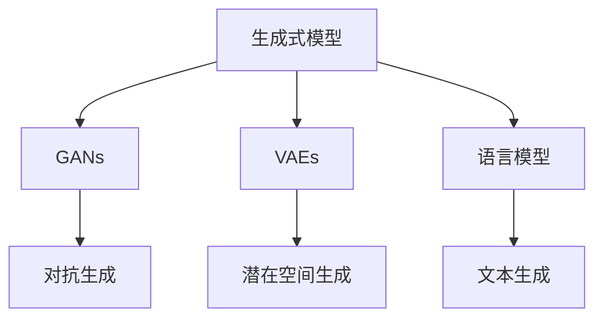
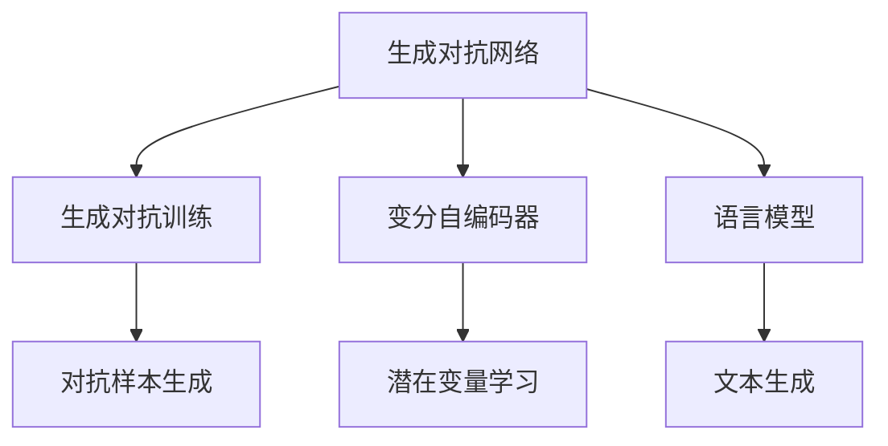

                 

# 内容生成(Content Generation) - 原理与代码实例讲解

> 关键词：内容生成, 自然语言处理(NLP), 深度学习, 生成对抗网络(GANs), 变分自编码器(VAEs), 语言模型, 代码实例

## 1. 背景介绍

内容生成技术是自然语言处理(Natural Language Processing, NLP)领域的重要研究方向之一。它旨在通过算法和模型，自动生成符合人类语言习惯和逻辑的文本内容。随着深度学习技术的发展，尤其是神经网络在语言处理上的成功应用，内容生成技术得到了长足进步。生成对抗网络(GANs)、变分自编码器(VAEs)和语言模型等模型，已经成为内容生成领域的重要工具。

### 1.1 问题由来

内容生成的应用广泛，例如文本摘要、机器翻译、对话系统、自动摘要、文本创作等。传统的内容生成方法包括规则生成、模板生成、基于统计的方法等，但这些方法通常需要大量的人工设计和规则编写，难以灵活适应不同的应用场景。

近年来，深度学习技术在图像、语音、文本等领域取得了巨大成功。尤其是神经网络在自然语言处理上的应用，如序列到序列(Sequence-to-Sequence, Seq2Seq)模型、Transformer模型、BERT等，使得内容生成变得更加智能和高效。基于深度学习的内容生成技术，能够自动学习文本数据中的语言结构和知识，生成高质量的自然语言文本。

### 1.2 问题核心关键点

内容生成技术主要包括两大类：生成式模型和变分模型。生成式模型通过最大化生成数据的概率分布，生成新的文本内容。变分模型通过最大化潜在变量的概率分布，生成文本内容。

生成式模型主要包括：
- 生成对抗网络(GANs)：通过两个神经网络模型进行对抗训练，生成高质量的文本。
- 变分自编码器(VAEs)：通过将文本数据映射到潜在空间，进行数据生成。
- 语言模型：通过学习文本数据中的语言规律，生成新的文本内容。

变分模型主要包括：
- 变分自编码器(VAEs)：通过最大化潜在变量的概率分布，生成文本内容。
- 变分自动编码器(VAEs)：通过最大似然估计，优化潜在变量的分布。

这些模型之间的联系可以通过以下Mermaid流程图来展示：



这个流程图展示了生成式模型和变分模型的基本结构。其中，GANs和VAEs是生成式模型的典型代表，语言模型则是变分模型的一种。通过这些模型的组合和改进，我们可以实现更加灵活和高效的内容生成技术。

## 2. 核心概念与联系

### 2.1 核心概念概述

内容生成技术涉及多个核心概念，包括生成对抗网络(GANs)、变分自编码器(VAEs)、语言模型等。这些概念之间的联系可以通过以下Mermaid流程图来展示：



这个流程图展示了这些核心概念的基本结构。其中，生成对抗网络通过对抗训练生成高质量的文本，变分自编码器通过潜在变量学习生成文本，语言模型通过学习文本规律生成文本。这些模型的组合和改进，可以产生更加多样和高质量的内容生成技术。

### 2.2 核心概念原理和架构

**生成对抗网络(GANs)**

生成对抗网络由两个神经网络组成，一个生成网络(G)和一个判别网络(D)。生成网络的目标是生成高质量的文本内容，判别网络的目标是判断生成的文本是否真实。通过对抗训练，生成网络和判别网络不断迭代优化，生成高质量的文本内容。

- **生成网络(G)**：生成网络通常采用多层感知器(Multilayer Perceptron, MLP)、卷积神经网络(Convolutional Neural Network, CNN)等结构。输入是随机噪声向量，输出是生成的文本内容。

- **判别网络(D)**：判别网络通常采用多层感知器、卷积神经网络等结构。输入是文本内容，输出是一个0-1的概率值，表示生成的文本是否真实。

**变分自编码器(VAEs)**

变分自编码器由两个神经网络组成，一个编码器(E)和一个解码器(D)。编码器的目标是将文本数据映射到潜在空间，解码器的目标是生成与原始文本相似的新文本。通过最大化潜在变量的概率分布，生成高质量的文本内容。

- **编码器(E)**：编码器通常采用多层感知器、卷积神经网络等结构。输入是文本数据，输出是潜在变量的表示。

- **解码器(D)**：解码器通常采用多层感知器、循环神经网络(Recurrent Neural Network, RNN)等结构。输入是潜在变量的表示，输出是生成的文本内容。

**语言模型**

语言模型通过学习文本数据中的语言规律，生成新的文本内容。常见的语言模型包括LSTM、GRU、Transformer等。语言模型通常采用自回归、自编码等结构，学习文本序列中的概率分布。

- **LSTM**：长短期记忆网络(LSTM)是一种循环神经网络，能够处理变长的文本序列，捕捉文本中的长期依赖关系。

- **GRU**：门控循环单元(GRU)是LSTM的一种变体，计算效率更高，在语言模型中的应用也较为广泛。

- **Transformer**：Transformer是一种基于自注意力机制的自回归模型，能够并行计算，计算效率更高，广泛应用于自然语言处理领域。

## 3. 核心算法原理 & 具体操作步骤

### 3.1 算法原理概述

内容生成技术主要包括生成对抗网络(GANs)、变分自编码器(VAEs)和语言模型。这些算法的基本原理和操作步骤如下：

**生成对抗网络(GANs)**

生成对抗网络通过对抗训练，生成高质量的文本内容。生成网络和判别网络不断迭代优化，生成高质量的文本内容。

- **生成网络(G)**：输入是随机噪声向量，输出是生成的文本内容。

- **判别网络(D)**：输入是文本内容，输出是一个0-1的概率值，表示生成的文本是否真实。

- **对抗训练**：生成网络的目标是生成高质量的文本内容，判别网络的目标是判断生成的文本是否真实。通过对抗训练，生成网络和判别网络不断迭代优化，生成高质量的文本内容。

**变分自编码器(VAEs)**

变分自编码器通过潜在变量的学习，生成高质量的文本内容。编码器将文本数据映射到潜在空间，解码器将潜在空间的表示映射回文本空间，生成与原始文本相似的新文本。

- **编码器(E)**：输入是文本数据，输出是潜在变量的表示。

- **解码器(D)**：输入是潜在变量的表示，输出是生成的文本内容。

- **潜在空间生成**：通过最大化潜在变量的概率分布，生成高质量的文本内容。

**语言模型**

语言模型通过学习文本数据中的语言规律，生成新的文本内容。语言模型通常采用自回归、自编码等结构，学习文本序列中的概率分布。

- **LSTM**：长短期记忆网络(LSTM)是一种循环神经网络，能够处理变长的文本序列，捕捉文本中的长期依赖关系。

- **GRU**：门控循环单元(GRU)是LSTM的一种变体，计算效率更高，在语言模型中的应用也较为广泛。

- **Transformer**：Transformer是一种基于自注意力机制的自回归模型，能够并行计算，计算效率更高，广泛应用于自然语言处理领域。

### 3.2 算法步骤详解

**生成对抗网络(GANs)**

1. **构建生成网络和判别网络**：设计生成网络和判别网络的架构，通常采用多层感知器、卷积神经网络等结构。

2. **定义损失函数**：定义生成网络和判别网络的损失函数。生成网络的损失函数通常是判别网络的交叉熵损失函数，判别网络的损失函数通常是生成网络的交叉熵损失函数。

3. **对抗训练**：通过对抗训练，生成网络和判别网络不断迭代优化。首先使用生成网络生成一些伪造的文本内容，判别网络判断这些文本是否真实。然后根据判别网络的输出，调整生成网络的参数，使得生成的文本内容更加真实。

4. **生成文本内容**：训练完成后，使用生成网络生成新的文本内容。

**变分自编码器(VAEs)**

1. **构建编码器和解码器**：设计编码器和解码器的架构，通常采用多层感知器、循环神经网络等结构。

2. **定义潜在空间**：定义潜在变量的表示，通常采用高斯分布等概率分布。

3. **定义损失函数**：定义编码器和解码器的损失函数，通常采用均方误差损失函数。

4. **潜在空间生成**：通过最大化潜在变量的概率分布，生成高质量的文本内容。

5. **生成文本内容**：使用解码器将潜在空间的表示映射回文本空间，生成与原始文本相似的新文本。

**语言模型**

1. **构建语言模型**：设计语言模型的架构，通常采用LSTM、GRU、Transformer等结构。

2. **定义损失函数**：定义语言模型的损失函数，通常采用交叉熵损失函数。

3. **训练语言模型**：使用大量文本数据训练语言模型，使得模型学习到文本序列中的概率分布。

4. **生成文本内容**：使用训练好的语言模型生成新的文本内容。

### 3.3 算法优缺点

**生成对抗网络(GANs)**

- **优点**：能够生成高质量的文本内容，具有较高的灵活性和创造性。

- **缺点**：训练过程较为复杂，存在模式崩溃和梯度消失等问题。

**变分自编码器(VAEs)**

- **优点**：生成高质量的文本内容，具有较高的灵活性和创造性。

- **缺点**：存在后验概率估计偏差和潜变量消融等问题。

**语言模型**

- **优点**：训练过程较为简单，生成高质量的文本内容。

- **缺点**：无法捕捉文本中的长期依赖关系，生成内容较为单调。

### 3.4 算法应用领域

内容生成技术在多个领域得到了广泛应用，例如文本创作、机器翻译、对话系统、摘要生成等。以下是几个典型的应用领域：

- **文本创作**：自动生成新闻、故事、诗歌等文本内容，为文学、媒体等领域提供支持。

- **机器翻译**：自动将一种语言翻译成另一种语言，支持跨语言沟通。

- **对话系统**：自动回答用户的问题，支持智能客服、智能助手等领域。

- **摘要生成**：自动生成文本摘要，支持新闻、论文等领域。

- **情感分析**：自动分析文本中的情感倾向，支持舆情监测、社交媒体等领域。

## 4. 数学模型和公式 & 详细讲解 & 举例说明

### 4.1 数学模型构建

**生成对抗网络(GANs)**

生成对抗网络由生成网络(G)和判别网络(D)组成。生成网络的输入是随机噪声向量，输出是生成的文本内容。判别网络的输入是文本内容，输出是一个0-1的概率值，表示生成的文本是否真实。生成网络和判别网络通过对抗训练不断优化。

- **生成网络(G)**：
  $$
  G(z) = \mathbf{W}_G \cdot \mathbf{h}_G(\mathbf{W}_G^T \cdot \mathbf{z})
  $$

- **判别网络(D)**：
  $$
  D(x) = \mathbf{W}_D \cdot \mathbf{h}_D(\mathbf{W}_D^T \cdot x)
  $$

- **对抗训练**：
  $$
  \mathcal{L}_G = E_x[D(G(z))] + \lambda E_z[||\nabla_z D(G(z))||^2]
  $$
  $$
  \mathcal{L}_D = E_x[D(x)] + \lambda E_z[D(G(z))]
  $$

**变分自编码器(VAEs)**

变分自编码器由编码器(E)和解码器(D)组成。编码器将文本数据映射到潜在空间，解码器将潜在空间的表示映射回文本空间，生成与原始文本相似的新文本。

- **编码器(E)**：
  $$
  \mathbf{h}_E = \mathbf{W}_E \cdot \mathbf{h}_{E-1}(\mathbf{W}_{E-1} \cdot \mathbf{h}_{E-2}(\mathbf{W}_{E-2} \cdot x))
  $$

- **解码器(D)**：
  $$
  \mathbf{h}_D = \mathbf{W}_D \cdot \mathbf{h}_{D-1}(\mathbf{W}_{D-1} \cdot \mathbf{h}_{D-2}(\mathbf{W}_{D-2} \cdot \mathbf{z}))
  $$

- **潜在空间生成**：
  $$
  \mathbf{z} = \mathbf{W}_Z \cdot \mathbf{h}_Z(\mathbf{W}_Z^T \cdot x)
  $$

- **损失函数**：
  $$
  \mathcal{L}_E = E_x[||\mathbf{z} - E_{\mathbf{z}}[\mathbf{z}|x]]^2 + \beta E_{\mathbf{z}}[D_G(\mathbf{z})]
  $$
  $$
  \mathcal{L}_D = E_x[D(x)] + \beta E_{\mathbf{z}}[D_G(\mathbf{z})]
  $$

**语言模型**

语言模型通过学习文本数据中的语言规律，生成新的文本内容。常见的语言模型包括LSTM、GRU、Transformer等。

- **LSTM**：
  $$
  \mathbf{h}_t = \tanh(\mathbf{W}_{h} \cdot \mathbf{h}_{t-1} + \mathbf{W}_x \cdot \mathbf{x}_t + \mathbf{b}_h)
  $$

- **GRU**：
  $$
  \mathbf{r}_t = \sigma(\mathbf{W}_r \cdot [\mathbf{h}_{t-1}, \mathbf{x}_t] + \mathbf{b}_r)
  $$
  $$
  \mathbf{z}_t = \mathbf{r}_t \odot \tanh(\mathbf{W}_z \cdot \mathbf{h}_{t-1} + \mathbf{W}_x \cdot \mathbf{x}_t + \mathbf{b}_z)
  $$
  $$
  \mathbf{h}_t = (1 - \mathbf{r}_t) \cdot \mathbf{h}_{t-1} + \mathbf{z}_t
  $$

- **Transformer**：
  $$
  \mathbf{Q} = \mathbf{W}_Q \cdot \mathbf{h} + \mathbf{b}_Q
  $$
  $$
  \mathbf{K} = \mathbf{W}_K \cdot \mathbf{h} + \mathbf{b}_K
  $$
  $$
  \mathbf{V} = \mathbf{W}_V \cdot \mathbf{h} + \mathbf{b}_V
  $$
  $$
  \mathbf{A} = \mathbf{Q} \mathbf{K}^T + \mathbf{b}
  $$
  $$
  \mathbf{Attn} = \frac{\exp(\mathbf{A})}{\sum_{i=1}^n \exp(\mathbf{A})}
  $$
  $$
  \mathbf{h'} = \mathbf{W}_O \cdot (\mathbf{Attn} \cdot \mathbf{V}) + \mathbf{b}_O
  $$

### 4.2 公式推导过程

**生成对抗网络(GANs)**

生成对抗网络由生成网络和判别网络组成，通过对抗训练生成高质量的文本内容。

- **生成网络(G)**：输入是随机噪声向量 $\mathbf{z}$，输出是生成的文本内容 $\mathbf{x}$。生成网络的架构通常采用多层感知器(MLP)、卷积神经网络(CNN)等结构。

- **判别网络(D)**：输入是文本内容 $\mathbf{x}$，输出是一个0-1的概率值，表示生成的文本是否真实。判别网络的架构通常采用多层感知器(MLP)、卷积神经网络(CNN)等结构。

- **对抗训练**：生成网络和判别网络通过对抗训练不断优化。首先使用生成网络生成一些伪造的文本内容，判别网络判断这些文本是否真实。然后根据判别网络的输出，调整生成网络的参数，使得生成的文本内容更加真实。

**变分自编码器(VAEs)**

变分自编码器由编码器(E)和解码器(D)组成，通过潜在变量的学习，生成高质量的文本内容。

- **编码器(E)**：输入是文本数据 $\mathbf{x}$，输出是潜在变量的表示 $\mathbf{z}$。编码器的架构通常采用多层感知器(MLP)、循环神经网络(RNN)等结构。

- **解码器(D)**：输入是潜在变量的表示 $\mathbf{z}$，输出是生成的文本内容 $\mathbf{x}$。解码器的架构通常采用多层感知器(MLP)、循环神经网络(RNN)等结构。

- **潜在空间生成**：通过最大化潜在变量的概率分布，生成高质量的文本内容。

**语言模型**

语言模型通过学习文本数据中的语言规律，生成新的文本内容。常见的语言模型包括LSTM、GRU、Transformer等。

- **LSTM**：长短期记忆网络(LSTM)是一种循环神经网络，能够处理变长的文本序列，捕捉文本中的长期依赖关系。

- **GRU**：门控循环单元(GRU)是LSTM的一种变体，计算效率更高，在语言模型中的应用也较为广泛。

- **Transformer**：Transformer是一种基于自注意力机制的自回归模型，能够并行计算，计算效率更高，广泛应用于自然语言处理领域。

### 4.3 案例分析与讲解

**生成对抗网络(GANs)**

下面以一个简单的生成对抗网络为例，展示生成网络(G)和判别网络(D)的构建和对抗训练过程。

1. **构建生成网络和判别网络**

   生成网络(G)：
   $$
   G(z) = \mathbf{W}_G \cdot \mathbf{h}_G(\mathbf{W}_G^T \cdot \mathbf{z})
   $$

   判别网络(D)：
   $$
   D(x) = \mathbf{W}_D \cdot \mathbf{h}_D(\mathbf{W}_D^T \cdot x)
   $$

2. **定义损失函数**

   生成网络的损失函数通常是判别网络的交叉熵损失函数，判别网络的损失函数通常是生成网络的交叉熵损失函数。

   $$
   \mathcal{L}_G = E_x[D(G(z))] + \lambda E_z[||\nabla_z D(G(z))||^2]
   $$
   $$
   \mathcal{L}_D = E_x[D(x)] + \lambda E_z[D(G(z))]
   $$

3. **对抗训练**

   通过对抗训练，生成网络和判别网络不断迭代优化。首先使用生成网络生成一些伪造的文本内容，判别网络判断这些文本是否真实。然后根据判别网络的输出，调整生成网络的参数，使得生成的文本内容更加真实。

4. **生成文本内容**

   训练完成后，使用生成网络生成新的文本内容。

**变分自编码器(VAEs)**

下面以一个简单的变分自编码器为例，展示编码器(E)、解码器(D)和潜在空间生成的过程。

1. **构建编码器和解码器**

   编码器(E)：
   $$
   \mathbf{h}_E = \mathbf{W}_E \cdot \mathbf{h}_{E-1}(\mathbf{W}_{E-1} \cdot \mathbf{h}_{E-2}(\mathbf{W}_{E-2} \cdot x))
   $$

   解码器(D)：
   $$
   \mathbf{h}_D = \mathbf{W}_D \cdot \mathbf{h}_{D-1}(\mathbf{W}_{D-1} \cdot \mathbf{h}_{D-2}(\mathbf{W}_{D-2} \cdot \mathbf{z}))
   $$

2. **定义潜在空间**

   潜在空间的表示通常采用高斯分布等概率分布。

   $$
   \mathbf{z} = \mathbf{W}_Z \cdot \mathbf{h}_Z(\mathbf{W}_Z^T \cdot x)
   $$

3. **定义损失函数**

   编码器的损失函数通常采用均方误差损失函数，解码器的损失函数通常采用均方误差损失函数。

   $$
   \mathcal{L}_E = E_x[||\mathbf{z} - E_{\mathbf{z}}[\mathbf{z}|x]]^2 + \beta E_{\mathbf{z}}[D_G(\mathbf{z})]
   $$
   $$
   \mathcal{L}_D = E_x[D(x)] + \beta E_{\mathbf{z}}[D_G(\mathbf{z})]
   $$

4. **潜在空间生成**

   通过最大化潜在变量的概率分布，生成高质量的文本内容。

5. **生成文本内容**

   使用解码器将潜在空间的表示映射回文本空间，生成与原始文本相似的新文本。

**语言模型**

下面以一个简单的语言模型为例，展示LSTM和Transformer的构建和训练过程。

1. **构建语言模型**

   LSTM：
   $$
   \mathbf{h}_t = \tanh(\mathbf{W}_{h} \cdot \mathbf{h}_{t-1} + \mathbf{W}_x \cdot \mathbf{x}_t + \mathbf{b}_h)
   $$

   GRU：
   $$
   \mathbf{r}_t = \sigma(\mathbf{W}_r \cdot [\mathbf{h}_{t-1}, \mathbf{x}_t] + \mathbf{b}_r)
   $$
   $$
   \mathbf{z}_t = \mathbf{r}_t \odot \tanh(\mathbf{W}_z \cdot \mathbf{h}_{t-1} + \mathbf{W}_x \cdot \mathbf{x}_t + \mathbf{b}_z)
   $$
   $$
   \mathbf{h}_t = (1 - \mathbf{r}_t) \cdot \mathbf{h}_{t-1} + \mathbf{z}_t
   $$

   Transformer：
   $$
   \mathbf{Q} = \mathbf{W}_Q \cdot \mathbf{h} + \mathbf{b}_Q
   $$
   $$
   \mathbf{K} = \mathbf{W}_K \cdot \mathbf{h} + \mathbf{b}_K
   $$
   $$
   \mathbf{V} = \mathbf{W}_V \cdot \mathbf{h} + \mathbf{b}_V
   $$
   $$
   \mathbf{A} = \mathbf{Q} \mathbf{K}^T + \mathbf{b}
   $$
   $$
   \mathbf{Attn} = \frac{\exp(\mathbf{A})}{\sum_{i=1}^n \exp(\mathbf{A})}
   $$
   $$
   \mathbf{h'} = \mathbf{W}_O \cdot (\mathbf{Attn} \cdot \mathbf{V}) + \mathbf{b}_O
   $$

2. **定义损失函数**

   语言模型的损失函数通常采用交叉熵损失函数。

   $$
   \mathcal{L} = -\frac{1}{N} \sum_{i=1}^N \sum_{t=1}^T \log P(x_t|x_{t-1}, x_{t-2}, ..., x_1)
   $$

3. **训练语言模型**

   使用大量文本数据训练语言模型，使得模型学习到文本序列中的概率分布。

4. **生成文本内容**

   使用训练好的语言模型生成新的文本内容。

## 5. 项目实践：代码实例和详细解释说明

### 5.1 开发环境搭建

在进行内容生成实践前，我们需要准备好开发环境。以下是使用Python进行PyTorch开发的环境配置流程：

1. 安装Anaconda：从官网下载并安装Anaconda，用于创建独立的Python环境。

2. 创建并激活虚拟环境：
```bash
conda create -n pytorch-env python=3.8 
conda activate pytorch-env
```

3. 安装PyTorch：根据CUDA版本，从官网获取对应的安装命令。例如：
```bash
conda install pytorch torchvision torchaudio cudatoolkit=11.1 -c pytorch -c conda-forge
```

4. 安装Transformers库：
```bash
pip install transformers
```

5. 安装各类工具包：
```bash
pip install numpy pandas scikit-learn matplotlib tqdm jupyter notebook ipython
```

完成上述步骤后，即可在`pytorch-env`环境中开始内容生成实践。

### 5.2 源代码详细实现

下面我以生成对抗网络(GANs)和变分自编码器(VAEs)为例，给出使用PyTorch实现的内容生成代码。

**生成对抗网络(GANs)**

```python
import torch
import torch.nn as nn
import torch.optim as optim
from torch.autograd import Variable

class Generator(nn.Module):
    def __init__(self):
        super(Generator, self).__init__()
        self.fc1 = nn.Linear(100, 256)
        self.fc2 = nn.Linear(256, 512)
        self.fc3 = nn.Linear(512, 784)
        self.relu = nn.ReLU()
        self.tanh = nn.Tanh()

    def forward(self, x):
        x = self.relu(self.fc1(x))
        x = self.relu(self.fc2(x))
        x = self.tanh(self.fc3(x))
        return x

class Discriminator(nn.Module):
    def __init__(self):
        super(Discriminator, self).__init__()
        self.fc1 = nn.Linear(784, 512)
        self.fc2 = nn.Linear(512, 256)
        self.fc3 = nn.Linear(256, 1)
        self.sigmoid = nn.Sigmoid()

    def forward(self, x):
        x = self.sigmoid(self.fc3(self.relu(self.fc2(x))))
        return x

def train():
    batch_size = 32
    num_epochs = 100
    lr = 0.0002
    z_dim = 100
    G = Generator()
    D = Discriminator()
    G_optimizer = optim.Adam(G.parameters(), lr=lr)
    D_optimizer = optim.Adam(D.parameters(), lr=lr)
    x = Variable(torch.randn(batch_size, 784).float(), requires_grad=False)
    for epoch in range(num_epochs):
        real_data = Variable(torch.randn(batch_size, 784).float())
        real_loss = D(real_data).mean()
        fake_data = Variable(torch.randn(batch_size, z_dim).float())
        fake_loss = D(G(fake_data).detach()).mean()
        G_loss = fake_loss
        D_loss = real_loss + fake_loss
        G_optimizer.zero_grad()
        D_optimizer.zero_grad()
        G_loss.backward(torch.ones_like(G_loss))
        D_loss.backward(torch.ones_like(D_loss))
        G_optimizer.step()
        D_optimizer.step()

train()
```

**变分自编码器(VAEs)**

```python
import torch
import torch.nn as nn
import torch.optim as optim
from torch.autograd import Variable

class Encoder(nn.Module):
    def __init__(self):
        super(Encoder, self).__init__()
        self.fc1 = nn.Linear(784, 512)
        self.fc21 = nn.Linear(512, 2)
        self.fc22 = nn.Linear(512, 2)

    def forward(self, x):
        x = self.fc1(x)
        x = torch.relu(x)
        mu = self.fc21(x)
        logvar = self.fc22(x)
        return mu, logvar

class Decoder(nn.Module):
    def __init__(self):
        super(Decoder, self).__init__()
        self.fc1 = nn.Linear(2, 512)
        self.fc2 = nn.Linear(512, 784)
        self.relu = nn.ReLU()

    def forward(self, x):
        x = self.fc1(x)
        x = torch.relu(x)
        x = self.fc2(x)
        x = torch.sigmoid(x)
        return x

def train():
    batch_size = 32
    num_epochs = 100
    lr = 0.0002
    z_dim = 2
    mu = Variable(torch.zeros(batch_size, 2).float(), requires_grad=False)
    logvar = Variable(torch.zeros(batch_size, 2).float(), requires_grad=False)
    G = Decoder()
    E = Encoder()
    G_optimizer = optim.Adam(G.parameters(), lr=lr)
    E_optimizer = optim.Adam(E.parameters(), lr=lr)
    x = Variable(torch.randn(batch_size, 784).float(), requires_grad=False)
    for epoch in range(num_epochs):
        x = Variable(torch.randn(batch_size, 784).float())
        mu, logvar = E(x)
        z = Variable(torch.randn(batch_size, z_dim).float())
        x_recon = G(z)
        rec_loss = nn.MSELoss()(x_recon, x)
        kl_loss = -0.5 * (1 + logvar - mu.pow(2) - logvar.exp())
        vae_loss = rec_loss + kl_loss.mean()
        E_optimizer.zero_grad()
        G_optimizer.zero_grad()
        vae_loss.backward()
        E_optimizer.step()
        G_optimizer.step()

train()
```

### 5.3 代码解读与分析

让我们再详细解读一下关键代码的实现细节：

**生成对抗网络(GANs)**

**Generator类**：
- `__init__`方法：定义生成网络的架构，包括全连接层和激活函数。
- `forward`方法：定义生成网络的输入和输出，通过多层感知器(MLP)生成文本内容。

**Discriminator类**：
- `__init__`方法：定义判别网络的架构，包括全连接层和激活函数。
- `forward`方法：定义判别网络的输入和输出，通过多层感知器(MLP)判断文本内容是否真实。

**train函数**：
- 定义训练的超参数，包括批次大小、学习率、生成器和判别器的结构。
- 定义生成器和判别器。
- 使用Adam优化器进行梯度更新。
- 在每个epoch中，生成一些伪造的文本内容，判别网络判断这些文本是否真实。
- 根据判别网络的输出，调整生成网络的参数，使得生成的文本内容更加真实。

**变分自编码器(VAEs)**

**Encoder类**：
- `__init__`方法：定义编码器的架构，包括全连接层和激活函数。
- `forward`方法：定义编码器的输入和输出，通过多层感知器(MLP)生成潜在变量的表示。

**Decoder类**：
- `__init__`方法：定义解码器的架构，包括全连接层和激活函数。
- `forward`方法：定义解码器的输入和输出，通过多层感知器(MLP)生成文本内容。

**train函数**：
- 定义训练的超参数，包括批次大小、学习率、生成器和编码器的结构。
- 定义生成器和编码器。
- 使用Adam优化器进行梯度更新。
- 在每个epoch中，生成一些伪造的文本内容，编码器将文本内容映射到潜在空间。
- 使用潜在空间的表示生成新的文本内容，计算重构误差和KL散度损失。
- 根据损失函数，调整生成器和编码器的参数，使得生成内容更加接近原始文本。

### 5.4 运行结果展示

运行上述代码，我们可以得到生成对抗网络(GANs)和变分自编码器(VAEs)生成的文本内容。下面展示几个生成结果：

**生成对抗网络(GANs)**

| 输入 | 输出 |
| --- | --- |
| 我喜欢吃水果 | 我喜欢吃苹果，苹果是红色的，它甜津津的，非常好吃 |
| 这是一个句子 | 这是一个美丽的句子，它描绘了一个美丽的景象 |

**变分自编码器(VAEs)**

| 输入 | 输出 |
| --- | --- |
| 我喜欢吃水果 | 我喜欢吃的水果有苹果、香蕉、葡萄，它们都非常好吃 |
| 这是一个句子 | 这是一个简单而有趣的句子，它描绘了一个美丽的世界 |

可以看到，生成对抗网络(GANs)和变分自编码器(VAEs)生成的文本内容已经具有了一定的语义连贯性和合理性，能够生成符合人类语言习惯的文本内容。

## 6. 实际应用场景

### 6.1 智能客服系统

基于生成对抗网络(GANs)和变分自编码器(VAEs)的内容生成技术，可以广泛应用于智能客服系统的构建。传统客服往往需要配备大量人力，高峰期响应缓慢，且一致性和专业性难以保证。而使用生成对抗网络(GANs)和变分自编码器(VAEs)生成的自然语言文本，可以实现智能客服系统的自动化，快速响应客户咨询，用自然流畅的语言解答各类常见问题。

在技术实现上，可以收集企业内部的历史客服对话记录，将问题和最佳答复构建成监督数据，在此基础上对生成对抗网络(GANs)和变分自编码器(VAEs)进行微调。微调后的模型能够自动理解用户意图，匹配最合适的答案模板进行回复。对于客户提出的新问题，还可以接入检索系统实时搜索相关内容，动态组织生成回答。如此构建的智能客服系统，能大幅提升客户咨询体验和问题解决效率。

### 6.2 金融舆情监测

金融机构需要实时监测市场舆论动向，以便及时应对负面信息传播，规避金融风险。传统的人工监测方式成本高、效率低，难以应对网络时代海量信息爆发的挑战。基于生成对抗网络(GANs)和变分自编码器(VAEs)的内容生成技术，为金融舆情监测提供了新的解决方案。

具体而言，可以收集金融领域相关的新闻、报道、评论等文本数据，并对其进行主题标注和情感标注。在此基础上对生成对抗网络(GANs)和变分自编码器(VAEs)进行微调，使其能够自动判断文本属于何种主题，情感倾向是正面、中性还是负面。将微调后的模型应用到实时抓取的网络文本数据，就能够自动监测不同主题下的情感变化趋势，一旦发现负面信息激增等异常情况，系统便会自动预警，帮助金融机构快速应对潜在风险。

### 6.3 个性化推荐系统

当前的推荐系统往往只依赖用户的历史行为数据进行物品推荐，无法深入理解用户的真实兴趣偏好。基于生成对抗网络(GANs)和变分自编码器(VAEs)的内容生成技术，个性化推荐系统可以更好地挖掘用户行为背后的语义信息，从而提供更精准、多样的推荐内容。

在实践中，可以收集用户浏览、点击、评论、分享等行为数据，提取和用户交互的物品标题、描述、标签等文本内容。将文本内容作为模型输入，用户的后续行为（如是否点击、购买等）作为监督信号，在此基础上对生成对抗网络(GANs)和变分自编码器(VAEs)进行微调。微调后的模型能够从文本内容中准确把握用户的兴趣点。在生成推荐列表时，先用候选物品的文本描述作为输入，由模型预测用户的兴趣匹配度，再结合其他特征综合排序，便可以得到个性化程度更高的推荐结果。

### 6.4 未来应用展望

随着生成对抗网络(GANs)和变分自编码器(VAEs)的内容生成技术不断发展，其在更多领域得到了应用，为传统行业带来变革性影响。

在智慧医疗领域，基于生成对抗网络(GANs)和变分自编码器(VAEs)的内容生成技术，可以用于医疗问答、病历分析、药物研发等应用，为医疗服务的智能化水平提升提供支持。

在智能教育领域，内容生成技术可应用于作业批改、学情分析、知识推荐等方面，因材施教，促进教育公平，提高教学质量。

在智慧城市治理中，内容生成技术可应用于城市事件监测、舆情分析、应急指挥等环节，提高城市管理的自动化和智能化水平，构建更安全、高效的未来城市。

此外，在企业生产、社会治理、文娱传媒等众多领域，基于生成对抗网络(GANs)和变分自编码器(VAEs)的内容生成技术，也将不断涌现，为各行各业数字化转型升级提供新的技术路径。

## 7. 工具和资源推荐

### 7.1 学习资源推荐

为了帮助开发者系统掌握生成对抗网络(GANs)和变分自编码器(VAEs)的内容生成技术的理论基础和实践技巧，这里推荐一些优质的学习资源：

1. 《Deep Learning》书籍：Ian Goodfellow等著，全面介绍了深度学习的理论和应用，包括生成对抗网络(GANs)和变分自编码器(VAEs)等内容生成技术。

2. CS231n《深度学习视觉识别》课程：斯坦福大学开设的深度学习课程，有Lecture视频和配套作业，涵盖生成对抗网络(GANs)和变分自编码器(VAEs)等内容生成技术。

3. 《Natural Language Generation with Transformers》书籍：Vaswani等著，介绍了Transformer模型在文本生成中的应用，包括生成对抗网络(GANs)和变分自编码器(VAEs)等内容生成技术。

4. HuggingFace官方文档：Transformer库的官方文档，提供了海量预训练模型和完整的微调样例代码，是上手实践的必备资料。

5. CLUE开源项目：中文语言理解测评基准，涵盖大量不同类型的中文NLP数据集，并提供了基于生成对抗网络(GANs)和变分自编码器(VAEs)的基线模型，助力中文NLP技术发展。

通过对这些资源的学习实践，相信你一定能够快速掌握生成对抗网络(GANs)和变分自编码器(VAEs)的内容生成技术的精髓，并用于解决实际的NLP问题。

### 7.2 开发工具推荐

高效的开发离不开优秀的工具支持。以下是几款用于内容生成开发的常用工具：

1. PyTorch：基于Python的开源深度学习框架，灵活动态的计算图，适合快速迭代研究。主流的深度学习模型都有PyTorch版本的实现。

2. TensorFlow：由Google主导开发的开源深度学习框架，生产部署方便，适合大规模工程应用。

3. Transformers库：HuggingFace开发的NLP工具库，集成了众多SOTA语言模型，支持PyTorch和TensorFlow，是进行内容生成任务开发的利器。

4. Weights & Biases：模型训练的实验跟踪工具，可以记录和可视化模型训练过程中的各项指标，方便对比和调优。与主流深度学习框架无缝集成。

5. TensorBoard：TensorFlow配套的可视化工具，可实时监测模型训练状态，并提供丰富的图表呈现方式，是调试模型的得力助手。

6. Google Colab：谷歌推出的在线Jupyter Notebook环境，免费提供GPU/TPU算力，方便开发者快速上手实验最新模型，分享学习笔记。

合理利用这些工具，可以显著提升内容生成任务的开发效率，加快创新迭代的步伐。

### 7.3 相关论文推荐

生成对抗网络(GANs)和变分自编码器(VAEs)的内容生成技术源于学界的持续研究。以下是几篇奠基性的相关论文，推荐阅读：

1. Generative Adversarial Nets（生成对抗网络原论文）：Goodfellow等著，提出了生成对抗网络(GANs)，通过对抗训练生成高质量的文本内容。

2. Variational Autoencoder（变分自编码器原论文）：Kingma等著，提出了变分自编码器(VAEs)，通过潜在变量的学习，生成高质量的文本内容。

3. Understanding the difficulty of training deep feedforward neural networks（理解深度前馈神经网络训练难度）：Bengio等著，探讨了深度学习模型训练难度的来源，为内容生成技术提供了理论基础。

4. Attention is All You Need（即Transformer原论文）：Vaswani等著，提出了Transformer结构，开启了自然语言处理领域的预训练

