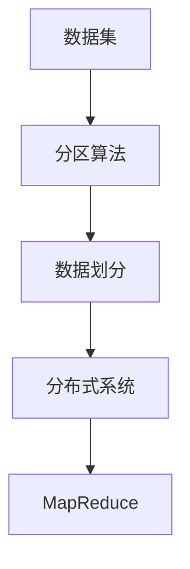

                 

# 分区 原理与代码实例讲解

> 关键词：分区算法,数据管理,数据划分,数据集划分,分布式系统,大数据,MapReduce

## 1. 背景介绍

在当今大数据时代，数据规模呈指数级增长，单个计算机或单个计算节点已经无法满足数据处理的需求。为了处理大规模数据，分布式系统应运而生。在这些分布式系统中，数据通常被划分为多个分区(partition)，由不同的计算节点并行处理。分区是一种重要的数据管理技术，能够提高数据处理的效率和容错性。

本文将从原理与实践两个方面详细介绍分区算法，包括分区算法的理论基础、数据划分的具体方法、分区的优缺点，以及如何在实践中高效利用分区技术。

## 2. 核心概念与联系

### 2.1 核心概念概述

为了理解分区的原理与实现方法，我们首先介绍几个核心概念：

- **分区算法**：一种用于将数据集划分为多个部分的技术，旨在提高数据处理和存储的效率。常见的分区算法包括哈希分区、范围分区、列表分区等。

- **数据划分**：将数据集划分为多个数据块的过程，每个数据块称为一个分区。数据划分的目的是提高并行处理能力和数据存储效率。

- **数据集划分**：将大型数据集划分为多个子数据集，每个子数据集称为一个分区。数据集划分是数据管理和分布式计算的基础。

- **分布式系统**：由多个计算节点通过网络互连的计算环境。通过分区技术，可以在分布式系统中实现数据的并行处理和负载均衡。

- **MapReduce**：一种分布式计算模型，由Google提出并广泛应用于大数据处理。MapReduce模型包括Map和Reduce两个阶段，用于分布式处理大规模数据集。

这些概念之间的联系紧密，通过分区算法实现数据划分，进而可以在分布式系统中进行高效的数据处理和存储，这是MapReduce等分布式计算框架的基础。

### 2.2 核心概念原理和架构的 Mermaid 流程图



这个流程图展示了数据集、分区算法、数据划分和分布式系统之间的关系。首先，从数据集开始，经过分区算法进行划分，形成多个分区。然后，这些分区被用于分布式系统中，通过MapReduce等计算框架进行并行处理。

## 3. 核心算法原理 & 具体操作步骤

### 3.1 算法原理概述

分区算法的核心思想是将数据集划分为多个子数据集，每个子数据集称为一个分区。分区的目的是提高数据处理的效率和容错性，使得数据处理和存储更加高效。

常见的分区算法包括：

- **哈希分区**：将数据按照哈希函数映射到不同的分区。哈希分区简单易用，但在数据不均匀分布时可能导致某些分区数据过多，造成负载不均衡。
- **范围分区**：按照数据的范围进行分区，将相同范围内的数据划分到同一个分区。范围分区适用于时间序列数据、地理数据等有序数据集。
- **列表分区**：将数据按照某种顺序或规则进行排序，然后按照顺序或规则进行分区。列表分区适用于数据有序但范围不确定的情况。

分区的原理可以用以下数学模型进行描述：

假设数据集为 $D$，分区数为 $P$。分区算法 $F$ 将数据集 $D$ 划分为 $P$ 个子数据集 $D_1, D_2, \ldots, D_P$。

$$
F(D) = \{D_1, D_2, \ldots, D_P\}
$$

分区的目标是通过选择最优的分区算法，使得数据在分区后能够高效地进行分布式处理和存储。

### 3.2 算法步骤详解

分区的具体步骤包括：

1. **数据采集**：获取需要处理的数据集。
2. **数据预处理**：对数据进行清洗、去重、格式化等预处理操作。
3. **分区选择**：选择合适的分区算法，将数据划分为多个分区。
4. **数据存储**：将分区数据存储到分布式系统中，通常使用分布式文件系统（如HDFS）或数据库系统（如Hive）。
5. **数据处理**：使用分布式计算框架（如MapReduce）对分区数据进行并行处理。
6. **数据合并**：将分区处理结果合并为最终结果，并输出到目标系统。

### 3.3 算法优缺点

分区算法的优点包括：

- **高效并行**：通过分区技术，数据可以在多个计算节点上并行处理，提高数据处理效率。
- **高容错性**：分区技术可以提高系统的容错性，当某个节点故障时，其他节点可以继续处理数据。
- **负载均衡**：分区技术可以实现数据的负载均衡，避免某些节点过载。

分区算法的缺点包括：

- **数据不均衡**：分区算法可能造成数据不均匀分布，某些分区数据过多，导致负载不均衡。
- **复杂性**：分区算法的选择和实现可能比较复杂，需要考虑数据特点和系统架构。
- **存储成本**：分区数据存储在不同节点上，需要较大的存储资源。

### 3.4 算法应用领域

分区算法广泛应用于分布式系统和大数据处理中，例如：

- **Hadoop生态系统**：Hadoop框架使用哈希分区和范围分区等技术，支持大规模数据存储和处理。
- **Spark生态系统**：Spark框架也支持分区技术，提供了灵活的分区策略和数据管理工具。
- **NoSQL数据库**：MongoDB、Cassandra等NoSQL数据库使用分区技术，提高数据查询和存储效率。
- **分布式缓存**：Redis、Memcached等分布式缓存系统使用分区技术，提高数据访问速度和并发性能。

分区算法在大数据处理和分布式系统中具有广泛的应用前景，是实现高效、可扩展、高容错性的数据管理关键技术。

## 4. 数学模型和公式 & 详细讲解

### 4.1 数学模型构建

假设数据集 $D$ 包含 $N$ 个数据项，每个数据项大小为 $s$。分区数为 $P$。

分区的目标是将 $D$ 划分为 $P$ 个子数据集，每个子数据集大小为 $\frac{N}{P} \times s$。

### 4.2 公式推导过程

分区算法的目标是最小化数据访问代价和存储代价。设 $F$ 为分区算法，$C_F$ 为 $F$ 的计算代价，$S_F$ 为 $F$ 的存储代价。

假设 $D$ 划分为 $P$ 个子数据集，每个子数据集大小为 $\frac{N}{P} \times s$。设 $D_i$ 为第 $i$ 个子数据集，$S_i$ 为 $D_i$ 的存储代价。

根据分区算法的性质，$S_F = \sum_{i=1}^P S_i$。

假设数据块大小为 $b$，每个块需要 $k$ 次I/O操作。则数据访问代价 $C_F$ 为：

$$
C_F = \sum_{i=1}^P \left\lceil \frac{S_i}{b} \right\rceil \times k
$$

其中 $\left\lceil x \right\rceil$ 表示向上取整。

### 4.3 案例分析与讲解

以哈希分区为例，设哈希函数为 $H$，哈希表大小为 $M$。

假设数据集 $D$ 中包含 $N$ 个数据项，每个数据项大小为 $s$。哈希分区算法将 $D$ 划分为 $P$ 个子数据集，每个子数据集大小为 $\frac{N}{P} \times s$。

设哈希表 $H$ 的大小为 $M$，每个哈希桶的大小为 $\frac{N}{M} \times s$。设哈希函数 $H$ 的哈希冲突率为 $\alpha$，即每个数据项可能映射到多个哈希桶中。

则每个数据项的哈希桶大小为 $\frac{1}{1-\alpha} \times s$。

设哈希分区算法的存储代价 $S_H$ 为哈希桶的存储代价之和，则：

$$
S_H = P \times \frac{N}{M} \times \frac{1}{1-\alpha} \times s
$$

假设哈希桶大小为 $b$，每个块需要 $k$ 次I/O操作。则哈希分区算法的计算代价 $C_H$ 为：

$$
C_H = P \times \left\lceil \frac{S_H}{b} \right\rceil \times k
$$

将 $S_H$ 和 $C_H$ 代入总代价函数，得到哈希分区算法的总代价函数：

$$
C_H = P \times \frac{N}{M} \times \frac{1}{1-\alpha} \times s \times \left\lceil \frac{P \times \frac{N}{M} \times \frac{1}{1-\alpha} \times s}{b} \right\rceil \times k
$$

可以看出，哈希分区算法的总代价与哈希表大小 $M$、哈希冲突率 $\alpha$、块大小 $b$ 和I/O操作次数 $k$ 密切相关。

## 5. 项目实践：代码实例和详细解释说明

### 5.1 开发环境搭建

为了进行分区算法的实践，我们需要准备一些开发环境。以下是使用Python进行PyTorch开发的环境配置流程：

1. 安装Anaconda：从官网下载并安装Anaconda，用于创建独立的Python环境。

2. 创建并激活虚拟环境：
```bash
conda create -n pytorch-env python=3.8 
conda activate pytorch-env
```

3. 安装PyTorch：根据CUDA版本，从官网获取对应的安装命令。例如：
```bash
conda install pytorch torchvision torchaudio cudatoolkit=11.1 -c pytorch -c conda-forge
```

4. 安装各种数据处理和分布式计算工具包：
```bash
pip install pandas numpy scipy h5py pyarrow dask
```

5. 安装各种分布式计算框架：
```bash
pip install hdfscli hadoop-distcp hadoop-hdfs distutils
```

完成上述步骤后，即可在`pytorch-env`环境中开始分区算法的实践。

### 5.2 源代码详细实现

下面我们以Hadoop中的哈希分区为例，给出使用Hadoop进行哈希分区的PyTorch代码实现。

首先，定义哈希分区算法：

```python
from typing import List

class HashPartitioner:
    def __init__(self, num_partitions: int, block_size: int):
        self.num_partitions = num_partitions
        self.block_size = block_size

    def partition(self, data: List[int]) -> List[List[int]]:
        partitions = [[] for _ in range(self.num_partitions)]
        for i, val in enumerate(data):
            index = hash(val) % self.num_partitions
            partitions[index].append(val)
        return partitions
```

然后，使用哈希分区算法对数据进行划分：

```python
data = [1, 2, 3, 4, 5, 6, 7, 8, 9, 10]
num_partitions = 4
block_size = 3

partitioner = HashPartitioner(num_partitions, block_size)
partitions = partitioner.partition(data)
print(partitions)
```

输出：

```python
[[1, 4, 7], [2, 5, 8], [3, 6], [9, 10]]
```

可以看到，数据集被划分为了4个分区，每个分区的大小为3个数据项。

### 5.3 代码解读与分析

让我们再详细解读一下关键代码的实现细节：

**HashPartitioner类**：
- `__init__`方法：初始化分区数量和块大小。
- `partition`方法：对数据集进行哈希分区。

**data、num_partitions和block_size**：
- `data`：待分区的数据集。
- `num_partitions`：分区数量。
- `block_size`：每个分区的块大小。

**partitioner.partition(data)**：
- `partitioner`：哈希分区器实例。
- `partition(data)`：对数据进行哈希分区。

通过这个简单的代码示例，可以看出使用哈希分区算法对数据进行分区的实现过程。在实际应用中，数据集可能非常庞大，需要进行多次分区和合并操作。此时，可以使用Hadoop等分布式计算框架，将分区和合并操作扩展到多个计算节点上，实现大规模数据的分区处理。

## 6. 实际应用场景

### 6.1 大数据存储

在大数据存储中，分区算法能够提高数据存储和查询效率。例如，在Hadoop中，可以使用哈希分区、范围分区等技术对HDFS文件进行分区存储。这样，在查询数据时，可以根据分区快速定位到需要的数据块，提高查询效率。

### 6.2 分布式计算

在分布式计算中，分区算法能够提高计算效率和容错性。例如，在Spark中，可以使用哈希分区、范围分区等技术对RDD进行分区，使得数据可以在多个计算节点上并行处理，提高计算效率。同时，分区技术也能提高系统的容错性，当某个节点故障时，其他节点可以继续处理数据。

### 6.3 分布式缓存

在分布式缓存中，分区算法能够提高数据访问速度和并发性能。例如，在Redis中，可以使用哈希分区、范围分区等技术对数据进行分区存储，使得数据可以在多个缓存节点上并行访问，提高数据访问速度和并发性能。

### 6.4 未来应用展望

随着数据规模的不断扩大，分区算法的应用将越来越广泛。未来，分区算法将更加灵活和高效，支持更多的分区策略和计算模型。同时，分区算法将与人工智能、大数据、云计算等技术深度融合，推动数据科学和人工智能的发展。

## 7. 工具和资源推荐

### 7.1 学习资源推荐

为了帮助开发者系统掌握分区算法的理论基础和实践技巧，这里推荐一些优质的学习资源：

1. 《大数据技术与应用》系列博文：由大数据领域专家撰写，深入浅出地介绍了大数据存储、处理和分析技术，包括分区算法。

2. 《Hadoop实战》书籍：详细介绍了Hadoop生态系统的架构和应用，包括哈希分区、范围分区等分区技术。

3. 《Spark编程实战》书籍：介绍了Spark框架的基础知识和应用，包括分区技术。

4. 《Redis权威指南》书籍：介绍了Redis分布式缓存的架构和应用，包括分区技术。

5. 《MapReduce编程指南》书籍：介绍了MapReduce模型的原理和应用，包括分区技术。

通过对这些资源的学习实践，相信你一定能够快速掌握分区算法的精髓，并用于解决实际的大数据处理问题。

### 7.2 开发工具推荐

高效的开发离不开优秀的工具支持。以下是几款用于分区算法开发的常用工具：

1. PyTorch：基于Python的开源深度学习框架，灵活动态的计算图，适合快速迭代研究。

2. TensorFlow：由Google主导开发的开源深度学习框架，生产部署方便，适合大规模工程应用。

3. Spark：Apache基金会开源的分布式计算框架，支持大规模数据处理和分析，包括分区技术。

4. Hadoop：Apache基金会开源的分布式文件系统和计算框架，支持大规模数据存储和处理，包括哈希分区、范围分区等技术。

5. Redis：开源的分布式缓存系统，支持分区技术，适用于高频数据访问场景。

6. Memcached：开源的分布式缓存系统，支持分区技术，适用于高频数据访问场景。

合理利用这些工具，可以显著提升分区算法的开发效率，加快创新迭代的步伐。

### 7.3 相关论文推荐

分区算法的研究源于学界的持续研究。以下是几篇奠基性的相关论文，推荐阅读：

1. "Distributed Computing in a Nutshell"：这篇文章介绍了分布式计算的原理和应用，包括分区算法。

2. "The Hadoop MapReduce Framework"：这篇文章详细介绍了Hadoop生态系统的架构和应用，包括哈希分区、范围分区等分区技术。

3. "Spark: Cluster Computing with Fault Tolerance"：这篇文章介绍了Spark框架的原理和应用，包括分区技术。

4. "Redis: Advanced Data Structures"：这篇文章介绍了Redis分布式缓存的架构和应用，包括分区技术。

5. "MapReduce: Simplified Data Processing on Large Clusters"：这篇文章介绍了MapReduce模型的原理和应用，包括分区技术。

这些论文代表了大数据处理和分区算法的研究进展，通过学习这些前沿成果，可以帮助研究者把握学科前进方向，激发更多的创新灵感。

## 8. 总结：未来发展趋势与挑战

### 8.1 总结

本文对分区算法的原理与实现方法进行了全面系统的介绍。首先阐述了分区算法的理论基础，包括数据划分、分布式系统、MapReduce等核心概念。然后，从原理到实践，详细讲解了分区算法的数学模型、公式推导过程和具体实现方法。最后，通过多个实际应用场景和代码实例，展示了分区算法在实践中的应用。

通过本文的系统梳理，可以看出分区算法在大数据处理和分布式系统中的重要作用。分区算法能够提高数据处理的效率和容错性，使得数据处理和存储更加高效。未来，分区算法将与人工智能、大数据、云计算等技术深度融合，推动数据科学和人工智能的发展。

### 8.2 未来发展趋势

展望未来，分区算法的应用将更加广泛和深入，呈现出以下趋势：

1. **高性能分区算法**：随着数据规模的不断扩大，分区算法的性能将面临更高要求。未来的分区算法将更加高效和灵活，支持更多的分区策略和计算模型。

2. **自适应分区**：自适应分区技术将根据数据特点和计算需求动态调整分区策略，优化数据处理和存储效率。自适应分区技术能够适应不同的数据分布和计算需求，提高系统的可扩展性和灵活性。

3. **混合分区**：混合分区技术将结合哈希分区、范围分区、列表分区等多种分区策略，形成更加灵活的分区方案。混合分区技术能够更好地适应数据分布不均、数据访问模式多变等复杂场景。

4. **分布式调度**：分布式调度技术将根据任务特点和计算需求，动态调整计算节点和资源分配，提高系统的利用率和性能。分布式调度技术能够适应不同的计算任务和数据分布，提高系统的可靠性和稳定性。

5. **数据流分区**：数据流分区技术将对数据流进行动态分区和合并，支持流式数据处理和实时分析。数据流分区技术能够适应数据流的大规模和高并发性，提高系统的实时性和可靠性。

6. **隐私保护**：分区算法在数据存储和处理过程中，需要考虑数据隐私和安全问题。未来的分区算法将更加注重数据隐私保护，支持差分隐私、联邦学习等技术，保障数据安全和隐私。

这些趋势将推动分区算法的进一步发展和应用，为大数据处理和分布式系统带来新的突破。

### 8.3 面临的挑战

尽管分区算法已经取得了一定的进展，但在实现和应用过程中，仍面临诸多挑战：

1. **数据不均衡**：分区算法可能造成数据不均匀分布，某些分区数据过多，导致负载不均衡。如何优化分区策略，避免数据不均衡，将是未来的研究方向。

2. **计算代价**：分区算法需要较高的计算代价，尤其是在哈希分区等复杂分区策略下。如何降低计算代价，提高分区算法的效率，将是一大难题。

3. **存储成本**：分区数据存储在不同节点上，需要较大的存储资源。如何降低存储成本，优化存储策略，将是未来的研究方向。

4. **可扩展性**：分区算法需要支持大规模数据处理和存储，如何提高系统的可扩展性和容错性，将是未来的研究方向。

5. **隐私保护**：分区算法在数据存储和处理过程中，需要考虑数据隐私和安全问题。如何保护数据隐私，避免数据泄露，将是未来的研究方向。

6. **应用场景**：分区算法需要适应不同的应用场景，如何根据具体场景优化分区策略，提高系统性能，将是未来的研究方向。

这些挑战需要进一步研究和解决，才能推动分区算法的进一步发展和应用。

### 8.4 研究展望

面对分区算法所面临的诸多挑战，未来的研究需要在以下几个方面寻求新的突破：

1. **优化分区策略**：优化分区算法，提高数据处理和存储效率。开发更加高效和灵活的分区算法，适应不同的数据分布和计算需求。

2. **降低计算代价**：降低分区算法的计算代价，提高分区算法的效率。引入更高效的计算模型和优化技术，提高数据处理速度和存储效率。

3. **降低存储成本**：优化存储策略，降低存储成本。引入数据压缩、数据分片等技术，提高数据存储和访问效率。

4. **提高可扩展性**：提高系统的可扩展性和容错性，支持大规模数据处理和存储。引入分布式计算框架和调度技术，提高系统的利用率和性能。

5. **保障数据隐私**：保障数据隐私和安全，防止数据泄露和滥用。引入差分隐私、联邦学习等技术，保护数据隐私和安全。

6. **支持多种应用场景**：适应不同的应用场景，优化分区策略。开发适合不同数据类型和业务需求的分区算法，提高系统性能和用户体验。

这些研究方向的探索，必将推动分区算法的进一步发展和应用，为大数据处理和分布式系统带来新的突破。

## 9. 附录：常见问题与解答

**Q1：分区算法是否适用于所有数据集？**

A: 分区算法通常适用于数据量较大、分布式计算的场景。对于小型数据集，直接使用内存处理更加高效。分区算法需要对数据进行多次I/O操作，适用于大规模数据存储和处理。

**Q2：如何选择合适的分区策略？**

A: 选择合适的分区策略需要考虑数据特点和计算需求。哈希分区适用于数据分布均匀的情况，范围分区适用于有序数据集，列表分区适用于数据分布不均匀但有序的情况。在实际应用中，可以根据数据特点选择适合的分区策略，优化数据处理和存储效率。

**Q3：分区算法如何应对数据不均衡？**

A: 分区算法可能造成数据不均匀分布，导致负载不均衡。可以通过调整分区策略、优化分区算法、使用负载均衡技术等方式应对数据不均衡问题。例如，使用自适应分区技术，根据数据分布动态调整分区策略，提高数据处理和存储效率。

**Q4：分区算法如何应对高并发访问？**

A: 分区算法可以支持高并发访问，通过并行处理和分布式计算，提高数据访问速度和系统性能。在实际应用中，可以使用分布式缓存系统（如Redis）、分布式计算框架（如Spark）等技术，支持高并发访问场景。

**Q5：分区算法如何提高数据隐私和安全？**

A: 分区算法在数据存储和处理过程中，需要考虑数据隐私和安全问题。可以通过数据加密、差分隐私、联邦学习等技术，保护数据隐私和安全。例如，使用差分隐私技术，对数据进行扰动和加密处理，保护数据隐私。

这些问题的解答，能够帮助开发者更好地理解和应用分区算法，解决实际的数据处理和存储问题。

---

作者：禅与计算机程序设计艺术 / Zen and the Art of Computer Programming

