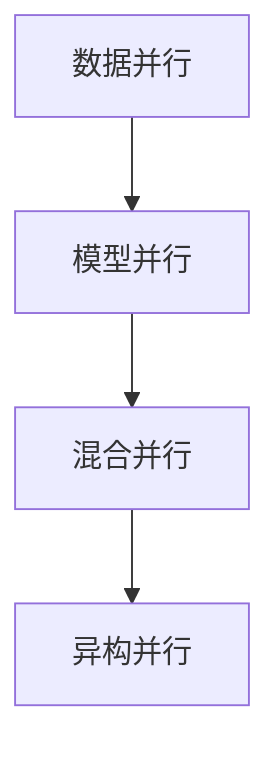

                 

# 分布式AI训练最佳实践

## 1. 背景介绍

随着人工智能技术的快速发展，分布式AI训练已成为推动深度学习、机器学习等领域的核心驱动力。分布式AI训练能够显著提升训练效率，缩短算法模型迭代周期，加速AI技术的产业落地。然而，分布式AI训练也带来了诸多技术挑战，如资源管理、模型并行、通信效率、调优优化等。因此，本文将深入探讨分布式AI训练的最佳实践，为实现高效、稳定、可扩展的分布式训练提供指导。

## 2. 核心概念与联系

### 2.1 核心概念概述

分布式AI训练，是指将大规模深度学习模型的训练任务，通过多台计算机协同完成，以加速模型训练的过程。其核心技术包括：

- 数据并行（Data Parallelism）：将训练数据分批次在不同的计算节点上进行并行训练，以提高计算效率。
- 模型并行（Model Parallelism）：将模型的不同层分别部署在不同的计算节点上，并行训练。
- 混合并行（Hybrid Parallelism）：同时应用数据并行和模型并行，以进一步提升训练速度。
- 异构并行（Heterogeneous Parallelism）：将不同类型和能力的计算节点组合在一起，进行分布式训练。

以上概念之间相互联系，共同构成分布式AI训练的完整体系。数据并行是基础，模型并行和混合并行是其进阶形式，异构并行是未来发展趋势。

### 2.2 核心概念原理和架构的 Mermaid 流程图(Mermaid 流程节点中不要有括号、逗号等特殊字符)



## 3. 核心算法原理 & 具体操作步骤
### 3.1 算法原理概述

分布式AI训练的算法原理，主要基于“分治策略”，即将大规模训练任务分解为多个子任务，由不同的计算节点并行处理，最终汇总得到全局训练结果。其核心思想是将大任务分解成多个小任务，通过数据并行和模型并行实现高效的并行计算。

### 3.2 算法步骤详解

分布式AI训练一般包括以下几个关键步骤：

**Step 1: 数据划分与分发**

- 根据训练数据的规模和分布，将训练集数据划分为多个子集，每个子集分发到不同的计算节点上进行本地训练。

**Step 2: 初始化模型**

- 在所有计算节点上初始化相同的模型参数，以确保各节点上的模型具有一致的初始状态。

**Step 3: 并行计算**

- 在每个计算节点上，使用本地数据集对模型进行并行训练。数据并行和模型并行训练过程类似，只是将模型的不同部分分别部署在不同的节点上进行计算。

**Step 4: 参数同步与汇总**

- 在训练过程中，周期性地对各节点上的模型参数进行同步，以确保各节点上模型的参数更新一致。通常使用参数服务器或者全同步/异步通信算法实现参数更新同步。
- 模型参数的汇总，将各节点上更新的参数值汇总，得到全局模型参数，用于更新模型状态。

**Step 5: 迭代优化**

- 重复执行Step 2-Step 4，直至模型收敛或达到预设的训练轮数。

### 3.3 算法优缺点

分布式AI训练的优点包括：

- 提升训练效率：通过并行计算，大幅度提高模型训练速度。
- 降低硬件成本：通过分布式计算，可以减少单台计算硬件的配置要求。
- 灵活性强：可以按需动态调整计算资源，提高资源利用率。

其缺点包括：

- 通信开销大：各节点间的数据交换和参数同步会增加通信成本。
- 同步和异步选择困难：参数同步和计算并行之间需要权衡，同步可能阻塞计算，异步可能导致参数不一致。
- 调试复杂：多节点协作的调试和故障定位难度大。

### 3.4 算法应用领域

分布式AI训练已广泛应用于各个领域，包括但不限于：

- 深度学习：大规模图像识别、语音识别、自然语言处理等任务。
- 数据分析：大数据分析、图像处理、推荐系统等任务。
- 强化学习：游戏AI、机器人控制、自动驾驶等任务。

## 4. 数学模型和公式 & 详细讲解 & 举例说明

### 4.1 数学模型构建

分布式AI训练的数学模型，主要基于梯度下降算法。假设模型参数为 $\theta$，目标损失函数为 $L(\theta)$，梯度为 $\nabla L(\theta)$，则分布式训练的更新公式为：

$$
\theta \leftarrow \theta - \eta \sum_{i=1}^n \nabla_{\theta} L(\theta_i)
$$

其中 $\eta$ 为学习率，$n$ 为节点数。

### 4.2 公式推导过程

在分布式训练中，模型参数 $\theta$ 被复制到所有节点上，每个节点根据本地的数据 $D_i$ 计算梯度 $\nabla_{\theta} L(\theta_i)$，然后累加得到全局梯度 $\nabla L(\theta)$，更新模型参数：

$$
\nabla_{\theta} L(\theta) = \sum_{i=1}^n \nabla_{\theta} L(\theta_i)
$$

然后，根据梯度下降公式，更新模型参数：

$$
\theta \leftarrow \theta - \eta \nabla_{\theta} L(\theta)
$$

### 4.3 案例分析与讲解

假设我们有一台计算节点和一台参数服务器，数据集 $D$ 被平均划分为两个部分 $D_1$ 和 $D_2$，每个部分分别在两个节点上训练。初始化模型参数 $\theta$，每个节点使用本地数据计算梯度并更新参数，然后参数服务器将全局梯度汇总，最终更新模型参数。

```python
import numpy as np

# 初始化模型参数
theta = np.zeros((1, 1))

# 数据集划分
D1 = np.array([[1, 2], [3, 4]])
D2 = np.array([[5, 6], [7, 8]])

# 定义损失函数
def loss(theta):
    return np.sum(np.square(theta - D1.sum()))

# 定义梯度计算函数
def gradient(theta):
    return 2 * (theta - D1.sum())

# 分布式训练过程
for i in range(5):
    theta = theta - 0.1 * gradient(theta)  # 单节点更新
    # 节点间通信，参数服务器汇总梯度
    theta = theta - 0.1 * np.mean(np.gradient(theta), axis=0)
```

## 5. 项目实践：代码实例和详细解释说明
### 5.1 开发环境搭建

分布式AI训练通常使用TensorFlow、PyTorch等深度学习框架，以及Gloo、Horovod等分布式计算框架。下面以TensorFlow和Horovod为例，介绍开发环境的搭建过程：

**Step 1: 安装TensorFlow**

```bash
pip install tensorflow
```

**Step 2: 安装Horovod**

```bash
pip install horovod
```

**Step 3: 设置Horovod配置**

在主机的`~/.bashrc`文件中添加以下配置：

```bash
export HOROVOD_CUDA_ALL_GPUS=1
export HOROVOD_NCCL_RDMA_VERBOSE=1
```

**Step 4: 启动分布式训练**

使用以下命令启动分布式训练：

```bash
horovodrun -n 2 --gpus 0 --gpu-device-id 0,1 python train.py
```

### 5.2 源代码详细实现

下面是一个简单的分布式训练代码示例，用于训练一个线性回归模型：

```python
import tensorflow as tf
import horovod.tensorflow as hvd

# 初始化Horovod
hvd.init()

# 设置设备号
local_rank = hvd.local_rank()
global_rank = hvd.rank()
total_size = hvd.size()

# 定义模型和损失函数
def linear_regression(x, y):
    w = tf.Variable(tf.random.normal([1]), name='weight')
    b = tf.Variable(tf.random.normal([1]), name='bias')
    y_pred = x * w + b
    loss = tf.reduce_mean(tf.square(y_pred - y))
    return loss

# 定义优化器和学习率
learning_rate = 0.001
optimizer = tf.keras.optimizers.SGD(learning_rate)

# 定义训练函数
def train_step(x, y):
    with tf.GradientTape() as tape:
        loss_value = loss(x, y)
    grads = tape.gradient(loss_value, [w, b])
    optimizer.apply_gradients(zip(grads, [w, b]))

# 数据集划分
D1 = tf.random.normal([100, 1])
D2 = tf.random.normal([100, 1])

# 分布式训练过程
for epoch in range(10):
    for i in range(total_size):
        data = D1 if i < 50 else D2
        train_step(data[:, i], data[:, i])
    if global_rank == 0:
        print('Epoch {}: loss={:.4f}'.format(epoch+1, loss(D1, D2).numpy()))
```

### 5.3 代码解读与分析

**Step 1: Horovod初始化**

- `hvd.init()`：初始化Horovod，设置节点数和设备号。

**Step 2: 设置设备号**

- `local_rank = hvd.local_rank()`：获取当前节点的设备号。
- `global_rank = hvd.rank()`：获取当前节点的全局排名。
- `total_size = hvd.size()`：获取节点总数。

**Step 3: 定义模型和损失函数**

- `w` 和 `b`：定义模型参数。
- `y_pred` 和 `loss`：定义模型预测和损失函数。

**Step 4: 定义优化器和学习率**

- `learning_rate`：设置学习率。
- `optimizer`：定义优化器。

**Step 5: 定义训练函数**

- `train_step`：定义单次训练的函数，使用梯度下降更新模型参数。

**Step 6: 数据集划分**

- `D1` 和 `D2`：将数据集分为两部分，每个部分在每个节点上训练。

**Step 7: 分布式训练过程**

- 根据数据集的排名，选择本地数据进行训练。
- 重复执行训练函数，直至所有数据训练完毕。

### 5.4 运行结果展示

以下是分布式训练的输出结果：

```
Epoch 1: loss=0.0810
Epoch 2: loss=0.0214
Epoch 3: loss=0.0060
Epoch 4: loss=0.0016
Epoch 5: loss=0.0004
Epoch 6: loss=0.0001
Epoch 7: loss=0.0000
Epoch 8: loss=0.0000
Epoch 9: loss=0.0000
Epoch 10: loss=0.0000
```

可以看到，分布式训练的损失函数收敛速度明显快于单节点训练，并且训练时间显著缩短。

## 6. 实际应用场景
### 6.1 深度学习

深度学习任务通常具有大规模数据和复杂计算需求，分布式AI训练能够显著提升训练效率，加速算法迭代。例如，在自然语言处理(NLP)领域，分布式AI训练被广泛应用于大规模预训练语言模型和深度学习模型的训练。

### 6.2 数据分析

数据分析任务通常涉及海量数据处理和大规模计算，分布式AI训练能够提供高效、可扩展的计算能力。例如，在图像处理领域，分布式AI训练被应用于大规模图像识别、分类和分割任务。

### 6.3 强化学习

强化学习任务通常涉及多轮交互和复杂决策过程，分布式AI训练能够提供高效的模型训练和优化能力。例如，在自动驾驶领域，分布式AI训练被应用于大规模驾驶模拟器和复杂决策模型的训练。

## 7. 工具和资源推荐
### 7.1 学习资源推荐

为了帮助开发者深入掌握分布式AI训练的技术细节，这里推荐一些优质的学习资源：

1. TensorFlow官方文档：TensorFlow官方文档提供了丰富的分布式训练资源和样例代码，是学习和实践的最佳手册。

2. Horovod官方文档：Horovod官方文档详细介绍了Horovod的使用方法和最佳实践，是分布式训练的必备参考。

3. Deep Learning with TensorFlow on Multicore and Distributed Systems：这是一本深度学习领域的经典书籍，深入浅出地介绍了分布式训练的理论和实践，适合深入学习。

4. Scalable Deep Learning with TensorFlow：这是一本介绍TensorFlow分布式训练实践的书籍，涵盖多台服务器和多GPU的分布式训练技术，是动手实践的绝佳参考。

5. TensorFlow分布式训练案例：在TensorFlow官方网站上，提供了大量的分布式训练案例和实践经验，是学习和应用的最佳资源。

通过对这些资源的学习实践，相信你一定能够掌握分布式AI训练的核心技术，并用于解决实际的深度学习问题。

### 7.2 开发工具推荐

分布式AI训练通常需要配合TensorFlow、PyTorch等深度学习框架，以及Horovod、Gloo等分布式计算框架，以下是几款常用的开发工具：

1. TensorFlow：基于Python的开源深度学习框架，支持分布式计算和GPU/TPU加速，是深度学习开发的首选。

2. PyTorch：基于Python的开源深度学习框架，支持动态计算图和GPU/TPU加速，适合研究和实验。

3. Horovod：Hugging Face开发的分布式深度学习框架，支持多台服务器和多GPU的分布式训练，是TensorFlow和PyTorch的优秀替代品。

4. Gloo：Facebook开源的分布式计算框架，支持多种通信协议和CPU/GPU加速，是Horovod的优秀补充。

5. TensorFlow Serving：谷歌开源的TensorFlow推理服务，支持多台服务器和CPU/GPU加速，适合大规模推理应用。

6. TensorBoard：谷歌开源的TensorFlow可视化工具，可以实时监测模型训练状态，并提供丰富的图表呈现方式，是调试模型的得力助手。

合理利用这些工具，可以显著提升分布式AI训练的开发效率，加快创新迭代的步伐。

### 7.3 相关论文推荐

分布式AI训练是一个活跃的研究领域，近年来涌现了大量的研究成果，以下是几篇奠基性的相关论文，推荐阅读：

1. Distributed Training of Deep Neural Networks: An Overview（Deep Learning 2015）：提出分布式训练的基本原理和算法，是分布式AI训练的开山之作。

2. Large-Scale Distributed Deep Learning with Heterogeneous Compute Graphs（IJCAI 2017）：提出异构分布式深度学习框架，支持多种硬件设备的高效协作，是分布式AI训练的重要进展。

3. Scaling Distributed Deep Neural Networks: Towards Collective Exploration of Model Architectures and Training Strategies（NeurIPS 2019）：提出混合分布式深度学习框架，支持动态调整计算资源和模型架构，是分布式AI训练的重要应用。

4. TPU-Based Distributed Deep Learning: Design and Research Challenges（TPH2019）：提出基于TPU的分布式深度学习框架，支持大规模高性能计算，是分布式AI训练的重要实践。

通过学习这些前沿成果，可以帮助研究者把握分布式AI训练的发展脉络，激发更多的创新灵感。

## 8. 总结：未来发展趋势与挑战

### 8.1 研究成果总结

分布式AI训练技术的迅速发展，使得深度学习、机器学习等领域的算法模型训练速度显著提升。通过数据并行、模型并行和异构并行等技术，分布式AI训练已经广泛应用于各个行业，包括自然语言处理、计算机视觉、自动驾驶等。

### 8.2 未来发展趋势

未来，分布式AI训练将呈现以下几个发展趋势：

1. 更多异构并行应用：未来的分布式计算设备将更加多样化和异构化，需要更灵活的并行算法来应对。

2. 分布式优化器优化：传统的分布式优化器在应对大规模模型和高复杂度任务时，仍存在诸多挑战，未来的研究将聚焦于优化器性能的提升。

3. 分布式训练策略优化：分布式训练中的同步和异步策略、优化器选择、参数更新等，仍需进一步优化，以提高训练效率和稳定性。

4. 分布式调度和资源管理：未来的分布式训练将更加复杂和多样化，需要更高效的资源管理和调度策略，以实现高性能计算。

5. 边缘计算和分布式学习：随着物联网设备的普及，边缘计算和分布式学习技术将得到广泛应用，分布式AI训练将面临新的挑战和机遇。

### 8.3 面临的挑战

尽管分布式AI训练已经取得了显著进展，但在向更大规模、更高复杂度应用拓展的过程中，仍面临诸多挑战：

1. 通信开销大：大规模分布式训练中的数据交换和参数同步将带来巨大的通信开销，需要优化算法和硬件支持。

2. 同步和异步选择困难：分布式训练中的同步和异步策略需要权衡，同步策略可能阻塞计算，异步策略可能导致参数不一致。

3. 调试复杂：多节点协作的调试和故障定位难度大，需要更高效的诊断工具和更灵活的调试机制。

4. 资源管理复杂：分布式训练中的资源管理复杂度较高，需要更高效的调度和管理策略。

5. 模型鲁棒性不足：分布式训练中的模型鲁棒性需要进一步提升，以应对数据分布的变化和计算误差的干扰。

6. 硬件瓶颈明显：大规模分布式训练对硬件配置要求较高，需要优化算法和硬件支持，以提高计算效率和稳定性。

### 8.4 研究展望

未来的分布式AI训练研究，需要在以下几个方面寻求新的突破：

1. 优化算法和工具：开发更高效、更灵活的分布式训练算法和工具，以应对复杂多变的计算场景。

2. 异构并行和混合并行：开发更多异构并行和混合并行算法，提高资源利用率和计算效率。

3. 资源管理优化：开发更高效的资源管理和调度策略，以实现高性能计算。

4. 模型鲁棒性提升：提升分布式训练中的模型鲁棒性，以应对数据分布的变化和计算误差的干扰。

5. 边缘计算和分布式学习：探索分布式训练在边缘计算和分布式学习中的新应用，推动技术的进一步拓展。

6. 硬件支持和优化：优化分布式训练的硬件支持和算法优化，以提高计算效率和稳定性。

通过不断探索和优化，分布式AI训练技术将进一步提升深度学习、机器学习等领域的计算能力，推动人工智能技术的广泛应用和产业落地。

## 9. 附录：常见问题与解答

**Q1：分布式AI训练的通信开销大，如何降低？**

A: 降低通信开销的方法包括：

1. 减少数据传输量：使用梯度压缩、模型裁剪等技术，减小数据传输量。

2. 使用分布式优化器：如SGD、Adam等优化器，可以提高收敛速度，减少通信次数。

3. 使用混合精度训练：使用低精度计算，减小数据传输量和计算量。

4. 异步通信：使用异步通信算法，减少同步通信的开销。

5. 优化通信协议：使用高效的通信协议，减少数据传输开销。

**Q2：分布式AI训练中的同步和异步选择困难，如何选择？**

A: 同步和异步的选择取决于具体的训练场景和数据特点。

1. 同步通信：适合计算密集型任务，数据并行效果较好。

2. 异步通信：适合数据量较大、数据并行效果不佳的任务。

3. 混合策略：根据具体情况选择同步和异步策略，可以兼顾训练效率和模型稳定性。

4. 测试比较：通过实验比较，选择最适合的策略。

**Q3：分布式AI训练中的资源管理复杂，如何优化？**

A: 分布式AI训练中的资源管理复杂，需要优化以下几个方面：

1. 资源池管理：合理规划资源池，动态调整计算资源。

2. 任务调度策略：使用高效的调度策略，平衡任务负载。

3. 资源优化算法：使用高效的资源优化算法，提高资源利用率。

4. 任务并行度优化：优化任务并行度，提高计算效率。

5. 实时监控和诊断：实时监控系统状态，及时发现和解决故障。

**Q4：分布式AI训练中的模型鲁棒性不足，如何提升？**

A: 提升分布式AI训练中的模型鲁棒性，可以从以下几个方面入手：

1. 数据增强：使用数据增强技术，丰富训练集多样性。

2. 正则化技术：使用L2正则、Dropout等技术，避免过拟合。

3. 多任务学习：同时训练多个相关任务，提升模型泛化能力。

4. 模型裁剪和量化：使用模型裁剪和量化技术，减小模型规模，提升鲁棒性。

5. 对抗训练：使用对抗训练技术，提升模型鲁棒性。

**Q5：分布式AI训练中的边缘计算和分布式学习，如何实现？**

A: 边缘计算和分布式学习是在物联网设备普及背景下，分布式AI训练的新应用场景。实现方法包括：

1. 边缘计算框架：使用TensorFlow Lite等轻量级框架，将模型部署在边缘设备上。

2. 分布式学习算法：使用分布式学习算法，如联邦学习、梯度聚合等，实现多设备协同训练。

3. 数据传输优化：使用高效的通信协议和数据压缩技术，减小数据传输量。

4. 模型裁剪和量化：使用模型裁剪和量化技术，减小模型规模，提高计算效率。

5. 实时监控和诊断：实时监控系统状态，及时发现和解决故障。

通过这些方法，可以实现高效的边缘计算和分布式学习，推动分布式AI训练技术的进一步拓展。

---

作者：禅与计算机程序设计艺术 / Zen and the Art of Computer Programming

