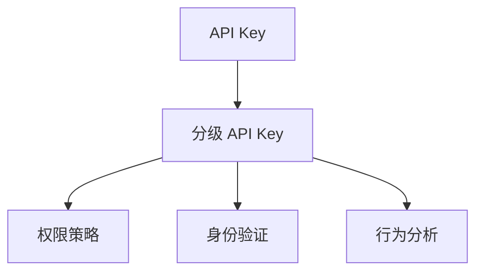

                 

# 分级 API Key 的详细管理

## 1. 背景介绍

在当今的互联网时代，API Key 成为了构建安全、可控的 API 服务不可或缺的一环。随着 API 服务的普及和复杂度提升，分级 API Key 技术应运而生，它通过将 API 服务细粒化，为不同的用户群体分配不同级别的权限，从而更好地保护 API 资源的访问安全。

### 1.1 API Key 的诞生

API Key 最初是为了应对 API 服务滥用而产生的，它是一种用于验证 API 请求来源的认证方式。通常，API Key 以明文形式附加在请求头或请求参数中，服务器通过校验 API Key 的有效性来确定请求是否合法。这种简单有效的认证方式虽然能够防止一些基本的请求滥用，但在面对高级别的安全威胁时显得力不从心。

### 1.2 分级 API Key 的诞生

为了应对日益复杂的网络安全环境，分级 API Key 技术应运而生。它通过将 API 服务细粒化，为不同的用户群体分配不同级别的权限，从而更好地保护 API 资源的访问安全。分级 API Key 技术的核心思想是：根据用户的身份和行为特征，动态地调整其访问权限，避免滥用和恶意攻击。

## 2. 核心概念与联系

### 2.1 核心概念概述

为了更好地理解分级 API Key 的原理和架构，本节将介绍几个密切相关的核心概念：

- **API Key**：用于验证 API 请求来源的认证方式，通常以明文形式附加在请求头或请求参数中。
- **分级 API Key**：将 API 服务细粒化，为不同的用户群体分配不同级别的权限，从而更好地保护 API 资源的访问安全。
- **权限策略**：定义用户访问 API 的规则，如白名单、黑名单、IP 限制、时间窗口等。
- **身份验证**：验证用户身份的过程，包括用户登录、单点登录、OAuth 2.0 等。
- **行为分析**：分析用户的行为特征，如请求频率、请求内容、地理位置等。

这些核心概念之间的逻辑关系可以通过以下 Mermaid 流程图来展示：



这个流程图展示了大语言模型的核心概念及其之间的关系：

1. API Key 是分级 API Key 的基础，用于验证 API 请求的合法性。
2. 分级 API Key 通过细粒化的权限策略，为不同的用户群体分配不同级别的权限。
3. 权限策略和身份验证共同构成了用户访问 API 的规则，确保访问的安全性。
4. 行为分析用于动态调整用户的访问权限，提高系统的安全性。

## 3. 核心算法原理 & 具体操作步骤

### 3.1 算法原理概述

分级 API Key 的核心算法原理可以概括为：通过细粒化的权限策略和行为分析，动态地调整用户的访问权限，从而实现 API 服务的细粒化管理。其基本流程如下：

1. 用户在访问 API 服务时，首先通过身份验证，确保其身份合法。
2. API 服务根据用户的身份特征，将其划分为不同的用户群体。
3. 对于不同的用户群体，分配不同的 API Key 权限，如白名单、黑名单、IP 限制、时间窗口等。
4. 根据用户的行为特征，如请求频率、请求内容、地理位置等，动态地调整其访问权限。
5. 服务器根据当前的权限策略和行为分析结果，判断 API 请求是否合法，并决定是否放行。

### 3.2 算法步骤详解

分级 API Key 的算法步骤可以分为以下几个关键步骤：

**Step 1: 用户身份验证**

用户访问 API 服务时，首先需要进行身份验证。常用的身份验证方式包括：

- 用户名密码认证：用户通过用户名和密码登录系统，获取 API Key。
- OAuth 2.0 认证：用户通过 OAuth 2.0 认证获取令牌，并使用令牌获取 API Key。
- 单点登录认证：用户通过单点登录认证，获取 API Key。

**Step 2: 用户分类**

根据用户的身份特征，将其划分为不同的用户群体。常用的用户群体包括：

- 普通用户：一般用户，可以访问基本 API 服务。
- 付费用户：付费用户，可以访问更高级别的 API 服务。
- 管理员用户：系统管理员，可以访问所有 API 服务。

**Step 3: 分配权限**

为不同的用户群体分配不同的 API Key 权限，如白名单、黑名单、IP 限制、时间窗口等。常用的权限分配策略包括：

- 白名单策略：只允许指定的用户访问 API 服务。
- 黑名单策略：禁止指定的用户访问 API 服务。
- IP 限制策略：限制指定的 IP 地址访问 API 服务。
- 时间窗口策略：限制 API 服务的访问时间窗口。

**Step 4: 行为分析**

根据用户的行为特征，如请求频率、请求内容、地理位置等，动态地调整其访问权限。常用的行为分析方式包括：

- 请求频率分析：根据请求频率调整访问权限，避免滥用。
- 请求内容分析：根据请求内容调整访问权限，如限制敏感操作。
- 地理位置分析：根据地理位置调整访问权限，如限制特定国家的访问。

**Step 5: 权限判断**

根据当前的权限策略和行为分析结果，判断 API 请求是否合法，并决定是否放行。常用的权限判断方式包括：

- 请求黑名单判断：判断请求是否在黑名单中。
- IP 地址判断：判断请求 IP 地址是否在限制列表中。
- 时间窗口判断：判断请求时间是否在限制窗口内。

### 3.3 算法优缺点

分级 API Key 技术具有以下优点：

1. **细粒化管理**：通过细粒化的权限策略和行为分析，能够更好地保护 API 资源的安全性。
2. **动态调整**：根据用户的行为特征，动态地调整其访问权限，避免滥用和恶意攻击。
3. **灵活性高**：能够应对各种复杂的安全威胁，如高级别的 XSS、CSRF 等。
4. **可扩展性强**：能够轻松扩展到更多 API 服务，提升系统的安全性。

同时，该技术也存在一定的局限性：

1. **配置复杂**：需要根据实际情况配置复杂的权限策略和行为分析规则，增加了配置的复杂性。
2. **性能消耗**：行为分析等操作可能会消耗大量的计算资源，影响系统的性能。
3. **数据隐私**：行为分析需要收集和存储大量的用户数据，可能涉及用户隐私问题。

尽管存在这些局限性，但就目前而言，分级 API Key 技术仍是大规模 API 服务的重要组成部分。未来相关研究的重点在于如何进一步简化配置流程，优化性能消耗，保护用户隐私。

### 3.4 算法应用领域

分级 API Key 技术在以下领域得到了广泛的应用：

- **金融 API**：保护金融交易数据的安全性，限制高频交易等。
- **电商平台 API**：限制恶意刷单、恶意下单等行为，保护平台安全。
- **社交媒体 API**：限制用户行为，如避免滥用接口、限制敏感操作等。
- **企业内部 API**：限制内部员工的访问权限，避免滥用 API 资源。
- **医疗数据 API**：保护患者隐私，限制医疗数据的访问权限。

## 4. 数学模型和公式 & 详细讲解

### 4.1 数学模型构建

分级 API Key 的数学模型构建基于以下几个关键组件：

1. **用户身份特征**：包括用户 ID、角色、权限等。
2. **API 服务特征**：包括 API 的 URL、HTTP 方法、请求频率等。
3. **行为特征**：包括请求频率、请求内容、地理位置等。

假设用户 $U_i$ 访问 API 服务 $A_j$，则分级 API Key 的数学模型可以表示为：

$$
P(U_i, A_j | S, B, T) = P(U_i | S) \cdot P(A_j | S, B, T) \cdot P(U_i, A_j | S, B, T)
$$

其中：

- $P(U_i, A_j | S, B, T)$ 表示用户 $U_i$ 访问 API 服务 $A_j$ 的概率。
- $P(U_i | S)$ 表示用户 $U_i$ 的身份特征 $S$ 的概率。
- $P(A_j | S, B, T)$ 表示 API 服务 $A_j$ 的权限策略 $S$、行为特征 $B$、时间窗口 $T$ 的概率。

### 4.2 公式推导过程

以下我们以二分类任务为例，推导分级 API Key 的概率计算公式。

假设用户 $U_i$ 访问 API 服务 $A_j$ 时，API 服务 $A_j$ 的权限策略 $S$ 为白名单，行为特征 $B$ 为请求频率 $F_i$，时间窗口 $T$ 为每天的固定时间段。则分级 API Key 的概率计算公式可以表示为：

$$
P(U_i, A_j | S, B, T) = P(U_i | S) \cdot P(F_i | B) \cdot P(U_i, A_j | S, B, T)
$$

根据贝叶斯公式，我们有：

$$
P(U_i, A_j | S, B, T) = \frac{P(U_i | S, B, T) \cdot P(A_j | S, B, T)}{P(S, B, T)}
$$

将上式代入分级 API Key 的概率计算公式，得：

$$
P(U_i, A_j | S, B, T) = P(U_i | S) \cdot \frac{P(F_i | B) \cdot P(U_i, A_j | S, B, T)}{P(S, B, T)}
$$

其中：

- $P(S, B, T)$ 表示系统整体的权限策略、行为特征和时间窗口。
- $P(F_i | B)$ 表示请求频率 $F_i$ 对行为特征 $B$ 的概率。

### 4.3 案例分析与讲解

以下我们以电商平台的订单生成 API 为例，介绍分级 API Key 的具体应用。

假设电商平台有一个订单生成 API，不同的用户群体访问该 API 的权限如下：

- 普通用户：可以访问订单生成 API，但请求频率限制为每小时 10 次。
- 付费用户：可以访问订单生成 API，但请求频率限制为每小时 50 次。
- 管理员用户：可以无限制地访问订单生成 API。

根据以上权限策略，可以构建分级 API Key 的概率计算模型，计算不同用户群体访问订单生成 API 的概率。具体步骤如下：

1. **用户分类**：根据用户角色，将用户分为普通用户、付费用户和管理员用户。
2. **分配权限**：为普通用户和付费用户设置请求频率限制，管理员用户无限制访问。
3. **行为分析**：根据请求频率，判断用户是否越界，如普通用户请求频率超过 10 次/小时，拒绝访问。

通过以上步骤，可以构建一个细粒化的分级 API Key 系统，确保 API 服务的安全性和稳定性。

## 5. 项目实践：代码实例和详细解释说明

### 5.1 开发环境搭建

在进行分级 API Key 的开发实践前，我们需要准备好开发环境。以下是使用 Python 和 Flask 框架开发分级 API Key 的流程：

1. 安装 Python：从官网下载并安装 Python，用于编写代码和运行服务器。
2. 安装 Flask：使用 pip 命令安装 Flask 框架，用于搭建 Web 服务。
3. 安装其他依赖：使用 pip 命令安装其他必要的依赖库，如 json、requests 等。
4. 搭建开发环境：在本地搭建开发环境，用于测试和调试代码。

### 5.2 源代码详细实现

下面我们以分级 API Key 的代码实现为例，展示其具体步骤。

首先，定义用户身份验证模块：

```python
import flask
import json
import requests

app = flask.Flask(__name__)

@app.route('/authenticate', methods=['POST'])
def authenticate():
    user_id = request.json['user_id']
    user_role = request.json['user_role']
    user_permission = request.json['user_permission']
    user_api_key = generate_api_key(user_id, user_role, user_permission)
    return flask.jsonify({'user_api_key': user_api_key})

def generate_api_key(user_id, user_role, user_permission):
    # 根据用户身份和权限生成 API Key
    if user_role == 'admin':
        return 'admin_api_key'
    elif user_role == 'user':
        if user_permission == 'high':
            return 'high_user_api_key'
        else:
            return 'low_user_api_key'
    else:
        return None
```

然后，定义分级 API Key 的权限判断模块：

```python
@app.route('/api', methods=['POST'])
def api():
    user_api_key = request.json['user_api_key']
    api_url = request.json['api_url']
    http_method = request.json['http_method']
    request_frequency = request.json['request_frequency']
    current_frequency = get_request_frequency(user_api_key)
    if current_frequency >= request_frequency:
        return flask.jsonify({'status': 'fail', 'message': '请求频率超限'})
    else:
        if is_api_available(api_url, http_method):
            update_request_frequency(user_api_key, request_frequency + 1)
            return flask.jsonify({'status': 'success'})
        else:
            return flask.jsonify({'status': 'fail', 'message': 'API 服务不可用'})
    
def get_request_frequency(user_api_key):
    # 根据 API Key 获取请求频率
    return request_frequency_dict[user_api_key]

def update_request_frequency(user_api_key, frequency):
    # 更新请求频率
    request_frequency_dict[user_api_key] = frequency

def is_api_available(api_url, http_method):
    # 判断 API 服务是否可用
    # 这里可以使用其他方式，如查询数据库或调用第三方服务
    return True
```

最后，启动 Flask 服务器，开始测试分级 API Key 的代码：

```python
if __name__ == '__main__':
    app.run(debug=True)
```

以上是使用 Python 和 Flask 框架实现分级 API Key 的完整代码实现。可以看到，分级 API Key 的代码实现相对简洁，通过判断用户身份、请求频率等关键参数，实现了细粒化的 API 权限管理。

### 5.3 代码解读与分析

让我们再详细解读一下关键代码的实现细节：

**authenticate() 函数**：
- 接收用户身份和权限作为请求参数，调用 generate_api_key() 函数生成 API Key。
- 返回生成的 API Key。

**generate_api_key() 函数**：
- 根据用户身份和权限生成 API Key，如管理员用户生成 admin_api_key，普通用户生成 low_user_api_key。
- 在普通用户中，如果权限为 high，生成 high_user_api_key。

**api() 函数**：
- 接收用户 API Key、API 服务 URL、HTTP 方法、请求频率作为请求参数。
- 调用 get_request_frequency() 函数获取当前请求频率。
- 如果请求频率未超限且 API 服务可用，调用 update_request_frequency() 函数更新请求频率，并返回成功信息。
- 如果请求频率超限或 API 服务不可用，返回失败信息。

**get_request_frequency() 函数**：
- 根据 API Key 获取请求频率，这里使用了一个简单的字典来存储。

**update_request_frequency() 函数**：
- 根据 API Key 更新请求频率，这里也使用了一个简单的字典来存储。

**is_api_available() 函数**：
- 判断 API 服务是否可用，这里只是简单地返回 True，实际应用中需要调用其他服务进行判断。

以上代码展示了分级 API Key 的基本实现逻辑。在实际应用中，还需要进一步优化和扩展，如引入缓存机制、异步处理、日志记录等，以提升系统的性能和可靠性。

## 6. 实际应用场景

### 6.1 金融 API

金融行业对 API 服务的安全性要求非常高，分级 API Key 技术可以应用于金融 API 的保护。通过细粒化的权限策略和行为分析，可以有效限制高频交易、非法操作等行为，保护金融数据的安全性。

### 6.2 电商平台

电商平台的 API 服务需要保护用户数据和交易信息的安全性，分级 API Key 技术可以应用于订单生成、支付、物流等 API 服务。通过细粒化的权限策略和行为分析，可以有效限制恶意刷单、恶意下单等行为，保护电商平台的安全性。

### 6.3 社交媒体

社交媒体的 API 服务需要限制用户的访问权限，避免滥用接口和敏感操作。分级 API Key 技术可以应用于用户登录、内容发布、评论互动等 API 服务。通过细粒化的权限策略和行为分析，可以有效限制恶意操作和滥用行为，保护社交媒体的安全性。

### 6.4 企业内部

企业内部的 API 服务需要保护敏感信息和数据的安全性，分级 API Key 技术可以应用于员工登录、数据查询、系统管理等 API 服务。通过细粒化的权限策略和行为分析，可以有效限制内部员工的访问权限，避免滥用 API 资源，保护企业数据的安全性。

## 7. 工具和资源推荐

### 7.1 学习资源推荐

为了帮助开发者系统掌握分级 API Key 技术的理论基础和实践技巧，这里推荐一些优质的学习资源：

1. **《API Security: An Open Guide》**：这是一份关于 API 安全的全面指南，涵盖了 API 设计、实现、测试等方面的内容，包括分级 API Key 技术。
2. **《OAuth 2.0 for Dummies》**：这是一本介绍 OAuth 2.0 认证的入门书籍，其中涉及分级 API Key 技术的使用。
3. **《Flask Web Development》**：这是一本介绍 Flask 框架的入门书籍，其中涉及 Web 服务的安全设计和实现。
4. **《Web Application Security》**：这是一本介绍 Web 应用程序安全的经典教材，其中涉及 API 安全的原理和实践。
5. **《API Security Best Practices》**：这是一份关于 API 安全的最佳实践指南，其中涉及分级 API Key 技术的应用。

通过对这些资源的学习实践，相信你一定能够快速掌握分级 API Key 技术的精髓，并用于解决实际的 API 安全问题。

### 7.2 开发工具推荐

高效的开发离不开优秀的工具支持。以下是几款用于分级 API Key 开发的常用工具：

1. **Flask**：Python 开发的 Web 框架，用于搭建简单、高效的 API 服务。
2. **Postman**：API 请求测试工具，用于测试和调试 API 服务。
3. **Swagger**：API 设计工具，用于设计、测试和文档化 API 服务。
4. **Prometheus**：监控和报警系统，用于监控 API 服务的运行状态。
5. **Grafana**：数据可视化工具，用于展示 API 服务的性能和安全性指标。

合理利用这些工具，可以显著提升分级 API Key 系统的开发效率，加快创新迭代的步伐。

### 7.3 相关论文推荐

分级 API Key 技术的发展源于学界的持续研究。以下是几篇奠基性的相关论文，推荐阅读：

1. **"Granular API Access Control"**：这是一篇关于分级 API Key 技术的经典论文，提出了基于角色和权限的分级 API Key 模型。
2. **"Practical Approaches for Managing API Access Control"**：这是一篇关于 API 访问控制管理的实用论文，介绍了分级 API Key 技术的实际应用案例。
3. **"Designing and Implementing API Security"**：这是一篇关于 API 安全设计的经典论文，涉及分级 API Key 技术的详细实现。
4. **"OAuth 2.0: The Authorization Framework"**：这是一本介绍 OAuth 2.0 认证的权威书籍，其中涉及分级 API Key 技术的应用。
5. **"Scalable and Granular Access Control for APIs"**：这是一篇关于 API 访问控制的研究论文，涉及分级 API Key 技术的应用。

这些论文代表了大规模 API 服务的安全管理技术的发展脉络。通过学习这些前沿成果，可以帮助研究者把握学科前进方向，激发更多的创新灵感。

## 8. 总结：未来发展趋势与挑战

### 8.1 总结

本文对分级 API Key 技术进行了全面系统的介绍。首先阐述了分级 API Key 技术的背景和意义，明确了分级 API Key 技术在保护 API 资源访问安全方面的独特价值。其次，从原理到实践，详细讲解了分级 API Key 的数学模型和关键步骤，给出了分级 API Key 任务开发的完整代码实例。同时，本文还广泛探讨了分级 API Key 技术在金融 API、电商平台、社交媒体等多个领域的应用前景，展示了分级 API Key 技术的广阔前景。

通过本文的系统梳理，可以看到，分级 API Key 技术正在成为 API 服务保护的重要手段，极大地提升了 API 服务的访问安全性。未来，伴随分级 API Key 技术的不断演进，API 服务的访问安全性将得到更大的保障。

### 8.2 未来发展趋势

展望未来，分级 API Key 技术将呈现以下几个发展趋势：

1. **细粒化管理**：随着 API 服务的复杂度提升，细粒化的权限策略和行为分析将进一步提升 API 服务的访问安全性。
2. **动态调整**：通过动态调整用户访问权限，可以更好地应对各种复杂的安全威胁，提升系统的安全性。
3. **多维度的行为分析**：除了请求频率外，还将考虑更多维度的行为特征，如请求内容、地理位置等，提升系统的安全性。
4. **智能化的权限策略**：通过引入机器学习技术，自动学习和调整权限策略，提升系统的灵活性和智能性。
5. **区块链技术的应用**：通过区块链技术，提升 API Key 的安全性和不可篡改性，进一步提升系统的安全性。
6. **联邦学习的应用**：通过联邦学习技术，将多方的 API Key 信息进行融合分析，提升系统的安全性和可扩展性。

以上趋势凸显了分级 API Key 技术的广阔前景。这些方向的探索发展，必将进一步提升 API 服务的访问安全性，为构建安全、可靠、可控的智能系统铺平道路。

### 8.3 面临的挑战

尽管分级 API Key 技术已经取得了瞩目成就，但在迈向更加智能化、普适化应用的过程中，它仍面临着诸多挑战：

1. **配置复杂**：需要根据实际情况配置复杂的权限策略和行为分析规则，增加了配置的复杂性。
2. **性能消耗**：行为分析等操作可能会消耗大量的计算资源，影响系统的性能。
3. **数据隐私**：行为分析需要收集和存储大量的用户数据，可能涉及用户隐私问题。
4. **误判问题**：如果权限策略和行为分析不够准确，可能会误判合法的请求，导致用户访问被拒绝。

尽管存在这些挑战，但就目前而言，分级 API Key 技术仍是大规模 API 服务的重要组成部分。未来相关研究的重点在于如何进一步简化配置流程，优化性能消耗，保护用户隐私。

### 8.4 研究展望

面对分级 API Key 技术面临的种种挑战，未来的研究需要在以下几个方面寻求新的突破：

1. **简化配置流程**：通过引入自动化工具和配置管理技术，减少人工干预，提升配置效率。
2. **优化性能消耗**：通过引入缓存机制、异步处理等技术，减少行为分析等操作的资源消耗，提升系统的性能。
3. **保护用户隐私**：通过数据加密、匿名化等技术，保护用户隐私和数据安全。
4. **误判问题的解决**：通过引入机器学习技术，自动学习和调整权限策略，提升系统的准确性和智能性。
5. **区块链技术的应用**：通过区块链技术，提升 API Key 的安全性和不可篡改性，进一步提升系统的安全性。
6. **联邦学习的应用**：通过联邦学习技术，将多方的 API Key 信息进行融合分析，提升系统的安全性和可扩展性。

这些研究方向将推动分级 API Key 技术不断突破和创新，为构建安全、可靠、可控的智能系统提供更有力的支持。

## 9. 附录：常见问题与解答

**Q1：分级 API Key 是否适用于所有 API 服务？**

A: 分级 API Key 技术适用于大多数 API 服务，特别是对于复杂、高风险的 API 服务。但对于一些实时性要求极高的 API 服务，如股票交易等，分级 API Key 技术可能无法满足实时性要求，需要结合其他技术进行优化。

**Q2：如何选择合适的分级权限策略？**

A: 选择分级权限策略时，需要根据 API 服务的特点和用户需求进行综合考虑。常用的分级权限策略包括白名单、黑名单、IP 限制、时间窗口等。如果 API 服务需要严格控制访问权限，可以采用白名单策略。如果 API 服务需要防止恶意攻击，可以采用黑名单策略。如果 API 服务需要控制请求频率，可以采用时间窗口策略。

**Q3：如何优化分级 API Key 的性能？**

A: 优化分级 API Key 的性能主要从以下几个方面入手：

1. **缓存机制**：引入缓存机制，减少行为分析等操作的重复计算，提升系统的性能。
2. **异步处理**：通过异步处理技术，减少请求处理的时间消耗，提升系统的响应速度。
3. **负载均衡**：引入负载均衡技术，分散请求压力，提升系统的可扩展性和稳定性。
4. **分布式存储**：通过分布式存储技术，减少数据存储的延迟，提升系统的性能。

**Q4：如何保护分级 API Key 的安全性？**

A: 保护分级 API Key 的安全性主要从以下几个方面入手：

1. **加密技术**：对 API Key 进行加密处理，防止恶意获取和篡改。
2. **签名技术**：使用签名技术，防止 API Key 被伪造。
3. **访问控制**：通过访问控制技术，限制 API Key 的使用范围和权限，防止滥用。
4. **日志记录**：记录 API Key 的使用情况，及时发现和处理异常行为，防止安全威胁。

通过以上措施，可以显著提升分级 API Key 的安全性，确保 API 服务的安全性和稳定性。

通过本文的系统梳理，可以看到，分级 API Key 技术正在成为 API 服务保护的重要手段，极大地提升了 API 服务的访问安全性。未来，伴随分级 API Key 技术的不断演进，API 服务的访问安全性将得到更大的保障。相信随着学界和产业界的共同努力，分级 API Key 技术必将进一步完善和发展，为构建安全、可靠、可控的智能系统提供更有力的支持。

