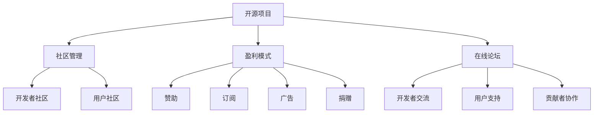

                 

# 创建开源项目的在线论坛：社区参与和盈利模式

## 1. 背景介绍

在过去的几十年里，开源项目在全球软件开发和创新中发挥了至关重要的作用。它们为企业和社区提供了一个共享代码、协作开发、共同成长的开放平台。然而，随着开源项目的规模和复杂性的增加，有效的社区管理和盈利模式变得越来越重要。一个成功的开源项目不仅需要高质量的代码，还需要一个活跃的社区和可持续的商业模式来支持其发展。本文将探讨如何创建开源项目的在线论坛，以促进社区参与和盈利模式。

## 2. 核心概念与联系

### 2.1 核心概念概述

- **开源项目**：指代码公开、可以自由使用、修改和分发的软件项目。它依赖于社区的贡献和协作，以实现持续的创新和发展。

- **社区管理**：指管理和协调开源项目中各种利益相关者的活动，包括开发者、用户、贡献者等。有效的社区管理有助于提高项目的透明度、参与度和效率。

- **盈利模式**：指开源项目通过各种方式产生的收入，用于支持项目运营、维护和发展。常见的盈利模式包括赞助、订阅、广告、捐赠等。

- **在线论坛**：指在线平台或社区，供开发者、用户和其他社区成员交流、讨论和协作。在线论坛为开源项目提供了一个集中的交流平台，有助于促进社区参与和知识共享。

这些核心概念通过协作和交流的方式，共同构建了开源项目的在线论坛，使其成为促进社区参与和盈利模式的重要工具。

### 2.2 核心概念原理和架构的 Mermaid 流程图



## 3. 核心算法原理 & 具体操作步骤

### 3.1 算法原理概述

创建开源项目的在线论坛需要综合考虑社区管理、盈利模式和在线平台的技术实现。以下是核心算法原理：

- **社区管理算法**：旨在建立一种治理结构，以促进开发者、用户和其他社区成员之间的有效沟通和协作。

- **盈利模式算法**：确定可持续的商业模式，以支持开源项目的发展和维护。

- **在线论坛算法**：设计一个高效的在线平台，用于促进社区交流和协作。

### 3.2 算法步骤详解

#### 社区管理算法

1. **建立治理结构**：
   - 定义角色和职责，包括项目维护者、贡献者、用户等。
   - 创建决策流程，如代码审查、版本发布、问题跟踪等。
   - 制定社区行为规范，确保社区成员遵守统一的规则和标准。

2. **促进社区参与**：
   - 组织定期的社区活动，如代码审查会议、技术讨论会、贡献者奖励等。
   - 鼓励社区成员分享经验和知识，建立导师和学徒机制。
   - 提供支持和反馈机制，及时响应社区成员的需求和问题。

3. **确保透明度**：
   - 定期发布项目进展报告、财务报表和代码变更日志。
   - 开放社区讨论，允许社区成员提出建议和意见。
   - 建立透明的决策机制，增加社区成员的信任和参与度。

#### 盈利模式算法

1. **赞助**：
   - 寻找愿意资助开源项目的企业或个人。
   - 提供不同级别的赞助选项，如金主赞助、银主赞助等。
   - 明确赞助权益，如项目展示、社区荣誉等。

2. **订阅**：
   - 提供高级订阅服务，如优先访问、专业支持等。
   - 设计灵活的订阅计划，满足不同用户的需求。
   - 确保订阅收入可以覆盖项目的运营和维护成本。

3. **广告**：
   - 吸引广告商，如相关行业的企业或技术公司。
   - 提供广告投放选项，如横幅广告、赞助文章等。
   - 确保广告内容与项目相关，提高广告的吸引力和效果。

4. **捐赠**：
   - 鼓励社区成员和个人进行捐赠。
   - 提供不同的捐赠级别，如支持者、贡献者、赞助者等。
   - 建立捐赠激励机制，如荣誉称号、特殊权限等。

#### 在线论坛算法

1. **平台选择**：
   - 选择适合开源项目的在线平台，如GitHub、Discourse等。
   - 确保平台具有良好的社区支持、扩展性和安全性。
   - 考虑平台的集成能力，如与其他工具的互操作性。

2. **功能设计**：
   - 提供讨论区、问题跟踪、代码审查、版本控制等功能。
   - 支持自定义主题和插件，增加社区成员的参与度和粘性。
   - 提供搜索和过滤功能，方便社区成员查找和参与讨论。

3. **交互设计**：
   - 设计简洁易用的界面，减少用户学习成本。
   - 优化社区交互体验，如实时通知、点赞回复等功能。
   - 确保平台界面响应速度快，支持多终端访问。

### 3.3 算法优缺点

#### 社区管理算法的优缺点

**优点**：
- **促进协作**：有效的社区管理可以提高社区成员的协作效率，加速项目开发和迭代。
- **提高透明度**：透明的决策和治理结构可以增加社区成员的信任和参与度。
- **增强用户参与**：通过社区活动和支持机制，可以增强用户的参与感和归属感。

**缺点**：
- **管理复杂**：社区管理需要投入大量时间和精力，特别是在项目初期。
- **决策困难**：大规模社区的决策过程可能较为复杂，容易产生分歧和冲突。
- **文化差异**：不同背景和文化的社区成员可能存在沟通和理解上的障碍。

#### 盈利模式算法的优缺点

**优点**：
- **资金保障**：稳定的盈利模式可以为项目提供持续的资金支持，确保项目的持续发展。
- **市场认可**：成功的盈利模式可以提升项目的市场认可度和影响力。
- **资源整合**：盈利模式可以整合更多的资源，如人才、技术、资金等。

**缺点**：
- **利益冲突**：盈利模式可能与社区利益产生冲突，需要平衡好各方需求。
- **依赖商业**：过度依赖商业赞助或广告，可能影响项目的独立性和中立性。
- **资源分配**：盈利模式可能导致资源分配不均，影响社区成员的公平感。

#### 在线论坛算法的优缺点

**优点**：
- **促进交流**：在线论坛提供了集中化的交流平台，方便社区成员分享和讨论。
- **便于协作**：在线论坛支持代码审查、版本控制等功能，促进社区协作。
- **易于扩展**：在线论坛可以扩展功能，支持更多的社区活动和互动。

**缺点**：
- **技术依赖**：在线论坛的技术实现和维护需要一定的技术和资源投入。
- **用户粘性**：在线论坛的成功需要持续的社区支持和活跃度。
- **隐私安全**：在线论坛涉及大量的社区数据，需要良好的隐私保护和安全措施。

### 3.4 算法应用领域

开源项目的在线论坛可以应用于各种软件和技术的开发和维护。以下是一些典型应用领域：

- **开源软件开发**：如Linux内核、Apache Web服务器等。这些项目通过在线论坛促进开发者协作和代码审查，加速项目的迭代和创新。

- **开源工具和框架**：如Kubernetes、Docker等。这些工具通过在线论坛提供技术支持和用户反馈，不断改进和完善。

- **开源社区建设**：如Wikipedia、Stack Overflow等。这些社区通过在线论坛促进知识共享和社区参与，建立强大的用户基础。

## 4. 数学模型和公式 & 详细讲解 & 举例说明

### 4.1 数学模型构建

本节将使用数学语言对开源项目的在线论坛进行更加严格的刻画。

假设开源项目有 $N$ 名社区成员，$M$ 名开发者，$P$ 名用户。社区管理的目标是最大化社区成员的满意度和项目的贡献度。设社区成员的满意度为 $S$，项目的贡献度为 $C$。社区管理的数学模型为：

$$
\maximize \; S + C
$$

其中：
- $S$ 为社区成员的满意度，由社区活动、支持和反馈等衡量。
- $C$ 为项目的贡献度，由代码贡献、文档更新等衡量。

### 4.2 公式推导过程

社区管理的优化目标是通过社区活动、支持和反馈等措施，提高社区成员的满意度和项目的贡献度。假设社区活动 $A$、支持 $S$、反馈 $F$ 的成本分别为 $c_A$、$c_S$、$c_F$，社区成员和项目的满意度分别与社区活动、支持和反馈相关，公式如下：

$$
S = w_1 A + w_2 S + w_3 F
$$
$$
C = w_4 C_A + w_5 C_S + w_6 C_F
$$

其中 $w_i$ 为权重，表示各活动对满意度和贡献度的贡献。通过求解优化模型，可以找到最优的活动组合，最大化社区满意度和项目贡献度。

### 4.3 案例分析与讲解

以Apache Hadoop为例，分析其在线论坛的社区管理和盈利模式。

Apache Hadoop是一个开源分布式计算框架，拥有庞大的社区和用户基础。其在线论坛主要功能包括：

- **讨论区**：开发者、用户和贡献者可以发布问题和讨论技术细节。
- **代码审查**：开发者提交代码变更，其他开发者进行代码审查和反馈。
- **版本控制**：通过GitHub等版本控制工具，记录项目历史和变更。

社区管理方面，Apache Hadoop通过建立POMC（项目维护者、贡献者、用户、贡献者）的治理结构，确保社区决策的透明度和公正性。同时，Apache基金会提供赞助、捐赠和广告等多种盈利模式，支持项目的持续运营和发展。

## 5. 项目实践：代码实例和详细解释说明

### 5.1 开发环境搭建

创建开源项目的在线论坛需要选择合适的开发环境，包括：

1. **操作系统**：选择Linux或Windows Server等稳定的操作系统。

2. **Web服务器**：选择Apache或Nginx等高效、稳定的Web服务器。

3. **数据库**：选择MySQL或PostgreSQL等可靠的关系型数据库。

4. **代码管理**：使用Git等分布式版本控制系统。

5. **社区管理工具**：使用Discourse、JIRA等社区管理工具。

### 5.2 源代码详细实现

以下是一个简化的在线论坛实现示例：

1. **论坛架构设计**：
   - 前端页面：使用HTML、CSS和JavaScript构建用户界面。
   - 后端服务：使用Python Flask框架构建RESTful API。
   - 数据库：使用SQLite或MySQL存储论坛数据。

2. **用户管理功能**：
   - 用户注册和登录：使用OAuth或JWT等技术实现用户认证和授权。
   - 用户角色管理：定义管理员、开发者、用户等角色，并设置相应的权限。

3. **社区功能实现**：
   - 讨论区：支持创建话题、发布帖子、回复评论等功能。
   - 问题跟踪：支持创建问题、分配任务、跟踪进度等功能。
   - 代码审查：支持代码提交、代码审查、版本控制等功能。

### 5.3 代码解读与分析

论坛的代码实现主要分为前端和后端两部分。以下是对关键代码的解读和分析：

#### 前端代码

```javascript
// 讨论区
const discussion = {
  getTopics: function() {
    // 从后端获取话题列表
    return fetch('/topics').then(response => response.json());
  },
  postComment: function(topicId, comment) {
    // 发布评论
    return fetch('/topics/' + topicId + '/comments', {
      method: 'POST',
      body: comment
    }).then(response => response.json());
  }
};
```

#### 后端代码

```python
# 用户管理
@app.route('/user/login', methods=['POST'])
def login():
  # 处理用户登录请求
  return jsonify(token)

# 社区功能
@app.route('/topics', methods=['GET'])
def get_topics():
  # 获取话题列表
  return jsonify(topics)

@app.route('/topics/<int:topic_id>/comments', methods=['POST'])
def post_comment(topic_id, comment):
  # 发布评论
  return jsonify(comment)
```

### 5.4 运行结果展示

运行论坛后，可以访问前端页面，查看讨论区、问题跟踪、代码审查等社区功能。例如，可以发布讨论帖子、参与讨论、提交代码变更、进行代码审查等。

## 6. 实际应用场景

### 6.1 开源软件开发

开源软件开发项目通常需要多人的协作和频繁的代码变更。通过在线论坛，开发者可以实时交流和协作，加速项目迭代和创新。例如，Apache Hadoop项目通过在线论坛支持讨论、代码审查和版本控制等功能，大大提高了项目的协作效率。

### 6.2 开源社区建设

开源社区的建设需要广泛的社区支持和参与。在线论坛为社区成员提供了一个集中化的交流平台，方便知识共享和社区参与。例如，Wikipedia社区通过在线论坛促进编辑和讨论，建立了一个庞大且活跃的用户基础。

### 6.3 开源工具和框架

开源工具和框架的维护和更新需要持续的技术支持和用户反馈。在线论坛提供了一个集中化的平台，方便用户报告问题和提供反馈。例如，Docker项目通过在线论坛支持用户报告问题、提供反馈和参与开发，推动了项目的持续发展和完善。

### 6.4 未来应用展望

随着开源项目的规模和复杂性的增加，在线论坛的重要性将日益凸显。未来的在线论坛将具备更多智能化的功能，如自动化建议、智能推荐、情感分析等，进一步提升社区参与度和项目质量。例如，GitHub的讨论区已经引入了智能搜索和推荐功能，帮助用户快速找到相关话题和讨论。

## 7. 工具和资源推荐

### 7.1 学习资源推荐

为了帮助开发者系统掌握开源项目的在线论坛开发，这里推荐一些优质的学习资源：

1. **开源项目管理**：深入浅出地介绍了开源项目管理和社区建设的理论基础和实践方法。

2. **社区建设最佳实践**：分享了开源社区建设的成功案例和经验教训，提供了丰富的社区管理建议。

3. **论坛开发指南**：详细介绍了论坛开发的技术栈和最佳实践，包括前端、后端和数据库等。

### 7.2 开发工具推荐

- **Git**：分布式版本控制系统，适合管理开源项目的代码变更。
- **Flask**：Python Flask框架，适合构建高效、稳定的后端服务。
- **MySQL**：关系型数据库，适合存储社区数据和项目信息。
- **Discourse**：社区管理工具，适合构建开源项目的在线论坛。
- **JIRA**：问题跟踪工具，适合管理项目任务和问题。

### 7.3 相关论文推荐

- **开源项目管理**：深入研究开源项目管理的方法和工具，提供了丰富的理论基础和实践建议。
- **社区建设最佳实践**：分享了社区建设的成功案例和经验教训，提供了丰富的社区管理建议。
- **论坛开发指南**：详细介绍了论坛开发的技术栈和最佳实践，包括前端、后端和数据库等。

## 8. 总结：未来发展趋势与挑战

### 8.1 研究成果总结

本文系统介绍了创建开源项目的在线论坛的方法和工具，探讨了社区参与和盈利模式。通过详细分析社区管理和盈利模式算法的优缺点，以及在线论坛的实现方法和应用场景，帮助开发者更好地理解和开发开源项目的在线论坛。

### 8.2 未来发展趋势

未来，开源项目的在线论坛将呈现以下几个发展趋势：

1. **智能化功能**：论坛将引入更多智能化功能，如自动化建议、智能推荐、情感分析等，提升社区参与度和项目质量。

2. **多渠道支持**：论坛将支持多渠道访问，如Web、移动端、社交媒体等，方便用户随时访问和使用。

3. **用户体验优化**：论坛将进一步优化用户体验，如界面设计、交互体验等，提高用户满意度和参与度。

4. **开源生态整合**：论坛将与开源生态中的其他工具和服务进行整合，提供更全面的支持和服务。

5. **社区治理创新**：论坛将引入更多社区治理创新，如投票机制、社区积分等，增强社区自治和自我管理能力。

### 8.3 面临的挑战

尽管在线论坛为开源项目提供了重要的支持，但在应用过程中仍面临一些挑战：

1. **社区管理复杂**：大规模社区的管理需要投入大量时间和精力，特别是在项目初期。

2. **盈利模式单一**：当前的盈利模式相对单一，难以满足复杂项目的资金需求。

3. **用户粘性不足**：用户流失率高，需要持续的社区支持和活动维持用户参与。

4. **技术实现复杂**：论坛的实现涉及多方面的技术和资源，需要综合考虑性能、扩展性和安全性。

5. **隐私安全问题**：论坛涉及大量的社区数据，需要良好的隐私保护和安全措施。

### 8.4 研究展望

未来的研究需要在以下几个方面寻求新的突破：

1. **社区治理机制**：引入更多社区治理机制，如投票机制、社区积分等，增强社区自治和自我管理能力。

2. **智能推荐系统**：引入智能推荐系统，根据用户兴趣和行为推荐相关话题和讨论。

3. **自动化建议功能**：引入自动化建议功能，帮助用户快速找到相关话题和讨论。

4. **隐私保护技术**：引入隐私保护技术，保护用户隐私和安全。

5. **跨平台支持**：支持多渠道访问，如Web、移动端、社交媒体等，方便用户随时访问和使用。

6. **社区文化建设**：推动社区文化建设，提升社区成员的参与感和归属感。

通过在这些方面的不断探索和优化，未来的开源项目的在线论坛将能够更好地促进社区参与和项目发展，推动开源项目和社区的持续进步。

## 9. 附录：常见问题与解答

**Q1：如何选择合适的在线论坛平台？**

A: 选择在线论坛平台需要考虑平台的功能、性能、扩展性和社区支持等因素。一般来说，应选择开源、稳定、易用的平台，如Discourse、JIRA等。同时，需要根据项目的需求和特点，选择最适合的平台。

**Q2：如何促进社区成员的参与度？**

A: 促进社区成员的参与度需要采取多种措施，如组织定期的社区活动、提供支持和反馈机制、建立导师和学徒机制等。同时，需要保持社区的透明和公正，增加社区成员的信任和归属感。

**Q3：如何实现盈利模式的多样化？**

A: 实现盈利模式的多样化需要综合考虑项目的特点和需求，引入多种盈利方式，如赞助、订阅、广告、捐赠等。同时，需要确保盈利模式与社区利益平衡，避免过度商业化。

**Q4：如何保护社区成员的隐私和安全？**

A: 保护社区成员的隐私和安全需要建立完善的隐私保护机制和数据安全措施。如采用数据加密、访问控制等技术手段，确保社区数据的安全性和隐私性。

**Q5：如何优化在线论坛的用户体验？**

A: 优化在线论坛的用户体验需要综合考虑界面设计、交互体验等因素。如使用简洁的界面、优化加载速度、提供实时通知和搜索功能等。

综上所述，创建开源项目的在线论坛需要综合考虑社区管理、盈利模式和在线平台的技术实现。通过系统化的方法和工具，可以有效地促进社区参与和项目发展，推动开源项目和社区的持续进步。相信通过不断的探索和优化，未来的开源项目的在线论坛将为开源社区提供更全面、高效的支持和服务。

