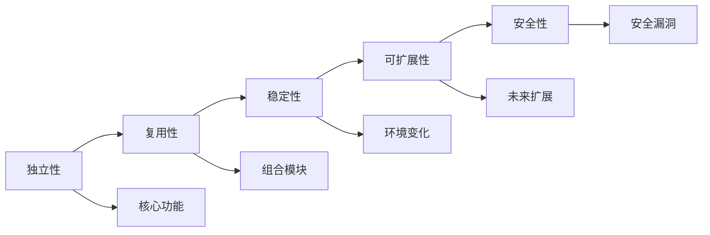

                 

# 创造“创世粒子”的标准

在物理学的宇宙创世理论中，"创世粒子"象征着宇宙最根本的、不可再分的基本单元，是构建宇宙万物的基础。而在计算机程序设计的领域中，"创世粒子"则代表着一个软件系统的核心模块或核心功能，是构建系统价值的基础。本文将探讨如何创造这些"创世粒子"，以及它们在软件开发中的标准和原则。

## 1. 背景介绍

随着软件工程的不断发展和应用场景的多样化，开发一个高质量的软件系统变得越来越复杂。软件系统的核心价值往往依赖于几个关键的功能模块或组件，这些组件必须具备高可靠性、高性能、高可扩展性等特征。因此，如何设计和实现这些"创世粒子"，成为了软件工程的核心议题。

## 2. 核心概念与联系

### 2.1 核心概念概述

在软件开发中，"创世粒子"是指那些定义了系统核心功能、提供了系统价值的关键模块或组件。这些"创世粒子"通常具备以下几个特征：

- **独立性**：每个"创世粒子"都是独立的功能模块，不依赖于其他模块。
- **复用性**："创世粒子"可以独立使用，也可以与其他模块组合使用。
- **稳定性**："创世粒子"在各种环境下都应表现出稳定的性能和功能。
- **可扩展性**："创世粒子"需要具备良好的可扩展性，以便在未来的应用中增加新的功能。
- **安全性**："创世粒子"需要确保数据和系统的安全性，避免潜在的安全漏洞。

### 2.2 核心概念原理和架构的 Mermaid 流程图



这个图展示了"创世粒子"的核心特征和它们之间的联系。独立性是"创世粒子"能够复用和组合的基础；稳定性保证在各种环境下"创世粒子"的正常运行；可扩展性确保了系统在未来可以适应新的需求；安全性则保护了系统不受攻击和数据的完整性。

## 3. 核心算法原理 & 具体操作步骤

### 3.1 算法原理概述

创建"创世粒子"的过程可以类比为创建化学元素的过程。在化学中，元素是物质的基本单位，具有独特的性质和稳定性。在软件中，"创世粒子"也需要具有独特的功能和稳定性，能够组合成不同的系统形态。

### 3.2 算法步骤详解

1. **需求分析**：
    - 收集需求，明确"创世粒子"需要实现的功能。
    - 分析用户需求，确定"创世粒子"的功能边界。

2. **架构设计**：
    - 设计"创世粒子"的架构，确定其独立性、复用性、稳定性、可扩展性和安全性。
    - 选择合适的技术栈和设计模式，确保"创世粒子"的高效实现。

3. **实现与测试**：
    - 使用合适的编程语言和技术栈实现"创世粒子"。
    - 进行单元测试和集成测试，确保"创世粒子"的功能和性能。

4. **部署与监控**：
    - 将"创世粒子"部署到生产环境，并进行持续监控。
    - 收集运行数据，定期评估"创世粒子"的性能和稳定性。

5. **维护与更新**：
    - 定期更新"创世粒子"，修复潜在漏洞，提升性能。
    - 增加新功能，保持"创世粒子"的持续价值。

### 3.3 算法优缺点

**优点**：
- **高可靠性**："创世粒子"独立设计，减少了系统故障的风险。
- **可维护性**："创世粒子"独立更新，减少了维护成本。
- **可扩展性**："创世粒子"可复用，支持系统规模的灵活扩展。

**缺点**：
- **开发复杂性**：设计和实现"创世粒子"需要更多的前期投入。
- **协作困难**：多个"创世粒子"之间的协作可能增加开发难度。

### 3.4 算法应用领域

"创世粒子"的应用领域非常广泛，包括但不限于以下几个方面：

- **云计算**：云服务中的计算节点、存储节点等模块。
- **网络通信**：网络协议栈中的各种协议模块。
- **大数据处理**：大数据处理中的数据存储、计算模块。
- **人工智能**：深度学习模型、自然语言处理模块。

## 4. 数学模型和公式 & 详细讲解 & 举例说明

### 4.1 数学模型构建

"创世粒子"的构建可以建模为最大化用户价值的过程。设$V$为用户价值，$F$为"创世粒子"的功能模块，则构建"创世粒子"的过程可以表示为：

$$
\max_{F} V = \sum_{i=1}^n v_i \times f_i
$$

其中，$v_i$为第$i$个功能模块的价值系数，$f_i$为第$i$个功能模块的实现程度。

### 4.2 公式推导过程

根据上述模型，我们可以推导出以下公式：

$$
\frac{\partial V}{\partial f_i} = v_i
$$

这意味着，为了最大化用户价值，我们需要最大化每个功能模块的实现程度。

### 4.3 案例分析与讲解

假设我们正在开发一个电子商务系统，其中的"创世粒子"包括商品管理模块、订单管理模块和支付模块。我们可以为每个模块设定不同的价值系数，然后根据用户需求和市场反馈，确定每个模块的实现程度。通过不断优化这些系数，我们可以确保系统的核心功能最大化用户价值。

## 5. 项目实践：代码实例和详细解释说明

### 5.1 开发环境搭建

首先，我们需要设置一个适合开发的环境。建议使用Linux操作系统，因为它具有更好的性能和稳定性。使用Docker容器进行隔离开发，可以避免环境冲突，便于版本控制。

### 5.2 源代码详细实现

以下是一个简单的商品管理模块的实现示例：

```python
class Product:
    def __init__(self, name, price):
        self.name = name
        self.price = price
    
    def get_price(self):
        return self.price

    def update_price(self, new_price):
        self.price = new_price
```

### 5.3 代码解读与分析

上述代码定义了一个名为`Product`的类，用于管理商品的基本信息。类中包含了商品的名称和价格属性，以及获取和更新价格的方法。这个"创世粒子"实现了基本的商品管理功能，是电子商务系统的重要组成部分。

### 5.4 运行结果展示

运行上述代码，我们可以创建一个商品对象，并调用其方法来获取和更新价格：

```python
# 创建商品对象
product = Product("iPhone", 10000)

# 获取价格
print(product.get_price())  # 输出：10000

# 更新价格
product.update_price(11000)
print(product.get_price())  # 输出：11000
```

## 6. 实际应用场景

"创世粒子"在实际应用中具有重要意义。以下是一个典型的应用场景：

假设我们正在开发一个企业内部管理系统，其中包括了用户管理、权限管理、文档管理和邮件系统等模块。这些"创世粒子"是系统价值的基石，需要具备高可靠性、高性能和可扩展性。例如，用户管理模块需要确保数据的准确性和安全性，权限管理模块需要支持灵活的权限分配策略，文档管理系统需要支持高效的文档存储和查询，邮件系统需要具备高可靠性和高并发处理能力。通过合理设计和实现这些"创世粒子"，我们可以构建一个稳定、高效的企业内部管理系统。

## 7. 工具和资源推荐

### 7.1 学习资源推荐

为了帮助开发者掌握"创世粒子"的构建方法，这里推荐一些优质的学习资源：

1. 《Clean Code》：通过简洁、易懂的示例和案例，介绍了如何编写高质量的代码。
2. 《Design Patterns》：介绍了常见的设计模式，帮助开发者设计和实现高复用、高扩展性的"创世粒子"。
3. 《The Pragmatic Programmer》：提供了许多实用的编程技巧和最佳实践，帮助开发者编写高效、稳定的代码。
4. 《Software Architecture in Practice》：介绍了软件架构的设计原则和实践方法，帮助开发者构建高质量的系统。

### 7.2 开发工具推荐

以下是几款常用的开发工具，可以帮助开发者构建"创世粒子"：

1. Git：版本控制系统，方便开发者进行代码管理和协作。
2. Docker：容器化工具，便于开发者进行隔离开发和部署。
3. JIRA：项目管理工具，帮助开发者跟踪任务和进度。
4. Jenkins：自动化测试和持续集成工具，提高开发效率和代码质量。

### 7.3 相关论文推荐

为了深入了解"创世粒子"的构建方法，以下是几篇相关的学术论文：

1. "Architecture-Based Software Design: The Research Front"：讨论了软件架构在设计中的作用和影响。
2. "Design Principles and Design Patterns for Software Design"：介绍了设计原则和设计模式的基本概念和应用方法。
3. "Software Architecture Analysis and Measurement: A Survey"：总结了软件架构分析方法和度量标准。

## 8. 总结：未来发展趋势与挑战

### 8.1 研究成果总结

本文介绍了"创世粒子"在软件开发中的重要性，并探讨了其核心概念和构建方法。通过合理设计和实现"创世粒子"，可以构建高质量的软件系统，提升系统的可靠性和可扩展性。

### 8.2 未来发展趋势

未来，"创世粒子"的构建将更加注重模块化和标准化，以适应日益复杂的软件系统需求。同时，随着人工智能和大数据技术的不断进步，"创世粒子"的设计和实现将更加依赖于先进的技术和工具。

### 8.3 面临的挑战

尽管"创世粒子"在软件开发中具有重要意义，但仍然面临着以下挑战：

1. **复杂性管理**：随着系统规模的扩大，"创世粒子"的数量和复杂性也将增加，管理难度加大。
2. **跨团队协作**：多个"创世粒子"需要跨团队协作完成，沟通和协调成为一大难题。
3. **技术更新**：软件技术和工具的快速更新要求"创世粒子"能够快速适应新技术，更新和维护成本增加。

### 8.4 研究展望

为了应对这些挑战，未来需要重点研究以下几个方面：

1. **模块化和标准化**：制定统一的模块化和标准化标准，提高"创世粒子"的可复用性和可扩展性。
2. **自动化工具**：开发自动化工具，减少手工开发和维护的复杂性。
3. **微服务架构**：采用微服务架构，将"创世粒子"分割为多个独立的微服务，提高系统的可扩展性和可靠性。
4. **开源社区**：加强开源社区的合作，共同推动"创世粒子"的构建和优化。

## 9. 附录：常见问题与解答

**Q1: "创世粒子"是否需要完全独立？**

A: "创世粒子"需要尽可能独立，以减少系统故障和维护成本。但完全独立也会增加开发复杂性。因此，需要根据具体情况进行权衡。

**Q2: 如何确定"创世粒子"的价值系数？**

A: "创世粒子"的价值系数需要根据用户的需求和市场反馈进行评估。可以通过问卷调查、用户反馈、市场分析等方法，确定每个功能模块的价值系数。

**Q3: 如何避免"创世粒子"之间的耦合？**

A: 避免"创世粒子"之间的耦合需要合理设计接口和通信协议，减少直接依赖和交互。可以使用消息队列、事件驱动等技术，实现"创世粒子"的解耦。

**Q4: "创世粒子"的测试方法有哪些？**

A: "创世粒子"的测试方法包括单元测试、集成测试、系统测试和性能测试。通过不断测试和优化，确保"创世粒子"的稳定性和可靠性。

**Q5: 如何确保"创世粒子"的安全性？**

A: 确保"创世粒子"的安全性需要从数据安全、代码安全和系统安全等多个层面进行考虑。可以采用加密、权限控制、漏洞扫描等技术，保障"创世粒子"的安全性。

---

作者：禅与计算机程序设计艺术 / Zen and the Art of Computer Programming

