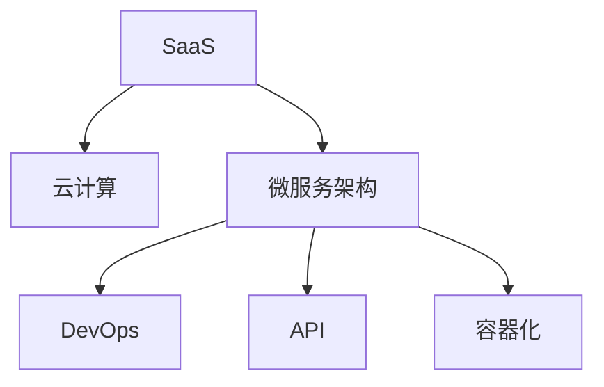

                 

# 利用技术能力创建SaaS产品

## 1. 背景介绍

### 1.1 问题由来

近年来，随着云计算和互联网技术的发展，SaaS（Software as a Service，软件即服务）模式成为了企业软件的重要形式。与传统的软件部署方式相比，SaaS模式降低了企业的IT投入，提升了软件的部署、升级和维护效率。然而，要构建一个成功的SaaS产品，不仅需要强大的技术支撑，还需要良好的商业策略和用户体验设计。因此，如何在技术能力的基础上，进一步优化商业和产品策略，成为SaaS产品的关键。

### 1.2 问题核心关键点

SaaS产品的成功不仅取决于技术能力，还需要深入理解市场需求、商业模式、用户体验等方面的问题。成功的SaaS产品通常具备以下几个关键特征：

1. 强大的技术支持：能够提供高效、稳定、可扩展的软件服务。
2. 明确的商业模式：能够清晰定义收费模式、用户分层、增值服务等。
3. 良好的用户体验：能够提供简单易用、功能丰富、响应迅速的产品界面和功能。
4. 灵活的部署模式：能够支持多云、混合云等多种部署方式。
5. 持续的创新能力：能够不断引入新技术和新功能，提升产品竞争力。

### 1.3 问题研究意义

研究SaaS产品的构建方法，对于提升企业软件服务的质量和竞争力，推动云计算和互联网技术的普及，具有重要意义：

1. 降低企业成本。通过SaaS模式，企业可以避免昂贵的硬件和软件采购，减少IT运维成本，提升资源利用率。
2. 提高产品灵活性。SaaS产品能够快速响应市场需求变化，根据用户反馈不断迭代更新。
3. 增强用户体验。通过SaaS模式，用户可以随时随地访问应用，提升生产效率和生活质量。
4. 促进技术创新。SaaS产品的构建需要整合多种技术，推动新技术的应用和发展。
5. 扩大市场份额。SaaS产品易于扩展和部署，可以快速覆盖更多用户和市场。

## 2. 核心概念与联系

### 2.1 核心概念概述

为了更好地理解SaaS产品的构建方法，本节将介绍几个密切相关的核心概念：

- **SaaS**: 即Software as a Service，软件即服务。用户通过互联网访问和使用软件服务，无需安装和维护。
- **云计算**: 一种基于互联网的计算模式，通过虚拟化技术提供弹性的计算资源。
- **微服务架构**: 将应用程序拆分成一系列独立、自治的服务单元，提高系统的可扩展性和可维护性。
- **DevOps**: 一种软件开发和运维的文化和实践，强调自动化、持续集成和持续部署。
- **API**: Application Programming Interface，应用程序编程接口。用于不同系统之间通信和数据交换的协议。
- **容器化**: 使用容器技术（如Docker）封装应用程序及其依赖项，提高部署和管理的灵活性。

这些核心概念之间的逻辑关系可以通过以下Mermaid流程图来展示：



这个流程图展示了SaaS产品构建的关键技术和架构，揭示了它们之间的内在联系和相互依赖关系。

## 3. 核心算法原理 & 具体操作步骤

### 3.1 算法原理概述

SaaS产品的构建涉及多个技术层面，包括云计算、微服务、DevOps、API设计、容器化等。这些技术的选择和整合，需要根据具体的业务需求和市场环境进行设计和优化。以下将对SaaS产品构建的核心算法原理进行概述：

1. **云计算平台选择**：根据业务规模和用户量，选择合适的云计算平台（如AWS、阿里云、腾讯云等），确保计算资源和网络带宽满足需求。
2. **微服务架构设计**：将SaaS产品拆分为独立、自治的微服务，通过RESTful API进行通信和数据交换。
3. **DevOps流程优化**：建立自动化、持续集成的开发和运维流程，提高开发效率和系统稳定性。
4. **API设计规范**：制定统一的API设计规范，确保不同系统之间的通信安全和数据一致性。
5. **容器化部署**：使用容器技术封装应用程序及其依赖项，支持弹性扩展和快速部署。

### 3.2 算法步骤详解

SaaS产品的构建流程可以分为以下几个关键步骤：

**Step 1: 需求分析与产品规划**

- 与客户沟通，了解业务需求和目标用户群体。
- 制定产品路线图，明确产品功能、技术架构和市场定位。

**Step 2: 云计算平台选择**

- 根据业务规模和用户量，选择合适的云计算平台，评估其性能、安全性和成本效益。
- 配置计算资源和网络带宽，确保系统的高可用性和响应速度。

**Step 3: 微服务架构设计**

- 将SaaS产品拆分为独立、自治的微服务单元。
- 通过RESTful API进行通信和数据交换，确保系统的解耦和灵活性。
- 设计统一的API规范，确保不同服务之间的兼容性和安全性。

**Step 4: DevOps流程优化**

- 建立自动化、持续集成的开发和运维流程，提高开发效率和系统稳定性。
- 引入CI/CD工具（如Jenkins、GitLab CI/CD），自动化测试、构建和部署。
- 建立监控告警系统，实时监控系统性能和异常，及时处理问题。

**Step 5: API设计规范**

- 制定统一的API设计规范，确保不同系统之间的通信安全和数据一致性。
- 使用OpenAPI（Swagger）规范进行API设计，支持API的自动生成和文档管理。
- 引入OAuth2等安全机制，保护API免受未授权访问和攻击。

**Step 6: 容器化部署**

- 使用容器技术（如Docker）封装应用程序及其依赖项，提高部署和管理的灵活性。
- 引入Kubernetes等容器编排工具，支持弹性扩展和快速部署。
- 设计高效的容器编排策略，优化资源利用和系统性能。

**Step 7: 用户体验优化**

- 设计简洁、易用的用户界面，提升用户体验。
- 引入A/B测试等手段，持续优化产品功能和界面设计。
- 提供多语言的本地化支持，扩大用户覆盖面。

### 3.3 算法优缺点

SaaS产品的构建方法具有以下优点：

1. **高度灵活性**：微服务架构和云计算平台支持弹性扩展和快速部署，能够满足不同业务需求。
2. **高效的资源利用**：容器化和云计算资源按需分配，避免资源浪费。
3. **提升开发效率**：DevOps流程自动化，减少手动操作，提升开发和运维效率。
4. **良好的用户体验**：统一的API规范和用户界面设计，提升用户体验。

然而，SaaS产品的构建方法也存在一些缺点：

1. **较高的技术门槛**：需要深入理解云计算、微服务、DevOps等技术，有一定的技术门槛。
2. **复杂的系统管理**：微服务架构增加了系统管理的复杂性，需要经验丰富的运维团队。
3. **较高的部署成本**：初期需要投入一定的资金和资源进行云计算平台选择和配置。
4. **数据安全风险**：云计算和微服务架构带来新的安全风险，需要加强安全管理和防护。

### 3.4 算法应用领域

SaaS产品的构建方法已经广泛应用于多个领域，例如：

- 企业资源管理（ERP）：通过SaaS产品，企业可以实现对资源、财务、客户等信息的统一管理。
- 客户关系管理（CRM）：通过SaaS产品，企业可以更好地管理客户关系和销售机会。
- 电子商务：通过SaaS产品，企业可以构建在线商店和销售平台，提升销售效率。
- 人力资源管理（HRM）：通过SaaS产品，企业可以实现员工招聘、绩效管理、培训等功能。
- 财务管理：通过SaaS产品，企业可以实现在线发票管理、报表生成、预算控制等功能。

除了上述这些经典应用外，SaaS技术还被创新性地应用到更多场景中，如大数据分析、人工智能、物联网等，为企业数字化转型提供了新的工具和手段。

## 4. 数学模型和公式 & 详细讲解 & 举例说明

### 4.1 数学模型构建

为了更好地理解SaaS产品的构建方法，本节将使用数学语言对关键算法进行严格的刻画。

假设SaaS产品由多个微服务组成，每个微服务的服务质量指标为 $Q_i$，整体系统质量指标为 $Q$。系统的总成本为 $C$，包括固定成本 $C_f$ 和可变成本 $C_v$。系统的用户数为 $U$，系统的可用性为 $A$，即系统在一定时间内能够正常工作的比例。

定义微服务的负载均衡系数为 $\alpha_i$，即微服务 $i$ 的负载占总负载的权重。微服务的处理速度为 $V_i$，处理延迟为 $D_i$。微服务 $i$ 对系统整体质量指标的贡献为 $W_i$，对整体可用性的贡献为 $A_i$。

系统的总处理速度为 $V$，总延迟为 $D$。系统的整体质量指标 $Q$ 可以表示为：

$$
Q = \sum_{i=1}^n \alpha_i W_i + (1-\sum_{i=1}^n \alpha_i) W_0
$$

其中 $W_0$ 为系统整体质量指标的默认值。系统的整体可用性 $A$ 可以表示为：

$$
A = \prod_{i=1}^n A_i
$$

系统的总成本 $C$ 可以表示为：

$$
C = C_f + C_v = C_f + \sum_{i=1}^n \alpha_i C_i + \sum_{j=1}^m \beta_j C_j
$$

其中 $C_i$ 为微服务 $i$ 的固定成本，$C_j$ 为不同负载的变动成本。$\beta_j$ 为负载 $j$ 的权重。

### 4.2 公式推导过程

以下我们将以一个简单的电子商务平台为例，推导SaaS产品构建中微服务设计和负载均衡的数学模型。

假设电子商务平台由商品管理、订单处理、物流配送三个微服务组成。每个微服务的质量指标、成本和负载均衡系数如下：

- 商品管理：$Q_1 = 0.9, C_1 = 5000, \alpha_1 = 0.4$
- 订单处理：$Q_2 = 0.8, C_2 = 3000, \alpha_2 = 0.3$
- 物流配送：$Q_3 = 0.7, C_3 = 2000, \alpha_3 = 0.3$

系统的总成本为 $C = C_f + 0.4C_1 + 0.3C_2 + 0.3C_3$，系统的总处理速度为 $V = V_1 + 0.3V_2 + 0.3V_3$，系统的总延迟为 $D = D_1 + 0.3D_2 + 0.3D_3$。

定义微服务的处理速度和延迟的线性关系为 $V_i = k_i U + \delta_i$，其中 $k_i$ 为处理速度的线性系数，$\delta_i$ 为处理延迟的线性系数。

系统的整体质量指标 $Q$ 可以表示为：

$$
Q = 0.4 \cdot 0.9 + 0.3 \cdot 0.8 + 0.3 \cdot 0.7
$$

系统的整体可用性 $A$ 可以表示为：

$$
A = 0.9 \cdot 0.8 \cdot 0.7
$$

系统的总成本 $C$ 可以表示为：

$$
C = 5000 + 0.4 \cdot 3000 + 0.3 \cdot 2000 = 10500
$$

系统的总处理速度 $V$ 可以表示为：

$$
V = k_1 \cdot U + 0.3 \cdot k_2 \cdot U + 0.3 \cdot k_3 \cdot U
$$

系统的总延迟 $D$ 可以表示为：

$$
D = \delta_1 \cdot U + 0.3 \cdot \delta_2 \cdot U + 0.3 \cdot \delta_3 \cdot U
$$

通过求解以上模型，可以得出最优的微服务设计和负载均衡策略，以在满足质量要求的前提下，最小化成本和延迟。

### 4.3 案例分析与讲解

以下我们将以一个典型的SaaS产品——在线文档编辑平台为例，分析其构建过程中涉及的关键技术和策略。

**案例背景**：在线文档编辑平台（如Google Docs）提供基于云端的文档编辑和协作功能，支持多种文档格式和协作模式。平台由多个微服务组成，包括用户管理、文档编辑、文档存储和共享等。

**技术选择**：平台采用AWS云计算平台，使用Docker容器化封装微服务，引入Kubernetes进行容器编排，使用RESTful API进行通信，引入GitLab CI/CD进行自动化部署和测试。

**微服务设计**：平台将用户管理、文档编辑、文档存储和共享等核心功能分别拆分为独立的微服务单元，通过RESTful API进行通信和数据交换。每个微服务通过DevOps流程进行自动化构建和部署，确保系统的高可用性和稳定性。

**负载均衡策略**：平台使用Kubernetes进行容器编排，通过服务发现和负载均衡机制，确保不同微服务的负载均衡和资源优化。平台还引入缓存机制和负载均衡算法，优化系统性能和响应速度。

**安全性和可用性**：平台采用OAuth2和JWT等安全机制，保护API免受未授权访问和攻击。平台还设计了监控告警系统和自动化故障恢复机制，确保系统的高可用性和稳定性。

## 5. 项目实践：代码实例和详细解释说明

### 5.1 开发环境搭建

在进行SaaS产品构建实践前，我们需要准备好开发环境。以下是使用Python进行SaaS产品开发的常见环境配置流程：

1. 安装Anaconda：从官网下载并安装Anaconda，用于创建独立的Python环境。

2. 创建并激活虚拟环境：
```bash
conda create -n saas-env python=3.8 
conda activate saas-env
```

3. 安装Python关键库：
```bash
pip install flask sqlalchemy flask-restful flask-sqlalchemy flask-migrate
```

4. 安装DevOps工具：
```bash
pip install Jenkins jenkinsapi
```

5. 安装容器化工具：
```bash
pip install docker
```

完成上述步骤后，即可在`saas-env`环境中开始SaaS产品构建实践。

### 5.2 源代码详细实现

下面我们以一个简单的在线文档编辑平台为例，给出使用Flask框架构建SaaS产品的PyTorch代码实现。

**项目结构**：

```
project/
    ├── saas/
    │   ├── app.py
    │   ├── config.py
    │   ├── models.py
    │   ├── routes.py
    │   ├── __init__.py
    │   └── ...
    ├── .env
    └── requirements.txt
```

**环境配置**：

- 创建并激活虚拟环境：
```bash
conda create -n saas-env python=3.8 
conda activate saas-env
```

- 安装关键库：
```bash
pip install flask sqlalchemy flask-restful flask-sqlalchemy flask-migrate
```

- 安装Jenkins CI/CD：
```bash
pip install jenkinsapi
```

- 安装Docker：
```bash
pip install docker
```

**代码实现**：

**app.py**：

```python
from flask import Flask, request
from flask_sqlalchemy import SQLAlchemy
from flask_restful import Resource, Api

app = Flask(__name__)
app.config['SQLALCHEMY_DATABASE_URI'] = 'sqlite:///docs.db'
db = SQLAlchemy(app)
api = Api(app)

class User(db.Model):
    id = db.Column(db.Integer, primary_key=True)
    name = db.Column(db.String(64), index=True)
    password_hash = db.Column(db.String(128))
    documents = db.relationship('Document', backref='owner', lazy='dynamic')

class Document(db.Model):
    id = db.Column(db.Integer, primary_key=True)
    name = db.Column(db.String(64))
    content = db.Column(db.Text)
    owner_id = db.Column(db.Integer, db.ForeignKey('user.id'))

class UserResource(Resource):
    def get(self, user_id):
        user = User.query.get(user_id)
        return {'name': user.name}

    def put(self, user_id):
        user = User.query.get(user_id)
        user.name = request.json['name']
        db.session.commit()
        return {'message': 'User updated'}

class DocumentResource(Resource):
    def get(self, document_id):
        document = Document.query.get(document_id)
        return {'name': document.name, 'content': document.content}

    def put(self, document_id):
        document = Document.query.get(document_id)
        document.content = request.json['content']
        db.session.commit()
        return {'message': 'Document updated'}

api.add_resource(UserResource, '/users/<user_id>')
api.add_resource(DocumentResource, '/documents/<document_id>')

if __name__ == '__main__':
    app.run(debug=True)
```

**config.py**：

```python
from sqlalchemy import create_engine
from sqlalchemy.orm import sessionmaker

class Config:
    SQLALCHEMY_DATABASE_URI = 'sqlite:///docs.db'
    SQLALCHEMY_TRACK_MODIFICATIONS = False

engine = create_engine(config.SQLALCHEMY_DATABASE_URI)
Session = sessionmaker(bind=engine)
```

**models.py**：

```python
from sqlalchemy import Column, Integer, String, Text

class User(Base):
    __tablename__ = 'users'
    id = Column(Integer, primary_key=True)
    name = Column(String(64), index=True)
    password_hash = Column(String(128))
    documents = relationship('Document', backref='owner', lazy='dynamic')

class Document(Base):
    __tablename__ = 'documents'
    id = Column(Integer, primary_key=True)
    name = Column(String(64))
    content = Column(Text)
    owner_id = Column(Integer, ForeignKey('users.id'))
```

**routes.py**：

```python
from flask import request, jsonify
from flask_restful import Resource, Api
from models import User, Document, db

api = Api()
user_db = User()
document_db = Document()

class UserResource(Resource):
    def get(self, user_id):
        user = user_db.query.get(user_id)
        return jsonify({'name': user.name})

    def put(self, user_id):
        user = user_db.query.get(user_id)
        user.name = request.json['name']
        db.session.commit()
        return jsonify({'message': 'User updated'})

class DocumentResource(Resource):
    def get(self, document_id):
        document = document_db.query.get(document_id)
        return jsonify({'name': document.name, 'content': document.content})

    def put(self, document_id):
        document = document_db.query.get(document_id)
        document.content = request.json['content']
        db.session.commit()
        return jsonify({'message': 'Document updated'})

api.add_resource(UserResource, '/users/<user_id>')
api.add_resource(DocumentResource, '/documents/<document_id>')

if __name__ == '__main__':
    db.create_all()
    app.run(debug=True)
```

**app.py**：

```python
from flask import Flask, request
from flask_sqlalchemy import SQLAlchemy
from flask_restful import Resource, Api

app = Flask(__name__)
app.config['SQLALCHEMY_DATABASE_URI'] = 'sqlite:///docs.db'
db = SQLAlchemy(app)
api = Api(app)

class User(db.Model):
    id = db.Column(db.Integer, primary_key=True)
    name = db.Column(db.String(64), index=True)
    password_hash = db.Column(db.String(128))
    documents = db.relationship('Document', backref='owner', lazy='dynamic')

class Document(db.Model):
    id = db.Column(db.Integer, primary_key=True)
    name = db.Column(db.String(64))
    content = db.Column(db.Text)
    owner_id = db.Column(db.Integer, db.ForeignKey('user.id'))

class UserResource(Resource):
    def get(self, user_id):
        user = User.query.get(user_id)
        return {'name': user.name}

    def put(self, user_id):
        user = User.query.get(user_id)
        user.name = request.json['name']
        db.session.commit()
        return {'message': 'User updated'}

class DocumentResource(Resource):
    def get(self, document_id):
        document = Document.query.get(document_id)
        return {'name': document.name, 'content': document.content}

    def put(self, document_id):
        document = Document.query.get(document_id)
        document.content = request.json['content']
        db.session.commit()
        return {'message': 'Document updated'}

api.add_resource(UserResource, '/users/<user_id>')
api.add_resource(DocumentResource, '/documents/<document_id>')

if __name__ == '__main__':
    app.run(debug=True)
```

**requirements.txt**：

```
Flask==1.1.2
Flask-SQLAlchemy==2.5.1
Flask-RESTful==0.3.7
Flask-Migrate==2.4.1
```

### 5.3 代码解读与分析

让我们再详细解读一下关键代码的实现细节：

**User和Document模型**：
- `User`模型表示用户，包括用户名、密码哈希和拥有的文档。
- `Document`模型表示文档，包括文档名、内容和所属用户。

**UserResource和DocumentResource类**：
- 使用Flask-RESTful框架定义RESTful接口，实现对用户和文档的CRUD操作。

**config.py和app.py**：
- 配置SQLAlchemy数据库连接信息，使用Flask封装RESTful接口，启动Flask应用。

**requirements.txt**：
- 定义项目依赖库的版本，确保项目开发和部署的一致性。

**代码实例展示**：

1. **用户管理**：
```python
# 创建新用户
user = User(name='Alice')
db.session.add(user)
db.session.commit()

# 获取用户信息
user = User.query.get(1)
print(user.name)
```

2. **文档管理**：
```python
# 创建新文档
document = Document(name='My Document', content='Hello, world!')
user.documents.append(document)
db.session.commit()

# 获取文档内容
document = Document.query.get(1)
print(document.content)
```

通过以上代码实例，可以看出SaaS产品的构建过程涉及多个关键技术，包括数据库、API、RESTful接口等。开发者需要深入理解这些技术，才能构建出高效、稳定、可扩展的SaaS产品。

## 6. 实际应用场景

### 6.1 企业资源管理（ERP）

企业资源管理（ERP）是SaaS产品的重要应用领域，通过统一的ERP平台，企业可以实现对资源、财务、客户等信息的集中管理和协作。典型的ERP产品包括Salesforce、SAP、Oracle ERP等。

**应用场景**：
- 资源管理：通过统一的ERP平台，企业可以实现对人力资源、物资、设备等资源的信息管理和调度。
- 财务管理：通过ERP系统，企业可以实现收入、成本、利润等财务信息的集中管理和分析。
- 客户管理：通过ERP系统，企业可以实现对客户信息的集中管理和销售机会管理。

**技术实现**：
- 采用微服务架构，将ERP系统拆分为多个独立的服务单元，如用户管理、订单管理、财务报表等。
- 使用RESTful API进行通信和数据交换，确保不同服务之间的兼容性和安全性。
- 引入DevOps流程，实现自动化测试、构建和部署，提高开发效率和系统稳定性。

### 6.2 客户关系管理（CRM）

客户关系管理（CRM）是SaaS产品的另一个重要应用领域，通过统一的CRM平台，企业可以实现对客户关系和销售机会的集中管理和分析。典型的CRM产品包括Salesforce、HubSpot、Zoho CRM等。

**应用场景**：
- 客户管理：通过CRM系统，企业可以实现对客户信息、交易记录、客户画像等信息的集中管理和分析。
- 销售机会管理：通过CRM系统，企业可以实现对销售机会的跟踪和管理，提高销售转化率。
- 客户服务：通过CRM系统，企业可以实现对客户咨询、投诉、反馈等的集中管理和响应。

**技术实现**：
- 采用微服务架构，将CRM系统拆分为多个独立的服务单元，如客户管理、销售机会管理、客户服务等。
- 使用RESTful API进行通信和数据交换，确保不同服务之间的兼容性和安全性。
- 引入DevOps流程，实现自动化测试、构建和部署，提高开发效率和系统稳定性。

### 6.3 电子商务

电子商务是SaaS产品的典型应用场景，通过统一的电子商务平台，企业可以实现在线销售和客户管理。典型的电子商务产品包括Amazon、淘宝、京东等。

**应用场景**：
- 商品管理：通过电子商务平台，企业可以实现对商品信息、库存、订单等的集中管理和分析。
- 订单管理：通过电子商务平台，企业可以实现对订单信息的集中管理和跟踪。
- 客户管理：通过电子商务平台，企业可以实现对客户信息的集中管理和分析。

**技术实现**：
- 采用微服务架构，将电子商务平台拆分为多个独立的服务单元，如商品管理、订单管理、客户管理等。
- 使用RESTful API进行通信和数据交换，确保不同服务之间的兼容性和安全性。
- 引入DevOps流程，实现自动化测试、构建和部署，提高开发效率和系统稳定性。

### 6.4 未来应用展望

随着云计算和互联网技术的不断发展和普及，SaaS产品的应用领域将不断扩展，推动各行业的数字化转型升级。未来，SaaS产品可能进一步拓展到以下几个方向：

1. **大数据分析**：通过SaaS产品，企业可以实现对海量数据的集中管理和分析，提取有价值的信息和洞见。
2. **人工智能**：通过SaaS产品，企业可以实现对人工智能模型的集中管理和部署，提升业务决策和运营效率。
3. **物联网**：通过SaaS产品，企业可以实现对物联网设备的集中管理和监控，实现智慧城市、智能制造等应用。
4. **区块链**：通过SaaS产品，企业可以实现对区块链技术的集中管理和应用，提升供应链管理和数据安全。

## 7. 工具和资源推荐

### 7.1 学习资源推荐

为了帮助开发者系统掌握SaaS产品的构建方法，这里推荐一些优质的学习资源：

1. **《SaaS 模式：从理论到实践》**：介绍了SaaS模式的基本概念、关键技术和应用场景，适合初学者入门。
2. **《DevOps工程化实践》**：详细介绍了DevOps流程的搭建和优化，帮助开发者提高开发效率和系统稳定性。
3. **《微服务架构设计》**：介绍了微服务架构的设计原则、技术选型和应用实践，帮助开发者构建高效、可扩展的系统。
4. **《Docker实战》**：介绍了Docker容器化的实现方法和应用场景，帮助开发者提升系统的可扩展性和可维护性。
5. **《Kubernetes实战》**：介绍了Kubernetes容器编排的实现方法和应用场景，帮助开发者实现系统的高可用性和弹性扩展。

通过对这些资源的学习实践，相信你一定能够快速掌握SaaS产品的构建方法和核心技术，为构建高效、稳定的SaaS系统打下坚实基础。

### 7.2 开发工具推荐

SaaS产品的构建离不开优秀的工具支持。以下是几款用于SaaS产品开发的常用工具：

1. **Jenkins**：开源的CI/CD工具，支持自动化测试、构建和部署，提高开发效率和系统稳定性。
2. **GitLab CI/CD**：开源的CI/CD工具，支持Git存储、自动化构建和部署，提高开发效率和系统稳定性。
3. **Docker**：开源的容器化工具，支持将应用程序及其依赖项封装为容器，提高系统的可扩展性和可维护性。
4. **Kubernetes**：开源的容器编排工具，支持弹性扩展和自动化部署，提高系统的可用性和稳定性。
5. **Flask**：开源的Web开发框架，支持构建RESTful API，提高系统的可扩展性和可维护性。
6. **SQLAlchemy**：开源的ORM工具，支持数据库连接和数据操作，提高系统的可扩展性和可维护性。

合理利用这些工具，可以显著提升SaaS产品构建的开发效率，加快创新迭代的步伐。

### 7.3 相关论文推荐

SaaS产品的构建方法源于学界的持续研究。以下是几篇奠基性的相关论文，推荐阅读：

1. **《SaaS云平台架构研究》**：介绍了SaaS云平台的基本架构和技术选型，揭示了其设计和优化方法。
2. **《DevOps工程化》**：介绍了DevOps流程的搭建和优化，揭示了其提高开发效率和系统稳定性的方法。
3. **《微服务架构设计模式》**：介绍了微服务架构的设计原则和应用实践，揭示了其构建高效、可扩展系统的能力。
4. **《Docker容器化技术》**：介绍了Docker容器化的实现方法和应用场景，揭示了其提高系统的可扩展性和可维护性。
5. **《Kubernetes容器编排技术》**：介绍了Kubernetes容器编排的实现方法和应用场景，揭示了其实现系统的高可用性和弹性扩展的能力。

这些论文代表了大规模软件系统构建的研究方向，帮助开发者理解SaaS产品构建的核心技术和应用方法。

## 8. 总结：未来发展趋势与挑战

### 8.1 总结

本文对SaaS产品的构建方法进行了全面系统的介绍。首先阐述了SaaS产品的定义和特征，明确了其构建的关键技术和策略。其次，从原理到实践，详细讲解了SaaS产品构建的数学模型和算法步骤，给出了SaaS产品构建的完整代码实例。同时，本文还广泛探讨了SaaS产品在多个行业领域的应用前景，展示了其广阔的应用范围。

通过本文的系统梳理，可以看到，SaaS产品的构建不仅需要强大的技术支撑，还需要良好的商业策略和用户体验设计。未来的SaaS产品需要深入理解市场需求、商业模式、用户体验等方面的问题，方能构建出真正成功的产品。

### 8.2 未来发展趋势

展望未来，SaaS产品的构建方法将呈现以下几个发展趋势：

1. **云计算和容器化技术**：随着云计算和容器化技术的不断成熟，SaaS产品的构建将更加灵活和高效，支持多种部署模式和资源调度。
2. **微服务架构**：微服务架构将不断演进，支持更多的服务模式和协作机制，提升系统的可扩展性和可维护性。
3. **DevOps流程**：DevOps流程将不断优化，引入更多的自动化工具和技术，提高开发效率和系统稳定性。
4. **人工智能和大数据**：SaaS产品将进一步融合人工智能和大数据技术，提供更智能、更高效的服务。
5. **多模态数据整合**：SaaS产品将支持多种数据模式和来源的整合，实现更全面、更准确的信息整合能力。

以上趋势凸显了SaaS产品构建的广阔前景。这些方向的探索发展，必将进一步提升SaaS产品的性能和应用范围，为各行各业带来深远影响。

### 8.3 面临的挑战

尽管SaaS产品构建取得了诸多成功，但在迈向更加智能化、普适化应用的过程中，仍面临诸多挑战：

1. **技术复杂性**：SaaS产品的构建涉及多种技术，需要开发者具备较强的技术能力和综合素质。
2. **系统可维护性**：微服务架构和DevOps流程增加了系统管理的复杂性，需要经验丰富的运维团队。
3. **用户体验**：SaaS产品需要提供简洁、易用的用户界面，提升用户体验，这需要深入的用户体验设计和用户反馈机制。
4. **数据安全和隐私**：SaaS产品涉及大量的用户数据，需要强大的安全防护措施和隐私保护机制。
5. **市场竞争**：SaaS产品面临激烈的市场竞争，需要不断创新和优化，才能保持市场竞争力。

### 8.4 研究展望

面对SaaS产品构建所面临的挑战，未来的研究需要在以下几个方面寻求新的突破：

1. **优化DevOps流程**：引入更多的自动化工具和技术，提高开发效率和系统稳定性。
2. **加强数据安全和隐私保护**：引入数据加密、访问控制等安全措施，保障用户数据安全和隐私。
3. **提升用户体验**：引入用户体验设计和用户反馈机制，提升系统的易用性和用户满意度。
4. **引入新技术和新方法**：引入云计算、微服务、人工智能等新技术，提升SaaS产品的性能和应用范围。
5. **多模态数据整合**：支持多种数据模式和来源的整合，实现更全面、更准确的信息整合能力。

这些研究方向将推动SaaS产品的不断进步，为构建高效、稳定、可扩展的SaaS系统提供重要指导。

## 9. 附录：常见问题与解答

**Q1: SaaS产品的构建方法有哪些？**

A: SaaS产品的构建方法主要包括以下几个方面：

1. **云计算平台选择**：根据业务规模和用户量，选择合适的云计算平台，确保计算资源和网络带宽满足需求。
2. **微服务架构设计**：将SaaS产品拆分为独立、自治的微服务单元，通过RESTful API进行通信和数据交换。
3. **DevOps流程优化**：建立自动化、持续集成的开发和运维流程，提高开发效率和系统稳定性。
4. **API设计规范**：制定统一的API设计规范，确保不同系统之间的通信安全和数据一致性。
5. **容器化部署**：使用容器技术（如Docker）封装应用程序及其依赖项，提高部署和管理的灵活性。

这些技术的选择和整合，需要根据具体的业务需求和市场环境进行设计和优化。

**Q2: SaaS产品的构建过程中需要注意哪些问题？**

A: SaaS产品的构建过程中需要注意以下几个问题：

1. **技术复杂性**：SaaS产品的构建涉及多种技术，需要开发者具备较强的技术能力和综合素质。
2. **系统可维护性**：微服务架构增加了系统管理的复杂性，需要经验丰富的运维团队。
3. **用户体验**：SaaS产品需要提供简洁、易用的用户界面，提升用户体验，这需要深入的用户体验设计和用户反馈机制。
4. **数据安全和隐私**：SaaS产品涉及大量的用户数据，需要强大的安全防护措施和隐私保护机制。
5. **市场竞争**：SaaS产品面临激烈的市场竞争，需要不断创新和优化，才能保持市场竞争力。

这些问题的解决需要开发者在系统设计、开发、测试和运维等各个环节进行全面考虑和优化。

**Q3: SaaS产品的未来发展方向有哪些？**

A: SaaS产品的未来发展方向包括：

1. **云计算和容器化技术**：随着云计算和容器化技术的不断成熟，SaaS产品的构建将更加灵活和高效，支持多种部署模式和资源调度。
2. **微服务架构**：微服务架构将不断演进，支持更多的服务模式和协作机制，提升系统的可扩展性和可维护性。
3. **DevOps流程**：DevOps流程将不断优化，引入更多的自动化工具和技术，提高开发效率和系统稳定性。
4. **人工智能和大数据**：SaaS产品将进一步融合人工智能和大数据技术，提供更智能、更高效的服务。
5. **多模态数据整合**：SaaS产品将支持多种数据模式和来源的整合，实现更全面、更准确的信息整合能力。

这些方向的探索发展，必将进一步提升SaaS产品的性能和应用范围，为各行各业带来深远影响。

**Q4: SaaS产品如何提升用户体验？**

A: SaaS产品提升用户体验可以从以下几个方面入手：

1. **简洁易用的用户界面**：通过精心设计用户界面，使系统简洁、易用、直观，提升用户体验。
2. **快速响应的系统性能**：通过优化系统架构和算法，确保系统响应迅速、稳定可靠。
3. **丰富的功能和服务**：根据用户需求，不断引入新的功能和增值服务，提升用户体验。
4. **良好的用户体验设计**：通过用户体验设计和用户反馈机制，持续优化产品功能和服务，提升用户体验。

这些方面的优化需要开发者在系统设计、开发、测试和运维等各个环节进行全面考虑和优化。

**Q5: SaaS产品面临的主要挑战有哪些？**

A: SaaS产品面临的主要挑战包括：

1. **技术复杂性**：SaaS产品的构建涉及多种技术，需要开发者具备较强的技术能力和综合素质。
2. **系统可维护性**：微服务架构增加了系统管理的复杂性，需要经验丰富的运维团队。
3. **用户体验**：SaaS产品需要提供简洁、易用的用户界面，提升用户体验，这需要深入的用户体验设计和用户反馈机制。
4. **数据安全和隐私**：SaaS产品涉及大量的用户数据，需要强大的安全防护措施和隐私保护机制。
5. **市场竞争**：SaaS产品面临激烈的市场竞争，需要不断创新和优化，才能保持市场竞争力。

这些挑战需要开发者在系统设计、开发、测试和运维等各个环节进行全面考虑和优化。

**Q6: SaaS产品的构建方法有哪些？**

A: SaaS产品的构建方法主要包括以下几个方面：

1. **云计算平台选择**：根据业务规模和用户量，选择合适的云计算平台，确保计算资源和网络带宽满足需求。
2. **微服务架构设计**：将SaaS产品拆分为独立、自治的微服务单元，通过RESTful API进行通信和数据交换。
3. **DevOps流程优化**：建立自动化、持续集成的开发和运维流程，提高开发效率和系统稳定性。
4. **API设计规范**：制定统一的API设计规范，确保不同系统之间的通信安全和数据一致性。
5. **容器化部署**：使用容器技术（如Docker）封装应用程序及其依赖项，提高部署和管理的灵活性。

这些技术的选择和整合，需要根据具体的业务需求和市场环境进行设计和优化。

**Q7: SaaS产品的构建方法有哪些？**

A: SaaS产品的构建方法主要包括以下几个方面：

1. **云计算平台选择**：根据业务规模和用户量，选择合适的云计算平台，确保计算资源和网络带宽满足需求。
2. **微服务架构设计**：将SaaS产品拆分为独立、自治的微服务单元，通过RESTful API进行通信和数据交换。
3. **DevOps流程优化**：建立自动化、持续集成的开发和运维流程，提高开发效率和系统稳定性。
4. **API设计规范**：制定统一的API设计规范，确保不同系统之间的通信安全和数据一致性。
5. **容器化部署**：使用容器技术（如Docker）封装应用程序及其依赖项，提高部署和管理的灵活性。

这些技术的选择和整合，需要根据具体的业务需求和市场环境进行设计和优化。

总之，SaaS产品的构建需要开发者在系统设计、开发、测试和运维等各个环节进行全面考虑和优化，方能构建出高效、稳定、可扩展的SaaS系统。

---

作者：禅与计算机程序设计艺术 / Zen and the Art of Computer Programming

