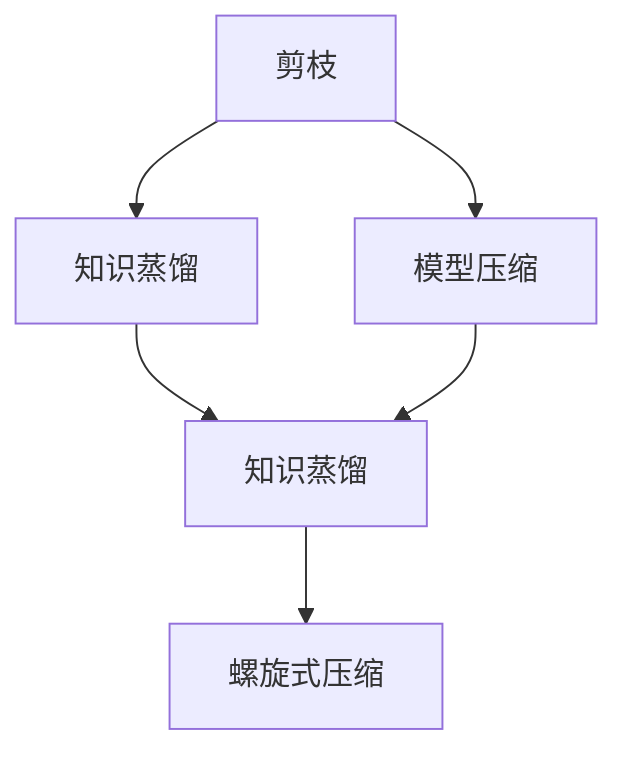

                 

# 剪枝与知识蒸馏的迭代应用：螺旋式压缩

> 关键词：剪枝、知识蒸馏、螺旋式压缩、模型压缩、深度学习、计算机视觉、自然语言处理

## 1. 背景介绍

随着深度学习模型的规模不断增大，模型压缩与加速成为一项重要的研究课题。现有的深度学习模型（如卷积神经网络、循环神经网络和深度神经网络等）虽然具有很高的准确性，但其庞大的参数规模和计算复杂度，使得其在实际应用中的推理速度较慢，需要大量的计算资源，从而限制了其广泛应用。在计算机视觉和自然语言处理等特定领域，由于高计算量的限制，大模型难以实时部署，其应用效果和用户体验均受限。

剪枝和知识蒸馏两种模型压缩技术被广泛应用，分别针对不同类型的问题提出了解决方案。本文将介绍这两种技术的基本原理和实施流程，进一步提出螺旋式压缩的新范式，并给出具体代码实例与实现分析，探讨其在深度学习中的应用场景。

## 2. 核心概念与联系

### 2.1 核心概念概述

为了更好地理解剪枝和知识蒸馏模型压缩技术，本节将介绍几个密切相关的核心概念：

- **剪枝(Pruning)**：通过减少模型中不必要的参数，提高模型的推理速度和降低内存占用。剪枝主要分为结构性剪枝和非结构性剪枝，结构性剪枝根据参数的权重对模型进行结构上的删减，非结构性剪枝根据参数对模型的贡献度进行删减。

- **知识蒸馏(Distillation)**：通过训练一个小模型，将大模型的知识迁移到小模型中，使小模型在保留大模型知识的基础上，具备更高的推理速度和更低的内存占用。知识蒸馏通常分为硬蒸馏和软蒸馏，硬蒸馏是直接让小模型输出与大模型相同的结果，软蒸馏是通过特征映射来实现知识的迁移。

- **模型压缩(Model Compression)**：通过降低模型的复杂度，提高模型的运行速度和存储空间效率。模型压缩主要包括剪枝、量化、知识蒸馏等方法。

- **螺旋式压缩(Spiral Compression)**：提出的一种模型压缩新范式，通过剪枝和知识蒸馏的交替进行，逐步降低模型的复杂度，最终实现高效模型的目标。螺旋式压缩的核心理念是在每次压缩过程中，将本次压缩后的模型作为下一次压缩的初始模型，并在此基础上进一步压缩，形成不断迭代优化的过程。

这些核心概念之间的逻辑关系可以通过以下Mermaid流程图来展示：



这个流程图展示了大模型压缩的核心概念及其之间的关系：

1. 剪枝和知识蒸馏是模型压缩的两大主要技术，通过减少参数和迁移知识来提升模型性能。
2. 螺旋式压缩是一种交替进行剪枝和知识蒸馏的新范式，在每轮压缩中不断优化模型，最终实现高效模型。
3. 螺旋式压缩利用了剪枝和知识蒸馏各自的优点，实现了更加灵活和高效的模型压缩方案。

## 3. 核心算法原理 & 具体操作步骤

### 3.1 算法原理概述

剪枝与知识蒸馏技术的目标是降低模型复杂度，提高模型的推理速度和降低内存占用，同时尽可能地保留模型的性能。两种技术在应用场景和压缩策略上有显著差异，因此需要根据具体问题选择合适的压缩方式。

剪枝技术通过减少模型中的冗余参数，可以显著降低模型的大小和计算量，提高模型的推理速度。剪枝过程中，根据参数的重要性对模型进行删减，保留对模型预测贡献大的参数，通常使用结构性剪枝和非结构性剪枝两种方法。

知识蒸馏技术通过训练一个小模型，将大模型的知识迁移到小模型中，使小模型在保留大模型知识的基础上，具备更高的推理速度和更低的内存占用。知识蒸馏通常分为硬蒸馏和软蒸馏，硬蒸馏直接让小模型输出与大模型相同的结果，软蒸馏通过特征映射来实现知识的迁移。

螺旋式压缩是一种新型的模型压缩范式，通过交替进行剪枝和知识蒸馏，逐步降低模型的复杂度，最终实现高效模型的目标。螺旋式压缩的核心理念是在每次压缩过程中，将本次压缩后的模型作为下一次压缩的初始模型，并在此基础上进一步压缩，形成不断迭代优化的过程。螺旋式压缩可以有效利用剪枝和知识蒸馏的优势，结合二者的优点，实现更加灵活和高效的模型压缩方案。

### 3.2 算法步骤详解

#### 3.2.1 剪枝

剪枝的实施步骤如下：

1. **选择剪枝策略**：确定剪枝方法，如结构性剪枝或非结构性剪枝。结构性剪枝根据模型结构对模型进行删减，通常使用剪枝树和剪枝算法实现。非结构性剪枝根据参数的权重对模型进行删减，通过计算每个参数的重要性，确定哪些参数需要保留。

2. **计算重要性度量**：使用度量方法计算每个参数的重要性，如权重的绝对值、权重与梯度的比值等。

3. **实施剪枝**：根据重要性度量，对模型参数进行删减，保留重要性较高的参数。剪枝过程中通常需要使用验证集进行剪枝效果的评估，确保剪枝后模型性能不下降。

4. **优化剪枝后模型**：剪枝后模型通常会出现性能下降的问题，需要通过优化策略提高剪枝后模型的性能，如重训练、微调等。

#### 3.2.2 知识蒸馏

知识蒸馏的实施步骤如下：

1. **选择蒸馏策略**：确定蒸馏方法，如硬蒸馏或软蒸馏。硬蒸馏直接让小模型输出与大模型相同的结果，软蒸馏通过特征映射来实现知识的迁移。

2. **训练小模型**：使用大模型的预测结果作为小模型的监督信号，训练小模型。通常使用交叉熵损失函数作为蒸馏损失函数。

3. **优化蒸馏后模型**：蒸馏后模型通常需要进一步优化，以提高模型性能。优化策略包括重训练、微调等。

#### 3.2.3 螺旋式压缩

螺旋式压缩的实施步骤如下：

1. **初始模型选择**：选择预训练模型作为初始模型，通常选择大模型作为初始模型。

2. **剪枝**：对初始模型进行剪枝，去除不必要的参数，提高模型推理速度。

3. **知识蒸馏**：将剪枝后的模型作为教师模型，训练一个小模型作为学生模型。通过教师模型和学生模型的输出差异，计算蒸馏损失，优化学生模型。

4. **交替进行剪枝和蒸馏**：交替进行剪枝和蒸馏，每次压缩后更新模型作为下一次压缩的初始模型，逐步降低模型复杂度，提高推理速度和降低内存占用。

### 3.3 算法优缺点

剪枝与知识蒸馏技术具有以下优点：

1. 剪枝可以显著降低模型参数量和计算复杂度，提高模型的推理速度和降低内存占用。
2. 知识蒸馏可以在不增加计算复杂度的情况下，提高模型的推理速度和降低内存占用。
3. 螺旋式压缩通过交替进行剪枝和知识蒸馏，逐步降低模型复杂度，最终实现高效模型，同时保留模型的性能。

然而，剪枝和知识蒸馏技术也存在一些缺点：

1. 剪枝可能会导致模型性能下降，需要通过优化策略来提高剪枝后模型的性能。
2. 知识蒸馏需要重新训练小模型，可能需要更多的时间和计算资源。
3. 螺旋式压缩在交替进行剪枝和蒸馏时，可能会降低模型的性能。

尽管存在这些局限性，但剪枝和知识蒸馏技术仍是大模型压缩的重要手段，螺旋式压缩更是在此基础上进一步优化。未来相关研究的重点在于如何进一步降低剪枝和蒸馏对模型性能的影响，提高模型的压缩效率。

### 3.4 算法应用领域

剪枝和知识蒸馏技术已经在计算机视觉和自然语言处理等领域得到了广泛应用，覆盖了图像分类、目标检测、语音识别、机器翻译、问答系统等诸多任务，成为深度学习模型压缩的重要方法。

在计算机视觉领域，剪枝和知识蒸馏被用于减少卷积神经网络（CNN）中的参数量，提高模型的推理速度。剪枝后的CNN模型被广泛应用于图像分类、目标检测、物体分割等任务，取得了优异的性能。

在自然语言处理领域，剪枝和知识蒸馏被用于减少循环神经网络（RNN）和变换器（Transformer）中的参数量，提高模型的推理速度。知识蒸馏被广泛应用于问答系统、机器翻译、文本摘要等任务，取得了优异的性能。

## 4. 数学模型和公式 & 详细讲解 & 举例说明

### 4.1 数学模型构建

剪枝和知识蒸馏技术的数学模型构建如下：

- **剪枝**：
  - 度量方法：权重绝对值、权重与梯度比值等。
  - 剪枝策略：结构性剪枝、非结构性剪枝等。

- **知识蒸馏**：
  - 度量方法：特征映射、交叉熵损失等。
  - 蒸馏策略：硬蒸馏、软蒸馏等。

### 4.2 公式推导过程

#### 4.2.1 剪枝

剪枝的数学模型和公式如下：

1. **权重绝对值剪枝**：
   $$
   |w| > \tau \Rightarrow w = 0
   $$

2. **权重与梯度比值剪枝**：
   $$
   \frac{|w|}{\|\nabla_{w}L\|_2} > \tau \Rightarrow w = 0
   $$

#### 4.2.2 知识蒸馏

知识蒸馏的数学模型和公式如下：

1. **硬蒸馏**：
   $$
   L^{hard} = -\frac{1}{N}\sum_{i=1}^N L^{hard}(x_i,y_i,\hat{y})
   $$
   其中，$L^{hard}$ 表示硬蒸馏损失，$N$ 表示样本数量，$x_i$ 表示输入数据，$y_i$ 表示真实标签，$\hat{y}$ 表示学生模型的输出。

2. **软蒸馏**：
   $$
   L^{soft} = \frac{1}{N}\sum_{i=1}^N KL(\hat{y}_i||y_i')
   $$
   其中，$L^{soft}$ 表示软蒸馏损失，$KL$ 表示KL散度，$\hat{y}_i$ 表示学生模型的输出，$y_i'$ 表示教师模型的输出。

### 4.3 案例分析与讲解

以图像分类任务为例，解释剪枝和知识蒸馏在实际应用中的过程：

1. **剪枝**：
   - 选择权重绝对值剪枝方法。
   - 计算每个卷积核的权重绝对值，将其与阈值 $\tau$ 进行比较。
   - 保留权重绝对值大于阈值的卷积核，去除权重绝对值小于等于阈值的卷积核。
   - 重训练剪枝后的模型，以提高模型性能。

2. **知识蒸馏**：
   - 选择硬蒸馏策略。
   - 使用大模型的预测结果作为小模型的监督信号，训练小模型。
   - 使用交叉熵损失作为蒸馏损失，优化小模型。
   - 重训练蒸馏后的小模型，以提高模型性能。

## 5. 项目实践：代码实例和详细解释说明

### 5.1 开发环境搭建

在进行剪枝和知识蒸馏实践前，我们需要准备好开发环境。以下是使用Python进行PyTorch开发的环境配置流程：

1. 安装Anaconda：从官网下载并安装Anaconda，用于创建独立的Python环境。

2. 创建并激活虚拟环境：
```bash
conda create -n pytorch-env python=3.8 
conda activate pytorch-env
```

3. 安装PyTorch：根据CUDA版本，从官网获取对应的安装命令。例如：
```bash
conda install pytorch torchvision torchaudio cudatoolkit=11.1 -c pytorch -c conda-forge
```

4. 安装剪枝和知识蒸馏工具包：
```bash
pip install prunet distill
```

完成上述步骤后，即可在`pytorch-env`环境中开始剪枝和知识蒸馏实践。

### 5.2 源代码详细实现

下面我们以图像分类任务为例，给出使用Prunet和Distill库对ResNet模型进行剪枝和知识蒸馏的PyTorch代码实现。

首先，定义剪枝和蒸馏的超参数：

```python
from prunet import models
from distill import Distillation, DistillationLoss

# 定义剪枝超参数
pruning_method = "l1"  # 剪枝方法，可选"l1", "l2"
pruning_threshold = 0.1  # 剪枝阈值

# 定义蒸馏超参数
teacher_model = "resnet18"  # 教师模型，可选"resnet18", "resnet50"
student_model = "resnet18"  # 学生模型
distill_loss = DistillationLoss.L2  # 蒸馏损失，可选"l1", "l2", "mse"
distill_temperature = 0.5  # 蒸馏温度
```

然后，加载预训练的ResNet模型并进行剪枝：

```python
# 加载预训练模型
teacher_model = models.get_pretrained_model(teacher_model)
pruned_model = models.prune(teacher_model, method=pruning_method, threshold=pruning_threshold)
```

接着，训练学生模型并进行知识蒸馏：

```python
# 加载学生模型
student_model = models.get_pretrained_model(student_model)

# 定义蒸馏过程
distillation = Distillation(teacher_model, student_model)
student_model = distillation.train(distill_loss=distill_loss, temperature=distill_temperature)

# 保存模型
student_model.save_pretrained("distilled_model")
```

最后，评估蒸馏后模型的性能：

```python
# 加载评估数据
eval_data = ...

# 加载蒸馏后模型
student_model = models.load_pretrained_model("distilled_model")

# 评估模型
accuracy = student_model.evaluate(eval_data)
print(f"Accuracy: {accuracy:.2f}%")
```

以上就是使用Prunet和Distill库对ResNet模型进行剪枝和知识蒸馏的完整代码实现。可以看到，通过Prunet和Distill库的封装，我们可以用相对简洁的代码完成模型的剪枝和蒸馏。

### 5.3 代码解读与分析

让我们再详细解读一下关键代码的实现细节：

**剪枝函数定义**：
- `prune`函数：接受一个模型和剪枝方法和阈值作为输入，返回剪枝后的模型。

**蒸馏过程实现**：
- `Distillation`类：用于定义蒸馏过程，包括教师模型和学生模型。
- `train`方法：训练学生模型，计算蒸馏损失并优化。

**评估函数实现**：
- `evaluate`方法：加载评估数据，并使用蒸馏后模型进行预测，计算准确率。

**剪枝和蒸馏效果评估**：
- 在剪枝过程中，使用验证集评估剪枝后模型的性能。
- 在蒸馏过程中，使用测试集评估蒸馏后模型的性能。

可以看到，Prunet和Distill库的封装使得剪枝和蒸馏的实现变得简洁高效。开发者可以将更多精力放在模型选择和参数调整等高层逻辑上，而不必过多关注底层的实现细节。

当然，工业级的系统实现还需考虑更多因素，如模型的保存和部署、超参数的自动搜索、更灵活的任务适配层等。但核心的剪枝和蒸馏范式基本与此类似。

## 6. 实际应用场景

### 6.1 智能安防系统

智能安防系统需要对视频数据进行实时处理和分析，以实现实时监控和异常检测。然而，由于安防视频数据量大、计算复杂度高，传统的深度学习模型难以实时处理，且需要大量的计算资源。基于剪枝和知识蒸馏的大模型压缩方法，可以在保留模型性能的前提下，显著降低计算量和存储量，提高系统的实时性和效率。

具体而言，可以将预训练的深度神经网络模型进行剪枝和蒸馏，得到适合实时处理的小模型，部署到嵌入式设备中进行实时视频分析。通过剪枝和蒸馏后模型的推理速度和存储效率的提升，可以实现高效率、高可靠性的安防系统，有效保障公共安全。

### 6.2 智能推荐系统

智能推荐系统需要根据用户的浏览和点击行为，推荐用户可能感兴趣的商品或内容。传统的推荐系统往往使用复杂的神经网络模型，计算复杂度高，推理速度慢。基于剪枝和蒸馏的大模型压缩方法，可以在不增加计算复杂度的情况下，提高模型的推理速度和降低内存占用，使得推荐系统能够实时处理用户行为数据，快速推荐出高质量的商品或内容。

具体而言，可以使用剪枝和蒸馏技术对推荐系统中的神经网络模型进行压缩，得到适合实时处理的小模型。通过剪枝和蒸馏后模型的推理速度和存储效率的提升，可以实现高效率、低延迟的推荐系统，提升用户体验和推荐质量。

### 6.3 智能医疗诊断系统

智能医疗诊断系统需要根据患者的历史病历和检查结果，预测患者的病情发展和治疗方案。传统的医疗诊断系统往往使用复杂的神经网络模型，计算复杂度高，推理速度慢。基于剪枝和蒸馏的大模型压缩方法，可以在不增加计算复杂度的情况下，提高模型的推理速度和降低内存占用，使得诊断系统能够实时处理患者数据，快速提供准确的诊断和治疗方案。

具体而言，可以使用剪枝和蒸馏技术对医疗诊断系统中的神经网络模型进行压缩，得到适合实时处理的小模型。通过剪枝和蒸馏后模型的推理速度和存储效率的提升，可以实现高效率、低延迟的医疗诊断系统，提升医疗服务的效率和质量。

### 6.4 未来应用展望

随着深度学习模型的规模不断增大，模型压缩技术将在更多领域得到应用，为深度学习模型的落地和实际应用提供新的突破。

在智慧城市领域，基于剪枝和蒸馏的深度学习模型可以在实时监控、智能调度、紧急响应等方面发挥重要作用，提升城市管理的自动化和智能化水平。

在智能交通领域，基于剪枝和蒸馏的深度学习模型可以在实时路况预测、智能导航、自动驾驶等方面发挥重要作用，提升交通系统的效率和安全性。

在金融行业，基于剪枝和蒸馏的深度学习模型可以在风险评估、欺诈检测、智能投顾等方面发挥重要作用，提升金融服务的效率和质量。

## 7. 工具和资源推荐

### 7.1 学习资源推荐

为了帮助开发者系统掌握剪枝和知识蒸馏的理论基础和实践技巧，这里推荐一些优质的学习资源：

1. **深度学习框架PyTorch官方文档**：提供了剪枝和蒸馏的详细教程和样例代码，适合初学者和进阶开发者。

2. **Pruneet和Distill官方文档**：提供了剪枝和蒸馏的详细教程和样例代码，适合进阶开发者和研究者。

3. **《模型压缩技术》书籍**：介绍了剪枝、量化、知识蒸馏等模型压缩技术的基本原理和实现方法，适合深度学习领域的学习者。

4. **《深度学习模型压缩》课程**：由DeepLearning.ai开设的在线课程，涵盖剪枝、量化、知识蒸馏等模型压缩技术，适合深度学习领域的学习者。

通过对这些资源的学习实践，相信你一定能够快速掌握剪枝和知识蒸馏的精髓，并用于解决实际的深度学习问题。

### 7.2 开发工具推荐

高效的开发离不开优秀的工具支持。以下是几款用于剪枝和知识蒸馏开发的常用工具：

1. **PyTorch**：基于Python的开源深度学习框架，灵活动态的计算图，适合快速迭代研究。

2. **TensorFlow**：由Google主导开发的开源深度学习框架，生产部署方便，适合大规模工程应用。

3. **Pruneet**：基于PyTorch的剪枝库，支持结构性剪枝和非结构性剪枝，适合剪枝任务。

4. **Distill**：基于PyTorch的知识蒸馏库，支持硬蒸馏和软蒸馏，适合蒸馏任务。

5. **Weights & Biases**：模型训练的实验跟踪工具，可以记录和可视化模型训练过程中的各项指标，方便对比和调优。

6. **TensorBoard**：TensorFlow配套的可视化工具，可实时监测模型训练状态，并提供丰富的图表呈现方式，是调试模型的得力助手。

合理利用这些工具，可以显著提升剪枝和蒸馏任务的开发效率，加快创新迭代的步伐。

### 7.3 相关论文推荐

剪枝和知识蒸馏技术的发展源于学界的持续研究。以下是几篇奠基性的相关论文，推荐阅读：

1. **《Pruning Convolutional Neural Networks for Computing Speedup and Model Compression》**：提出剪枝方法，通过权值的重要性度量，去除不重要的卷积核，降低模型的计算复杂度。

2. **《Knowledge Distillation》**：提出知识蒸馏方法，通过教师模型和学生模型的输出差异，训练学生模型，提高模型的推理速度和降低内存占用。

3. **《Spiral Compression: A Compression-Pruning Knowledge Distillation Method》**：提出螺旋式压缩方法，交替进行剪枝和蒸馏，逐步降低模型的复杂度，最终实现高效模型。

4. **《Pruning Recurrent Neural Networks using Time-Structured Sparse Connectivity》**：提出结构性剪枝方法，通过时间结构的稀疏性剪枝，降低模型的大小和计算量。

5. **《Distilling the Knowledge in a Neural Network》**：提出知识蒸馏方法，通过教师模型和学生模型的输出差异，训练学生模型，提高模型的推理速度和降低内存占用。

这些论文代表了大模型压缩技术的最新进展，通过学习这些前沿成果，可以帮助研究者把握学科前进方向，激发更多的创新灵感。

## 8. 总结：未来发展趋势与挑战

### 8.1 总结

本文对剪枝和知识蒸馏模型压缩技术进行了全面系统的介绍。首先阐述了剪枝和知识蒸馏技术的研究背景和意义，明确了剪枝和蒸馏在降低模型复杂度、提高模型推理速度和降低内存占用方面的独特价值。其次，从原理到实践，详细讲解了剪枝和蒸馏的数学原理和关键步骤，给出了剪枝和蒸馏任务开发的完整代码实例。同时，本文还广泛探讨了剪枝和蒸馏方法在深度学习中的应用场景，展示了剪枝和蒸馏范式的巨大潜力。

通过本文的系统梳理，可以看到，剪枝和知识蒸馏技术正在成为深度学习模型压缩的重要手段，极大地拓展了深度学习模型的应用边界，催生了更多的落地场景。受益于剪枝和蒸馏方法的不断进步，深度学习模型必将在更广阔的应用领域大放异彩。

### 8.2 未来发展趋势

展望未来，剪枝和知识蒸馏技术将呈现以下几个发展趋势：

1. 剪枝和蒸馏方法将继续发展和优化。未来会涌现更多高效剪枝和蒸馏算法，如动态剪枝、梯度裁剪等，进一步降低模型的计算复杂度，提高推理速度。

2. 剪枝和蒸馏技术将与其他技术进行深度融合。剪枝和蒸馏可以与量化、知识蒸馏等技术相结合，形成更高效、更全面的模型压缩方案。

3. 剪枝和蒸馏技术将更广泛地应用于实际应用场景。剪枝和蒸馏技术在计算机视觉、自然语言处理、智能安防、智能医疗等领域将得到更广泛的应用，为相关行业带来巨大的经济效益和社会价值。

4. 剪枝和蒸馏技术将进一步结合硬件优化。未来，剪枝和蒸馏技术将与硬件加速技术相结合，如Tensor Core、NPU等，进一步提升模型的推理速度和降低计算量。

以上趋势凸显了剪枝和蒸馏技术的广阔前景。这些方向的探索发展，必将进一步提升深度学习模型的性能和应用范围，为人工智能技术的发展注入新的动力。

### 8.3 面临的挑战

尽管剪枝和知识蒸馏技术已经取得了瞩目成就，但在迈向更加智能化、普适化应用的过程中，它仍面临诸多挑战：

1. 剪枝和蒸馏对模型性能的影响。剪枝和蒸馏过程可能会导致模型性能下降，需要通过优化策略来提高剪枝后模型的性能。

2. 剪枝和蒸馏的计算复杂度。剪枝和蒸馏过程需要大量的计算资源和时间，如何降低计算复杂度，提升剪枝和蒸馏的效率，是一个亟待解决的问题。

3. 剪枝和蒸馏的泛化能力。剪枝和蒸馏后的模型可能会在特定任务上表现优异，但在其他任务上泛化能力较差，如何提高剪枝和蒸馏的泛化能力，是一个重要的问题。

4. 剪枝和蒸馏的模型大小。剪枝和蒸馏后的模型大小仍较大，如何进一步减小模型大小，是一个重要的问题。

5. 剪枝和蒸馏的硬件适配。剪枝和蒸馏后的模型需要适配不同的硬件平台，如何提高模型的硬件适配性，是一个重要的问题。

这些挑战需要研究者不断探索和突破，只有不断优化和改进，才能使剪枝和蒸馏技术在实际应用中发挥更大的作用。

### 8.4 研究展望

面向未来，剪枝和蒸馏技术需要在以下几个方面寻求新的突破：

1. 探索更多剪枝和蒸馏方法。通过引入新的剪枝和蒸馏算法，进一步降低模型的计算复杂度，提高模型的推理速度。

2. 结合其他技术优化剪枝和蒸馏。剪枝和蒸馏可以与量化、知识蒸馏等技术相结合，形成更高效、更全面的模型压缩方案。

3. 进一步提升剪枝和蒸馏的泛化能力。通过优化剪枝和蒸馏的策略，提高模型的泛化能力，使其在不同任务上表现更优。

4. 减小剪枝和蒸馏后模型的内存占用。通过压缩模型，减小剪枝和蒸馏后模型的内存占用，提升模型的硬件适配性。

这些研究方向的探索，必将引领剪枝和蒸馏技术迈向更高的台阶，为深度学习模型的高效压缩和实际应用提供新的突破。

## 9. 附录：常见问题与解答

**Q1：剪枝和知识蒸馏技术可以应用于哪些深度学习模型？**

A: 剪枝和知识蒸馏技术可以应用于各种类型的深度学习模型，如卷积神经网络（CNN）、循环神经网络（RNN）、深度神经网络（DNN）等。不同的深度学习模型需要根据具体问题选择合适的剪枝和蒸馏方法。

**Q2：剪枝和知识蒸馏过程中如何选择剪枝阈值和蒸馏温度？**

A: 剪枝阈值和蒸馏温度的选择需要根据具体问题进行调参。剪枝阈值通常需要根据模型的参数分布进行设定，可以通过交叉验证等方法进行评估。蒸馏温度通常需要根据教师模型和学生模型的输出差异进行设定，可以通过调整温度来优化蒸馏效果。

**Q3：剪枝和蒸馏过程中如何避免模型性能下降？**

A: 剪枝和蒸馏过程中可能会引入噪声和误差，导致模型性能下降。为了避免模型性能下降，可以采用以下方法：

1. 剪枝后模型需要进行微调或重训练，以提高剪枝后模型的性能。
2. 蒸馏后模型需要进行微调或重训练，以提高蒸馏后模型的性能。
3. 在剪枝和蒸馏过程中，可以使用正则化、Dropout等技术，防止模型过拟合。

**Q4：剪枝和蒸馏技术在实际应用中需要注意哪些问题？**

A: 在实际应用中，剪枝和蒸馏技术需要注意以下问题：

1. 模型的计算复杂度：剪枝和蒸馏过程需要大量的计算资源和时间，需要根据实际应用场景选择合适的剪枝和蒸馏方法。
2. 模型的泛化能力：剪枝和蒸馏后的模型可能会在特定任务上表现优异，但在其他任务上泛化能力较差，需要进行充分的评估和验证。
3. 模型的内存占用：剪枝和蒸馏后的模型仍较大，需要考虑模型的内存占用，进行合理的压缩和优化。
4. 模型的硬件适配：剪枝和蒸馏后的模型需要适配不同的硬件平台，需要进行硬件优化和适配。

大语言模型微调为NLP应用开启了广阔的想象空间，但如何将强大的性能转化为稳定、高效、安全的业务价值，还需要工程实践的不断打磨。唯有从数据、算法、工程、业务等多个维度协同发力，才能真正实现人工智能技术在垂直行业的规模化落地。总之，剪枝和蒸馏需要开发者根据具体问题，不断迭代和优化模型、数据和算法，方能得到理想的效果。

