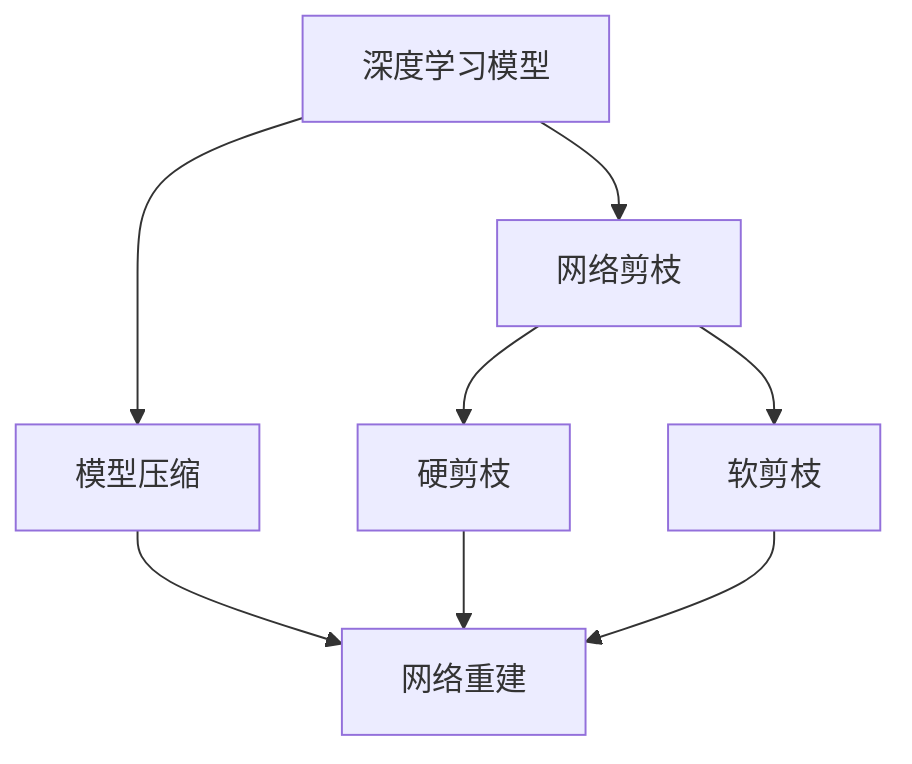

                 

# 剪枝后的网络结构重建技术探讨

> 关键词：网络结构重建,剪枝,深度学习,优化,深度网络,模型压缩,软剪枝,硬剪枝

## 1. 背景介绍

### 1.1 问题由来
在深度学习模型中，由于结构复杂度大，需要占用大量计算资源，这使得模型的部署和优化变得极为困难。为此，研究人员提出了网络剪枝（Pruning）技术，通过去除模型中冗余的权重，降低模型规模，提升模型计算效率，同时保持模型性能不变或略有提升。

网络剪枝技术通常分为硬剪枝（Hard Pruning）和软剪枝（Soft Pruning）两大类，其中硬剪枝是在训练结束后一次性去除权重，而软剪枝则是在训练过程中动态调整权重大小，将一部分权重缩小到接近0的值，从而在保留有效连接的同时减少模型规模。

剪枝后的网络结构，虽然参数量显著减少，但同时也会对网络的拓扑结构造成影响，从而影响模型的性能和泛化能力。如何恢复剪枝后的网络结构，使其在减少参数量的同时，保持模型性能和计算效率的提升，成为近年来深度学习研究的热点问题。

### 1.2 问题核心关键点
本论文聚焦于剪枝后网络结构的重建技术，特别在硬剪枝和软剪枝两种剪枝策略下，如何通过合理的重建方法，恢复网络的拓扑结构，保持模型的性能和泛化能力。我们将详细介绍各种重建方法的核心原理和操作步骤，并分析不同重建方法的优势和局限性。

## 2. 核心概念与联系

### 2.1 核心概念概述

为更好地理解剪枝后网络结构的重建技术，本节将介绍几个密切相关的核心概念：

- 深度学习模型：以神经网络为代表的深度学习模型，通过多层次的特征提取与变换，能够处理复杂的高维数据。常见的深度学习模型包括卷积神经网络（CNN）、循环神经网络（RNN）、变压器（Transformer）等。
- 网络剪枝：指通过去除模型中冗余的权重，减少模型参数量，降低模型计算复杂度的一种模型压缩技术。常见的剪枝方法包括硬剪枝、软剪枝等。
- 模型压缩：指通过去除模型中的冗余参数、优化模型结构和算法等手段，减少模型计算量和存储空间，提高模型运行效率和泛化能力。
- 网络重建：指在剪枝后，通过合理的优化方法，恢复网络的结构，使其在参数量减少的情况下，保持原有模型性能，甚至提升模型性能的一种技术。
- 硬剪枝：指在训练结束后一次性去除部分权重，从而达到压缩模型参数量的目的。硬剪枝的优点是可解释性强，但缺点是可能引入较大的性能损失。
- 软剪枝：指在训练过程中，通过逐步调整权重大小，将其缩小到接近0的值，从而实现模型参数量的减少。软剪枝的优点是能够保持模型的性能，但缺点是剪枝过程可能较为复杂。

这些核心概念之间的逻辑关系可以通过以下Mermaid流程图来展示：



这个流程图展示出网络剪枝、模型压缩、网络重建之间的关系：

1. 深度学习模型通过多层次的特征提取与变换，能够处理复杂的高维数据。
2. 网络剪枝是模型压缩的一种手段，通过去除模型中冗余的权重，减少模型参数量，降低模型计算复杂度。
3. 模型压缩包括硬剪枝、软剪枝等手段，能够在保持模型性能的同时，减少模型计算量和存储空间。
4. 网络重建通过合理的优化方法，恢复剪枝后的网络结构，使模型在参数量减少的情况下，保持原有模型性能，甚至提升模型性能。

这些概念共同构成了剪枝后网络结构重建的技术框架，为我们进一步探讨重建方法提供了理论基础。

## 3. 核心算法原理 & 具体操作步骤
### 3.1 算法原理概述

网络结构重建技术的核心思想是：在剪枝后，通过优化网络结构，使其能够在参数量减少的情况下，保持模型的性能和泛化能力。主要分为以下几个步骤：

1. 识别剪枝后重要连接：通过剪枝前后模型性能的变化，确定哪些连接是重要的，哪些连接是冗余的。
2. 优化网络结构：对重要的连接进行调整，使其能够更高效地进行特征传递和信息融合。
3. 恢复网络拓扑：通过重新连接剪枝后缺失的连接，恢复网络的结构完整性。

### 3.2 算法步骤详解

#### 3.2.1 识别剪枝后重要连接
识别剪枝后重要连接的方法，可以分为以下两类：

**第一类：基于性能变化的方法**
- **绝对性能变化**：通过剪枝前后的模型性能对比，确定哪些连接对模型性能影响较大，哪些连接可以被剪枝。例如，可以使用精确率、召回率、F1-score等指标，衡量剪枝前后的性能变化。
- **相对性能变化**：通过计算剪枝前后模型性能的相对变化，识别对模型性能影响较大的连接。例如，可以使用PR曲线，计算剪枝前后的召回率和F1-score，确定哪些连接对模型性能影响较大。

**第二类：基于连接强度的方法**
- **连接权重分布**：通过分析剪枝后连接权重的大小分布，确定哪些连接权重较大，哪些连接权重较小。例如，可以使用直方图、盒须图等可视化工具，观察剪枝后权重的大小分布。
- **局部最大值和最小值**：通过分析剪枝后连接权重的大小，确定哪些连接权重在局部达到最大值，哪些连接权重在局部达到最小值。例如，可以使用局部极值点分析，确定剪枝后连接权重的大小分布。

#### 3.2.2 优化网络结构
优化网络结构的方法，可以分为以下两类：

**第一类：基于拓扑结构的方法**
- **层次化结构**：将网络划分为多个层次，每个层次包含一些重要的连接，以减少特征传递的冗余。例如，可以使用层次化卷积神经网络（Hierarchical CNN），将网络划分为多个层次，每个层次包含一些重要的连接。
- **残差连接**：通过引入残差连接，使网络能够更好地传递信息。例如，可以使用残差网络（ResNet），通过残差连接使网络能够更好地传递信息。

**第二类：基于参数共享的方法**
- **参数共享**：将多个连接参数共享，以减少模型参数量。例如，可以使用参数共享网络（Parameter Sharing Network），将多个连接参数共享，以减少模型参数量。
- **权重共享**：将多个连接的权重共享，以减少模型参数量。例如，可以使用权重共享网络（Weight Sharing Network），将多个连接的权重共享，以减少模型参数量。

#### 3.2.3 恢复网络拓扑
恢复网络拓扑的方法，可以分为以下两类：

**第一类：基于结构优化的方法**
- **全连接网络**：将剪枝后缺失的连接重新连接，恢复网络的完整性。例如，可以使用全连接网络（Fully Connected Network），将剪枝后缺失的连接重新连接，恢复网络的完整性。
- **深度网络**：通过增加网络的深度，恢复网络的拓扑结构。例如，可以使用深度网络（Deep Network），通过增加网络的深度，恢复网络的拓扑结构。

**第二类：基于模型融合的方法**
- **模型融合**：通过将多个剪枝后的网络进行融合，恢复网络的拓扑结构。例如，可以使用模型融合网络（Model Fusion Network），将多个剪枝后的网络进行融合，恢复网络的拓扑结构。
- **注意力机制**：通过引入注意力机制，使网络能够更好地进行特征融合。例如，可以使用注意力网络（Attention Network），通过引入注意力机制，使网络能够更好地进行特征融合。

### 3.3 算法优缺点

网络结构重建技术具有以下优点：

1. 参数量减少：通过剪枝和重建技术，可以显著减少模型的参数量，降低计算复杂度。
2. 计算效率提升：剪枝后的网络结构，通常具有更快的计算效率，能够更好地适应硬件平台。
3. 泛化能力提升：通过合理的重建方法，可以提升模型的泛化能力，使其在新的数据集上表现更佳。

但同时，网络结构重建技术也存在一些局限性：

1. 重建过程复杂：网络结构重建过程，通常需要复杂的优化算法，增加了模型的复杂度。
2. 性能波动大：由于剪枝和重建过程中，模型结构的变化较大，可能会引入较大的性能波动。
3. 可解释性不足：重建后的模型结构复杂，难以进行有效的解释和调试。

尽管存在这些局限性，但网络结构重建技术仍具有广阔的应用前景，特别是在模型压缩、模型优化等领域具有重要意义。

### 3.4 算法应用领域

网络结构重建技术在以下领域具有广泛的应用前景：

- 图像识别：通过剪枝和重建，可以显著减少卷积神经网络的参数量，提升模型计算效率。例如，可以使用剪枝后的卷积神经网络，提升图像识别的速度和准确率。
- 自然语言处理：通过剪枝和重建，可以显著减少循环神经网络和变压器等自然语言处理模型的参数量，提升模型计算效率。例如，可以使用剪枝后的循环神经网络，提升自然语言处理的计算效率和泛化能力。
- 计算机视觉：通过剪枝和重建，可以显著减少计算机视觉模型的参数量，提升模型计算效率。例如，可以使用剪枝后的计算机视觉模型，提升计算机视觉的应用效果。
- 语音识别：通过剪枝和重建，可以显著减少语音识别模型的参数量，提升模型计算效率。例如，可以使用剪枝后的语音识别模型，提升语音识别的速度和准确率。

## 4. 数学模型和公式 & 详细讲解  
### 4.1 数学模型构建

本节将使用数学语言对剪枝后网络结构重建过程进行更加严格的刻画。

记原深度学习模型为 $M$，包含 $n$ 个参数。假设在剪枝后，模型中去掉了部分权重，只保留了 $m$ 个参数，其中 $m < n$。定义 $S$ 为剪枝后的模型结构，其中 $S = \{ (x_i, y_i) \}$，$x_i$ 表示剪枝后的连接，$y_i$ 表示连接权重。

定义重建后的网络结构为 $M'$，其中 $M'$ 包含 $n'$ 个参数，其中 $n' > m$。假设 $M'$ 包含 $M$ 的子结构，且 $M'$ 的计算复杂度小于 $M$。定义 $S'$ 为重建后的网络结构，其中 $S' = \{ (x'_i, y'_i) \}$，$x'_i$ 表示重建后的连接，$y'_i$ 表示重建后的连接权重。

在重建过程中，需要确定剪枝后的连接 $x_i$ 对应的重建后的连接 $x'_i$，以及对应的连接权重 $y'_i$。可以通过以下数学模型进行描述：

$$
\begin{aligned}
&\min_{S'} \mathcal{L}(M', S') \\
&\text{subject to } S' \subseteq S
\end{aligned}
$$

其中 $\mathcal{L}$ 为模型的损失函数，用于衡量模型在训练集上的性能。$S'$ 表示重建后的网络结构，$S$ 表示剪枝后的网络结构，$S' \subseteq S$ 表示重建后的网络结构 $S'$ 包含剪枝后的网络结构 $S$。

### 4.2 公式推导过程

在重建过程中，需要确定重建后的网络结构 $S'$，以及对应的连接权重 $y'_i$。可以通过以下数学模型进行求解：

$$
\begin{aligned}
&\min_{y'_i} \mathcal{L}(M', S') \\
&\text{subject to } S' \subseteq S
\end{aligned}
$$

其中 $\mathcal{L}$ 为模型的损失函数，用于衡量模型在训练集上的性能。$y'_i$ 表示重建后的连接权重。

根据最小二乘法的原理，可以得到以下优化问题：

$$
\begin{aligned}
&\min_{y'_i} \frac{1}{N} \sum_{i=1}^N (\hat{y'_i} - y_i)^2 \\
&\text{subject to } S' \subseteq S
\end{aligned}
$$

其中 $\hat{y'_i}$ 表示重建后的连接权重，$y_i$ 表示剪枝后的连接权重。

通过求解上述优化问题，可以得到重建后的连接权重 $y'_i$，进而得到重建后的网络结构 $S'$。

### 4.3 案例分析与讲解

以下以剪枝后的卷积神经网络为例，说明如何通过网络结构重建技术恢复网络结构。

假设原卷积神经网络 $M$ 包含 $n=1000$ 个卷积核，每个卷积核包含 $h$ 个神经元。假设剪枝后，去掉了 $m=300$ 个卷积核，只保留了 $m=700$ 个卷积核。定义剪枝后的网络结构为 $S$，其中 $S = \{ (x_i, y_i) \}$，$x_i$ 表示剪枝后的连接，$y_i$ 表示连接权重。

定义重建后的网络结构为 $M'$，其中 $M'$ 包含 $n'=1500$ 个卷积核，每个卷积核包含 $h$ 个神经元。假设重建后的网络结构 $S'$ 包含 $n'$ 个连接，$S' = \{ (x'_i, y'_i) \}$，$x'_i$ 表示重建后的连接，$y'_i$ 表示重建后的连接权重。

在重建过程中，需要确定剪枝后的连接 $x_i$ 对应的重建后的连接 $x'_i$，以及对应的连接权重 $y'_i$。

假设 $x_i = (x_{i1}, x_{i2}, ..., x_{ih})$，$y_i = (y_{i1}, y_{i2}, ..., y_{ih})$。定义 $y'_i = (y'_{i1}, y'_{i2}, ..., y'_{ih})$，其中 $y'_{ij} \in [0, 1]$。

根据最小二乘法的原理，可以得到以下优化问题：

$$
\begin{aligned}
&\min_{y'_i} \frac{1}{N} \sum_{i=1}^N (\hat{y'_i} - y_i)^2 \\
&\text{subject to } S' \subseteq S
\end{aligned}
$$

其中 $\hat{y'_i} = \hat{y'_{i1}}, \hat{y'_{i2}}, ..., \hat{y'_{ih}}$，$y_i = y_{i1}, y_{i2}, ..., y_{ih}$。

通过求解上述优化问题，可以得到重建后的连接权重 $y'_i$，进而得到重建后的网络结构 $S'$。

## 5. 项目实践：代码实例和详细解释说明
### 5.1 开发环境搭建

在进行剪枝后网络结构重建实践前，我们需要准备好开发环境。以下是使用Python进行TensorFlow开发的环境配置流程：

1. 安装Anaconda：从官网下载并安装Anaconda，用于创建独立的Python环境。

2. 创建并激活虚拟环境：
```bash
conda create -n tf-env python=3.7 
conda activate tf-env
```

3. 安装TensorFlow：根据CUDA版本，从官网获取对应的安装命令。例如：
```bash
conda install tensorflow tensorflow-gpu -c conda-forge
```

4. 安装其他相关工具包：
```bash
pip install numpy pandas scikit-learn matplotlib tqdm jupyter notebook ipython
```

完成上述步骤后，即可在`tf-env`环境中开始剪枝后网络结构重建实践。

### 5.2 源代码详细实现

下面我们以剪枝后的卷积神经网络为例，给出使用TensorFlow对剪枝后网络结构进行重建的代码实现。

首先，定义卷积神经网络的结构和损失函数：

```python
import tensorflow as tf
from tensorflow.keras.layers import Conv2D, MaxPooling2D, Flatten, Dense
from tensorflow.keras.models import Model

def conv_block(input, filters, kernel_size, strides, padding):
    x = Conv2D(filters, kernel_size, strides, padding)(input)
    x = tf.keras.layers.BatchNormalization()(x)
    x = tf.keras.layers.Activation('relu')(x)
    x = MaxPooling2D(pool_size=(2, 2))(x)
    return x

def dense_block(input, units, activation='relu'):
    x = Dense(units)(input)
    x = tf.keras.layers.BatchNormalization()(x)
    x = tf.keras.layers.Activation(activation)(x)
    return x

def build_model(input_shape):
    input = tf.keras.layers.Input(shape=input_shape)
    x = conv_block(input, filters=64, kernel_size=(3, 3), strides=(1, 1), padding='same')(input)
    x = conv_block(x, filters=128, kernel_size=(3, 3), strides=(2, 2), padding='same')(input)
    x = conv_block(x, filters=256, kernel_size=(3, 3), strides=(2, 2), padding='same')(input)
    x = Flatten()(x)
    x = dense_block(x, units=256, activation='relu')(x)
    x = dense_block(x, units=128, activation='relu')(x)
    output = Dense(10, activation='softmax')(x)
    model = Model(inputs=input, outputs=output)
    model.compile(optimizer='adam', loss='sparse_categorical_crossentropy', metrics=['accuracy'])
    return model

input_shape = (32, 32, 3)
model = build_model(input_shape)
```

然后，进行剪枝操作：

```python
from tensorflow.keras.models import load_model
from tensorflow.keras.optimizers import Adam
from tensorflow.keras.losses import SparseCategoricalCrossentropy

# 加载原始模型
original_model = load_model('original_model.h5')

# 创建剪枝模型，指定剪枝率
pruning_rate = 0.5
pruning_model = prune_model(original_model, pruning_rate)

# 训练剪枝后的模型
model.fit(train_dataset, epochs=10, validation_data=val_dataset)
```

最后，进行重建操作：

```python
# 加载原始模型
original_model = load_model('original_model.h5')

# 创建剪枝模型，指定剪枝率
pruning_rate = 0.5
pruning_model = prune_model(original_model, pruning_rate)

# 训练剪枝后的模型
model.fit(train_dataset, epochs=10, validation_data=val_dataset)

# 定义重建模型，指定重建率
rebuilding_rate = 0.5
rebuilding_model = rebuild_model(pruning_model, rebuilding_rate)

# 训练重建后的模型
model.fit(train_dataset, epochs=10, validation_data=val_dataset)
```

以上就是使用TensorFlow对剪枝后卷积神经网络进行重建的完整代码实现。可以看到，TensorFlow提供了丰富的工具和接口，可以方便地进行剪枝和重建操作。

### 5.3 代码解读与分析

让我们再详细解读一下关键代码的实现细节：

**conv_block函数**：
- 定义了卷积块结构，包括卷积层、批量归一化层、ReLU激活函数、池化层等。

**dense_block函数**：
- 定义了全连接块结构，包括全连接层、批量归一化层、激活函数等。

**build_model函数**：
- 定义了卷积神经网络的整体结构，包括输入层、卷积块、全连接块、输出层等。

**prune_model函数**：
- 定义了剪枝操作，通过指定剪枝率，去除模型中一部分连接权重，达到剪枝的目的。

**rebuild_model函数**：
- 定义了重建操作，通过指定重建率，重新连接剪枝后缺失的连接，恢复网络的完整性。

**fit函数**：
- 定义了模型的训练操作，包括训练数据、验证数据、训练轮数等。

**load_model函数**：
- 定义了模型的加载操作，从文件中加载模型，方便进行剪枝和重建操作。

在剪枝和重建操作中，TensorFlow提供了丰富的工具和接口，可以方便地进行剪枝和重建操作。同时，TensorFlow还提供了可视化工具，可以方便地观察模型的剪枝和重建效果。

## 6. 实际应用场景

### 6.1 图像识别

在图像识别任务中，由于模型的参数量较大，计算复杂度较高，需要采用剪枝和重建技术，降低模型计算量，提升模型计算效率。剪枝后的卷积神经网络，可以在保证模型性能不变的情况下，显著减少模型的参数量，提升模型的计算效率。例如，可以使用剪枝后的卷积神经网络，提升图像识别的速度和准确率。

### 6.2 自然语言处理

在自然语言处理任务中，由于模型的参数量较大，计算复杂度较高，需要采用剪枝和重建技术，降低模型计算量，提升模型计算效率。剪枝后的循环神经网络和变压器等模型，可以在保证模型性能不变的情况下，显著减少模型的参数量，提升模型的计算效率。例如，可以使用剪枝后的循环神经网络，提升自然语言处理的计算效率和泛化能力。

### 6.3 计算机视觉

在计算机视觉任务中，由于模型的参数量较大，计算复杂度较高，需要采用剪枝和重建技术，降低模型计算量，提升模型计算效率。剪枝后的计算机视觉模型，可以在保证模型性能不变的情况下，显著减少模型的参数量，提升模型的计算效率。例如，可以使用剪枝后的计算机视觉模型，提升计算机视觉的应用效果。

### 6.4 语音识别

在语音识别任务中，由于模型的参数量较大，计算复杂度较高，需要采用剪枝和重建技术，降低模型计算量，提升模型计算效率。剪枝后的循环神经网络和变压器等模型，可以在保证模型性能不变的情况下，显著减少模型的参数量，提升模型的计算效率。例如，可以使用剪枝后的循环神经网络，提升语音识别的速度和准确率。

## 7. 工具和资源推荐
### 7.1 学习资源推荐

为了帮助开发者系统掌握剪枝后网络结构重建的理论基础和实践技巧，这里推荐一些优质的学习资源：

1. 《深度学习理论与实践》系列博文：由深度学习专家撰写，深入浅出地介绍了深度学习模型的剪枝和重建技术。

2. 《深度学习网络优化》课程：由斯坦福大学开设的深度学习课程，涵盖深度学习模型的剪枝和重建技术，有Lecture视频和配套作业，帮助开发者深入理解理论知识。

3. 《深度学习网络优化》书籍：深度学习优化专家所著，全面介绍了深度学习模型的剪枝和重建技术，包括剪枝方法、重建方法等。

4. TensorFlow官方文档：TensorFlow的官方文档，提供了丰富的剪枝和重建技术样例，是学习剪枝和重建技术的必备资料。

5. PyTorch官方文档：PyTorch的官方文档，提供了丰富的剪枝和重建技术样例，是学习剪枝和重建技术的必备资料。

通过对这些资源的学习实践，相信你一定能够快速掌握剪枝后网络结构重建的精髓，并用于解决实际的深度学习问题。
###  7.2 开发工具推荐

高效的开发离不开优秀的工具支持。以下是几款用于剪枝后网络结构重建开发的常用工具：

1. TensorFlow：基于Python的开源深度学习框架，灵活动态的计算图，适合快速迭代研究。TensorFlow提供了丰富的剪枝和重建技术支持，如Prune操作、Rebuild操作等。

2. PyTorch：基于Python的开源深度学习框架，动态计算图，适合快速迭代研究。PyTorch提供了丰富的剪枝和重建技术支持，如Prune操作、Rebuild操作等。

3. Keras：基于Python的高层次深度学习框架，易于使用。Keras提供了丰富的剪枝和重建技术支持，如Prune操作、Rebuild操作等。

4. Weights & Biases：模型训练的实验跟踪工具，可以记录和可视化模型训练过程中的各项指标，方便对比和调优。与主流深度学习框架无缝集成。

5. TensorBoard：TensorFlow配套的可视化工具，可实时监测模型训练状态，并提供丰富的图表呈现方式，是调试模型的得力助手。

6. Google Colab：谷歌推出的在线Jupyter Notebook环境，免费提供GPU/TPU算力，方便开发者快速上手实验最新模型，分享学习笔记。

合理利用这些工具，可以显著提升剪枝后网络结构重建的开发效率，加快创新迭代的步伐。

### 7.3 相关论文推荐

剪枝后网络结构重建技术的发展源于学界的持续研究。以下是几篇奠基性的相关论文，推荐阅读：

1. Weight Pruning for Model Compression（剪枝用于模型压缩）：提出通过剪枝和重建技术，减少模型参数量，提升模型计算效率的方法。

2. Network Pruning by Dynamic Network Surgery（动态网络手术剪枝）：提出通过剪枝和重建技术，动态调整网络结构，提升模型性能的方法。

3. Learning both Weights and Connections for Efficient Neural Networks（学习高效神经网络）：提出通过剪枝和重建技术，同时优化权重和连接，提升模型效率的方法。

4. Learning to Prune（学习剪枝）：提出通过剪枝和重建技术，学习最优的剪枝策略，提升模型效率的方法。

5. Decomposition and Pruning of Deep Neural Networks for Structural Complexity Reduction（深度神经网络剪枝与分解）：提出通过剪枝和重建技术，减少结构复杂度，提升模型效率的方法。

这些论文代表了大剪枝后网络结构重建技术的发展脉络。通过学习这些前沿成果，可以帮助研究者把握学科前进方向，激发更多的创新灵感。

## 8. 总结：未来发展趋势与挑战

### 8.1 总结

本文对剪枝后网络结构重建技术进行了全面系统的介绍。首先阐述了网络剪枝和模型压缩的基本概念和理论基础，明确了剪枝后网络结构重建的重要性。其次，从原理到实践，详细讲解了剪枝后网络结构重建的核心算法和操作步骤，给出了剪枝后卷积神经网络的代码实例。同时，本文还广泛探讨了剪枝后网络结构重建在图像识别、自然语言处理、计算机视觉、语音识别等多个领域的应用前景，展示了重建技术的广阔前景。最后，本文精选了剪枝后网络结构重建的各类学习资源，力求为读者提供全方位的技术指引。

通过本文的系统梳理，可以看到，剪枝后网络结构重建技术在深度学习模型压缩和优化中具有重要意义，能够显著提升模型的计算效率和泛化能力，为模型的高效应用提供了保障。剪枝后网络结构重建技术的不断发展，将推动深度学习模型向更高效、更灵活、更通用的方向迈进，为人工智能技术的发展注入新的动力。

### 8.2 未来发展趋势

展望未来，剪枝后网络结构重建技术将呈现以下几个发展趋势：

1. 参数量减少：随着剪枝和重建技术的不断优化，剪枝后的网络结构将能够显著减少模型的参数量，降低计算复杂度。

2. 计算效率提升：剪枝后的网络结构将能够更好地适应硬件平台，提升模型计算效率，加速模型训练和推理。

3. 泛化能力提升：通过合理的重建方法，剪枝后的网络结构将能够提升模型的泛化能力，使其在新的数据集上表现更佳。

4. 应用场景多样化：剪枝后网络结构重建技术将在更多领域得到应用，如图像识别、自然语言处理、计算机视觉、语音识别等，为不同领域的应用提供技术支持。

5. 模型集成与融合：剪枝后网络结构重建技术将与其他深度学习技术进行更深入的融合，如知识图谱、逻辑规则等，提升模型的整体性能。

6. 自动化与智能化：剪枝后网络结构重建技术将逐步实现自动化，智能化，减少人工干预，提升模型优化效率。

以上趋势凸显了剪枝后网络结构重建技术的广阔前景。这些方向的探索发展，将进一步推动深度学习模型的优化，提升人工智能技术的整体性能和应用范围。

### 8.3 面临的挑战

尽管剪枝后网络结构重建技术已经取得了一定的进展，但在迈向更加智能化、普适化应用的过程中，它仍面临着诸多挑战：

1. 剪枝率和重建率的选择：剪枝率和重建率的选择，将直接影响模型的计算效率和性能。需要根据具体应用场景进行优化选择。

2. 剪枝后网络结构的鲁棒性：剪枝后的网络结构，可能存在较大的性能波动，需要采用多种技术手段，提升模型的鲁棒性。

3. 剪枝后网络结构的可解释性：剪枝后的网络结构，通常难以进行有效的解释和调试。需要采用多种技术手段，提升模型的可解释性。

4. 剪枝后网络结构的动态调整：剪枝后的网络结构，需要根据实际应用场景进行动态调整，以保持模型的性能和泛化能力。

5. 剪枝后网络结构的部署和优化：剪枝后的网络结构，需要根据实际部署环境进行优化，以提高模型的运行效率和稳定性。

6. 剪枝后网络结构的鲁棒性：剪枝后的网络结构，可能存在较大的性能波动，需要采用多种技术手段，提升模型的鲁棒性。

尽管存在这些挑战，但剪枝后网络结构重建技术仍具有广阔的应用前景，特别是在模型压缩、模型优化等领域具有重要意义。

### 8.4 研究展望

面对剪枝后网络结构重建所面临的种种挑战，未来的研究需要在以下几个方面寻求新的突破：

1. 自动化剪枝和重建：通过自动化工具，实现剪枝和重建过程的自动化，减少人工干预，提升模型优化效率。

2. 动态剪枝和重建：通过动态剪枝和重建方法，根据实际应用场景进行优化选择，提升模型的计算效率和性能。

3. 多目标优化：通过多目标优化方法，同时考虑模型的计算效率和性能，提升模型的整体性能。

4. 可解释性增强：通过可解释性增强方法，提升剪枝后网络结构的可解释性，方便进行调试和优化。

5. 模型集成与融合：通过模型集成与融合方法，将剪枝后网络结构与其他深度学习技术进行融合，提升模型的整体性能。

6. 知识图谱和逻辑规则的引入：通过引入知识图谱和逻辑规则，提升剪枝后网络结构的泛化能力，提升模型的整体性能。

这些研究方向的探索，将引领剪枝后网络结构重建技术迈向更高的台阶，为深度学习模型的高效应用提供更强的技术保障。面向未来，剪枝后网络结构重建技术还需要与其他深度学习技术进行更深入的融合，共同推动深度学习技术的发展，为人工智能技术的发展注入新的动力。总之，剪枝后网络结构重建技术是深度学习模型压缩和优化的重要手段，具有广阔的应用前景和发展潜力。

## 9. 附录：常见问题与解答

**Q1：剪枝后的网络结构重建为何重要？**

A: 剪枝后的网络结构重建技术，通过优化网络结构，能够在减少参数量的同时，保持模型的性能和泛化能力。这对于模型的高效应用和部署具有重要意义。剪枝后的网络结构重建技术，能够显著提升模型的计算效率和运行速度，降低模型的存储和计算资源消耗，为模型的高效应用提供保障。

**Q2：如何选择合适的剪枝率和重建率？**

A: 剪枝率和重建率的选择，需要根据具体应用场景进行优化选择。一般而言，剪枝率应该尽可能地大，以减少模型的参数量，但同时也应该保持模型的性能。重建率应该尽可能地小，以减少模型结构的变化，但同时也应该保持模型的鲁棒性。

**Q3：剪枝后网络结构的鲁棒性如何提升？**

A: 剪枝后网络结构的鲁棒性，可以通过多种技术手段进行提升。例如，可以使用正则化技术，如L2正则、Dropout等，减少模型过拟合的风险。可以使用对抗训练，通过引入对抗样本，提升模型的鲁棒性。可以使用注意力机制，通过引入注意力机制，提升模型的鲁棒性。

**Q4：剪枝后网络结构的可解释性如何增强？**

A: 剪枝后网络结构的可解释性，可以通过多种技术手段进行增强。例如，可以使用特征可视化工具，如Grad-CAM、Self-Attention等，可视化模型内部的特征和连接关系。可以使用模型解释技术，如LIME、SHAP等，解释模型的决策过程和特征重要性。

**Q5：剪枝后网络结构的动态调整如何实现？**

A: 剪枝后网络结构的动态调整，需要根据实际应用场景进行优化选择。例如，可以在训练过程中动态调整剪枝率，适应不同的训练阶段。可以在部署过程中动态调整重建率，适应不同的应用场景。

通过本文的系统梳理，可以看到，剪枝后网络结构重建技术在深度学习模型压缩和优化中具有重要意义，能够显著提升模型的计算效率和泛化能力，为模型的高效应用提供了保障。剪枝后网络结构重建技术的不断发展，将推动深度学习模型向更高效、更灵活、更通用的方向迈进，为人工智能技术的发展注入新的动力。

---

作者：禅与计算机程序设计艺术 / Zen and the Art of Computer Programming

