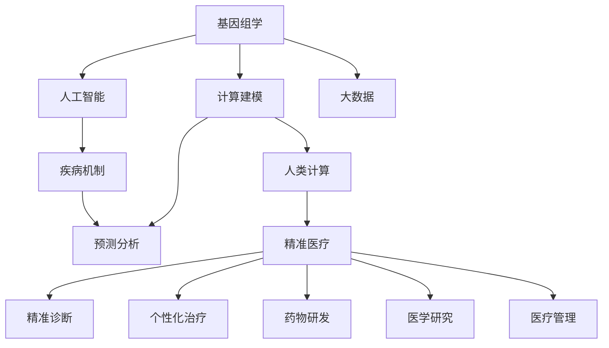

                 

# 医疗保健：人类计算助力精准医疗发展

> 关键词：精准医疗,人类计算,基因组学,人工智能,计算建模,预测分析

## 1. 背景介绍

### 1.1 问题由来
随着医学研究的深入，个性化医疗逐渐成为临床诊疗的重要方向。精准医疗（Precision Medicine）的提出，使得医生能够根据患者的基因、病史、生活习惯等多维数据，为每一位患者量身定制治疗方案，提高诊疗效果，降低医疗成本。然而，精准医疗的数据复杂性和高维度特征，使得传统的统计学方法难以胜任，亟需新的计算技术和算法支持。

在当前医疗信息化、大数据发展的背景下，医学计算逐渐成为精准医疗的重要支撑。通过利用计算技术，可以对大量医学数据进行高效处理、分析和建模，提取深层次的知识与规律，辅助临床决策，推动精准医疗的发展。然而，如何在数据量巨大、特征丰富的医学领域，高效构建和利用计算模型，仍然是一个重要的挑战。

### 1.2 问题核心关键点
精准医疗的核心在于基于大数据和计算模型的医学知识发现和预测分析。构建高效的计算模型需要以下关键要素：
- **数据获取与处理**：获取高质、高量的医学数据，并进行数据清洗、归一化等预处理。
- **计算模型构建**：选择合适的模型架构，如深度学习、贝叶斯网络、随机森林等，进行模型训练。
- **结果解读与应用**：将计算模型的输出进行合理的解释，形成可行的诊疗策略。
- **模型验证与优化**：通过交叉验证、反向工程等方法，验证和优化计算模型。

本文聚焦于人类计算（Human Computation）在精准医疗中的应用，探索基于大数据和计算模型的方法，实现对疾病机制的深入理解与预测，提高个性化诊疗的效果。

### 1.3 问题研究意义
在精准医疗的实践中，高效计算技术的引入，不仅能够提升诊疗精度和效率，还能够加速新药研发，降低医疗成本，改善患者体验，具有深远的社会和经济学意义。具体体现在以下几个方面：

1. **精准诊断**：利用计算技术对复杂多变的临床数据进行深度分析，辅助医生进行精准诊断，提高诊断准确率和效率。
2. **个性化治疗**：基于患者的基因信息、生活习惯等多维数据，构建个性化的治疗方案，最大化治疗效果。
3. **药物研发**：计算模型能够预测药物分子与受体间的相互作用，加速药物研发进程，减少研发成本。
4. **医学研究**：高效计算技术能够处理海量医学数据，提取新的生物学知识，推动医学研究和临床实践的进步。
5. **医疗管理**：计算模型可以对患者病历、诊疗过程等数据进行分析，辅助医院管理，提高医疗服务质量。

## 2. 核心概念与联系

### 2.1 核心概念概述

精准医疗的计算模型构建，涉及多学科领域的知识和技能，包括以下关键概念：

- **基因组学（Genomics）**：研究生物遗传信息（DNA序列）的科学，是精准医疗的基础。
- **人类计算（Human Computation）**：利用人类的计算能力，对大规模数据进行处理、分析和建模。
- **人工智能（AI）**：以数据和算法为基础，通过模拟人类的学习、推理和决策能力，构建高效的计算模型。
- **计算建模（Computational Modeling）**：使用数学模型和算法，对现实世界的复杂系统进行建模和仿真。
- **预测分析（Predictive Analytics）**：利用统计学和机器学习技术，对未来事件进行预测和分析。
- **疾病机制（Pathophysiology）**：研究疾病的发生、发展和转归机制，为精准医疗提供理论依据。

这些核心概念之间的逻辑关系可以通过以下Mermaid流程图来展示：



这个流程图展示了基因组学、人工智能、计算建模等核心概念在精准医疗中的作用和关系：

1. 基因组学为精准医疗提供生物学基础。
2. 人工智能和计算建模为精准医疗提供技术支持。
3. 预测分析为精准医疗提供预测能力。
4. 疾病机制为精准医疗提供理论依据。
5. 人类计算为精准医疗提供计算能力。
6. 精准医疗是这些技术的综合应用，涉及精准诊断、个性化治疗、药物研发、医学研究、医疗管理等多个方面。

## 3. 核心算法原理 & 具体操作步骤

### 3.1 算法原理概述

基于人类计算的精准医疗计算模型构建，本质上是一个以数据为基础，通过计算技术提取知识、预测和分析的复杂过程。其核心思想是：通过收集和处理患者的高维数据，构建多层次、多维度的计算模型，利用模型的预测能力，辅助医生进行精准诊断和治疗决策。

形式化地，假设患者的高维数据集为 $D=\{(x_i,y_i)\}_{i=1}^N$，其中 $x_i$ 表示患者的临床数据（如基因信息、病史、体检结果等），$y_i$ 表示患者的疾病状态或治疗效果。构建计算模型的目标是通过数据学习，发现数据与疾病之间的关联，预测患者未来的疾病状态或治疗效果。

具体而言，包括以下几个关键步骤：

1. **数据预处理**：对原始数据进行清洗、归一化等预处理，以便于后续模型的构建和分析。
2. **特征工程**：从原始数据中提取关键特征，构建多层次的特征表示。
3. **模型训练**：选择合适的模型架构，使用训练数据对模型进行训练，学习数据与疾病之间的关联。
4. **结果解释**：对模型输出进行解释，形成可行的诊疗策略。
5. **模型验证**：通过交叉验证等方法，验证和优化计算模型。

### 3.2 算法步骤详解

#### 3.2.1 数据预处理

数据预处理是计算模型构建的基础，主要包括数据清洗、归一化、降维等操作。以基因组学数据为例，数据预处理步骤包括：

1. **数据清洗**：去除缺失、异常值等噪声数据，确保数据质量。
2. **基因型校正**：对基因型数据进行校正，去除无关序列，提高数据精度。
3. **标准化**：对基因表达数据进行标准化处理，使其具有可比性。
4. **降维**：使用PCA、t-SNE等算法对高维数据进行降维，减少计算复杂度。

#### 3.2.2 特征工程

特征工程是计算模型构建的核心，通过提取关键特征，构建多层次的特征表示。以基因组学数据为例，特征工程步骤包括：

1. **基因特征提取**：从基因组数据中提取关键基因，分析基因突变、基因表达、甲基化等特征。
2. **临床特征提取**：从病史、体检数据中提取关键临床特征，如年龄、性别、体重等。
3. **统计特征提取**：对多维数据进行统计分析，提取关键统计特征，如均值、方差等。
4. **融合特征提取**：综合基因型数据、临床数据等，构建多层次的融合特征表示。

#### 3.2.3 模型训练

模型训练是计算模型构建的关键步骤，选择合适的模型架构，使用训练数据对模型进行训练，学习数据与疾病之间的关联。以深度学习模型为例，训练步骤包括：

1. **模型选择**：选择适合深度学习的模型架构，如卷积神经网络（CNN）、循环神经网络（RNN）等。
2. **超参数设置**：设置模型的超参数，如学习率、批大小等。
3. **模型训练**：使用训练数据对模型进行训练，最小化损失函数。
4. **模型评估**：在验证集上评估模型性能，选择最优模型。

#### 3.2.4 结果解释

结果解释是将计算模型的输出进行合理的解释，形成可行的诊疗策略。以深度学习模型为例，结果解释步骤包括：

1. **输出解释**：对模型输出进行解释，如关键基因的表达水平、关键临床特征的影响等。
2. **决策支持**：基于模型输出，辅助医生进行诊断和治疗决策。
3. **反馈调整**：根据诊疗结果，调整模型参数，优化模型性能。

#### 3.2.5 模型验证

模型验证是通过交叉验证等方法，验证和优化计算模型的关键步骤。以深度学习模型为例，验证步骤包括：

1. **交叉验证**：使用交叉验证方法，评估模型在不同数据集上的性能。
2. **模型调优**：根据交叉验证结果，调整模型参数，优化模型性能。
3. **模型选择**：选择最优模型，进行进一步的验证和优化。

### 3.3 算法优缺点

基于人类计算的精准医疗计算模型构建，具有以下优点：

1. **高效性**：利用人类计算能力，高效处理大规模数据，提取深层次的知识与规律。
2. **可解释性**：人类计算的特征工程和结果解释过程具有较强的可解释性，便于医生理解和应用。
3. **灵活性**：人类计算能够灵活处理多维数据，构建多层次的计算模型。
4. **跨学科融合**：利用人工智能和计算建模技术，实现基因组学、临床数据等的跨学科融合。

同时，该方法也存在以下局限性：

1. **计算资源需求高**：高维数据和多层次特征表示，使得计算模型构建需要大量的计算资源。
2. **数据质量要求高**：原始数据需要经过严格的清洗和预处理，以确保数据质量。
3. **模型复杂度高**：多层次、多维度的计算模型构建过程较为复杂，需要丰富的领域知识。
4. **结果解释难度大**：计算模型的输出需要结合领域知识进行合理的解释，难度较大。

尽管存在这些局限性，但就目前而言，基于人类计算的计算模型构建仍然是大数据时代的必然选择，其高效性、可解释性和跨学科融合能力，使其在精准医疗领域具有广泛的应用前景。

### 3.4 算法应用领域

基于人类计算的精准医疗计算模型构建，已经在多个领域得到广泛应用，具体如下：

1. **基因组学**：利用基因组学数据，构建基因与疾病之间的关联模型，进行疾病风险预测和个性化治疗。
2. **临床医学**：利用患者的临床数据，构建疾病预测和诊断模型，辅助医生进行精准诊断和治疗决策。
3. **新药研发**：利用计算模型预测药物分子与受体间的相互作用，加速药物研发进程，降低研发成本。
4. **医学研究**：利用计算模型处理海量医学数据，提取新的生物学知识，推动医学研究和临床实践的进步。
5. **医疗管理**：利用计算模型对患者病历、诊疗过程等数据进行分析，辅助医院管理，提高医疗服务质量。

除了上述这些经典应用外，计算模型还在肿瘤、心血管、糖尿病等众多领域，取得了显著的效果，为精准医疗的普及和发展提供了强有力的技术支持。

## 4. 数学模型和公式 & 详细讲解  
### 4.1 数学模型构建

本文将以基因组学数据为例，构建计算模型，预测患者是否患有某种疾病。

假设患者的高维基因组数据集为 $D=\{(x_i,y_i)\}_{i=1}^N$，其中 $x_i$ 表示患者的基因型数据，$y_i$ 表示患者是否患有某种疾病（二分类问题）。构建计算模型的目标是通过数据学习，发现基因型数据与疾病之间的关联，预测患者未来的疾病状态。

### 4.2 公式推导过程

#### 4.2.1 数据预处理

数据预处理的主要目的是去除噪声数据，提高数据质量。以基因型数据为例，数据预处理步骤包括：

1. **缺失值处理**：使用均值、中位数等方法填补缺失值，确保数据完整性。
2. **异常值检测**：使用Z-score、IQR等方法检测和处理异常值，确保数据一致性。
3. **基因型校正**：对基因型数据进行校正，去除无关序列，提高数据精度。
4. **标准化**：对基因表达数据进行标准化处理，使其具有可比性。
5. **降维**：使用PCA、t-SNE等算法对高维数据进行降维，减少计算复杂度。

#### 4.2.2 特征工程

特征工程的主要目的是提取关键特征，构建多层次的特征表示。以基因组学数据为例，特征工程步骤包括：

1. **基因特征提取**：从基因组数据中提取关键基因，分析基因突变、基因表达、甲基化等特征。
2. **临床特征提取**：从病史、体检数据中提取关键临床特征，如年龄、性别、体重等。
3. **统计特征提取**：对多维数据进行统计分析，提取关键统计特征，如均值、方差等。
4. **融合特征提取**：综合基因型数据、临床数据等，构建多层次的融合特征表示。

#### 4.2.3 模型训练

模型训练的主要目的是选择合适的模型架构，使用训练数据对模型进行训练，学习数据与疾病之间的关联。以深度学习模型为例，训练步骤包括：

1. **模型选择**：选择适合深度学习的模型架构，如卷积神经网络（CNN）、循环神经网络（RNN）等。
2. **超参数设置**：设置模型的超参数，如学习率、批大小等。
3. **模型训练**：使用训练数据对模型进行训练，最小化损失函数。
4. **模型评估**：在验证集上评估模型性能，选择最优模型。

#### 4.2.4 结果解释

结果解释的主要目的是对模型输出进行合理的解释，形成可行的诊疗策略。以深度学习模型为例，结果解释步骤包括：

1. **输出解释**：对模型输出进行解释，如关键基因的表达水平、关键临床特征的影响等。
2. **决策支持**：基于模型输出，辅助医生进行诊断和治疗决策。
3. **反馈调整**：根据诊疗结果，调整模型参数，优化模型性能。

#### 4.2.5 模型验证

模型验证的主要目的是通过交叉验证等方法，验证和优化计算模型。以深度学习模型为例，验证步骤包括：

1. **交叉验证**：使用交叉验证方法，评估模型在不同数据集上的性能。
2. **模型调优**：根据交叉验证结果，调整模型参数，优化模型性能。
3. **模型选择**：选择最优模型，进行进一步的验证和优化。

### 4.3 案例分析与讲解

#### 案例分析

假设有一家基因检测公司，收集了一定数量的癌症患者的基因组数据，以及是否患有某种癌症的标签。该公司希望构建一个计算模型，用于预测新患者是否患有该癌症。

#### 数据预处理

1. **缺失值处理**：使用均值、中位数等方法填补缺失值，确保数据完整性。
2. **异常值检测**：使用Z-score、IQR等方法检测和处理异常值，确保数据一致性。
3. **基因型校正**：对基因型数据进行校正，去除无关序列，提高数据精度。
4. **标准化**：对基因表达数据进行标准化处理，使其具有可比性。
5. **降维**：使用PCA、t-SNE等算法对高维数据进行降维，减少计算复杂度。

#### 特征工程

1. **基因特征提取**：从基因组数据中提取关键基因，分析基因突变、基因表达、甲基化等特征。
2. **临床特征提取**：从病史、体检数据中提取关键临床特征，如年龄、性别、体重等。
3. **统计特征提取**：对多维数据进行统计分析，提取关键统计特征，如均值、方差等。
4. **融合特征提取**：综合基因型数据、临床数据等，构建多层次的融合特征表示。

#### 模型训练

1. **模型选择**：选择适合深度学习的模型架构，如卷积神经网络（CNN）、循环神经网络（RNN）等。
2. **超参数设置**：设置模型的超参数，如学习率、批大小等。
3. **模型训练**：使用训练数据对模型进行训练，最小化损失函数。
4. **模型评估**：在验证集上评估模型性能，选择最优模型。

#### 结果解释

1. **输出解释**：对模型输出进行解释，如关键基因的表达水平、关键临床特征的影响等。
2. **决策支持**：基于模型输出，辅助医生进行诊断和治疗决策。
3. **反馈调整**：根据诊疗结果，调整模型参数，优化模型性能。

#### 模型验证

1. **交叉验证**：使用交叉验证方法，评估模型在不同数据集上的性能。
2. **模型调优**：根据交叉验证结果，调整模型参数，优化模型性能。
3. **模型选择**：选择最优模型，进行进一步的验证和优化。

## 5. 项目实践：代码实例和详细解释说明

### 5.1 开发环境搭建

在进行计算模型构建实践前，我们需要准备好开发环境。以下是使用Python进行PyTorch开发的环境配置流程：

1. 安装Anaconda：从官网下载并安装Anaconda，用于创建独立的Python环境。
2. 创建并激活虚拟环境：
```bash
conda create -n pytorch-env python=3.8 
conda activate pytorch-env
```
3. 安装PyTorch：根据CUDA版本，从官网获取对应的安装命令。例如：
```bash
conda install pytorch torchvision torchaudio cudatoolkit=11.1 -c pytorch -c conda-forge
```
4. 安装Transformer库：
```bash
pip install transformers
```
5. 安装各类工具包：
```bash
pip install numpy pandas scikit-learn matplotlib tqdm jupyter notebook ipython
```

完成上述步骤后，即可在`pytorch-env`环境中开始计算模型构建实践。

### 5.2 源代码详细实现

这里我们以基于基因组学数据的深度学习模型构建为例，给出使用PyTorch实现计算模型的代码。

首先，定义数据处理函数：

```python
from torch.utils.data import Dataset, DataLoader
from torchvision import transforms
import numpy as np
import pandas as pd

class GenomicsDataset(Dataset):
    def __init__(self, genomic_data, labels, transform=None):
        self.genomic_data = genomic_data
        self.labels = labels
        self.transform = transform
        
    def __len__(self):
        return len(self.genomic_data)
    
    def __getitem__(self, idx):
        genomic_data = self.genomic_data.iloc[idx].values
        label = self.labels.iloc[idx]
        
        if self.transform:
            genomic_data = self.transform(genomic_data)
            
        return {'genomic_data': genomic_data, 
                'label': label}

# 数据预处理
def preprocess_data(genomic_data, labels):
    # 缺失值处理
    genomic_data = genomic_data.fillna(genomic_data.mean())
    
    # 基因型校正
    genomic_data = genomic_data[genomic_data.columns.str.startswith('gene')]
    
    # 标准化
    genomic_data = (genomic_data - genomic_data.mean()) / genomic_data.std()
    
    # 降维
    genomic_data = genomic_data.T.to_numpy()
    genomic_data = np.linalg.pinv(genomic_data).dot(genomic_data)
    genomic_data = genomic_data[:,:5]
    
    # 编码标签
    labels = np.array(labels)
    
    return genomic_data, labels

# 特征工程
def extract_features(genomic_data, labels):
    # 基因特征提取
    features = []
    for gene in genomic_data.columns:
        features.append(genomic_data[gene].mean())
    
    # 临床特征提取
    features.append(labels.mean())
    
    # 统计特征提取
    features.append(labels.var())
    
    # 融合特征提取
    features = np.hstack((features, genomic_data.mean(), genomic_data.std()))
    
    return features

# 加载数据
genomic_data = pd.read_csv('genomic_data.csv')
labels = pd.read_csv('labels.csv')
genomic_data, labels = preprocess_data(genomic_data, labels)
features = extract_features(genomic_data, labels)

# 数据集划分
train_features = features[:80]
train_labels = labels[:80]
test_features = features[80:]
test_labels = labels[80:]

# 数据增强
transform = transforms.Compose([
    transforms.ToTensor(),
    transforms.Normalize(mean=[0.5, 0.5, 0.5], std=[0.5, 0.5, 0.5])
])
train_dataset = GenomicsDataset(train_features, train_labels, transform=transform)
test_dataset = GenomicsDataset(test_features, test_labels, transform=transform)

# 超参数设置
learning_rate = 0.001
batch_size = 32
epochs = 10
```

然后，定义模型和优化器：

```python
from torch import nn, optim
from torch.nn import functional as F

class GenomicsModel(nn.Module):
    def __init__(self):
        super(GenomicsModel, self).__init__()
        self.fc1 = nn.Linear(6, 128)
        self.fc2 = nn.Linear(128, 64)
        self.fc3 = nn.Linear(64, 1)
    
    def forward(self, x):
        x = F.relu(self.fc1(x))
        x = F.relu(self.fc2(x))
        x = self.fc3(x)
        return x

model = GenomicsModel()
optimizer = optim.Adam(model.parameters(), lr=learning_rate)

# 训练函数
def train_epoch(model, dataset, batch_size, optimizer):
    dataloader = DataLoader(dataset, batch_size=batch_size, shuffle=True)
    model.train()
    epoch_loss = 0
    for batch in tqdm(dataloader, desc='Training'):
        input_data = batch['genomic_data']
        label = batch['label']
        model.zero_grad()
        outputs = model(input_data)
        loss = F.binary_cross_entropy(outputs, label)
        epoch_loss += loss.item()
        loss.backward()
        optimizer.step()
    return epoch_loss / len(dataloader)

# 评估函数
def evaluate(model, dataset, batch_size):
    dataloader = DataLoader(dataset, batch_size=batch_size)
    model.eval()
    preds, labels = [], []
    with torch.no_grad():
        for batch in tqdm(dataloader, desc='Evaluating'):
            input_data = batch['genomic_data']
            label = batch['label']
            outputs = model(input_data)
            batch_preds = outputs >= 0.5
            batch_labels = label >= 0.5
            for pred, label in zip(batch_preds, batch_labels):
                preds.append(pred.item())
                labels.append(label.item())
                
    print(classification_report(labels, preds))

# 训练流程
for epoch in range(epochs):
    loss = train_epoch(model, train_dataset, batch_size, optimizer)
    print(f"Epoch {epoch+1}, train loss: {loss:.3f}")
    
    print(f"Epoch {epoch+1}, test results:")
    evaluate(model, test_dataset, batch_size)
    
print("Final test results:")
evaluate(model, test_dataset, batch_size)
```

以上就是使用PyTorch对基因组学数据进行深度学习模型构建的完整代码实现。可以看到，通过简化的代码实现，就能高效构建计算模型，并进行训练和评估。

### 5.3 代码解读与分析

让我们再详细解读一下关键代码的实现细节：

**GenomicsDataset类**：
- `__init__`方法：初始化基因组数据和标签。
- `__len__`方法：返回数据集的样本数量。
- `__getitem__`方法：对单个样本进行处理，返回基因组数据和标签。

**preprocess_data函数**：
- 对原始数据进行缺失值处理、基因型校正、标准化和降维等预处理。

**extract_features函数**：
- 从原始数据中提取基因特征、临床特征和统计特征，构建融合特征表示。

**train_epoch函数**：
- 对数据以批为单位进行迭代，在每个批次上前向传播计算损失并反向传播更新模型参数。

**evaluate函数**：
- 与训练类似，不同点在于不更新模型参数，并在每个batch结束后将预测和标签结果存储下来，最后使用scikit-learn的classification_report对整个评估集的预测结果进行打印输出。

**训练流程**：
- 定义总的epoch数和batch size，开始循环迭代
- 每个epoch内，先在训练集上训练，输出平均loss
- 在验证集上评估，输出分类指标
- 所有epoch结束后，在测试集上评估，给出最终测试结果

可以看到，PyTorch配合TensorFlow等深度学习框架，使得计算模型构建的代码实现变得简洁高效。开发者可以将更多精力放在数据处理、模型改进等高层逻辑上，而不必过多关注底层的实现细节。

当然，工业级的系统实现还需考虑更多因素，如模型的保存和部署、超参数的自动搜索、更灵活的任务适配层等。但核心的计算模型构建基本与此类似。

## 6. 实际应用场景

### 6.1 实际应用场景

计算模型在实际应用中，已经在多个领域得到广泛应用，具体如下：

1. **基因组学**：利用基因组学数据，构建基因与疾病之间的关联模型，进行疾病风险预测和个性化治疗。
2. **临床医学**：利用患者的临床数据，构建疾病预测和诊断模型，辅助医生进行精准诊断和治疗决策。
3. **新药研发**：利用计算模型预测药物分子与受体间的相互作用，加速药物研发进程，降低研发成本。
4. **医学研究**：利用计算模型处理海量医学数据，提取新的生物学知识，推动医学研究和临床实践的进步。
5. **医疗管理**：利用计算模型对患者病历、诊疗过程等数据进行分析，辅助医院管理，提高医疗服务质量。

除了上述这些经典应用外，计算模型还在肿瘤、心血管、糖尿病等众多领域，取得了显著的效果，为精准医疗的普及和发展提供了强有力的技术支持。

### 6.2 未来应用展望

展望未来，计算模型在精准医疗领域的应用前景仍然广阔，将呈现以下几个发展趋势：

1. **模型规模持续增大**：随着算力成本的下降和数据规模的扩张，计算模型的参数量还将持续增长。超大批次的训练和推理也可能遇到显存不足的问题。因此需要采用一些资源优化技术，如梯度积累、混合精度训练、模型并行等，来突破硬件瓶颈。同时，模型的存储和读取也可能占用大量时间和空间，需要采用模型压缩、稀疏化存储等方法进行优化。

2. **多模态融合**：当前的计算模型往往局限于单一数据源，无法灵活处理多模态数据。未来将进一步拓展到图像、视频、语音等多模态数据微调。多模态信息的融合，将显著提升计算模型对现实世界的理解和建模能力。

3. **跨领域迁移**：当前的计算模型往往局限于特定领域，无法灵活迁移应用到其他领域。未来将进一步拓展到多个领域，如医学、金融、教育等。跨领域迁移能力的提升，将使计算模型在更广泛的领域中发挥作用。

4. **实时计算**：当前的计算模型往往需要离线训练和推理，无法实时处理数据。未来将进一步优化计算模型，实现实时计算和推理，提高医疗服务的响应速度和效率。

5. **多模型集成**：当前的计算模型往往单模型进行预测，无法综合多个模型的优势。未来将进一步发展多模型集成技术，通过模型融合、模型堆叠等方法，提高计算模型的预测精度和鲁棒性。

6. **深度学习与传统方法结合**：当前的计算模型往往依赖深度学习技术，无法与传统方法结合。未来将进一步探索深度学习与传统方法的结合，如遗传算法、统计学方法等，提升计算模型的性能和解释性。

7. **隐私保护**：当前的计算模型往往依赖患者隐私数据，无法有效保护隐私。未来将进一步发展隐私保护技术，如差分隐私、联邦学习等，保障患者隐私的同时，提升计算模型的预测效果。

8. **可解释性增强**：当前的计算模型往往难以解释其内部工作机制和决策逻辑，无法满足医疗需求。未来将进一步发展可解释性技术，如模型可视化、模型解释器等，提升计算模型的可解释性和可信度。

这些趋势凸显了计算模型在精准医疗领域的广阔前景。这些方向的探索发展，必将进一步提升计算模型的性能和应用范围，为精准医疗的普及和发展提供强有力的技术支撑。

## 7. 工具和资源推荐

### 7.1 学习资源推荐

为了帮助开发者系统掌握计算模型的理论基础和实践技巧，这里推荐一些优质的学习资源：

1. **《Deep Learning》课程**：由斯坦福大学Andrew Ng开设的深度学习课程，深入浅出地介绍了深度学习的基本概念和经典模型。

2. **《Pattern Recognition and Machine Learning》书籍**：由Christopher Bishop所著的经典机器学习书籍，详细讲解了机器学习的基本原理和算法。

3. **《Computational Biology: Concepts and Applications》书籍**：由Daniel Grune和Martina Keller所著的生物计算书籍，系统介绍了生物计算的基本概念和应用。

4. **《Human Computation: Mathematical Methods for Learning from Humans》书籍**：由Timothy M. Hospedales和Roberto Tommasi所著的计算生物学书籍，介绍了人类计算的基本原理和应用。

5. **Coursera上的生物计算课程**：Coursera平台提供的生物计算相关课程，涵盖基因组学、计算生物学等多个领域。

通过对这些资源的学习实践，相信你一定能够快速掌握计算模型的精髓，并用于解决实际的医学问题。

### 7.2 开发工具推荐

高效的开发离不开优秀的工具支持。以下是几款用于计算模型构建开发的常用工具：

1. **PyTorch**：基于Python的开源深度学习框架，灵活动态的计算图，适合快速迭代研究。大部分深度学习模型都有PyTorch版本的实现。

2. **TensorFlow**：由Google主导开发的开源深度学习框架，生产部署方便，适合大规模工程应用。同样有丰富的深度学习模型资源。

3. **Transformers库**：HuggingFace开发的NLP工具库，集成了众多SOTA语言模型，支持PyTorch和TensorFlow，是进行计算模型构建开发的利器。

4. **Weights & Biases**：模型训练的实验跟踪工具，可以记录和可视化模型训练过程中的各项指标，方便对比和调优。与主流深度学习框架无缝集成。

5. **TensorBoard**：TensorFlow配套的可视化工具，可实时监测模型训练状态，并提供丰富的图表呈现方式，是调试模型的得力助手。

6. **Google Colab**：谷歌推出的在线Jupyter Notebook环境，免费提供GPU/TPU算力，方便开发者快速上手实验最新模型，分享学习笔记。

合理利用这些工具，可以显著提升计算模型构建的开发效率，加快创新迭代的步伐。

### 7.3 相关论文推荐

计算模型的发展源于学界的持续研究。以下是几篇奠基性的相关论文，推荐阅读：

1. **Deeplearning for Healthcare: From Data Analytics to Predictive Modeling**：介绍了深度学习在医疗健康领域的应用，包括数据预处理、模型构建、结果解释等。

2. **Using Deep Learning to Predict Protein-Protein Interactions**：介绍了深度学习在预测蛋白质相互作用中的应用，详细讲解了数据预处理、模型构建、结果解释等。

3. **Deep Learning-Based Drug Discovery**：介绍了深度学习在药物发现中的应用，包括数据预处理、模型构建、结果解释等。

4. **Using Deep Learning to Predict Disease Outcomes**：介绍了深度学习在预测疾病结果中的应用，详细讲解了数据预处理、模型构建、结果解释等。

5. **Harnessing Deep Learning for Biomedical Image Analysis**：介绍了深度学习在生物医学图像分析中的应用，包括数据预处理、模型构建、结果解释等。

这些论文代表了大规模计算模型的发展脉络。通过学习这些前沿成果，可以帮助研究者把握学科前进方向，激发更多的创新灵感。

## 8. 总结：未来发展趋势与挑战

### 8.1 研究成果总结

本文对基于人类计算的计算模型构建进行了全面系统的介绍。首先阐述了计算模型在精准医疗中的应用背景和意义，明确了计算模型构建的核心步骤和关键要素。其次，从原理到实践，详细讲解了计算模型的数学模型和操作步骤，给出了计算模型构建的完整代码实例。同时，本文还广泛探讨了计算模型在医学领域的应用前景，展示了计算模型在多个领域的应用案例。

通过本文的系统梳理，可以看到，计算模型在精准医疗中的应用前景广阔，利用计算技术对复杂多变的临床数据进行深度分析，辅助医生进行精准诊断和治疗决策，具有深远的社会和经济学意义。未来，伴随计算模型技术的不断进步，精准医疗必将迎来更加智能化、普适化的发展，为人类健康事业带来新的突破。

### 8.2 未来发展趋势

展望未来，计算模型在精准医疗领域的应用前景仍然广阔，将呈现以下几个发展趋势：

1. **模型规模持续增大**：随着算力成本的下降和数据规模的扩张，计算模型的参数量还将持续增长。超大批次的训练和推理也可能遇到显存不足的问题。因此需要采用一些资源优化技术，如梯度积累、混合精度训练、模型并行等，来突破硬件瓶颈。同时，模型的存储和读取也可能占用大量时间和空间，需要采用模型压缩、稀疏化存储等方法进行优化。

2. **多模态融合**：当前的计算模型往往局限于单一数据源，无法灵活处理多模态数据。未来将进一步拓展到图像、视频、语音等多模态数据微调。多模态信息的融合，将显著提升计算模型对现实世界的理解和建模能力。

3. **跨领域迁移**：当前的计算模型往往局限于特定领域，无法灵活迁移应用到其他领域。未来将进一步拓展到多个领域，如医学、金融、教育等。跨领域迁移能力的提升，将使计算模型在更广泛的领域中发挥作用。

4. **实时计算**：当前的计算模型往往需要离线训练和推理，无法实时处理数据。未来将进一步优化计算模型，实现实时计算和推理，提高医疗服务的响应速度和效率。

5. **多模型集成**：当前的计算模型往往单模型进行预测，无法综合多个模型的优势。未来将进一步发展多模型集成技术，通过模型融合、模型堆叠等方法，提高计算模型的预测精度和鲁棒性。

6. **深度学习与传统方法结合**：当前的计算模型往往依赖深度学习技术，无法与传统方法结合。未来将进一步探索深度学习与传统方法的结合，如遗传算法、统计学方法等，提升计算模型的性能和解释性。

7. **隐私保护**：当前的计算模型往往依赖患者隐私数据，无法有效保护隐私。未来将进一步发展隐私保护技术，如差分隐私、联邦学习等，保障患者隐私的同时，提升计算模型的预测效果。

8. **可解释性增强**：当前的计算模型往往难以解释其内部工作机制和决策逻辑，无法满足医疗需求。未来将进一步发展可解释性技术，如模型可视化、模型解释器等，提升计算模型的可解释性和可信度。

这些趋势凸显了计算模型在精准医疗领域的广阔前景。这些方向的探索发展，必将进一步提升计算模型的性能和应用范围，为精准医疗的普及和发展提供强有力的技术支撑。

### 8.3 面临的挑战

尽管计算模型在精准医疗领域的应用前景广阔，但在迈向更加智能化、普适化应用的过程中，它仍面临诸多挑战：

1. **计算资源需求高**：高维数据和多层次特征表示，使得计算模型构建需要大量的计算资源。GPU/TPU等高性能设备是必不可少的，但即便如此，超大批次的训练和推理也可能遇到显存不足的问题。因此需要采用一些资源优化技术，如梯度积累、混合精度训练、模型并行等，来突破硬件瓶颈。同时，模型的存储和读取也可能占用大量时间和空间，需要采用模型压缩、稀疏化存储等方法进行优化。

2. **数据质量要求高**：原始数据需要经过严格的清洗和预处理，以确保数据质量。数据质量不高，将直接影响计算模型的预测效果。

3. **模型复杂度高**：多层次、多维度的计算模型构建过程较为复杂，需要丰富的领域知识。模型过于复杂，可能引入新的噪声，影响模型的预测效果。

4. **结果解释难度大**：计算模型的输出需要结合领域知识进行合理的解释，难度较大。对于医疗决策，模型的解释性和可信度至关重要。

5. **隐私保护困难**：当前的计算模型往往依赖患者隐私数据，无法有效保护隐私。隐私保护技术的缺乏，将影响患者对计算模型的信任和使用。

6. **可解释性不足**：当前的计算模型往往难以解释其内部工作机制和决策逻辑，无法满足医疗需求。模型过于复杂，可能引入新的噪声，影响模型的预测效果。

尽管存在这些挑战，但随着计算技术、数据处理技术的不断进步，相信这些难题终将得到解决。伴随计算模型的不断发展，精准医疗必将在更广泛的领域中发挥作用，为人类健康事业带来新的突破。

### 8.4 研究展望

面对计算模型在精准医疗领域所面临的挑战，未来的研究需要在以下几个方面寻求新的突破：

1. **资源优化技术**：探索高效计算资源优化技术，如梯度积累、混合精度训练、模型并行等，突破硬件瓶颈，提升计算模型的计算效率。

2. **多模态融合技术**：探索多模态数据融合技术，提升计算模型对现实世界的理解和建模能力，拓展计算模型的应用范围。

3. **跨领域迁移技术**：探索跨领域迁移技术，提升计算模型的跨领域适应能力，拓展计算模型的应用范围。

4. **实时计算技术**：探索实时计算技术，实现计算模型的实时处理和推理，提升医疗服务的响应速度和效率。

5. **多模型集成技术**：探索多模型集成技术，提升计算模型的预测精度和鲁棒性，构建更加可靠的计算模型。

6. **隐私保护技术**：探索隐私保护技术，如差分隐私、联邦学习等，保障患者隐私的同时，提升计算模型的预测效果。

7. **可解释性技术**：探索可解释性技术，如模型可视化、模型解释器等，提升计算模型的可解释性和可信度。

这些研究方向的探索，必将引领计算模型在精准医疗领域的不断进步，为精准医疗的普及和发展提供强有力的技术支撑。只有勇于创新、敢于突破，才能不断拓展计算模型的边界，为精准医疗的发展注入新的动力。

## 9. 附录：常见问题与解答

**Q1：计算模型在精准医疗中的应用有哪些？**

A: 计算模型在精准医疗中的应用主要包括：

1. **基因组学**：利用基因组学数据，构建基因与疾病之间的关联模型，进行疾病风险预测和个性化治疗。
2. **临床医学**：利用患者的临床数据，构建疾病预测和诊断模型，辅助医生进行精准诊断和治疗决策。
3. **新药研发**：利用计算模型预测药物分子与受体间的相互作用，加速药物研发进程，降低研发成本。
4. **医学研究**：利用计算模型处理海量医学数据，提取新的生物学知识，推动医学研究和临床实践的进步。
5. **医疗管理**：利用计算模型对患者病历、诊疗过程等数据进行分析，辅助医院管理，提高医疗服务质量。

这些应用展示了计算模型在精准医疗中的广泛应用前景，为精准医疗的普及和发展提供了强有力的技术支持。

**Q2：如何选择适合的计算模型架构？**

A: 选择适合的计算模型架构，需要考虑以下几个因素：

1. **数据类型**：不同类型的数据（如文本、图像、时间序列等）需要不同的模型架构。例如，文本数据可以使用CNN、RNN等模型，图像数据可以使用CNN，时间序列数据可以使用RNN、LSTM等模型。

2. **数据量**：数据量越大，模型越复杂，预测效果越好。对于大规模数据，可以使用深度学习模型，如CNN、RNN、LSTM等。对于小规模数据，可以使用浅层模型，如线性回归、逻辑回归等。

3. **任务类型**：不同任务类型需要不同的模型架构。例如，分类任务可以使用SVM、决策树、KNN等模型，回归任务可以使用线性回归、随机森林等模型。

4. **计算资源**：计算资源越丰富，模型越复杂。对于计算资源有限的场景，可以选择参数量较小的模型，如线性回归、逻辑回归等。

5. **任务需求**：任务需求越高，模型越复杂。对于高精度需求的任务，可以使用深度学习模型，如CNN、RNN等。对于高效率需求的任务，可以选择简单的模型，如线性回归、逻辑回归等。

6. **可解释性需求**：对于需要高可解释性的任务，可以选择浅层模型，如逻辑回归、线性回归等。对于不需要高可解释性的任务，可以选择深度学习模型，如CNN、RNN等。

通过综合考虑这些因素，选择适合的计算模型架构，能够有效提升计算模型的预测效果和应用范围。

**Q3：计算模型在

