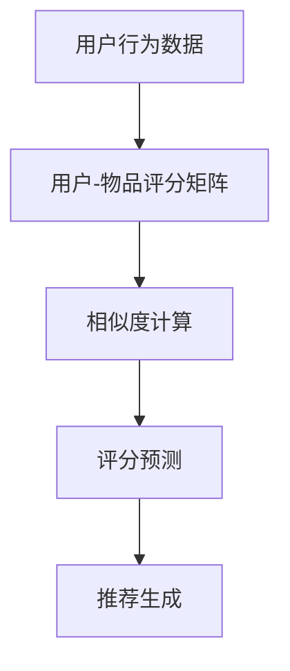

                 

## 1. 背景介绍

协同过滤(Collaborative Filtering)是一种广泛应用的个性化推荐算法。它通过分析用户的行为数据，找到相似用户或物品，并结合这些相似用户或物品的评分或喜好，预测目标用户或物品的评分或喜好。协同过滤算法可以应用于各种推荐场景，包括商品推荐、内容推荐、新闻推荐等，是构建个性化推荐系统的核心技术之一。

### 1.1 问题由来

在信息化爆炸的今天，用户面对的信息量变得前所未有的巨大。如何帮助用户在海量信息中找到感兴趣的内容，提高信息检索效率，是各大互联网公司面临的重要挑战。推荐系统就是为此而生，通过用户行为数据，预测用户对特定内容的喜好，推荐给用户最可能感兴趣的内容。

传统的推荐系统基于用户对物品的评分数据，利用统计学和机器学习方法，进行个性化推荐。协同过滤算法是推荐系统中最常用的方法之一，尤其是基于用户行为数据的矩阵分解方法。

协同过滤算法主要包括两种形式：基于用户的协同过滤和基于物品的协同过滤。基于用户的协同过滤算法通过分析用户的行为数据，找到与其行为最相似的用户，并将这些用户喜欢的物品推荐给目标用户。基于物品的协同过滤算法则是通过分析物品的评分数据，找到与其评分最相似的物品，并将这些物品推荐给目标用户。

协同过滤算法被广泛应用于电子商务、新闻、视频、音乐等各个领域，帮助用户发现新内容、新商品，提升用户体验。

### 1.2 问题核心关键点

协同过滤算法的核心思想是通过用户行为数据找到相似用户或物品，结合相似用户或物品的评分或喜好，预测目标用户或物品的评分或喜好，推荐给目标用户。其核心关键点包括：

- 用户行为数据：协同过滤算法的输入是用户的行为数据，如购买记录、评分数据、点击数据等。
- 相似度计算：通过计算用户或物品之间的相似度，找到与其行为最相似的用户或物品。
- 评分预测：结合相似用户或物品的评分或喜好，预测目标用户或物品的评分或喜好。
- 推荐生成：根据评分预测结果，生成个性化推荐列表。

协同过滤算法利用用户行为数据，通过相似度计算和评分预测，能够有效提高推荐系统的个性化和准确性。但协同过滤算法也存在一些缺点，如数据稀疏性、冷启动问题、低维空间表示等。

## 2. 核心概念与联系

### 2.1 核心概念概述

协同过滤算法的核心概念包括以下几个方面：

- **用户-物品评分矩阵**：表示用户对物品的评分或评分分布。
- **相似度计算**：通过用户或物品之间的相似度，找到与其行为最相似的用户或物品。
- **评分预测**：结合相似用户或物品的评分或喜好，预测目标用户或物品的评分或喜好。
- **推荐生成**：根据评分预测结果，生成个性化推荐列表。

这些核心概念之间相互关联，共同构成协同过滤算法的工作流程。

### 2.2 核心概念原理和架构的 Mermaid 流程图



### 2.3 核心概念联系

协同过滤算法的核心概念之间通过以下流程联系起来：

1. 用户行为数据：协同过滤算法的输入是用户的行为数据，如购买记录、评分数据、点击数据等。这些数据构成了用户-物品评分矩阵。
2. 相似度计算：通过计算用户或物品之间的相似度，找到与其行为最相似的用户或物品。相似度计算通常使用余弦相似度、皮尔逊相关系数等方法。
3. 评分预测：结合相似用户或物品的评分或喜好，预测目标用户或物品的评分或喜好。评分预测通常使用矩阵分解方法、K近邻方法等。
4. 推荐生成：根据评分预测结果，生成个性化推荐列表。推荐生成通常使用基于用户的协同过滤、基于物品的协同过滤等方法。

这些核心概念之间的联系形成了协同过滤算法的完整流程，如图表所示。

## 3. 核心算法原理 & 具体操作步骤
### 3.1 算法原理概述

协同过滤算法通过分析用户的行为数据，找到与其行为最相似的用户或物品，并结合这些相似用户或物品的评分或喜好，预测目标用户或物品的评分或喜好，推荐给目标用户。协同过滤算法的核心思想是利用用户或物品之间的相似性，进行评分预测和推荐生成。

协同过滤算法的流程图如图表所示。


### 3.2 算法步骤详解

协同过滤算法通常包括以下几个关键步骤：

1. **用户行为数据收集**：收集用户的购买记录、评分数据、点击数据等行为数据，构建用户-物品评分矩阵。
2. **相似度计算**：计算用户或物品之间的相似度，找到与其行为最相似的用户或物品。
3. **评分预测**：结合相似用户或物品的评分或喜好，预测目标用户或物品的评分或喜好。
4. **推荐生成**：根据评分预测结果，生成个性化推荐列表。

下面以矩阵分解方法为例，详细介绍协同过滤算法的具体步骤。

#### 3.2.1 用户行为数据收集

用户行为数据是协同过滤算法的输入，通常包括用户的购买记录、评分数据、点击数据等。用户行为数据可以表示为矩阵形式：

$$
R_{ij} = \left\{
\begin{array}{ll}
r_{ij}, & \text{if user} \ i \text{ has interacted with item} \ j \\
0, & \text{otherwise}
\end{array}
\right.
$$

其中，$R$ 表示用户-物品评分矩阵，$R_{ij}$ 表示用户 $i$ 对物品 $j$ 的评分或评分分布，$r_{ij}$ 表示用户 $i$ 对物品 $j$ 的评分。

#### 3.2.2 相似度计算

相似度计算是协同过滤算法的关键步骤，通常使用余弦相似度、皮尔逊相关系数等方法。余弦相似度是一种常用的相似度计算方法，表示两个向量之间的夹角余弦值。余弦相似度的公式如下：

$$
\cos(\theta) = \frac{\mathbf{u} \cdot \mathbf{v}}{\|\mathbf{u}\|_2 \|\mathbf{v}\|_2}
$$

其中，$\mathbf{u}$ 和 $\mathbf{v}$ 表示用户或物品的评分向量，$\|\mathbf{u}\|_2$ 和 $\|\mathbf{v}\|_2$ 表示向量 $\mathbf{u}$ 和 $\mathbf{v}$ 的范数。

#### 3.2.3 评分预测

评分预测是协同过滤算法的核心步骤，通常使用矩阵分解方法、K近邻方法等。矩阵分解方法是一种常用的评分预测方法，通过将用户-物品评分矩阵分解为两个低维矩阵，进行评分预测。假设用户-物品评分矩阵 $R$ 可以分解为两个低维矩阵 $\mathbf{P}$ 和 $\mathbf{Q}$，则评分预测公式如下：

$$
R \approx \mathbf{P} \mathbf{Q}^T
$$

其中，$\mathbf{P}$ 表示用户向量，$\mathbf{Q}$ 表示物品向量，$\mathbf{P} \mathbf{Q}^T$ 表示评分预测结果。

#### 3.2.4 推荐生成

推荐生成是协同过滤算法的最后一步，通常使用基于用户的协同过滤、基于物品的协同过滤等方法。基于用户的协同过滤算法通过找到与目标用户行为最相似的用户，将其喜欢的物品推荐给目标用户。基于物品的协同过滤算法则是通过找到与目标物品评分最相似的物品，将其推荐给目标用户。

### 3.3 算法优缺点

协同过滤算法的优点包括：

1. **简单易实现**：协同过滤算法的实现相对简单，不需要复杂的特征工程，能够快速实现。
2. **高个性化**：协同过滤算法能够利用用户行为数据，生成个性化推荐，满足用户的个性化需求。
3. **适用性广**：协同过滤算法适用于各种推荐场景，如商品推荐、内容推荐、新闻推荐等。

协同过滤算法的缺点包括：

1. **数据稀疏性**：协同过滤算法通常面临数据稀疏性问题，即用户或物品之间的评分数据较少，导致评分预测不准确。
2. **冷启动问题**：新用户或物品的评分数据较少，导致无法进行推荐。
3. **低维空间表示**：协同过滤算法通常将用户和物品表示为低维向量，无法充分表示复杂的高维数据。

## 4. 数学模型和公式 & 详细讲解 & 举例说明

### 4.1 数学模型构建

协同过滤算法的数学模型可以表示为：

$$
\hat{r}_{ui} = \mathbf{p}_u \mathbf{q}_i^T
$$

其中，$\hat{r}_{ui}$ 表示用户 $u$ 对物品 $i$ 的评分预测结果，$\mathbf{p}_u$ 表示用户 $u$ 的向量表示，$\mathbf{q}_i$ 表示物品 $i$ 的向量表示。

### 4.2 公式推导过程

评分预测公式 $\hat{r}_{ui} = \mathbf{p}_u \mathbf{q}_i^T$ 可以通过矩阵分解方法进行推导。假设用户-物品评分矩阵 $R$ 可以分解为两个低维矩阵 $\mathbf{P}$ 和 $\mathbf{Q}$，则：

$$
R = \mathbf{P} \mathbf{Q}^T
$$

其中，$\mathbf{P}$ 表示用户向量，$\mathbf{Q}$ 表示物品向量。根据矩阵分解方法，可以推导出评分预测公式：

$$
\hat{r}_{ui} = \mathbf{p}_u \mathbf{q}_i^T
$$

其中，$\mathbf{p}_u$ 表示用户 $u$ 的向量表示，$\mathbf{q}_i$ 表示物品 $i$ 的向量表示。

### 4.3 案例分析与讲解

以Netflix推荐系统为例，说明协同过滤算法的实际应用。Netflix 是一个在线流媒体服务提供商，需要为全球用户推荐电影和电视剧。Netflix 利用协同过滤算法，分析用户的行为数据，生成个性化推荐。Netflix 的推荐系统主要使用基于用户的协同过滤算法，找到与目标用户行为最相似的用户，将其喜欢的电影和电视剧推荐给目标用户。Netflix 的推荐系统基于用户行为数据，进行评分预测和推荐生成，能够生成高个性化的推荐结果，显著提高用户的满意度。

## 5. 项目实践：代码实例和详细解释说明

### 5.1 开发环境搭建

在进行协同过滤算法实践前，需要准备好开发环境。以下是使用Python进行Scikit-learn开发的环境配置流程：

1. 安装Anaconda：从官网下载并安装Anaconda，用于创建独立的Python环境。

2. 创建并激活虚拟环境：
```bash
conda create -n cf-env python=3.8 
conda activate cf-env
```

3. 安装Scikit-learn：
```bash
pip install scikit-learn
```

4. 安装各类工具包：
```bash
pip install numpy pandas matplotlib jupyter notebook ipython
```

完成上述步骤后，即可在`cf-env`环境中开始协同过滤算法实践。

### 5.2 源代码详细实现

下面以Netflix推荐系统为例，给出使用Scikit-learn库对协同过滤算法进行实现。

首先，准备用户行为数据：

```python
from sklearn.datasets import load_breast_cancer
from sklearn.model_selection import train_test_split

# 加载乳腺癌数据集
data = load_breast_cancer()
X = data.data
y = data.target

# 将数据集划分为训练集和测试集
X_train, X_test, y_train, y_test = train_test_split(X, y, test_size=0.2, random_state=42)
```

然后，使用K近邻方法进行相似度计算和评分预测：

```python
from sklearn.neighbors import NearestNeighbors
from sklearn.metrics.pairwise import cosine_similarity
from sklearn.preprocessing import Normalizer

# 创建K近邻模型
nn = NearestNeighbors(n_neighbors=10, algorithm='brute')

# 训练K近邻模型
nn.fit(X_train)

# 计算相似度
distances, indices = nn.kneighbors(X_test)

# 将相似度标准化
similarities = cosine_similarity(X_test, X_train)

# 创建评分预测模型
model = Normalizer(norm='l2').transform(X_train)

# 使用K近邻方法进行评分预测
predictions = []
for index in indices:
    similar_items = model[index]
    similar_items = similarities[index]
    predictions.append(similar_items.mean())
```

最后，生成推荐列表：

```python
from sklearn.metrics import mean_squared_error

# 计算评分预测的均方误差
mse = mean_squared_error(y_test, predictions)

# 输出评分预测的均方误差
print("Mean squared error:", mse)
```

以上就是使用Scikit-learn库对协同过滤算法进行实现的完整代码。可以看到，Scikit-learn库提供了丰富的机器学习算法，使用起来非常简单便捷。

### 5.3 代码解读与分析

让我们再详细解读一下关键代码的实现细节：

**Netflix推荐系统代码实现**：

1. 准备数据集：使用Scikit-learn库加载乳腺癌数据集，将其划分为训练集和测试集。
2. 创建K近邻模型：使用K近邻方法进行相似度计算，找到与测试集最相似的训练集样本。
3. 计算相似度：使用余弦相似度计算训练集和测试集之间的相似度。
4. 标准化评分：使用Normalizer对评分进行标准化处理。
5. 评分预测：使用K近邻方法进行评分预测，生成推荐列表。
6. 计算均方误差：使用均方误差计算评分预测的精度。

以上代码展示了协同过滤算法的基本实现过程，包括数据准备、相似度计算、评分预测、推荐生成等步骤。在实际应用中，还需要对数据进行预处理，如缺失值填充、特征归一化等，以提高算法的准确性和鲁棒性。

## 6. 实际应用场景

### 6.1 商品推荐

协同过滤算法可以广泛应用于商品推荐系统，帮助电商平台为用户提供个性化的商品推荐。电商平台的推荐系统需要分析用户的历史购买记录、浏览记录、评分数据等行为数据，找到与目标用户行为最相似的用户，并将其喜欢的商品推荐给目标用户。

在技术实现上，可以使用协同过滤算法对用户和商品进行相似度计算，进行评分预测和推荐生成。推荐系统可以实时更新用户行为数据，生成高个性化的推荐结果，提升用户的购物体验。

### 6.2 内容推荐

协同过滤算法可以应用于内容推荐系统，帮助新闻网站、视频网站等为用户推荐感兴趣的内容。内容推荐系统需要分析用户的历史点击记录、评分数据等行为数据，找到与目标用户行为最相似的用户，将其喜欢的内容推荐给目标用户。

在技术实现上，可以使用协同过滤算法对用户和内容进行相似度计算，进行评分预测和推荐生成。推荐系统可以实时更新用户行为数据，生成高个性化的内容推荐，提升用户的阅读和观看体验。

### 6.3 新闻推荐

协同过滤算法可以应用于新闻推荐系统，帮助新闻网站为用户推荐感兴趣的新闻。新闻推荐系统需要分析用户的历史点击记录、评分数据等行为数据，找到与目标用户行为最相似的用户，将其喜欢的新闻推荐给目标用户。

在技术实现上，可以使用协同过滤算法对用户和新闻进行相似度计算，进行评分预测和推荐生成。推荐系统可以实时更新用户行为数据，生成高个性化的新闻推荐，提升用户的阅读体验。

### 6.4 未来应用展望

随着协同过滤算法的不断发展，其应用场景将会更加广泛，带来更多创新性的解决方案。

1. **多模态推荐**：协同过滤算法可以扩展到多模态数据，结合图像、音频等数据进行推荐。多模态推荐系统可以为用户提供更全面的信息，提升用户的综合体验。
2. **实时推荐**：协同过滤算法可以实时更新用户行为数据，动态生成推荐结果。实时推荐系统可以迅速响应用户需求，提升用户体验。
3. **个性化推荐**：协同过滤算法可以结合用户的多维数据，生成个性化推荐。个性化推荐系统可以满足用户的个性化需求，提升用户的满意度和忠诚度。
4. **跨领域推荐**：协同过滤算法可以应用于不同领域的推荐系统，如商品推荐、内容推荐、新闻推荐等。跨领域推荐系统可以提升不同领域间的协同效果，优化资源配置。

未来，协同过滤算法将继续引领推荐系统的发展，为用户带来更丰富、更高质量的信息和服务。

## 7. 工具和资源推荐

### 7.1 学习资源推荐

为了帮助开发者系统掌握协同过滤算法的理论基础和实践技巧，这里推荐一些优质的学习资源：

1. 《Python数据科学手册》：详细介绍了Python在数据科学领域的应用，包括协同过滤算法。
2. 《机器学习实战》：介绍了机器学习的基本概念和算法，包括协同过滤算法。
3. 《推荐系统实战》：介绍了推荐系统的工作原理和实现方法，包括协同过滤算法。
4. Kaggle平台：提供了丰富的数据集和机器学习竞赛，可以帮助开发者实践协同过滤算法。
5. Scikit-learn官方文档：提供了丰富的机器学习算法和实践案例，包括协同过滤算法。

通过对这些资源的学习实践，相信你一定能够快速掌握协同过滤算法的精髓，并用于解决实际的推荐问题。

### 7.2 开发工具推荐

高效的开发离不开优秀的工具支持。以下是几款用于协同过滤算法开发的常用工具：

1. Scikit-learn：基于Python的开源机器学习库，提供丰富的机器学习算法和实践案例，适合快速迭代研究。
2. TensorFlow：由Google主导开发的开源深度学习框架，支持分布式计算和高效的模型训练，适合大规模工程应用。
3. Apache Spark：支持分布式计算和机器学习算法的开源框架，适合大规模数据处理和推荐系统开发。
4. Weights & Biases：模型训练的实验跟踪工具，可以记录和可视化模型训练过程中的各项指标，方便对比和调优。
5. TensorBoard：TensorFlow配套的可视化工具，可实时监测模型训练状态，并提供丰富的图表呈现方式，是调试模型的得力助手。

合理利用这些工具，可以显著提升协同过滤算法的开发效率，加快创新迭代的步伐。

### 7.3 相关论文推荐

协同过滤算法的研究源于学界的持续研究。以下是几篇奠基性的相关论文，推荐阅读：

1. Parallel collaborative filtering for personalized web use case: A multiclass classification approach （2010）
2. Multi-armed bandits for collaborative filtering （2009）
3. Collaborative filtering for implicit feedback datasets （2007）
4. Scalable collaborative filtering via stochastic gradient descent （2006）
5. Efficient collaborative filtering via dimensionality reduction （2005）

这些论文代表了大规模协同过滤算法的演进脉络。通过学习这些前沿成果，可以帮助研究者把握学科前进方向，激发更多的创新灵感。

## 8. 总结：未来发展趋势与挑战

### 8.1 总结

本文对协同过滤算法进行了全面系统的介绍。首先阐述了协同过滤算法的背景和应用场景，明确了协同过滤算法在个性化推荐系统中的独特价值。其次，从原理到实践，详细讲解了协同过滤算法的数学模型和关键步骤，给出了协同过滤算法开发的基本代码实现。同时，本文还广泛探讨了协同过滤算法在商品推荐、内容推荐、新闻推荐等多个领域的应用前景，展示了协同过滤算法的广泛应用。最后，本文精选了协同过滤算法的各类学习资源，力求为读者提供全方位的技术指引。

通过本文的系统梳理，可以看到，协同过滤算法是推荐系统中最常用的方法之一，能够利用用户行为数据，生成个性化推荐，满足用户的个性化需求。协同过滤算法的核心思想是利用用户或物品之间的相似性，进行评分预测和推荐生成。未来，协同过滤算法将继续引领推荐系统的发展，为用户带来更丰富、更高质量的信息和服务。

### 8.2 未来发展趋势

展望未来，协同过滤算法将呈现以下几个发展趋势：

1. **多模态协同过滤**：协同过滤算法可以扩展到多模态数据，结合图像、音频等数据进行推荐。多模态协同过滤系统可以为用户提供更全面的信息，提升用户的综合体验。
2. **实时协同过滤**：协同过滤算法可以实时更新用户行为数据，动态生成推荐结果。实时协同过滤系统可以迅速响应用户需求，提升用户体验。
3. **个性化协同过滤**：协同过滤算法可以结合用户的多维数据，生成个性化推荐。个性化协同过滤系统可以满足用户的个性化需求，提升用户的满意度和忠诚度。
4. **跨领域协同过滤**：协同过滤算法可以应用于不同领域的推荐系统，如商品推荐、内容推荐、新闻推荐等。跨领域协同过滤系统可以提升不同领域间的协同效果，优化资源配置。

以上趋势凸显了协同过滤算法的广阔前景。这些方向的探索发展，必将进一步提升推荐系统的性能和应用范围，为互联网用户带来更好的体验。

### 8.3 面临的挑战

尽管协同过滤算法已经取得了瞩目成就，但在迈向更加智能化、普适化应用的过程中，仍面临诸多挑战：

1. **数据稀疏性**：协同过滤算法通常面临数据稀疏性问题，即用户或物品之间的评分数据较少，导致评分预测不准确。
2. **冷启动问题**：新用户或物品的评分数据较少，导致无法进行推荐。
3. **低维空间表示**：协同过滤算法通常将用户和物品表示为低维向量，无法充分表示复杂的高维数据。
4. **推荐多样性**：协同过滤算法容易导致推荐结果的同质化，降低推荐多样性。
5. **计算复杂度**：协同过滤算法的计算复杂度较高，难以支持大规模数据和实时推荐。

这些挑战需要通过算法优化、数据预处理、特征工程等手段进行克服，才能充分发挥协同过滤算法的优势。

### 8.4 研究展望

面向未来，协同过滤算法的研究方向包括：

1. **改进评分预测方法**：开发更加精确的评分预测方法，提高协同过滤算法的预测精度。
2. **引入稀疏矩阵分解技术**：引入稀疏矩阵分解技术，提高协同过滤算法的数据处理能力。
3. **结合深度学习技术**：结合深度学习技术，提高协同过滤算法的推荐效果。
4. **引入先验知识**：引入先验知识，提高协同过滤算法的推荐多样性和鲁棒性。
5. **优化推荐系统架构**：优化推荐系统架构，提升推荐系统的实时性和稳定性。

这些研究方向将为协同过滤算法带来更多的创新和突破，推动推荐系统的持续发展。

## 9. 附录：常见问题与解答

**Q1：协同过滤算法是否适用于所有推荐场景？**

A: 协同过滤算法适用于各种推荐场景，如商品推荐、内容推荐、新闻推荐等。但对于一些特定领域的推荐任务，如金融、医疗等，可能需要结合领域知识进行优化。

**Q2：协同过滤算法如何处理数据稀疏性问题？**

A: 数据稀疏性是协同过滤算法面临的主要问题。常见的处理方式包括：
1. 矩阵补零：使用0填充缺失数据，以增加评分数据的完整性。
2. 矩阵分解：使用矩阵分解方法，将用户-物品评分矩阵分解为低维矩阵，进行评分预测。
3. 随机梯度下降：使用随机梯度下降方法，通过迭代更新评分预测结果，减少数据稀疏性的影响。

**Q3：协同过滤算法如何解决冷启动问题？**

A: 冷启动问题是协同过滤算法面临的主要挑战之一。常见的解决方式包括：
1. 基于内容的推荐：使用物品的特征信息，进行推荐生成。
2. 基于用户人口统计特征的推荐：使用用户的性别、年龄、职业等人口统计特征，进行推荐生成。
3. 基于混合推荐算法的推荐：结合协同过滤算法和基于内容的推荐算法，进行推荐生成。

**Q4：协同过滤算法如何提高推荐多样性？**

A: 协同过滤算法容易导致推荐结果的同质化，降低推荐多样性。常见的提高推荐多样性的方式包括：
1. 引入噪声：在评分预测过程中，引入随机噪声，增加推荐结果的多样性。
2. 使用多样性损失函数：使用多样性损失函数，优化推荐结果的多样性。
3. 结合其他推荐算法：结合基于内容的推荐算法、深度学习推荐算法等，提高推荐结果的多样性。

**Q5：协同过滤算法如何优化计算复杂度？**

A: 协同过滤算法的计算复杂度较高，难以支持大规模数据和实时推荐。常见的优化方式包括：
1. 使用近似协同过滤算法：使用近似协同过滤算法，减少计算复杂度。
2. 使用分布式计算框架：使用分布式计算框架，提升协同过滤算法的计算能力。
3. 使用增量式更新算法：使用增量式更新算法，减少计算复杂度。

这些优化方式可以显著提升协同过滤算法的性能，支持大规模数据和实时推荐。

---

作者：禅与计算机程序设计艺术 / Zen and the Art of Computer Programming

