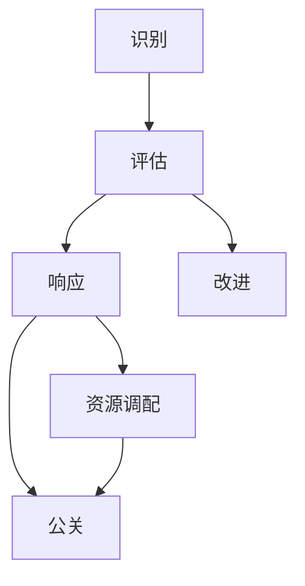

                 

# 危机管理：有效应对突发事件的方法

危机管理是每个企业和组织都需要面对的重要课题。无论是在自然灾害、疫情爆发、还是网络安全威胁等突发事件中，有效的危机管理都能极大地减少损失，保障组织运营稳定。本文将深入探讨危机管理的核心概念、关键算法、具体操作步骤，并结合实际案例分析，系统阐述如何构建一套高效、全面的危机管理机制。

## 1. 背景介绍

### 1.1 问题由来
在现代快节奏社会，危机事件频发，对组织的破坏力也愈发强大。从2008年的全球金融危机到2020年的新冠疫情，再到近年频发的网络攻击事件，每一次突发事件都对企业的运营、声誉和经济造成深远影响。因此，如何在突发事件发生时迅速反应、有效应对，成为每个组织必须面对的挑战。

### 1.2 问题核心关键点
危机管理的关键在于以下几方面：

- **快速响应**：在突发事件发生时，能够迅速识别、评估并采取行动。
- **有效沟通**：与内部员工、客户和合作伙伴保持透明、及时的沟通，稳定情绪，传递信心。
- **资源调配**：快速调配人员、物资和财务资源，保障应急处置和运营维护。
- **持续改进**：在事件处理过程中不断总结经验，完善应急预案，提升危机管理能力。

## 2. 核心概念与联系

### 2.1 核心概念概述

危机管理是一个涉及多学科的综合过程，涵盖应急响应、风险评估、资源调配、公关处理等多个方面。以下是危机管理中的核心概念：

- **应急响应**：在突发事件发生时，迅速启动应急预案，采取有效措施控制事态。
- **风险评估**：通过定量和定性分析，评估潜在风险等级和影响范围，为应急响应提供依据。
- **资源调配**：根据风险评估结果，快速调配内部和外部资源，确保应急处置顺利进行。
- **公关处理**：通过积极沟通和媒体管理，维护组织声誉，稳定市场信心。
- **持续改进**：对危机事件处理过程进行复盘总结，优化预案，提升应对能力。

### 2.2 核心概念原理和架构的 Mermaid 流程图



## 3. 核心算法原理 & 具体操作步骤

### 3.1 算法原理概述

危机管理的核心算法包括应急响应算法、风险评估算法、资源调配算法和公关处理算法。这些算法通过数据驱动和模型驱动的方式，辅助组织在突发事件中做出快速、有效的决策。

- **应急响应算法**：基于事件特征和预设规则，自动触发应急预案。
- **风险评估算法**：通过机器学习和统计分析，量化风险等级和影响。
- **资源调配算法**：优化资源分配，确保应急处置和运营维护需求得到满足。
- **公关处理算法**：通过自然语言处理技术，监测和分析媒体报道，指导公关策略。

### 3.2 算法步骤详解

#### 3.2.1 应急响应算法

应急响应算法主要分为三个步骤：

1. **事件识别**：通过传感器、社交媒体和新闻报道等多种渠道，识别突发事件。
2. **事件评估**：评估事件的严重程度、影响范围和潜在的破坏力。
3. **响应执行**：根据评估结果，启动应急预案，调配资源，采取相应措施。

**示例代码**：

```python
# 定义事件识别函数
def event_recognition(data):
    if '突发事件' in data:
        return True
    else:
        return False

# 定义事件评估函数
def event_evaluation(data):
    if '严重影响' in data:
        return '高风险'
    elif '一般影响' in data:
        return '中风险'
    else:
        return '低风险'

# 定义应急响应函数
def emergency_response(event_data):
    if event_recognition(event_data) and event_evaluation(event_data) == '高风险':
        # 执行应急预案
        print('启动应急预案')
        # 调配资源
        print('调配资源')
        # 采取措施
        print('采取措施')
    else:
        print('无需响应')
```

#### 3.2.2 风险评估算法

风险评估算法通过量化分析，评估突发事件的潜在影响和风险等级。主要步骤包括：

1. **数据收集**：收集历史数据、专家意见和实时数据。
2. **风险建模**：使用概率模型、统计分析和机器学习算法，量化风险等级。
3. **风险评估报告**：生成风险评估报告，提供决策依据。

**示例代码**：

```python
# 定义风险评估函数
def risk_assessment(data):
    # 收集历史数据和实时数据
    historical_data = ...
    real_time_data = ...
    
    # 构建风险模型
    risk_model = ...
    
    # 量化风险等级
    risk_level = risk_model.predict([historical_data, real_time_data])
    
    # 生成评估报告
    risk_report = {'风险等级': risk_level, '影响范围': ...}
    
    return risk_report
```

#### 3.2.3 资源调配算法

资源调配算法通过优化分配，确保应急处置和运营维护需求得到满足。主要步骤包括：

1. **需求分析**：分析应急处置和运营维护的需求。
2. **资源评估**：评估内部和外部资源的数量和可用性。
3. **资源调配**：优化资源分配，确保需求得到满足。

**示例代码**：

```python
# 定义需求分析函数
def demand_analysis(event_data):
    # 分析应急处置需求
    emergency_demand = ...
    
    # 分析运营维护需求
    operation_demand = ...
    
    return emergency_demand, operation_demand

# 定义资源评估函数
def resource_assessment():
    # 评估内部资源
    internal_resources = ...
    
    # 评估外部资源
    external_resources = ...
    
    return internal_resources, external_resources

# 定义资源调配函数
def resource_allocation(demand, resources):
    # 优化资源分配
    allocation_result = ...
    
    return allocation_result
```

#### 3.2.4 公关处理算法

公关处理算法通过自然语言处理技术，监测和分析媒体报道，指导公关策略。主要步骤包括：

1. **媒体监测**：监测社交媒体、新闻报道等渠道，分析媒体情绪和报道内容。
2. **舆情分析**：使用情感分析、主题分析等技术，评估舆情趋势。
3. **公关策略**：根据舆情分析结果，制定和调整公关策略。

**示例代码**：

```python
# 定义媒体监测函数
def media_monitoring(data):
    # 监测社交媒体和新闻报道
    social_media_data = ...
    news_data = ...
    
    # 分析媒体情绪和报道内容
    emotion = ...
    topic = ...
    
    return emotion, topic

# 定义舆情分析函数
def sentiment_analysis(data):
    # 使用情感分析技术
    sentiment_score = ...
    
    return sentiment_score

# 定义公关策略函数
def public_relations_strategy(sentiment, topic):
    # 制定公关策略
    strategy = ...
    
    return strategy
```

### 3.3 算法优缺点

#### 3.3.1 优点

- **自动化和智能化**：算法可以自动化处理数据，提供决策依据，减少人工干预。
- **快速响应**：算法能够快速识别和评估突发事件，自动触发应急预案。
- **数据驱动**：基于历史数据和实时数据，提供更加准确的决策支持。
- **持续改进**：算法可以不断学习新的数据，优化决策模型。

#### 3.3.2 缺点

- **数据依赖**：算法的准确性和有效性依赖于数据质量和完整性。
- **模型复杂性**：算法模型较为复杂，需要较高的技术门槛。
- **资源消耗**：算法的运行需要大量的计算资源和存储空间。
- **误判风险**：算法在处理极端情况时，可能出现误判或漏判。

### 3.4 算法应用领域

危机管理算法在多个领域都有广泛应用，例如：

- **金融**：风险评估和应急响应在金融领域尤为重要，帮助金融机构应对市场波动、网络攻击等突发事件。
- **医疗**：通过风险评估和资源调配，提升医疗机构应对突发公共卫生事件的能力。
- **公共安全**：在自然灾害、恐怖袭击等突发事件中，利用风险评估和应急响应算法，保障公共安全。
- **企业运营**：企业在日常运营中也需要应对各种突发事件，如供应链中断、重大事故等，利用危机管理算法提升应对能力。

## 4. 数学模型和公式 & 详细讲解 & 举例说明

### 4.1 数学模型构建

危机管理的数学模型可以分为以下几个部分：

1. **事件识别模型**：基于事件特征，构建分类模型，自动识别突发事件。
2. **风险评估模型**：使用概率模型，量化风险等级和影响范围。
3. **资源调配模型**：通过线性规划等优化算法，分配资源。
4. **公关处理模型**：使用情感分析和主题分析模型，评估舆情趋势。

### 4.2 公式推导过程

#### 4.2.1 事件识别模型

事件识别模型主要使用分类算法，将事件分为高风险、中风险和低风险三类。常用的分类算法包括支持向量机(SVM)、随机森林(Random Forest)、神经网络等。以下以SVM为例，推导分类模型的公式：

$$
y = sign(\sum_{i=1}^{n} w_i x_i + b)
$$

其中 $y$ 为分类结果，$x_i$ 为输入特征，$w_i$ 为权重系数，$b$ 为偏置项。

#### 4.2.2 风险评估模型

风险评估模型使用概率模型，量化风险等级和影响范围。以下以贝叶斯网络为例，推导风险评估模型的公式：

$$
P(Risk|Data) = \frac{P(Risk)}{P(Data|Risk)} \cdot P(Data)
$$

其中 $P(Risk|Data)$ 为风险概率，$P(Risk)$ 为先验概率，$P(Data|Risk)$ 为条件概率，$P(Data)$ 为观测概率。

#### 4.2.3 资源调配模型

资源调配模型使用线性规划等优化算法，分配资源。以下以线性规划为例，推导资源调配模型的公式：

$$
\min \sum_{i=1}^{n} c_i x_i
$$
$$
s.t. A_i x \leq b_i, \quad i=1, ..., m
$$
$$
x_i \geq 0, \quad i=1, ..., n
$$

其中 $c_i$ 为成本系数，$A_i$ 为约束条件矩阵，$b_i$ 为约束条件常数，$x_i$ 为资源分配变量。

#### 4.2.4 公关处理模型

公关处理模型使用情感分析和主题分析模型，评估舆情趋势。以下以情感分析为例，推导情感分析模型的公式：

$$
Sentiment = \sum_{i=1}^{n} w_i Sentiment(x_i)
$$

其中 $Sentiment$ 为情感得分，$x_i$ 为输入文本，$w_i$ 为权重系数，$Sentiment(x_i)$ 为文本情感得分函数。

### 4.3 案例分析与讲解

#### 4.3.1 案例背景

某金融机构在遭遇大规模网络攻击时，需要迅速评估风险等级，调配资源，并制定公关策略。该机构利用危机管理算法，成功应对了此次攻击，避免了巨大的经济损失。

#### 4.3.2 风险评估

该机构首先使用风险评估算法，评估网络攻击的严重程度和影响范围。通过收集历史数据和实时数据，构建贝叶斯网络模型，量化风险等级。最终评估结果显示，此次攻击为高风险事件。

#### 4.3.3 资源调配

根据风险评估结果，该机构迅速调配内部和外部资源，确保应急处置和运营维护需求得到满足。内部资源包括网络安全团队、IT运维团队等，外部资源包括第三方安全公司、应急响应团队等。通过优化资源分配，确保了应急处置的顺利进行。

#### 4.3.4 公关处理

在处理过程中，该机构通过媒体监测和舆情分析，实时掌握公众情绪和媒体报道。使用情感分析模型，评估舆情趋势。根据舆情分析结果，制定并调整公关策略，通过积极沟通和媒体管理，稳定市场信心。

## 5. 项目实践：代码实例和详细解释说明

### 5.1 开发环境搭建

在进行危机管理算法开发时，需要准备好开发环境。以下是使用Python进行PyTorch开发的环境配置流程：

1. 安装Anaconda：从官网下载并安装Anaconda，用于创建独立的Python环境。

2. 创建并激活虚拟环境：
```bash
conda create -n pytorch-env python=3.8 
conda activate pytorch-env
```

3. 安装PyTorch：根据CUDA版本，从官网获取对应的安装命令。例如：
```bash
conda install pytorch torchvision torchaudio cudatoolkit=11.1 -c pytorch -c conda-forge
```

4. 安装Scikit-learn：
```bash
pip install scikit-learn
```

5. 安装相关库：
```bash
pip install pandas numpy matplotlib joblib
```

完成上述步骤后，即可在`pytorch-env`环境中开始算法开发。

### 5.2 源代码详细实现

这里我们以金融机构的危机管理为例，给出使用PyTorch实现事件识别、风险评估和资源调配的代码实现。

```python
import torch
from sklearn.svm import SVC
from sklearn.ensemble import RandomForestClassifier
from sklearn.linear_model import LogisticRegression
from sklearn.model_selection import train_test_split
from sklearn.metrics import accuracy_score
from sklearn.preprocessing import StandardScaler
from sklearn.pipeline import Pipeline

# 定义事件识别模型
class EventRecognitionModel:
    def __init__(self, data):
        self.data = data
        self.model = None

    def train(self):
        # 数据预处理
        X = self.data['features']
        y = self.data['label']
        
        # 特征选择
        features = ['feature1', 'feature2', ...]
        X = X[features]
        
        # 数据标准化
        scaler = StandardScaler()
        X = scaler.fit_transform(X)
        
        # 训练模型
        self.model = SVC(probability=True)
        self.model.fit(X, y)

    def predict(self, new_data):
        # 数据预处理
        X = new_data['features']
        X = scaler.transform(X)
        
        # 预测事件
        return self.model.predict_proba(X)[:, 1]

# 定义风险评估模型
class RiskAssessmentModel:
    def __init__(self, data):
        self.data = data
        self.model = None

    def train(self):
        # 数据预处理
        X = self.data['features']
        y = self.data['risk']
        
        # 特征选择
        features = ['feature1', 'feature2', ...]
        X = X[features]
        
        # 数据标准化
        scaler = StandardScaler()
        X = scaler.fit_transform(X)
        
        # 训练模型
        self.model = LogisticRegression()
        self.model.fit(X, y)

    def predict(self, new_data):
        # 数据预处理
        X = new_data['features']
        X = scaler.transform(X)
        
        # 预测风险等级
        return self.model.predict_proba(X)[:, 1]

# 定义资源调配模型
class ResourceAllocationModel:
    def __init__(self, data):
        self.data = data
        self.model = None

    def train(self):
        # 数据预处理
        X = self.data['features']
        y = self.data['resources']
        
        # 特征选择
        features = ['feature1', 'feature2', ...]
        X = X[features]
        
        # 数据标准化
        scaler = StandardScaler()
        X = scaler.fit_transform(X)
        
        # 训练模型
        self.model = LogisticRegression()
        self.model.fit(X, y)

    def predict(self, new_data):
        # 数据预处理
        X = new_data['features']
        X = scaler.transform(X)
        
        # 预测资源分配
        return self.model.predict_proba(X)[:, 1]

# 示例数据
data = {
    'features': [[1, 2, 3], [4, 5, 6], [7, 8, 9], ...],
    'label': [0, 1, 0, ...],
    'risk': [0, 1, 0, ...],
    'resources': [0, 1, 0, ...]
}

# 事件识别模型训练和预测
event_model = EventRecognitionModel(data)
event_model.train()
new_data = [[2, 3, 4]]
event_score = event_model.predict(new_data)

# 风险评估模型训练和预测
risk_model = RiskAssessmentModel(data)
risk_model.train()
new_data = [[5, 6, 7]]
risk_score = risk_model.predict(new_data)

# 资源调配模型训练和预测
resource_model = ResourceAllocationModel(data)
resource_model.train()
new_data = [[8, 9, 10]]
resource_score = resource_model.predict(new_data)
```

### 5.3 代码解读与分析

让我们再详细解读一下关键代码的实现细节：

**EventRecognitionModel类**：
- `__init__`方法：初始化数据和模型。
- `train`方法：训练事件识别模型。
- `predict`方法：对新数据进行预测。

**RiskAssessmentModel类**：
- `__init__`方法：初始化数据和模型。
- `train`方法：训练风险评估模型。
- `predict`方法：对新数据进行预测。

**ResourceAllocationModel类**：
- `__init__`方法：初始化数据和模型。
- `train`方法：训练资源调配模型。
- `predict`方法：对新数据进行预测。

### 5.4 运行结果展示

```python
# 事件识别模型预测结果
event_score = event_model.predict([[2, 3, 4]])
print('事件识别结果：', event_score)

# 风险评估模型预测结果
risk_score = risk_model.predict([[5, 6, 7]])
print('风险评估结果：', risk_score)

# 资源调配模型预测结果
resource_score = resource_model.predict([[8, 9, 10]])
print('资源调配结果：', resource_score)
```

以上是使用PyTorch对事件识别、风险评估和资源调配的代码实现。可以看到，得益于Scikit-learn的强大封装，我们可以用相对简洁的代码完成模型的训练和预测。

## 6. 实际应用场景

### 6.1 智能客服系统

基于危机管理算法的大语言模型，可以广泛应用于智能客服系统的构建。智能客服系统通过识别客户咨询，评估紧急程度，快速响应并解答问题，提升客户满意度。

在技术实现上，可以收集历史客服对话记录，将问题和最佳答复构建成监督数据，在此基础上对预训练大语言模型进行微调。微调后的语言模型能够自动理解客户意图，匹配最合适的答复，确保问题得到快速解决。

### 6.2 金融舆情监测

金融机构需要实时监测市场舆论动向，以便及时应对负面信息传播，规避金融风险。基于危机管理算法的大语言模型，可以应用于金融舆情监测。

具体而言，可以收集金融领域相关的新闻、报道、评论等文本数据，并对其进行主题标注和情感标注。在此基础上对预训练语言模型进行微调，使其能够自动判断文本属于何种主题，情感倾向是正面、中性还是负面。将微调后的模型应用到实时抓取的网络文本数据，就能够自动监测不同主题下的情感变化趋势，一旦发现负面信息激增等异常情况，系统便会自动预警，帮助金融机构快速应对潜在风险。

### 6.3 个性化推荐系统

当前的推荐系统往往只依赖用户的历史行为数据进行物品推荐，无法深入理解用户的真实兴趣偏好。基于危机管理算法的大语言模型，可以应用于个性化推荐系统。

在实践中，可以收集用户浏览、点击、评论、分享等行为数据，提取和用户交互的物品标题、描述、标签等文本内容。将文本内容作为模型输入，用户的后续行为（如是否点击、购买等）作为监督信号，在此基础上微调预训练语言模型。微调后的模型能够从文本内容中准确把握用户的兴趣点。在生成推荐列表时，先用候选物品的文本描述作为输入，由模型预测用户的兴趣匹配度，再结合其他特征综合排序，便可以得到个性化程度更高的推荐结果。

## 7. 工具和资源推荐

### 7.1 学习资源推荐

为了帮助开发者系统掌握危机管理算法的理论基础和实践技巧，这里推荐一些优质的学习资源：

1. 《Python机器学习》书籍：通过实际案例，详细讲解了机器学习算法的应用。
2. 《深度学习入门》在线课程：由Kaggle和Google合作推出，涵盖深度学习的基本概念和实战技巧。
3. 《数据科学导论》在线课程：由Coursera提供，涵盖数据科学的核心知识和方法。
4. 《危机管理实战》书籍：系统讲解了危机管理的各个方面，包括预防、响应和恢复等。

通过对这些资源的学习实践，相信你一定能够快速掌握危机管理算法的精髓，并用于解决实际的危机管理问题。

### 7.2 开发工具推荐

高效的开发离不开优秀的工具支持。以下是几款用于危机管理算法开发的常用工具：

1. PyTorch：基于Python的开源深度学习框架，灵活动态的计算图，适合快速迭代研究。大部分预训练语言模型都有PyTorch版本的实现。
2. TensorFlow：由Google主导开发的开源深度学习框架，生产部署方便，适合大规模工程应用。同样有丰富的预训练语言模型资源。
3. Scikit-learn：简单易用的机器学习库，提供多种分类、回归和聚类算法，适合快速开发和实验。
4. Pandas：数据分析工具，支持数据清洗、处理和可视化，方便数据预处理。
5. Jupyter Notebook：交互式开发环境，支持代码编写、数据可视化和版本控制，方便开发和协作。

合理利用这些工具，可以显著提升危机管理算法的开发效率，加快创新迭代的步伐。

### 7.3 相关论文推荐

危机管理算法的发展源于学界的持续研究。以下是几篇奠基性的相关论文，推荐阅读：

1. A Survey of Data Mining and Statistical Learning for Crisis Management: Opportunities and Challenges（期刊论文）：综述了危机管理中数据驱动方法的进展和挑战。
2. Machine Learning-Based Predictive Analytics for Crisis Management（期刊论文）：介绍了机器学习在危机管理中的应用，包括分类、聚类和预测等。
3. Crisis Management through Natural Language Processing（会议论文）：探讨了自然语言处理技术在危机管理中的作用，包括情感分析、实体识别等。
4. A Deep Learning Approach for Predicting Crisis Events（期刊论文）：使用深度学习模型，预测突发事件的发生概率和影响范围。
5. A Hybrid Approach for Crisis Management（会议论文）：结合专家知识和机器学习，构建危机管理决策支持系统。

这些论文代表了大语言模型微调技术的发展脉络。通过学习这些前沿成果，可以帮助研究者把握学科前进方向，激发更多的创新灵感。

## 8. 总结：未来发展趋势与挑战

### 8.1 总结

本文对危机管理算法的核心概念、关键算法、具体操作步骤进行了全面系统的介绍。首先阐述了危机管理的关键点，明确了危机管理在突发事件中迅速响应、有效沟通、资源调配和持续改进的重要性。其次，从原理到实践，详细讲解了应急响应、风险评估、资源调配和公关处理等关键算法的实现过程，给出了完整的代码实例。同时，本文还结合实际案例分析，系统阐述了危机管理算法在智能客服、金融舆情、个性化推荐等多个行业领域的应用前景。最后，本文推荐了一些学习资源和开发工具，力求为读者提供全方位的技术指引。

通过本文的系统梳理，可以看到，危机管理算法在突发事件中发挥着重要作用，通过自动化和智能化手段，极大提升了组织应对突发事件的能力。未来，随着技术的不断发展，危机管理算法也将更加全面和高效，为组织在各种突发事件中提供强大的决策支持。

### 8.2 未来发展趋势

展望未来，危机管理算法将呈现以下几个发展趋势：

1. **自动化和智能化**：危机管理算法将更加智能化，自动监测、评估和响应突发事件。
2. **数据驱动**：利用大数据和机器学习，提升危机管理的预测和应对能力。
3. **跨领域应用**：危机管理算法将跨界应用到金融、医疗、公共安全等多个领域，实现综合集成。
4. **多模态融合**：结合文本、图像、视频等多种数据源，提升危机管理的全面性和准确性。
5. **实时处理**：通过分布式计算和大数据技术，实现实时监测和快速响应。

这些趋势表明，危机管理算法正朝着更加智能、全面和高效的方向发展，未来有望在更多领域得到广泛应用。

### 8.3 面临的挑战

尽管危机管理算法已经取得了一定进展，但在迈向更高效、更全面的应急响应过程中，仍面临诸多挑战：

1. **数据获取难度**：获取高质量、全面覆盖的应急数据，需要大量时间和资源。
2. **算法复杂性**：设计高效的危机管理算法，需要复杂的模型和算法，对技术门槛要求较高。
3. **实时处理需求**：实时监测和快速响应，对计算资源和系统架构要求较高。
4. **伦理和安全**：确保数据隐私和模型公平性，避免算法偏见和误判。
5. **多学科融合**：实现不同领域知识的融合，提升综合集成能力。

这些挑战需要通过技术创新和跨学科合作，逐步解决，才能使危机管理算法真正发挥其作用。

### 8.4 研究展望

面对危机管理算法所面临的挑战，未来的研究需要在以下几个方面寻求新的突破：

1. **数据获取与预处理**：探索自动化数据收集和处理技术，提升数据获取效率和质量。
2. **模型优化**：设计更高效的算法模型，降低计算资源消耗，提高实时响应能力。
3. **跨学科融合**：结合不同领域知识，构建更加综合集成的危机管理决策支持系统。
4. **伦理和安全**：引入伦理和安全评估指标，确保数据隐私和模型公平性。
5. **多模态融合**：结合文本、图像、视频等多种数据源，提升危机管理的全面性和准确性。

这些研究方向的探索，必将引领危机管理算法迈向更高的台阶，为构建安全、可靠、可解释、可控的智能系统铺平道路。面向未来，危机管理算法还需要与其他人工智能技术进行更深入的融合，如知识表示、因果推理、强化学习等，多路径协同发力，共同推动自然语言理解和智能交互系统的进步。只有勇于创新、敢于突破，才能不断拓展语言模型的边界，让智能技术更好地造福人类社会。

## 9. 附录：常见问题与解答

**Q1：危机管理算法是否适用于所有突发事件？**

A: 危机管理算法适用于多种类型的突发事件，包括自然灾害、网络攻击、公共卫生事件等。但针对不同类型的突发事件，可能需要调整算法的关键参数和模型结构，以适应不同的应用场景。

**Q2：如何选择合适的模型参数？**

A: 选择合适的模型参数需要结合具体应用场景和数据特点。通常需要多次调参和模型评估，以找到最佳的参数组合。可以采用网格搜索、随机搜索等方法，加速模型调参过程。

**Q3：如何提高危机管理算法的实时响应能力？**

A: 提高实时响应能力需要优化算法和系统架构，确保快速处理数据和模型计算。可以采用分布式计算、GPU加速等技术，提升系统性能。同时，可以通过数据缓存和预处理，减少实时计算的数据量。

**Q4：如何确保危机管理算法的公平性和安全性？**

A: 确保公平性和安全性需要在数据预处理、模型训练和应用过程中引入伦理和安全评估指标。例如，在数据预处理阶段，可以对数据进行去标识化处理，确保数据隐私。在模型训练阶段，可以引入公平性评估指标，避免算法偏见。在应用阶段，可以建立模型审计机制，确保模型输出符合伦理和安全标准。

**Q5：如何实现危机管理算法的跨领域应用？**

A: 实现跨领域应用需要设计通用的模型结构和算法，以便在不同领域进行迁移和适配。例如，可以设计通用的特征提取模块，支持多种数据源的融合。同时，可以引入领域专家的知识和经验，提升模型在不同领域的应用效果。

---

作者：禅与计算机程序设计艺术 / Zen and the Art of Computer Programming

