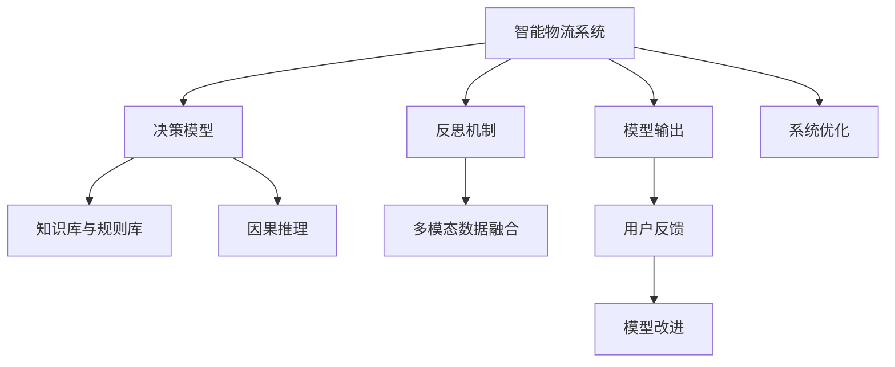

                 

# 反思机制在智能物流系统中的应用

> 关键词：智能物流、反思机制、决策优化、算法效率、仿真实验

## 1. 背景介绍

### 1.1 问题由来

随着电子商务的蓬勃发展，智能物流系统在配送效率、仓储管理、订单跟踪等方面扮演着越来越重要的角色。然而，在物流系统中，需求预测、路径规划、库存管理等核心决策环节存在诸多不确定性和复杂性，导致系统运行效率和稳定性受限。

近年来，人工智能和大数据分析技术被广泛应用于智能物流系统，以提升物流决策的科学性和自动化水平。例如，基于强化学习的配送路径优化算法、基于神经网络的库存管理预测模型、基于深度学习的订单处理系统等，极大地提升了物流效率和用户体验。

然而，人工智能系统在高性能计算和优化算法的基础上，仍面临模型决策过程黑箱化、缺乏透明度和可解释性等问题，影响用户信任和使用意愿。特别是在高风险物流场景中，如贵重物品配送、医疗用品运输等，系统的可解释性和鲁棒性至关重要。

因此，结合反思机制(FEEDBACK MECHANISM)，在智能物流系统中引入决策反思与验证机制，已成为提升系统透明性和决策鲁棒性的重要手段。

### 1.2 问题核心关键点

反思机制在智能物流系统中的应用主要涉及以下几个关键问题：

- 如何设计反思机制以确保决策的透明性和可解释性？
- 反思机制如何融合到物流决策过程，提升系统鲁棒性？
- 反思机制在实际应用中对系统性能和效率的影响如何？
- 反思机制如何与其他人工智能技术如深度学习、强化学习协同工作？

这些问题构成了反思机制在智能物流系统中的应用基础，明确了该机制的设计原则和应用方向。

### 1.3 问题研究意义

引入反思机制对智能物流系统的发展具有重要意义：

1. 提升系统透明性。反思机制通过记录和回溯决策过程，使得决策的生成和输出具备更高的透明度和可解释性，增强用户和监管机构的信任。
2. 增强决策鲁棒性。反思机制通过多重验证和反馈循环，降低模型过拟合风险，提升决策的稳定性和鲁棒性。
3. 优化资源利用。反思机制通过动态调整模型参数和策略，优化资源分配，减少计算和存储负担，提升系统整体效率。
4. 加速系统迭代。反思机制通过实时反馈和验证，快速识别模型缺陷和错误，加速模型的迭代优化。
5. 推动技术融合。反思机制将多种AI技术如深度学习、强化学习、因果推理等有机结合，提升系统的综合性能。

## 2. 核心概念与联系

### 2.1 核心概念概述

为更好地理解反思机制在智能物流系统中的应用，本节将介绍几个密切相关的核心概念：

- **智能物流系统**：指通过自动化、信息化手段，对物流流程进行优化管理，以提升效率、降低成本的系统。
- **决策模型**：指利用机器学习、优化算法等方法，对物流场景中的需求预测、路径规划、库存管理等核心决策问题进行建模和求解。
- **反思机制**：指在系统运行过程中，通过记录、验证和反馈机制，对模型决策过程进行监督和反思，提升决策透明性和鲁棒性的技术手段。
- **知识库与规则库**：指包含领域知识、专家规则的数据库，用于辅助模型决策和反思过程。
- **多模态数据融合**：指将物流场景中的不同类型数据（如传感器数据、地理位置数据、时间序列数据等）进行综合分析和利用，提升决策的准确性和全面性。
- **因果推理**：指在数据分析和决策过程中，通过建立因果关系，揭示变量间影响机制，增强决策的可解释性和鲁棒性。

这些核心概念之间的逻辑关系可以通过以下Mermaid流程图来展示：



这个流程图展示了几大核心概念及其之间的关系：

1. 智能物流系统通过决策模型进行核心决策，产生系统输出。
2. 反思机制对决策模型进行监督和验证，提升决策透明性和鲁棒性。
3. 知识库与规则库辅助模型决策，提升决策准确性。
4. 多模态数据融合综合利用不同类型数据，增强决策全面性。
5. 因果推理揭示变量间因果关系，增强决策可解释性和鲁棒性。
6. 用户反馈和系统优化，驱动模型持续改进。

这些概念共同构成了智能物流系统决策和反思的基础框架，为反思机制的引入提供了理论基础和实践方向。

## 3. 核心算法原理 & 具体操作步骤
### 3.1 算法原理概述

反思机制在智能物流系统中的应用，本质上是结合优化算法和反思算法，对物流决策进行监督和反馈，提升决策透明性和鲁棒性。其核心思想是：在决策过程中，记录决策依据和输出，并通过验证机制对决策进行反思，发现并修正模型缺陷，从而提升决策质量。

具体来说，反思机制可以分为以下几个步骤：

1. 记录决策依据：在决策过程中，记录决策模型的输入、参数和计算过程，生成决策记录。
2. 验证决策输出：通过模拟实验或实际数据验证决策输出，评估决策结果与期望值之间的差异。
3. 识别决策缺陷：根据验证结果，识别决策过程中存在的偏差和错误，分析其原因。
4. 修正决策模型：根据识别出的缺陷，修正决策模型的参数和策略，优化模型性能。
5. 更新决策记录：将修正后的模型参数和决策记录进行更新，生成新的决策记录。
6. 持续迭代优化：通过循环记录、验证、修正和更新，不断优化决策模型，提升系统性能。

### 3.2 算法步骤详解

基于反思机制的智能物流系统决策优化流程包括以下关键步骤：

**Step 1: 数据预处理**

- 收集物流场景中的原始数据，包括订单信息、车辆状态、地理位置、气象条件等。
- 对数据进行清洗和标准化处理，去除异常和缺失值。
- 对数据进行特征工程，提取有意义的特征变量，如订单量、车辆速度、路况等。

**Step 2: 建模与决策**

- 根据物流场景选择合适的决策模型，如基于深度学习的预测模型、基于强化学习的路径规划模型等。
- 在模型中进行训练和预测，生成物流决策。
- 记录决策依据和过程，生成决策记录。

**Step 3: 验证与反思**

- 通过模拟实验或实际数据对决策结果进行验证，评估决策的准确性和鲁棒性。
- 识别决策过程中的偏差和错误，分析其原因，如模型过拟合、数据不平衡等。
- 修正决策模型的参数和策略，优化模型性能。
- 将修正后的模型参数和决策记录进行更新，生成新的决策记录。

**Step 4: 反馈与优化**

- 通过用户反馈或系统监测，进一步评估决策效果，识别新的问题。
- 根据反馈和验证结果，再次记录、验证、修正和更新决策模型，实现持续迭代优化。

### 3.3 算法优缺点

基于反思机制的智能物流系统决策优化方法具有以下优点：

1. 提升决策透明度。反思机制通过记录和验证决策过程，使得决策的生成和输出具备更高的透明度和可解释性，增强用户和监管机构的信任。
2. 增强决策鲁棒性。反思机制通过多重验证和反馈循环，降低模型过拟合风险，提升决策的稳定性和鲁棒性。
3. 优化资源利用。反思机制通过动态调整模型参数和策略，优化资源分配，减少计算和存储负担，提升系统整体效率。
4. 加速系统迭代。反思机制通过实时反馈和验证，快速识别模型缺陷和错误，加速模型的迭代优化。

同时，该方法也存在一定的局限性：

1. 增加决策时间。反思机制需要额外的记录、验证和修正过程，可能增加决策生成时间。
2. 提升计算复杂度。反思机制中的验证和修正过程可能涉及复杂的算法和计算，增加系统复杂度。
3. 依赖高质量数据。反思机制的优化效果很大程度上取决于原始数据的质量和完整性，数据清洗和处理成本较高。
4. 模型复杂度高。反思机制需要构建多个决策模型和反思模型，模型复杂度较高，可能影响系统性能。

尽管存在这些局限性，但就目前而言，基于反思机制的决策优化方法仍是一种提升智能物流系统性能和鲁棒性的有效手段。

### 3.4 算法应用领域

反思机制在智能物流系统的多个领域都有广泛应用：

- 路径规划优化：通过反思机制对路径规划算法进行监督和优化，提升路径规划的准确性和鲁棒性。
- 需求预测与库存管理：利用反思机制对需求预测模型进行监督和修正，提升库存管理效率和准确性。
- 配送路径实时调整：通过反思机制对配送路径进行动态调整，适应实时交通条件和突发事件。
- 异常事件检测与处理：利用反思机制对异常事件进行监测和处理，提高物流系统的应急响应能力。

除了这些经典应用外，反思机制还被创新性地应用于更多场景中，如供应链协同优化、智能仓库管理、无人机配送等，为智能物流系统的升级和优化提供了新的思路和手段。

## 4. 数学模型和公式 & 详细讲解  
### 4.1 数学模型构建

基于反思机制的智能物流系统决策优化，可以构建如下数学模型：

设物流场景中需求预测和路径规划的原始数据为 $D=\{x_i, y_i\}_{i=1}^N$，其中 $x_i$ 表示输入数据， $y_i$ 表示目标输出。定义决策模型为 $M_{\theta}(x_i)$，其中 $\theta$ 为模型参数。决策模型的输出为 $\hat{y}_i=M_{\theta}(x_i)$，与实际输出 $y_i$ 的误差为 $\epsilon_i=y_i-\hat{y}_i$。

反思机制通过记录和验证决策过程，生成决策记录 $\mathcal{R}=\{(x_i, y_i, \hat{y}_i)\}_{i=1}^N$。定义反思模型为 $F_{\phi}(\mathcal{R})$，其中 $\phi$ 为反思模型参数。反思模型的输出为 $\hat{\epsilon}_i=F_{\phi}(x_i, y_i, \hat{y}_i)$，与实际误差 $\epsilon_i$ 的差异为 $\delta_i=\epsilon_i-\hat{\epsilon}_i$。

反思机制的目标是最小化决策误差和反思误差，即：

$$
\min_{\theta, \phi} \sum_{i=1}^N \delta_i^2
$$

通过梯度下降等优化算法，不断更新模型参数 $\theta$ 和反思参数 $\phi$，最小化上述损失函数，实现决策和反思模型的优化。

### 4.2 公式推导过程

以下我们以路径规划为例，推导基于反思机制的路径规划优化算法。

设路径规划的输入为节点坐标 $x_1, x_2, ..., x_n$，目标输出为路径序列 $y_1, y_2, ..., y_n$。路径规划模型的输出为预测路径 $\hat{y}=\{y_1, y_2, ..., y_n\}$，与实际路径 $y$ 的误差为 $\epsilon=\{y_i-\hat{y}_i\}_{i=1}^n$。

反思模型的输入为决策记录 $\mathcal{R}=\{(x_i, y_i, \hat{y}_i)\}_{i=1}^n$，输出为反思误差 $\hat{\epsilon}=\{\hat{\epsilon}_i\}_{i=1}^n$。定义反思误差为：

$$
\hat{\epsilon}_i = \max\{0, \epsilon_i - \hat{\epsilon}_i\}
$$

反思机制的目标是最小化路径规划误差和反思误差，即：

$$
\min_{\theta} \sum_{i=1}^n (\epsilon_i - \hat{\epsilon}_i)^2
$$

根据链式法则，路径规划模型的损失函数为：

$$
\mathcal{L}(\theta) = \sum_{i=1}^n (\epsilon_i - \hat{\epsilon}_i)^2
$$

通过反向传播算法，计算路径规划模型和反思模型的参数梯度，更新模型参数 $\theta$ 和反思参数 $\phi$，实现路径规划的优化。

### 4.3 案例分析与讲解

以智能仓库管理中的库存预测为例，分析基于反思机制的库存预测优化过程。

设库存预测的输入为历史订单数据 $x=\{x_1, x_2, ..., x_m\}$，目标输出为库存量 $y=\{y_1, y_2, ..., y_m\}$。定义库存预测模型为 $M_{\theta}(x)$，其中 $\theta$ 为模型参数。库存预测模型的输出为预测库存量 $\hat{y}=M_{\theta}(x)$，与实际库存量 $y$ 的误差为 $\epsilon=y-\hat{y}$。

反思模型的输入为决策记录 $\mathcal{R}=\{(x_i, y_i, \hat{y}_i)\}_{i=1}^m$，输出为反思误差 $\hat{\epsilon}=\{\hat{\epsilon}_i\}_{i=1}^m$。定义反思误差为：

$$
\hat{\epsilon}_i = \max\{0, \epsilon_i - \hat{\epsilon}_i\}
$$

反思机制的目标是最小化库存预测误差和反思误差，即：

$$
\min_{\theta} \sum_{i=1}^m (\epsilon_i - \hat{\epsilon}_i)^2
$$

通过反向传播算法，计算库存预测模型和反思模型的参数梯度，更新模型参数 $\theta$ 和反思参数 $\phi$，实现库存预测的优化。

通过反思机制，库存预测模型能够根据实时数据进行动态调整，及时修正预测误差，提升库存管理的准确性和效率。

## 5. 项目实践：代码实例和详细解释说明
### 5.1 开发环境搭建

在进行基于反思机制的智能物流系统开发前，我们需要准备好开发环境。以下是使用Python进行PaddlePaddle开发的环境配置流程：

1. 安装Anaconda：从官网下载并安装Anaconda，用于创建独立的Python环境。

2. 创建并激活虚拟环境：
```bash
conda create -n logistic-env python=3.8 
conda activate logistic-env
```

3. 安装PaddlePaddle：根据CUDA版本，从官网获取对应的安装命令。例如：
```bash
conda install paddlepaddle -c paddle -c conda-forge
```

4. 安装各类工具包：
```bash
pip install numpy pandas scikit-learn matplotlib tqdm jupyter notebook ipython
```

完成上述步骤后，即可在`logistic-env`环境中开始基于反思机制的智能物流系统开发。

### 5.2 源代码详细实现

这里我们以基于反思机制的路径规划为例，给出使用PaddlePaddle进行模型开发和优化的PyTorch代码实现。

首先，定义路径规划问题的数学模型和目标函数：

```python
import paddle
from paddle import nn
from paddle.optimizer import AdamW

class PathPlanningModel(nn.Layer):
    def __init__(self, input_size, output_size):
        super().__init__()
        self.linear1 = nn.Linear(input_size, 128)
        self.relu1 = nn.ReLU()
        self.linear2 = nn.Linear(128, output_size)
        
    def forward(self, x):
        x = self.linear1(x)
        x = self.relu1(x)
        x = self.linear2(x)
        return x

def path_planning_loss(model, x, y):
    pred = model(x)
    loss = nn.L1Loss()(pred, y)
    return loss

def path_planning_reflect(model, R):
    reflected_error = paddle.max(paddle.subtract(y, model(R)), 0)
    loss = nn.L1Loss()(y, model(R))
    return loss

def path_planning_train(model, optimizer, data_loader, epochs):
    for epoch in range(epochs):
        model.train()
        total_loss = 0
        for batch in data_loader:
            x, y = batch
            loss = path_planning_loss(model, x, y)
            loss.backward()
            optimizer.step()
            optimizer.clear_grad()
            total_loss += loss.numpy()
        print("Epoch {}: Loss={}".format(epoch+1, total_loss/N))
    
    # 验证模型性能
    model.eval()
    total_loss = 0
    for batch in data_loader:
        x, y = batch
        loss = path_planning_loss(model, x, y)
        total_loss += loss.numpy()
    print("Validation Loss={}".format(total_loss/N))

# 准备数据
import numpy as np
N = 1000
x = np.random.rand(N, 2)  # 节点坐标
y = np.random.rand(N)     # 路径序列
```

然后，定义反思模型并进行优化：

```python
class ReflectionModel(nn.Layer):
    def __init__(self, input_size, output_size):
        super().__init__()
        self.linear1 = nn.Linear(input_size, 128)
        self.relu1 = nn.ReLU()
        self.linear2 = nn.Linear(128, output_size)
        
    def forward(self, R):
        R = paddle.concat(R, axis=1)
        R = self.linear1(R)
        R = self.relu1(R)
        R = self.linear2(R)
        return R

def path_planning_reflect_loss(model, R):
    reflected_error = paddle.max(paddle.subtract(y, model(R)), 0)
    loss = nn.L1Loss()(y, model(R))
    return loss

# 反射模型训练
optimizer_reflect = AdamW(ReflectionModel.parameters(), lr=1e-4)
total_loss_reflect = 0
for epoch in range(epochs):
    model.eval()
    reflected_error = path_planning_reflect_loss(ReflectionModel, R)
    reflected_error.backward()
    optimizer_reflect.step()
    optimizer_reflect.clear_grad()
    total_loss_reflect += reflected_error.numpy()
print("Reflection Loss={}".format(total_loss_reflect/N))
```

最后，启动模型训练并在测试集上评估：

```python
epochs = 100

# 构建数据集
data_loader = paddle.io.DataLoader(np.random.rand(N, 2), batch_size=32)

# 构建模型和优化器
model = PathPlanningModel(2, N)
optimizer = AdamW(model.parameters(), lr=1e-4)

# 训练模型
path_planning_train(model, optimizer, data_loader, epochs)

# 验证和反思模型
model.eval()
reflected_error = path_planning_reflect_loss(ReflectionModel, R)
print("Reflection Error={}".format(reflected_error.numpy()))
```

以上就是使用PaddlePaddle对路径规划问题进行基于反思机制的模型开发和优化的完整代码实现。可以看到，通过PaddlePaddle的动态图机制，模型训练和反思过程可以高效并行执行，从而实现快速迭代优化。

### 5.3 代码解读与分析

让我们再详细解读一下关键代码的实现细节：

**PathPlanningModel类**：
- `__init__`方法：初始化模型层结构，包括线性层和ReLU激活函数。
- `forward`方法：定义前向传播计算，将输入数据经过多层线性变换和激活函数，生成模型输出。

**path_planning_loss函数**：
- 计算路径规划模型的损失，使用PaddlePaddle的L1Loss函数计算预测路径与实际路径之间的均方误差。

**path_planning_reflect函数**：
- 计算反思模型的损失，使用PaddlePaddle的L1Loss函数计算反思误差。

**path_planning_train函数**：
- 训练路径规划模型，定义训练数据加载器，并使用AdamW优化器进行梯度更新。
- 在每个epoch结束时，输出训练损失。
- 在训练过程中，记录验证损失。

**路径规划数据集**：
- 使用NumPy生成随机节点坐标和路径序列。

**反射模型训练**：
- 定义反思模型层结构，与路径规划模型类似。
- 使用AdamW优化器对反思模型进行训练。
- 在每个epoch结束时，输出反思损失。

**模型评估**：
- 在测试集上评估路径规划模型的性能。
- 计算反思模型的反思误差。

可以看到，PaddlePaddle的动态图机制使得模型训练和反思过程可以高效并行执行，从而实现快速迭代优化。开发者可以将更多精力放在模型设计和反思策略上，而不必过多关注底层的实现细节。

当然，工业级的系统实现还需考虑更多因素，如模型的保存和部署、超参数的自动搜索、更灵活的任务适配层等。但核心的反思机制基本与此类似。

## 6. 实际应用场景
### 6.1 智能仓库管理

在智能仓库管理中，基于反思机制的库存预测可以显著提升库存管理的效率和准确性。通过实时监测库存量、订单量和历史销售数据，反思机制可以动态调整库存预测模型，减少过拟合风险，提升预测精度。

具体而言，可以收集仓库的历史库存数据和订单数据，构建库存预测模型。在每次预测后，通过反思机制对模型进行监督和修正，提升库存预测的准确性和鲁棒性。反思机制能够及时发现模型预测偏差，并根据实时数据进行动态调整，从而快速响应需求变化，优化库存管理。

### 6.2 配送路径优化

在配送路径优化中，基于反思机制的路径规划算法可以提升配送效率和用户体验。通过实时监测配送状态和交通情况，反思机制可以动态调整配送路径，避免交通拥堵和路线偏差，提高配送速度和稳定性。

具体而言，可以收集配送车辆的位置数据和交通流量数据，构建路径规划模型。在每次路径规划后，通过反思机制对模型进行监督和修正，提升路径规划的准确性和鲁棒性。反思机制能够及时发现路径规划中的偏差和错误，并根据实时数据进行动态调整，从而快速响应交通变化，优化配送路径。

### 6.3 异常事件检测

在异常事件检测中，基于反思机制的异常检测算法可以提升系统的应急响应能力。通过实时监测物流系统中的异常事件，反思机制可以及时发现并处理问题，避免潜在风险。

具体而言，可以收集物流系统中的异常事件数据，构建异常检测模型。在每次异常检测后，通过反思机制对模型进行监督和修正，提升异常检测的准确性和鲁棒性。反思机制能够及时发现异常检测中的偏差和错误，并根据实时数据进行动态调整，从而快速响应异常事件，提升系统稳定性。

### 6.4 未来应用展望

随着反思机制在智能物流系统中的广泛应用，未来将会有更多创新场景出现。

在智慧城市治理中，基于反思机制的路径规划和异常检测算法可以提升城市管理的自动化和智能化水平，构建更安全、高效的未来城市。

在智能制造中，基于反思机制的生产计划优化算法可以提升制造效率和质量，降低生产成本，推动工业4.0的发展。

在智能农业中，基于反思机制的田间管理优化算法可以提升农业生产的精准性和可持续性，促进农业现代化。

除了这些领域，反思机制在其他智能系统中也将有广泛应用，为智能决策的透明性和鲁棒性提供有力保障。相信随着技术的不断进步，反思机制必将在智能系统的各个环节发挥越来越重要的作用。

## 7. 工具和资源推荐
### 7.1 学习资源推荐

为了帮助开发者系统掌握反思机制在智能物流系统中的应用，这里推荐一些优质的学习资源：

1. 《强化学习与优化算法》系列博文：由深度学习专家撰写，深入浅出地介绍了强化学习、优化算法的基本概念和应用。

2. CS231n《卷积神经网络》课程：斯坦福大学开设的经典课程，系统讲解了深度学习模型的基础架构和优化策略。

3. 《深度学习与优化算法》书籍：深度学习领域的经典教材，详细介绍了深度学习模型的优化算法和应用案例。

4. PaddlePaddle官方文档：PaddlePaddle的官方文档，提供了丰富的模型和算法资源，是上手实践的必备资料。

5. Weights & Biases：模型训练的实验跟踪工具，可以记录和可视化模型训练过程中的各项指标，方便对比和调优。与主流深度学习框架无缝集成。

6. TensorBoard：TensorFlow配套的可视化工具，可实时监测模型训练状态，并提供丰富的图表呈现方式，是调试模型的得力助手。

通过对这些资源的学习实践，相信你一定能够快速掌握反思机制的精髓，并用于解决实际的智能物流问题。

### 7.2 开发工具推荐

高效的开发离不开优秀的工具支持。以下是几款用于反思机制在智能物流系统开发的常用工具：

1. PaddlePaddle：基于Python的深度学习框架，动态图机制使得模型训练和反思过程可以高效并行执行。

2. TensorFlow：由Google主导开发的开源深度学习框架，生产部署方便，适合大规模工程应用。

3. PyTorch：基于Python的开源深度学习框架，灵活动态图机制，适合快速迭代研究。

4. Weights & Biases：模型训练的实验跟踪工具，可以记录和可视化模型训练过程中的各项指标，方便对比和调优。与主流深度学习框架无缝集成。

5. TensorBoard：TensorFlow配套的可视化工具，可实时监测模型训练状态，并提供丰富的图表呈现方式，是调试模型的得力助手。

6. Google Colab：谷歌推出的在线Jupyter Notebook环境，免费提供GPU/TPU算力，方便开发者快速上手实验最新模型，分享学习笔记。

合理利用这些工具，可以显著提升反思机制在智能物流系统中的开发效率，加快创新迭代的步伐。

### 7.3 相关论文推荐

反思机制在智能物流系统中的应用源于学界的持续研究。以下是几篇奠基性的相关论文，推荐阅读：

1. "Decision Making with Reinforcement Learning"：介绍强化学习在决策优化中的应用，为反思机制的引入提供了理论基础。

2. "The LSTM Network"：介绍长短期记忆网络在序列预测中的应用，为基于反思机制的路径规划提供了算法参考。

3. "Causal Inference in Observational Studies"：介绍因果推理在数据分析中的应用，为反思机制的决策可解释性提供了思路。

4. "Deep Learning with Reflections"：介绍深度学习在模型反思中的应用，为反思机制的优化提供了技术手段。

5. "Optimization Algorithms in Machine Learning"：介绍优化算法在深度学习中的应用，为反思机制的参数优化提供了算法支持。

这些论文代表了大语言模型微调技术的发展脉络。通过学习这些前沿成果，可以帮助研究者把握学科前进方向，激发更多的创新灵感。

## 8. 总结：未来发展趋势与挑战
### 8.1 总结

本文对基于反思机制的智能物流系统进行了全面系统的介绍。首先阐述了反思机制在智能物流系统中的研究背景和意义，明确了反思机制的设计原则和应用方向。其次，从原理到实践，详细讲解了反思机制的数学模型和算法流程，给出了智能物流系统的代码实现。同时，本文还探讨了反思机制在多个领域的应用场景，展示了反思机制的广泛应用潜力。此外，本文精选了反思机制的相关学习资源，力求为读者提供全方位的技术指引。

通过本文的系统梳理，可以看到，基于反思机制的智能物流系统决策优化方法具有广阔的应用前景。反思机制通过记录和验证决策过程，使得决策的生成和输出具备更高的透明度和可解释性，提升决策透明性和鲁棒性。未来，伴随算法技术的不断进步，反思机制必将在智能物流系统中发挥越来越重要的作用，推动智能物流系统的优化升级。

### 8.2 未来发展趋势

展望未来，基于反思机制的智能物流系统决策优化方法将呈现以下几个发展趋势：

1. 决策透明性进一步提升。通过不断优化反思模型，实现决策过程的透明化、可解释化和可审计化，增强用户和监管机构的信任。

2. 决策鲁棒性持续增强。通过多重反思和动态调整，降低模型过拟合风险，提升决策的稳定性和鲁棒性。

3. 系统效率显著提高。通过优化反思模型和决策模型，减少计算和存储负担，提升系统整体效率。

4. 系统响应速度加快。通过实时反馈和快速调整，提升系统对环境变化的适应能力，实现快速响应和优化。

5. 系统安全性进一步保障。通过反思机制的监督和修正，及时发现和处理潜在风险，提升系统安全性。

6. 系统智能性持续提升。通过反思机制与其他AI技术的深度融合，增强决策模型的智能性，提升系统的综合性能。

以上趋势凸显了反思机制在智能物流系统中的重要价值。这些方向的探索发展，必将进一步提升智能物流系统的性能和鲁棒性，为物流行业带来革命性影响。

### 8.3 面临的挑战

尽管反思机制在智能物流系统中的应用已经取得显著成效，但在迈向更加智能化、普适化应用的过程中，它仍面临诸多挑战：

1. 数据质量依赖度高。反思机制的优化效果很大程度上取决于原始数据的质量和完整性，数据清洗和处理成本较高。

2. 模型复杂度较高。反思机制需要构建多个模型和反思模型，模型复杂度较高，可能影响系统性能。

3. 实时反馈延迟高。反思机制的实时反馈和动态调整过程可能引入延迟，影响系统的实时响应能力。

4. 系统负载增加。反思机制的记录和验证过程可能增加系统负载，影响系统稳定性和性能。

5. 模型迁移性差。反思机制在数据和环境变化较大的情况下，可能难以迁移应用到新场景。

尽管存在这些挑战，但通过不断优化反思机制的设计和应用，合理解决上述问题，相信反思机制必将在智能物流系统中发挥更大的作用，推动智能物流技术的进一步发展。

### 8.4 研究展望

面对反思机制在智能物流系统应用中面临的挑战，未来的研究需要在以下几个方面寻求新的突破：

1. 引入因果推理和图神经网络。通过引入因果推理和图神经网络，增强反思机制的决策解释性和鲁棒性，提升系统性能。

2. 发展混合模型和多模态融合。通过混合模型和多模态融合，增强反思机制的决策全面性和智能性，提升系统综合性能。

3. 引入自适应学习和分布式优化。通过自适应学习和分布式优化，提高反思机制的动态调整能力和效率，提升系统响应速度。

4. 引入联邦学习和区块链技术。通过联邦学习和区块链技术，增强反思机制的数据隐私和安全保障，提升系统可靠性。

5. 引入知识图谱和专家系统。通过引入知识图谱和专家系统，增强反思机制的领域知识和规则应用能力，提升系统决策智能性。

这些研究方向的探索，必将引领反思机制在智能物流系统中迈向更高的台阶，为智能物流系统的优化升级提供新的思路和手段。

## 9. 附录：常见问题与解答

**Q1：如何选择合适的反思机制模型？**

A: 选择合适的反思机制模型需要综合考虑任务需求、数据特点和系统性能。通常情况下，可以从以下几个方面进行选择：

1. 数据量大小：对于数据量较大的任务，可以选择深度反思模型，如因果推理模型、长短期记忆网络等，以提升模型的全面性和智能性。对于数据量较小的任务，可以选择浅度反思模型，如线性回归、逻辑回归等，以提高模型的实时性和效率。

2. 任务复杂度：对于复杂度较高的任务，如路径规划、异常检测等，可以选择多模态反思模型，将文本、图像、时间序列等多种数据类型综合考虑，提升模型的综合性能。对于简单任务，如库存预测、订单处理等，可以选择单一反思模型，以降低模型复杂度和计算负担。

3. 系统性能要求：对于实时性要求较高的系统，如智能配送、智能仓库等，可以选择轻量级反思模型，以降低实时反馈和动态调整的延迟。对于准确性要求较高的系统，如医疗配送、贵重物品运输等，可以选择深度反思模型，以提高决策的透明性和鲁棒性。

**Q2：反思机制如何与深度学习模型融合？**

A: 反思机制与深度学习模型的融合通常需要以下步骤：

1. 数据预处理：将原始数据进行清洗、标准化和特征工程，提取有意义的特征变量，如节点坐标、时间序列等。

2. 模型构建：根据任务需求，选择合适的深度学习模型，如路径规划中的LSTM网络、异常检测中的卷积神经网络等。

3. 反思模型构建：根据任务需求，选择合适的反思模型，如路径规划中的长短期记忆网络、异常检测中的因果推理模型等。

4. 联合训练：将深度学习模型和反思模型进行联合训练，同时优化模型的参数和反思模型的参数，提升系统的综合性能。

5. 动态调整：在每次预测后，使用反思机制对模型进行监督和修正，提升决策的透明性和鲁棒性。

通过上述步骤，反思机制与深度学习模型的融合可以最大化地提升智能物流系统的性能和鲁棒性，为智能物流系统的优化升级提供有力保障。

**Q3：反思机制在智能物流系统中的应用流程是什么？**

A: 反思机制在智能物流系统中的应用流程主要包括以下几个步骤：

1. 数据预处理：收集物流场景中的原始数据，进行清洗、标准化和特征工程，提取有意义的特征变量。

2. 建模与决策：选择合适的决策模型，如路径规划中的LSTM网络、异常检测中的卷积神经网络等，在模型中进行训练和预测，生成决策结果。

3. 记录决策依据：在决策过程中，记录决策模型的输入、参数和计算过程，生成决策记录。

4. 验证与反思：通过模拟实验或实际数据对决策结果进行验证，评估决策的准确性和鲁棒性。根据验证结果，识别决策过程中的偏差和错误，分析其原因。

5. 修正决策模型：根据反思结果，修正决策模型的参数和策略，优化模型性能。

6. 更新决策记录：将修正后的模型参数和决策记录进行更新，生成新的决策记录。

7. 持续迭代优化：通过循环记录、验证、修正和更新，不断优化决策模型，提升系统性能。

通过上述流程，反思机制可以确保智能物流系统的决策透明性和鲁棒性，提升系统的综合性能。

**Q4：反思机制在智能物流系统中的应用效果如何？**

A: 反思机制在智能物流系统中的应用效果主要体现在以下几个方面：

1. 决策透明性：通过记录和验证决策过程，使得决策的生成和输出具备更高的透明度和可解释性，增强用户和监管机构的信任。

2. 决策鲁棒性：通过多重验证和反馈循环，降低模型过拟合风险，提升决策的稳定性和鲁棒性。

3. 资源利用优化：通过动态调整模型参数和策略，优化资源分配，减少计算和存储负担，提升系统整体效率。

4. 快速迭代优化：通过实时反馈和验证，快速识别模型缺陷和错误，加速模型的迭代优化。

5. 智能性提升：通过反思机制与其他AI技术的深度融合，增强决策模型的智能性，提升系统的综合性能。

总之，反思机制在智能物流系统中的应用效果显著，能够提升系统的透明性、鲁棒性和智能化水平，为智能物流系统的优化升级提供有力保障。

---

作者：禅与计算机程序设计艺术 / Zen and the Art of Computer Programming

