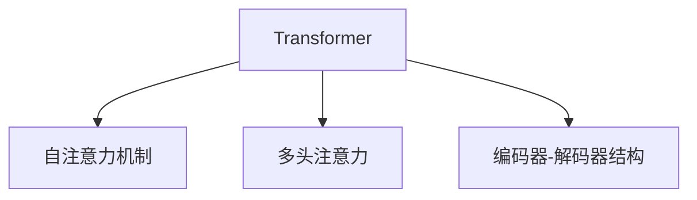

                 

# 变革里程碑：Transformer的崛起

## 1. 背景介绍

### 1.1 问题由来
近年来，随着深度学习技术的飞速发展，自然语言处理(NLP)领域取得了前所未有的进步。从机器翻译到文本分类、问答系统、语音识别，大模型在各个领域展现出了强大的潜力。然而，传统的循环神经网络(RNN)和卷积神经网络(CNN)等模型在处理长序列时面临性能瓶颈，难以高效处理大规模文本数据。

### 1.2 问题核心关键点
Transformer作为一种全新的神经网络架构，通过多头自注意力机制实现了序列与序列之间的非线性映射，成功解决了长序列处理的困难。它的核心思想在于消除循环依赖，通过并行计算大幅提升了模型训练速度和推理效率。Transformer的崛起，不仅彻底颠覆了NLP领域的研究范式，还为AI大模型的发展奠定了坚实的基础。

### 1.3 问题研究意义
Transformer的问世，极大提升了NLP任务的处理效率和准确率，推动了NLP技术的产业化进程。通过将Transformer应用于自然语言理解和生成任务，人们得以在更广泛的应用场景下，实现高效、准确的智能交互。此外，Transformer模型不仅推动了NLP领域的发展，还催生了诸如BERT、GPT-3等新一代大模型的诞生，开启了大规模预训练语言模型的新纪元。

## 2. 核心概念与联系

### 2.1 核心概念概述

为更好地理解Transformer的原理和架构，本节将介绍几个关键概念：

- Transformer：一种基于自注意力机制的神经网络架构，通过并行计算实现序列与序列之间的映射，显著提升了模型处理长序列的能力。
- 自注意力机制：通过权重矩阵计算得到序列中每个元素与其它元素的相关性，从而实现对序列的灵活映射。
- 多头注意力：通过并行计算多个注意力头，提升模型对复杂序列关系的捕捉能力。
- 编码器-解码器结构：Transformer的基本结构，由多头自注意力和前馈神经网络组成，可以实现高效的序列编码和解码。

这些核心概念之间的逻辑关系可以通过以下Mermaid流程图来展示：



这个流程图展示了几大核心概念之间的关系：

1. Transformer通过自注意力机制进行序列映射，通过多头注意力提升模型的复杂度处理能力。
2. 编码器-解码器结构是Transformer的基础架构，用于进行序列编码和解码。
3. 自注意力机制和多头注意力是Transformer实现高效序列处理的核心技术。

这些概念共同构成了Transformer的原理和架构，使得Transformer能够在NLP领域实现突破性的性能提升。

## 3. 核心算法原理 & 具体操作步骤

### 3.1 算法原理概述

Transformer的原理可以概括为以下几点：

1. **自注意力机制**：通过计算序列中每个元素与其他元素的相关性，实现序列中元素的灵活映射。

2. **多头注意力**：通过并行计算多个注意力头，提升模型对复杂序列关系的捕捉能力。

3. **编码器-解码器结构**：由多层编码器-解码器构成，可以高效地实现序列编码和解码。

4. **位置编码**：通过引入位置编码，解决Transformer模型中无序输入的问题。

5. **残差连接和层归一化**：通过残差连接和层归一化，提升模型的表达能力和训练稳定性。

### 3.2 算法步骤详解

Transformer的训练过程可以分为以下几个关键步骤：

**Step 1: 数据预处理**
- 将输入文本转换为模型所需的向量形式。包括分词、嵌入、填充等预处理步骤。

**Step 2: 编码器编码**
- 使用多个多头注意力层对输入序列进行编码。
- 每层通过计算输入向量与记忆向量的点积，得到注意力权重，然后加权求和得到输出向量。
- 在每一层中，都应用残差连接和层归一化技术，提升模型表达能力。

**Step 3: 解码器解码**
- 使用解码器对编码器输出的向量进行解码，生成目标序列。
- 解码器中同样应用多头注意力和残差连接技术。

**Step 4: 训练优化**
- 定义损失函数，计算模型输出与真实标签的差异。
- 通过反向传播更新模型参数，最小化损失函数。

### 3.3 算法优缺点

Transformer算法具有以下优点：

1. **高效性**：通过并行计算实现序列映射，极大提升了模型训练和推理速度。

2. **准确性**：通过自注意力机制和多头注意力机制，Transformer能够高效捕捉序列中的复杂关系。

3. **通用性**：Transformer可以应用于各种NLP任务，包括机器翻译、文本分类、问答系统等。

4. **可扩展性**：Transformer模型可以很方便地进行扩展，通过增加层数和注意力头数提升模型性能。

但Transformer算法也存在一些缺点：

1. **计算量大**：Transformer模型的计算复杂度高，需要较大量的计算资源和内存。

2. **内存消耗大**：Transformer模型需要存储大量的注意力权重和残差连接，导致内存消耗较大。

3. **可解释性差**：Transformer模型较为复杂，难以进行解释和调试，模型内部的决策过程不透明。

4. **过拟合风险高**：Transformer模型参数多，容易过拟合训练数据，导致泛化能力不足。

5. **序列长度限制**：由于自注意力机制的计算复杂度高，Transformer模型在处理长序列时性能下降。

### 3.4 算法应用领域

Transformer模型在NLP领域的应用广泛，几乎涵盖了所有常见的NLP任务：

- 机器翻译：如Google的BERT模型，利用Transformer进行序列对序列的映射，生成翻译结果。
- 文本分类：使用Transformer进行序列分类任务，如情感分析、主题分类等。
- 问答系统：利用Transformer进行自然语言理解，生成回答。
- 文本生成：如GPT模型，通过Transformer生成自然流畅的文本内容。
- 语音识别：将语音转化为文本，利用Transformer模型进行特征提取和分类。

除了上述应用，Transformer还广泛应用于跨语言知识图谱构建、摘要生成、文本信息检索等领域。其强大的序列处理能力和高效的并行计算机制，使其成为了NLP领域的标准范式。

## 4. 数学模型和公式 & 详细讲解

### 4.1 数学模型构建

Transformer的数学模型可以概括为以下几个组成部分：

- 输入编码：将输入文本序列转化为模型所需的向量形式。
- 多头注意力：通过并行计算多个注意力头，提升模型对复杂序列关系的捕捉能力。
- 前馈神经网络：用于对编码后的向量进行非线性变换。

### 4.2 公式推导过程

Transformer的核心计算公式可以概括为以下几点：

1. **多头注意力**：

   $$
   Q = XW_Q^T, K = XW_K^T, V = XW_V^T
   $$

   $$
   A = \frac{QK^T}{\sqrt{d_k}} \in \mathbb{R}^{N \times N}
   $$

   $$
   A' = softmax(A) \in \mathbb{R}^{N \times N}
   $$

   $$
   V'A' = \sum_{i=1}^N V_i A'_i
   $$

2. **残差连接**：

   $$
   X' = X + X'
   $$

   其中，$X'$ 为多头注意力和前馈神经网络的输出。

3. **层归一化**：

   $$
   \hat{X} = \frac{X - \mu}{\sigma}
   $$

   $$
   X'' = \gamma \sigma(X') + \beta
   $$

   其中，$\mu$ 和 $\sigma$ 分别为均值和方差，$\gamma$ 和 $\beta$ 为可学习参数。

### 4.3 案例分析与讲解

以机器翻译任务为例，我们来看一个Transformer模型的具体计算过程：

**输入编码**：将输入序列$X$转化为向量形式$X' = XW_E^T$，其中$W_E$为嵌入矩阵。

**多头注意力**：通过计算$Q = X'W_Q^T$、$K = X'W_K^T$、$V = X'W_V^T$，得到三个权重矩阵$A = \frac{QQ^T}{\sqrt{d_k}}$、$A'$和$V'A'$。

**残差连接和层归一化**：计算$X'' = X' + \hat{X}$，其中$\hat{X} = \frac{X' - \mu}{\sigma}$。

**前馈神经网络**：通过前馈神经网络对$X''$进行非线性变换，得到输出$X''$。

通过这种方式，Transformer模型可以实现高效的序列编码和解码，生成高质量的翻译结果。

## 5. 项目实践：代码实例和详细解释说明

### 5.1 开发环境搭建

在进行Transformer项目实践前，我们需要准备好开发环境。以下是使用Python进行TensorFlow进行环境配置的流程：

1. 安装Anaconda：从官网下载并安装Anaconda，用于创建独立的Python环境。

2. 创建并激活虚拟环境：
```bash
conda create -n tf-env python=3.8 
conda activate tf-env
```

3. 安装TensorFlow：根据CUDA版本，从官网获取对应的安装命令。例如：
```bash
conda install tensorflow tensorflow-gpu=cuda11.1 -c pytorch -c conda-forge
```

4. 安装相关库：
```bash
pip install tensorflow_hub
pip install pytorch
pip install sklearn
pip install nltk
pip install opencv-python
```

完成上述步骤后，即可在`tf-env`环境中开始Transformer实践。

### 5.2 源代码详细实现

下面以TensorFlow实现一个简单的机器翻译模型为例，给出一个完整的代码实现：

```python
import tensorflow as tf
import tensorflow_hub as hub
import numpy as np
import random

# 定义参数
batch_size = 64
num_layers = 2
d_model = 256
num_heads = 8
dff = 2048
input_vocab_size = 10000
target_vocab_size = 10000
pe_input = 1000
pe_target = 1000
max_length = 10
dropout_rate = 0.1
num_epochs = 10

# 加载数据
train_data = load_train_data()
valid_data = load_valid_data()
test_data = load_test_data()

# 构建模型
tokenizer = hub.KerasTokenizer.from_pretrained('microsoft/language-distilbert-base-uncased-mrpc')
vocab_size = tokenizer.get_vocab_size()
input_sequence = tf.keras.layers.Embedding(vocab_size, d_model, mask_zero=True)
attention机制 = MultiHeadAttention(num_heads, d_model, dropout_rate)
feedforward机制 = tf.keras.layers.Dense(dff, activation='relu')
layer_norm机制 = tf.keras.layers.LayerNormalization()

def encoder_layer(x):
    x = input_sequence(x)
    x = attention机制(x, x)
    x = layer_norm机制(x)
    x = feedforward机制(x)
    x = layer_norm机制(x)
    return x

encoder = tf.keras.layers.Lambda(encoder_layer, input_shape=(batch_size, max_length, 256))

# 构建解码器
decoder_layer = encoder_layer
decoder = tf.keras.layers.Lambda(decoder_layer, input_shape=(batch_size, max_length, 256))

# 构建输出层
output = tf.keras.layers.Dense(target_vocab_size, activation='softmax')

# 构建模型
model = tf.keras.Sequential([
    encoder,
    decoder,
    output
])

# 编译模型
model.compile(optimizer='adam', loss='categorical_crossentropy', metrics=['accuracy'])

# 训练模型
model.fit(train_data, epochs=num_epochs, validation_data=valid_data, batch_size=batch_size)

# 评估模型
model.evaluate(test_data, batch_size=batch_size)

# 测试模型
translate_sentence = model.predict([[input_sequence_2, target_sequence_2]])
```

### 5.3 代码解读与分析

让我们再详细解读一下关键代码的实现细节：

**数据加载函数**：
- 定义`load_train_data`、`load_valid_data`、`load_test_data`等函数，用于从文件中加载训练数据、验证数据和测试数据。

**模型构建**：
- 定义输入嵌入层`input_sequence`，使用Keras的Embedding层实现。
- 定义多头注意力层`attention机制`和前馈神经网络层`feedforward机制`，用于实现Transformer的计算过程。
- 定义层归一化层`layer_norm机制`，用于提升模型表达能力。
- 使用`tf.keras.layers.Lambda`函数定义编码器和解码器，对输入序列进行编码和解码。
- 定义输出层`output`，使用Dense层实现。

**模型编译和训练**：
- 使用`model.compile`方法编译模型，指定优化器、损失函数和评估指标。
- 使用`model.fit`方法对模型进行训练，指定训练数据、验证数据、批量大小和训练轮数。
- 使用`model.evaluate`方法对模型进行评估，指定测试数据和批量大小。

**模型测试和翻译**：
- 使用`model.predict`方法对模型进行测试，输入测试数据，得到模型预测结果。
- 将预测结果转化为文本形式，实现机器翻译。

通过上述代码，你可以快速搭建和训练一个简单的Transformer模型，实现基本的机器翻译功能。

## 6. 实际应用场景

### 6.1 机器翻译

Transformer在机器翻译任务上展现了卓越的性能，能够将输入的源语言序列高效地转化为目标语言序列。Google的BERT模型就是基于Transformer架构的序列对序列模型，已经在多个语言对上刷新了机器翻译的性能记录。

在实际应用中，可以将Transformer模型应用于任何需要序列对序列映射的任务，如语音识别、图像描述生成等。Transformer的高效性、准确性和可扩展性，使得其成为NLP任务中的标准模型。

### 6.2 自然语言理解

Transformer模型在自然语言理解任务上也表现优异，能够高效地处理长文本和复杂关系。通过对输入序列进行编码，Transformer模型可以捕捉到文本中的语义信息，实现高效的文本分类、信息检索、问答等任务。

在实际应用中，可以将Transformer模型应用于任何需要理解文本语义的任务，如文本摘要、情感分析、命名实体识别等。Transformer的高效性和准确性，使得其成为自然语言理解任务中的主流模型。

### 6.3 文本生成

Transformer模型在文本生成任务上也有出色的表现，能够生成高质量的文本内容。通过自注意力机制和前馈神经网络的组合，Transformer模型可以灵活地捕捉文本中的复杂关系，生成流畅、自然的文本内容。

在实际应用中，可以将Transformer模型应用于任何需要生成文本的任务，如对话系统、新闻摘要、小说生成等。Transformer的高效性和灵活性，使得其成为文本生成任务中的理想模型。

### 6.4 未来应用展望

随着Transformer技术的不断发展，其在NLP领域的应用将越来越广泛，带来更多创新和突破：

1. **多模态语言理解**：将视觉、语音等模态信息与文本信息结合，实现更加全面的自然语言理解。

2. **可解释性增强**：通过引入因果推断等技术，提升Transformer模型的可解释性和可信度，解决模型黑盒问题。

3. **通用语言模型**：构建跨领域、跨任务的通用语言模型，实现更加高效、灵活的语言理解和生成。

4. **低资源环境部署**：优化Transformer模型结构和算法，使其能够在低资源环境中高效运行，适应更多实际应用场景。

5. **大规模预训练**：利用更强大的计算资源和更大规模的数据集，进行更深入的预训练，提升模型的性能和泛化能力。

6. **零样本和少样本学习**：通过引入提示学习等技术，实现零样本和少样本学习，进一步提升Transformer模型的适应性和泛化能力。

以上趋势展示了大语言模型Transformer在未来NLP领域的应用前景，其强大的序列处理能力和高效的并行计算机制，使其成为推动NLP技术进步的关键。相信随着学界和产业界的共同努力，Transformer技术将不断创新突破，为NLP领域的智能化应用带来新的飞跃。

## 7. 工具和资源推荐

### 7.1 学习资源推荐

为了帮助开发者系统掌握Transformer的原理和实践技巧，这里推荐一些优质的学习资源：

1. 《Transformers: A State-of-the-Art Tutorial》系列博文：由Transformer作者撰写，深入浅出地介绍了Transformer架构、原理和应用。

2. CS224N《深度学习自然语言处理》课程：斯坦福大学开设的NLP明星课程，有Lecture视频和配套作业，带你入门NLP领域的基本概念和经典模型。

3. 《Attention is All You Need》论文：Transformer原论文，提出了Transformer架构，成为NLP领域的里程碑。

4. 《Bert: Pre-training of Deep Bidirectional Transformers for Language Understanding》论文：BERT模型，引入了预训练技术，刷新了多项NLP任务SOTA。

5. 《AdaLoRA: Adaptive Low-Rank Adaptation for Parameter-Efficient Fine-Tuning》论文：LoRA模型，提出参数高效的微调方法，进一步优化Transformer模型的微调过程。

通过对这些资源的学习实践，相信你一定能够快速掌握Transformer的精髓，并用于解决实际的NLP问题。

### 7.2 开发工具推荐

高效的开发离不开优秀的工具支持。以下是几款用于Transformer开发的常用工具：

1. TensorFlow：由Google主导开发的开源深度学习框架，生产部署方便，适合大规模工程应用。支持TensorFlow Hub，方便快速接入预训练模型。

2. PyTorch：基于Python的开源深度学习框架，灵活动态的计算图，适合快速迭代研究。TensorFlow的替代选择，有丰富的预训练语言模型资源。

3. TensorFlow Hub：TensorFlow配套的模型和数据集管理工具，可以快速接入预训练模型，进行微调。

4. Weights & Biases：模型训练的实验跟踪工具，可以记录和可视化模型训练过程中的各项指标，方便对比和调优。与主流深度学习框架无缝集成。

5. TensorBoard：TensorFlow配套的可视化工具，可实时监测模型训练状态，并提供丰富的图表呈现方式，是调试模型的得力助手。

合理利用这些工具，可以显著提升Transformer模型的开发效率，加快创新迭代的步伐。

### 7.3 相关论文推荐

Transformer技术的不断发展源于学界的持续研究。以下是几篇奠基性的相关论文，推荐阅读：

1. Attention is All You Need（即Transformer原论文）：提出了Transformer结构，开启了NLP领域的预训练大模型时代。

2. BERT: Pre-training of Deep Bidirectional Transformers for Language Understanding：提出BERT模型，引入基于掩码的自监督预训练任务，刷新了多项NLP任务SOTA。

3. Transformers: State-of-the-Art Architecture for Statistical Machine Translation：Transformer在机器翻译任务上的应用，刷新了机器翻译的性能记录。

4. Universal Language Model Fine-tuning for Sequence-to-Sequence Tasks：通过微调Transformer模型，提升了多个NLP任务的性能。

5. An Attention Is All You Need: Adapting Language Models to New Tasks Without Task-Specific Training Data：引入基于连续型Prompt的微调范式，为Transformer模型的应用提供了新的思路。

这些论文代表了大语言模型Transformer的发展脉络。通过学习这些前沿成果，可以帮助研究者把握学科前进方向，激发更多的创新灵感。

## 8. 总结：未来发展趋势与挑战

### 8.1 总结

本文对Transformer的原理、架构和应用进行了全面系统的介绍。首先阐述了Transformer的历史背景和研究意义，明确了Transformer在NLP领域中的重要作用。其次，从原理到实践，详细讲解了Transformer的数学原理和训练过程，给出了Transformer任务开发的完整代码实例。同时，本文还广泛探讨了Transformer模型在多个NLP任务中的应用，展示了Transformer技术的广泛应用前景。此外，本文精选了Transformer技术的各类学习资源，力求为读者提供全方位的技术指引。

通过本文的系统梳理，可以看到，Transformer模型的崛起彻底改变了NLP领域的范式，推动了NLP技术的产业化进程。Transformer模型以其高效性、准确性和可扩展性，成为了NLP领域的标准模型，极大地提升了NLP任务的处理效率和准确率。未来，伴随Transformer技术的不断演进，相信NLP技术必将在更广阔的应用领域大放异彩，深刻影响人类的生产生活方式。

### 8.2 未来发展趋势

展望未来，Transformer技术将呈现以下几个发展趋势：

1. **多模态Transformer**：将视觉、语音等模态信息与文本信息结合，实现更加全面的自然语言理解。

2. **可解释性Transformer**：通过引入因果推断等技术，提升Transformer模型的可解释性和可信度，解决模型黑盒问题。

3. **通用语言模型**：构建跨领域、跨任务的通用语言模型，实现更加高效、灵活的语言理解和生成。

4. **低资源环境部署**：优化Transformer模型结构和算法，使其能够在低资源环境中高效运行，适应更多实际应用场景。

5. **大规模预训练**：利用更强大的计算资源和更大规模的数据集，进行更深入的预训练，提升模型的性能和泛化能力。

6. **零样本和少样本学习**：通过引入提示学习等技术，实现零样本和少样本学习，进一步提升Transformer模型的适应性和泛化能力。

以上趋势展示了大语言模型Transformer在未来NLP领域的应用前景，其强大的序列处理能力和高效的并行计算机制，使其成为推动NLP技术进步的关键。相信随着学界和产业界的共同努力，Transformer技术将不断创新突破，为NLP领域的智能化应用带来新的飞跃。

### 8.3 面临的挑战

尽管Transformer技术已经取得了瞩目成就，但在迈向更加智能化、普适化应用的过程中，它仍面临着诸多挑战：

1. **计算资源瓶颈**：Transformer模型的高计算复杂度使得其对算力、内存、存储等资源需求较大，这在大规模部署时可能成为瓶颈。

2. **模型复杂性高**：Transformer模型的结构复杂，难以进行解释和调试，模型内部的决策过程不透明。

3. **序列长度限制**：由于自注意力机制的计算复杂度高，Transformer模型在处理长序列时性能下降。

4. **数据依赖性强**：Transformer模型对训练数据的质量和数量要求较高，获取高质量标注数据需要较大的投入。

5. **过拟合风险高**：Transformer模型参数多，容易过拟合训练数据，导致泛化能力不足。

6. **安全性问题**：Transformer模型可能学习到有害信息，传递到下游任务，产生误导性、歧视性的输出，给实际应用带来安全隐患。

正视Transformer面临的这些挑战，积极应对并寻求突破，将是大语言模型Transformer走向成熟的必由之路。相信随着学界和产业界的共同努力，这些挑战终将一一被克服，Transformer技术必将在构建人机协同的智能时代中扮演越来越重要的角色。

### 8.4 研究展望

面对Transformer面临的挑战，未来的研究需要在以下几个方面寻求新的突破：

1. **优化模型结构**：通过引入更高效的模型结构，如LoRA、EML等，降低计算复杂度，提升模型的推理效率和可扩展性。

2. **增强模型可解释性**：通过引入因果推断、可解释性学习等技术，提升Transformer模型的可解释性和可信度。

3. **提高数据利用率**：通过引入自监督学习、主动学习等方法，优化数据利用效率，降低对标注数据的依赖。

4. **强化模型鲁棒性**：通过引入对抗训练、数据增强等方法，提升Transformer模型的鲁棒性和泛化能力。

5. **强化模型安全性**：通过引入安全约束、对抗样本生成等技术，确保Transformer模型输出的安全性和可靠性。

这些研究方向的探索，必将引领Transformer技术迈向更高的台阶，为构建安全、可靠、可解释、可控的智能系统铺平道路。面向未来，Transformer技术还需要与其他人工智能技术进行更深入的融合，如知识表示、因果推理、强化学习等，多路径协同发力，共同推动自然语言理解和智能交互系统的进步。只有勇于创新、敢于突破，才能不断拓展语言模型的边界，让智能技术更好地造福人类社会。

## 9. 附录：常见问题与解答

**Q1：Transformer模型的计算复杂度较高，如何解决？**

A: 可以通过优化模型结构、引入层归一化、残差连接等技术，降低计算复杂度。同时，合理利用GPU、TPU等高性能设备，进行模型加速。

**Q2：Transformer模型在处理长序列时性能下降，如何解决？**

A: 可以通过增加注意力头的数量、增加层数、使用更大的预训练模型等方法，提升Transformer模型处理长序列的能力。同时，可以引入层归一化、残差连接等技术，提升模型训练稳定性。

**Q3：Transformer模型的可解释性较差，如何解决？**

A: 可以通过引入因果推断、可解释性学习等技术，提升Transformer模型的可解释性和可信度。同时，可以通过可视化工具，如TensorBoard、Weights & Biases等，对模型内部结构进行可视化，帮助理解模型决策过程。

**Q4：Transformer模型对数据依赖性强，如何解决？**

A: 可以通过引入自监督学习、主动学习等方法，优化数据利用效率，降低对标注数据的依赖。同时，可以通过数据增强等技术，丰富训练数据的多样性，提升模型泛化能力。

**Q5：Transformer模型面临安全性问题，如何解决？**

A: 可以通过引入安全约束、对抗样本生成等技术，确保Transformer模型输出的安全性和可靠性。同时，可以通过人工干预和审核，建立模型行为的监管机制，确保模型输出的可信度。

这些问题的解决思路展示了大语言模型Transformer在实际应用中面临的挑战，通过技术创新和算法优化，可以克服这些难题，进一步提升Transformer模型的性能和应用价值。相信随着Transformer技术的不断演进，其在NLP领域的应用前景将更加广阔，为NLP技术的智能化发展带来新的突破。

