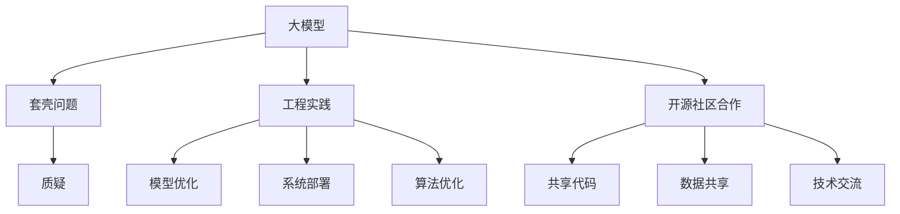

                 

# 国内大模型质疑：套壳非问题，提升工程实践与开源社区合作

> 关键词：大模型质疑，套壳问题，工程实践，开源社区合作，人工智能应用

## 1. 背景介绍

近年来，中国在人工智能(AI)领域取得了显著进展，特别是在大模型研究与应用方面，涌现出了一批影响力巨大的企业和机构。但与此同时，国内大模型的建设与发展也引发了不小的争议。某些批评者认为，国内许多大模型不过是国际开源模型的简单"套壳"，缺乏自主创新，无法真正推动AI技术的发展。这种质疑不仅出现在学术界，也成为业内人士热议的话题。

本文旨在探讨这种质疑的实质，并提出通过提升工程实践与加强开源社区合作，推动国内大模型的健康发展。

## 2. 核心概念与联系

### 2.1 核心概念概述

为更好地理解大模型质疑及其解决方法，本节将介绍几个核心概念：

- **大模型**：指通过在大规模无标签数据上自监督预训练得到的通用语言模型，如GPT、BERT等。这些模型通过预训练学习到丰富的语言知识，能够应用于多种NLP任务。

- **套壳**：指在预训练大模型的基础上，不做任何改动或仅简单修改部分结构，即以现有大模型为"壳"，重新训练或微调若干次，就发布出新的大模型。这种做法通常被认为是对开源模型的直接模仿，缺乏自主创新。

- **工程实践**：指将科学理论和技术转化为实际应用的过程。这包括模型优化、系统部署、算法优化等具体工作，是提升大模型应用性能的关键。

- **开源社区**：由研究者、工程师、开发者等组成的开放平台，以共享代码、数据、技术等为目的，促进共同进步。开源社区为技术创新提供了丰富的资源和平台支持。

这些核心概念之间的关系可以通过以下Mermaid流程图来展示：



这个流程图展示了各个概念之间的逻辑关系：

1. 大模型通过预训练获得通用语言表示。
2. 工程实践用于优化模型、系统，提升应用性能。
3. 开源社区合作提供共享资源，促进共同进步。
4. 大模型的套壳问题引发了质疑，需要改进。
5. 模型优化、系统部署、算法优化等是提升大模型质量的具体手段。
6. 共享代码、数据、技术等是开源社区合作的主要内容。

## 3. 核心算法原理 & 具体操作步骤

### 3.1 算法原理概述

大模型的套壳问题主要集中在以下几个方面：

1. **预训练和微调策略**：部分大模型只是简单地对预训练模型进行微调，而没有进行充分的工程实践。这种微调通常只对顶层结构进行小幅度改动，忽视了深度优化和系统部署等重要环节。

2. **模型创新不足**：一些大模型在架构、算法、数据等方面缺乏创新，仅仅是现有模型的"重新包装"，没有提出全新的理念和方法。

3. **开源依赖性强**：一些国内大模型的开发高度依赖开源社区的资源和工具，缺少自主研发的意识和能力。

### 3.2 算法步骤详解

解决大模型的套壳问题，需要从以下几个关键步骤入手：

**Step 1: 深入理解开源大模型**

首先，全面了解开源大模型的原理、架构、优化策略等关键技术细节。通过论文、代码库、技术博客等资源，掌握这些大模型的核心优势和潜在的改进点。

**Step 2: 创新和优化现有模型**

在深入理解开源大模型的基础上，针对具体应用场景，进行模型架构和算法创新。例如：

- **自适应架构**：对模型层次结构进行调整，以适应特定任务。
- **优化算法**：改进训练算法，如引入更高效的优化器、梯度累积、混合精度训练等。
- **数据增强**：引入更多样本或通过数据增强技术提升模型泛化能力。
- **微调策略**：采用更复杂的微调策略，如参数高效微调、对抗训练、融合多模态数据等。

**Step 3: 实施工程实践**

将新模型进行全面工程实践，提升其应用性能。具体包括：

- **性能调优**：调整模型超参数，优化模型运行速度和资源利用效率。
- **系统部署**：将模型部署到生产环境中，确保系统稳定性和可扩展性。
- **用户反馈**：收集用户反馈，持续改进模型性能和用户体验。

**Step 4: 加强开源社区合作**

积极参与开源社区，与全球研究者和开发者共享资源、分享经验。例如：

- **代码贡献**：提交代码到GitHub等开源平台，与全球开发者协作改进。
- **项目合作**：与全球研究机构合作，共同解决大模型中的难题。
- **资源共享**：共享数据集、算法、工具等，促进共同进步。

### 3.3 算法优缺点

**优点**：

1. **资源共享**：开源社区提供了丰富的资源和工具，可以大大加速模型开发和优化。
2. **知识共享**：开源社区集聚了全球顶尖研究者，有利于获取最新的学术和工程进展。
3. **协作创新**：开源社区促进了跨地域、跨机构的技术合作，推动了技术创新。

**缺点**：

1. **依赖性强**：对开源社区的过度依赖可能导致自主创新能力的缺失。
2. **标准不一**：开源社区的多种实现方式可能导致模型部署的一致性问题。
3. **代码混乱**：开源社区的大规模项目代码管理难度较大，容易出现版本混乱问题。

### 3.4 算法应用领域

基于上述思路，大模型在多个领域可以实现广泛应用，包括：

- **医疗健康**：基于大模型的自然语言处理技术，可以辅助医疗诊断、药物研发等。
- **智能客服**：通过微调，大模型可以提供高效、个性化的客服解决方案。
- **教育培训**：大模型可以用于智能辅助教学、语言学习等。
- **金融风控**：在金融风险识别、信用评估等领域，大模型可以实现精准预测。
- **智能制造**：通过大模型优化生产流程，提升制造效率和质量。
- **内容创作**：大模型可以辅助内容生成、创意写作、新闻编辑等。

## 4. 数学模型和公式 & 详细讲解 & 举例说明

### 4.1 数学模型构建

本节将使用数学语言对大模型进行详细建模。

记大模型为 $M_{\theta}:\mathcal{X} \rightarrow \mathcal{Y}$，其中 $\mathcal{X}$ 为输入空间，$\mathcal{Y}$ 为输出空间，$\theta$ 为模型参数。假设模型的预训练损失为 $\mathcal{L}_{pre}$，微调损失为 $\mathcal{L}_{fin}$，则微调后的模型损失函数为：

$$
\mathcal{L}(\theta) = \alpha \mathcal{L}_{pre} + (1-\alpha) \mathcal{L}_{fin}
$$

其中 $\alpha$ 为预训练损失与微调损失的权重。

### 4.2 公式推导过程

以二分类任务为例，微调模型的损失函数可以表示为：

$$
\mathcal{L}_{fin} = \frac{1}{N} \sum_{i=1}^N \ell(M_{\theta}(x_i),y_i)
$$

其中 $\ell$ 为交叉熵损失函数，$N$ 为训练样本数量。

微调模型的输出 $\hat{y}=M_{\theta}(x)$ 通过预训练模型和微调模型联合计算得到：

$$
\hat{y} = \tilde{M}_{\theta}(\tilde{M}_{\phi}(x))
$$

其中 $\tilde{M}_{\theta}$ 为预训练模型，$\tilde{M}_{\phi}$ 为微调模型，$\phi$ 为微调模型参数。

通过链式法则，可以计算微调模型的梯度：

$$
\frac{\partial \mathcal{L}}{\partial \phi} = \frac{\partial \mathcal{L}}{\partial \hat{y}} \frac{\partial \hat{y}}{\partial \phi}
$$

将 $\frac{\partial \hat{y}}{\partial \phi}$ 展开并利用 $\frac{\partial M_{\theta}}{\partial \theta} = \frac{\partial \tilde{M}_{\phi}}{\partial \phi}$，得到：

$$
\frac{\partial \mathcal{L}}{\partial \phi} = \frac{\partial \mathcal{L}}{\partial M_{\theta}} \frac{\partial \tilde{M}_{\phi}}{\partial \phi} = \frac{\partial \mathcal{L}}{\partial M_{\theta}} \frac{\partial \tilde{M}_{\phi}}{\partial \tilde{M}_{\theta}}
$$

### 4.3 案例分析与讲解

以文本分类任务为例，详细讲解大模型的微调过程：

1. **数据准备**：收集并处理标注数据集，分为训练集、验证集和测试集。
2. **模型构建**：基于开源大模型，添加任务适配层，如线性分类器、交叉熵损失等。
3. **参数设置**：选择合适的优化器、学习率、批大小等超参数。
4. **模型训练**：在训练集上迭代训练，计算损失并更新参数。
5. **模型评估**：在验证集上评估模型性能，选择最优模型。
6. **模型测试**：在测试集上测试模型效果，给出最终结果。

通过上述步骤，可以在二分类任务中对大模型进行有效的微调，提升其在分类任务中的性能。

## 5. 项目实践：代码实例和详细解释说明

### 5.1 开发环境搭建

在进行大模型微调实践前，我们需要准备好开发环境。以下是使用Python进行PyTorch开发的环境配置流程：

1. 安装Anaconda：从官网下载并安装Anaconda，用于创建独立的Python环境。

2. 创建并激活虚拟环境：
```bash
conda create -n pytorch-env python=3.8 
conda activate pytorch-env
```

3. 安装PyTorch：根据CUDA版本，从官网获取对应的安装命令。例如：
```bash
conda install pytorch torchvision torchaudio cudatoolkit=11.1 -c pytorch -c conda-forge
```

4. 安装Transformers库：
```bash
pip install transformers
```

5. 安装各类工具包：
```bash
pip install numpy pandas scikit-learn matplotlib tqdm jupyter notebook ipython
```

完成上述步骤后，即可在`pytorch-env`环境中开始微调实践。

### 5.2 源代码详细实现

下面我们以文本分类任务为例，给出使用Transformers库对BERT模型进行微调的PyTorch代码实现。

首先，定义文本分类任务的数据处理函数：

```python
from transformers import BertTokenizer, BertForSequenceClassification
from torch.utils.data import Dataset, DataLoader
import torch

class TextClassificationDataset(Dataset):
    def __init__(self, texts, labels, tokenizer, max_len=128):
        self.texts = texts
        self.labels = labels
        self.tokenizer = tokenizer
        self.max_len = max_len
        
    def __len__(self):
        return len(self.texts)
    
    def __getitem__(self, item):
        text = self.texts[item]
        label = self.labels[item]
        
        encoding = self.tokenizer(text, return_tensors='pt', max_length=self.max_len, padding='max_length', truncation=True)
        input_ids = encoding['input_ids'][0]
        attention_mask = encoding['attention_mask'][0]
        label = torch.tensor(label, dtype=torch.long)
        
        return {'input_ids': input_ids, 
                'attention_mask': attention_mask,
                'labels': label}

# 创建dataset
tokenizer = BertTokenizer.from_pretrained('bert-base-uncased')

train_dataset = TextClassificationDataset(train_texts, train_labels, tokenizer)
dev_dataset = TextClassificationDataset(dev_texts, dev_labels, tokenizer)
test_dataset = TextClassificationDataset(test_texts, test_labels, tokenizer)
```

然后，定义模型和优化器：

```python
from transformers import AdamW

model = BertForSequenceClassification.from_pretrained('bert-base-uncased', num_labels=len(label2id))

optimizer = AdamW(model.parameters(), lr=2e-5)
```

接着，定义训练和评估函数：

```python
from tqdm import tqdm
from sklearn.metrics import accuracy_score

device = torch.device('cuda') if torch.cuda.is_available() else torch.device('cpu')
model.to(device)

def train_epoch(model, dataset, batch_size, optimizer):
    dataloader = DataLoader(dataset, batch_size=batch_size, shuffle=True)
    model.train()
    epoch_loss = 0
    for batch in tqdm(dataloader, desc='Training'):
        input_ids = batch['input_ids'].to(device)
        attention_mask = batch['attention_mask'].to(device)
        labels = batch['labels'].to(device)
        model.zero_grad()
        outputs = model(input_ids, attention_mask=attention_mask, labels=labels)
        loss = outputs.loss
        epoch_loss += loss.item()
        loss.backward()
        optimizer.step()
    return epoch_loss / len(dataloader)

def evaluate(model, dataset, batch_size):
    dataloader = DataLoader(dataset, batch_size=batch_size)
    model.eval()
    preds, labels = [], []
    with torch.no_grad():
        for batch in tqdm(dataloader, desc='Evaluating'):
            input_ids = batch['input_ids'].to(device)
            attention_mask = batch['attention_mask'].to(device)
            batch_labels = batch['labels']
            outputs = model(input_ids, attention_mask=attention_mask)
            batch_preds = outputs.logits.argmax(dim=1).to('cpu').tolist()
            batch_labels = batch_labels.to('cpu').tolist()
            for pred, label in zip(batch_preds, batch_labels):
                preds.append(pred)
                labels.append(label)
                
    print(f"Accuracy: {accuracy_score(labels, preds):.2f}")
```

最后，启动训练流程并在测试集上评估：

```python
epochs = 5
batch_size = 16

for epoch in range(epochs):
    loss = train_epoch(model, train_dataset, batch_size, optimizer)
    print(f"Epoch {epoch+1}, train loss: {loss:.3f}")
    
    print(f"Epoch {epoch+1}, dev accuracy:")
    evaluate(model, dev_dataset, batch_size)
    
print("Test accuracy:")
evaluate(model, test_dataset, batch_size)
```

以上就是使用PyTorch对BERT进行文本分类任务微调的完整代码实现。可以看到，得益于Transformers库的强大封装，我们可以用相对简洁的代码完成BERT模型的加载和微调。

### 5.3 代码解读与分析

让我们再详细解读一下关键代码的实现细节：

**TextClassificationDataset类**：
- `__init__`方法：初始化文本、标签、分词器等关键组件。
- `__len__`方法：返回数据集的样本数量。
- `__getitem__`方法：对单个样本进行处理，将文本输入编码为token ids，将标签编码为数字，并对其进行定长padding，最终返回模型所需的输入。

**BertForSequenceClassification**：
- 加载预训练的BERT模型，并指定输出层和损失函数。

**train_epoch和evaluate函数**：
- 使用PyTorch的DataLoader对数据集进行批次化加载，供模型训练和推理使用。
- 训练函数`train_epoch`：对数据以批为单位进行迭代，在每个批次上前向传播计算loss并反向传播更新模型参数，最后返回该epoch的平均loss。
- 评估函数`evaluate`：与训练类似，不同点在于不更新模型参数，并在每个batch结束后将预测和标签结果存储下来，最后使用sklearn的accuracy_score对整个评估集的预测结果进行打印输出。

**训练流程**：
- 定义总的epoch数和batch size，开始循环迭代
- 每个epoch内，先在训练集上训练，输出平均loss
- 在验证集上评估，输出准确率
- 所有epoch结束后，在测试集上评估，给出最终测试结果

可以看到，PyTorch配合Transformers库使得BERT微调的代码实现变得简洁高效。开发者可以将更多精力放在数据处理、模型改进等高层逻辑上，而不必过多关注底层的实现细节。

当然，工业级的系统实现还需考虑更多因素，如模型的保存和部署、超参数的自动搜索、更灵活的任务适配层等。但核心的微调范式基本与此类似。

## 6. 实际应用场景

### 6.1 智能客服系统

基于大语言模型微调的对话技术，可以广泛应用于智能客服系统的构建。传统客服往往需要配备大量人力，高峰期响应缓慢，且一致性和专业性难以保证。而使用微调后的对话模型，可以7x24小时不间断服务，快速响应客户咨询，用自然流畅的语言解答各类常见问题。

在技术实现上，可以收集企业内部的历史客服对话记录，将问题和最佳答复构建成监督数据，在此基础上对预训练对话模型进行微调。微调后的对话模型能够自动理解用户意图，匹配最合适的答案模板进行回复。对于客户提出的新问题，还可以接入检索系统实时搜索相关内容，动态组织生成回答。如此构建的智能客服系统，能大幅提升客户咨询体验和问题解决效率。

### 6.2 金融舆情监测

金融机构需要实时监测市场舆论动向，以便及时应对负面信息传播，规避金融风险。传统的人工监测方式成本高、效率低，难以应对网络时代海量信息爆发的挑战。基于大语言模型微调的文本分类和情感分析技术，为金融舆情监测提供了新的解决方案。

具体而言，可以收集金融领域相关的新闻、报道、评论等文本数据，并对其进行主题标注和情感标注。在此基础上对预训练语言模型进行微调，使其能够自动判断文本属于何种主题，情感倾向是正面、中性还是负面。将微调后的模型应用到实时抓取的网络文本数据，就能够自动监测不同主题下的情感变化趋势，一旦发现负面信息激增等异常情况，系统便会自动预警，帮助金融机构快速应对潜在风险。

### 6.3 个性化推荐系统

当前的推荐系统往往只依赖用户的历史行为数据进行物品推荐，无法深入理解用户的真实兴趣偏好。基于大语言模型微调技术，个性化推荐系统可以更好地挖掘用户行为背后的语义信息，从而提供更精准、多样的推荐内容。

在实践中，可以收集用户浏览、点击、评论、分享等行为数据，提取和用户交互的物品标题、描述、标签等文本内容。将文本内容作为模型输入，用户的后续行为（如是否点击、购买等）作为监督信号，在此基础上微调预训练语言模型。微调后的模型能够从文本内容中准确把握用户的兴趣点。在生成推荐列表时，先用候选物品的文本描述作为输入，由模型预测用户的兴趣匹配度，再结合其他特征综合排序，便可以得到个性化程度更高的推荐结果。

### 6.4 未来应用展望

随着大语言模型和微调方法的不断发展，基于微调范式将在更多领域得到应用，为传统行业带来变革性影响。

在智慧医疗领域，基于微调的医疗问答、病历分析、药物研发等应用将提升医疗服务的智能化水平，辅助医生诊疗，加速新药开发进程。

在智能教育领域，微调技术可应用于作业批改、学情分析、知识推荐等方面，因材施教，促进教育公平，提高教学质量。

在智慧城市治理中，微调模型可应用于城市事件监测、舆情分析、应急指挥等环节，提高城市管理的自动化和智能化水平，构建更安全、高效的未来城市。

此外，在企业生产、社会治理、文娱传媒等众多领域，基于大模型微调的人工智能应用也将不断涌现，为NLP技术带来了全新的突破。相信随着预训练模型和微调方法的不断进步，大模型微调技术必将不断拓展其应用边界，推动人工智能技术更好地造福人类社会。

## 7. 工具和资源推荐
### 7.1 学习资源推荐

为了帮助开发者系统掌握大语言模型微调的理论基础和实践技巧，这里推荐一些优质的学习资源：

1. 《Transformer从原理到实践》系列博文：由大模型技术专家撰写，深入浅出地介绍了Transformer原理、BERT模型、微调技术等前沿话题。

2. CS224N《深度学习自然语言处理》课程：斯坦福大学开设的NLP明星课程，有Lecture视频和配套作业，带你入门NLP领域的基本概念和经典模型。

3. 《Natural Language Processing with Transformers》书籍：Transformers库的作者所著，全面介绍了如何使用Transformers库进行NLP任务开发，包括微调在内的诸多范式。

4. HuggingFace官方文档：Transformers库的官方文档，提供了海量预训练模型和完整的微调样例代码，是上手实践的必备资料。

5. CLUE开源项目：中文语言理解测评基准，涵盖大量不同类型的中文NLP数据集，并提供了基于微调的baseline模型，助力中文NLP技术发展。

通过对这些资源的学习实践，相信你一定能够快速掌握大语言模型微调的精髓，并用于解决实际的NLP问题。
###  7.2 开发工具推荐

高效的开发离不开优秀的工具支持。以下是几款用于大语言模型微调开发的常用工具：

1. PyTorch：基于Python的开源深度学习框架，灵活动态的计算图，适合快速迭代研究。大部分预训练语言模型都有PyTorch版本的实现。

2. TensorFlow：由Google主导开发的开源深度学习框架，生产部署方便，适合大规模工程应用。同样有丰富的预训练语言模型资源。

3. Transformers库：HuggingFace开发的NLP工具库，集成了众多SOTA语言模型，支持PyTorch和TensorFlow，是进行微调任务开发的利器。

4. Weights & Biases：模型训练的实验跟踪工具，可以记录和可视化模型训练过程中的各项指标，方便对比和调优。与主流深度学习框架无缝集成。

5. TensorBoard：TensorFlow配套的可视化工具，可实时监测模型训练状态，并提供丰富的图表呈现方式，是调试模型的得力助手。

6. Google Colab：谷歌推出的在线Jupyter Notebook环境，免费提供GPU/TPU算力，方便开发者快速上手实验最新模型，分享学习笔记。

合理利用这些工具，可以显著提升大语言模型微调任务的开发效率，加快创新迭代的步伐。

### 7.3 相关论文推荐

大语言模型和微调技术的发展源于学界的持续研究。以下是几篇奠基性的相关论文，推荐阅读：

1. Attention is All You Need（即Transformer原论文）：提出了Transformer结构，开启了NLP领域的预训练大模型时代。

2. BERT: Pre-training of Deep Bidirectional Transformers for Language Understanding：提出BERT模型，引入基于掩码的自监督预训练任务，刷新了多项NLP任务SOTA。

3. Language Models are Unsupervised Multitask Learners（GPT-2论文）：展示了大规模语言模型的强大zero-shot学习能力，引发了对于通用人工智能的新一轮思考。

4. Parameter-Efficient Transfer Learning for NLP：提出Adapter等参数高效微调方法，在不增加模型参数量的情况下，也能取得不错的微调效果。

5. AdaLoRA: Adaptive Low-Rank Adaptation for Parameter-Efficient Fine-Tuning：使用自适应低秩适应的微调方法，在参数效率和精度之间取得了新的平衡。

6. Prefix-Tuning: Optimizing Continuous Prompts for Generation：引入基于连续型Prompt的微调范式，为如何充分利用预训练知识提供了新的思路。

这些论文代表了大语言模型微调技术的发展脉络。通过学习这些前沿成果，可以帮助研究者把握学科前进方向，激发更多的创新灵感。

## 8. 总结：未来发展趋势与挑战

### 8.1 总结

本文对大模型的质疑及其解决思路进行了全面系统的介绍。首先探讨了质疑背后的原因，指出大模型在自主创新、工程实践、开源合作等方面存在不足。其次，提出通过深入理解开源大模型、创新和优化现有模型、实施工程实践、加强开源社区合作等方法，提升大模型的质量，解决套壳问题。最后，探讨了大模型在智能客服、金融舆情、个性化推荐等实际应用场景中的广泛前景。

通过本文的系统梳理，可以看到，大模型的质疑并非无的放矢，但解决这些问题的确需要从技术创新、工程实践、开源合作等多个维度同时发力。只有积极回应质疑，通过不断创新和优化，才能推动大模型技术迈向更加成熟和先进的水平。

### 8.2 未来发展趋势

展望未来，大模型微调技术将呈现以下几个发展趋势：

1. **多任务学习**：大模型将逐步具备多任务学习的能力，能够在同一模型中进行多个相关任务的微调，提升模型泛化能力。

2. **自监督学习**：越来越多的预训练任务将引入自监督学习，提升模型的语言理解能力和知识迁移能力。

3. **参数高效微调**：更高效的大模型微调方法将进一步提升模型性能，减少计算资源消耗。

4. **模型压缩和加速**：大模型将通过量化、剪枝、压缩等技术手段，优化模型结构，提高推理速度和资源利用效率。

5. **联邦学习**：分布式多站点学习技术将在大模型微调中得到应用，提升数据隐私保护和模型泛化能力。

6. **跨模态融合**：多模态数据融合技术将进一步发展，提升大模型在跨模态任务中的表现。

7. **算法透明和可解释**：大模型的决策过程将更注重可解释性和透明性，帮助用户理解模型推理逻辑。

这些趋势将进一步拓展大模型的应用场景，提升其性能和用户体验，为人工智能技术的落地带来更多可能。

### 8.3 面临的挑战

尽管大模型微调技术取得了显著进展，但在应用和推广过程中，仍然面临一些挑战：

1. **数据隐私和安全**：大规模数据训练和微调过程中，数据隐私和安全问题需引起重视，确保数据不被滥用。

2. **模型公平和偏见**：模型训练过程中可能引入的偏见和歧视问题需得到有效解决，确保模型输出公平公正。

3. **模型复杂性和资源消耗**：大模型结构复杂，对计算资源和存储空间要求高，需探索更高效的模型结构和学习算法。

4. **模型泛化能力**：模型在大规模数据上训练，可能过拟合训练数据，需进一步提升模型的泛化能力。

5. **用户隐私和数据伦理**：用户数据的隐私保护和伦理问题需得到充分考虑，确保数据使用的合法性和合规性。

6. **模型可靠性和稳定性**：模型在实际应用中需保证稳定性，避免在极端情况下出现崩溃或误判。

这些挑战需要学界、产业界和政策制定者的共同努力，才能有效应对，确保大模型技术的健康发展。

### 8.4 研究展望

面对大模型微调技术的发展挑战，未来的研究需要在以下几个方面进行深入探索：

1. **公平与可解释性研究**：探索如何在模型训练过程中消除偏见，增强模型的公平性和透明性。

2. **自监督和半监督学习**：开发更多基于自监督和半监督学习的大模型，减少对大规模标注数据的依赖。

3. **高效学习和优化算法**：开发更高效的深度学习算法和优化器，提升模型的训练速度和性能。

4. **跨模态融合技术**：探索多模态数据融合技术，提升模型在跨模态任务中的表现。

5. **分布式和多站点学习**：探索分布式和多站点学习技术，提升模型在大规模数据上的训练效率和泛化能力。

6. **算法透明与解释性**：研究如何使大模型的决策过程更透明，增强模型的可解释性。

这些研究方向将推动大模型技术的进一步成熟，提升其在实际应用中的效果和可靠性。相信随着技术的不断进步，大模型微调技术将为社会带来更大的价值，推动人类认知智能的进步。

## 9. 附录：常见问题与解答

**Q1：大模型套壳是否意味着无创新？**

A: 大模型的套壳不一定等同于无创新。在一些情况下，通过微调和优化现有大模型，可以获得比从头开始训练更好的效果。此外，大模型的套壳通常包含很多预训练期间学习的通用知识，在特定领域任务上进行微调，仍可以取得不错的效果。

**Q2：如何评价大模型的质量？**

A: 大模型的质量评价可以从多个维度进行：

1. **性能指标**：如准确率、召回率、F1值等，衡量模型在特定任务上的表现。
2. **泛化能力**：通过在不同数据集上的测试，评估模型在不同场景下的表现。
3. **效率指标**：如模型推理速度、内存占用等，衡量模型在实际部署中的性能。
4. **公平性和可解释性**：通过模型输出结果的公平性和透明性，评估模型的社会影响。

综合这些指标，可以全面评价大模型的质量。

**Q3：如何处理大模型的计算资源消耗？**

A: 处理大模型计算资源消耗的方法包括：

1. **模型压缩和剪枝**：通过量化、剪枝等技术，优化模型结构，减少参数量和计算量。
2. **分布式训练**：利用多机分布式训练，提升训练速度。
3. **混合精度训练**：采用半精度或更低精度的训练，减少内存和计算资源消耗。
4. **模型微调**：只调整少量关键参数，固定大部分预训练参数，减少计算量。
5. **GPU/TPU优化**：通过硬件优化，提升计算效率。

合理应用这些技术手段，可以有效降低大模型的计算资源消耗，提升模型训练和推理效率。

**Q4：如何避免大模型在实际应用中的偏见和歧视？**

A: 避免大模型在实际应用中的偏见和歧视，可以从以下几个方面入手：

1. **数据采样公平性**：确保训练数据集的采样公平，避免数据偏差。
2. **模型训练公平性**：在模型训练过程中，加入公平性约束，消除偏见。
3. **模型输出审查**：对模型输出结果进行审查，检测并修正有偏见的输出。
4. **用户反馈机制**：建立用户反馈机制，及时收集用户对模型输出的反馈，调整模型行为。

这些方法需要多方面的协作，才能有效解决模型偏见问题，确保模型的公平性和公正性。

---

作者：禅与计算机程序设计艺术 / Zen and the Art of Computer Programming

