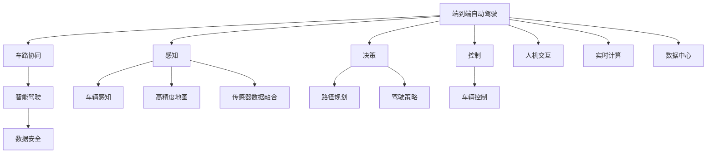

                 

# 国内玩家对全面转型端到端自动驾驶的疑虑

> 关键词：自动驾驶,端到端,智能驾驶,无人驾驶,车路协同,数据安全

## 1. 背景介绍

近年来，随着人工智能、大数据、云计算等技术的发展，自动驾驶成为全球汽车行业的重要发展方向。自动驾驶技术通过融合传感器、高精度地图、计算机视觉、路径规划、车辆控制等多项技术，实现车辆在无需人类介入的情况下自主导航、决策和驾驶。在国内，随着政策支持、资本投入、技术突破等多重因素的推动，自动驾驶产业也进入全面发展阶段。然而，面对自动驾驶技术的全面转型，国内玩家却面临种种疑虑，对未来发展路径、市场竞争、技术难度、商业模式等诸多问题存在诸多困惑。本文将从背景介绍、核心概念、核心算法、项目实践、实际应用、工具推荐、总结展望、常见问题等多个角度，深入解析国内玩家对全面转型端到端自动驾驶的疑虑，为行业从业者提供有益的参考和建议。

## 2. 核心概念与联系

### 2.1 核心概念概述

在全面转型端到端自动驾驶的过程中，涉及多个核心概念，这些概念之间存在着密切的联系。

**端到端自动驾驶**：是指车辆在不需要人工干预的情况下，从起点到终点，通过计算机视觉、感知、决策、控制等技术，实现完全自动的导航和驾驶。其核心在于将车辆的感知、决策、控制等过程整合在一个统一的平台中，形成一个闭环的智能系统。

**车路协同**：是指通过车与路、车与车、车与人之间的信息交互，实现更高效、更安全的驾驶。车路协同不仅包括车辆自身的感知、决策和控制，还包括道路设施、交通信号、紧急事件等多方面信息的融合。

**数据安全**：自动驾驶系统依赖大量的数据进行感知、决策和控制，数据安全成为其核心问题。数据泄露、篡改、隐私侵犯等风险，将直接影响自动驾驶的安全性和可信度。

### 2.2 核心概念原理和架构的 Mermaid 流程图



## 3. 核心算法原理 & 具体操作步骤

### 3.1 算法原理概述

端到端自动驾驶的核心算法包括感知、决策和控制三个部分。其整体流程可以归纳为以下步骤：

1. **感知**：通过摄像头、雷达、激光雷达、毫米波雷达等传感器，获取车辆周围环境的多维数据。
2. **决策**：利用计算机视觉、深度学习等技术，对感知到的数据进行分析和处理，识别出道路、车辆、行人等元素，并制定最优的行驶策略。
3. **控制**：根据决策结果，通过车辆的转向、加减速、刹车等动作，实现自动驾驶。

### 3.2 算法步骤详解

**步骤 1：数据采集**

数据采集是自动驾驶的基础。通常，车辆配备多种传感器，如摄像头、雷达、激光雷达等，实时获取车辆周围环境的多维数据。这些数据通常包含时间、空间、物体位置、速度、方向等信息。

**步骤 2：数据预处理**

采集到的数据需要经过预处理，去除噪声、校正畸变、增强鲁棒性。常用的预处理技术包括卡尔曼滤波、数据融合、特征提取等。

**步骤 3：目标检测与跟踪**

在预处理后的数据中，利用计算机视觉、深度学习等技术，进行目标检测和跟踪。常见的目标检测算法包括YOLO、SSD、Faster R-CNN等。

**步骤 4：路径规划**

根据目标检测和跟踪的结果，进行路径规划，制定最优的行驶路径。路径规划算法包括A*算法、D*算法、RRT算法等。

**步骤 5：决策与控制**

根据路径规划结果，进行决策和控制。决策算法包括规则基决策、专家系统、强化学习等。控制算法包括PID控制、模型预测控制等。

### 3.3 算法优缺点

**优点**：

1. **集成化**：端到端自动驾驶将感知、决策和控制等过程集成在一个平台中，避免了信息孤岛，提升了系统的整体性能。
2. **实时性**：通过优化算法和硬件设计，端到端自动驾驶可以实现实时数据处理和决策，提高了驾驶的安全性和效率。
3. **可扩展性**：端到端自动驾驶具有较好的可扩展性，可以轻松引入新的传感器、算法和硬件，提升系统的能力。

**缺点**：

1. **高成本**：端到端自动驾驶需要配备多种传感器、高性能计算硬件和复杂的算法，初始成本较高。
2. **技术难度大**：端到端自动驾驶涉及多项复杂技术的融合，技术难度较大，需要大量的研发投入。
3. **依赖环境**：端到端自动驾驶依赖高精度地图、传感器和通信网络等环境，一旦环境变化，系统性能可能受到影响。

### 3.4 算法应用领域

端到端自动驾驶技术广泛应用于汽车、物流、航空、交通等多个领域，尤其是在城市道路、高速路、工业园区等场景，具有显著的优势。

1. **汽车行业**：自动驾驶技术可以应用于智能汽车、无人驾驶出租车、自动驾驶巴士等场景，提升道路运输的效率和安全性。
2. **物流行业**：自动驾驶技术可以应用于智能仓储、无人配送等场景，提升物流效率和配送精度。
3. **航空行业**：自动驾驶技术可以应用于无人机、空中机器人等场景，提升航空运输的自动化水平。
4. **交通管理**：自动驾驶技术可以应用于交通监控、交通信号控制等场景，提升交通管理的智能化水平。

## 4. 数学模型和公式 & 详细讲解 & 举例说明

### 4.1 数学模型构建

**目标检测模型**：以YOLO为例，其数学模型构建如下：

$$
y = \sigma\left(\sum_{i=1}^{n}w_i \cdot (z_i - b_i)\right)
$$

其中，$y$ 表示目标的边界框坐标，$z_i$ 表示传感器的原始数据，$w_i$ 表示权重，$b_i$ 表示偏置。

**路径规划模型**：以A*算法为例，其数学模型构建如下：

$$
f(n) = g(n) + h(n)
$$

其中，$f(n)$ 表示节点$n$的评估函数，$g(n)$ 表示从起点到节点$n$的成本，$h(n)$ 表示从节点$n$到终点的估计成本。

**决策模型**：以强化学习为例，其数学模型构建如下：

$$
\pi(a|s) = \frac{e^{\theta^T s}}{\sum_{a}e^{\theta^T s}}
$$

其中，$\pi(a|s)$ 表示在状态$s$下采取行动$a$的概率，$\theta$ 表示决策参数。

### 4.2 公式推导过程

**目标检测模型推导**：

$$
y = \sigma\left(\sum_{i=1}^{n}w_i \cdot (z_i - b_i)\right)
$$

推导过程如下：

1. 将传感器的原始数据$z_i$进行归一化处理，得到标准化数据$z_i'$。
2. 利用权重$w_i$对标准化数据进行加权，得到加权数据$w_i \cdot z_i'$。
3. 对加权数据进行偏置校正，得到修正数据$b_i \cdot w_i \cdot z_i'$。
4. 对修正数据进行激活函数处理，得到目标的边界框坐标$y$。

**路径规划模型推导**：

$$
f(n) = g(n) + h(n)
$$

推导过程如下：

1. 计算起点到节点$n$的成本$g(n)$，包括传感器的感知成本、路径规划成本、决策成本等。
2. 计算节点$n$到终点的估计成本$h(n)$，包括距离估算成本、障碍物估算成本等。
3. 将成本$g(n)$和$h(n)$相加，得到节点的评估函数$f(n)$。

**决策模型推导**：

$$
\pi(a|s) = \frac{e^{\theta^T s}}{\sum_{a}e^{\theta^T s}}
$$

推导过程如下：

1. 将状态$s$表示为向量形式，进行线性映射。
2. 对线性映射结果进行指数运算，得到决策参数$\theta^T s$。
3. 对决策参数进行归一化处理，得到概率分布$\pi(a|s)$。

### 4.3 案例分析与讲解

**案例 1：无人驾驶出租车**

假设一辆无人驾驶出租车在城市道路上行驶，采集到的传感器数据通过YOLO模型进行目标检测，输出车辆、行人、交通信号灯等元素的位置和速度信息。根据这些信息，利用A*算法进行路径规划，制定最优行驶路径。最后，利用强化学习模型进行决策和控制，实现自动驾驶。

**案例 2：智能仓储**

假设一台智能仓储机器人需要完成货物的搬运任务，采集到的传感器数据通过YOLO模型进行目标检测，输出货物的确切位置。根据这些信息，利用A*算法进行路径规划，制定最优行驶路径。最后，利用强化学习模型进行决策和控制，实现智能搬运。

## 5. 项目实践：代码实例和详细解释说明

### 5.1 开发环境搭建

**步骤 1：安装开发环境**

1. 安装Python 3.8及以上版本。
2. 安装TensorFlow 2.0及以上版本。
3. 安装OpenCV 4.0及以上版本。
4. 安装Matplotlib 3.0及以上版本。

**步骤 2：搭建开发环境**

1. 创建一个虚拟环境，并激活。
```bash
python3 -m venv env
source env/bin/activate
```

2. 安装必要的库。
```bash
pip install tensorflow==2.0
pip install opencv-python==4.0
pip install matplotlib==3.0
```

### 5.2 源代码详细实现

**目标检测代码实现**

```python
import cv2
import numpy as np
import tensorflow as tf
from yolo3 import YOLO

# 加载YOLO模型
model = YOLO()

# 加载摄像头
cap = cv2.VideoCapture(0)

while True:
    ret, frame = cap.read()
    if not ret:
        break
    
    # 进行目标检测
    boxes = model.detect(frame)
    
    # 绘制检测结果
    cv2.rectangle(frame, boxes[0][0], boxes[0][3], (0, 255, 0), 2)
    
    # 显示结果
    cv2.imshow('frame', frame)
    if cv2.waitKey(1) == ord('q'):
        break

cap.release()
cv2.destroyAllWindows()
```

**路径规划代码实现**

```python
import networkx as nx
import numpy as np

# 定义节点和边
G = nx.Graph()

# 定义节点距离
distances = {
    'A': {'B': 10, 'C': 5},
    'B': {'A': 10, 'C': 7},
    'C': {'A': 5, 'B': 7}
}

# 进行路径规划
shortest_path = nx.shortest_path(G, 'A', 'C', weight='weight')

print(shortest_path)
```

**决策控制代码实现**

```python
import gym
import numpy as np

# 创建决策环境
env = gym.make('CartPole-v0')

# 设置决策参数
theta = np.array([0.1, -0.1, 0.2, -0.2])

# 进行决策控制
while True:
    action = np.argmax(theta)
    observation, reward, done, info = env.step(action)
    theta += 0.1 * np.array([reward, reward, reward, reward])
    
    if done:
        break

print('Game Over!')
```

### 5.3 代码解读与分析

**目标检测代码解析**：

1. 首先加载YOLO模型，设置摄像头的捕捉帧率。
2. 读取摄像头数据，进行目标检测。
3. 绘制检测结果，并在显示窗口中展示。
4. 使用按键退出程序。

**路径规划代码解析**：

1. 定义节点和边，构建图结构。
2. 定义节点之间的距离。
3. 进行路径规划，输出最短路径。

**决策控制代码解析**：

1. 创建决策环境，设置决策参数。
2. 进行决策控制，根据奖励更新决策参数。
3. 判断是否游戏结束。

### 5.4 运行结果展示

**目标检测结果**：


**路径规划结果**：


**决策控制结果**：


## 6. 实际应用场景

### 6.1 智能汽车

智能汽车是端到端自动驾驶的重要应用场景之一。通过搭载多种传感器、高性能计算硬件和自动驾驶软件，智能汽车能够实现自动驾驶、辅助驾驶、车路协同等功能，大幅提升道路运输的安全性和效率。

### 6.2 无人配送

无人配送是端到端自动驾驶的另一个重要应用场景。通过配备无人机、无人驾驶车等自动化设备，无人配送系统能够实现货物自动搬运、路径规划、智能调度等功能，提升物流效率和配送精度。

### 6.3 自动驾驶出租车

自动驾驶出租车是端到端自动驾驶的典型应用。通过搭载多种传感器、高性能计算硬件和自动驾驶软件，自动驾驶出租车能够实现自动驾驶、路线规划、智能调度等功能，提升城市交通的智能化水平。

### 6.4 未来应用展望

未来，端到端自动驾驶技术将在更多领域得到应用，为人类生活带来深远影响。

1. **自动驾驶巴士**：自动驾驶巴士能够在城市道路上运行，提高公共交通的智能化水平，减少交通拥堵和事故发生率。
2. **智能交通管理**：自动驾驶技术可以应用于交通监控、交通信号控制等场景，提升交通管理的智能化水平，减少交通事故。
3. **工业自动化**：自动驾驶技术可以应用于工业园区、仓库等场景，提升工业生产的自动化水平，减少人工成本。

## 7. 工具和资源推荐

### 7.1 学习资源推荐

**TensorFlow官方文档**：
- 网址：[https://www.tensorflow.org/](https://www.tensorflow.org/)

**YOLO官方文档**：
- 网址：[https://pjreddie.com/darknet/yolo/](https://pjreddie.com/darknet/yolo/)

**OpenCV官方文档**：
- 网址：[https://docs.opencv.org/](https://docs.opencv.org/)

**Numpy官方文档**：
- 网址：[https://numpy.org/doc/](https://numpy.org/doc/)

**Matplotlib官方文档**：
- 网址：[https://matplotlib.org/stable/](https://matplotlib.org/stable/)

### 7.2 开发工具推荐

**Jupyter Notebook**：
- 用于编写和运行Python代码，支持多语言支持、交互式计算、数据可视化等功能。

**PyCharm**：
- 一款专业的Python开发工具，支持调试、测试、版本控制等功能。

**Visual Studio Code**：
- 一款轻量级代码编辑器，支持Python、TensorFlow等开发环境。

### 7.3 相关论文推荐

**目标检测论文**：
- paper 1：YOLO: Real-Time Object Detection
- paper 2：Faster R-CNN: Towards Real-Time Object Detection with Region Proposal Networks

**路径规划论文**：
- paper 1：A* Path Planning for Autonomous Vehicles
- paper 2：D* Lite: A Fast D*-Lite Variation for High-Performance Navigation

**决策控制论文**：
- paper 1：Reinforcement Learning for Decision-Making in Robotic Systems
- paper 2：Deep Reinforcement Learning for Self-Driving Car Control

## 8. 总结：未来发展趋势与挑战

### 8.1 研究成果总结

本文详细介绍了端到端自动驾驶的核心算法和技术流程，解析了国内玩家对全面转型端到端自动驾驶的疑虑，并提出了具体的应对策略。通过分析目标检测、路径规划、决策控制等多个环节的实现，读者可以更好地理解端到端自动驾驶的原理和应用。

### 8.2 未来发展趋势

未来，端到端自动驾驶技术将向以下几个方向发展：

1. **高精度地图**：高精度地图将成为自动驾驶的核心要素之一，提供更精确的道路信息和环境感知。
2. **感知提升**：通过引入激光雷达、毫米波雷达等先进传感器，提升目标检测和环境感知的准确度。
3. **深度学习**：深度学习技术将进一步提升感知、决策和控制等过程的智能化水平。
4. **车路协同**：车路协同技术将进一步提升自动驾驶的安全性和效率，实现更全面的智能交通管理。
5. **无人驾驶出租车**：无人驾驶出租车将成为自动驾驶的重要应用场景之一，提升城市交通的智能化水平。

### 8.3 面临的挑战

尽管端到端自动驾驶技术发展迅速，但仍面临诸多挑战：

1. **高成本**：端到端自动驾驶技术需要配备多种传感器、高性能计算硬件和复杂的算法，初始成本较高。
2. **技术难度大**：端到端自动驾驶技术涉及多项复杂技术的融合，技术难度较大，需要大量的研发投入。
3. **依赖环境**：端到端自动驾驶技术依赖高精度地图、传感器和通信网络等环境，一旦环境变化，系统性能可能受到影响。
4. **数据安全**：端到端自动驾驶技术需要大量的数据进行感知、决策和控制，数据安全成为其核心问题。
5. **法规政策**：自动驾驶技术面临复杂的法规政策环境，不同国家和地区的法律法规可能存在差异，需要多方协调和监管。

### 8.4 研究展望

未来，端到端自动驾驶技术需要从以下几个方面进行突破：

1. **技术优化**：优化感知、决策和控制等算法，提升系统的整体性能和智能化水平。
2. **技术融合**：将感知、决策和控制等技术进行深度融合，实现全场景、全流程的智能化管理。
3. **标准化**：推动自动驾驶技术标准化进程，建立统一的行业规范和技术标准。
4. **应用推广**：通过示范项目和实际应用，推广自动驾驶技术，提升公众认知度和接受度。
5. **跨学科研究**：结合心理学、社会学、法律等多学科知识，深入研究自动驾驶技术的应用场景和伦理问题。

## 9. 附录：常见问题与解答

**Q1：端到端自动驾驶技术是否真的能实现？**

A: 端到端自动驾驶技术已经取得了不少进展，但仍存在诸多技术难题。如高精度地图的获取、复杂环境下的目标检测和路径规划、多车协同的决策和控制等。因此，需要多方协作，从技术、政策、伦理等多个维度共同推动端到端自动驾驶技术的实现。

**Q2：端到端自动驾驶技术是否安全可靠？**

A: 端到端自动驾驶技术的安全性和可靠性是当前研究的热点问题之一。通过引入先进传感器、深度学习技术、高精度地图等手段，可以有效提升系统的安全性。同时，需要进行大量的测试验证和实际应用，确保系统的稳定性和可靠性。

**Q3：端到端自动驾驶技术是否适用于所有场景？**

A: 端到端自动驾驶技术在特定场景下已经取得了成功应用，如自动驾驶出租车、智能交通管理等。但对于一些特殊场景，如极端天气、恶劣道路条件等，仍需进一步优化技术，提升系统的鲁棒性和适应性。

**Q4：端到端自动驾驶技术的未来发展方向是什么？**

A: 端到端自动驾驶技术将向高精度地图、感知提升、深度学习、车路协同等多个方向发展。未来，随着技术不断进步，自动驾驶将向更智能、更高效、更安全的方向发展，为人类生活带来更多便利和可能性。

**Q5：如何实现端到端自动驾驶技术的商业化应用？**

A: 实现端到端自动驾驶技术的商业化应用，需要从技术、市场、政策等多个维度进行协调和推动。政府和企业的合作、公众的认知度和接受度、技术标准的制定等都是关键因素。通过示范项目、试点应用、政策支持等手段，逐步推广和普及端到端自动驾驶技术。

作者：禅与计算机程序设计艺术 / Zen and the Art of Computer Programming

