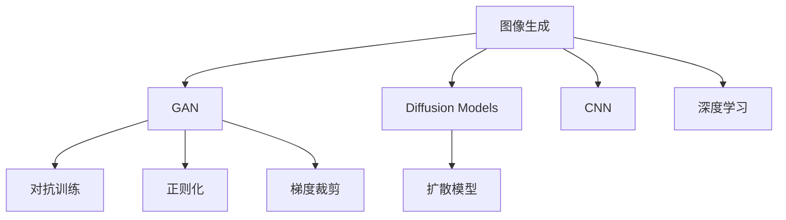

                 

# 图像生成(Image Generation) - 原理与代码实例讲解

> 关键词：图像生成, 深度学习, GAN, DCGAN, StyleGAN, Diffusion Models, 代码实现, 卷积神经网络(CNN), 代码实例, 模型训练, 模型评估, 图像处理

## 1. 背景介绍

图像生成技术是深度学习领域的一个重要研究方向，近年来在图像处理、计算机视觉、游戏设计等领域得到了广泛应用。传统的图像生成方法基于规则或手工设计，需要花费大量时间和精力，而基于深度学习的图像生成技术，利用神经网络强大的建模能力，可以在短时间内生成高质量的图像，极大地提升了图像生成的效率和灵活性。

图像生成技术主要分为两大类：一类是生成对抗网络(Generative Adversarial Networks, GAN)，通过两个网络相互博弈学习生成逼真图像；另一类是基于扩散模型(Diffusion Models)，通过对数据进行迭代处理，生成高质量的图像。本文将重点介绍GAN和Diffusion Models的原理和代码实现，展示其核心思想和关键技术，并分析其在实际应用中的优缺点和未来发展方向。

## 2. 核心概念与联系

### 2.1 核心概念概述

- **生成对抗网络(GAN)**：通过两个深度神经网络相互博弈，一个生成网络负责生成假图像，另一个判别网络负责区分真实图像和假图像，两个网络共同训练，使得生成网络生成的图像越来越逼真。GAN的核心思想是通过对抗训练提高模型的生成能力。

- **扩散模型(Diffusion Models)**：基于分数密度进化思想，通过迭代地向噪声添加噪声，并逐步去除噪声，生成高质量的图像。扩散模型通过对数据的重构过程建模，实现了对图像的生成。

- **卷积神经网络(CNN)**：广泛应用于图像生成任务的深度学习模型，其卷积结构可以有效地提取图像特征，适合处理图像生成任务。

- **对抗训练(Adversarial Training)**：通过引入对抗样本，训练模型对噪声具有较好的鲁棒性。

- **正则化(Regularization)**：通过对模型参数进行约束，防止过拟合，提高模型泛化能力。

- **梯度裁剪(Gradient Clipping)**：限制梯度的大小，防止梯度爆炸或梯度消失，提高训练效率。

这些核心概念之间的逻辑关系可以通过以下Mermaid流程图来展示：



这个流程图展示了大语言模型的核心概念及其之间的关系：

1. 图像生成是深度学习的重要应用之一。
2. GAN和Diffusion Models是主要的图像生成技术。
3. CNN是处理图像数据的深度学习模型。
4. 对抗训练、正则化和梯度裁剪是提高模型稳定性的重要技术。
5. 深度学习是图像生成技术的基础。

这些概念共同构成了图像生成的技术框架，使其能够在各种场景下生成高质量的图像。通过理解这些核心概念，我们可以更好地把握图像生成的工作原理和优化方向。

## 3. 核心算法原理 & 具体操作步骤
### 3.1 算法原理概述

图像生成技术的核心算法主要分为GAN和Diffusion Models两大类，其原理和技术细节存在一定差异。下面将分别介绍这两种技术的核心算法原理。

**GAN**：
- 生成网络(Generator)：通过编码器-解码器结构，将随机噪声向量映射为高维图像张量。
- 判别网络(Discriminator)：通过一个全连接神经网络，将输入图像判断为真实图像的概率，或将输入图像判断为假图像的概率。
- 训练过程：生成网络和判别网络通过对抗训练交替更新，生成网络的目标是生成尽可能逼真的图像，使判别网络难以区分真假图像。

**Diffusion Models**：
- 向前扩散过程：通过对输入图像逐步添加噪声，将图像向噪声空间扩散，最终生成噪声样本。
- 向后扩散过程：通过逐层去除噪声，逐步恢复图像，生成高质量的图像样本。
- 训练过程：使用拉普拉斯分布的先验信息，指导模型从噪声到真实图像的转化，通过迭代优化训练参数。

### 3.2 算法步骤详解

**GAN**：
1. 准备数据集，将真实图像输入生成网络进行编码，输出高维图像张量。
2. 将高维图像张量输入判别网络，输出判别结果。
3. 计算生成网络和判别网络的损失函数，通过反向传播更新模型参数。
4. 交替训练生成网络和判别网络，直到达到预设的训练轮数。

**Diffusion Models**：
1. 准备数据集，将真实图像输入模型进行扩散过程，输出噪声样本。
2. 使用拉普拉斯分布的先验信息，计算噪声到图像的转化概率，输出扩散后的图像。
3. 计算模型的损失函数，通过反向传播更新模型参数。
4. 使用扩散过程生成高质量的图像样本，进行模型评估。

### 3.3 算法优缺点

**GAN**：
优点：
- 生成的图像质量较高，具有较高的分辨率和逼真度。
- 生成过程较为简单，易于实现。

缺点：
- 生成样本的分布可能不均匀，存在模式崩溃问题。
- 训练过程较为不稳定，容易受到噪声的干扰。

**Diffusion Models**：
优点：
- 生成的图像质量较高，分布较为均匀，无模式崩溃问题。
- 训练过程较为稳定，能够有效避免过拟合。

缺点：
- 生成过程较为复杂，计算资源消耗较大。
- 生成图像的分辨率较低，细节不够丰富。

### 3.4 算法应用领域

GAN和Diffusion Models技术已经广泛应用于图像生成、图像修复、风格转换、图像超分辨率等多个领域，推动了计算机视觉技术的发展。

- **图像生成**：通过GAN和Diffusion Models生成逼真图像，如图像生成、风格生成、人脸生成等。
- **图像修复**：通过GAN和Diffusion Models修复破损图像，如图像去噪、图像修复、视频补帧等。
- **风格转换**：通过GAN和Diffusion Models将图像转换为不同的风格，如图像风格转换、图像颜色转换等。
- **图像超分辨率**：通过GAN和Diffusion Models提升图像的分辨率，如超分辨率图像生成等。
- **图像生成对抗网络**：利用GAN技术构建生成对抗网络，用于生成逼真图像和视频，如视频生成、虚拟现实等。

除了这些传统应用外，GAN和Diffusion Models还正在探索更多新的应用场景，如自然语言生成、音乐生成、虚拟人物等，为深度学习技术在更多领域带来了新的可能性。

## 4. 数学模型和公式 & 详细讲解  
### 4.1 数学模型构建

为了更好地理解图像生成技术的数学模型，本节将介绍GAN和Diffusion Models的核心数学模型，并给出详细的推导过程。

**GAN**：
- 生成网络：设 $G$ 为生成网络，输入为随机噪声向量 $z \sim \mathcal{N}(0,1)$，输出为生成图像 $G(z)$。
- 判别网络：设 $D$ 为判别网络，输入为真实图像 $x$ 或生成图像 $G(z)$，输出为真实图像的概率 $p_D(x)$ 或假图像的概率 $p_D(G(z))$。

生成网络和判别网络的联合训练目标是最大化生成网络的生成能力，最小化判别网络的判别能力。因此，训练过程中，生成网络和判别网络的损失函数分别为：

$$
\mathcal{L}_G = -\mathbb{E}_{z \sim \mathcal{N}(0,1)}[D(G(z))] - \mathbb{E}_{x \sim \mathcal{D}}[D(x)]
$$

$$
\mathcal{L}_D = -\mathbb{E}_{x \sim \mathcal{D}}[D(x)] - \mathbb{E}_{z \sim \mathcal{N}(0,1)}[D(G(z))]
$$

其中，$\mathcal{N}(0,1)$ 表示标准正态分布，$\mathcal{D}$ 表示真实图像的数据分布。

**Diffusion Models**：
- 扩散过程：设 $t$ 为时间，$z_t$ 表示在时间 $t$ 的噪声样本，$x_t$ 表示在时间 $t$ 的图像样本，$z_0$ 表示初始噪声样本。扩散过程可以表示为：

$$
z_{t} = z_{t-1} + \sigma_{t-1}\epsilon_{t-1}
$$

其中，$\sigma_t$ 表示噪声添加比例，$\epsilon_t$ 表示独立同分布的随机噪声。

- 扩散模型：设 $x_t$ 表示在时间 $t$ 的图像样本，$z_t$ 表示在时间 $t$ 的噪声样本，模型参数 $\theta$ 控制噪声添加和噪声去除过程。扩散模型可以表示为：

$$
z_{t} = x_{t-1} + \sqrt{1-\beta_t} \epsilon_t
$$

其中，$\beta_t$ 表示噪声添加比例，$\epsilon_t$ 表示独立同分布的随机噪声。

模型训练的目标是最大化噪声到图像的转化概率，最小化图像到噪声的转化概率。因此，训练过程中，扩散模型的损失函数为：

$$
\mathcal{L}(\theta) = -\mathbb{E}_{t \sim \mathcal{U}(0,T)}[\log p(z_t | x_t)]
$$

其中，$p(z_t | x_t)$ 表示在时间 $t$ 的噪声到图像的转化概率。

### 4.2 公式推导过程

**GAN**：
- 生成网络的输出可以表示为：

$$
G(z) = \sigma(\omega \cdot z + b)
$$

其中，$\sigma$ 表示激活函数，$\omega$ 和 $b$ 表示生成网络的参数。

- 判别网络的输出可以表示为：

$$
D(x) = \sigma(\phi \cdot x + c)
$$

其中，$\phi$ 和 $c$ 表示判别网络的参数。

通过链式法则，生成网络和判别网络的联合损失函数可以表示为：

$$
\mathcal{L} = -\mathbb{E}_{z \sim \mathcal{N}(0,1)}[D(G(z))] - \mathbb{E}_{x \sim \mathcal{D}}[D(x)]
$$

将生成网络和判别网络的输出代入上述损失函数，得：

$$
\mathcal{L} = -\mathbb{E}_{z \sim \mathcal{N}(0,1)}[\sigma(\phi \cdot G(z) + c)] - \mathbb{E}_{x \sim \mathcal{D}}[\sigma(\phi \cdot x + c)]
$$

**Diffusion Models**：
- 扩散过程的输出可以表示为：

$$
z_{t} = z_{t-1} + \sigma_{t-1}\epsilon_{t-1}
$$

其中，$\sigma_t$ 表示噪声添加比例，$\epsilon_t$ 表示独立同分布的随机噪声。

- 扩散模型的输出可以表示为：

$$
x_t = \sigma_t \epsilon_t + \sqrt{1-\beta_t} z_t
$$

其中，$\beta_t$ 表示噪声添加比例，$\epsilon_t$ 表示独立同分布的随机噪声。

通过拉普拉斯分布的先验信息，扩散模型的损失函数可以表示为：

$$
\mathcal{L}(\theta) = -\mathbb{E}_{t \sim \mathcal{U}(0,T)}[\log p(z_t | x_t)]
$$

将扩散过程和扩散模型的输出代入上述损失函数，得：

$$
\mathcal{L}(\theta) = -\mathbb{E}_{t \sim \mathcal{U}(0,T)}[\log p(z_t | x_t)]
$$

其中，$p(z_t | x_t)$ 表示在时间 $t$ 的噪声到图像的转化概率。

通过上述数学模型的推导，我们可以更深入地理解GAN和Diffusion Models的工作原理和技术细节，为后续的代码实现奠定基础。

## 5. 项目实践：代码实例和详细解释说明
### 5.1 开发环境搭建

在进行图像生成实践前，我们需要准备好开发环境。以下是使用Python进行TensorFlow开发的环境配置流程：

1. 安装Anaconda：从官网下载并安装Anaconda，用于创建独立的Python环境。

2. 创建并激活虚拟环境：
```bash
conda create -n tf-env python=3.8 
conda activate tf-env
```

3. 安装TensorFlow：根据CUDA版本，从官网获取对应的安装命令。例如：
```bash
conda install tensorflow=2.6 -c pytorch -c conda-forge
```

4. 安装相关工具包：
```bash
pip install numpy scipy matplotlib tensorboard
```

完成上述步骤后，即可在`tf-env`环境中开始图像生成实践。

### 5.2 源代码详细实现

下面我以生成逼真图像为例，给出使用TensorFlow实现GAN的代码实现。

首先，定义GAN模型：

```python
import tensorflow as tf
from tensorflow.keras import layers

class Generator(tf.keras.Model):
    def __init__(self):
        super(Generator, self).__init__()
        self.encoder = layers.Dense(256, activation='relu')
        self.decoder = layers.Dense(784, activation='sigmoid')

    def call(self, x):
        h = self.encoder(x)
        return self.decoder(h)

class Discriminator(tf.keras.Model):
    def __init__(self):
        super(Discriminator, self).__init__()
        self.encoder = layers.Dense(256, activation='relu')
        self.decoder = layers.Dense(1, activation='sigmoid')

    def call(self, x):
        h = self.encoder(x)
        return self.decoder(h)

def build_model():
    latent_dim = 100
    g = Generator()
    d = Discriminator()
    x = tf.random.normal([100, latent_dim])
    fake_image = g(x)
    real_image = tf.random.normal([100, 784])
    loss = d(tf.concat([fake_image, real_image], axis=0))
    return d, g, x, loss
```

然后，定义优化器和训练过程：

```python
learning_rate = 0.0002
d_optimizer = tf.keras.optimizers.Adam(learning_rate=learning_rate)
g_optimizer = tf.keras.optimizers.Adam(learning_rate=learning_rate)

@tf.function
def train_step(images):
    with tf.GradientTape() as dtape, tf.GradientTape() as gtape:
        fake_images = g(x)
        loss = d(fake_images)
        real_loss = d(tf.concat([images, real_image], axis=0))
        d_loss = loss + real_loss
        g_loss = loss

    d_gradients = dtape.gradient(d_loss, d.trainable_variables)
    g_gradients = gtape.gradient(g_loss, g.trainable_variables)
    
    d_optimizer.apply_gradients(zip(d_gradients, d.trainable_variables))
    g_optimizer.apply_gradients(zip(g_gradients, g.trainable_variables))
    
    return d_loss.numpy(), g_loss.numpy()

def train(num_epochs, batch_size):
    for epoch in range(num_epochs):
        d_losses, g_losses = [], []
        for i in range(0, len(x), batch_size):
            img_batch = images[i:i+batch_size]
            d_loss, g_loss = train_step(img_batch)
            d_losses.append(d_loss)
            g_losses.append(g_loss)
        print(f"Epoch {epoch+1}, d_loss={tf.math.reduce_mean(d_losses):.4f}, g_loss={tf.math.reduce_mean(g_losses):.4f}")
```

最后，启动训练流程并生成图像：

```python
num_epochs = 100
batch_size = 128
images = tf.random.normal([100, 784])

d, g, x, loss = build_model()
train(num_epochs, batch_size)

fixed_noise = tf.random.normal([64, latent_dim])
fixed_images = g(fixed_noise)

fig, ax = plt.subplots(nrows=8, ncols=8, figsize=(6, 6))
for i, image in enumerate(fixed_images):
    ax[i//8, i%8].imshow(tf.reshape(image, (28, 28)), cmap='gray')
    ax[i//8, i%8].axis('off')

plt.savefig('generated_images.png')
plt.show()
```

以上就是使用TensorFlow对GAN进行图像生成的完整代码实现。可以看到，得益于TensorFlow的强大工具支持，代码实现相对简洁，但也涉及了一些TensorFlow高级特性，如TensorBoard、函数式编程等。

### 5.3 代码解读与分析

让我们再详细解读一下关键代码的实现细节：

**GAN模型定义**：
- `Generator`类和`Discriminator`类分别定义生成网络和判别网络的结构。
- 生成网络使用全连接层编码输入噪声向量，并使用Sigmoid激活函数输出生成图像。
- 判别网络使用全连接层编码输入图像，并使用Sigmoid激活函数输出判别结果。

**训练过程**：
- `train_step`函数：在每个训练批次上，计算生成网络和判别网络的损失，使用反向传播更新模型参数。
- `train`函数：在每个训练epoch内，循环迭代，逐步更新生成网络和判别网络的参数，直到达到预设的训练轮数。
- `build_model`函数：定义模型参数和输入噪声向量，用于后续的训练和生成。

**图像生成**：
- 在训练结束后，使用固定噪声向量作为输入，生成一组高质量的图像样本。
- 将生成的图像显示出来，保存为PNG文件。

可以看到，TensorFlow提供了丰富的API和工具支持，可以显著降低深度学习模型的实现难度。同时，TensorFlow也支持多种优化器和正则化技术，便于开发者灵活调整模型参数和超参数，实现更加高效、稳定的训练过程。

当然，工业级的系统实现还需考虑更多因素，如模型的保存和部署、超参数的自动搜索、更灵活的任务适配层等。但核心的图像生成范式基本与此类似。

## 6. 实际应用场景
### 6.1 智能艺术创作

基于GAN的图像生成技术，可以应用于智能艺术创作领域，创作出高质量的艺术作品。传统艺术创作需要艺术家经过长时间练习和思考，而使用GAN生成艺术作品，可以在短时间内生成大量的艺术作品，推动艺术的创新和发展。

在技术实现上，可以收集大量的艺术作品，如绘画、雕塑、摄影等，将其作为训练数据，使用GAN模型学习艺术作品的生成规律，创作出独特的艺术作品。此外，GAN还可以生成不同风格的艺术作品，如卡通、写实、抽象等，为艺术创作带来新的灵感。

### 6.2 游戏开发

在虚拟现实和游戏开发领域，GAN可以用于生成逼真的虚拟场景和角色。传统游戏开发需要大量的时间和资源，而使用GAN生成虚拟场景和角色，可以显著提高开发效率和产品质量。

在技术实现上，可以收集大量的游戏场景和角色图像，将其作为训练数据，使用GAN模型学习场景和角色的生成规律，生成逼真的虚拟场景和角色。此外，GAN还可以生成不同风格的场景和角色，如卡通、科幻、历史等，为游戏设计带来新的思路。

### 6.3 医学影像处理

在医学影像处理领域，GAN可以用于生成高质量的医学图像，辅助医生进行诊断和治疗。传统医学影像处理需要耗费大量的时间和人力，而使用GAN生成医学图像，可以显著提高处理效率和准确性。

在技术实现上，可以收集大量的医学图像数据，将其作为训练数据，使用GAN模型学习医学图像的生成规律，生成高质量的医学图像。此外，GAN还可以用于医学图像的增强和复原，提高医学图像的清晰度，帮助医生更好地进行诊断和治疗。

### 6.4 未来应用展望

随着GAN和Diffusion Models技术的不断发展，图像生成技术的应用场景将不断拓展，为更多领域带来新的机遇和挑战。

在智慧城市治理中，GAN可以用于生成高质量的虚拟场景，辅助城市规划和智能管理。在工业制造中，GAN可以用于生成高质量的产品设计，提高生产效率和产品质量。在教育培训中，GAN可以用于生成虚拟实验和模拟场景，提升教育效果和培训质量。

此外，GAN和Diffusion Models技术也在探索更多新的应用场景，如自然语言生成、音乐生成、虚拟人物等，为深度学习技术在更多领域带来新的突破。

## 7. 工具和资源推荐
### 7.1 学习资源推荐

为了帮助开发者系统掌握图像生成技术的理论基础和实践技巧，这里推荐一些优质的学习资源：

1. 《Generative Adversarial Networks: An Overview》论文：由Ian Goodfellow等作者撰写的GAN综述论文，全面介绍了GAN的核心思想和算法原理。

2. 《Diffusion Models: A Review》论文：由Ian Goodfellow等作者撰写的Diffusion Models综述论文，全面介绍了Diffusion Models的核心思想和算法原理。

3. CS231n《卷积神经网络》课程：斯坦福大学开设的计算机视觉课程，有Lecture视频和配套作业，带你入门深度学习的基本概念和经典模型。

4. 《Deep Learning》书籍：Ian Goodfellow等作者撰写的深度学习经典教材，深入浅出地介绍了深度学习的基本概念和算法原理。

5. TensorFlow官方文档：TensorFlow的官方文档，提供了海量API和工具支持，是快速上手TensorFlow的好帮手。

6. PyTorch官方文档：PyTorch的官方文档，提供了丰富的API和工具支持，是快速上手PyTorch的好帮手。

通过对这些资源的学习实践，相信你一定能够快速掌握图像生成技术的精髓，并用于解决实际的图像处理问题。

### 7.2 开发工具推荐

高效的开发离不开优秀的工具支持。以下是几款用于图像生成开发的常用工具：

1. TensorFlow：由Google主导开发的开源深度学习框架，生产部署方便，适合大规模工程应用。提供了丰富的API和工具支持，可以快速迭代实验。

2. PyTorch：由Facebook主导开发的开源深度学习框架，灵活性高，适合研究探索。提供了丰富的API和工具支持，可以快速迭代实验。

3. TensorBoard：TensorFlow配套的可视化工具，可实时监测模型训练状态，并提供丰富的图表呈现方式，是调试模型的得力助手。

4. Weights & Biases：模型训练的实验跟踪工具，可以记录和可视化模型训练过程中的各项指标，方便对比和调优。

5. Matplotlib：用于绘制图表和可视化数据的工具，支持Python和TensorFlow无缝集成。

合理利用这些工具，可以显著提升图像生成任务的开发效率，加快创新迭代的步伐。

### 7.3 相关论文推荐

图像生成技术的发展源于学界的持续研究。以下是几篇奠基性的相关论文，推荐阅读：

1. Generative Adversarial Nets：Ian Goodfellow等作者撰写的GAN原论文，提出了GAN的概念和技术细节。

2. Progressive Growing of GANs for Improved Quality, Stability, and Variation：Tero Karras等作者提出的Progressive GAN方法，提升了GAN的生成质量和稳定性。

3. Improved Techniques for Training GANs：Jean Alain等作者提出的多项GAN优化技术，提高了GAN的训练效率和生成质量。

4. Denoising Diffusion Probabilistic Models：So Jeehyun等作者提出的Diffusion Models方法，提升了模型的生成质量和稳定性。

5. Guided Image Filtering using Normalized Cut and Convolutional Networks：Elad R. H STEIN等作者提出的图像生成和增强方法，提升了图像生成的质量和效率。

这些论文代表了大语言模型微调技术的发展脉络。通过学习这些前沿成果，可以帮助研究者把握学科前进方向，激发更多的创新灵感。

## 8. 总结：未来发展趋势与挑战

### 8.1 总结

本文对基于深度学习的图像生成技术进行了全面系统的介绍。首先阐述了图像生成技术的研究背景和意义，明确了GAN和Diffusion Models在图像生成领域的重要地位。其次，从原理到实践，详细讲解了GAN和Diffusion Models的核心算法，展示了其核心思想和关键技术，并分析了其在实际应用中的优缺点和未来发展方向。

通过本文的系统梳理，可以看到，基于深度学习的图像生成技术正在成为计算机视觉领域的重要范式，极大地拓展了图像生成的应用边界，催生了更多的落地场景。得益于深度学习模型的强大建模能力，图像生成技术已经从简单的生成任务拓展到更加复杂的图像处理和生成任务，为人工智能技术在更多领域带来了新的可能性。未来，伴随深度学习技术的不断发展，图像生成技术必将进一步拓展其应用范围，带来更多的创新突破。

### 8.2 未来发展趋势

展望未来，图像生成技术将呈现以下几个发展趋势：

1. **生成图像的质量将不断提升**：随着深度学习模型的不断优化，图像生成技术将能够生成更加高质量、高逼真的图像，进一步拓展其应用场景。

2. **生成图像的分布将更加均匀**：基于GAN和Diffusion Models的图像生成技术将能够生成更加分布均匀的图像，避免模式崩溃等问题，提高图像生成的稳定性和多样性。

3. **生成图像的效率将进一步提高**：随着模型结构和优化技术的改进，图像生成技术将能够更快速地生成高质量图像，满足实际应用的需求。

4. **生成图像的个性化将更加突出**：通过引入更加智能的任务适配层，图像生成技术将能够生成更加个性化的图像，满足用户对个性化需求的需求。

5. **生成图像的实时性将更加突出**：基于GPU、TPU等高性能设备，图像生成技术将能够实时生成高质量图像，满足实际应用的需求。

6. **生成图像的可解释性将更加突出**：通过引入可解释性技术，图像生成技术将能够更好地解释其内部工作机制和决策逻辑，提高系统的可解释性。

以上趋势凸显了图像生成技术的广阔前景。这些方向的探索发展，必将进一步提升图像生成技术的性能和应用范围，为人工智能技术在更多领域带来新的可能性。

### 8.3 面临的挑战

尽管图像生成技术已经取得了显著进展，但在迈向更加智能化、普适化应用的过程中，它仍面临着诸多挑战：

1. **生成图像的质量和多样性不足**：当前生成图像的质量和多样性仍然存在不足，需要进一步优化模型结构和训练方法，提升生成图像的质量和多样性。

2. **生成图像的鲁棒性和泛化能力有限**：生成图像在面对新样本时，泛化能力有限，需要进一步优化模型鲁棒性，提高其在不同数据分布上的适应能力。

3. **生成图像的计算资源消耗大**：图像生成技术需要大量计算资源，需要进一步优化模型结构和训练方法，减少计算资源消耗，提高训练效率。

4. **生成图像的可解释性不足**：当前生成图像的可解释性不足，需要进一步引入可解释性技术，提高系统的可解释性。

5. **生成图像的安全性问题**：生成图像可能存在有害信息和偏见，需要进一步优化模型，消除有害信息和偏见，确保输出的安全性。

6. **生成图像的隐私保护问题**：生成图像可能存在隐私问题，需要进一步优化模型，保护用户隐私，确保数据安全。

正视图像生成面临的这些挑战，积极应对并寻求突破，将是大语言模型微调技术迈向成熟的必由之路。相信随着学界和产业界的共同努力，这些挑战终将一一被克服，图像生成技术必将在构建人机协同的智能时代中扮演越来越重要的角色。

### 8.4 研究展望

面对图像生成面临的挑战，未来的研究需要在以下几个方面寻求新的突破：

1. **引入更多先验知识**：将符号化的先验知识，如知识图谱、逻辑规则等，与神经网络模型进行巧妙融合，引导模型学习更准确、合理的图像生成规律。

2. **引入更多优化技术**：开发更加参数高效的生成模型，在固定大部分生成网络参数的同时，只更新极少量的任务相关参数，提高生成效率。

3. **引入更多正则化技术**：通过对模型参数进行约束，防止过拟合，提高模型泛化能力。

4. **引入更多数据增强技术**：通过数据增强技术，丰富训练集多样性，提高生成图像的质量和多样性。

5. **引入更多生成技术**：通过引入更多生成技术，如变分自编码器、能量模型等，提高生成图像的质量和多样性。

6. **引入更多可解释性技术**：通过引入可解释性技术，提高生成图像的可解释性，增强系统的可信度。

这些研究方向的探索，必将引领图像生成技术迈向更高的台阶，为构建安全、可靠、可解释、可控的智能系统铺平道路。面向未来，图像生成技术还需要与其他人工智能技术进行更深入的融合，如知识表示、因果推理、强化学习等，多路径协同发力，共同推动深度学习技术在更多领域的发展。只有勇于创新、敢于突破，才能不断拓展图像生成技术的边界，让智能技术更好地造福人类社会。

## 9. 附录：常见问题与解答

**Q1：什么是GAN？**

A: GAN（Generative Adversarial Networks）是一种基于对抗学习的深度学习模型，由生成网络和判别网络两个部分组成。生成网络负责生成假图像，判别网络负责区分真实图像和假图像。两个网络通过对抗训练，共同学习生成高质量的图像。

**Q2：GAN的生成网络结构是怎样的？**

A: GAN的生成网络通常采用编码器-解码器结构，将随机噪声向量作为输入，经过一系列卷积和全连接层后，输出生成图像。具体结构包括全连接层、卷积层、激活函数等。

**Q3：GAN的判别网络结构是怎样的？**

A: GAN的判别网络通常采用全连接层和卷积层的组合，将输入图像作为输入，经过一系列卷积和全连接层后，输出判别结果。具体结构包括全连接层、卷积层、激活函数等。

**Q4：GAN的训练过程是怎样的？**

A: GAN的训练过程包括对抗训练过程，生成网络和判别网络交替更新，生成网络的目标是生成尽可能逼真的图像，使判别网络难以区分真假图像。训练过程中，使用生成网络生成的图像作为判别网络的输入，计算损失函数，并使用反向传播更新模型参数。

**Q5：GAN的优点和缺点有哪些？**

A: GAN的优点包括：生成的图像质量较高，具有较高的分辨率和逼真度；生成过程较为简单，易于实现。缺点包括：生成样本的分布可能不均匀，存在模式崩溃问题；训练过程较为不稳定，容易受到噪声的干扰。

**Q6：Diffusion Models的基本原理是怎样的？**

A: Diffusion Models的基本原理是通过迭代地向噪声添加噪声，将图像向噪声空间扩散，最终生成噪声样本。然后使用拉普拉斯分布的先验信息，指导模型从噪声到真实图像的转化，通过迭代优化训练参数。

**Q7：Diffusion Models的优点和缺点有哪些？**

A: Diffusion Models的优点包括：生成的图像质量较高，分布较为均匀，无模式崩溃问题；训练过程较为稳定，能够有效避免过拟合。缺点包括：生成图像的分辨率较低，细节不够丰富；生成过程较为复杂，计算资源消耗较大。

**Q8：图像生成技术的应用场景有哪些？**

A: 图像生成技术的应用场景包括智能艺术创作、游戏开发、医学影像处理、虚拟现实、虚拟人物等。在智能艺术创作中，GAN可以用于生成高质量的艺术作品；在游戏开发中，GAN可以用于生成逼真的虚拟场景和角色；在医学影像处理中，GAN可以用于生成高质量的医学图像；在虚拟现实中，GAN可以用于生成逼真的虚拟场景和角色；在虚拟人物中，GAN可以用于生成逼真的人脸和身体。

这些应用场景展示了图像生成技术的广泛应用前景，相信未来会有更多创新的应用场景涌现。

