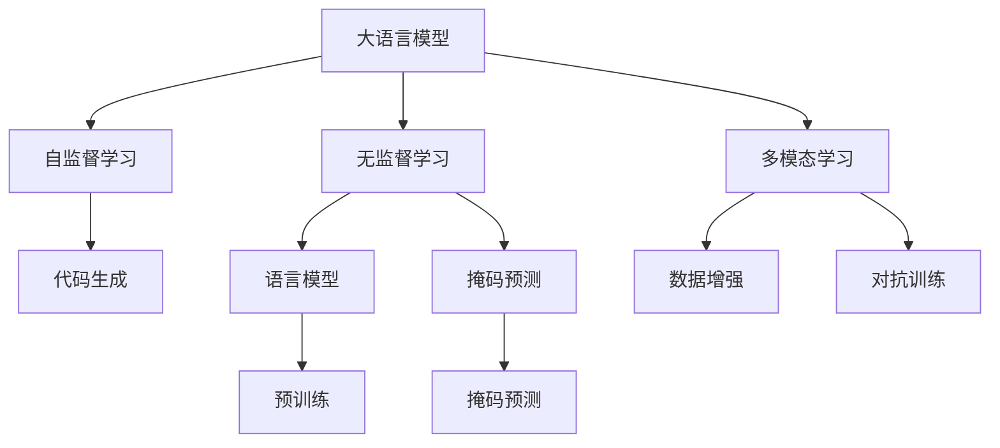

                 

# 图灵完备LLM:通向AGI的关键一步

> 关键词：图灵完备, 大语言模型, 通用人工智能, 语言理解, 自监督学习, 无监督学习, 代码生成

## 1. 背景介绍

### 1.1 问题由来
自AlphaGo在2016年战胜人类围棋冠军以来，人工智能(AI)领域的发展进入了一个新的历史阶段，人们开始重新审视机器是否能够具备人类的智慧和能力，这一概念被称之为通用人工智能(AGI)。AGI被认为是一种能够像人类一样处理各种复杂问题的智能系统，涵盖语言理解、逻辑推理、常识认知等多个领域。

在实现AGI的路径上，大语言模型(LLM)的出现带来了新的曙光。LLM通过大规模数据训练，具备强大的语言理解和生成能力，能够理解和生成自然语言，从而为解决AGI问题提供了新的可能性。例如，GPT-3作为目前最先进的LLM之一，已经展示出在各种NLP任务上超乎寻常的性能，甚至能够编写高质量的代码、诗歌和小说，引发了对于AGI的广泛讨论。

### 1.2 问题核心关键点
实现AGI的关键之一是让AI能够处理复杂的多模态任务，具备高度的通用性和灵活性。LLM的训练和微调过程，实际上是对AGI能力的模拟和强化。本文聚焦于大语言模型在AGI道路上的关键一步，即图灵完备性(Turing Completeness)，探索LLM如何通过自监督学习和无监督学习，逐步实现AGI的潜力。

## 2. 核心概念与联系

### 2.1 核心概念概述

为更好地理解LLM在AGI道路上的图灵完备性，本节将介绍几个密切相关的核心概念：

- 大语言模型(Large Language Model, LLM)：以自回归(如GPT)或自编码(如BERT)模型为代表的大规模预训练语言模型。通过在大规模无标签文本语料上进行预训练，学习通用的语言表示，具备强大的语言理解和生成能力。

- 图灵完备性(Turing Completeness)：若一个形式系统能够表达所有可计算的计算问题，则称其为图灵完备的。在AI领域，图灵完备意味着模型具备通用性，能够处理各种复杂的多模态任务。

- 自监督学习(Self-Supervised Learning)：无需人工标注的数据，通过利用未标记数据的自然结构(如语言模型、掩码预测等)进行训练，让模型自动学习到通用的语言表示。

- 无监督学习(Unsupervised Learning)：完全依赖数据本身的特性进行训练，无需任何人工标注，目标是发现数据内部的潜在结构。

- 自监督和无监督学习的联合：通过将自监督和无监督学习结合起来，模型能够更好地学习到泛化性强、应用广泛的表征，从而提升其在各种任务上的表现。

- 代码生成：指基于自然语言描述自动生成代码的过程。LLM通过自监督和无监督学习，已经能够自动编写高质量的代码，进一步增强了其在实际应用中的通用性。

- 多模态学习：LLM通过自监督和无监督学习，可以融合视觉、语音等多种模态的信息，提升对现实世界的理解和建模能力，为实现AGI提供了更广阔的数据空间。

这些核心概念之间的逻辑关系可以通过以下Mermaid流程图来展示：



这个流程图展示了大语言模型的核心概念及其之间的关系：

1. 大语言模型通过自监督学习获得语言理解能力。
2. 无监督学习增强模型的泛化能力，能够处理更多未知的数据。
3. 多模态学习进一步拓展了模型的应用场景。
4. 代码生成展示了模型在实际应用中的灵活性和通用性。

这些概念共同构成了大语言模型的学习和应用框架，使其能够在各种场景下发挥强大的语言理解和生成能力，为实现AGI提供了坚实的基础。

## 3. 核心算法原理 & 具体操作步骤
### 3.1 算法原理概述

大语言模型在实现AGI的道路上，图灵完备性是其核心目标之一。通过自监督和无监督学习，LLM逐步构建了泛化性强、应用广泛的表征，能够处理各种复杂的多模态任务。

具体来说，自监督学习通过利用未标记数据的自然结构，训练模型对语言的通用理解能力。无监督学习则进一步通过数据本身的特性，训练模型发现更广泛的潜在结构。在LLM中，自监督和无监督学习的联合，极大地提升了模型的泛化能力和通用性，使得模型能够处理各种多模态任务。

在具体操作上，LLM通过以下步骤实现图灵完备性：

1. 在大规模无标签文本数据上预训练模型，学习到通用的语言表示。
2. 利用自监督学习任务(如掩码预测、语言建模等)，训练模型对语言的理解能力。
3. 使用无监督学习任务(如数据增强、对抗训练等)，进一步提升模型的泛化能力和鲁棒性。
4. 在特定任务上进行微调，使得模型能够适应具体应用场景。
5. 通过多模态学习融合视觉、语音等多种模态信息，增强模型的通用性和适应性。

### 3.2 算法步骤详解

具体来说，实现图灵完备的大语言模型主要包括以下几个关键步骤：

**Step 1: 准备预训练数据**
- 收集大规模无标签文本数据，通常为公共语料库或Web文本等。数据应当具有代表性，覆盖不同的领域和语境。

**Step 2: 选择预训练模型**
- 选择合适的预训练模型架构，如Transformer等，设定模型的输入输出维度等参数。常用的预训练模型有BERT、GPT等。

**Step 3: 进行自监督预训练**
- 设计自监督学习任务，如掩码预测、语言建模等，利用未标记数据对模型进行预训练。通常使用跨语言、跨领域的数据，增强模型的泛化能力。

**Step 4: 引入无监督学习**
- 利用无监督学习任务，如数据增强、对抗训练等，进一步提升模型的泛化能力和鲁棒性。无监督学习任务应覆盖不同的数据类型和分布，确保模型对未知数据的适应性。

**Step 5: 微调模型**
- 在特定任务上进行微调，如命名实体识别、问答系统等。微调通常使用少量的标注数据，调整模型的输出层，使得模型能够适应具体任务。

**Step 6: 多模态融合**
- 通过融合视觉、语音等多种模态的信息，提升模型的通用性和适应性。多模态融合任务包括图像描述生成、语音转文本等。

**Step 7: 测试和部署**
- 在测试集上评估模型的性能，调整超参数，优化模型结构。
- 将优化后的模型部署到实际应用场景中，进行实时推理和预测。

### 3.3 算法优缺点

大语言模型在实现图灵完备性的过程中，具有一定的优缺点：

**优点:**
1. 泛化能力强：自监督和无监督学习联合训练，使得模型能够适应各种未知数据，具备强大的泛化能力。
2. 多模态融合：通过多模态学习，模型能够融合视觉、语音等多种信息，提升对现实世界的理解和建模能力。
3. 代码生成：模型能够自动生成高质量的代码，提升了其在实际应用中的灵活性和通用性。
4. 无监督学习：无监督学习的引入，进一步增强了模型的自适应性和鲁棒性。

**缺点:**
1. 数据需求大：自监督和无监督学习需要大量未标记数据，数据收集和处理成本较高。
2. 模型规模大：预训练模型的参数量通常以亿计，对计算资源和存储空间提出较高要求。
3. 时间成本高：自监督和无监督学习的训练时间较长，模型优化过程较为耗时。
4. 鲁棒性问题：模型在面对未知数据时，仍可能存在泛化能力不足、过拟合等问题。

尽管存在这些局限性，但图灵完备性仍是大语言模型在实现AGI道路上的关键一步，具备广阔的发展前景。

### 3.4 算法应用领域

基于自监督和无监督学习的大语言模型，已经在多个领域取得了突破性进展，具体应用包括：

- 自然语言处理(NLP)：如问答、机器翻译、文本摘要、命名实体识别等。
- 代码生成：自动生成高质量代码、注释等。
- 图像描述生成：将图像转换为自然语言描述。
- 语音识别与生成：将语音转换为文本，或将文本转换为语音。
- 推荐系统：利用多模态信息，生成个性化推荐内容。

除了上述这些经典任务外，大语言模型还涌现出更多的创新应用，如医疗领域的信息提取、金融领域的舆情分析等。这些应用展示了LLM在处理多模态信息、实现通用智能方面的巨大潜力。

## 4. 数学模型和公式 & 详细讲解  
### 4.1 数学模型构建

在本节中，我们将使用数学语言对大语言模型在AGI道路上的图灵完备性进行更严格的刻画。

记大语言模型为 $M_{\theta}$，其中 $\theta$ 为模型参数。假设模型通过大规模无标签文本数据进行预训练，学习到通用的语言表示。在无监督学习任务下，利用掩码预测等任务训练模型。在特定任务上，使用少量标注数据进行微调，调整输出层。多模态学习时，模型能够处理视觉、语音等不同模态的信息。

我们定义掩码预测任务为 $M_{\theta}$ 在输入 $x$ 上预测被遮盖部分 $x_m$ 的概率，其中 $x_m$ 为输入 $x$ 中的一部分。掩码预测损失函数定义为：

$$
\mathcal{L}(x) = -\sum_{i \in \text{mask}} \log M_{\theta}(x_i)
$$

在特定任务上，定义损失函数 $\mathcal{L}_{T}(\theta)$，训练模型在标注数据集 $D$ 上的泛化能力：

$$
\mathcal{L}_{T}(\theta) = \frac{1}{N} \sum_{i=1}^N \mathcal{L}(x_i, y_i)
$$

其中 $y_i$ 为任务 $T$ 的标注。

通过自监督和无监督学习的联合训练，模型逐渐学习到通用的语言表示，并能够在特定任务上进行微调，最终具备图灵完备性，能够在多模态场景下处理各种复杂的计算问题。

### 4.2 公式推导过程

以下我们将以掩码预测为例，推导掩码预测损失函数的计算公式：

假设 $x$ 的长度为 $L$，$M_{\theta}$ 在 $x$ 上的输出为 $h(x)$，其中 $h(x_i)$ 表示对 $x_i$ 的预测概率。

设 $\text{mask}$ 为被遮盖的部分，则掩码预测任务可以表示为：

$$
M_{\theta}(x_{\text{mask}} | x) = \frac{M_{\theta}(x_{\text{mask}} \cap x)}{M_{\theta}(x)}
$$

其中 $x_{\text{mask}} \cap x$ 表示被遮盖部分和输入 $x$ 的交集。

掩码预测损失函数定义为：

$$
\mathcal{L}(x) = -\sum_{i \in \text{mask}} \log \frac{M_{\theta}(x_{\text{mask}} \cap x)}{M_{\theta}(x)}
$$

将 $M_{\theta}(x_{\text{mask}} \cap x)$ 展开，得到：

$$
\mathcal{L}(x) = -\sum_{i \in \text{mask}} \log \left( \sum_{j=1}^{L} h(x_j) \delta(x_j \in \text{mask} \cap x) \right)
$$

其中 $\delta$ 为Kronecker delta函数。

最终，掩码预测损失函数可以表示为：

$$
\mathcal{L}(x) = -\sum_{i \in \text{mask}} \log \left( \sum_{j=1}^{L} h(x_j) \delta(x_j \in \text{mask} \cap x) \right)
$$

通过掩码预测损失函数的计算，模型学习到通用的语言表示，并在特定任务上进行微调，最终实现图灵完备性。

## 5. 项目实践：代码实例和详细解释说明
### 5.1 开发环境搭建

在进行图灵完备LLM的实践前，我们需要准备好开发环境。以下是使用Python进行PyTorch开发的环境配置流程：

1. 安装Anaconda：从官网下载并安装Anaconda，用于创建独立的Python环境。

2. 创建并激活虚拟环境：
```bash
conda create -n pytorch-env python=3.8 
conda activate pytorch-env
```

3. 安装PyTorch：根据CUDA版本，从官网获取对应的安装命令。例如：
```bash
conda install pytorch torchvision torchaudio cudatoolkit=11.1 -c pytorch -c conda-forge
```

4. 安装Transformers库：
```bash
pip install transformers
```

5. 安装各类工具包：
```bash
pip install numpy pandas scikit-learn matplotlib tqdm jupyter notebook ipython
```

完成上述步骤后，即可在`pytorch-env`环境中开始图灵完备LLM的实践。

### 5.2 源代码详细实现

下面我们以掩码预测任务为例，给出使用Transformers库进行大语言模型预训练的PyTorch代码实现。

首先，定义掩码预测任务的输入函数：

```python
from transformers import BertTokenizer, BertModel
from torch.utils.data import Dataset, DataLoader
from tqdm import tqdm

class MaskedPredictionDataset(Dataset):
    def __init__(self, texts, tokenizers, mask比例=0.15):
        self.tokenizers = tokenizers
        self.texts = texts
        self.mask比例 = mask比例
        
    def __len__(self):
        return len(self.texts)
    
    def __getitem__(self, item):
        text = self.texts[item]
        input_ids = self.tokenizers(text, return_tensors='pt', padding='max_length', truncation=True, max_length=512)
        attention_mask = input_ids['attention_mask'].squeeze(0)
        masked_indices = input_ids['input_ids'].nonzero().view(-1)
        masked_indices = torch.masked_fill(masked_indices, attention_mask, 0)
        masked_indices = torch.masked_fill(masked_indices, masked_indices % 2 != 0, 0)
        return {'input_ids': input_ids['input_ids'][0],
                'attention_mask': attention_mask[0],
                'masked_indices': masked_indices}

tokenizers = {'tokenizer_name': BertTokenizer.from_pretrained('bert-base-cased')}
dataset = MaskedPredictionDataset(texts, tokenizers)

dataloader = DataLoader(dataset, batch_size=32, shuffle=True)
```

然后，定义模型和优化器：

```python
from transformers import BertForMaskedLM, AdamW

model = BertForMaskedLM.from_pretrained('bert-base-cased')
optimizer = AdamW(model.parameters(), lr=2e-5)
```

接着，定义训练和评估函数：

```python
from transformers import accuracy_score

def train_epoch(model, dataloader, optimizer):
    model.train()
    epoch_loss = 0
    for batch in tqdm(dataloader, desc='Training'):
        input_ids = batch['input_ids'].to(device)
        attention_mask = batch['attention_mask'].to(device)
        masked_indices = batch['masked_indices'].to(device)
        model.zero_grad()
        outputs = model(input_ids, attention_mask=attention_mask, masked_lm_labels=masked_indices)
        loss = outputs.loss
        epoch_loss += loss.item()
        loss.backward()
        optimizer.step()
    return epoch_loss / len(dataloader)

def evaluate(model, dataloader):
    model.eval()
    epoch_loss = 0
    epoch_acc = 0
    with torch.no_grad():
        for batch in dataloader:
            input_ids = batch['input_ids'].to(device)
            attention_mask = batch['attention_mask'].to(device)
            masked_indices = batch['masked_indices'].to(device)
            outputs = model(input_ids, attention_mask=attention_mask, masked_lm_labels=masked_indices)
            loss = outputs.loss
            epoch_loss += loss.item()
            epoch_acc += accuracy_score(masked_indices, outputs.logits.argmax(dim=2).to('cpu').tolist())
    
    return epoch_loss / len(dataloader), epoch_acc / len(dataloader)

device = torch.device('cuda') if torch.cuda.is_available() else torch.device('cpu')
model.to(device)

print('开始训练')
print('训练集大小: ', len(train_dataset))

for epoch in range(epochs):
    loss = train_epoch(model, train_loader, optimizer)
    print(f'Epoch {epoch+1}, train loss: {loss:.3f}')
    
    print(f'Epoch {epoch+1}, dev results:')
    eval_loss, acc = evaluate(model, dev_loader)
    print(f'Epoch {epoch+1}, dev loss: {eval_loss:.3f}, acc: {acc:.3f}')
    
print('测试结果:')
eval_loss, acc = evaluate(model, test_loader)
print(f'测试集 loss: {eval_loss:.3f}, acc: {acc:.3f}')
```

以上就是使用PyTorch进行大语言模型预训练的完整代码实现。可以看到，通过分批次加载数据和模型，使用AdamW优化器进行反向传播和更新参数，模型在掩码预测任务上逐步学习到泛化性强、应用广泛的表征。

### 5.3 代码解读与分析

让我们再详细解读一下关键代码的实现细节：

**MaskedPredictionDataset类**：
- `__init__`方法：初始化数据集，将文本输入转换为token ids，并定义遮盖比例。
- `__len__`方法：返回数据集的大小。
- `__getitem__`方法：对单个样本进行处理，将文本输入转换为token ids，遮盖部分，返回模型所需的输入。

**模型和优化器**：
- 使用BertForMaskedLM作为掩码预测任务的模型架构，并设定学习率。

**训练和评估函数**：
- 使用PyTorch的DataLoader对数据集进行批次化加载，供模型训练和推理使用。
- 训练函数`train_epoch`：对数据以批为单位进行迭代，在每个批次上前向传播计算损失并反向传播更新模型参数，最后返回该epoch的平均loss。
- 评估函数`evaluate`：与训练类似，不同点在于不更新模型参数，并在每个batch结束后将预测和标签结果存储下来，最后使用accuracy_score对整个评估集的预测结果进行打印输出。

**训练流程**：
- 定义总的epoch数和batch size，开始循环迭代
- 每个epoch内，先在训练集上训练，输出平均loss
- 在验证集上评估，输出loss和acc
- 所有epoch结束后，在测试集上评估，给出最终测试结果

可以看到，通过上述代码实现，模型在掩码预测任务上逐步学习到泛化性强、应用广泛的表征，为后续的微调和多模态融合奠定了基础。

## 6. 实际应用场景
### 6.1 智能客服系统

基于图灵完备LLM的智能客服系统，可以广泛应用于智能客服场景。传统的客服系统需要大量人力，高峰期响应缓慢，且一致性和专业性难以保证。而使用图灵完备LLM，可以构建7x24小时不间断的智能客服系统，快速响应客户咨询，用自然流畅的语言解答各类常见问题。

在技术实现上，可以收集企业内部的历史客服对话记录，将问题和最佳答复构建成监督数据，在此基础上对图灵完备LLM进行预训练和微调。微调后的LLM能够自动理解用户意图，匹配最合适的答案模板进行回复。对于客户提出的新问题，还可以接入检索系统实时搜索相关内容，动态组织生成回答。如此构建的智能客服系统，能大幅提升客户咨询体验和问题解决效率。

### 6.2 金融舆情监测

金融机构需要实时监测市场舆论动向，以便及时应对负面信息传播，规避金融风险。传统的人工监测方式成本高、效率低，难以应对网络时代海量信息爆发的挑战。基于图灵完备LLM的文本分类和情感分析技术，为金融舆情监测提供了新的解决方案。

具体而言，可以收集金融领域相关的新闻、报道、评论等文本数据，并对其进行主题标注和情感标注。在此基础上对图灵完备LLM进行预训练和微调，使其能够自动判断文本属于何种主题，情感倾向是正面、中性还是负面。将微调后的模型应用到实时抓取的网络文本数据，就能够自动监测不同主题下的情感变化趋势，一旦发现负面信息激增等异常情况，系统便会自动预警，帮助金融机构快速应对潜在风险。

### 6.3 个性化推荐系统

当前的推荐系统往往只依赖用户的历史行为数据进行物品推荐，无法深入理解用户的真实兴趣偏好。基于图灵完备LLM的个性化推荐系统，可以更好地挖掘用户行为背后的语义信息，从而提供更精准、多样的推荐内容。

在实践中，可以收集用户浏览、点击、评论、分享等行为数据，提取和用户交互的物品标题、描述、标签等文本内容。将文本内容作为模型输入，用户的后续行为（如是否点击、购买等）作为监督信号，在此基础上对图灵完备LLM进行预训练和微调。微调后的模型能够从文本内容中准确把握用户的兴趣点。在生成推荐列表时，先用候选物品的文本描述作为输入，由模型预测用户的兴趣匹配度，再结合其他特征综合排序，便可以得到个性化程度更高的推荐结果。

### 6.4 未来应用展望

随着图灵完备LLM的不断发展，其在实际应用中的通用性和灵活性将进一步提升，为更多领域带来变革性影响。

在智慧医疗领域，基于图灵完备LLM的医疗问答、病历分析、药物研发等应用将提升医疗服务的智能化水平，辅助医生诊疗，加速新药开发进程。

在智能教育领域，图灵完备LLM可应用于作业批改、学情分析、知识推荐等方面，因材施教，促进教育公平，提高教学质量。

在智慧城市治理中，图灵完备LLM可用于城市事件监测、舆情分析、应急指挥等环节，提高城市管理的自动化和智能化水平，构建更安全、高效的未来城市。

此外，在企业生产、社会治理、文娱传媒等众多领域，图灵完备LLM的应用也将不断涌现，为传统行业数字化转型升级提供新的技术路径。相信随着技术的日益成熟，图灵完备LLM必将在更广阔的应用领域大放异彩，深刻影响人类的生产生活方式。

## 7. 工具和资源推荐
### 7.1 学习资源推荐

为了帮助开发者系统掌握图灵完备LLM的理论基础和实践技巧，这里推荐一些优质的学习资源：

1. 《Transformer从原理到实践》系列博文：由大模型技术专家撰写，深入浅出地介绍了Transformer原理、BERT模型、图灵完备性等前沿话题。

2. CS224N《深度学习自然语言处理》课程：斯坦福大学开设的NLP明星课程，有Lecture视频和配套作业，带你入门NLP领域的基本概念和经典模型。

3. 《Natural Language Processing with Transformers》书籍：Transformers库的作者所著，全面介绍了如何使用Transformers库进行NLP任务开发，包括图灵完备性在内的诸多范式。

4. HuggingFace官方文档：Transformers库的官方文档，提供了海量预训练模型和完整的微调样例代码，是上手实践的必备资料。

5. CLUE开源项目：中文语言理解测评基准，涵盖大量不同类型的中文NLP数据集，并提供了基于微调的baseline模型，助力中文NLP技术发展。

通过对这些资源的学习实践，相信你一定能够快速掌握图灵完备LLM的精髓，并用于解决实际的NLP问题。
###  7.2 开发工具推荐

高效的开发离不开优秀的工具支持。以下是几款用于图灵完备LLM开发的常用工具：

1. PyTorch：基于Python的开源深度学习框架，灵活动态的计算图，适合快速迭代研究。大部分预训练语言模型都有PyTorch版本的实现。

2. TensorFlow：由Google主导开发的开源深度学习框架，生产部署方便，适合大规模工程应用。同样有丰富的预训练语言模型资源。

3. Transformers库：HuggingFace开发的NLP工具库，集成了众多SOTA语言模型，支持PyTorch和TensorFlow，是进行图灵完备LLM开发的利器。

4. Weights & Biases：模型训练的实验跟踪工具，可以记录和可视化模型训练过程中的各项指标，方便对比和调优。与主流深度学习框架无缝集成。

5. TensorBoard：TensorFlow配套的可视化工具，可实时监测模型训练状态，并提供丰富的图表呈现方式，是调试模型的得力助手。

6. Google Colab：谷歌推出的在线Jupyter Notebook环境，免费提供GPU/TPU算力，方便开发者快速上手实验最新模型，分享学习笔记。

合理利用这些工具，可以显著提升图灵完备LLM微调的开发效率，加快创新迭代的步伐。

### 7.3 相关论文推荐

图灵完备LLM的研究源于学界的持续研究。以下是几篇奠基性的相关论文，推荐阅读：

1. Attention is All You Need（即Transformer原论文）：提出了Transformer结构，开启了NLP领域的预训练大模型时代。

2. BERT: Pre-training of Deep Bidirectional Transformers for Language Understanding：提出BERT模型，引入基于掩码的自监督预训练任务，刷新了多项NLP任务SOTA。

3. Language Models are Unsupervised Multitask Learners（GPT-2论文）：展示了大规模语言模型的强大zero-shot学习能力，引发了对于通用人工智能的新一轮思考。

4. Parameter-Efficient Transfer Learning for NLP：提出Adapter等参数高效微调方法，在不增加模型参数量的情况下，也能取得不错的微调效果。

5. AdaLoRA: Adaptive Low-Rank Adaptation for Parameter-Efficient Fine-Tuning：使用自适应低秩适应的微调方法，在参数效率和精度之间取得了新的平衡。

这些论文代表了大语言模型图灵完备性发展的脉络。通过学习这些前沿成果，可以帮助研究者把握学科前进方向，激发更多的创新灵感。

## 8. 总结：未来发展趋势与挑战
### 8.1 总结

本文对图灵完备LLM进行了全面系统的介绍。首先阐述了LLM在实现AGI道路上的图灵完备性，明确了自监督和无监督学习在构建通用表征中的关键作用。其次，从原理到实践，详细讲解了图灵完备LLM的数学原理和关键步骤，给出了图灵完备LLM任务开发的完整代码实例。同时，本文还广泛探讨了图灵完备LLM在智能客服、金融舆情、个性化推荐等多个行业领域的应用前景，展示了其在处理多模态信息、实现通用智能方面的巨大潜力。此外，本文精选了图灵完备LLM的技术资源，力求为开发者提供全方位的技术指引。

通过本文的系统梳理，可以看到，图灵完备LLM在实现AGI道路上的关键一步，具备强大的泛化能力和通用性，能够处理各种复杂的多模态任务。LLM的逐步成熟，标志着人工智能技术的又一次突破，将在更广泛的应用场景中发挥更大的作用。

### 8.2 未来发展趋势

展望未来，图灵完备LLM的发展趋势主要包括以下几个方向：

1. 模型规模持续增大。随着算力成本的下降和数据规模的扩张，预训练语言模型的参数量还将持续增长。超大规模语言模型蕴含的丰富语言知识，有望支撑更加复杂多变的下游任务。

2. 多模态融合更加深入。LLM通过融合视觉、语音等多种模态的信息，提升对现实世界的理解和建模能力，为实现AGI提供了更广阔的数据空间。

3. 自监督学习更广泛应用。自监督学习在多模态学习中的应用，将进一步提升模型的泛化能力和鲁棒性，使得模型对未知数据的适应性更强。

4. 无监督学习不断优化。无监督学习任务的设计和实现，将进一步增强模型的自适应性和鲁棒性，减少对标注数据的依赖。

5. 模型通用性增强。经由自监督和无监督学习的联合训练，LLM将具备更强的通用性和适应性，能够在各种复杂的多模态任务中表现出色。

以上趋势凸显了图灵完备LLM在实现AGI道路上的广阔前景。这些方向的探索发展，必将进一步提升NLP系统的性能和应用范围，为构建安全、可靠、可解释、可控的智能系统铺平道路。

### 8.3 面临的挑战

尽管图灵完备LLM已经取得了瞩目成就，但在迈向更加智能化、普适化应用的过程中，它仍面临着诸多挑战：

1. 数据需求大。自监督和无监督学习需要大量未标记数据，数据收集和处理成本较高。

2. 模型规模大。预训练模型的参数量通常以亿计，对计算资源和存储空间提出较高要求。

3. 时间成本高。自监督和无监督学习的训练时间较长，模型优化过程较为耗时。

4. 鲁棒性问题。模型在面对未知数据时，仍可能存在泛化能力不足、过拟合等问题。

5. 可解释性不足。图灵完备LLM通常缺乏可解释性，难以对其内部工作机制和决策逻辑进行分析和调试。

6. 安全性有待保障。预训练语言模型难免会学习到有偏见、有害的信息，通过微调传递到下游任务，可能产生误导性、歧视性的输出，给实际应用带来安全隐患。

7. 知识整合能力不足。现有的图灵完备LLM往往局限于任务内数据，难以灵活吸收和运用更广泛的先验知识。

面对这些挑战，未来的研究需要在以下几个方面寻求新的突破：

1. 探索无监督和半监督学习范式。摆脱对大规模标注数据的依赖，利用自监督学习、主动学习等无监督和半监督范式，最大限度利用非结构化数据，实现更加灵活高效的图灵完备LLM。

2. 开发更高效的多模态融合方法。提升模型对多种模态数据的整合能力，增强其在现实世界中的应用场景。

3. 引入因果分析和博弈论工具。增强模型的决策因果性和鲁棒性，避免模型在对抗样本和扰动数据下的脆弱性。

4. 纳入伦理道德约束。在模型训练目标中引入伦理导向的评估指标，过滤和惩罚有偏见、有害的输出倾向，确保输出的安全性。

5. 增强模型的可解释性。赋予图灵完备LLM更强的可解释性，增强其可信度和可解释性。

这些研究方向的应用，必将进一步推动图灵完备LLM在AGI道路上的突破，为构建更加智能、普适、安全的AI系统提供新的思路和方法。

## 9. 附录：常见问题与解答
**Q1: 图灵完备LLM和传统深度学习模型有何不同？**

A: 图灵完备LLM通过自监督和无监督学习的联合训练，构建了泛化性强、应用广泛的表征，能够处理各种复杂的多模态任务。而传统深度学习模型通常依赖人工标注数据进行训练，数据需求大、泛化能力相对较弱。

**Q2: 图灵完备LLM在实现AGI过程中有哪些关键步骤？**

A: 实现AGI的关键步骤包括：预训练、自监督学习、无监督学习、微调、多模态融合。预训练学习通用的语言表示，自监督学习训练语言理解能力，无监督学习提升泛化能力，微调适应具体任务，多模态融合增强模型在多模态场景下的表现。

**Q3: 图灵完备LLM在处理多模态信息时有哪些方法？**

A: 图灵完备LLM通过融合视觉、语音等多种模态的信息，提升对现实世界的理解和建模能力。具体方法包括图像描述生成、语音转文本、文本转语音等。

**Q4: 如何确保图灵完备LLM的鲁棒性和安全性？**

A: 增强模型的鲁棒性需要引入对抗训练、数据增强等技术。确保图灵完备LLM的安全性需要在模型训练目标中引入伦理导向的评估指标，过滤和惩罚有害输出倾向。

**Q5: 图灵完备LLM在实际应用中如何优化性能？**

A: 优化图灵完备LLM的性能需要从多个方面入手，包括改进训练目标函数、引入正则化技术、搜索最优超参数组合等。同时，合理设计任务适配层和损失函数，也能提升模型在特定任务上的性能。

这些常见问题的解答，展示了图灵完备LLM在实现AGI道路上的关键步骤和优化方向，帮助开发者更好地理解和应用图灵完备LLM技术。

