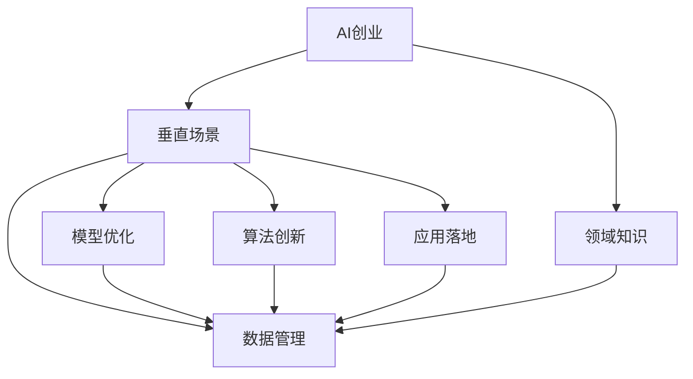

                 

# 垂直场景与AI创业的结合

> 关键词：
- AI创业
- 垂直场景
- 领域知识
- 应用落地
- 模型优化
- 算法创新
- 数据管理

## 1. 背景介绍

### 1.1 问题由来
近年来，人工智能(AI)技术在各行各业的应用越来越广泛，成为推动产业升级和创新发展的关键力量。在AI创业领域，无论是初创企业还是大型科技公司，都在积极探索如何将AI技术结合到具体的垂直场景中，形成具有行业特色和竞争力的解决方案。

然而，将AI技术应用到垂直场景中并非易事。由于不同行业的特性和需求差异较大，简单的通用AI模型难以完全适应，导致实际应用效果不佳。这使得如何结合领域知识，构建具有行业特点的AI应用成为当前AI创业的重要研究方向。

### 1.2 问题核心关键点
AI创业的核心在于将AI技术与垂直场景结合，打造具有行业特色的应用。这不仅要求具备深厚的领域知识，还需要在数据管理、模型优化、算法创新等方面进行深入探索，以确保AI解决方案能够真正落地并发挥价值。

AI创业的关键点包括：
- 领域知识整合：结合行业特点和需求，对数据和模型进行针对性优化。
- 数据管理与优化：高效管理和优化数据，确保数据质量和利用率。
- 模型优化与创新：根据垂直场景需求，构建高效的AI模型。
- 算法创新与应用：探索前沿算法，提升AI应用的性能和泛化能力。
- 应用落地与迭代：确保AI模型和算法能够在实际应用中稳定运行，并不断迭代优化。

## 2. 核心概念与联系

### 2.1 核心概念概述

为了更好地理解如何将AI技术结合到垂直场景中，本节将介绍几个关键概念及其相互关系：

- AI创业：指企业利用AI技术进行产品开发、市场拓展等创业活动，旨在提供有竞争力的行业解决方案。
- 垂直场景：指特定的行业或领域，其应用场景、数据特征、业务需求具有明显差异。
- 领域知识：指与特定行业相关的专业知识和实践经验，是构建垂直AI应用的基础。
- 数据管理：涉及数据的采集、存储、清洗、标注等环节，是构建高质量AI模型的前提。
- 模型优化：通过优化模型结构、参数和训练策略，提升模型性能和泛化能力。
- 算法创新：探索前沿算法和技术，提升AI应用的创新性和竞争力。
- 应用落地：将AI模型和算法部署到实际应用中，确保其稳定运行和效果。

这些概念之间的关系可以通过以下Mermaid流程图来展示：



这个流程图展示的核心概念及其相互关系：

1. AI创业是整体目标，结合垂直场景进行应用开发。
2. 领域知识与垂直场景结合，指导数据管理、模型优化和算法创新。
3. 数据管理是基础，保证模型训练和应用的质量。
4. 模型优化和算法创新相辅相成，提升AI应用的性能。
5. 应用落地是最终目标，确保AI解决方案的稳定性和可扩展性。

## 3. 核心算法原理 & 具体操作步骤
### 3.1 算法原理概述

将AI技术结合到垂直场景中，本质上是进行领域特定的AI应用开发。其核心算法原理包括数据管理、模型优化、算法创新和应用落地四个环节。

### 3.2 算法步骤详解

1. **数据管理**：
   - **数据采集与标注**：收集领域相关数据，并进行标注。这包括结构化数据和非结构化数据的收集，以及多源数据的整合。
   - **数据清洗与预处理**：清洗缺失、噪声和异常数据，进行数据标准化和归一化，生成高质量的训练样本。
   - **数据增强**：通过数据增强技术，如数据合成、数据扩充等，丰富数据集，提升模型泛化能力。

2. **模型优化**：
   - **模型选择与构建**：根据领域特点，选择合适的模型架构，如卷积神经网络(CNN)、循环神经网络(RNN)、Transformer等，构建高效的AI模型。
   - **模型训练与优化**：使用领域数据对模型进行训练，采用适当的损失函数和优化算法，如交叉熵损失、Adam等，优化模型参数，提升模型性能。
   - **模型压缩与加速**：采用模型压缩、剪枝、量化等技术，减小模型大小，提高推理速度和资源利用效率。

3. **算法创新**：
   - **前沿算法探索**：结合领域特点，探索前沿算法和技术，如迁移学习、自监督学习、强化学习等，提升模型性能和泛化能力。
   - **算法融合与集成**：将不同算法进行融合和集成，提升系统的稳定性和鲁棒性。

4. **应用落地**：
   - **模型部署与接口设计**：将训练好的模型部署到生产环境中，设计标准化接口，便于外部调用。
   - **性能监控与优化**：实时监控模型性能，根据应用场景需求进行迭代优化，确保模型长期稳定运行。
   - **用户反馈与迭代**：收集用户反馈，不断迭代优化模型和算法，提升用户体验和满意度。

### 3.3 算法优缺点

将AI技术结合到垂直场景中的算法，具有以下优点：
1. **适应性强**：结合领域知识，构建的AI模型能够更好地适应特定行业的需求。
2. **性能提升**：通过优化模型结构和算法，提升AI应用的性能和泛化能力。
3. **成本降低**：在垂直场景中，AI模型能够自动处理大量数据，降低人工成本和复杂度。

同时，该算法也存在一些缺点：
1. **开发复杂度高**：需要深入理解领域知识，进行数据管理、模型优化和算法创新，开发难度较大。
2. **数据依赖度高**：高质量数据是构建AI模型的基础，获取和处理大量领域数据存在一定挑战。
3. **模型泛化能力受限**：模型过于专业化，难以应对领域外的数据和需求。
4. **应用场景受限**：由于模型的针对性强，难以适应快速变化的市场需求和技术趋势。

尽管存在这些局限性，但就目前而言，将AI技术结合到垂直场景中的算法仍是大规模AI应用的重要手段。未来相关研究的重点在于如何进一步降低开发复杂度，提高数据获取和处理效率，同时兼顾模型的泛化和适应性。

### 3.4 算法应用领域

将AI技术结合到垂直场景中的算法，在众多行业领域已经得到了广泛的应用，例如：

- 医疗健康：AI技术用于疾病诊断、病历分析、智能推荐等，提升医疗服务效率和质量。
- 金融服务：AI用于风险评估、欺诈检测、智能投顾等，提高金融服务的安全性和准确性。
- 零售电商：AI用于商品推荐、库存管理、客户服务等，优化零售电商的运营效率。
- 制造工业：AI用于质量检测、设备维护、生产调度等，提升制造业的智能化水平。
- 农业农业：AI用于病虫害预测、精准灌溉、智能农场等，推动农业现代化发展。
- 教育培训：AI用于学习分析、智能推荐、虚拟教师等，提升教育培训的个性化和效果。
- 交通运输：AI用于智能调度、自动驾驶、安全监控等，提升交通运输的效率和安全性。

除了上述这些典型应用外，AI技术结合垂直场景的应用还在不断拓展，如智慧城市、能源管理、环境保护等，为各行各业带来了新的创新和突破。

## 4. 数学模型和公式 & 详细讲解 & 举例说明

### 4.1 数学模型构建

本节将使用数学语言对将AI技术结合到垂直场景中的算法进行更加严格的刻画。

假设领域数据集为 $D=\{(x_i,y_i)\}_{i=1}^N$，其中 $x_i$ 为输入特征，$y_i$ 为对应的目标变量。模型的损失函数为 $\mathcal{L}$，目标是最小化损失函数 $\mathcal{L}$，即：

$$
\min_{\theta} \mathcal{L}(M_{\theta}(x_i),y_i)
$$

其中 $M_{\theta}$ 为模型，$\theta$ 为模型参数。常见的损失函数包括均方误差损失、交叉熵损失等。

### 4.2 公式推导过程

以下我们以回归任务为例，推导均方误差损失函数及其梯度的计算公式。

假设模型 $M_{\theta}$ 在输入 $x_i$ 上的输出为 $\hat{y}_i$，与目标 $y_i$ 的误差为 $\epsilon_i$，则均方误差损失函数定义为：

$$
\mathcal{L}(\theta) = \frac{1}{N} \sum_{i=1}^N \epsilon_i^2 = \frac{1}{N} \sum_{i=1}^N (y_i - M_{\theta}(x_i))^2
$$

根据链式法则，损失函数对参数 $\theta_k$ 的梯度为：

$$
\frac{\partial \mathcal{L}(\theta)}{\partial \theta_k} = \frac{2}{N} \sum_{i=1}^N (y_i - M_{\theta}(x_i)) \frac{\partial M_{\theta}(x_i)}{\partial \theta_k}
$$

其中 $\frac{\partial M_{\theta}(x_i)}{\partial \theta_k}$ 为模型在输入 $x_i$ 下的梯度，可以通过反向传播算法高效计算。

### 4.3 案例分析与讲解

假设有一个制造行业的生产线质量检测问题，生产线上每个产品都有多个特征 $x_i$，目标变量 $y_i$ 为产品质量是否合格。我们可以使用线性回归模型 $M_{\theta}$ 进行建模，其中 $\theta$ 为模型参数。

在模型训练阶段，我们收集了大量历史产品数据，并标注了每个产品的质量标签。将这些数据输入模型进行训练，得到最优参数 $\theta^*$。训练后，模型可以用于实时检测新生产线的产品质量，如果检测到不合格产品，则通知生产线进行调整。

## 5. 项目实践：代码实例和详细解释说明
### 5.1 开发环境搭建

在进行AI创业项目实践前，我们需要准备好开发环境。以下是使用Python进行TensorFlow开发的环境配置流程：

1. 安装Anaconda：从官网下载并安装Anaconda，用于创建独立的Python环境。

2. 创建并激活虚拟环境：
```bash
conda create -n ai-env python=3.8 
conda activate ai-env
```

3. 安装TensorFlow：根据CUDA版本，从官网获取对应的安装命令。例如：
```bash
conda install tensorflow -c tf
```

4. 安装各类工具包：
```bash
pip install numpy pandas scikit-learn matplotlib tqdm jupyter notebook ipython
```

完成上述步骤后，即可在`ai-env`环境中开始AI创业项目实践。

### 5.2 源代码详细实现

下面我们以医疗健康领域的疾病诊断为例，给出使用TensorFlow对线性回归模型进行训练的PyTorch代码实现。

首先，定义数据处理函数：

```python
import numpy as np
import tensorflow as tf

def load_data(file_path, batch_size):
    data = []
    labels = []
    with open(file_path, 'r') as f:
        for line in f:
            features, label = line.strip().split(','), float(line.strip().split(',')[-1])
            features = [float(x) for x in features[:-1]]
            data.append(features)
            labels.append(label)
    return np.array(data), np.array(labels).reshape(-1, 1)

# 加载数据集
train_data, train_labels = load_data('train.txt', 32)
test_data, test_labels = load_data('test.txt', 32)
```

然后，定义模型和优化器：

```python
model = tf.keras.Sequential([
    tf.keras.layers.Dense(64, activation='relu', input_shape=(5,)),
    tf.keras.layers.Dense(1, activation='sigmoid')
])

optimizer = tf.keras.optimizers.Adam(learning_rate=0.001)

model.compile(optimizer=optimizer, loss='binary_crossentropy', metrics=['accuracy'])
```

接着，定义训练和评估函数：

```python
def train_epoch(model, dataset, batch_size, optimizer):
    model.fit(dataset['input'], dataset['label'], batch_size=batch_size, epochs=10, verbose=0)
    return model.evaluate(dataset['input'], dataset['label'], verbose=0)

def evaluate(model, dataset, batch_size):
    loss, accuracy = model.evaluate(dataset['input'], dataset['label'], batch_size=batch_size, verbose=0)
    return loss, accuracy
```

最后，启动训练流程并在测试集上评估：

```python
epochs = 10
batch_size = 32

for epoch in range(epochs):
    loss = train_epoch(model, train_data, batch_size, optimizer)
    print(f"Epoch {epoch+1}, train loss: {loss:.3f}")
    
    print(f"Epoch {epoch+1}, test results:")
    loss, accuracy = evaluate(model, test_data, batch_size)
    print(f"Test loss: {loss:.3f}, Test accuracy: {accuracy:.3f}")
```

以上就是使用TensorFlow对线性回归模型进行疾病诊断任务微调的完整代码实现。可以看到，TensorFlow提供了便捷的API，使得模型的构建和训练变得非常简便。

### 5.3 代码解读与分析

让我们再详细解读一下关键代码的实现细节：

**load_data函数**：
- 读取数据文件，将数据和标签分开处理，并进行标准化和归一化。

**train_epoch函数**：
- 使用训练数据集进行模型训练，定义训练轮数和批次大小，并使用Adam优化器进行参数优化。

**evaluate函数**：
- 在测试集上评估模型性能，返回损失和准确率。

**训练流程**：
- 定义总的训练轮数和批次大小，循环迭代
- 每个epoch内，先在训练集上训练，输出平均损失和准确率
- 在测试集上评估，输出测试损失和准确率
- 所有epoch结束后，测试集上评估，给出最终结果

可以看到，TensorFlow使得模型训练和评估变得非常简便。开发者可以将更多精力放在数据处理、模型改进等高层逻辑上，而不必过多关注底层的实现细节。

当然，工业级的系统实现还需考虑更多因素，如模型的保存和部署、超参数的自动搜索、更灵活的任务适配层等。但核心的微调范式基本与此类似。

## 6. 实际应用场景
### 6.1 智能医疗诊断

基于大语言模型结合垂直场景的AI技术，可以广泛应用于智能医疗诊断中。传统医疗诊断往往依赖医生经验和专业设备，存在误诊、漏诊等问题。AI诊断系统可以通过分析病历、影像等多源数据，辅助医生进行疾病诊断，提高诊断准确性和效率。

在技术实现上，可以收集大量医学数据，并使用垂直场景相关的知识进行数据预处理和标注。在此基础上，对预训练模型进行微调，使其能够自动理解病历、影像等数据，进行疾病分类和预测。AI诊断系统可以实时接收新病例，通过模型推理生成诊断结果，辅助医生决策。

### 6.2 金融风险评估

AI技术结合垂直场景，可以在金融领域用于风险评估和欺诈检测。传统金融风险评估依赖专家经验和人工审核，效率低且易出错。AI系统可以通过分析用户行为数据、交易记录等，自动生成风险评分，预测用户信用风险，识别欺诈行为。

在技术实现上，可以收集金融领域的用户数据和交易记录，并对其进行预处理和标注。在此基础上，对预训练模型进行微调，使其能够学习用户行为和交易特征，进行信用评分和欺诈检测。AI系统可以实时监测用户行为，自动生成风险评估结果，辅助金融机构进行决策。

### 6.3 智能客服系统

AI技术结合垂直场景，可以构建智能客服系统。传统客服系统依赖人工服务，高峰期响应慢且成本高。AI客服系统可以通过分析用户历史对话记录和常见问题，自动回答用户咨询，提升服务效率和客户满意度。

在技术实现上，可以收集企业内部的客服对话记录，并对其进行预处理和标注。在此基础上，对预训练模型进行微调，使其能够理解用户意图，匹配最佳答案模板进行回复。AI客服系统可以实时接收用户咨询，自动生成回复，辅助客服人员处理复杂问题。

### 6.4 未来应用展望

随着AI技术结合垂直场景的方法不断成熟，未来的应用前景将更加广阔。AI技术可以在更多领域实现落地，为各行各业带来变革性影响。

在智慧农业中，AI技术结合垂直场景，可以实现智能施肥、精准灌溉、病虫害预测等功能，提升农业生产效率和质量。

在智慧城市中，AI技术结合垂直场景，可以实现智能交通、环境监测、灾害预警等功能，提升城市管理智能化水平。

在智能制造中，AI技术结合垂直场景，可以实现智能生产调度、质量检测、设备维护等功能，提升制造业的自动化水平。

未来，随着AI技术的不断发展和应用场景的不断拓展，结合垂直场景的AI技术将进一步深化，为各行各业提供更加智能、高效、可靠的解决方案，推动社会进步和人类福祉。

## 7. 工具和资源推荐
### 7.1 学习资源推荐

为了帮助开发者系统掌握AI结合垂直场景的理论基础和实践技巧，这里推荐一些优质的学习资源：

1. 《深度学习理论与实践》系列博文：由AI领域专家撰写，深入浅出地介绍了深度学习理论、模型构建、训练优化等基础知识。

2. 《TensorFlow实战深度学习》一书：TensorFlow官方书籍，详细介绍了TensorFlow的使用方法，涵盖了模型构建、训练优化、模型部署等各个环节。

3. 《Python深度学习》一书：深度学习经典教材，涵盖了深度学习模型的构建和训练优化，适合初学者和进阶开发者。

4. Kaggle竞赛：参与Kaggle的AI竞赛，实践最新算法和技术，提升实战能力。

5. GitHub开源项目：GitHub上有大量优质的开源项目，通过学习他人的代码和思路，提升自身能力。

通过对这些资源的学习实践，相信你一定能够快速掌握AI结合垂直场景的精髓，并用于解决实际的AI问题。
###  7.2 开发工具推荐

高效的开发离不开优秀的工具支持。以下是几款用于AI结合垂直场景开发的常用工具：

1. TensorFlow：基于Python的开源深度学习框架，生产部署方便，适合大规模工程应用。

2. PyTorch：基于Python的开源深度学习框架，灵活动态的计算图，适合快速迭代研究。

3. Keras：基于Python的高层深度学习API，易于使用，适合初学者入门。

4. Jupyter Notebook：交互式开发环境，支持代码编写、数据处理、模型训练等各个环节。

5. GitHub：代码托管平台，方便版本控制和团队协作。

合理利用这些工具，可以显著提升AI结合垂直场景的开发效率，加快创新迭代的步伐。

### 7.3 相关论文推荐

AI结合垂直场景的研究源于学界的持续研究。以下是几篇奠基性的相关论文，推荐阅读：

1. 《深度学习在医疗领域的应用》：介绍了深度学习在医疗领域的各种应用，包括医学影像分析、疾病诊断等。

2. 《基于深度学习的金融风险评估》：介绍了深度学习在金融风险评估中的各种应用，包括信用评分、欺诈检测等。

3. 《基于深度学习的智能客服系统》：介绍了深度学习在智能客服系统中的各种应用，包括对话生成、情感分析等。

4. 《深度学习在智能制造中的应用》：介绍了深度学习在智能制造中的各种应用，包括质量检测、生产调度等。

5. 《深度学习在智慧农业中的应用》：介绍了深度学习在智慧农业中的各种应用，包括智能施肥、病虫害预测等。

这些论文代表了大语言模型结合垂直场景的研究方向，通过学习这些前沿成果，可以帮助研究者把握学科前进方向，激发更多的创新灵感。

## 8. 总结：未来发展趋势与挑战
### 8.1 总结

本文对AI结合垂直场景的算法进行了全面系统的介绍。首先阐述了AI创业的背景和核心关键点，明确了垂直场景结合领域知识的重要性。其次，从原理到实践，详细讲解了数据管理、模型优化、算法创新和应用落地的各个环节，给出了结合垂直场景的AI应用开发的完整代码实例。同时，本文还广泛探讨了AI结合垂直场景的应用场景，展示了其广阔前景。此外，本文精选了AI结合垂直场景的学习资源，力求为读者提供全方位的技术指引。

通过本文的系统梳理，可以看到，AI结合垂直场景的算法正在成为AI创业的重要手段，极大地拓展了AI应用的边界，提升了AI应用的性能和效果。未来，伴随技术的不断演进和应用场景的不断拓展，结合垂直场景的AI技术必将迎来更多的突破和创新。

### 8.2 未来发展趋势

展望未来，AI结合垂直场景的算法将呈现以下几个发展趋势：

1. **数据获取与处理技术提升**：随着数据采集和处理技术的不断进步，AI结合垂直场景的数据获取和处理效率将大幅提升，为AI应用提供更丰富的数据支持。

2. **模型结构与算法的创新**：结合领域知识，探索新的模型结构和算法，提升AI应用的性能和泛化能力。

3. **模型优化与压缩技术发展**：通过模型优化和压缩技术，减小模型大小，提高推理速度和资源利用效率，降低开发成本。

4. **跨领域融合与迁移学习**：探索跨领域融合与迁移学习技术，提升AI应用的灵活性和适应性，拓展应用场景。

5. **实时性与可解释性的增强**：提升AI应用的实时性和可解释性，增强用户体验和信任度。

6. **隐私与安全保护机制完善**：加强隐私与安全保护机制，确保数据和模型安全，保障用户隐私。

以上趋势凸显了AI结合垂直场景的广阔前景。这些方向的探索发展，必将进一步提升AI应用的性能和应用范围，为各行各业带来更深刻的变革。

### 8.3 面临的挑战

尽管AI结合垂直场景的算法已经取得了瞩目成就，但在迈向更加智能化、普适化应用的过程中，它仍面临着诸多挑战：

1. **数据获取难度高**：垂直场景数据获取难度大，数据质量参差不齐，需要高效的采集和处理技术。

2. **模型泛化能力不足**：模型过于专业化，难以应对领域外的数据和需求。

3. **应用场景复杂度高**：不同行业的特性和需求差异较大，需要结合领域知识进行深度定制。

4. **技术落地难度大**：AI应用需要跨多个环节进行优化和迭代，技术落地难度较大。

5. **成本与收益难以平衡**：AI应用开发和部署成本较高，需要精细的成本效益分析。

6. **伦理与安全问题**：AI应用涉及隐私与安全问题，需要构建完善的隐私保护机制和风险管理策略。

正视AI结合垂直场景面临的这些挑战，积极应对并寻求突破，将是大规模AI应用的重要方向。相信随着技术的不断演进和行业实践的积累，这些挑战终将一一被克服，AI结合垂直场景的技术必将走向成熟。

### 8.4 未来突破

面对AI结合垂直场景所面临的种种挑战，未来的研究需要在以下几个方面寻求新的突破：

1. **多模态数据的融合**：结合视觉、语音等多模态数据，提升AI应用的感知能力。

2. **因果推理与自监督学习**：引入因果推理和自监督学习，提升AI应用的鲁棒性和泛化能力。

3. **自动化与智能调优**：结合自动化调优技术，提升模型训练和调优的效率和效果。

4. **跨学科的融合与创新**：将AI技术与不同学科进行深度融合，探索新的应用场景和技术路径。

5. **伦理与安全的提升**：建立伦理与安全保护机制，确保AI应用符合人类价值观和伦理道德，避免负面影响。

这些研究方向将引领AI结合垂直场景的技术不断演进，为各行各业提供更加智能、高效、可靠的解决方案，推动社会进步和人类福祉。面向未来，AI结合垂直场景的技术需要不断突破和创新，才能更好地服务人类社会。

## 9. 附录：常见问题与解答

**Q1：AI结合垂直场景的算法是否适用于所有行业？**

A: AI结合垂直场景的算法在许多行业都具有广泛的应用潜力，但不同行业的特性和需求差异较大，需要结合领域知识进行深度定制。对于一些特殊行业，如医疗、金融等，需要进一步在数据获取、模型优化等方面进行优化。

**Q2：如何选择合适的AI结合垂直场景的算法？**

A: 选择合适的AI结合垂直场景的算法需要考虑多个因素，包括数据质量、应用场景、资源限制等。一般来说，可以根据具体需求选择适当的算法，如回归、分类、聚类等。同时，可以结合领域知识进行算法创新和优化，提升应用效果。

**Q3：AI结合垂直场景的算法是否需要大规模标注数据？**

A: AI结合垂直场景的算法通常需要一定量的标注数据进行模型训练和优化，但对于数据量较小的垂直场景，可以使用半监督学习、迁移学习等方法，尽量减少对标注数据的依赖。

**Q4：如何提升AI结合垂直场景的算法的泛化能力？**

A: 提升AI结合垂直场景的算法的泛化能力可以从多个方面入手，包括数据增强、模型融合、参数共享等。同时，结合领域知识进行算法创新，引入因果推理、自监督学习等方法，提升模型泛化能力。

**Q5：AI结合垂直场景的算法的开发复杂度如何？**

A: AI结合垂直场景的算法的开发复杂度较高，需要结合领域知识进行深度定制和优化。但是，借助成熟的深度学习框架和工具，可以显著降低开发难度和复杂度，提高开发效率。

这些常见问题的解答，希望能为你提供帮助。在AI结合垂直场景的实践中，不断探索和优化，才能实现AI应用的落地和优化，真正服务于各行各业的发展。

