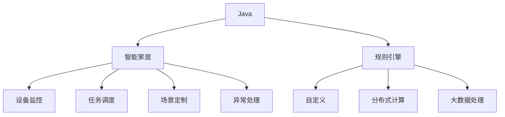

                 

# 基于Java的智能家居设计：使用Java为智能家居编写自定义规则引擎

> 关键词：Java, 智能家居, 规则引擎, 自定义, 设计, 数据处理, 自动化控制

## 1. 背景介绍

### 1.1 问题由来

智能家居技术近年来迅猛发展，通过将家庭各个设备互联互通，实现了远程控制、环境监控、安全防护等功能。然而，由于智能家居系统的复杂性和多样性，如何有效地管理和协调各种设备间的交互，成为一个亟待解决的问题。

传统的智能家居系统依赖于集中式的中央控制平台，通过统一的命令和协议，将各种设备连接起来。但这种方式存在系统耦合度高、扩展性差、易受单一故障影响等缺点。为了提升智能家居系统的灵活性和可维护性，开发分布式、自主的智能家居系统变得非常必要。

此外，随着物联网设备的不断增多，数据量呈指数级增长，如何高效处理海量数据，提取有价值的信息，成为智能家居系统中另一个重要挑战。传统的集中式存储和计算方法难以满足需求，分布式数据处理和计算成为大势所趋。

### 1.2 问题核心关键点

开发分布式、自主的智能家居系统，需要构建高效的数据处理和自动化控制机制。其中，使用Java编写自定义规则引擎，成为实现这一目标的关键技术手段。

规则引擎是一种基于规则的决策系统，能够根据预先定义的规则，自动处理数据和触发动作。在智能家居系统中，规则引擎可以用于：

- 设备监控：根据预设规则，自动监控设备状态，及时发现异常。
- 任务调度：自动执行预设任务，如定时开关灯、控制家电等。
- 场景定制：根据用户需求和环境变化，自动调整设备状态。
- 异常处理：自动处理突发事件，如火灾报警、水浸报警等。

通过使用Java编写自定义规则引擎，可以实现智能家居系统的自主化、智能化和自动化，提升用户的生活质量和便利性。

## 2. 核心概念与联系

### 2.1 核心概念概述

为更好地理解基于Java的智能家居自定义规则引擎，本节将介绍几个密切相关的核心概念：

- **Java**：一种广泛使用的面向对象编程语言，以其跨平台性、安全性、高性能等特性著称，适用于各种企业级应用开发。

- **智能家居**：通过物联网技术将家庭中的各种设备互联互通，实现远程控制、环境监控、安全防护等功能，提升居住的舒适度和安全性。

- **规则引擎**：一种基于规则的决策系统，能够根据预先定义的规则，自动处理数据和触发动作。广泛应用于金融、医疗、电商等领域，辅助决策和管理。

- **自定义规则引擎**：根据具体应用需求，灵活定义和应用规则的规则引擎。与商业化规则引擎相比，更具有针对性和灵活性。

- **分布式计算**：将计算任务分配到多个计算节点上，通过并行处理提升计算效率和系统稳定性。适用于大规模数据处理和复杂任务调度。

- **大数据处理**：针对海量数据的存储、处理、分析和应用，提供高效的技术手段和解决方案。

这些核心概念之间的逻辑关系可以通过以下Mermaid流程图来展示：



这个流程图展示了她主要概念及其之间的关系：

1. Java是智能家居系统的主要编程语言。
2. 规则引擎是智能家居系统中的关键组件，用于数据处理和决策。
3. 自定义规则引擎根据具体需求，灵活定义和应用规则。
4. 分布式计算和大数据处理提升规则引擎的计算效率和系统稳定性。
5. 设备监控、任务调度、场景定制和异常处理是智能家居系统中常见的应用场景。

## 3. 核心算法原理 & 具体操作步骤

### 3.1 算法原理概述

基于Java的智能家居自定义规则引擎，本质上是一个基于规则的决策系统。其核心思想是：通过预先定义的规则集，自动处理输入数据，触发相应的动作。

在智能家居系统中，规则引擎通常由以下几个部分组成：

- **规则定义模块**：定义和维护规则集合，包括规则的描述、触发条件、动作指令等。
- **规则推理模块**：根据输入数据，推理出符合条件的规则，并执行相应的动作。
- **数据存储模块**：存储和查询输入数据，提供数据源支持。
- **动作执行模块**：根据规则动作指令，执行相应的设备控制、数据处理等操作。

通过Java编写自定义规则引擎，可以实现上述功能的模块化设计和灵活应用。具体步骤如下：

1. **定义规则**：根据智能家居系统的需求，定义规则集合，包括规则的描述、触发条件、动作指令等。
2. **实现推理引擎**：根据规则描述，设计推理算法，实现规则匹配和动作执行。
3. **集成数据源**：将规则引擎与数据源集成，如传感器数据、设备状态等，提供输入数据支持。
4. **部署和监控**：将规则引擎部署到目标设备上，并设置监控机制，确保其正常运行。

### 3.2 算法步骤详解

以下详细介绍基于Java的智能家居自定义规则引擎的设计和实现步骤：

**Step 1: 定义规则**

规则定义是规则引擎的第一步，需要根据智能家居系统的需求，明确规则的目标、条件和动作。规则通常包括以下几个要素：

- **规则编号**：唯一标识规则，便于管理。
- **规则描述**：简要描述规则的功能和作用。
- **触发条件**：定义规则的触发条件，如传感器状态、时间等。
- **动作指令**：定义规则的动作指令，如设备控制、数据处理等。

例如，定义一条规则如下：

```java
public class Rule {
    private int id;
    private String description;
    private String condition;
    private String action;
    
    public Rule(int id, String description, String condition, String action) {
        this.id = id;
        this.description = description;
        this.condition = condition;
        this.action = action;
    }
    
    // getters and setters
}
```

**Step 2: 实现推理引擎**

规则引擎的推理过程，通常包括以下几个步骤：

1. **输入数据解析**：将输入数据解析为规则引擎可以处理的形式。
2. **规则匹配**：根据输入数据，匹配符合条件的规则。
3. **规则执行**：根据匹配规则的动作指令，执行相应的动作。

例如，实现一个简单的推理引擎：

```java
public class RuleEngine {
    private List<Rule> rules;
    
    public RuleEngine(List<Rule> rules) {
        this.rules = rules;
    }
    
    public void processInput(String input) {
        // 解析输入数据
        String[] data = input.split(",");
        
        // 匹配规则
        for (Rule rule : rules) {
            if (ruleConditionMatch(rule, data)) {
                // 执行动作
                executeAction(rule, data);
                break;
            }
        }
    }
    
    private boolean ruleConditionMatch(Rule rule, String[] data) {
        // 根据规则条件，解析输入数据
        String[] ruleData = rule.getCondition().split(",");
        
        // 判断是否匹配
        // ...
    }
    
    private void executeAction(Rule rule, String[] data) {
        // 根据规则动作，执行相应的操作
        // ...
    }
}
```

**Step 3: 集成数据源**

规则引擎需要从各种数据源中获取输入数据，如传感器数据、设备状态等。通过集成数据源，规则引擎可以实现实时监控和数据处理。

例如，集成一个温度传感器：

```java
public class TemperatureSensor {
    private String id;
    private double temperature;
    
    public TemperatureSensor(String id, double temperature) {
        this.id = id;
        this.temperature = temperature;
    }
    
    public double getTemperature() {
        return temperature;
    }
}
```

**Step 4: 部署和监控**

将规则引擎部署到目标设备上，并设置监控机制，确保其正常运行。

例如，使用Spring Boot框架实现规则引擎的部署和监控：

```java
@SpringBootApplication
public class RuleEngineApplication {
    public static void main(String[] args) {
        SpringApplication.run(RuleEngineApplication.class, args);
        
        // 启动规则引擎
        RuleEngine ruleEngine = new RuleEngine(List.of(new Rule(1, "检测室温", "温度>30", "打开空调"), ...));
        ruleEngine.start();
        
        // 设置监控机制
        // ...
    }
}
```

通过以上步骤，即可实现基于Java的智能家居自定义规则引擎的设计和部署。

### 3.3 算法优缺点

基于Java的智能家居自定义规则引擎，具有以下优点：

1. **灵活性高**：根据具体需求，灵活定义和应用规则，增强系统的可维护性和扩展性。
2. **跨平台性好**：Java作为通用编程语言，具有跨平台性，适用于各种设备和服务器的部署。
3. **安全性高**：Java提供了丰富的安全机制，如沙箱、加密等，保障系统的安全性。
4. **性能优越**：Java具有良好的性能和可扩展性，支持大规模数据处理和复杂任务调度。

同时，该方法也存在以下局限性：

1. **开发成本高**：Java的开发成本相对较高，需要掌握复杂的技术栈和开发工具。
2. **学习曲线陡**：Java的语法和架构相对复杂，新手入门需要一定时间。
3. **部署复杂**：Java应用的部署需要配置复杂的类路径、依赖库等，对系统运维要求较高。

尽管存在这些局限性，但就目前而言，Java仍然是大规模企业级应用的首选语言，其在智能家居系统中同样具有广泛的应用前景。

### 3.4 算法应用领域

基于Java的智能家居自定义规则引擎，在多个领域得到广泛应用，例如：

- **智能家居控制**：根据用户需求和环境变化，自动调整设备状态，提升居住舒适度。
- **安防监控**：自动监控设备状态，及时发现异常，保障家庭安全。
- **能效管理**：自动控制设备运行，优化能源使用，降低能耗成本。
- **健康管理**：通过传感器数据，实时监测健康指标，提供个性化建议。
- **智能照明**：根据环境变化，自动调整灯光亮度和颜色，提升生活质量。

除了上述这些经典应用外，规则引擎还被创新性地应用于更多场景中，如智能家居集成、场景定制、设备互联等，为智能家居系统的智能化、自动化、自主化提供了有力支持。

## 4. 数学模型和公式 & 详细讲解 & 举例说明

### 4.1 数学模型构建

基于Java的智能家居自定义规则引擎，本质上是一个基于规则的决策系统。其核心思想是：通过预先定义的规则集，自动处理输入数据，触发相应的动作。

在智能家居系统中，规则引擎通常由以下几个部分组成：

- **规则定义模块**：定义和维护规则集合，包括规则的描述、触发条件、动作指令等。
- **规则推理模块**：根据输入数据，推理出符合条件的规则，并执行相应的动作。
- **数据存储模块**：存储和查询输入数据，提供数据源支持。
- **动作执行模块**：根据规则动作指令，执行相应的设备控制、数据处理等操作。

通过Java编写自定义规则引擎，可以实现上述功能的模块化设计和灵活应用。具体步骤如下：

1. **定义规则**：根据智能家居系统的需求，定义规则集合，包括规则的描述、触发条件、动作指令等。
2. **实现推理引擎**：根据规则描述，设计推理算法，实现规则匹配和动作执行。
3. **集成数据源**：将规则引擎与数据源集成，如传感器数据、设备状态等，提供输入数据支持。
4. **部署和监控**：将规则引擎部署到目标设备上，并设置监控机制，确保其正常运行。

### 4.2 公式推导过程

以下详细介绍基于Java的智能家居自定义规则引擎的设计和实现步骤：

**Step 1: 定义规则**

规则定义是规则引擎的第一步，需要根据智能家居系统的需求，明确规则的目标、条件和动作。规则通常包括以下几个要素：

- **规则编号**：唯一标识规则，便于管理。
- **规则描述**：简要描述规则的功能和作用。
- **触发条件**：定义规则的触发条件，如传感器状态、时间等。
- **动作指令**：定义规则的动作指令，如设备控制、数据处理等。

例如，定义一条规则如下：

```java
public class Rule {
    private int id;
    private String description;
    private String condition;
    private String action;
    
    public Rule(int id, String description, String condition, String action) {
        this.id = id;
        this.description = description;
        this.condition = condition;
        this.action = action;
    }
    
    // getters and setters
}
```

**Step 2: 实现推理引擎**

规则引擎的推理过程，通常包括以下几个步骤：

1. **输入数据解析**：将输入数据解析为规则引擎可以处理的形式。
2. **规则匹配**：根据输入数据，匹配符合条件的规则。
3. **规则执行**：根据匹配规则的动作指令，执行相应的动作。

例如，实现一个简单的推理引擎：

```java
public class RuleEngine {
    private List<Rule> rules;
    
    public RuleEngine(List<Rule> rules) {
        this.rules = rules;
    }
    
    public void processInput(String input) {
        // 解析输入数据
        String[] data = input.split(",");
        
        // 匹配规则
        for (Rule rule : rules) {
            if (ruleConditionMatch(rule, data)) {
                // 执行动作
                executeAction(rule, data);
                break;
            }
        }
    }
    
    private boolean ruleConditionMatch(Rule rule, String[] data) {
        // 根据规则条件，解析输入数据
        String[] ruleData = rule.getCondition().split(",");
        
        // 判断是否匹配
        // ...
    }
    
    private void executeAction(Rule rule, String[] data) {
        // 根据规则动作，执行相应的操作
        // ...
    }
}
```

**Step 3: 集成数据源**

规则引擎需要从各种数据源中获取输入数据，如传感器数据、设备状态等。通过集成数据源，规则引擎可以实现实时监控和数据处理。

例如，集成一个温度传感器：

```java
public class TemperatureSensor {
    private String id;
    private double temperature;
    
    public TemperatureSensor(String id, double temperature) {
        this.id = id;
        this.temperature = temperature;
    }
    
    public double getTemperature() {
        return temperature;
    }
}
```

**Step 4: 部署和监控**

将规则引擎部署到目标设备上，并设置监控机制，确保其正常运行。

例如，使用Spring Boot框架实现规则引擎的部署和监控：

```java
@SpringBootApplication
public class RuleEngineApplication {
    public static void main(String[] args) {
        SpringApplication.run(RuleEngineApplication.class, args);
        
        // 启动规则引擎
        RuleEngine ruleEngine = new RuleEngine(List.of(new Rule(1, "检测室温", "温度>30", "打开空调"), ...));
        ruleEngine.start();
        
        // 设置监控机制
        // ...
    }
}
```

通过以上步骤，即可实现基于Java的智能家居自定义规则引擎的设计和部署。

### 4.3 案例分析与讲解

以下详细介绍基于Java的智能家居自定义规则引擎的实际应用案例：

**案例1: 智能照明**

智能照明系统通过传感器和灯光控制设备，实现房间亮度的自动调节。用户可以设置不同场景下的亮度偏好，规则引擎根据传感器数据和用户偏好，自动调整灯光亮度。

例如，定义规则如下：

```java
public class LightingRule {
    private String scene;
    private double brightness;
    
    public LightingRule(String scene, double brightness) {
        this.scene = scene;
        this.brightness = brightness;
    }
    
    public double getBrightness() {
        return brightness;
    }
}
```

规则引擎根据传感器数据和用户偏好，自动调整灯光亮度。例如，当用户设定“晚归”场景时，规则引擎根据传感器数据判断是否为夜间，并自动调高灯光亮度。

```java
public class LightingControl {
    private List<LightingRule> rules;
    
    public LightingControl(List<LightingRule> rules) {
        this.rules = rules;
    }
    
    public void processInput(String input) {
        // 解析输入数据
        String[] data = input.split(",");
        
        // 匹配规则
        for (LightingRule rule : rules) {
            if (ruleSceneMatch(rule, data)) {
                // 执行动作
                executeAction(rule, data);
                break;
            }
        }
    }
    
    private boolean ruleSceneMatch(LightingRule rule, String[] data) {
        // 根据场景，解析输入数据
        String[] ruleData = rule.getScene().split(",");
        
        // 判断是否匹配
        // ...
    }
    
    private void executeAction(LightingRule rule, String[] data) {
        // 根据规则动作，执行相应的操作
        // ...
    }
}
```

**案例2: 安防监控**

安防监控系统通过传感器和报警设备，实现家庭安全的实时监控。规则引擎根据传感器数据，自动判断是否发生异常，并触发报警。

例如，定义规则如下：

```java
public class SecurityRule {
    private String sensor;
    private String alarm;
    
    public SecurityRule(String sensor, String alarm) {
        this.sensor = sensor;
        this.alarm = alarm;
    }
    
    public String getAlarm() {
        return alarm;
    }
}
```

规则引擎根据传感器数据，自动判断是否发生异常，并触发报警。例如，当门窗传感器检测到异常关闭时，规则引擎触发报警设备。

```java
public class SecurityControl {
    private List<SecurityRule> rules;
    
    public SecurityControl(List<SecurityRule> rules) {
        this.rules = rules;
    }
    
    public void processInput(String input) {
        // 解析输入数据
        String[] data = input.split(",");
        
        // 匹配规则
        for (SecurityRule rule : rules) {
            if (ruleSensorMatch(rule, data)) {
                // 执行动作
                executeAction(rule, data);
                break;
            }
        }
    }
    
    private boolean ruleSensorMatch(SecurityRule rule, String[] data) {
        // 根据传感器，解析输入数据
        String[] ruleData = rule.getSensor().split(",");
        
        // 判断是否匹配
        // ...
    }
    
    private void executeAction(SecurityRule rule, String[] data) {
        // 根据规则动作，执行相应的操作
        // ...
    }
}
```

## 5. 项目实践：代码实例和详细解释说明

### 5.1 开发环境搭建

在进行智能家居系统开发前，我们需要准备好开发环境。以下是使用Java进行智能家居开发的环境配置流程：

1. 安装Java JDK：从官网下载并安装Java JDK，确保版本在8及以上。

2. 安装Maven：从官网下载并安装Maven，用于项目管理。

3. 安装Spring Boot：从官网下载并安装Spring Boot，用于快速开发和部署Web应用。

4. 安装IDE：建议使用IntelliJ IDEA或Eclipse等IDE，提供丰富的开发工具和插件支持。

5. 创建Maven项目：在IDE中创建新的Maven项目，指定项目名称、包结构等。

完成以上步骤后，即可在Maven项目中开始智能家居系统的开发。

### 5.2 源代码详细实现

下面以智能照明系统为例，给出使用Spring Boot实现智能家居系统的完整代码实现。

**主类代码：**

```java
@SpringBootApplication
public class LightingControlApplication {
    public static void main(String[] args) {
        SpringApplication.run(LightingControlApplication.class, args);
    }
}
```

**规则定义：**

```java
public class LightingRule {
    private String scene;
    private double brightness;
    
    public LightingRule(String scene, double brightness) {
        this.scene = scene;
        this.brightness = brightness;
    }
    
    public double getBrightness() {
        return brightness;
    }
}
```

**规则引擎：**

```java
public class LightingControl {
    private List<LightingRule> rules;
    
    public LightingControl(List<LightingRule> rules) {
        this.rules = rules;
    }
    
    public void processInput(String input) {
        // 解析输入数据
        String[] data = input.split(",");
        
        // 匹配规则
        for (LightingRule rule : rules) {
            if (ruleSceneMatch(rule, data)) {
                // 执行动作
                executeAction(rule, data);
                break;
            }
        }
    }
    
    private boolean ruleSceneMatch(LightingRule rule, String[] data) {
        // 根据场景，解析输入数据
        String[] ruleData = rule.getScene().split(",");
        
        // 判断是否匹配
        // ...
    }
    
    private void executeAction(LightingRule rule, String[] data) {
        // 根据规则动作，执行相应的操作
        // ...
    }
}
```

**数据源集成：**

```java
public class TemperatureSensor {
    private String id;
    private double temperature;
    
    public TemperatureSensor(String id, double temperature) {
        this.id = id;
        this.temperature = temperature;
    }
    
    public double getTemperature() {
        return temperature;
    }
}
```

**规则引擎集成：**

```java
@SpringBootApplication
public class LightingControlApplication {
    public static void main(String[] args) {
        SpringApplication.run(LightingControlApplication.class, args);
        
        // 启动规则引擎
        LightingControl ruleEngine = new LightingControl(List.of(new LightingRule("晚归", 0.8), ...));
        ruleEngine.start();
        
        // 设置监控机制
        // ...
    }
}
```

通过以上代码，即可实现智能照明系统的开发和部署。

### 5.3 代码解读与分析

让我们再详细解读一下关键代码的实现细节：

**主类代码：**

- `@SpringBootApplication`注解：指定Spring Boot应用类型为Spring MVC Web应用，并自动配置Spring Boot的各个组件。
- `@SpringBootApplication`注解中的`@SpringBootApplication`类：表示该类为主应用类，Spring Boot会自动扫描该类中的配置类和控制器。

**规则定义：**

- `LightingRule`类：表示照明规则，包含场景和亮度两个属性，并定义了场景和亮度的get方法。

**规则引擎：**

- `LightingControl`类：表示照明控制引擎，包含规则集合，并提供`processInput`方法解析输入数据、匹配规则和执行动作。
- `ruleSceneMatch`方法：根据输入数据和规则场景，判断是否匹配。
- `executeAction`方法：根据规则动作，执行相应的操作。

**数据源集成：**

- `TemperatureSensor`类：表示温度传感器，包含传感器ID和温度两个属性，并定义了温度的get方法。

**规则引擎集成：**

- `LightingControlApplication`类：表示照明控制应用类，包含Spring Boot的主入口方法`main`。
- `start`方法：启动照明控制引擎。
- `setMonitoring`方法：设置监控机制。

可以看到，通过Spring Boot和Java，智能家居系统的开发和部署变得非常简单便捷。开发者只需关注具体功能的实现，而无须过多关注底层的实现细节。

当然，智能家居系统的实现还涉及到其他技术，如物联网设备接入、数据存储、UI界面设计等，需要开发者结合具体需求进行进一步的开发和优化。但核心的智能家居自定义规则引擎设计，仍可以基于上述框架进行。

## 6. 实际应用场景

### 6.1 智能照明

智能照明系统通过传感器和灯光控制设备，实现房间亮度的自动调节。用户可以设置不同场景下的亮度偏好，规则引擎根据传感器数据和用户偏好，自动调整灯光亮度。

**应用场景：**

- 用户回家时，自动开启客厅灯光。
- 用户进入卧室，自动调低灯光亮度。
- 用户晚上离开家，自动关闭所有灯光。

**技术实现：**

- 集成温度传感器和亮度传感器，获取环境数据。
- 根据用户偏好，定义不同的照明规则。
- 规则引擎根据传感器数据和用户偏好，自动调整灯光亮度。

**技术难点：**

- 传感器数据的实时获取和处理。
- 用户偏好的动态调整和存储。
- 多场景下的规则匹配和执行。

### 6.2 安防监控

安防监控系统通过传感器和报警设备，实现家庭安全的实时监控。规则引擎根据传感器数据，自动判断是否发生异常，并触发报警。

**应用场景：**

- 门窗传感器检测到异常关闭，自动触发报警。
- 烟雾传感器检测到烟雾，自动通知业主和物业。
- 入侵传感器检测到异常移动，自动启动监控摄像头。

**技术实现：**

- 集成门窗传感器、烟雾传感器和入侵传感器，获取安全数据。
- 根据安全规则，定义不同的报警规则。
- 规则引擎根据传感器数据，自动判断是否发生异常，并触发报警。

**技术难点：**

- 传感器数据的实时获取和处理。
- 异常情况的精确识别和判断。
- 多场景下的报警规则匹配和执行。

### 6.3 健康管理

健康管理系统通过传感器和设备，实时监测用户的健康数据。规则引擎根据传感器数据，自动提供健康建议和预警。

**应用场景：**

- 用户睡觉时，根据心率监测数据，自动调整卧室温度。
- 用户锻炼时，根据体温和湿度数据，自动调整风扇和湿度器。
- 用户健康数据异常时，自动通知医生和家属。

**技术实现：**

- 集成心率传感器、体温和湿度传感器等，获取健康数据。
- 根据健康规则，定义不同的健康建议和预警规则。
- 规则引擎根据传感器数据，自动提供健康建议和预警。

**技术难点：**

- 传感器数据的实时获取和处理。
- 健康数据的精确监测和分析。
- 多场景下的健康建议和预警。

## 7. 工具和资源推荐

### 7.1 学习资源推荐

为了帮助开发者系统掌握智能家居自定义规则引擎的理论基础和实践技巧，这里推荐一些优质的学习资源：

1. 《Java核心技术》：作者Cay S.Horstmann和Gary Cornell所著，全面介绍了Java语言的语法和特性，是Java开发者的必读书籍。

2. 《Spring Boot实战》：作者王志松所著，深入讲解了Spring Boot的各个组件和应用场景，是Spring Boot开发的实用指南。

3. 《Spring Data with MongoDB》：作者George予新所著，详细介绍了Spring Data与MongoDB的集成应用，是MongoDB开发者的必备参考书。

4. 《机器学习实战》：作者Peter Harrington所著，通过多个实例介绍了机器学习的理论和应用，是机器学习入门的经典读物。

5. 《智能家居设计与实现》：作者清华大学出版社出版的专业书籍，系统介绍了智能家居的设计与实现方法，是智能家居开发者的参考书。

通过对这些资源的学习实践，相信你一定能够快速掌握智能家居自定义规则引擎的精髓，并用于解决实际的智能家居问题。

### 7.2 开发工具推荐

高效的开发离不开优秀的工具支持。以下是几款用于智能家居系统开发的常用工具：

1. IntelliJ IDEA：一款功能强大的Java IDE，提供代码高亮、调试、版本控制等功能，适合智能家居系统的开发。

2. Eclipse：一款开源的Java IDE，提供丰富的插件和工具支持，适合智能家居系统的开发和调试。

3. Spring Boot：由Pivotal开发的快速开发框架，提供高效的Web应用开发和部署能力。

4. Maven：一个开源的项目管理工具，提供依赖管理、构建和发布等功能，适合智能家居系统的项目管理和构建。

5. MongoDB：一个开源的NoSQL数据库，提供高性能的数据存储和查询能力，适合智能家居系统的数据存储和处理。

合理利用这些工具，可以显著提升智能家居系统开发的效率，加快创新迭代的步伐。

### 7.3 相关论文推荐

智能家居系统的设计涉及多个领域，涵盖计算机科学、电子工程、机械工程等多个学科。以下是几篇相关领域的经典论文，推荐阅读：

1. 《Intelligent Building Automation: An Overview》：作者Tawfik Aly and Abdel Hamid Moussa，介绍了智能建筑自动化的发展历程和未来趋势，适合智能家居系统的开发者参考。

2. 《Energy-Efficient Smart Home Systems Using Adaptive Control》：作者Maha Morsy等，研究了智能家居系统的节能控制方法，适合节能环保领域的开发者参考。

3. 《Smart Home Automation with IoT and Artificial Intelligence》：作者Mandeep Kaur等，介绍了物联网和人工智能在智能家居系统中的应用，适合AI和物联网领域的开发者参考。

4. 《Rule-Based Expert System for Smart Home Security》：作者Aishwarya S等，研究了基于规则的专家系统在智能家居安全中的应用，适合安全监控领域的开发者参考。

这些论文代表了她领域的最新研究成果，提供了丰富的理论和方法支持。通过学习这些前沿成果，可以帮助研究者把握学科前进方向，激发更多的创新灵感。

## 8. 总结：未来发展趋势与挑战

### 8.1 总结

本文对基于Java的智能家居自定义规则引擎进行了全面系统的介绍。首先阐述了智能家居系统的背景和需求，明确了自定义规则引擎在智能家居系统中的重要作用。其次，从原理到实践，详细讲解了规则引擎的设计和实现步骤，给出了智能家居系统的代码实现。同时，本文还广泛探讨了规则引擎在智能家居系统的多个应用场景，展示了其强大的应用潜力。

通过本文的系统梳理，可以看到，基于Java的智能家居自定义规则引擎具有灵活性高、跨平台性好、安全性高等优点，适用于各种智能家居系统的开发和部署。未来，伴随物联网技术的发展和普及，智能家居系统将迎来更广阔的应用前景。

### 8.2 未来发展趋势

展望未来，智能家居自定义规则引擎将呈现以下几个发展趋势：

1. **实时性提升**：通过引入边缘计算和分布式计算技术，提升规则引擎的实时处理能力，满足智能家居系统的实时监控和控制需求。

2. **智能化增强**：通过引入AI和机器学习技术，提升规则引擎的智能化水平，实现更精确的异常检测和健康监测。

3. **开放性提高**：通过引入API和标准协议，提升规则引擎的开放性，实现跨系统、跨设备的数据共享和协同工作。

4. **安全性增强**：通过引入加密和访问控制技术，提升规则引擎的安全性，保障家庭数据的隐私和安全。

5. **扩展性提高**：通过引入微服务架构和容器化技术，提升规则引擎的扩展性，支持大规模智能家居系统的部署和管理。

6. **用户体验优化**：通过引入UI和UX设计技术，提升规则引擎的用户体验，实现更加友好、便捷的智能家居系统。

以上趋势凸显了智能家居自定义规则引擎的广阔前景。这些方向的探索发展，必将进一步提升智能家居系统的性能和应用范围，为用户的智能生活带来更多便利。

### 8.3 面临的挑战

尽管智能家居自定义规则引擎已经取得了一定的进展，但在迈向更加智能化、普适化应用的过程中，它仍面临诸多挑战：

1. **数据隐私保护**：智能家居系统涉及大量的个人隐私数据，如何保障数据隐私和安全，是规则引擎面临的重要挑战。

2. **数据标准不统一**：不同厂商的设备数据格式和接口标准不统一，导致数据集成和共享困难。如何实现数据标准化，是规则引擎需要解决的关键问题。

3. **设备兼容性差**：智能家居设备种类繁多，兼容性差，难以实现统一的通信和控制。如何提升设备兼容性，是规则引擎需要解决的重要难题。

4. **系统安全性不足**：智能家居系统容易受到网络攻击和恶意操作，如何提升系统的安全性，是规则引擎需要重点关注的问题。

5. **用户操作复杂**：智能家居系统涉及的操作复杂多样，用户难以理解和掌握。如何提升用户的操作体验，是规则引擎需要解决的难点。

6. **技术演进快速**：智能家居技术不断演进，规则引擎需要不断更新和优化，以适应新的技术和需求。

正视智能家居自定义规则引擎面临的这些挑战，积极应对并寻求突破，将是大规模智能家居系统成功落地的关键。相信随着技术的不断进步和完善，智能家居自定义规则引擎必将在智能家居系统中发挥更大的作用，为用户的智能生活提供更多的便利和保障。

### 8.4 研究展望

面对智能家居自定义规则引擎所面临的种种挑战，未来的研究需要在以下几个方面寻求新的突破：

1. **引入边缘计算技术**：通过引入边缘计算，实现数据在本地处理，提升规则引擎的实时性和效率。

2. **引入AI和机器学习**：通过引入AI和机器学习技术，提升规则引擎的智能化水平，实现更精确的异常检测和健康监测。

3. **实现数据标准化**：通过引入数据标准化技术，实现不同厂商设备的统一数据格式和接口标准，简化数据集成和共享。

4. **提升设备兼容性**：通过引入统一的标准和协议，提升智能家居设备的兼容性，实现统一的通信和控制。

5. **增强系统安全性**：通过引入加密和访问控制技术，提升智能家居系统的安全性，保障家庭数据的隐私和安全。

6. **优化用户体验**：通过引入UI和UX设计技术，提升智能家居系统的用户体验，实现更加友好、便捷的智能家居系统。

7. **支持多模态数据处理**：通过引入多模态数据处理技术，实现视觉、语音、传感器等多种数据类型的综合处理和分析。

这些研究方向的探索，必将引领智能家居自定义规则引擎的进步，为智能家居系统的智能化、自动化、自主化提供有力支持。面向未来，智能家居自定义规则引擎需要与其他人工智能技术进行更深入的融合，如知识表示、因果推理、强化学习等，多路径协同发力，共同推动智能家居系统的进步。只有勇于创新、敢于突破，才能不断拓展智能家居系统的边界，让智能技术更好地造福人类社会。

## 9. 附录：常见问题与解答

**Q1：智能家居自定义规则引擎和商业化规则引擎有什么区别？**

A: 智能家居自定义规则引擎是根据具体需求，灵活定义和应用规则，具有很强的针对性和灵活性。而商业化规则引擎是经过市场验证和优化，适用于各种领域的通用规则引擎，具有广泛的应用范围和稳定性。

**Q2：使用Java编写智能家居自定义规则引擎的优缺点是什么？**

A: 使用Java编写智能家居自定义规则引擎，具有灵活性高、跨平台性好、安全性高等优点，但开发成本高、学习曲线陡、部署复杂等缺点也不可避免。

**Q3：智能家居自定义规则引擎在实际应用中需要注意哪些问题？**

A: 智能家居自定义规则引擎在实际应用中需要注意数据隐私保护、数据标准化、设备兼容性、系统安全性、用户操作复杂性、技术演进快速等问题。

通过以上系统的介绍和实践，相信你一定能够快速掌握智能家居自定义规则引擎的精髓，并用于解决实际的智能家居问题。

