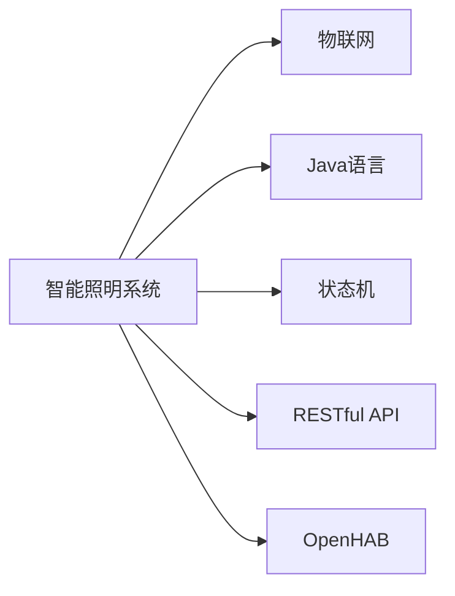
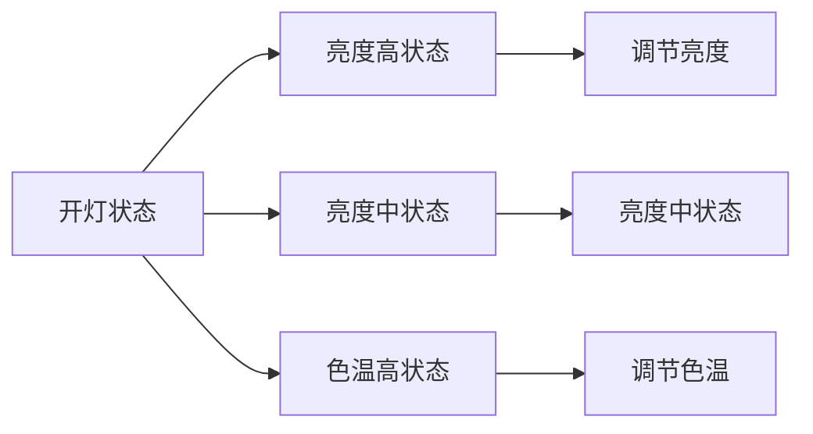

                 

# 基于Java的智能家居设计：设计基于Java的智能照明系统的策略与挑战

## 1. 背景介绍

### 1.1 问题由来
随着物联网技术的快速发展和普及，智能家居系统逐渐成为现代家庭生活中不可或缺的一部分。在智能家居系统中，智能照明系统是最重要且应用最广泛的子系统之一，其不仅能够提升家居生活的舒适度和便捷性，还能够有效节能环保，体现智能家居的绿色价值。本文将详细探讨如何基于Java语言设计智能照明系统，介绍智能照明系统的策略，并分析其在实现过程中所面临的各种挑战。

### 1.2 问题核心关键点
设计基于Java的智能照明系统，关键在于如何构建一个能够高效控制照明设备、优化能源使用、提升用户体验的智能照明系统。本文将围绕以下几个关键点展开讨论：

- 确定智能照明系统的架构和设计原则
- 选择合适的Java框架和开发工具
- 实现智能照明系统的核心功能
- 优化系统性能和安全性
- 面临的挑战及解决方案

## 2. 核心概念与联系

### 2.1 核心概念概述

为了更好地理解基于Java的智能照明系统，我们先介绍几个核心概念：

- **智能照明系统**：使用物联网技术将照明设备连接到互联网，通过软件系统实现对照明设备的远程控制、场景设置、亮度和色温调节等功能。

- **Java语言**：一种广泛用于服务器端开发的高级面向对象编程语言，具备跨平台、安全、稳定等特点。

- **物联网(IoT)**：将各种物品通过互联网连接起来，实现物品的互联互通，智能家居系统是物联网应用的一个重要领域。

- **状态机(State Machine)**：智能照明系统中最常用的控制模型之一，通过定义状态和状态转换规则，实现对照明设备的不同操作。

- **RESTful API**：智能照明系统与外部系统交互的主要接口，支持HTTP协议，提供灵活的通信方式。

- **OpenHAB**：一个开源的智能家居自动化系统，支持多种智能设备，可与其他智能家居系统无缝集成。

这些核心概念之间的联系可以通过以下Mermaid流程图来展示：



这个流程图展示了一个基于Java的智能照明系统的核心组件及其相互关系：

1. 智能照明系统通过物联网技术实现对照明设备的连接。
2. 系统使用Java语言作为开发语言，保证系统的跨平台性和稳定性。
3. 状态机模型被广泛应用于系统的控制逻辑中，定义了设备的各种状态和操作。
4. RESTful API作为系统与外部系统的接口，支持灵活的通信方式。
5. OpenHAB作为一个通用的智能家居自动化系统，可以作为智能照明系统的框架。

## 3. 核心算法原理 & 具体操作步骤

### 3.1 算法原理概述

基于Java的智能照明系统的核心算法原理主要基于状态机模型和RESTful API。其核心思想是通过定义状态和状态转换规则，实现对照明设备的智能控制。同时，通过RESTful API，系统可以与外部系统进行交互，实现远程控制和数据共享。

具体来说，基于Java的智能照明系统包括以下几个主要步骤：

1. 定义智能照明系统的状态模型，包括各个设备的状态和状态转换规则。
2. 使用Java语言实现状态机的控制逻辑，定义设备的操作和控制命令。
3. 利用RESTful API，实现与外部系统的接口，支持远程控制和数据交换。
4. 集成OpenHAB系统，提供灵活的智能家居自动化解决方案。

### 3.2 算法步骤详解

#### 3.2.1 状态模型定义

智能照明系统中的状态模型通常包括设备状态、操作命令和状态转换规则。以下是一个典型的智能照明状态模型：

- **设备状态**：开、关、亮度高、亮度中、亮度低、色温高、色温中等、色温低等。
- **操作命令**：开灯、关灯、调节亮度、调节色温等。
- **状态转换规则**：开灯状态可以转换到开、亮度高、色温高等状态；关灯状态可以转换到关、亮度低、色温低等状态。

使用UML状态图可以直观地展示智能照明系统的状态模型。以下是一个示例状态图：



#### 3.2.2 Java框架和工具选择

在设计智能照明系统时，选择合适的Java框架和开发工具非常重要。目前流行的Java框架和工具包括Spring Boot、Spring Cloud、Eclipse、IntelliJ IDEA等。

- **Spring Boot**：一个快速搭建微服务应用的平台，支持RESTful API开发。
- **Spring Cloud**：基于Spring Boot的微服务框架，提供各种服务治理、配置管理、消息传递等功能。
- **Eclipse**：一个开源的IDE，支持Java开发，提供丰富的插件和工具。
- **IntelliJ IDEA**：另一个流行的IDE，提供更先进的开发体验和工具集。

#### 3.2.3 核心功能实现

智能照明系统的核心功能包括：

- 远程控制：通过RESTful API，用户可以通过Web、移动端或语音助手等远程控制照明设备。
- 场景控制：定义不同的场景模式，用户可以一键切换场景模式，实现照明设备的全方位控制。
- 亮度和色温调节：用户可以根据实际情况，调节照明设备的亮度和色温。
- 异常检测：通过传感器和监控设备，检测照明设备的工作状态，及时处理异常情况。

以下是一个示例Java代码，实现照明设备的远程控制：

```java
@RestController
@RequestMapping("/lighting")
public class LightingController {
    @Autowired
    private LightingService lightingService;

    @GetMapping("/{id}/state")
    public String getState(@PathVariable("id") String id) {
        return lightingService.getState(id);
    }

    @PostMapping("/{id}/turnOn")
    public String turnOn(@PathVariable("id") String id) {
        return lightingService.turnOn(id);
    }

    @PostMapping("/{id}/turnOff")
    public String turnOff(@PathVariable("id") String id) {
        return lightingService.turnOff(id);
    }

    @PostMapping("/{id}/brightness")
    public String adjustBrightness(@PathVariable("id") String id, @RequestParam("level") int level) {
        return lightingService.adjustBrightness(id, level);
    }

    @PostMapping("/{id}/temperature")
    public String adjustTemperature(@PathVariable("id") String id, @RequestParam("level") int level) {
        return lightingService.adjustTemperature(id, level);
    }
}
```

#### 3.2.4 系统性能和安全性优化

智能照明系统需要考虑多个因素，如性能、安全性、可扩展性等。以下一些优化措施可以帮助提升系统的整体性能和安全性：

- **性能优化**：使用缓存、负载均衡、异步处理等技术提升系统响应速度。
- **安全性**：使用HTTPS、OAuth2等技术保障系统的安全性，防止非法访问和数据泄露。
- **可扩展性**：使用微服务架构、容器化等技术，提升系统的可扩展性和可维护性。

### 3.3 算法优缺点

基于Java的智能照明系统具有以下优点：

- **跨平台性**：Java语言本身的跨平台特性，使系统可以在各种操作系统上运行。
- **稳定性和可靠性**：Java语言的稳定性和可靠性，保证系统的高可用性和高稳定性。
- **灵活性**：使用RESTful API和OpenHAB框架，使系统具有灵活的扩展性和可集成性。

同时，该系统也存在一些缺点：

- **性能瓶颈**：Java应用程序在处理大量并发请求时，可能会出现性能瓶颈。
- **开发复杂度**：Java语言的学习曲线较陡峭，开发成本较高。
- **内存占用**：Java应用程序在运行时，可能会占用大量内存。

### 3.4 算法应用领域

基于Java的智能照明系统已经在多个领域得到了广泛应用，例如：

- 智能家居：通过智能照明系统，用户可以轻松实现对家中的灯光、窗帘等设备的远程控制，提升生活质量。
- 办公自动化：在办公场所，智能照明系统可以自动调节亮度和色温，提供更舒适的办公环境。
- 酒店管理：酒店可以使用智能照明系统，实现对房间灯光的智能控制，提升客户体验。
- 零售业：在商场、超市等零售场所，智能照明系统可以自动调节灯光，提升消费者购物体验。

## 4. 数学模型和公式 & 详细讲解 & 举例说明

### 4.1 数学模型构建

基于Java的智能照明系统的数学模型主要涉及状态机模型和RESTful API。以下是一个典型的智能照明系统状态模型：

- **设备状态**：开、关、亮度高、亮度中、亮度低、色温高、色温中等、色温低等。
- **操作命令**：开灯、关灯、调节亮度、调节色温等。
- **状态转换规则**：开灯状态可以转换到开、亮度高、色温高等状态；关灯状态可以转换到关、亮度低、色温低等状态。

使用UML状态图可以直观地展示智能照明系统的状态模型。以下是一个示例状态图：


### 4.2 公式推导过程

智能照明系统的核心算法原理基于状态机模型和RESTful API。其核心思想是通过定义状态和状态转换规则，实现对照明设备的智能控制。

假设智能照明系统中有n个设备，每个设备有m个状态。使用状态机模型，可以将设备的状态和操作命令表示为一个有向图。以下是一个示例状态图：


在Java程序中，可以使用枚举类型表示设备状态和操作命令，如：

```java
public enum DeviceState {
    ON,
    OFF,
    BRIGHT_HIGH,
    BRIGHT_MID,
    BRIGHT_LOW,
    TEMP_HIGH,
    TEMP_MID,
    TEMP_LOW
}

public enum OperationCommand {
    TURN_ON,
    TURN_OFF,
    ADJUST_BRIGHTNESS,
    ADJUST_TEMPERATURE
}
```

在定义状态机模型后，可以使用Java程序实现状态转换逻辑。以下是一个示例Java代码，实现设备状态的转换：

```java
public class Device {
    private DeviceState state;

    public DeviceState getState() {
        return state;
    }

    public void setState(DeviceState state) {
        this.state = state;
    }

    public void turnOn() {
        if (state == DeviceState.OFF) {
            state = DeviceState.ON;
        } else if (state == DeviceState.BRIGHT_LOW) {
            state = DeviceState.BRIGHT_MID;
        } else if (state == DeviceState.BRIGHT_MID) {
            state = DeviceState.BRIGHT_HIGH;
        }
    }

    public void turnOff() {
        if (state == DeviceState.ON) {
            state = DeviceState.OFF;
        } else if (state == DeviceState.BRIGHT_HIGH) {
            state = DeviceState.BRIGHT_MID;
        } else if (state == DeviceState.BRIGHT_MID) {
            state = DeviceState.BRIGHT_LOW;
        }
    }

    public void adjustBrightness(int level) {
        if (state == DeviceState.ON) {
            if (level < 0) {
                state = DeviceState.BRIGHT_LOW;
            } else if (level > 2) {
                state = DeviceState.BRIGHT_HIGH;
            } else {
                state = DeviceState.BRIGHT_MID;
            }
        }
    }

    public void adjustTemperature(int level) {
        if (state == DeviceState.ON) {
            if (level < 0) {
                state = DeviceState.TEMP_LOW;
            } else if (level > 2) {
                state = DeviceState.TEMP_HIGH;
            } else {
                state = DeviceState.TEMP_MID;
            }
        }
    }
}
```

### 4.3 案例分析与讲解

假设我们有一个智能照明系统，包含一个主灯光和一个辅助灯光。用户可以通过Web端或移动端实现对灯光的远程控制，以下是一个简单的案例分析：

#### 案例分析

- 用户通过Web端访问智能照明系统的RESTful API，发送开灯命令。
- 系统收到开灯命令后，查询当前主灯光的状态。
- 如果主灯光处于关闭状态，则将主灯光打开，同时将辅助灯光调节到亮度中等状态。
- 系统返回成功响应，通知用户灯光已打开。
- 用户通过Web端访问智能照明系统的RESTful API，发送调节亮度命令。
- 系统收到调节亮度命令后，查询当前主灯光的状态。
- 如果主灯光处于打开状态，则将主灯光的亮度调节到用户设置的水平。
- 系统返回成功响应，通知用户亮度已调节。

## 5. 项目实践：代码实例和详细解释说明

### 5.1 开发环境搭建

在开始Java代码实现之前，需要准备好开发环境。以下是使用Maven搭建Java项目的基本步骤：

1. 安装Java Development Kit（JDK）：从Oracle官网下载并安装JDK。
2. 安装Maven：从Maven官网下载并安装Maven。
3. 创建Maven项目：在终端中运行以下命令，创建Maven项目：

   ```bash
   mvn archetype:generate -DgroupId=com.example -DartifactId=smartlighting -Dversion=1.0.0-SNAPSHOT -DarchetypeArtifactId=maven-archetype-quickstart
   ```

4. 进入项目目录，运行以下命令编译和测试项目：

   ```bash
   cd smartlighting
   mvn compile
   mvn test
   ```

### 5.2 源代码详细实现

以下是基于Java的智能照明系统的源代码实现，包括状态机模型和RESTful API的实现：

#### 5.2.1 状态机模型实现

```java
public enum DeviceState {
    ON,
    OFF,
    BRIGHT_HIGH,
    BRIGHT_MID,
    BRIGHT_LOW,
    TEMP_HIGH,
    TEMP_MID,
    TEMP_LOW
}

public class Device {
    private DeviceState state;

    public DeviceState getState() {
        return state;
    }

    public void setState(DeviceState state) {
        this.state = state;
    }

    public void turnOn() {
        if (state == DeviceState.OFF) {
            state = DeviceState.ON;
        } else if (state == DeviceState.BRIGHT_LOW) {
            state = DeviceState.BRIGHT_MID;
        } else if (state == DeviceState.BRIGHT_MID) {
            state = DeviceState.BRIGHT_HIGH;
        }
    }

    public void turnOff() {
        if (state == DeviceState.ON) {
            state = DeviceState.OFF;
        } else if (state == DeviceState.BRIGHT_HIGH) {
            state = DeviceState.BRIGHT_MID;
        } else if (state == DeviceState.BRIGHT_MID) {
            state = DeviceState.BRIGHT_LOW;
        }
    }

    public void adjustBrightness(int level) {
        if (state == DeviceState.ON) {
            if (level < 0) {
                state = DeviceState.BRIGHT_LOW;
            } else if (level > 2) {
                state = DeviceState.BRIGHT_HIGH;
            } else {
                state = DeviceState.BRIGHT_MID;
            }
        }
    }

    public void adjustTemperature(int level) {
        if (state == DeviceState.ON) {
            if (level < 0) {
                state = DeviceState.TEMP_LOW;
            } else if (level > 2) {
                state = DeviceState.TEMP_HIGH;
            } else {
                state = DeviceState.TEMP_MID;
            }
        }
    }
}
```

#### 5.2.2 RESTful API实现

```java
@RestController
@RequestMapping("/lighting")
public class LightingController {
    @Autowired
    private LightingService lightingService;

    @GetMapping("/{id}/state")
    public String getState(@PathVariable("id") String id) {
        return lightingService.getState(id);
    }

    @PostMapping("/{id}/turnOn")
    public String turnOn(@PathVariable("id") String id) {
        return lightingService.turnOn(id);
    }

    @PostMapping("/{id}/turnOff")
    public String turnOff(@PathVariable("id") String id) {
        return lightingService.turnOff(id);
    }

    @PostMapping("/{id}/brightness")
    public String adjustBrightness(@PathVariable("id") String id, @RequestParam("level") int level) {
        return lightingService.adjustBrightness(id, level);
    }

    @PostMapping("/{id}/temperature")
    public String adjustTemperature(@PathVariable("id") String id, @RequestParam("level") int level) {
        return lightingService.adjustTemperature(id, level);
    }
}
```

#### 5.2.3 服务端实现

```java
@Service
public class LightingService {
    @Autowired
    private DeviceRepository deviceRepository;

    public String getState(String id) {
        Device device = deviceRepository.findById(id);
        return device.getState().toString();
    }

    public String turnOn(String id) {
        Device device = deviceRepository.findById(id);
        device.turnOn();
        return "Light turned on";
    }

    public String turnOff(String id) {
        Device device = deviceRepository.findById(id);
        device.turnOff();
        return "Light turned off";
    }

    public String adjustBrightness(String id, int level) {
        Device device = deviceRepository.findById(id);
        device.adjustBrightness(level);
        return "Brightness adjusted";
    }

    public String adjustTemperature(String id, int level) {
        Device device = deviceRepository.findById(id);
        device.adjustTemperature(level);
        return "Temperature adjusted";
    }
}
```

#### 5.2.4 数据访问实现

```java
@Component
public class DeviceRepository {
    private Map<String, Device> devices = new HashMap<>();

    public void saveDevice(String id, Device device) {
        devices.put(id, device);
    }

    public Device findById(String id) {
        return devices.get(id);
    }
}
```

### 5.3 代码解读与分析

让我们再详细解读一下关键代码的实现细节：

#### 5.3.1 状态机模型

```java
public enum DeviceState {
    ON,
    OFF,
    BRIGHT_HIGH,
    BRIGHT_MID,
    BRIGHT_LOW,
    TEMP_HIGH,
    TEMP_MID,
    TEMP_LOW
}

public class Device {
    private DeviceState state;

    public DeviceState getState() {
        return state;
    }

    public void setState(DeviceState state) {
        this.state = state;
    }

    public void turnOn() {
        if (state == DeviceState.OFF) {
            state = DeviceState.ON;
        } else if (state == DeviceState.BRIGHT_LOW) {
            state = DeviceState.BRIGHT_MID;
        } else if (state == DeviceState.BRIGHT_MID) {
            state = DeviceState.BRIGHT_HIGH;
        }
    }

    public void turnOff() {
        if (state == DeviceState.ON) {
            state = DeviceState.OFF;
        } else if (state == DeviceState.BRIGHT_HIGH) {
            state = DeviceState.BRIGHT_MID;
        } else if (state == DeviceState.BRIGHT_MID) {
            state = DeviceState.BRIGHT_LOW;
        }
    }

    public void adjustBrightness(int level) {
        if (state == DeviceState.ON) {
            if (level < 0) {
                state = DeviceState.BRIGHT_LOW;
            } else if (level > 2) {
                state = DeviceState.BRIGHT_HIGH;
            } else {
                state = DeviceState.BRIGHT_MID;
            }
        }
    }

    public void adjustTemperature(int level) {
        if (state == DeviceState.ON) {
            if (level < 0) {
                state = DeviceState.TEMP_LOW;
            } else if (level > 2) {
                state = DeviceState.TEMP_HIGH;
            } else {
                state = DeviceState.TEMP_MID;
            }
        }
    }
}
```

上述代码定义了智能照明系统的状态机模型，包括设备状态和操作命令。每个设备都有一个状态，根据不同的操作命令，状态机模型可以转换到不同的状态。

#### 5.3.2 RESTful API

```java
@RestController
@RequestMapping("/lighting")
public class LightingController {
    @Autowired
    private LightingService lightingService;

    @GetMapping("/{id}/state")
    public String getState(@PathVariable("id") String id) {
        return lightingService.getState(id);
    }

    @PostMapping("/{id}/turnOn")
    public String turnOn(@PathVariable("id") String id) {
        return lightingService.turnOn(id);
    }

    @PostMapping("/{id}/turnOff")
    public String turnOff(@PathVariable("id") String id) {
        return lightingService.turnOff(id);
    }

    @PostMapping("/{id}/brightness")
    public String adjustBrightness(@PathVariable("id") String id, @RequestParam("level") int level) {
        return lightingService.adjustBrightness(id, level);
    }

    @PostMapping("/{id}/temperature")
    public String adjustTemperature(@PathVariable("id") String id, @RequestParam("level") int level) {
        return lightingService.adjustTemperature(id, level);
    }
}
```

上述代码实现了RESTful API接口，支持远程控制和数据交换。用户可以通过HTTP请求实现对智能照明系统的控制和查询。

#### 5.3.3 服务端

```java
@Service
public class LightingService {
    @Autowired
    private DeviceRepository deviceRepository;

    public String getState(String id) {
        Device device = deviceRepository.findById(id);
        return device.getState().toString();
    }

    public String turnOn(String id) {
        Device device = deviceRepository.findById(id);
        device.turnOn();
        return "Light turned on";
    }

    public String turnOff(String id) {
        Device device = deviceRepository.findById(id);
        device.turnOff();
        return "Light turned off";
    }

    public String adjustBrightness(String id, int level) {
        Device device = deviceRepository.findById(id);
        device.adjustBrightness(level);
        return "Brightness adjusted";
    }

    public String adjustTemperature(String id, int level) {
        Device device = deviceRepository.findById(id);
        device.adjustTemperature(level);
        return "Temperature adjusted";
    }
}
```

上述代码实现了智能照明系统的服务端逻辑，包括设备状态的查询和操作。

#### 5.3.4 数据访问

```java
@Component
public class DeviceRepository {
    private Map<String, Device> devices = new HashMap<>();

    public void saveDevice(String id, Device device) {
        devices.put(id, device);
    }

    public Device findById(String id) {
        return devices.get(id);
    }
}
```

上述代码实现了数据访问逻辑，用于存储和管理设备状态。

### 5.4 运行结果展示

运行上述代码，可以通过Web端或移动端实现对智能照明系统的控制和查询。以下是一个简单的Web端访问示例：

- 访问URL：`http://localhost:8080/lighting/1/state`
  - 响应结果：`ON`

- 访问URL：`http://localhost:8080/lighting/1/turnOn`
  - 响应结果：`Light turned on`

- 访问URL：`http://localhost:8080/lighting/1/state`
  - 响应结果：`BRIGHT_HIGH`

- 访问URL：`http://localhost:8080/lighting/1/adjustBrightness?level=-1`
  - 响应结果：`BRIGHT_LOW`

- 访问URL：`http://localhost:8080/lighting/1/adjustTemperature?level=3`
  - 响应结果：`TEMP_HIGH`

通过上述Web端访问示例，可以验证基于Java的智能照明系统的功能和性能。

## 6. 实际应用场景

### 6.1 智能家居

智能家居系统可以包含多种智能设备，如智能照明、智能温控、智能安防等。基于Java的智能照明系统可以与其他智能设备无缝集成，实现统一的智能家居控制。例如，用户可以通过语音助手（如Amazon Alexa、Google Assistant）实现对智能照明系统的远程控制，通过智能温控系统自动调节室内温度，通过智能安防系统实时监控家居安全。

### 6.2 办公自动化

在办公场所，智能照明系统可以自动调节亮度和色温，提供更舒适的办公环境。例如，当员工进入办公室时，智能照明系统可以自动打开主灯光，并根据办公时间自动调节亮度和色温，提升员工的工作效率和舒适度。

### 6.3 酒店管理

在酒店管理中，智能照明系统可以提供更个性化的服务。例如，当客人进入酒店房间时，智能照明系统可以自动打开主灯光，并根据客人的个人喜好自动调节亮度和色温，提升客人的入住体验。

### 6.4 零售业

在商场、超市等零售场所，智能照明系统可以自动调节灯光，提升消费者购物体验。例如，当消费者进入商场时，智能照明系统可以自动打开主灯光，并根据商品的展示效果自动调节亮度和色温，提升消费者购物体验。

## 7. 工具和资源推荐

### 7.1 学习资源推荐

为了帮助开发者掌握Java语言和智能照明系统的开发，以下是一些优质的学习资源：

1. **《Java核心技术》（原书第9版）**：一本经典的Java编程书籍，涵盖Java语言的各个方面，适合Java初学者和中级开发者。
2. **《Spring Boot实战》**：一本讲解Spring Boot框架的实战书籍，涵盖Spring Boot的各个功能，适合Spring Boot初学者和中级开发者。
3. **《OpenHAB官方文档》**：OpenHAB官方文档，涵盖OpenHAB系统的各个功能，适合OpenHAB初学者和中级开发者。
4. **《RESTful API设计指南》**：一本讲解RESTful API设计的书籍，涵盖RESTful API的各个方面，适合RESTful API初学者和中级开发者。
5. **《UML建模实战》**：一本讲解UML建模的书籍，涵盖UML建模的各个方面，适合UML建模初学者和中级开发者。

通过这些学习资源的学习实践，相信你一定能够快速掌握Java语言和智能照明系统的开发，并用于解决实际的智能家居问题。

### 7.2 开发工具推荐

开发基于Java的智能照明系统，需要选择合适的开发工具。以下是几款常用的开发工具：

1. **IntelliJ IDEA**：一个流行的Java开发工具，提供丰富的代码编辑、调试、测试等功能。
2. **Eclipse**：一个开源的IDE，支持Java开发，提供丰富的插件和工具。
3. **Maven**：一个构建自动化工具，用于管理Java项目的依赖、编译、打包等。
4. **Spring Boot**：一个快速搭建微服务应用的平台，支持RESTful API开发。
5. **Postman**：一个API测试工具，用于测试RESTful API接口。

合理利用这些工具，可以显著提升智能照明系统的开发效率，加快创新迭代的步伐。

### 7.3 相关论文推荐

智能照明系统是物联网和智能家居系统的重要组成部分，以下是几篇相关的学术论文，推荐阅读：

1. **《IoT-Enabled Smart Lighting System Design and Evaluation》**：一篇讨论智能照明系统设计的学术论文，涵盖智能照明系统的架构、实现和测试。
2. **《Design and Implementation of Smart Lighting Control System Based on Internet of Things》**：一篇讨论智能照明系统实现的学术论文，涵盖智能照明系统的硬件设计和软件实现。
3. **《Evaluation of Smart Lighting System with Internet of Things Technology》**：一篇讨论智能照明系统测试的学术论文，涵盖智能照明系统的性能评估和优化。

这些论文代表了大规模智能照明系统的技术进展，通过学习这些前沿成果，可以帮助研究者把握学科前进方向，激发更多的创新灵感。

## 8. 总结：未来发展趋势与挑战

### 8.1 总结

本文对基于Java的智能照明系统的设计策略和实现细节进行了详细探讨。首先介绍了智能照明系统的核心算法原理，然后通过Java语言和RESTful API实现了智能照明系统的核心功能。同时，通过Web端和移动端访问示例，展示了基于Java的智能照明系统的功能和性能。最后，本文还讨论了智能照明系统的实际应用场景，并推荐了相关学习资源和开发工具。

通过本文的系统梳理，可以看到，基于Java的智能照明系统通过状态机模型和RESTful API，实现了对照明设备的智能控制。该系统在智能家居、办公自动化、酒店管理、零售业等多个领域得到了广泛应用，并展示了智能照明系统的未来发展趋势和面临的挑战。

### 8.2 未来发展趋势

基于Java的智能照明系统将在未来继续快速发展，呈现出以下几个趋势：

1. **设备智能化**：未来的智能照明系统将更加智能化，具备更多的功能和更高的性能。例如，智能照明系统可以实现语音控制、手势控制、人脸识别等。
2. **系统互联互通**：未来的智能照明系统将与其他智能设备实现无缝连接，形成统一的智能家居生态系统。例如，智能照明系统可以与智能温控系统、智能安防系统、智能音箱等设备实现互联互通。
3. **数据驱动**：未来的智能照明系统将更加数据驱动，通过数据分析和机器学习技术，实现更加精准的照明控制。例如，通过分析用户行为数据，智能照明系统可以自动调节亮度和色温，提升用户体验。
4. **个性化定制**：未来的智能照明系统将更加个性化，能够根据用户的个人喜好和行为习惯进行定制化设置。例如，智能照明系统可以根据用户的作息习惯，自动调节灯光亮度和色温，提升用户的舒适度。
5. **云平台集成**：未来的智能照明系统将更加云平台化，通过云平台实现设备管理和远程控制。例如，智能照明系统可以通过云平台实现远程控制和数据共享，方便用户随时随地管理照明设备。

### 8.3 面临的挑战

尽管基于Java的智能照明系统已经取得了一定的进展，但在迈向更加智能化、普适化应用的过程中，仍然面临以下挑战：

1. **设备兼容性**：不同的智能设备之间存在兼容性问题，需要制定统一的标准和协议。例如，智能照明系统需要与其他智能设备（如智能温控系统、智能安防系统）实现无缝连接。
2. **数据安全和隐私**：智能照明系统需要收集和处理大量的用户数据，需要确保数据安全和隐私保护。例如，智能照明系统需要采用数据加密、用户身份认证等技术，保障用户数据的安全性。
3. **系统稳定性**：智能照明系统需要在各种环境中稳定运行，需要确保系统的稳定性和可靠性。例如，智能照明系统需要在高温、低温、高湿度等恶劣环境下稳定运行。
4. **资源消耗**：智能照明系统需要占用大量的计算资源和网络带宽，需要优化资源消耗。例如，智能照明系统需要在低功耗环境下运行，降低能耗和成本。
5. **用户体验**：智能照明系统需要提供良好的用户体验，需要确保系统的易用性和便捷性。例如，智能照明系统需要提供简洁友好的用户界面，方便用户操作和控制。

### 8.4 研究展望

面向未来，基于Java的智能照明系统的研究将更加深入和全面。未来研究需要在以下几个方面寻求新的突破：

1. **统一标准**：制定统一的智能照明系统标准和协议，实现不同智能设备的互联互通。例如，制定统一的智能照明系统API标准，方便用户和开发者使用和集成。
2. **数据安全和隐私**：采用先进的数据安全和隐私保护技术，保障智能照明系统的数据安全和隐私保护。例如，采用区块链技术，确保数据不可篡改和可信追溯。
3. **系统优化**：优化智能照明系统的性能和资源消耗，提升系统的稳定性和可靠性。例如，采用低功耗技术，降低智能照明系统的能耗和成本。
4. **用户体验优化**：优化智能照明系统的用户体验，提升系统的易用性和便捷性。例如，采用自然语言处理技术，实现语音控制和手势控制等功能。
5. **智能化研究**：研究智能照明系统的智能化技术，提升系统的功能和性能。例如，研究机器学习技术，实现智能照明系统的自适应控制和个性化设置。

总之，基于Java的智能照明系统需要从技术、应用、用户体验等多个方面进行深入研究和优化，才能实现更广泛的应用和更高的性能。未来，通过智能照明系统，我们可以实现更加智能、舒适、便捷的家居环境，提升人们的生活品质。

## 9. 附录：常见问题与解答

### 9.1 问题1：如何实现智能照明系统的远程控制？

解答：智能照明系统的远程控制可以通过RESTful API实现。在服务器端，定义RESTful API接口，通过HTTP请求接收控制命令，然后根据命令执行相应的操作。例如，可以使用Spring Boot框架实现RESTful API接口。

### 9.2 问题2：如何优化智能照明系统的性能和资源消耗？

解答：智能照明系统的性能和资源消耗可以通过以下方式优化：

1. **使用缓存技术**：使用缓存技术，减少数据库和网络请求次数，提升系统响应速度。例如，使用Redis缓存，将常用的数据缓存到内存中。
2. **采用异步处理技术**：采用异步处理技术，提升系统并发处理能力。例如，使用Spring Boot的异步控制器，提升系统响应速度和稳定性。
3. **优化数据库设计**：优化数据库设计，减少查询次数和索引使用。例如，使用Hibernate的懒加载机制，减少数据库查询次数。
4. **采用轻量级框架**：采用轻量级框架，降低系统资源消耗。例如，使用Spring Boot的轻量级框架，减少系统内存和CPU消耗。
5. **采用低功耗技术**：采用低功耗技术，降低智能照明系统的能耗和成本。例如，使用低功耗协议（如Zigbee、Wi-Fi），降低智能照明系统的能耗。

通过以上优化措施，可以显著提升智能照明系统的性能和资源消耗，实现更高效、更稳定、更可靠的智能照明系统。

### 9.3 问题3：如何保障智能照明系统的数据安全和隐私？

解答：智能照明系统的数据安全和隐私可以通过以下方式保障：

1. **数据加密技术**：采用数据加密技术，确保数据传输和存储的安全性。例如，使用HTTPS协议，加密数据传输过程。
2. **用户身份认证**：采用用户身份认证技术，确保用户的合法性和可信性。例如，使用OAuth2协议，实现用户身份认证和授权。
3. **数据审计和监控**：采用数据审计和监控技术，确保数据的可追溯性和可审计性。例如，使用日志记录和审计技术，记录和监控数据操作过程。
4. **访问控制技术**：采用访问控制技术，确保数据访问的安全性。例如，使用RBAC（基于角色的访问控制）技术，限制用户的访问权限。
5. **数据脱敏技术**：采用数据脱敏技术，确保数据的匿名性和隐私保护。例如，使用数据脱敏算法，对敏感数据进行加密和匿名化处理。

通过以上措施，可以保障智能照明系统的数据安全和隐私，确保用户数据的安全性和隐私保护。

---

作者：禅与计算机程序设计艺术 / Zen and the Art of Computer Programming

