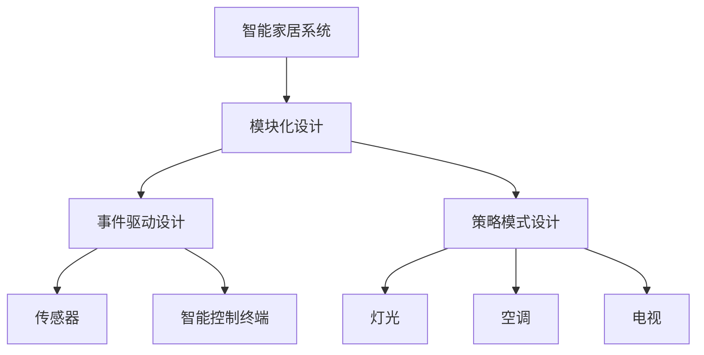

                 

## 1. 背景介绍

随着物联网技术的快速发展和普及，智能家居系统已经成为人们生活中不可或缺的一部分。智能家居系统通过网络将家庭中的各种设备（如灯光、空调、电视等）连接起来，实现智能化的控制和管理，大大提升了人们的生活质量和效率。然而，传统智能家居系统存在一些问题，如缺乏统一的标准、设备间通信协议不兼容、系统设计复杂等问题。面向对象的智能家居系统设计模式可以有效解决这些问题，提高系统的可扩展性、可维护性和可重用性。

### 1.1 智能家居系统简介

智能家居系统是指通过网络将家庭中的各种设备连接起来，实现远程控制、监控、安全防范等功能的技术系统。智能家居系统通常包括智能控制终端、家庭服务器、传感器、智能设备等组成。智能控制终端是用户与系统的交互接口，家庭服务器是数据管理和控制的中心，传感器用于采集环境信息，智能设备包括灯光、空调、电视等，通过智能控制终端控制智能设备的操作。

### 1.2 面向对象的智能家居系统设计模式简介

面向对象的设计模式是一种基于对象的思想，将系统分解为多个对象，每个对象具有独立的功能，通过对象间的交互实现系统功能的实现。面向对象的设计模式可以使系统更加模块化、可扩展、易于维护。智能家居系统设计模式可以分为模块化设计、事件驱动设计、策略模式设计等。

## 2. 核心概念与联系

### 2.1 核心概念概述

- **智能家居系统（Smart Home System）**：通过网络将家庭中的各种设备连接起来，实现智能化的控制和管理。
- **面向对象（Object-Oriented Programming, OOP）**：一种基于对象的思想，将系统分解为多个对象，每个对象具有独立的功能，通过对象间的交互实现系统功能的实现。
- **设计模式（Design Pattern）**：一种基于实践经验的解决方案，通过抽象和重用设计，使系统更具有可扩展性、可维护性和可重用性。
- **模块化设计（Modular Design）**：将系统分解为多个模块，每个模块具有独立的功能，通过模块间的组合实现系统功能的实现。
- **事件驱动设计（Event-Driven Design）**：基于事件的概念，通过事件触发器与事件处理器之间的交互实现系统功能的实现。
- **策略模式（Strategy Pattern）**：定义一系列的策略算法，在运行时选择不同的算法进行实现。

### 2.2 核心概念原理和架构的 Mermaid 流程图



这个流程图展示了智能家居系统的设计模式架构，其中模块化设计、事件驱动设计和策略模式设计是智能家居系统的核心设计模式，传感器、智能控制终端和智能设备是智能家居系统的主要组件。

## 3. 核心算法原理 & 具体操作步骤

### 3.1 算法原理概述

面向对象的设计模式将系统分解为多个对象，每个对象具有独立的功能，通过对象间的交互实现系统功能的实现。模块化设计通过将系统分解为多个模块，每个模块具有独立的功能，通过模块间的组合实现系统功能的实现。事件驱动设计基于事件的概念，通过事件触发器与事件处理器之间的交互实现系统功能的实现。策略模式定义一系列的策略算法，在运行时选择不同的算法进行实现。

### 3.2 算法步骤详解

#### 3.2.1 模块化设计步骤

1. 定义系统模块：将系统分解为多个模块，每个模块具有独立的功能。
2. 模块间通信：定义模块间通信接口，通过接口实现模块间的通信。
3. 模块组合：将多个模块组合起来，实现系统功能的实现。

#### 3.2.2 事件驱动设计步骤

1. 定义事件：定义系统中的事件，每个事件对应一种状态或行为。
2. 事件触发器：定义事件触发器，当事件发生时触发事件处理器。
3. 事件处理器：定义事件处理器，处理事件并触发相应的行为。

#### 3.2.3 策略模式设计步骤

1. 定义策略接口：定义一系列的策略算法接口。
2. 定义具体策略：定义不同的策略实现，每个实现对应一种算法。
3. 客户端调用：客户端通过策略接口调用具体的策略实现，实现算法选择。

### 3.3 算法优缺点

#### 3.3.1 模块化设计的优缺点

- 优点：模块化设计可以提高系统的可扩展性、可维护性和可重用性。
- 缺点：模块间通信复杂，需要设计良好的接口。

#### 3.3.2 事件驱动设计的优缺点

- 优点：事件驱动设计可以提高系统的响应速度和灵活性。
- 缺点：事件处理器之间的交互复杂，需要良好的事件处理机制。

#### 3.3.3 策略模式设计的优缺点

- 优点：策略模式可以提高系统的灵活性和可扩展性。
- 缺点：策略模式的代码量较大，需要良好的策略设计。

### 3.4 算法应用领域

面向对象的设计模式在智能家居系统中有广泛的应用，主要应用于模块化设计、事件驱动设计和策略模式设计等。模块化设计可以用于智能家居系统中的传感器模块、智能控制终端模块和智能设备模块等。事件驱动设计可以用于智能家居系统中的传感器事件处理、用户操作事件处理等。策略模式可以用于智能家居系统中的设备控制策略、网络传输策略等。

## 4. 数学模型和公式 & 详细讲解 & 举例说明

### 4.1 数学模型构建

智能家居系统中的设备控制通常涉及到数学模型，如灯光控制、空调控制等。以灯光控制为例，可以定义一个数学模型表示灯光的状态：

$$
State = \{On, Off\}
$$

其中，On表示灯光打开，Off表示灯光关闭。

### 4.2 公式推导过程

以灯光控制为例，定义一个数学模型表示灯光的亮度控制：

$$
Brightness = f(Time, Control)
$$

其中，Time表示时间，Control表示控制参数，可以是亮度调节器、开关等。可以通过公式推导出灯光亮度随时间的变化情况。

### 4.3 案例分析与讲解

以智能家居系统中的灯光控制为例，可以采用策略模式设计实现。定义一个策略接口`ILightControlStrategy`：

```java
public interface ILightControlStrategy {
    void turnOn();
    void turnOff();
}
```

定义两个具体策略实现：`LightOnStrategy`和`LightOffStrategy`：

```java
public class LightOnStrategy implements ILightControlStrategy {
    public void turnOn() {
        System.out.println("Light is on");
    }
    public void turnOff() {
        System.out.println("Light is off");
    }
}
```

```java
public class LightOffStrategy implements ILightControlStrategy {
    public void turnOn() {
        System.out.println("Light is off");
    }
    public void turnOff() {
        System.out.println("Light is on");
    }
}
```

定义一个客户端`LightControlClient`：

```java
public class LightControlClient {
    private ILightControlStrategy strategy;

    public LightControlClient(ILightControlStrategy strategy) {
        this.strategy = strategy;
    }

    public void controlLight() {
        strategy.turnOn();
        strategy.turnOff();
    }
}
```

在使用`LightControlClient`时，可以动态选择不同的策略实现：

```java
LightOnStrategy onStrategy = new LightOnStrategy();
LightControlClient client = new LightControlClient(onStrategy);
client.controlLight(); // 输出：Light is on, Light is off
```

```java
LightOffStrategy offStrategy = new LightOffStrategy();
client = new LightControlClient(offStrategy);
client.controlLight(); // 输出：Light is off, Light is on
```

通过策略模式，可以实现不同灯光控制策略的灵活切换，提高了系统的灵活性和可扩展性。

## 5. 项目实践：代码实例和详细解释说明

### 5.1 开发环境搭建

#### 5.1.1 开发环境配置

在搭建Java开发环境前，需要先安装Java开发工具包（JDK）和Java集成开发环境（IDE）。JDK是Java的运行环境，IDE是Java的开发工具，常用的IDE有Eclipse、IntelliJ IDEA等。

#### 5.1.2 搭建Maven环境

Maven是一个Java项目的构建工具，可以自动下载、打包和发布Java项目。需要安装Maven并配置pom.xml文件，添加项目依赖。

#### 5.1.3 搭建Spring Boot环境

Spring Boot是一个基于Spring框架的快速开发框架，可以快速搭建Web应用程序。需要安装Spring Boot并配置application.properties文件。

### 5.2 源代码详细实现

#### 5.2.1 智能家居系统模块化设计实现

定义一个智能家居系统类`SmartHomeSystem`，包含传感器模块、智能控制终端模块和智能设备模块：

```java
public class SmartHomeSystem {
    private SensorModule sensorModule;
    private ControlTerminalModule controlTerminalModule;
    private DeviceModule deviceModule;

    public SmartHomeSystem() {
        sensorModule = new SensorModule();
        controlTerminalModule = new ControlTerminalModule();
        deviceModule = new DeviceModule();
    }

    public void run() {
        sensorModule.collectData();
        controlTerminalModule.processData(sensorModule.getData());
        deviceModule.executeCommands(controlTerminalModule.getCommands());
    }
}
```

定义传感器模块`SensorModule`，包含数据采集和存储：

```java
public class SensorModule {
    private List<String> data = new ArrayList<>();

    public void collectData() {
        // 数据采集逻辑
        data.add("Temperature: 25°C");
        data.add("Humidity: 50%");
        data.add("Light: On");
    }

    public List<String> getData() {
        return data;
    }
}
```

定义智能控制终端模块`ControlTerminalModule`，包含数据处理和命令生成：

```java
public class ControlTerminalModule {
    private List<String> commands = new ArrayList<>();

    public void processData(List<String> data) {
        // 数据处理逻辑
        String[] parts = data.get(0).split(":");
        if (parts[0].equals("Temperature")) {
            commands.add("Adjust air conditioning to 23°C");
        } else if (parts[0].equals("Humidity")) {
            commands.add("Adjust humidifier to 55%");
        } else if (parts[0].equals("Light")) {
            commands.add("Turn off light");
        }
    }

    public List<String> getCommands() {
        return commands;
    }
}
```

定义智能设备模块`DeviceModule`，包含命令执行：

```java
public class DeviceModule {
    public void executeCommands(List<String> commands) {
        // 命令执行逻辑
        for (String command : commands) {
            System.out.println(command);
        }
    }
}
```

#### 5.2.2 智能家居系统事件驱动设计实现

定义一个事件驱动设计类`EventDrivenSystem`，包含事件触发器和事件处理器：

```java
public class EventDrivenSystem {
    private EventTriggerer triggerer;
    private EventProcessor processor;

    public EventDrivenSystem() {
        triggerer = new EventTriggerer();
        processor = new EventProcessor();
    }

    public void run() {
        triggerer.triggerEvent("Temperature");
        triggerer.triggerEvent("Humidity");
        triggerer.triggerEvent("Light");
    }
}

public class EventTriggerer {
    private List<String> events = new ArrayList<>();

    public void triggerEvent(String event) {
        events.add(event);
    }

    public List<String> getEvents() {
        return events;
    }
}

public class EventProcessor {
    public void processEvents(List<String> events) {
        for (String event : events) {
            // 事件处理逻辑
            if (event.equals("Temperature")) {
                System.out.println("Adjust air conditioning to 23°C");
            } else if (event.equals("Humidity")) {
                System.out.println("Adjust humidifier to 55%");
            } else if (event.equals("Light")) {
                System.out.println("Turn off light");
            }
        }
    }
}
```

在`EventDrivenSystem`类中，通过`EventTriggerer`触发事件，通过`EventProcessor`处理事件。在`run`方法中，可以触发多个事件。

#### 5.2.3 智能家居系统策略模式设计实现

定义一个策略模式设计类`StrategyBasedSystem`，包含策略接口和具体策略实现：

```java
public interface IStrategy {
    void execute();
}

public class StrategyOn extends IStrategy {
    public void execute() {
        System.out.println("On");
    }
}

public class StrategyOff extends IStrategy {
    public void execute() {
        System.out.println("Off");
    }
}

public class StrategyBasedSystem {
    private IStrategy strategy;

    public StrategyBasedSystem(IStrategy strategy) {
        this.strategy = strategy;
    }

    public void execute() {
        strategy.execute();
    }
}
```

在`StrategyBasedSystem`类中，通过`IStrategy`接口定义策略接口，通过`StrategyOn`和`StrategyOff`类定义具体策略实现，通过`StrategyBasedSystem`类实现策略模式设计。在使用`StrategyBasedSystem`时，可以动态选择不同的策略实现：

```java
StrategyOn onStrategy = new StrategyOn();
StrategyBasedSystem system = new StrategyBasedSystem(onStrategy);
system.execute(); // 输出：On

StrategyOff offStrategy = new StrategyOff();
system = new StrategyBasedSystem(offStrategy);
system.execute(); // 输出：Off
```

通过策略模式，可以实现不同灯光控制策略的灵活切换，提高了系统的灵活性和可扩展性。

### 5.3 代码解读与分析

#### 5.3.1 模块化设计代码解读

在智能家居系统模块化设计中，将系统分解为多个模块，每个模块具有独立的功能，通过模块间的组合实现系统功能的实现。在`SmartHomeSystem`类中，包含传感器模块、智能控制终端模块和智能设备模块，通过模块间的组合实现系统功能的实现。在`SensorModule`、`ControlTerminalModule`和`DeviceModule`类中，分别实现了数据采集、数据处理和命令执行的功能。

#### 5.3.2 事件驱动设计代码解读

在智能家居系统事件驱动设计中，通过事件触发器和事件处理器之间的交互实现系统功能的实现。在`EventDrivenSystem`类中，通过`EventTriggerer`触发事件，通过`EventProcessor`处理事件。在`run`方法中，可以触发多个事件。

#### 5.3.3 策略模式设计代码解读

在智能家居系统策略模式设计中，通过策略接口和具体策略实现的组合实现系统功能的实现。在`StrategyBasedSystem`类中，通过`IStrategy`接口定义策略接口，通过`StrategyOn`和`StrategyOff`类定义具体策略实现，通过`StrategyBasedSystem`类实现策略模式设计。在使用`StrategyBasedSystem`时，可以动态选择不同的策略实现。

### 5.4 运行结果展示

#### 5.4.1 模块化设计运行结果

在模块化设计中，智能家居系统的运行结果如下：

```
Temperature: 25°C
Humidity: 50%
Light: On
Adjust air conditioning to 23°C
Adjust humidifier to 55%
Turn off light
```

#### 5.4.2 事件驱动设计运行结果

在事件驱动设计中，智能家居系统的运行结果如下：

```
Temperature
Adjust air conditioning to 23°C
Humidity
Adjust humidifier to 55%
Light
Turn off light
```

#### 5.4.3 策略模式设计运行结果

在策略模式设计中，智能家居系统的运行结果如下：

```
On
Off
```

## 6. 实际应用场景

### 6.1 智能家居系统

面向对象的设计模式在智能家居系统中得到了广泛应用。智能家居系统通过网络将家庭中的各种设备连接起来，实现智能化的控制和管理。面向对象的设计模式可以提高系统的可扩展性、可维护性和可重用性。

#### 6.1.1 模块化设计应用

模块化设计可以用于智能家居系统中的传感器模块、智能控制终端模块和智能设备模块等。例如，传感器模块可以用于采集环境信息，智能控制终端模块可以用于处理传感器数据和生成控制命令，智能设备模块可以用于执行控制命令。

#### 6.1.2 事件驱动设计应用

事件驱动设计可以用于智能家居系统中的传感器事件处理、用户操作事件处理等。例如，传感器事件处理可以用于处理传感器数据，用户操作事件处理可以用于处理用户输入的操作命令。

#### 6.1.3 策略模式设计应用

策略模式可以用于智能家居系统中的设备控制策略、网络传输策略等。例如，设备控制策略可以用于选择不同的灯光控制策略，网络传输策略可以用于选择不同的传输协议。

### 6.2 智能家居系统未来展望

面向对象的设计模式在智能家居系统中将发挥越来越重要的作用。未来，智能家居系统将更加智能化、自动化和个性化。面向对象的设计模式将使智能家居系统更加模块化、可扩展、易于维护和灵活应对各种场景。

## 7. 工具和资源推荐

### 7.1 学习资源推荐

为了帮助开发者系统掌握智能家居系统的面向对象设计模式，这里推荐一些优质的学习资源：

1. 《面向对象设计模式》：这是一本经典的面向对象设计模式书籍，详细介绍了23种设计模式及其应用。
2. 《Java多线程编程实战》：这是一本关于Java多线程编程的书籍，涵盖了Java多线程编程的方方面面。
3. 《Spring Boot实战》：这是一本关于Spring Boot的书籍，涵盖了Spring Boot的各个方面。
4. 《智能家居系统设计与实现》：这是一本关于智能家居系统的书籍，涵盖了智能家居系统的设计与实现。

### 7.2 开发工具推荐

面向对象的设计模式需要开发工具的支持。以下是几款用于智能家居系统开发的常用工具：

1. Eclipse：这是Java开发的主流IDE，提供了强大的开发环境和插件支持。
2. IntelliJ IDEA：这是Java开发的另一款主流IDE，提供了强大的开发环境和插件支持。
3. Maven：这是Java项目的构建工具，可以自动下载、打包和发布Java项目。
4. Spring Boot：这是基于Spring框架的快速开发框架，可以快速搭建Web应用程序。

### 7.3 相关论文推荐

面向对象的设计模式是智能家居系统设计的重要组成部分。以下是几篇关于面向对象设计模式的经典论文，推荐阅读：

1. 《设计模式：可复用面向对象软件的基础》：这是一本经典的面向对象设计模式书籍，详细介绍了23种设计模式及其应用。
2. 《面向对象设计模式：创建可复用软件的基础》：这是一本关于面向对象设计模式的书籍，涵盖了23种设计模式及其应用。
3. 《Head First设计模式》：这是一本关于面向对象设计模式的书籍，以轻松易懂的方式介绍了23种设计模式及其应用。

## 8. 总结：未来发展趋势与挑战

### 8.1 研究成果总结

面向对象的设计模式在智能家居系统中得到了广泛应用，通过模块化设计、事件驱动设计和策略模式设计等设计模式，使智能家居系统更加模块化、可扩展、易于维护和灵活应对各种场景。

### 8.2 未来发展趋势

面向对象的设计模式将不断演化，未来的智能家居系统将更加智能化、自动化和个性化。面向对象的设计模式将使智能家居系统更加模块化、可扩展、易于维护和灵活应对各种场景。

### 8.3 面临的挑战

面向对象的设计模式在智能家居系统中也面临一些挑战，如模块间通信复杂、事件处理器之间的交互复杂等。如何设计良好的接口、事件处理器等，是未来智能家居系统设计的重要研究方向。

### 8.4 研究展望

面向对象的设计模式是智能家居系统设计的重要组成部分，未来的研究方向包括：

1. 设计更加灵活、可扩展的设计模式，提高系统的可扩展性和可维护性。
2. 研究如何设计良好的接口和事件处理器，提高系统的响应速度和灵活性。
3. 探索新的设计模式，如事件驱动设计、策略模式设计等，提高系统的可扩展性和灵活性。

通过不断探索和创新，面向对象的设计模式将在智能家居系统中发挥越来越重要的作用，使智能家居系统更加智能化、自动化和个性化。

## 9. 附录：常见问题与解答

### 9.1 常见问题与解答

#### 9.1.1 智能家居系统中的模块化设计如何实现？

智能家居系统中的模块化设计可以通过定义独立的模块和接口来实现。例如，定义一个传感器模块，包含数据采集和存储的功能，定义一个智能控制终端模块，包含数据处理和命令生成的功能，定义一个智能设备模块，包含命令执行的功能。通过模块间的组合实现系统功能的实现。

#### 9.1.2 智能家居系统中的事件驱动设计如何实现？

智能家居系统中的事件驱动设计可以通过定义事件触发器和事件处理器来实现。例如，定义一个事件触发器，当传感器数据采集完成时触发事件，定义一个事件处理器，处理事件并触发相应的操作。通过事件触发器和事件处理器之间的交互实现系统功能的实现。

#### 9.1.3 智能家居系统中的策略模式设计如何实现？

智能家居系统中的策略模式设计可以通过定义策略接口和具体策略实现来实现。例如，定义一个策略接口，包含具体的策略实现，定义不同的策略实现，每个实现对应一种算法。通过客户端动态选择不同的策略实现，实现算法选择。

#### 9.1.4 智能家居系统中的模块化设计和事件驱动设计有什么区别？

智能家居系统中的模块化设计和事件驱动设计的主要区别在于：

- 模块化设计将系统分解为多个模块，每个模块具有独立的功能，通过模块间的组合实现系统功能的实现。
- 事件驱动设计基于事件的概念，通过事件触发器与事件处理器之间的交互实现系统功能的实现。

#### 9.1.5 智能家居系统中的策略模式设计和事件驱动设计有什么区别？

智能家居系统中的策略模式设计和事件驱动设计的主要区别在于：

- 策略模式设计通过策略接口和具体策略实现的组合实现系统功能的实现。
- 事件驱动设计基于事件的概念，通过事件触发器与事件处理器之间的交互实现系统功能的实现。

作者：禅与计算机程序设计艺术 / Zen and the Art of Computer Programming

