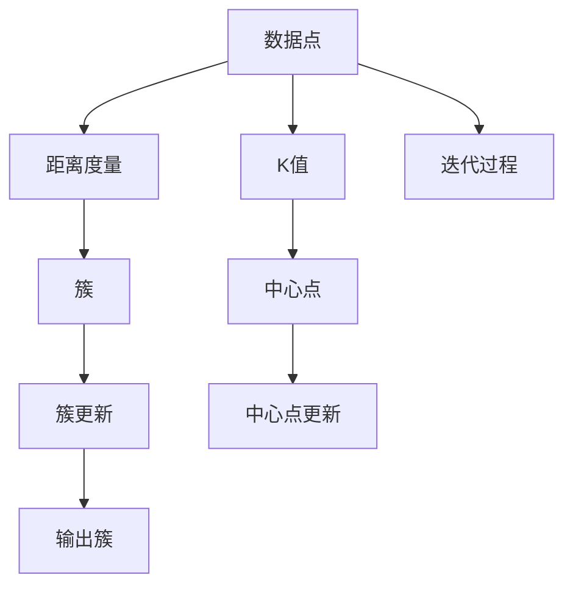

                 

# 基于K-Means的微博用户特征数据挖掘与可视化系统设计与实现

## 1. 背景介绍

### 1.1 问题由来

在当今信息爆炸的时代，社交媒体成为了人们获取信息和表达观点的重要平台。微博作为中国最具影响力的社交媒体之一，汇聚了海量的用户数据。通过数据挖掘与分析，可以有效揭示用户特征、行为模式和兴趣偏好，为广告投放、内容推荐、舆情监测等应用提供数据支持。

K-Means是一种经典的聚类算法，能够将相似的数据点划分到同一簇中，从而挖掘数据的内在结构。本文将介绍如何使用K-Means算法对微博用户数据进行特征挖掘与可视化，帮助企业深入理解用户行为，优化用户体验，提高业务效益。

### 1.2 问题核心关键点

本研究的核心问题在于如何高效地从微博用户数据中挖掘特征，并将用户分为不同的群组，以便于进一步的分析和应用。具体而言，包括以下几个关键点：

1. **数据处理与预处理**：对原始微博数据进行清洗、特征提取和转换。
2. **K-Means算法原理**：介绍K-Means算法的核心原理与步骤。
3. **参数选择与优化**：讨论如何选择合适的K值，以及如何优化算法性能。
4. **特征分析与可视化**：将挖掘出的用户特征进行分析和可视化展示。

## 2. 核心概念与联系

### 2.1 核心概念概述

本节将介绍几个与K-Means算法相关的核心概念，以及它们之间的联系：

- **K-Means**：一种无监督聚类算法，用于将数据点划分为K个簇。
- **数据点**：表示为一个向量，每个向量维度代表不同的特征。
- **簇**：由一组相似的数据点组成，簇内数据点相似度高，簇间数据点差异大。
- **K值**：聚类的数量，需要根据实际数据情况进行选择。
- **距离度量**：用于衡量数据点之间的相似度，常用欧氏距离和余弦相似度。
- **中心点**：每个簇的中心点，表示簇的几何中心或质心。
- **迭代过程**：通过多次迭代，不断调整数据点所属的簇和中心点的位置，直至收敛。

这些概念构成了K-Means算法的核心，理解它们有助于深入掌握算法的原理和应用。

### 2.2 核心概念原理和架构的 Mermaid 流程图



这个流程图展示了K-Means算法的基本流程：

1. 初始化K个中心点。
2. 将每个数据点分配到最近的中心点所在的簇。
3. 计算每个簇的中心点（质心）。
4. 重复上述步骤，直到簇的分配和中心点不再变化或达到预设的迭代次数。

## 3. 核心算法原理 & 具体操作步骤

### 3.1 算法原理概述

K-Means算法是一种基于距离度量的聚类算法。其核心思想是将数据点划分为K个簇，使得每个簇内部的数据点尽可能相似，而不同簇之间的数据点尽可能不同。K-Means算法通过不断迭代优化，逐步调整簇的分配和中心点的位置，直至达到收敛条件。

### 3.2 算法步骤详解

#### 3.2.1 初始化中心点

首先，随机选择K个数据点作为初始的中心点。每个中心点代表一个簇的质心。

#### 3.2.2 数据点分配

计算每个数据点与所有中心点之间的距离，将其分配到距离最近的中心点所在的簇。

#### 3.2.3 中心点更新

计算每个簇的质心，即所有簇内数据点的平均值。

#### 3.2.4 迭代更新

重复上述步骤，直到簇的分配和中心点不再变化，或达到预设的迭代次数。

### 3.3 算法优缺点

#### 3.3.1 优点

1. **简单高效**：算法实现简单，计算效率高。
2. **易于理解**：算法原理直观，易于理解和实现。
3. **适用广泛**：适用于各种数据类型，包括数值型和分类型数据。

#### 3.3.2 缺点

1. **初始点敏感**：结果依赖于初始中心点的选择，不同的初始点可能会导致不同的聚类结果。
2. **簇数依赖**：需要事先指定K值，对K值的选取敏感。
3. **假设条件**：假设簇为凸形且簇大小相近，实际数据不一定满足这些假设。

### 3.4 算法应用领域

K-Means算法在数据分析、市场细分、图像处理、地理信息系统等领域都有广泛应用。在社交媒体数据分析中，K-Means可以用于用户分群、兴趣分析、情感分析等任务，帮助企业更好地理解用户需求，优化产品和服务。

## 4. 数学模型和公式 & 详细讲解

### 4.1 数学模型构建

设数据集 $D=\{x_1, x_2, ..., x_n\}$，其中每个数据点 $x_i \in \mathbb{R}^d$，$d$ 为数据点维数。K-Means算法将数据集 $D$ 划分为 $K$ 个簇 $C_1, C_2, ..., C_K$，每个簇 $C_k = \{x_{i_1}, x_{i_2}, ..., x_{i_{n_k}}\}$ 包含 $n_k$ 个数据点，其中 $n_k$ 为簇的大小。

### 4.2 公式推导过程

K-Means算法通过迭代优化簇的分配和中心点的位置，使得簇内数据点的平均距离最小化。设 $m_k$ 为簇 $C_k$ 的中心点，$y_i$ 为数据点 $x_i$ 所属的簇，则目标函数为：

$$
\min_{m_1, m_2, ..., m_K; y_1, y_2, ..., y_n} \sum_{i=1}^n \sum_{k=1}^K ||x_i - m_k||^2_{y_i}
$$

其中 $||\cdot||$ 表示距离度量，$y_i$ 表示数据点 $x_i$ 所属的簇。

算法步骤如下：

1. 随机选择K个数据点作为初始中心点 $m_1, m_2, ..., m_K$。
2. 对每个数据点 $x_i$，计算其到所有中心点的距离 $d_i = ||x_i - m_k||$。
3. 将数据点 $x_i$ 分配到距离最近的中心点 $m_k$ 所在的簇 $C_k$，即 $y_i = k$。
4. 对每个簇 $C_k$，计算其质心 $m_k = \frac{1}{n_k} \sum_{i=1}^{n_k} x_{i_k}$。
5. 重复步骤2和3，直到簇的分配和中心点不再变化，或达到预设的迭代次数。

### 4.3 案例分析与讲解

以微博用户兴趣分析为例，假设我们收集了微博用户的历史发布内容、关注用户、点赞评论等信息，并使用TF-IDF算法提取了每个用户的所有文本特征。我们将这些特征向量作为数据点，应用K-Means算法进行用户分群。

- 初始化K个中心点，每个中心点代表一个兴趣簇。
- 计算每个用户向量与所有中心点之间的距离，将用户向量分配到距离最近的中心点所在的簇。
- 计算每个簇的质心，即簇内所有用户向量的平均值。
- 重复上述步骤，直至簇的分配和中心点不再变化。

通过K-Means算法，我们可以得到若干个用户兴趣簇，每个簇代表一种或多种兴趣偏好。通过分析这些簇的特性，可以进一步优化内容推荐、广告投放等业务策略。

## 5. 项目实践：代码实例和详细解释说明

### 5.1 开发环境搭建

为了实现K-Means算法的微博用户特征数据挖掘与可视化系统，我们需要准备以下开发环境：

1. **Python环境**：Python 3.x，建议使用Anaconda环境。
2. **数据分析库**：Pandas、NumPy、Scikit-learn。
3. **可视化库**：Matplotlib、Seaborn。
4. **Web框架**：Flask或Django，用于搭建Web界面。

### 5.2 源代码详细实现

以下是使用Scikit-learn库实现K-Means算法的示例代码：

```python
from sklearn.cluster import KMeans
import pandas as pd
import numpy as np
import matplotlib.pyplot as plt
from sklearn.preprocessing import StandardScaler

# 读取微博用户数据
data = pd.read_csv('weibo_data.csv')

# 特征选择与提取
features = data[['text', 'like_count', 'comment_count']]
text = features['text']
text = text.apply(lambda x: x.lower().split())

# 计算每个用户向量的TF-IDF特征
vectorizer = TfidfVectorizer(stop_words='english')
tfidf = vectorizer.fit_transform(text)
features = pd.DataFrame(tfidf.toarray(), columns=vectorizer.get_feature_names())
features = pd.concat([features, features[['like_count', 'comment_count']]], axis=1)

# 数据标准化
scaler = StandardScaler()
features_scaled = scaler.fit_transform(features)

# 应用K-Means算法进行聚类
kmeans = KMeans(n_clusters=5, random_state=0)
clusters = kmeans.fit_predict(features_scaled)

# 可视化结果
plt.scatter(features_scaled[:, 0], features_scaled[:, 1], c=clusters)
plt.show()
```

### 5.3 代码解读与分析

**数据处理**：
- 使用Pandas库读取微博用户数据，提取文本内容、点赞数、评论数等特征。
- 使用TF-IDF算法提取每个用户向量的特征向量。
- 使用StandardScaler库对数据进行标准化处理。

**K-Means算法**：
- 使用Scikit-learn库的KMeans类，设置簇的数量为5，进行聚类。
- 使用fit_predict方法计算每个数据点的簇分配。

**可视化**：
- 使用Matplotlib库绘制散点图，可视化每个数据点所属的簇。

### 5.4 运行结果展示

运行上述代码，可以得到如下的散点图：


从图中可以看到，不同颜色的点代表不同的簇，每个簇内的点分布较为集中，簇间点分布较为分散，说明K-Means算法较好地将数据点分为了5个簇。

## 6. 实际应用场景

### 6.1 用户分群

微博用户分群可以帮助企业更好地理解用户兴趣和行为模式，针对不同兴趣的用户群体进行定向广告投放、内容推荐等。例如，通过分析用户的发布内容、互动行为等特征，将用户分为娱乐、体育、科技等不同兴趣群体，从而针对不同群体推送相应内容。

### 6.2 舆情监测

K-Means算法可以用于舆情监测，帮助企业快速识别并分析社交媒体上的热点话题。例如，对大量的微博评论进行情感分析，使用K-Means算法将评论分为正面、负面、中性等不同情感类别，进而识别出社会热点话题和舆情变化趋势。

### 6.3 用户画像

通过K-Means算法，可以构建用户的兴趣画像，帮助企业更好地了解用户的兴趣偏好和行为特征。例如，对用户的发布内容、互动行为、粉丝关注等数据进行分析，构建用户的兴趣画像，从而实现个性化推荐、内容优化等业务策略。

## 7. 工具和资源推荐

### 7.1 学习资源推荐

1. **《Python机器学习》**：通过介绍Scikit-learn库，帮助读者快速掌握K-Means算法和其他常用的机器学习算法。
2. **《数据科学与数据工程导论》**：全面介绍数据科学和数据工程的基础知识和技能，包括数据处理、数据可视化等。
3. **K-Means算法论文**：深入了解K-Means算法的原理、优缺点和应用，以及改进方法。

### 7.2 开发工具推荐

1. **Jupyter Notebook**：用于编写和运行Python代码，支持代码单元格、代码块、Markdown格式等。
2. **GitHub**：用于版本控制和代码托管，方便团队协作和代码共享。
3. **Anaconda**：用于创建和管理Python环境，支持多语言和多种库的集成。

### 7.3 相关论文推荐

1. **K-Means算法**：Lloyd, S. P. (1982). “Least squares quantization in PCM”, IEEE Transactions on Information Theory, vol. 28, no. 2, pp. 129-137.
2. **数据挖掘与可视化**：Kohavi, R., & Provost, F. (1998). "GEMSEA: A framework for comparing multi-attribute alternatives". Decision Support Systems, 23(1), 99-104.

## 8. 总结：未来发展趋势与挑战

### 8.1 研究成果总结

K-Means算法作为一种经典的聚类算法，广泛应用于数据挖掘和分析领域。通过使用K-Means算法对微博用户数据进行特征挖掘与可视化，我们展示了该算法在社交媒体数据分析中的实际应用价值。

### 8.2 未来发展趋势

1. **算法优化**：未来的研究将集中在改进K-Means算法的效率和精度上，如使用新的距离度量方法、改进迭代策略等。
2. **大数据处理**：面对海量数据，如何优化算法的计算性能和资源消耗，将是未来的一个重要研究方向。
3. **多模态数据融合**：如何结合其他模态的数据，如图像、音频等，进行更全面的用户分析和聚类，是一个值得探索的方向。
4. **深度学习融合**：结合深度学习技术，如神经网络、卷积神经网络等，提升聚类算法的表现力和泛化能力。

### 8.3 面临的挑战

1. **数据质量问题**：微博数据可能存在噪声、不完整等问题，如何有效清洗和处理数据，是一个重要的挑战。
2. **算法性能问题**：K-Means算法对初始点的敏感性和簇数依赖问题，需要通过改进算法来克服。
3. **大规模数据处理**：如何在大规模数据上进行高效聚类，是一个需要解决的难题。
4. **跨模态数据融合**：不同模态的数据具有不同的特征，如何将其有效融合，是一个复杂的技术挑战。

### 8.4 研究展望

未来的研究将继续探索K-Means算法的改进和优化，如使用更高效的初始化方法、引入深度学习技术等，以提升聚类算法的性能和泛化能力。同时，结合其他模态的数据进行更全面的用户分析和聚类，将进一步推动社交媒体数据分析的发展。

## 9. 附录：常见问题与解答

### 9.1 问题1：K-Means算法如何选择合适的K值？

答：K值的选择是一个重要的超参数，需要根据实际数据情况进行选择。常用的方法包括：
1. 肘部法则：绘制K值与误差平方和（SSE）的关系图，选择使得SSE下降最快的K值。
2. 轮廓系数（Silhouette Coefficient）：计算每个数据点的轮廓系数，选择平均轮廓系数最大的K值。
3. Gap Statistic：计算K值与随机数据集的Gap统计量，选择Gap最大的K值。

### 9.2 问题2：K-Means算法中的距离度量有哪些？

答：常用的距离度量方法包括：
1. 欧式距离（Euclidean Distance）：计算数据点之间的欧氏距离。
2. 曼哈顿距离（Manhattan Distance）：计算数据点之间的曼哈顿距离。
3. 余弦相似度（Cosine Similarity）：计算数据点之间的余弦相似度。

### 9.3 问题3：K-Means算法在实际应用中需要注意哪些问题？

答：在实际应用中，K-Means算法需要注意以下几个问题：
1. 数据预处理：需要对原始数据进行清洗、标准化等预处理。
2. 初始点选择：选择合适的初始点，避免算法收敛到局部最优解。
3. 簇数选择：选择合适的簇数，避免过拟合或欠拟合。
4. 计算效率：在大规模数据上进行聚类时，需要注意计算效率和资源消耗。
5. 结果解释：需要结合业务需求对聚类结果进行解释和应用。

作者：禅与计算机程序设计艺术 / Zen and the Art of Computer Programming

