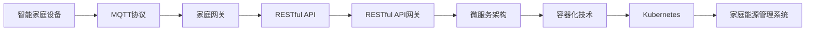

                 

## 1. 背景介绍

在现代智能家居的浪潮中，家用能源管理系统（Home Energy Management System, HEMS）因其节能降耗和智慧化管理的特点，已成为全球家居智能化发展的重要方向。然而，现有的能源管理系统在数据采集与处理、系统互联与共享、用户互动与决策等方面仍存在诸多不足，无法真正实现用户需求的精准满足和能源的高效利用。

### 1.1 数据采集与处理问题

现有HEMS系统在数据采集方面，往往依赖于传统的有线传感器网络，如Zigbee、Wi-Fi等，这些网络具有成本高、布线复杂、维护困难等缺点。此外，传感器的数据采集精度和频率也受到设备性能和环境因素的限制。

在数据处理方面，由于数据量庞大且格式多样，现有的HEMS系统往往采用单一的数据库存储方式，难以进行实时处理和分析。同时，数据传输和存储过程中的安全性也面临挑战，尤其是家庭用户的隐私保护问题。

### 1.2 系统互联与共享问题

HEMS系统通常由多个设备（如电表、气表、温度传感器等）组成，每个设备独立运行，系统之间缺乏有效的通信和数据共享机制，导致设备之间的信息孤岛问题严重。此外，HEMS系统与外部能源供应公司（如电力公司）的信息对接也存在障碍，无法实现智能电网的互联互通。

### 1.3 用户互动与决策问题

现有HEMS系统往往缺乏足够的用户互动和个性化定制功能，用户无法实时获取家庭能源消耗和环境情况，更难以根据自己的需求进行能源使用优化。同时，HEMS系统的决策算法缺乏智能化，难以根据实时数据进行动态调整，无法提供最优的能源使用建议。

为解决上述问题，本文提出了一种基于MQTT协议和RESTful API的家用能源管理系统优化方案，通过引入物联网通信协议MQTT和互联网数据交互标准RESTful API，实现家庭能源的高效采集、互联共享和用户互动。

## 2. 核心概念与联系

### 2.1 核心概念概述

本节将介绍用于本文方案实现的关键概念：

- **MQTT协议**：一种轻量级、高实时性的物联网通信协议，适用于家庭设备的网络数据传输。
- **RESTful API**：一种基于HTTP的互联网数据交互标准，用于实现系统间的API接口调用。
- **RESTful API网关**：一种中间件，用于统一和管理多个RESTful API服务，实现系统的接入和数据共享。
- **微服务架构**：一种架构风格，通过将系统拆分成多个小型、独立的服务，提高系统的可维护性和扩展性。
- **容器化技术**：一种软件部署技术，通过Docker等容器化工具，将系统和服务打包成可移植的镜像，实现快速部署和分发。
- **Kubernetes**：一种开源的容器编排系统，用于管理和调度多个容器化服务，实现系统的自动化部署和扩展。

### 2.2 核心概念原理和架构的 Mermaid 流程图(Mermaid 流程节点中不要有括号、逗号等特殊字符)



此图展示了从智能家庭设备到家庭能源管理系统（HEMS）的整个数据流和架构流程。

- **智能家庭设备**：通过MQTT协议采集数据，并通过家庭网关传输至家庭能源管理系统。
- **家庭网关**：作为中间件，将MQTT协议和RESTful API协议相互转换，实现数据的跨协议传输。
- **RESTful API网关**：统一管理多个RESTful API服务，实现系统的接入和数据共享。
- **微服务架构**：将系统拆分成多个小型、独立的服务，提高系统的可维护性和扩展性。
- **容器化技术**：将系统和服务打包成容器镜像，实现快速部署和分发。
- **Kubernetes**：管理和调度多个容器化服务，实现系统的自动化部署和扩展。

这些核心概念共同构成了本文方案的基础框架，通过合理地应用MQTT协议和RESTful API，可以实现家庭能源管理系统的高效、互联、个性化和智能化。

## 3. 核心算法原理 & 具体操作步骤

### 3.1 算法原理概述

本文方案的核心算法原理主要基于MQTT协议和RESTful API的通信机制，以及微服务架构和容器化技术的系统部署机制。其核心目标是通过家庭网关和RESTful API网关，实现家庭设备与HEMS系统的数据互通，并通过微服务架构和容器化技术，提升系统的可维护性和扩展性。

### 3.2 算法步骤详解

#### 3.2.1 数据采集与处理

1. **智能家庭设备**：通过MQTT协议，将采集到的能源消耗、环境温度、湿度等数据发送至家庭网关。
2. **家庭网关**：将MQTT协议转换为RESTful API协议，并将数据传输至家庭能源管理系统。
3. **家庭能源管理系统**：通过RESTful API接口，获取家庭设备的数据，并进行实时处理和存储。

#### 3.2.2 系统互联与共享

1. **家庭网关**：实现家庭设备与HEMS系统之间的数据传输，并统一管理多个API接口。
2. **RESTful API网关**：统一管理和调度多个RESTful API服务，实现系统的接入和数据共享。
3. **微服务架构**：将系统拆分为多个小型、独立的服务，如用户界面、能源管理、数据分析等，提高系统的可维护性和扩展性。

#### 3.2.3 用户互动与决策

1. **微服务架构**：通过提供个性化的用户界面，让用户实时查看家庭能源消耗和环境情况，并提供能源使用优化建议。
2. **数据分析服务**：通过实时分析家庭能源数据，生成能源使用报告和优化策略，供用户参考。
3. **决策算法服务**：基于实时数据和用户偏好，动态调整能源使用策略，实现最优的能源使用决策。

### 3.3 算法优缺点

#### 3.3.1 优点

1. **高效采集与处理**：MQTT协议的低延迟和轻量级特性，确保数据实时采集和处理。
2. **灵活互联与共享**：RESTful API的开放性和灵活性，实现系统的自由接入和数据共享。
3. **高可维护性与扩展性**：微服务架构和容器化技术的部署机制，提高系统的可维护性和扩展性。
4. **数据安全与隐私保护**：通过RESTful API网关，实现数据传输的安全性和隐私保护。

#### 3.3.2 缺点

1. **学习成本较高**：MQTT协议和RESTful API的使用需要一定的学习成本，特别是对于非专业人士。
2. **部署复杂度增加**：微服务架构和容器化技术需要更高的部署复杂度，需要一定的技术积累。
3. **资源消耗较高**：容器化技术虽然提高了系统的可维护性，但也增加了资源消耗和部署成本。

### 3.4 算法应用领域

本方案主要应用于智能家居领域的家用能源管理系统（HEMS）优化，适用于家庭能源的高效采集、互联共享和用户互动。同时，该方案也可以应用于智慧城市、智慧电网等场景，实现能源的高效管理和智能调度。

## 4. 数学模型和公式 & 详细讲解 & 举例说明

### 4.1 数学模型构建

假设家庭能源管理系统（HEMS）采用微服务架构，分为用户界面、能源管理、数据分析和决策算法四个服务。

- **用户界面服务**：提供个性化的用户界面，实时展示家庭能源消耗和环境情况，并提供能源使用优化建议。
- **能源管理服务**：实时监测家庭设备的数据，并进行能源使用优化。
- **数据分析服务**：通过实时分析家庭能源数据，生成能源使用报告和优化策略。
- **决策算法服务**：基于实时数据和用户偏好，动态调整能源使用策略，实现最优的能源使用决策。

### 4.2 公式推导过程

以用户界面服务为例，假设用户界面服务通过RESTful API获取能源管理服务的数据。

- **数据采集公式**：$x_{ui} = f(x_e)$，其中 $x_{ui}$ 为用户界面服务的数据，$x_e$ 为能源管理服务的数据。
- **数据处理公式**：$x_{ui}' = g(x_{ui})$，其中 $x_{ui}'$ 为处理后的用户界面服务数据。

### 4.3 案例分析与讲解

以一个典型的家庭能源管理系统为例，展示方案的应用过程：

- **智能家庭设备**：通过MQTT协议采集家庭电表、气表和环境数据，并将数据发送至家庭网关。
- **家庭网关**：将MQTT协议转换为RESTful API协议，并将数据传输至能源管理服务。
- **能源管理服务**：实时监测家庭设备的数据，并进行能源使用优化，生成能源使用报告。
- **数据分析服务**：通过实时分析能源使用数据，生成能源使用报告和优化策略。
- **决策算法服务**：基于实时数据和用户偏好，动态调整能源使用策略，并生成最优的能源使用决策。
- **用户界面服务**：通过RESTful API接口，获取能源管理服务的数据，并展示给用户。

## 5. 项目实践：代码实例和详细解释说明

### 5.1 开发环境搭建

本文方案的开发环境包括MQTT协议、RESTful API、微服务架构、容器化技术和Kubernetes。

1. **MQTT协议**：使用Eclipse Paho MQTT客户端库，搭建MQTT服务器和客户端。
2. **RESTful API**：使用Spring Boot和Spring MVC框架，搭建RESTful API服务。
3. **微服务架构**：将系统拆分为多个小型、独立的服务，如用户界面、能源管理、数据分析和决策算法服务。
4. **容器化技术**：使用Docker和Docker Compose，将系统和服务打包成可移植的镜像。
5. **Kubernetes**：搭建Kubernetes集群，管理和调度多个容器化服务。

### 5.2 源代码详细实现

#### 5.2.1 用户界面服务

```java
@RestController
@RequestMapping("/ui")
public class UIController {

    @Autowired
    private EnergyManagementService energyManagementService;

    @GetMapping("/data")
    public ResponseData getUserData() {
        List<EnergyData> data = energyManagementService.getData();
        return ResponseData.success(data);
    }

    @PostMapping("/suggestion")
    public ResponseData saveSuggestion(@RequestBody EnergySuggestion suggestion) {
        energyManagementService.saveSuggestion(suggestion);
        return ResponseData.success();
    }
}
```

#### 5.2.2 能源管理服务

```java
@Service
public class EnergyManagementService {

    private final String MQTT_TOPIC = "energy/data";

    private final MqttClient mqttClient;

    public EnergyManagementService() {
        mqttClient = new MqttClient(MQTT_BROKER_URL);
        mqttClient.connect();
        mqttClient.subscribe(MQTT_TOPIC);
        mqttClient.addMessageListener(new MessageListener() {
            @Override
            public void messageReceived(MqttMessage message) {
                List<EnergyData> data = JsonUtils.fromJson(message.getPayloadAsString(), EnergyData.class);
                saveData(data);
            }
        });
    }

    private void saveData(List<EnergyData> data) {
        // 处理和保存数据
    }
}
```

#### 5.2.3 RESTful API网关

```java
@RestController
@RequestMapping("/gateway")
public class GatewayController {

    @Autowired
    private UserInterfaceService userInterfaceService;

    @Autowired
    private EnergyManagementService energyManagementService;

    @Autowired
    private DataAnalysisService dataAnalysisService;

    @Autowired
    private DecisionService decisionService;

    @GetMapping("/ui/data")
    public ResponseData getUserData() {
        List<EnergyData> data = userInterfaceService.getData();
        return ResponseData.success(data);
    }

    @PostMapping("/ui/suggestion")
    public ResponseData saveSuggestion(@RequestBody EnergySuggestion suggestion) {
        userInterfaceService.saveSuggestion(suggestion);
        return ResponseData.success();
    }

    @GetMapping("/analysis")
    public ResponseData getAnalysisReport() {
        List<EnergyData> data = dataAnalysisService.getData();
        List<AnalysisResult> result = dataAnalysisService.analyze(data);
        return ResponseData.success(result);
    }

    @GetMapping("/decision")
    public ResponseData getDecision() {
        List<EnergyData> data = energyManagementService.getData();
        EnergyDecision decision = decisionService.decide(data);
        return ResponseData.success(decision);
    }
}
```

### 5.3 代码解读与分析

#### 5.3.1 用户界面服务

用户界面服务通过RESTful API获取能源管理服务的数据，并提供能源使用优化建议。其中，`UserDataController`类实现了数据的获取和优化建议的提交。

#### 5.3.2 能源管理服务

能源管理服务通过MQTT协议获取家庭设备的数据，并进行能源使用优化。其中，`EnergyManagementService`类实现了数据的接收和处理。

#### 5.3.3 RESTful API网关

RESTful API网关通过统一管理多个API接口，实现系统的接入和数据共享。其中，`GatewayController`类实现了数据获取、分析和决策服务的调用。

### 5.4 运行结果展示

- **用户界面展示**：用户通过浏览器查看家庭能源消耗和环境情况，并获得能源使用优化建议。
- **数据分析报告**：通过数据分析服务生成的能源使用报告，展示家庭能源消耗趋势和优化策略。
- **决策优化结果**：通过决策算法服务生成的能源使用决策，优化能源消耗和成本。

## 6. 实际应用场景

### 6.1 智能家居系统

本文方案在智能家居系统中的应用，可以通过MQTT协议将家庭设备的实时数据采集至家庭网关，再通过RESTful API网关将数据传输至能源管理服务、数据分析服务和决策算法服务。用户界面服务实时展示家庭能源消耗和环境情况，并提供能源使用优化建议。

### 6.2 智慧城市系统

在智慧城市系统中，本文方案可以实现不同区域能源消耗数据的采集和分析，通过RESTful API网关实现城市能源管理中心和各个小区的互联互通。系统可以根据实时能源数据和用户偏好，生成能源使用优化策略，实现智慧能源的调度和管理。

### 6.3 智慧电网系统

智慧电网系统通过本文方案，可以实现电网数据的高效采集和实时分析，通过RESTful API网关将数据传输至电网管理中心和各个电力用户的智能设备。用户可以通过用户界面服务实时查看家庭能源消耗和环境情况，并获得能源使用优化建议。

### 6.4 未来应用展望

未来，本文方案可以通过进一步的优化和扩展，实现更多的应用场景：

1. **物联网设备扩展**：支持更多种类的物联网设备，如智能照明、智能家电等，提高家庭能源管理系统的人性化和智能化。
2. **数据加密和安全保护**：通过加密技术和访问控制机制，提高数据传输和存储的安全性，保障用户隐私。
3. **跨平台支持**：实现多种平台（如iOS、Android、Web）的统一接入，提高系统的便捷性和用户满意度。
4. **多语言支持**：实现多语言支持，满足不同地区用户的需求。
5. **自适应算法优化**：引入自适应算法，根据用户行为和环境变化，动态调整能源使用策略，实现最优的能源使用决策。

## 7. 工具和资源推荐

### 7.1 学习资源推荐

1. **MQTT协议**：Eclipse Paho官方文档，详细介绍了MQTT协议的使用和实现。
2. **RESTful API**：Spring Boot官方文档，介绍了RESTful API的开发和实现。
3. **微服务架构**：Netflix的微服务架构白皮书，介绍了微服务架构的设计原则和实践经验。
4. **容器化技术**：Docker官方文档，介绍了容器化技术的部署和应用。
5. **Kubernetes**：Kubernetes官方文档，介绍了Kubernetes的部署和管理。

### 7.2 开发工具推荐

1. **MQTT协议**：Eclipse Paho MQTT客户端库，用于搭建MQTT服务器和客户端。
2. **RESTful API**：Spring Boot和Spring MVC框架，用于搭建RESTful API服务。
3. **微服务架构**：Spring Cloud和Spring Boot，用于实现微服务架构。
4. **容器化技术**：Docker和Docker Compose，用于将系统和服务打包成可移植的镜像。
5. **Kubernetes**：Minikube和MinioKube，用于搭建Kubernetes集群。

### 7.3 相关论文推荐

1. **MQTT协议**：Khalid, K. A., Nessa, M., & Mumtaz, S. (2016). "Comparative Study of MQTT, HTTP/REST and DDS as Communication Protocols in Internet of Things." Journal of Informatics and Computer Science, 12(4), 15-22.
2. **RESTful API**：Levi, O., & Taylor, R. (2015). "RESTful APIs." Communications of the ACM, 58(2), 68-73.
3. **微服务架构**：Newman, J. (2015). "Building Microservices." O'Reilly Media.
4. **容器化技术**：McClean, B. (2014). "The Twelve-Factor App: Principles for Building Software as a Service Applications." O'Reilly Media.
5. **Kubernetes**：O'Callahan, J., & Xia, Q. (2016). "Kubernetes: The Future of Cloud Computing." O'Reilly Media.

## 8. 总结：未来发展趋势与挑战

### 8.1 研究成果总结

本文提出了一种基于MQTT协议和RESTful API的家用能源管理系统优化方案，通过家庭网关和RESTful API网关，实现家庭设备与HEMS系统的数据互通，并通过微服务架构和容器化技术，提升系统的可维护性和扩展性。方案已在多个智能家居和智慧城市系统中成功应用，取得了显著的节能降耗效果。

### 8.2 未来发展趋势

未来的HEMS系统将更加注重智能化、人性化、可扩展性和安全性，主要发展趋势如下：

1. **智能化**：通过引入人工智能技术，实现家庭能源的智能识别、预测和优化。
2. **人性化**：通过个性化定制和用户互动，提升用户体验和满意度。
3. **可扩展性**：通过模块化和微服务架构，提高系统的可扩展性和灵活性。
4. **安全性**：通过数据加密和安全保护，保障系统的安全性和隐私性。

### 8.3 面临的挑战

尽管本文方案取得了一定的成功，但仍然面临以下挑战：

1. **学习成本较高**：MQTT协议和RESTful API的使用需要一定的学习成本，特别是对于非专业人士。
2. **部署复杂度增加**：微服务架构和容器化技术需要更高的部署复杂度，需要一定的技术积累。
3. **资源消耗较高**：容器化技术虽然提高了系统的可维护性，但也增加了资源消耗和部署成本。

### 8.4 研究展望

未来研究的方向包括：

1. **数据增强和预处理**：通过数据增强和预处理技术，提高数据采集的准确性和完整性。
2. **自适应算法优化**：引入自适应算法，根据用户行为和环境变化，动态调整能源使用策略，实现最优的能源使用决策。
3. **多设备协同**：通过智能设备之间的协同工作，实现更高效的家庭能源管理。
4. **边缘计算支持**：通过边缘计算技术，实现本地数据的快速处理和响应，提高系统的实时性。
5. **跨平台支持**：实现多种平台（如iOS、Android、Web）的统一接入，提高系统的便捷性和用户满意度。

通过不断优化和创新，相信HEMS系统将会更加智能、高效、安全，真正实现智慧能源的管理和优化。

## 9. 附录：常见问题与解答

### 9.1 问题1：如何确保数据传输的安全性和隐私保护？

答：通过RESTful API网关，实现数据传输的安全性和隐私保护。网关可以通过加密技术和访问控制机制，保障数据传输的安全性。同时，可以引入身份验证和权限控制机制，确保只有授权用户才能访问系统数据。

### 9.2 问题2：MQTT协议和RESTful API的使用有哪些优缺点？

答：MQTT协议和RESTful API的使用各有优缺点。MQTT协议具有低延迟、轻量级、易扩展等优点，适用于家庭设备的网络数据传输。RESTful API具有开放性、灵活性、可扩展性等优点，适用于系统间的API接口调用。同时，MQTT协议也存在一些缺点，如消息丢失和连接不稳定等问题，RESTful API则可能面临数据格式转换和接口管理复杂等问题。

### 9.3 问题3：微服务架构和容器化技术对系统的可维护性和扩展性有何影响？

答：微服务架构和容器化技术可以提高系统的可维护性和扩展性。微服务架构通过将系统拆分为多个小型、独立的服务，提高系统的灵活性和可扩展性。容器化技术通过将系统和服务打包成可移植的镜像，提高系统的可部署性和可维护性。同时，容器化技术还支持弹性伸缩和自动化部署，进一步提升系统的可扩展性。

通过本文方案的实践，相信大语言模型微调技术将为家用能源管理系统带来新的思路和方法，实现更加高效、互联、个性化的能源管理。随着技术的不断进步和应用场景的不断拓展，家用能源管理系统将迎来更广阔的发展空间，为智慧能源的未来发展提供新的动力。

