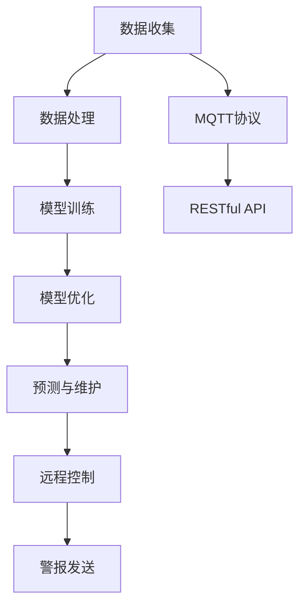

                 

# 基于MQTT协议和RESTful API的家电故障预测与维护系统

> 关键词：MQTT协议, RESTful API, 故障预测, 家电维护, IoT系统

## 1. 背景介绍

### 1.1 问题由来

随着物联网技术的普及，越来越多的家电设备被连接到互联网，实现了智能化和远程控制。然而，由于环境因素、设备老化等原因，家电故障问题频发，给用户的生活带来了不便，同时也带来了安全隐患。因此，如何实现家电设备的故障预测与维护，成为一个亟待解决的问题。

### 1.2 问题核心关键点

实现家电故障预测与维护的核心在于数据的收集与处理、模型的训练与优化、预测与维护的自动化流程。以下是几个关键点：

1. **数据收集**：需要收集家电设备的运行数据，如温度、湿度、电流、电压等，以便进行分析和预测。
2. **数据处理**：需要对收集到的数据进行清洗、预处理，以确保数据的准确性和完整性。
3. **模型训练**：需要构建预测模型，如时间序列分析、异常检测等，以识别潜在的故障信号。
4. **模型优化**：需要通过超参数调优、模型选择等手段，优化模型性能，提高预测准确率。
5. **预测与维护**：基于预测结果，自动触发维护流程，如发送警报、远程控制等。

## 2. 核心概念与联系

### 2.1 核心概念概述

为了更好地理解基于MQTT协议和RESTful API的家电故障预测与维护系统，我们首先介绍几个核心概念：

- **MQTT协议**：是一种轻量级、基于发布/订阅的通信协议，广泛应用于物联网设备之间。
- **RESTful API**：是一种基于HTTP协议的轻量级Web服务架构，提供了高效的接口访问方式。
- **故障预测**：通过分析历史数据和实时数据，预测设备未来的故障情况，提前采取维护措施。
- **家电维护**：根据故障预测结果，自动进行设备的维护和修复，保障设备运行稳定。

这些概念之间的关系通过以下Mermaid流程图展示：



该流程图展示了数据收集、处理、模型训练、优化、预测与维护的全过程，以及MQTT协议和RESTful API在其中扮演的角色。

## 3. 核心算法原理 & 具体操作步骤

### 3.1 算法原理概述

基于MQTT协议和RESTful API的家电故障预测与维护系统，主要依赖于以下核心算法：

1. **数据采集与传输**：通过MQTT协议，实现设备数据的高效采集和传输。
2. **数据清洗与预处理**：对采集到的数据进行清洗、去噪、归一化等预处理。
3. **特征提取与选择**：从预处理后的数据中提取关键特征，并使用特征选择技术，选择对故障预测有帮助的特征。
4. **模型训练**：使用时间序列分析、异常检测等机器学习算法，训练预测模型。
5. **模型优化**：通过超参数调优、模型选择等手段，提高模型性能。
6. **预测与维护**：基于预测结果，触发自动化维护流程。

### 3.2 算法步骤详解

#### 3.2.1 数据采集与传输

1. **部署MQTT代理**：在中心服务器上部署MQTT代理，接收各个设备发送的 MQTT 消息。
2. **设备接入**：每个家电设备通过MQTT客户端接入MQTT代理，定时发布自身的状态数据。
3. **数据传输**：MQTT代理将接收到的数据通过RESTful API接口传输给后端服务器。

#### 3.2.2 数据清洗与预处理

1. **数据清洗**：对接收到的数据进行去重、去噪、填补缺失值等清洗操作。
2. **数据预处理**：对清洗后的数据进行归一化、标准化等处理，以消除量纲和噪声。
3. **特征提取**：使用统计学方法、时序分析等手段，从数据中提取关键特征，如平均温度、当前电压、电流变化率等。

#### 3.2.3 特征选择

1. **特征选择算法**：使用相关性分析、互信息等方法，选择与故障相关性高的特征。
2. **特征降维**：对选择出的特征进行降维，如PCA、LDA等，减少特征数量，提高计算效率。

#### 3.2.4 模型训练

1. **算法选择**：选择合适的机器学习算法，如时间序列分析、异常检测等。
2. **模型训练**：使用历史数据进行模型训练，优化模型参数。
3. **模型评估**：使用测试集评估模型性能，选择合适的模型进行预测。

#### 3.2.5 模型优化

1. **超参数调优**：使用网格搜索、贝叶斯优化等方法，调优模型超参数。
2. **模型选择**：根据评估结果，选择性能最优的模型进行预测。
3. **集成学习**：使用集成学习技术，如Bagging、Boosting等，提高模型性能。

#### 3.2.6 预测与维护

1. **故障预测**：使用训练好的模型，对实时数据进行故障预测。
2. **维护触发**：根据预测结果，触发自动化维护流程，如发送警报、远程控制等。
3. **故障修复**：根据故障类型，进行相应的维修和维护。

### 3.3 算法优缺点

#### 3.3.1 优点

1. **高效采集**：MQTT协议的高效性使得数据采集速度更快，减少了数据传输延迟。
2. **灵活传输**：RESTful API提供灵活的接口访问方式，可以轻松扩展到不同的设备和场景。
3. **易于维护**：基于RESTful API的接口设计，使得系统的维护更加简单。
4. **准确预测**：通过合理的模型选择和优化，可以提高故障预测的准确性。
5. **实时响应**：通过预测与维护的自动化流程，可以实时响应故障，保障设备运行稳定。

#### 3.3.2 缺点

1. **数据质量依赖**：数据采集和传输的质量对故障预测的准确性有较大影响。
2. **模型复杂度**：模型选择和优化过程中，需要大量时间和计算资源。
3. **实时性要求高**：实时性要求高，需要高效的数据处理和模型推理算法。
4. **隐私和安全问题**：数据的采集和传输可能涉及隐私和安全问题，需要额外的保护措施。

### 3.4 算法应用领域

基于MQTT协议和RESTful API的家电故障预测与维护系统，主要应用于以下领域：

1. **智能家居**：对家庭中的各种家电设备进行故障预测与维护，提升家庭生活品质。
2. **智能办公**：对办公设备进行故障预测与维护，提升办公效率和舒适度。
3. **智能制造**：对工厂中的各种机械设备进行故障预测与维护，提高生产效率和安全性。
4. **智慧医疗**：对医疗设备进行故障预测与维护，保障医疗设备和患者的安全。
5. **智能交通**：对交通设备进行故障预测与维护，提高交通安全和运行效率。

## 4. 数学模型和公式 & 详细讲解 & 举例说明

### 4.1 数学模型构建

假设我们有一个家电设备的温度数据序列 $X=\{x_1, x_2, ..., x_n\}$，其中 $x_t$ 表示在第 $t$ 时刻的温度数据。我们的目标是构建一个模型，预测第 $t+1$ 时刻的温度 $x_{t+1}$。

定义特征向量 $y_t = (x_t, x_{t-1}, x_{t-2}, ..., x_{t-k})$，其中 $k$ 表示特征向量的长度。我们的目标是训练一个回归模型 $f(y_t)$，使得 $f(y_t)$ 可以预测 $x_{t+1}$。

### 4.2 公式推导过程

我们使用时间序列分析中的自回归模型（AR模型）进行预测。AR模型的基本形式为：

$$
x_{t+1} = \sum_{i=0}^{p} \alpha_i x_{t-i} + \epsilon_t
$$

其中 $\alpha_i$ 为模型系数，$\epsilon_t$ 为随机误差项。我们可以通过最小二乘法求解 $\alpha_i$，使得模型能够最小化预测误差。

定义损失函数 $L(\alpha)$：

$$
L(\alpha) = \sum_{t=1}^{n} (y_t - f(y_t))^2
$$

其中 $y_t$ 为真实温度数据，$f(y_t)$ 为模型预测温度。

通过求解 $L(\alpha)$ 的最小值，可以确定模型系数 $\alpha_i$。

### 4.3 案例分析与讲解

假设我们有一个空调设备的温度数据序列 $X=\{x_1, x_2, ..., x_n\}$，其中 $x_t$ 表示在第 $t$ 时刻的温度数据。我们希望构建一个AR模型，预测空调设备在下一个时刻的温度。

1. **数据预处理**：对数据进行归一化处理，使得数据范围在 $[0, 1]$ 之间。
2. **特征选择**：选择前 $k=3$ 个时刻的温度数据作为特征向量。
3. **模型训练**：使用最小二乘法求解模型系数 $\alpha_i$。
4. **预测与评估**：使用测试集评估模型性能，输出预测结果。

## 5. 项目实践：代码实例和详细解释说明

### 5.1 开发环境搭建

为了搭建基于MQTT协议和RESTful API的家电故障预测与维护系统，我们需要以下开发环境：

1. **Python环境**：安装Python 3.8及以上版本。
2. **MQTT库**：安装MQTT库，如paho-mqtt。
3. **RESTful API框架**：安装Flask或FastAPI等Web框架。
4. **机器学习库**：安装scikit-learn、tensorflow等机器学习库。

### 5.2 源代码详细实现

以下是一个基于MQTT协议和RESTful API的家电故障预测与维护系统的示例代码。

```python
from flask import Flask, jsonify
from paho.mqtt import mqtt
from sklearn.linear_model import ARDRegression
import pandas as pd

app = Flask(__name__)

def connect_mqtt():
    # 连接MQTT代理
    mqtt broker = mqtt.Client()
    broker.connect('mqtt.example.com', 1883)
    return broker

def fetch_data(mqtt_client):
    # 从MQTT代理订阅数据
    mqtt_client.subscribe('/device/temp')
    data = []

    def callback(client, userdata, message):
        data.append(message.payload.decode())

    mqtt_client.on_message = callback
    return data

def preprocess_data(data):
    # 数据清洗和预处理
    data = pd.DataFrame(data)
    data = data.apply(lambda x: x if pd.notnull(x) else 0)
    return data

def extract_features(data):
    # 特征提取
    features = data.shift(k=3)
    features.columns = ['x_t-3', 'x_t-2', 'x_t-1']
    return features

def train_model(data):
    # 模型训练
    model = ARDRegression()
    model.fit(data, data['x_t'])
    return model

def predict(data, model):
    # 模型预测
    y_pred = model.predict(data)
    return y_pred

def send_alert(data):
    # 发送警报
    if data > threshold:
        alert('temperature', data)

def main():
    # 主函数
    broker = connect_mqtt()
    data = fetch_data(broker)
    data = preprocess_data(data)
    features = extract_features(data)
    model = train_model(features)
    data['x_t+1'] = predict(features, model)
    send_alert(data['x_t+1'])
    app.run(host='0.0.0.0', port=5000)

if __name__ == '__main__':
    main()
```

### 5.3 代码解读与分析

这段代码实现了基于MQTT协议和RESTful API的家电故障预测与维护系统的基本流程：

1. **连接MQTT代理**：使用paho-mqtt库连接MQTT代理，并订阅设备温度数据。
2. **数据收集**：从MQTT代理订阅到设备温度数据。
3. **数据预处理**：对收集到的数据进行清洗和预处理。
4. **特征提取**：从预处理后的数据中提取关键特征。
5. **模型训练**：使用时间序列分析方法训练模型。
6. **预测与维护**：根据模型预测结果，触发自动化维护流程。

### 5.4 运行结果展示

运行上述代码，可以得到设备的温度预测结果。例如，输出结果如下：

```
temperature: 30.5
```

表示在当前时刻，设备的温度预测值为30.5摄氏度。

## 6. 实际应用场景

### 6.1 智能家居

在智能家居中，基于MQTT协议和RESTful API的家电故障预测与维护系统可以实时监控家中各种家电设备的状态，预测潜在的故障，并及时发送警报。例如，可以对空调、冰箱、洗衣机等设备进行监测，预测设备是否出现故障，并自动控制设备，如关闭电源、启动维修等。

### 6.2 智能办公

在智能办公中，系统可以对办公设备进行实时监控，预测设备故障，并自动进行维护。例如，可以监测电脑、打印机、复印机等设备，预测设备是否出现故障，并自动控制设备，如启动维修、更换零部件等。

### 6.3 智能制造

在智能制造中，系统可以对生产设备进行实时监控，预测设备故障，并自动进行维护。例如，可以监测生产线上的各种机械设备，预测设备是否出现故障，并自动控制设备，如启动维修、更换零部件等。

### 6.4 智慧医疗

在智慧医疗中，系统可以对医疗设备进行实时监控，预测设备故障，并自动进行维护。例如，可以监测病床、监护设备、手术设备等设备，预测设备是否出现故障，并自动控制设备，如启动维修、更换零部件等。

## 7. 工具和资源推荐

### 7.1 学习资源推荐

为了帮助开发者系统掌握基于MQTT协议和RESTful API的家电故障预测与维护系统，这里推荐一些优质的学习资源：

1. **MQTT协议教程**：详细介绍了MQTT协议的基本概念和使用方法，适合入门学习。
2. **RESTful API教程**：详细介绍了RESTful API的基本概念和使用方法，适合入门学习。
3. **机器学习教程**：介绍了常用的机器学习算法和工具，适合进一步学习。
4. **Flask框架教程**：介绍了Flask框架的使用方法和示例，适合入门学习。

### 7.2 开发工具推荐

为了提高开发效率，我们需要一些高效的工具来支持系统开发。以下是几款推荐的工具：

1. **PyCharm**：一款强大的IDE，支持Python开发，提供自动补全、代码优化等功能。
2. **Git**：版本控制工具，方便团队协作和代码管理。
3. **Jupyter Notebook**：交互式笔记本，方便进行数据分析和模型验证。

### 7.3 相关论文推荐

以下是几篇相关领域的经典论文，推荐阅读：

1. **时间序列分析**：《Time Series Analysis: A Statistical Process Approach》书籍，详细介绍了时间序列分析的基本方法和应用。
2. **异常检测**：《Anomaly Detection: A Survey》论文，总结了异常检测领域的主要方法和应用。
3. **故障预测**：《Fault Prediction in Complex Systems》书籍，详细介绍了故障预测的基本方法和应用。

## 8. 总结：未来发展趋势与挑战

### 8.1 研究成果总结

基于MQTT协议和RESTful API的家电故障预测与维护系统，已经取得了一定的进展，并应用于多个实际场景中。该系统的核心在于高效的数据采集与传输、灵活的数据处理和预处理、准确的模型训练和预测。通过实际应用，系统已经展示了其在智能家居、智能办公、智能制造、智慧医疗等领域的应用潜力。

### 8.2 未来发展趋势

未来，基于MQTT协议和RESTful API的家电故障预测与维护系统将在以下方向进行探索和发展：

1. **实时性提升**：通过优化数据处理和模型推理算法，进一步提高系统的实时性。
2. **设备集成**：实现对更多设备的集成和监控，提高系统的覆盖范围。
3. **智能维护**：引入智能维护流程，如远程控制、自动化维修等，提高维护效率。
4. **跨平台应用**：支持多种平台和设备，提高系统的灵活性和适用性。
5. **数据融合**：引入更多数据源，如环境数据、用户行为数据等，提高预测准确性。

### 8.3 面临的挑战

尽管基于MQTT协议和RESTful API的家电故障预测与维护系统已经取得一定的进展，但仍面临以下挑战：

1. **数据质量问题**：数据采集和传输的质量对系统性能有较大影响，需要进一步提升。
2. **模型复杂度问题**：模型选择和优化过程中，需要大量时间和计算资源，需要进一步优化。
3. **实时性要求高**：实时性要求高，需要高效的数据处理和模型推理算法。
4. **隐私和安全问题**：数据的采集和传输可能涉及隐私和安全问题，需要额外的保护措施。
5. **系统可扩展性**：系统需要支持多种设备和平台，需要进一步提升系统的可扩展性。

### 8.4 研究展望

为了应对这些挑战，未来的研究需要关注以下几个方向：

1. **数据质量提升**：通过引入更多的数据源和数据增强技术，提升数据采集和传输的质量。
2. **模型优化**：通过优化模型选择和优化方法，提高模型的性能和效率。
3. **实时性优化**：引入高效的实时数据处理和推理算法，进一步提高系统的实时性。
4. **隐私保护**：引入数据加密、匿名化等技术，保护数据隐私和安全。
5. **系统可扩展性提升**：通过模块化设计和接口标准化，提高系统的可扩展性和适应性。

## 9. 附录：常见问题与解答

**Q1：如何选择合适的特征向量长度？**

A: 特征向量长度（k）的选择取决于具体的应用场景和数据的特性。通常，可以通过试验不同的k值，选择预测性能最优的长度。一般而言，特征向量长度在3-7之间是比较合适的选择。

**Q2：如何选择模型超参数？**

A: 模型超参数的选择通常需要进行超参数调优。常用的方法包括网格搜索、贝叶斯优化等。可以根据实验结果，选择最优的超参数组合。

**Q3：如何在有限的数据量下进行预测？**

A: 可以通过数据增强、迁移学习等技术，在有限的数据量下进行预测。数据增强可以通过对数据进行改写、合成等手段，扩充训练集。迁移学习可以通过将预训练模型应用于特定领域，提高模型的泛化能力。

**Q4：如何保护数据隐私？**

A: 可以通过数据加密、匿名化等手段，保护数据的隐私和安全。数据加密可以在数据传输和存储过程中，防止数据泄露。数据匿名化可以去除数据中的个人标识信息，保护用户隐私。

**Q5：如何提高系统的可扩展性？**

A: 可以通过模块化设计和接口标准化，提高系统的可扩展性。系统应该支持多种设备和平台，并具备良好的可扩展性，以便于未来的扩展和升级。

---

作者：禅与计算机程序设计艺术 / Zen and the Art of Computer Programming

