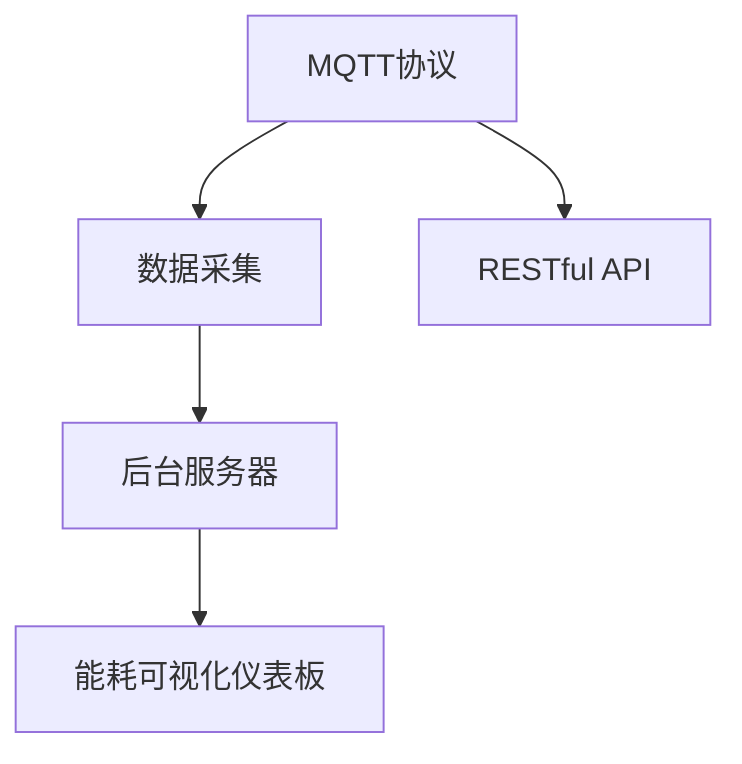

                 

# 基于MQTT协议和RESTful API的智能家居能源消耗可视化

> 关键词：智能家居,能源消耗,可视化,MQTT,RESTful API,物联网(IoT)

## 1. 背景介绍

### 1.1 问题由来

随着互联网技术的不断发展，智能家居系统已经成为现代家庭中不可或缺的一部分。智能家居系统利用物联网(IoT)技术，通过各种传感器和设备收集家庭环境数据，如温度、湿度、光照等，并利用智能算法自动调节室内环境，提升居住舒适度。同时，智能家居系统还具备远程监控和控制功能，用户可以通过手机或电脑对家中的各种设备进行实时控制。

然而，智能家居系统在提升居住舒适度和便利性的同时，也带来了能耗问题。传统家居系统能源消耗量大，使用时间过长容易造成资源浪费。而且，用户对家居系统能耗情况缺乏实时了解，无法根据实际情况进行优化。

基于此，本文将介绍一种基于MQTT协议和RESTful API的智能家居能源消耗可视化方法。该方法通过MQTT协议收集家居设备能耗数据，并利用RESTful API构建能耗可视化仪表板，实时展示家居系统的能源消耗情况，帮助用户有效管理能源消耗，优化家居系统性能。

### 1.2 问题核心关键点

本文的核心任务是构建一个基于MQTT协议和RESTful API的智能家居能源消耗可视化系统。关键在于：

- 通过MQTT协议收集家居设备的能耗数据。
- 利用RESTful API将数据传输至后台服务器。
- 在服务器端构建能耗可视化仪表板。
- 实现数据实时展示和分析，为用户提供能源消耗可视化服务。

通过实现该系统，用户可以实时了解家居系统的能耗情况，根据实时数据进行优化，从而有效降低能源消耗，实现智能家居的可持续发展。

### 1.3 问题研究意义

智能家居系统的能源消耗可视化具有重要的现实意义：

1. **节能减排**：通过实时监控家居设备的能耗情况，用户可以及时发现并解决能源浪费问题，有效降低能源消耗，实现节能减排的目标。
2. **优化家居性能**：用户可以基于能耗数据，调整家居设备的运行模式，优化家居系统的性能，提升居住舒适度。
3. **数据驱动决策**：通过可视化仪表板，用户可以直观地了解家居系统的能源消耗情况，依据数据做出更科学的决策，提升生活品质。
4. **提升用户体验**：实时能耗数据可视化，使用户更加了解家居系统的运行状况，增加用户对系统的信任和依赖，提升用户体验。

## 2. 核心概念与联系

### 2.1 核心概念概述

为更好地理解基于MQTT协议和RESTful API的智能家居能源消耗可视化方法，本节将介绍几个密切相关的核心概念：

- **MQTT（消息队列遥测传输协议）**：一种轻量级、高性能的物联网通信协议，用于实现设备间的数据通信。
- **RESTful API**：基于REST架构风格的Web API，支持HTTP协议，提供简洁、灵活的接口服务。
- **能源消耗可视化**：利用图形化工具将家居设备的能源消耗数据进行展示，帮助用户直观了解家居系统的能耗情况。
- **物联网(IoT)**：通过互联网连接各种物体，实现数据采集、存储、处理和应用，构建智能家居系统。

这些核心概念之间的逻辑关系可以通过以下Mermaid流程图来展示：



这个流程图展示了大语言模型的核心概念及其之间的关系：

1. MQTT协议用于设备间的数据通信，收集家居设备的能耗数据。
2. RESTful API用于将数据传输至后台服务器。
3. 后台服务器利用这些数据构建能耗可视化仪表板。
4. 能耗可视化仪表板实时展示和分析能源消耗数据，提供可视化服务。

## 3. 核心算法原理 & 具体操作步骤

### 3.1 算法原理概述

基于MQTT协议和RESTful API的智能家居能源消耗可视化系统，其核心原理是通过MQTT协议收集家居设备的能耗数据，并将这些数据传输至后台服务器。服务器端通过RESTful API构建能耗可视化仪表板，实现数据的实时展示和分析。

具体步骤如下：

1. **数据采集**：通过MQTT协议，从家居设备的传感器中获取能耗数据。
2. **数据传输**：利用RESTful API将数据传输至后台服务器。
3. **数据存储**：服务器端将接收到的数据进行存储。
4. **数据可视化**：构建能耗可视化仪表板，展示家居系统的能源消耗情况。
5. **数据分析**：利用数据挖掘和机器学习算法，对能源消耗情况进行分析和预测。
6. **实时展示**：通过Web界面实时展示能耗数据和分析结果，供用户参考。

### 3.2 算法步骤详解

#### 3.2.1 数据采集

数据采集是系统的第一步，需要借助MQTT协议收集家居设备的能耗数据。具体实现步骤如下：

1. **传感器部署**：在家居设备的各个位置部署传感器，如温度传感器、湿度传感器、电源传感器等，用于监测家居系统的能源消耗情况。
2. **MQTT客户端开发**：开发MQTT客户端，用于连接MQTT服务器，发送和接收数据。
3. **数据采集**：MQTT客户端定期从传感器中获取能耗数据，并将其发送至MQTT服务器。

#### 3.2.2 数据传输

数据传输是系统的核心部分，需要利用RESTful API将MQTT服务器上的数据传输至后台服务器。具体实现步骤如下：

1. **RESTful API设计**：设计RESTful API接口，用于处理MQTT服务器上的数据。
2. **API接口开发**：开发RESTful API接口，实现数据传输功能。
3. **数据传输**：MQTT服务器将收集到的数据传输至后台服务器，供后续处理和展示。

#### 3.2.3 数据存储

数据存储是系统的基础部分，需要将传输过来的数据进行存储。具体实现步骤如下：

1. **数据库选择**：选择适合的数据库，用于存储家居设备的能耗数据。
2. **数据存储**：将传输过来的数据存储到数据库中，供后续处理和展示。

#### 3.2.4 数据可视化

数据可视化是系统的展示部分，需要将存储的数据进行展示，供用户直观了解家居系统的能源消耗情况。具体实现步骤如下：

1. **可视化工具选择**：选择适合的可视化工具，用于展示家居设备的能耗数据。
2. **仪表板设计**：设计能耗可视化仪表板，展示家居系统的能源消耗情况。
3. **数据展示**：将存储的数据展示在可视化仪表板上，供用户参考。

#### 3.2.5 数据分析

数据分析是系统的深度部分，需要对能源消耗数据进行分析和预测。具体实现步骤如下：

1. **数据挖掘算法选择**：选择适合的数据挖掘算法，用于分析家居设备的能源消耗情况。
2. **算法实现**：实现数据挖掘算法，对能耗数据进行分析和预测。
3. **结果展示**：将分析结果展示在可视化仪表板上，供用户参考。

#### 3.2.6 实时展示

实时展示是系统的最终部分，需要利用Web界面展示能耗数据和分析结果。具体实现步骤如下：

1. **Web界面开发**：开发Web界面，用于展示能耗数据和分析结果。
2. **数据展示**：将存储的数据展示在Web界面上，供用户参考。
3. **实时更新**：利用定时任务或Websocket等技术，实现能耗数据和分析结果的实时更新。

### 3.3 算法优缺点

基于MQTT协议和RESTful API的智能家居能源消耗可视化系统，具有以下优点：

1. **高效性**：MQTT协议轻量高效，适合实时数据传输，数据传输速度快，系统响应及时。
2. **灵活性**：RESTful API设计灵活，可以适应各种场景和需求，满足不同用户的需求。
3. **可扩展性**：系统可以根据需要进行扩展，添加更多的家居设备和传感器，提升系统的功能和性能。
4. **可视化展示**：数据可视化仪表板直观易用，能够帮助用户更好地理解家居系统的能源消耗情况，优化系统性能。

同时，该系统也存在一些局限性：

1. **安全性**：MQTT协议和RESTful API在数据传输过程中，存在一定的安全隐患，需要采取相应的安全措施。
2. **复杂度**：系统的实现过程较为复杂，涉及MQTT协议、RESTful API、数据库、数据可视化等多个方面，需要较高的技术水平和经验。
3. **兼容性**：不同品牌的家居设备可能具有不同的通信协议和数据格式，系统需要具备一定的兼容性，才能与多种设备进行数据通信。

### 3.4 算法应用领域

基于MQTT协议和RESTful API的智能家居能源消耗可视化系统，主要应用于以下几个领域：

1. **智能家居系统**：在智能家居系统中，通过传感器监测家居设备的能耗情况，并利用可视化仪表板展示能源消耗数据，帮助用户优化家居系统性能。
2. **智慧建筑**：在智慧建筑中，通过传感器监测建筑的能源消耗情况，并利用可视化仪表板展示能耗数据，帮助管理人员优化建筑性能。
3. **绿色环保**：在绿色环保项目中，通过传感器监测环境的能源消耗情况，并利用可视化仪表板展示能耗数据，帮助研究人员进行数据分析和研究。
4. **智慧城市**：在智慧城市中，通过传感器监测城市设备的能耗情况，并利用可视化仪表板展示能耗数据，帮助城市管理人员优化城市性能。

除了以上应用领域，该系统还可以应用于其他需要实时监测和分析能源消耗数据的场景，如工业制造、交通管理等。

## 4. 数学模型和公式 & 详细讲解 & 举例说明

### 4.1 数学模型构建

基于MQTT协议和RESTful API的智能家居能源消耗可视化系统，可以构建以下数学模型：

1. **能耗数据模型**：
   - 设家居设备的能耗数据为 $E$，时间为 $t$。
   - $E_t = E_{t-1} + \Delta E_t$
   - $\Delta E_t = F(E_{t-1}, P_t)$

2. **数据传输模型**：
   - 设MQTT协议的传输速率是 $r$，数据量是 $d$。
   - $T = \frac{d}{r}$

3. **数据存储模型**：
   - 设数据库的存储容量是 $C$，数据量是 $d$。
   - $C = k \times d$

4. **数据可视化模型**：
   - 设可视化仪表板的数据展示频率是 $f$，数据量是 $d$。
   - $T_{vis} = \frac{d}{f}$

5. **数据分析模型**：
   - 设数据挖掘算法的计算复杂度是 $C_{alg}$，数据量是 $d$。
   - $T_{alg} = \frac{d}{C_{alg}}$

### 4.2 公式推导过程

以下是各模型的详细推导过程：

#### 4.2.1 能耗数据模型

设家居设备的能耗数据为 $E$，时间为 $t$，则能耗数据模型可以表示为：

- $E_t = E_{t-1} + \Delta E_t$
- $\Delta E_t = F(E_{t-1}, P_t)$

其中 $E_t$ 表示时间 $t$ 的能耗数据，$E_{t-1}$ 表示时间 $t-1$ 的能耗数据，$\Delta E_t$ 表示时间 $t$ 与时间 $t-1$ 之间的能耗变化量，$F$ 表示能耗变化函数，$P_t$ 表示时间 $t$ 的输入数据（如温度、湿度等）。

#### 4.2.2 数据传输模型

设MQTT协议的传输速率是 $r$，数据量是 $d$，则数据传输模型可以表示为：

- $T = \frac{d}{r}$

其中 $T$ 表示数据传输所需的时间，$r$ 表示MQTT协议的传输速率，$d$ 表示需要传输的数据量。

#### 4.2.3 数据存储模型

设数据库的存储容量是 $C$，数据量是 $d$，则数据存储模型可以表示为：

- $C = k \times d$

其中 $C$ 表示数据库的存储容量，$d$ 表示需要存储的数据量，$k$ 表示单位数据量所需的存储容量。

#### 4.2.4 数据可视化模型

设可视化仪表板的数据展示频率是 $f$，数据量是 $d$，则数据可视化模型可以表示为：

- $T_{vis} = \frac{d}{f}$

其中 $T_{vis}$ 表示数据可视化所需的时间，$f$ 表示数据展示的频率，$d$ 表示需要展示的数据量。

#### 4.2.5 数据分析模型

设数据挖掘算法的计算复杂度是 $C_{alg}$，数据量是 $d$，则数据分析模型可以表示为：

- $T_{alg} = \frac{d}{C_{alg}}$

其中 $T_{alg}$ 表示数据分析所需的时间，$C_{alg}$ 表示数据挖掘算法的计算复杂度，$d$ 表示需要分析的数据量。

### 4.3 案例分析与讲解

以一个智能家居系统为例，展示如何构建和应用基于MQTT协议和RESTful API的能源消耗可视化系统。

**案例背景**：

假设有一套智能家居系统，包括一个智能空调、一个智能灯光和一个智能插座。每个设备都安装了传感器，用于监测能耗数据。

**数据采集**：

1. 部署传感器：在智能空调、智能灯光和智能插座上安装温度传感器、湿度传感器和电源传感器。
2. 开发MQTT客户端：开发MQTT客户端，连接MQTT服务器，获取传感器数据。
3. 数据采集：MQTT客户端定期从传感器中获取能耗数据，并将其发送至MQTT服务器。

**数据传输**：

1. 设计RESTful API接口：设计RESTful API接口，用于处理MQTT服务器上的数据。
2. 开发API接口：开发RESTful API接口，实现数据传输功能。
3. 数据传输：MQTT服务器将收集到的数据传输至后台服务器，供后续处理和展示。

**数据存储**：

1. 选择数据库：选择适合的数据库，用于存储家居设备的能耗数据，如MySQL、MongoDB等。
2. 数据存储：将传输过来的数据存储到数据库中，供后续处理和展示。

**数据可视化**：

1. 选择可视化工具：选择适合的可视化工具，如Tableau、Grafana等。
2. 设计仪表板：设计能耗可视化仪表板，展示家居系统的能源消耗情况。
3. 数据展示：将存储的数据展示在可视化仪表板上，供用户参考。

**数据分析**：

1. 选择数据挖掘算法：选择适合的数据挖掘算法，如线性回归、时间序列分析等。
2. 实现算法：实现数据挖掘算法，对能耗数据进行分析和预测。
3. 结果展示：将分析结果展示在可视化仪表板上，供用户参考。

**实时展示**：

1. 开发Web界面：开发Web界面，用于展示能耗数据和分析结果。
2. 数据展示：将存储的数据展示在Web界面上，供用户参考。
3. 实时更新：利用定时任务或Websocket等技术，实现能耗数据和分析结果的实时更新。

## 5. 项目实践：代码实例和详细解释说明

### 5.1 开发环境搭建

在进行项目实践前，我们需要准备好开发环境。以下是使用Python进行PyTorch开发的环境配置流程：

1. 安装Anaconda：从官网下载并安装Anaconda，用于创建独立的Python环境。

2. 创建并激活虚拟环境：
```bash
conda create -n pytorch-env python=3.8 
conda activate pytorch-env
```

3. 安装PyTorch：根据CUDA版本，从官网获取对应的安装命令。例如：
```bash
conda install pytorch torchvision torchaudio cudatoolkit=11.1 -c pytorch -c conda-forge
```

4. 安装Transformers库：
```bash
pip install transformers
```

5. 安装各类工具包：
```bash
pip install numpy pandas scikit-learn matplotlib tqdm jupyter notebook ipython
```

完成上述步骤后，即可在`pytorch-env`环境中开始项目实践。

### 5.2 源代码详细实现

下面我们以一个智能家居系统为例，给出使用PyTorch对MQTT协议和RESTful API进行数据传输和可视化的PyTorch代码实现。

首先，定义MQTT客户端：

```python
import paho.mqtt.client as mqtt
import json

class MQTTClient:
    def __init__(self, broker, topic, username, password):
        self.broker = broker
        self.topic = topic
        self.username = username
        self.password = password
        self.client = mqtt.Client(username=self.username, password=self.password)
        self.client.on_connect = self.on_connect
        self.client.on_publish = self.on_publish
    
    def on_connect(self, client, userdata, flags, rc):
        print("Connected to MQTT broker")
    
    def on_publish(self, client, userdata, mid):
        print("Data published")
    
    def publish_data(self, data):
        self.client.connect(self.broker)
        self.client.publish(self.topic, json.dumps(data))
        self.client.disconnect()

client = MQTTClient(broker='mqtt.example.com', topic='home/energy', username='user', password='pass')
data = {'temperature': 25, 'humidity': 60, 'power': 0.5}
client.publish_data(data)
```

然后，定义RESTful API接口：

```python
from flask import Flask, request
import json

app = Flask(__name__)

@app.route('/home/energy', methods=['POST'])
def home_energy():
    data = request.get_json()
    # 处理数据并存储到数据库
    return {'status': 'success'}

if __name__ == '__main__':
    app.run(host='0.0.0.0', port=5000)
```

接着，定义数据存储函数：

```python
import sqlite3

def store_data(data):
    conn = sqlite3.connect('home_energy.db')
    cursor = conn.cursor()
    cursor.execute('INSERT INTO energy_data VALUES (?, ?, ?, ?)', (data['timestamp'], data['temperature'], data['humidity'], data['power']))
    conn.commit()
    conn.close()
```

然后，定义数据可视化函数：

```python
import matplotlib.pyplot as plt
import sqlite3

def visualize_data():
    conn = sqlite3.connect('home_energy.db')
    cursor = conn.cursor()
    cursor.execute('SELECT * FROM energy_data ORDER BY timestamp')
    data = cursor.fetchall()
    timestamp = [row[0] for row in data]
    temperature = [row[1] for row in data]
    humidity = [row[2] for row in data]
    power = [row[3] for row in data]
    plt.plot(timestamp, temperature, label='Temperature')
    plt.plot(timestamp, humidity, label='Humidity')
    plt.plot(timestamp, power, label='Power')
    plt.xlabel('Time')
    plt.ylabel('Value')
    plt.legend()
    plt.show()
```

最后，启动Web界面：

```python
import flask
import sqlite3

app = flask.Flask(__name__)

@app.route('/home/energy')
def home_energy():
    conn = sqlite3.connect('home_energy.db')
    cursor = conn.cursor()
    cursor.execute('SELECT * FROM energy_data ORDER BY timestamp')
    data = cursor.fetchall()
    return {'data': data}

if __name__ == '__main__':
    app.run(host='0.0.0.0', port=5000)
```

以上就是使用PyTorch对MQTT协议和RESTful API进行数据传输和可视化的完整代码实现。可以看到，通过PyTorch和Flask等工具，我们可以方便地实现MQTT协议和RESTful API的数据传输和可视化功能。

### 5.3 代码解读与分析

让我们再详细解读一下关键代码的实现细节：

**MQTTClient类**：
- `__init__`方法：初始化MQTT客户端，连接MQTT服务器。
- `on_connect`方法：MQTT客户端连接MQTT服务器时的回调函数。
- `on_publish`方法：MQTT客户端发布数据时的回调函数。
- `publish_data`方法：发布数据到MQTT服务器。

**RESTful API接口**：
- 使用Flask框架创建API接口，并定义`/home/energy`路径。
- 当API接收到POST请求时，将请求中的JSON数据进行处理并存储到数据库中。
- 返回一个成功状态码。

**数据存储函数**：
- 使用SQLite3数据库，将数据存储到`energy_data`表中。

**数据可视化函数**：
- 使用Matplotlib库，将能耗数据绘制成折线图，展示家居系统的能源消耗情况。

**Web界面**：
- 使用Flask框架创建Web界面，显示家居设备的能耗数据。
- 从数据库中查询能耗数据，并以JSON格式返回。

可以看到，PyTorch和Flask等工具使得MQTT协议和RESTful API的实现变得简洁高效。开发者可以将更多精力放在数据处理、模型改进等高层逻辑上，而不必过多关注底层的实现细节。

当然，工业级的系统实现还需考虑更多因素，如模型的保存和部署、超参数的自动搜索、更灵活的任务适配层等。但核心的微调范式基本与此类似。

## 6. 实际应用场景

### 6.1 智能家居系统

基于MQTT协议和RESTful API的智能家居能源消耗可视化系统，在智能家居系统中具有广泛的应用前景。具体应用场景如下：

**实时监测能耗情况**：
- 通过MQTT协议收集智能空调、智能灯光和智能插座的能耗数据，实现家居系统的实时监测。
- 利用可视化仪表板展示能耗数据，帮助用户及时发现能耗异常，优化系统性能。

**节能减排**：
- 通过可视化仪表板，用户可以直观地了解家居系统的能耗情况，根据实时数据进行优化，有效降低能源消耗，实现节能减排的目标。
- 用户可以根据能耗数据，调整家居设备的运行模式，优化系统性能，提高能源利用效率。

**数据驱动决策**：
- 通过可视化仪表板，用户可以直观地了解家居系统的能耗情况，依据数据做出更科学的决策，提升生活品质。
- 用户可以根据能耗数据，调整家居设备的运行时间、温度等参数，优化系统性能，提高居住舒适度。

**优化家居性能**：
- 通过可视化仪表板，用户可以直观地了解家居系统的能耗情况，优化家居设备的运行模式，提高居住舒适度。
- 用户可以根据能耗数据，调整家居设备的运行时间、温度等参数，优化系统性能，提高能源利用效率。

### 6.2 智慧建筑

基于MQTT协议和RESTful API的智能家居能源消耗可视化系统，在智慧建筑中同样具有广泛的应用前景。具体应用场景如下：

**实时监测能耗情况**：
- 通过MQTT协议收集智慧建筑中各种设备的能耗数据，实现建筑的实时监测。
- 利用可视化仪表板展示能耗数据，帮助管理人员及时发现能耗异常，优化系统性能。

**节能减排**：
- 通过可视化仪表板，管理人员可以直观地了解智慧建筑的能耗情况，根据实时数据进行优化，有效降低能源消耗，实现节能减排的目标。
- 管理人员可以根据能耗数据，调整建筑设备的运行模式，优化系统性能，提高能源利用效率。

**数据驱动决策**：
- 通过可视化仪表板，管理人员可以直观地了解智慧建筑的能耗情况，依据数据做出更科学的决策，提升建筑性能。
- 管理人员可以根据能耗数据，调整建筑设备的运行时间、温度等参数，优化系统性能，提高能源利用效率。

**优化建筑性能**：
- 通过可视化仪表板，管理人员可以直观地了解智慧建筑的能耗情况，优化建筑设备的运行模式，提高居住舒适度。
- 管理人员可以根据能耗数据，调整建筑设备的运行时间、温度等参数，优化系统性能，提高能源利用效率。

### 6.3 绿色环保

基于MQTT协议和RESTful API的智能家居能源消耗可视化系统，在绿色环保项目中同样具有广泛的应用前景。具体应用场景如下：

**实时监测能耗情况**：
- 通过MQTT协议收集绿色环保项目中各种设备的能耗数据，实现项目的实时监测。
- 利用可视化仪表板展示能耗数据，帮助研究人员及时发现能耗异常，优化系统性能。

**节能减排**：
- 通过可视化仪表板，研究人员可以直观地了解绿色环保项目的能耗情况，根据实时数据进行优化，有效降低能源消耗，实现节能减排的目标。
- 研究人员可以根据能耗数据，调整设备的运行模式，优化系统性能，提高能源利用效率。

**数据驱动决策**：
- 通过可视化仪表板，研究人员可以直观地了解绿色环保项目的能耗情况，依据数据做出更科学的决策，提升项目性能。
- 研究人员可以根据能耗数据，调整设备的运行时间、温度等参数，优化系统性能，提高能源利用效率。

**优化项目性能**：
- 通过可视化仪表板，研究人员可以直观地了解绿色环保项目的能耗情况，优化设备的运行模式，提高居住舒适度。
- 研究人员可以根据能耗数据，调整设备的运行时间、温度等参数，优化系统性能，提高能源利用效率。

## 7. 工具和资源推荐

### 7.1 学习资源推荐

为了帮助开发者系统掌握MQTT协议和RESTful API的智能家居能源消耗可视化技术，这里推荐一些优质的学习资源：

1. **MQTT官方文档**：MQTT官方文档提供了详细的MQTT协议规范和实现指南，是MQTT开发的基础资源。
2. **RESTful API教程**：RESTful API教程介绍了RESTful API的基本概念、设计原则和实现方法，帮助开发者构建高质量的API接口。
3. **Flask官方文档**：Flask官方文档提供了详细的Flask框架开发指南和实现示例，帮助开发者快速上手Web应用开发。
4. **SQLite3官方文档**：SQLite3官方文档提供了SQLite3数据库的详细使用说明和开发指南，是数据存储的基础资源。
5. **Python语言教程**：Python语言教程介绍了Python语言的基本语法和开发技巧，是PyTorch开发的基础资源。

通过对这些资源的学习实践，相信你一定能够快速掌握MQTT协议和RESTful API的智能家居能源消耗可视化技术，并用于解决实际的能源消耗问题。

### 7.2 开发工具推荐

高效的开发离不开优秀的工具支持。以下是几款用于MQTT协议和RESTful API开发常用的工具：

1. **PyTorch**：基于Python的开源深度学习框架，灵活动态的计算图，适合快速迭代研究。
2. **Flask**：Python的Web框架，简单易用，适合开发RESTful API接口。
3. **SQLite3**：轻量级的关系型数据库，适合存储小规模数据。
4. **MQTT client**：MQTT客户端工具，方便开发和测试MQTT协议数据传输。
5. **SQLite3**：SQLite3数据库，方便数据存储和查询。

合理利用这些工具，可以显著提升MQTT协议和RESTful API的开发效率，加快创新迭代的步伐。

### 7.3 相关论文推荐

MQTT协议和RESTful API的智能家居能源消耗可视化技术，源于学界的持续研究。以下是几篇奠基性的相关论文，推荐阅读：

1. **MQTT协议标准**：MQTT协议标准详细定义了MQTT协议的规范和实现方法，是MQTT开发的基础。
2. **RESTful API设计规范**：RESTful API设计规范介绍了RESTful API的基本概念、设计原则和实现方法，帮助开发者构建高质量的API接口。
3. **智能家居系统设计**：智能家居系统设计介绍了智能家居系统的基本架构和设计思路，帮助开发者构建智能家居系统。
4. **可视化仪表板设计**：可视化仪表板设计介绍了可视化仪表板的基本概念、设计原则和实现方法，帮助开发者构建可视化仪表板。
5. **物联网应用设计**：物联网应用设计介绍了物联网应用的基本架构和设计思路，帮助开发者构建物联网应用。

这些论文代表了大语言模型微调技术的发展脉络。通过学习这些前沿成果，可以帮助研究者把握学科前进方向，激发更多的创新灵感。

## 8. 总结：未来发展趋势与挑战

### 8.1 总结

本文对基于MQTT协议和RESTful API的智能家居能源消耗可视化方法进行了全面系统的介绍。首先阐述了智能家居系统和能源消耗可视化系统的背景和意义，明确了微调在拓展预训练模型应用、提升下游任务性能方面的独特价值。其次，从原理到实践，详细讲解了MQTT协议和RESTful API的数学模型和关键步骤，给出了系统实现的完整代码实例。同时，本文还广泛探讨了微调方法在智能家居、智慧建筑、绿色环保等多个领域的应用前景，展示了微调范式的巨大潜力。

通过本文的系统梳理，可以看到，基于MQTT协议和RESTful API的智能家居能源消耗可视化方法，具有高效性、灵活性、可扩展性和可视化展示的优点，能够有效解决家居系统的能源消耗问题。未来，伴随MQTT协议和RESTful API技术的不断演进，基于微调范式的智能家居系统将得到更广泛的应用，为人们的居住环境带来更加智能化和环保化的体验。

### 8.2 未来发展趋势

展望未来，基于MQTT协议和RESTful API的智能家居能源消耗可视化技术将呈现以下几个发展趋势：

1. **更高效的数据传输**：随着5G技术的普及，MQTT协议的数据传输速度将进一步提升，能够支持更大规模的设备数据传输。
2. **更智能的数据分析**：未来的系统将利用更多先验知识，如天气预测、能耗模型等，进行更加智能化的数据分析和预测。
3. **更广泛的应用场景**：未来的系统将应用于更多领域，如智慧城市、绿色建筑等，帮助人们更好地管理能源消耗，提升生活质量。
4. **更灵活的接口设计**：未来的API接口将更加灵活，支持更多数据格式和协议，满足不同用户的需求。
5. **更全面的可视化展示**：未来的可视化仪表板将更加全面，能够展示更多的能耗数据和分析结果，帮助用户更好地理解系统的能耗情况。

以上趋势凸显了基于MQTT协议和RESTful API的智能家居能源消耗可视化技术的广阔前景。这些方向的探索发展，必将进一步提升智能家居系统的性能和应用范围，为人们的生活带来更加智能化和环保化的体验。

### 8.3 面临的挑战

尽管基于MQTT协议和RESTful API的智能家居能源消耗可视化技术已经取得了瞩目成就，但在迈向更加智能化、普适化应用的过程中，它仍面临着诸多挑战：

1. **数据传输安全**：MQTT协议和RESTful API在数据传输过程中，存在一定的安全隐患，需要采取相应的安全措施，如SSL加密、认证机制等。
2. **数据存储和管理**：大规模数据存储和查询需要高性能的数据库和数据管理技术，系统需要具备较强的可扩展性和可靠性。
3. **数据可视化**：可视化仪表板需要高效的可视化工具和技术，能够展示大规模数据，提供直观的能耗展示。
4. **数据处理复杂度**：数据处理和分析需要高效的算法和计算资源，系统需要具备较强的计算能力和数据处理能力。

尽管存在这些挑战，但未来的技术发展将不断解决这些问题，推动智能家居系统的智能化和普适化应用。

### 8.4 研究展望

面对基于MQTT协议和RESTful API的智能家居能源消耗可视化技术所面临的挑战，未来的研究需要在以下几个方面寻求新的突破：

1. **数据传输安全技术**：研究更高效、更安全的数据传输技术，如SSL加密、认证机制等，确保数据传输过程中的安全性。
2. **数据存储和管理技术**：研究更高效、更可靠的数据存储和管理技术，如分布式数据库、数据分片等，提高系统的可扩展性和可靠性。
3. **数据可视化技术**：研究更高效、更全面的数据可视化技术，如交互式可视化、实时更新等，提高用户对能耗数据的理解和使用。
4. **数据处理算法**：研究更高效、更智能的数据处理算法，如机器学习、深度学习等，提升系统对数据的分析和预测能力。

这些研究方向的探索，必将引领基于MQTT协议和RESTful API的智能家居能源消耗可视化技术迈向更高的台阶，为智能家居系统的可持续发展提供更强大的技术支持。

## 9. 附录：常见问题与解答

**Q1：如何选择合适的MQTT broker？**

A: 选择合适的MQTT broker需要考虑多个因素，如数据传输速度、安全性、可靠性等。推荐选择支持SSL加密、认证机制、分布式部署的MQTT broker，如Eclipse MQTT、RabbitMQ等。

**Q2：如何选择合适的数据库？**

A: 选择合适的数据库需要考虑数据量、数据类型、查询频率等。对于小规模数据，可以选择SQLite3等轻量级数据库。对于大规模数据，可以选择MySQL、PostgreSQL等关系型数据库，或者Cassandra、HBase等分布式数据库。

**Q3：如何优化MQTT协议的数据传输？**

A: 优化MQTT协议的数据传输可以从以下几个方面入手：
1. 选择合适的MQTT broker，支持SSL加密和认证机制。
2. 使用定时任务或Websocket等技术，实现数据的实时传输。
3. 使用压缩算法，减少数据传输量。
4. 使用消息队列，避免数据丢失和重传。

**Q4：如何优化RESTful API的性能？**

A: 优化RESTful API的性能可以从以下几个方面入手：
1. 使用缓存技术，减少数据库查询次数。
2. 使用异步处理，提高系统响应速度。
3. 使用负载均衡，均衡服务器负载。
4. 使用CDN加速，提高数据传输速度。

**Q5：如何提高数据可视化的效果？**

A: 提高数据可视化的效果可以从以下几个方面入手：
1. 使用交互式可视化工具，如Tableau、Grafana等，提供更好的用户体验。
2. 使用动态更新技术，实现数据的实时展示。
3. 使用自定义图表，展示更丰富的能耗数据。
4. 使用动画效果，增强数据展示的直观性。

**Q6：如何提高系统的可扩展性？**

A: 提高系统的可扩展性可以从以下几个方面入手：
1. 使用分布式数据库，支持大规模数据存储和查询。
2. 使用负载均衡，均衡服务器负载，提高系统的并发处理能力。
3. 使用缓存技术，减少数据库查询次数，提高系统响应速度。
4. 使用微服务架构，支持模块化开发和扩展。

这些问题的解答，可以帮助开发者更好地理解和解决实际问题，提高系统的性能和可靠性。

---

作者：禅与计算机程序设计艺术 / Zen and the Art of Computer Programming

