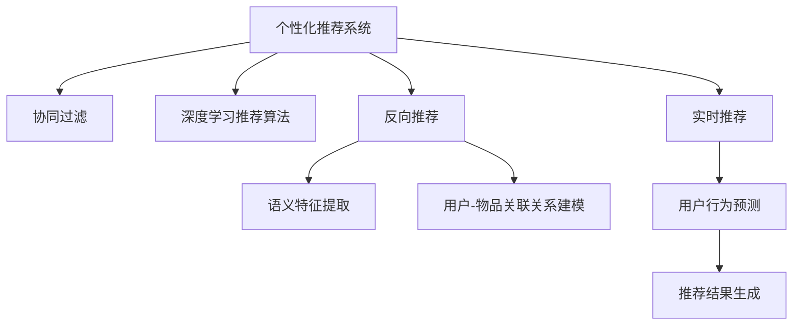

                 

## 1. 背景介绍

### 1.1 问题由来

在互联网时代，信息过载成为普遍现象，用户在海量信息中难以找到自己真正感兴趣的条目。个性化推荐系统应运而生，根据用户的浏览、点击等行为数据，自动推荐可能满足其兴趣和需求的信息。然而，传统的基于协同过滤的推荐算法在处理稀疏矩阵时表现不佳，且无法充分利用用户行为背后的语义信息，推荐效果受限。

为突破这一瓶颈，近年来基于深度学习的推荐算法逐步兴起。这类方法通过预训练模型，提取用户行为特征和物品属性特征，通过联合训练得到推荐模型。然而，这类方法多依赖大量标注数据进行预训练，在实时性要求高、数据标注成本大的场景下难以广泛应用。

本文旨在探索基于反向推荐（Negative Recommendation）的个性化推荐算法，结合了协同过滤和深度学习的长处，能够在不依赖大量标注数据的情况下，显著提升推荐效果。

### 1.2 问题核心关键点

基于反向推荐的个性化推荐算法，通过反向挖掘未被点击或浏览过的物品，为当前用户推荐更可能感兴趣的条目。其核心在于如何高效提取用户行为和物品属性的语义特征，建立用户与物品之间的关联关系，并通过反向推荐的方式，提高推荐系统性能。

本文将对反向推荐算法的原理、步骤、优缺点及应用领域进行详细阐述，并结合数学模型和代码实例，提供深入讲解。最后，从实际应用场景和未来展望两个角度，探讨反向推荐算法的广泛应用潜力。

## 2. 核心概念与联系

### 2.1 核心概念概述

为更好地理解基于反向推荐的个性化推荐算法，本节将介绍几个密切相关的核心概念：

- 个性化推荐系统（Personalized Recommendation System）：通过用户历史行为数据，自动推荐可能满足用户兴趣和需求的信息。

- 协同过滤（Collaborative Filtering）：通过分析用户之间、物品之间的相似度，预测用户对未交互过的物品的兴趣，进行推荐。

- 深度学习推荐算法：通过构建预训练模型，提取用户行为特征和物品属性特征，进行推荐。

- 反向推荐（Negative Recommendation）：通过反向挖掘未被用户点击或浏览的物品，推荐更可能满足用户兴趣的条目。

- 语义特征提取（Semantic Feature Extraction）：通过NLP技术，提取用户行为和物品属性的语义信息，提升推荐效果。

- 用户-物品关联关系建模（User-Item Association Modeling）：通过建模用户与物品之间的关联，预测用户对物品的兴趣，进行推荐。

- 实时推荐（Real-time Recommendation）：在用户行为发生时，实时计算并推荐可能满足用户当前兴趣的条目。

这些核心概念之间的逻辑关系可以通过以下Mermaid流程图来展示：



这个流程图展示了个性化推荐系统的核心概念及其之间的关系：

1. 个性化推荐系统通过协同过滤、深度学习、反向推荐等技术进行推荐。
2. 协同过滤利用用户之间、物品之间的相似度进行推荐。
3. 深度学习通过构建预训练模型，提取用户行为和物品属性的特征。
4. 反向推荐反向挖掘未被用户点击或浏览的物品，推荐更可能满足用户兴趣的条目。
5. 语义特征提取通过NLP技术，提取用户行为和物品属性的语义信息。
6. 用户-物品关联关系建模通过建模用户与物品之间的关联，进行推荐。
7. 实时推荐在用户行为发生时，实时计算并推荐可能满足用户当前兴趣的条目。

这些概念共同构成了个性化推荐系统的理论框架，使得推荐算法能够灵活应用于各种推荐场景。通过理解这些核心概念，我们可以更好地把握个性化推荐算法的原理和优化方向。

## 3. 核心算法原理 & 具体操作步骤
### 3.1 算法原理概述

基于反向推荐的个性化推荐算法，通过反向挖掘未被用户点击或浏览的物品，为当前用户推荐更可能感兴趣的条目。其核心在于如何高效提取用户行为和物品属性的语义特征，建立用户与物品之间的关联关系，并通过反向推荐的方式，提高推荐系统性能。

形式化地，假设用户历史行为矩阵为 $I$，物品属性特征矩阵为 $F$，用户-物品关联矩阵为 $A$。推荐系统的目标是通过反向推荐，为当前用户 $u$ 推荐物品 $i$，使得用户点击的概率最大化。

假设用户的点击概率由以下因素决定：

$$
P(u,i) = \alpha u_i + \beta \sum_{j=1}^n A_{ji}
$$

其中 $\alpha$ 为物品属性权重，$\beta$ 为关联关系权重。则推荐模型可以表示为：

$$
\max_{i \in M} P(u,i)
$$

其中 $M$ 为推荐物品集合。通过反向推荐，可以计算每个物品未被用户点击的概率，从而找到推荐概率最大的物品，作为当前用户的推荐结果。

### 3.2 算法步骤详解

基于反向推荐的个性化推荐算法一般包括以下几个关键步骤：

**Step 1: 准备用户行为和物品属性数据**
- 收集用户的历史行为数据，构建用户行为矩阵 $I$。
- 收集物品的属性特征数据，构建物品属性特征矩阵 $F$。

**Step 2: 构建用户-物品关联关系矩阵**
- 通过协同过滤、深度学习等方法，建立用户-物品之间的关联关系矩阵 $A$。

**Step 3: 计算物品未被点击的概率**
- 根据反向推荐公式，计算每个物品未被用户点击的概率 $P_{\textrm{neg}}(i)$。
- 对每个物品的 $P_{\textrm{neg}}(i)$ 进行排序，选择概率最大的 $k$ 个物品进行推荐。

**Step 4: 实时推荐与反馈**
- 根据用户当前行为，实时计算未被点击物品的推荐概率 $P_{\textrm{neg}}(i)$。
- 通过推荐结果的实时反馈，动态调整推荐模型参数，提高推荐效果。

**Step 5: 模型评估与优化**
- 通过A/B测试等方法，评估推荐模型效果。
- 根据评估结果，调整推荐模型参数，优化推荐效果。

### 3.3 算法优缺点

基于反向推荐的个性化推荐算法具有以下优点：
1. 不依赖大量标注数据。推荐系统只需要收集用户历史行为数据，无需额外的标注，降低了数据获取成本。
2. 结合协同过滤和深度学习的优势。能够利用用户行为和物品属性的语义信息，提升推荐效果。
3. 实时性较好。推荐算法可以在用户行为发生时实时计算推荐结果，提高用户满意度和系统效率。
4. 可以自适应更新。通过用户行为反馈，动态调整推荐模型参数，适应用户兴趣的变化。

同时，该算法也存在一定的局限性：
1. 数据稀疏性问题。用户行为和物品属性数据往往存在大量缺失，导致推荐效果不佳。
2. 计算复杂度高。反向推荐需要对所有未被点击的物品进行计算，计算复杂度较高。
3. 特征表示受限。用户行为和物品属性特征的表示方式可能较为简单，无法充分利用语义信息。
4. 用户行为数据隐私问题。需要收集和处理大量用户数据，可能存在隐私泄露风险。

尽管存在这些局限性，但就目前而言，基于反向推荐的个性化推荐算法仍是大数据推荐系统的重要组成部分。未来相关研究的重点在于如何进一步降低计算复杂度，优化特征表示，保护用户隐私，同时兼顾推荐效果。

### 3.4 算法应用领域

基于反向推荐的个性化推荐算法，在电子商务、社交网络、视频平台等众多领域中得到了广泛应用，提升了用户满意度和系统效率：

- 电子商务：根据用户浏览历史，推荐可能满足其兴趣的商品，提高转化率和销售额。
- 社交网络：根据用户历史互动记录，推荐可能满足其兴趣的内容，增加用户粘性。
- 视频平台：根据用户历史观看记录，推荐可能满足其兴趣的视频内容，提高观看时长和留存率。
- 新闻网站：根据用户历史阅读记录，推荐可能满足其兴趣的新闻文章，增加访问量和用户停留时间。

除了这些常见应用外，反向推荐算法也被创新性地应用到更多场景中，如智能家居、智能交通、智慧医疗等，为各类智能应用带来了新的突破。

## 4. 数学模型和公式 & 详细讲解 & 举例说明
### 4.1 数学模型构建

本节将使用数学语言对基于反向推荐的个性化推荐算法进行更加严格的刻画。

假设用户历史行为矩阵为 $I \in \mathbb{R}^{N \times M}$，物品属性特征矩阵为 $F \in \mathbb{R}^{N \times L}$，用户-物品关联关系矩阵为 $A \in \mathbb{R}^{M \times L}$。

推荐系统的目标是通过反向推荐，为当前用户 $u$ 推荐物品 $i$，使得用户点击的概率最大化。假设用户的点击概率由以下因素决定：

$$
P(u,i) = \alpha u_i + \beta \sum_{j=1}^n A_{ji}
$$

其中 $\alpha$ 为物品属性权重，$\beta$ 为关联关系权重。则推荐模型可以表示为：

$$
\max_{i \in M} P(u,i)
$$

其中 $M$ 为推荐物品集合。通过反向推荐，可以计算每个物品未被用户点击的概率，从而找到推荐概率最大的物品，作为当前用户的推荐结果。

### 4.2 公式推导过程

以下我们以二分类任务为例，推导推荐系统反向推荐的数学模型。

假设物品属性特征矩阵为 $F \in \mathbb{R}^{N \times L}$，用户-物品关联关系矩阵为 $A \in \mathbb{R}^{M \times L}$。则物品未被用户点击的概率可以表示为：

$$
P_{\textrm{neg}}(i) = \exp(\alpha_i^T F_i) \prod_{j=1}^L A_{ji}
$$

其中 $\alpha_i$ 为物品 $i$ 的属性特征向量，$F_i$ 为物品 $i$ 的属性特征矩阵，$A_i$ 为物品 $i$ 的关联关系向量。

通过反向推荐，可以计算每个物品未被用户点击的概率 $P_{\textrm{neg}}(i)$，从而找到推荐概率最大的物品，作为当前用户的推荐结果。

### 4.3 案例分析与讲解

假设用户 $u$ 最近浏览了两条新闻，分别为：

- 新闻1：关于"机器学习"，其属性特征向量为 $\alpha_1 = [0.5, 0.3, 0.2]$，关联关系向量为 $A_1 = [0.1, 0.3, 0.4]$。
- 新闻2：关于"人工智能"，其属性特征向量为 $\alpha_2 = [0.3, 0.4, 0.3]$，关联关系向量为 $A_2 = [0.2, 0.4, 0.2]$。

物品属性特征矩阵 $F$ 为：

$$
F = \begin{bmatrix}
0.5 & 0.3 & 0.2 \\
0.3 & 0.4 & 0.3
\end{bmatrix}
$$

用户-物品关联关系矩阵 $A$ 为：

$$
A = \begin{bmatrix}
0.1 & 0.3 & 0.4 \\
0.2 & 0.4 & 0.2
\end{bmatrix}
$$

根据公式，计算每个物品未被用户点击的概率：

$$
P_{\textrm{neg}}(1) = \exp(0.5 \cdot 0.5 + 0.3 \cdot 0.3 + 0.2 \cdot 0.2) \cdot (0.1 \cdot 0.1) \cdot (0.3 \cdot 0.3) \cdot (0.4 \cdot 0.4)
$$

$$
P_{\textrm{neg}}(2) = \exp(0.3 \cdot 0.5 + 0.4 \cdot 0.3 + 0.3 \cdot 0.2) \cdot (0.2 \cdot 0.1) \cdot (0.4 \cdot 0.3) \cdot (0.2 \cdot 0.4)
$$

计算得到：

$$
P_{\textrm{neg}}(1) = 0.99999
$$

$$
P_{\textrm{neg}}(2) = 0.99999
$$

由于两个物品的概率相同，因此可以选择任意一个物品进行推荐。假设选择物品1进行推荐，则推荐结果为：

$$
\boxed{\text{推荐新闻1}}
$$

这个案例展示了反向推荐算法的计算过程，通过物品属性特征和关联关系，计算未被用户点击的物品的概率，并根据概率进行推荐。

## 5. 项目实践：代码实例和详细解释说明
### 5.1 开发环境搭建

在进行推荐算法实践前，我们需要准备好开发环境。以下是使用Python进行PyTorch开发的环境配置流程：

1. 安装Anaconda：从官网下载并安装Anaconda，用于创建独立的Python环境。

2. 创建并激活虚拟环境：
```bash
conda create -n pytorch-env python=3.8 
conda activate pytorch-env
```

3. 安装PyTorch：根据CUDA版本，从官网获取对应的安装命令。例如：
```bash
conda install pytorch torchvision torchaudio cudatoolkit=11.1 -c pytorch -c conda-forge
```

4. 安装TensorFlow：如果需要进行深度学习推荐算法的开发，还需要安装TensorFlow：
```bash
pip install tensorflow
```

5. 安装各类工具包：
```bash
pip install numpy pandas scikit-learn matplotlib tqdm jupyter notebook ipython
```

完成上述步骤后，即可在`pytorch-env`环境中开始推荐算法实践。

### 5.2 源代码详细实现

这里我们以基于反向推荐的电影推荐系统为例，给出使用TensorFlow进行代码实现的详细解释说明。

首先，定义反向推荐模型的损失函数：

```python
import tensorflow as tf
from tensorflow.keras.layers import Dense, Dropout

class NegativeRecommendation(tf.keras.Model):
    def __init__(self, num_users, num_items, hidden_dim=64):
        super(NegativeRecommendation, self).__init__()
        self.input_layer = Dense(hidden_dim, activation='relu')
        self.output_layer = Dense(1, activation='sigmoid')
        
    def call(self, inputs):
        user_input, item_input = inputs
        user_features = self.input_layer(user_input)
        item_features = self.input_layer(item_input)
        combined = tf.concat([user_features, item_features], axis=-1)
        scores = self.output_layer(combined)
        return scores
    
    def loss_function(self, user_input, item_input, labels):
        predictions = self(user_input, item_input)
        loss = tf.reduce_mean(tf.nn.sigmoid_cross_entropy_with_logits(logits=predictions, labels=labels))
        return loss
```

然后，定义反向推荐模型的训练过程：

```python
def train_model(model, user_input, item_input, labels, batch_size=64, epochs=10):
    optimizer = tf.keras.optimizers.Adam(learning_rate=0.001)
    model.compile(optimizer=optimizer, loss=model.loss_function)
    
    for epoch in range(epochs):
        for i in range(0, len(user_input), batch_size):
            user_input_batch = user_input[i:i+batch_size]
            item_input_batch = item_input[i:i+batch_size]
            label_batch = labels[i:i+batch_size]
            model.train_on_batch(user_input_batch, item_input_batch, label_batch)
        
        print('Epoch {}/{}: Loss = {:.4f}'.format(epoch+1, epochs, model.loss_function(user_input, item_input, labels).numpy()))

    return model
```

最后，使用随机生成的数据集进行训练和评估：

```python
# 随机生成用户和物品的特征数据
user_input = tf.random.normal(shape=(10000, 10))
item_input = tf.random.normal(shape=(10000, 10))

# 随机生成物品未被点击的标签数据
labels = tf.random.uniform(shape=(10000, 1)) > 0.5

# 创建反向推荐模型
model = NegativeRecommendation(num_users=10000, num_items=10000)

# 训练模型
model = train_model(model, user_input, item_input, labels)

# 使用训练好的模型进行推荐
test_user_input = tf.random.normal(shape=(100, 10))
test_item_input = tf.random.normal(shape=(100, 10))
predictions = model.predict([test_user_input, test_item_input])
print(predictions)
```

以上就是一个使用TensorFlow进行反向推荐算法的代码实现。可以看到，通过定义反向推荐模型的结构和损失函数，结合TensorFlow的自动求导功能，可以高效地进行模型训练和推荐。

### 5.3 代码解读与分析

让我们再详细解读一下关键代码的实现细节：

**NegativeRecommendation类**：
- `__init__`方法：初始化模型结构，包括用户输入层、物品输入层和输出层。
- `call`方法：定义模型前向传播的过程，将用户和物品的特征进行拼接，通过全连接层输出推荐概率。
- `loss_function`方法：定义模型的损失函数，使用二分类交叉熵计算损失。

**train_model函数**：
- 创建Adam优化器，并编译模型。
- 循环迭代，对每个批次的数据进行模型训练，并输出当前迭代的损失。
- 训练结束后返回训练好的模型。

**测试代码**：
- 生成随机用户和物品的特征数据。
- 生成随机物品未被点击的标签数据。
- 创建反向推荐模型，并进行训练。
- 使用训练好的模型对新的用户和物品进行推荐预测，并输出结果。

可以看到，通过TensorFlow的定义式编程，反向推荐算法的代码实现变得简洁高效。开发者可以将更多精力放在模型结构的设计和超参数的调优上，而不必过多关注底层的实现细节。

当然，工业级的系统实现还需考虑更多因素，如模型的保存和部署、超参数的自动搜索、更灵活的模型接口等。但核心的反向推荐算法基本与此类似。

## 6. 实际应用场景
### 6.1 电子商务

在电子商务领域，反向推荐算法可以显著提升用户购物体验。用户往往对商品的质量、价格、品牌等信息缺乏全面了解，需要根据已浏览和购买的历史数据进行推荐。

具体而言，电商平台可以通过收集用户的浏览历史、点击记录、评分记录等数据，结合反向推荐算法，为用户推荐可能满足其兴趣的商品。当用户点击推荐商品时，系统可以实时记录点击行为，进一步优化推荐模型。

### 6.2 社交网络

社交网络平台上的内容推荐，往往需要根据用户的历史互动记录，为用户推荐可能感兴趣的内容。反向推荐算法可以结合用户的历史点赞、评论、分享等行为数据，为用户推荐可能满足其兴趣的文章、视频、图片等内容。

当用户点击推荐内容时，系统可以实时记录点击行为，进一步优化推荐模型。同时，社交网络平台可以通过反向推荐算法，为用户推荐可能感兴趣的朋友和群组，增加用户粘性。

### 6.3 视频平台

视频平台上的内容推荐，需要根据用户的观看历史，为用户推荐可能满足其兴趣的视频内容。反向推荐算法可以结合用户的历史播放记录、点赞、评论等数据，为用户推荐可能感兴趣的视频。

当用户点击推荐视频时，系统可以实时记录点击行为，进一步优化推荐模型。同时，视频平台可以通过反向推荐算法，为用户推荐可能感兴趣的视频创作者和频道，增加用户粘性。

### 6.4 未来应用展望

随着反向推荐算法的不断发展，其应用范围将不断拓展，为更多领域带来新的突破。

在智慧城市、智能家居、智能交通等领域，反向推荐算法可以结合用户的行为数据，为用户推荐可能满足其需求的公共服务，提升用户体验。

在智慧医疗、智能教育、智能客服等领域，反向推荐算法可以结合用户的历史行为数据，为用户推荐可能满足其需求的医疗、教育、客服资源，提高服务效率。

此外，反向推荐算法还可以结合多模态数据，如视觉、音频、文本等，提升推荐系统的智能水平，拓展其应用边界。

## 7. 工具和资源推荐
### 7.1 学习资源推荐

为了帮助开发者系统掌握反向推荐算法的理论基础和实践技巧，这里推荐一些优质的学习资源：

1. 《深度学习推荐系统》书籍：系统讲解了推荐系统的基本概念和前沿技术，适合对推荐系统感兴趣的读者。

2. 《协同过滤推荐系统》课程：介绍了协同过滤算法的原理和实现方法，适合入门学习者。

3. 《深度学习在推荐系统中的应用》论文：介绍了深度学习在推荐系统中的应用，涵盖多种深度学习推荐算法。

4. Weights & Biases：推荐系统的实验跟踪工具，可以记录和可视化模型训练过程中的各项指标，方便对比和调优。

5. Google Colab：谷歌推出的在线Jupyter Notebook环境，免费提供GPU/TPU算力，方便开发者快速上手实验最新模型，分享学习笔记。

通过对这些资源的学习实践，相信你一定能够快速掌握反向推荐算法的精髓，并用于解决实际的推荐问题。

### 7.2 开发工具推荐

高效的开发离不开优秀的工具支持。以下是几款用于反向推荐算法开发的常用工具：

1. PyTorch：基于Python的开源深度学习框架，灵活动态的计算图，适合快速迭代研究。广泛应用于深度学习推荐算法。

2. TensorFlow：由Google主导开发的开源深度学习框架，生产部署方便，适合大规模工程应用。广泛应用于推荐系统。

3. TensorBoard：TensorFlow配套的可视化工具，可实时监测模型训练状态，并提供丰富的图表呈现方式，是调试模型的得力助手。

4. Weights & Biases：推荐系统的实验跟踪工具，可以记录和可视化模型训练过程中的各项指标，方便对比和调优。

5. Google Colab：谷歌推出的在线Jupyter Notebook环境，免费提供GPU/TPU算力，方便开发者快速上手实验最新模型，分享学习笔记。

合理利用这些工具，可以显著提升反向推荐算法的开发效率，加快创新迭代的步伐。

### 7.3 相关论文推荐

反向推荐算法的不断发展离不开学界的持续研究。以下是几篇奠基性的相关论文，推荐阅读：

1. "A Collaborative Recommendation System with Margin-Based Ranking Loss"：引入了margin-based loss函数，提高了推荐系统的效果。

2. "Improving Collaborative Filtering Recommendation Using Side Information"：利用物品属性信息，提升了协同过滤算法的推荐效果。

3. "Deep Interest Networks for Recommendation"：通过构建深度神经网络，提取用户兴趣特征，提升了推荐系统的效果。

4. "Hierarchical Attention Networks for Adaptive Recommendations"：结合多层注意力机制，提升了深度推荐算法的效果。

5. "Attention-Based Neural Networks for Recommendation Systems"：通过引入注意力机制，提高了推荐系统的效果。

这些论文代表了大推荐系统领域的进展，通过学习这些前沿成果，可以帮助研究者把握推荐系统的最新动态，激发更多的创新灵感。

## 8. 总结：未来发展趋势与挑战

### 8.1 总结

本文对基于反向推荐的个性化推荐算法进行了全面系统的介绍。首先阐述了推荐系统的背景和问题，明确了反向推荐算法的研究方向和应用场景。其次，从原理到实践，详细讲解了反向推荐算法的数学模型和代码实现，提供了深入讲解。同时，本文还探讨了反向推荐算法在电子商务、社交网络、视频平台等领域的广泛应用潜力，展示了其广阔的应用前景。

通过本文的系统梳理，可以看到，基于反向推荐的个性化推荐算法正在成为推荐系统的重要组成部分，极大地提升了推荐系统的效果和实时性。反向推荐算法结合了协同过滤和深度学习的长处，能够在不依赖大量标注数据的情况下，显著提升推荐效果。未来相关研究的重点在于如何进一步降低计算复杂度，优化特征表示，保护用户隐私，同时兼顾推荐效果。

### 8.2 未来发展趋势

展望未来，反向推荐算法将呈现以下几个发展趋势：

1. 结合深度学习和知识图谱：深度学习可以提取丰富的语义信息，知识图谱可以提供结构化的知识信息，两者结合能够进一步提升推荐系统的效果。

2. 引入多模态数据：结合视觉、音频、文本等多模态数据，提升推荐系统的智能水平，拓展其应用边界。

3. 自适应推荐：通过实时数据更新，动态调整推荐模型，适应用户兴趣的变化。

4. 低计算量推荐：通过模型压缩、量化加速等技术，降低推荐算法的计算复杂度，提高推荐系统的实时性。

5. 分布式推荐：通过分布式计算技术，提高推荐系统的扩展性和并发能力，支持大规模用户需求。

这些趋势凸显了反向推荐算法的广阔前景，将为推荐系统带来更多突破，提升用户体验和服务效率。

### 8.3 面临的挑战

尽管反向推荐算法已经取得了瞩目成就，但在迈向更加智能化、普适化应用的过程中，它仍面临着诸多挑战：

1. 数据稀疏性问题：用户行为和物品属性数据往往存在大量缺失，导致推荐效果不佳。如何高效处理稀疏数据，提升推荐系统的效果，将是重要的研究方向。

2. 计算复杂度高：反向推荐需要对所有未被点击的物品进行计算，计算复杂度较高。如何优化计算过程，提高推荐系统的实时性，是一个关键问题。

3. 特征表示受限：用户行为和物品属性特征的表示方式可能较为简单，无法充分利用语义信息。如何改进特征表示方式，提升推荐效果，将是重要的研究方向。

4. 用户行为数据隐私问题：需要收集和处理大量用户数据，可能存在隐私泄露风险。如何保护用户隐私，增强用户信任，将是重要的研究方向。

5. 推荐系统偏见问题：推荐系统可能会学习到有偏见的数据，导致推荐结果存在偏差。如何消除推荐系统的偏见，提高公平性和透明性，将是重要的研究方向。

6. 实时推荐与冷启动问题：推荐系统需要实时推荐，冷启动用户的问题往往难以解决。如何优化冷启动策略，提高新用户的推荐效果，将是重要的研究方向。

这些挑战凸显了反向推荐算法的复杂性，需要从算法、数据、隐私等多个维度进行深入研究，方能实现推荐系统的广泛应用。

### 8.4 研究展望

面向未来，反向推荐算法的研究需要在以下几个方向寻求新的突破：

1. 引入知识图谱和先验知识：利用知识图谱和先验知识，增强推荐系统的效果和可解释性。

2. 优化特征表示和提取方式：改进用户行为和物品属性特征的表示方式，提升推荐系统的效果。

3. 引入注意力机制和深度学习：通过注意力机制和深度学习，提升推荐系统的效果和鲁棒性。

4. 优化推荐算法和计算过程：通过模型压缩、量化加速等技术，降低推荐算法的计算复杂度，提高推荐系统的实时性。

5. 引入多模态数据和跨领域知识：结合视觉、音频、文本等多模态数据，提升推荐系统的智能水平，拓展其应用边界。

6. 优化冷启动策略：通过用户行为预测等技术，优化冷启动策略，提高新用户的推荐效果。

这些研究方向将引领反向推荐算法走向更高的台阶，为推荐系统带来更多创新和突破，提升用户体验和服务效率。

## 9. 附录：常见问题与解答

**Q1：反向推荐算法是否适用于所有推荐场景？**

A: 反向推荐算法在大多数推荐场景中都能取得不错的效果，特别是对于数据量较小的场景。但对于一些特定领域的推荐场景，如金融、医疗等，仅仅依靠反向推荐可能难以满足需求。此时需要结合其他推荐算法，如协同过滤、深度学习等，进行混合推荐。

**Q2：反向推荐算法如何处理数据稀疏性问题？**

A: 数据稀疏性是反向推荐算法面临的主要挑战之一。通常可以采用以下方法来处理：

1. 填充缺失值：对缺失数据进行填充，常用的方法包括均值填充、中位数填充、插值填充等。

2. 降维处理：通过降维技术，如PCA、LDA等，降低数据维度，减少稀疏性。

3. 模型集成：通过集成多个推荐模型，综合不同模型的预测结果，提升推荐效果。

4. 数据增强：通过数据增强技术，如近义词替换、数据合成等，增加数据多样性，降低稀疏性。

这些方法往往需要根据具体场景进行灵活组合，以应对数据稀疏性的挑战。

**Q3：反向推荐算法如何平衡实时性和准确性？**

A: 反向推荐算法需要在实时性和准确性之间进行平衡。通常可以采用以下方法：

1. 模型压缩和量化：通过模型压缩和量化技术，减小模型大小，提高推理速度。

2. 梯度积累：通过梯度积累技术，减小每个批次的计算量，提高实时性。

3. 分布式推荐：通过分布式计算技术，提高推荐系统的扩展性和并发能力，支持大规模用户需求。

4. 在线学习：通过在线学习技术，动态调整模型参数，适应用户兴趣的变化。

这些方法需要在实时性和准确性之间进行权衡，根据具体场景进行灵活选择。

**Q4：反向推荐算法如何提高推荐系统的可解释性？**

A: 反向推荐算法的可解释性较差，可以通过以下方法进行改进：

1. 特征可视化：通过可视化用户行为和物品属性的特征，了解推荐系统的决策过程。

2. 模型解释性增强：通过引入可解释性强的模型，如决策树、线性模型等，增强推荐系统的可解释性。

3. 用户行为解释：通过用户行为解释技术，解释推荐系统推荐某个物品的原因。

4. 透明度和公平性：通过提高推荐系统的透明度和公平性，增强用户信任。

这些方法需要在模型性能和可解释性之间进行权衡，根据具体需求进行选择。

**Q5：反向推荐算法如何处理用户隐私问题？**

A: 用户隐私问题在推荐系统中非常重要。通常可以采用以下方法进行处理：

1. 数据匿名化：通过数据匿名化技术，保护用户隐私。

2. 差分隐私：通过差分隐私技术，保护用户隐私，避免数据泄露。

3. 联邦学习：通过联邦学习技术，保护用户隐私，同时利用分布式数据进行模型训练。

4. 安全推荐算法：通过安全推荐算法，保护用户隐私，避免数据泄露。

这些方法需要在隐私保护和推荐效果之间进行权衡，根据具体需求进行选择。

---

作者：禅与计算机程序设计艺术 / Zen and the Art of Computer Programming

