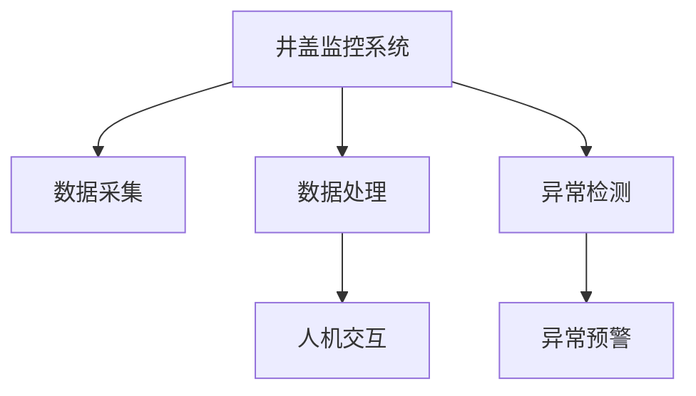

                 

# 基于大数据的井盖监控系统的设计与开发

## 1. 背景介绍

随着城市化进程的加速和基础设施的日益完善，井盖作为地下管网的出入口，在排水、供水、供电等方面发挥着至关重要的作用。然而，井盖失窃、破损、堵塞等问题频发，严重威胁着公共安全和城市环境。为了有效监测井盖状态，保障城市运行安全，许多城市开始构建井盖监控系统，通过传感器、摄像头等设备实时采集井盖数据，结合大数据分析技术，实现井盖状态的智能化监测和管理。

### 1.1 问题由来

井盖监控系统的核心目标是实现对井盖状态的实时监测和及时响应。井盖问题具有突发性强、影响范围广、处理复杂等特点，因此对监控系统的技术要求较高。传统的井盖监控系统依赖人工巡查，存在响应速度慢、覆盖率低、管理成本高等问题。而随着大数据和人工智能技术的发展，利用智能监控系统可以显著提高井盖管理的效率和安全性。

### 1.2 问题核心关键点

井盖监控系统的主要难点在于：
- **数据采集：** 需要大规模部署传感器和摄像头，实时采集井盖状态数据，避免遗漏和异常。
- **数据处理：** 海量数据需要高效的存储和处理，提取有价值的监控信息，减少误报和漏报。
- **模型训练：** 利用大数据训练先进的监测模型，实现对井盖状态的准确预测和异常识别。
- **异常预警：** 及时发现井盖异常并预警，自动化处理或通知维护人员，减少损失。
- **人机交互：** 设计友好的用户界面和交互流程，方便管理者和用户进行查询、分析和处理。

本文将从数据采集、数据处理、模型训练、异常预警和人机交互等几个关键环节，全面阐述基于大数据的井盖监控系统的设计与开发。

## 2. 核心概念与联系

### 2.1 核心概念概述

为更好地理解井盖监控系统的设计和开发过程，本节将介绍几个密切相关的核心概念：

- **井盖监控系统：** 基于物联网、传感器、大数据等技术，实现井盖状态实时监测和异常预警的系统。
- **数据采集：** 通过传感器、摄像头等设备，采集井盖状态数据的过程。
- **数据处理：** 对采集到的数据进行清洗、预处理、特征提取等操作，便于后续分析和建模。
- **异常检测：** 利用机器学习模型，识别井盖异常状态的算法和技术。
- **异常预警：** 将检测到的井盖异常信息，通过报警系统及时通知相关人员处理。
- **人机交互：** 系统与用户之间的交互界面和流程设计，提升用户体验和系统可操作性。

这些核心概念之间的逻辑关系可以通过以下Mermaid流程图来展示：



这个流程图展示井盖监控系统的核心概念及其之间的关系：

1. 井盖监控系统通过数据采集获取井盖状态信息。
2. 数据处理环节对采集到的数据进行预处理和特征提取。
3. 异常检测环节利用模型识别井盖异常。
4. 异常预警环节及时通知相关人员处理井盖问题。
5. 人机交互环节提供友好的用户界面和交互流程。

## 3. 核心算法原理 & 具体操作步骤

### 3.1 算法原理概述

基于大数据的井盖监控系统主要包含数据采集、数据处理、模型训练、异常预警和人机交互等环节，核心算法原理如下：

- **数据采集：** 利用物联网技术，部署传感器和摄像头，实时采集井盖状态数据，包括位置、温度、振动、图像等。
- **数据处理：** 对采集到的数据进行清洗、去噪、预处理、特征提取等操作，生成适合建模的数据集。
- **模型训练：** 利用大数据和深度学习模型，训练井盖状态监测模型，实现对井盖状态的预测和异常识别。
- **异常预警：** 在模型检测到井盖异常时，通过报警系统及时通知相关人员，快速响应处理。
- **人机交互：** 设计友好的用户界面和交互流程，提供井盖状态查询、历史数据分析等功能。

### 3.2 算法步骤详解

**Step 1: 数据采集**

1. **设备部署：** 在井盖周围部署各类传感器和摄像头，实时采集井盖位置、温度、振动、图像等数据。传感器包括温湿度传感器、水位传感器、振动传感器等，摄像头用于获取井盖图像和周围环境视频。
2. **数据传输：** 采集到的数据通过无线或有线网络传输到中央数据处理中心。

**Step 2: 数据处理**

1. **数据清洗：** 对采集到的数据进行去噪、去重、填补缺失值等操作，去除异常值和噪声。
2. **特征提取：** 利用机器学习和数据挖掘技术，从原始数据中提取关键特征，如井盖位置、温度变化、振动频率等。
3. **数据存储：** 将处理后的数据存储到数据库中，便于后续分析和建模。

**Step 3: 模型训练**

1. **数据划分：** 将历史数据划分为训练集、验证集和测试集，按照时间序列进行划分。
2. **模型选择：** 选择适合井盖状态监测的模型，如时间序列分析模型、卷积神经网络(CNN)、长短期记忆网络(LSTM)等。
3. **模型训练：** 利用训练集训练模型，使用验证集调整模型参数，确保模型泛化性能良好。

**Step 4: 异常预警**

1. **异常检测：** 利用训练好的模型对实时采集的数据进行预测，识别井盖异常状态。
2. **预警处理：** 在检测到井盖异常时，通过报警系统及时通知相关人员进行处理。

**Step 5: 人机交互**

1. **界面设计：** 设计直观易用的用户界面，提供井盖状态查询、异常信息展示、历史数据分析等功能。
2. **交互流程：** 提供简洁清晰的交互流程，使用户能够轻松地获取所需信息。

### 3.3 算法优缺点

基于大数据的井盖监控系统具有以下优点：
1. **实时监测：** 通过传感器和摄像头实时采集井盖状态数据，能够及时发现井盖异常。
2. **自动化处理：** 利用机器学习模型自动检测井盖异常，减少人工干预，提高效率。
3. **数据驱动：** 基于大量历史数据训练模型，模型准确性高，泛化能力强。
4. **预警机制：** 通过预警系统快速响应井盖问题，减少损失和影响。

同时，该系统也存在一定的局限性：
1. **设备成本高：** 传感器和摄像头的部署和维护成本较高，需要较高的资金投入。
2. **数据依赖性强：** 系统的性能高度依赖于数据的完整性和质量，数据采集和处理过程中容易出现遗漏和错误。
3. **模型复杂度高：** 训练模型需要大量的历史数据和计算资源，模型构建和维护较为复杂。
4. **实时性要求高：** 对系统硬件性能要求较高，需要实时处理大量数据。

尽管存在这些局限性，但就目前而言，基于大数据的井盖监控系统仍是目前井盖管理领域的先进技术方案，能够在很大程度上提高井盖管理的效率和安全性。未来，随着技术的发展和成本的降低，相信井盖监控系统将更加普及和高效。

### 3.4 算法应用领域

基于大数据的井盖监控系统主要应用于城市基础设施监测和管理，具体包括：

- **井盖状态监测：** 实时监测井盖位置、温度、振动等状态数据，预防井盖失窃、堵塞等问题。
- **井盖异常预警：** 通过异常检测模型，自动识别井盖异常，快速响应处理，避免事故发生。
- **井盖维护管理：** 提供井盖状态查询、历史数据分析等功能，辅助井盖维护人员进行决策和优化。
- **城市安全保障：** 利用井盖监控数据，分析城市运行状态，保障公共安全和环境卫生。

## 4. 数学模型和公式 & 详细讲解 & 举例说明

### 4.1 数学模型构建

井盖监控系统的核心模型包括时间序列预测模型和异常检测模型，其数学模型构建如下：

**时间序列预测模型：** 利用历史井盖状态数据，建立时间序列模型，预测未来井盖状态。常用的时间序列模型包括ARIMA、LSTM等。

**异常检测模型：** 利用机器学习算法，建立异常检测模型，识别井盖异常状态。常用的算法包括SVM、KNN、深度学习等。

### 4.2 公式推导过程

**时间序列预测模型：**
1. **ARIMA模型：** 自回归积分滑动平均模型，用于建立时间序列的线性关系。其数学表达式为：
   $$
   y_t = \phi_1 y_{t-1} + \phi_2 y_{t-2} + \cdots + \phi_p y_{t-p} + \epsilon_t + \theta_1 \epsilon_{t-1} + \theta_2 \epsilon_{t-2} + \cdots + \theta_d \epsilon_{t-d}
   $$
   其中，$\phi_i$ 为自回归系数，$\theta_j$ 为滑动平均系数，$\epsilon_t$ 为白噪声项。

2. **LSTM模型：** 长短期记忆网络，用于处理时间序列的非线性关系。其数学表达式为：
   $$
   h_t = \tanh(W_{ih} x_t + b_{ih} + W_{hh} h_{t-1} + b_{hh})
   $$
   $$
   \hat{y}_t = \text{softmax}(W_{hy} h_t + b_{hy})
   $$
   其中，$h_t$ 为LSTM隐藏层状态，$x_t$ 为输入数据，$W_{ih}$ 和 $W_{hh}$ 为LSTM权重矩阵，$b_{ih}$ 和 $b_{hh}$ 为偏置项，$W_{hy}$ 和 $b_{hy}$ 为输出权重矩阵。

**异常检测模型：**
1. **SVM模型：** 支持向量机，用于建立井盖状态与异常之间的分类关系。其数学表达式为：
   $$
   y = \text{sign}(\sum_{i=1}^{n} \alpha_i y_i \langle \mathbf{x}, \mathbf{x}_i \rangle + b)
   $$
   其中，$y$ 为分类结果，$\alpha_i$ 为支持向量系数，$\mathbf{x}$ 为输入数据，$\mathbf{x}_i$ 为训练样本，$b$ 为偏置项。

2. **KNN模型：** K最近邻，用于建立井盖状态与异常之间的距离关系。其数学表达式为：
   $$
   y = \text{argmin}_{k \in K} \|\mathbf{x} - \mathbf{x}_k\|
   $$
   其中，$k$ 为近邻数量，$\|\cdot\|$ 为欧几里得距离。

### 4.3 案例分析与讲解

**案例：井盖温度异常检测**
1. **数据准备：** 收集历史井盖温度数据，划分为训练集和测试集。
2. **模型选择：** 选择LSTM模型，建立时间序列预测模型。
3. **模型训练：** 利用训练集训练LSTM模型，使用验证集调整参数，得到最优模型。
4. **异常检测：** 利用训练好的LSTM模型对实时采集的温度数据进行预测，计算预测误差，识别异常。

## 5. 项目实践：代码实例和详细解释说明

### 5.1 开发环境搭建

在进行井盖监控系统的开发前，我们需要准备好开发环境。以下是使用Python进行PyTorch开发的环境配置流程：

1. 安装Anaconda：从官网下载并安装Anaconda，用于创建独立的Python环境。

2. 创建并激活虚拟环境：
```bash
conda create -n pytorch-env python=3.8 
conda activate pytorch-env
```

3. 安装PyTorch：根据CUDA版本，从官网获取对应的安装命令。例如：
```bash
conda install pytorch torchvision torchaudio cudatoolkit=11.1 -c pytorch -c conda-forge
```

4. 安装TensorFlow：使用pip安装TensorFlow。例如：
```bash
pip install tensorflow
```

5. 安装各类工具包：
```bash
pip install numpy pandas scikit-learn matplotlib tqdm jupyter notebook ipython
```

完成上述步骤后，即可在`pytorch-env`环境中开始井盖监控系统的开发。

### 5.2 源代码详细实现

下面我们以井盖温度异常检测为例，给出使用PyTorch对LSTM模型进行训练的代码实现。

```python
import torch
import torch.nn as nn
from torch.autograd import Variable
from torch.utils.data import DataLoader
import torch.optim as optim
from sklearn.model_selection import train_test_split

# 准备数据
def read_data(filename):
    with open(filename, 'r') as f:
        data = f.readlines()
    data = [float(x.strip()) for x in data]
    return data

# 数据预处理
def preprocess_data(data, seq_length):
    X, y = [], []
    for i in range(len(data) - seq_length):
        X.append(data[i:i+seq_length])
        y.append(data[i+seq_length])
    return torch.tensor(X, dtype=torch.float32), torch.tensor(y, dtype=torch.float32)

# 读取数据
data = read_data('temperature.txt')
X, y = preprocess_data(data, 5)

# 划分数据集
X_train, X_test, y_train, y_test = train_test_split(X, y, test_size=0.2, random_state=42)

# 定义LSTM模型
class LSTM(nn.Module):
    def __init__(self, input_size, hidden_size, output_size):
        super(LSTM, self).__init__()
        self.hidden_size = hidden_size
        self.lstm = nn.LSTM(input_size, hidden_size)
        self.fc = nn.Linear(hidden_size, output_size)
    
    def forward(self, x):
        batch_size = x.size(0)
        seq_length = x.size(1)
        hidden_init = self.init_hidden(batch_size)
        out, _ = self.lstm(x, hidden_init)
        out = self.fc(out[:, -1, :])
        return out
    
    def init_hidden(self, batch_size):
        return (Variable(torch.zeros(1, batch_size, self.hidden_size)), Variable(torch.zeros(1, batch_size, self.hidden_size)))

# 训练模型
def train(model, criterion, optimizer, X_train, y_train, X_test, y_test):
    batch_size = 64
    num_epochs = 100
    loss_func = nn.MSELoss()
    for epoch in range(num_epochs):
        model.train()
        for i in range(0, len(X_train), batch_size):
            start = i
            end = min(i+batch_size, len(X_train))
            inputs = X_train[start:end]
            targets = y_train[start:end]
            optimizer.zero_grad()
            outputs = model(inputs)
            loss = loss_func(outputs, targets)
            loss.backward()
            optimizer.step()
        model.eval()
        with torch.no_grad():
            for i in range(0, len(X_test), batch_size):
                start = i
                end = min(i+batch_size, len(X_test))
                inputs = X_test[start:end]
                targets = y_test[start:end]
                outputs = model(inputs)
                loss = loss_func(outputs, targets)
                print(f'Epoch {epoch+1}, Loss: {loss.item()}')

# 模型训练
X_train = X_train.unsqueeze(0)
X_test = X_test.unsqueeze(0)
y_train = y_train.unsqueeze(0)
y_test = y_test.unsqueeze(0)

input_size = 5
hidden_size = 64
output_size = 1
model = LSTM(input_size, hidden_size, output_size)
optimizer = optim.Adam(model.parameters(), lr=0.001)
train(model, nn.MSELoss(), optimizer, X_train, y_train, X_test, y_test)
```

以上代码实现了LSTM模型对井盖温度数据的训练，包括数据预处理、模型定义、训练循环等关键步骤。

### 5.3 代码解读与分析

让我们再详细解读一下关键代码的实现细节：

**read_data函数**：
- 读取井盖温度数据文件，转换为浮点型数组。

**preprocess_data函数**：
- 将原始数据切分为固定长度的序列，用于训练和测试。
- 定义X和y变量，分别用于存储输入数据和目标数据。

**LSTM模型类**：
- 定义LSTM模型的结构，包括输入大小、隐藏层大小和输出大小。
- 定义LSTM层和全连接层。
- 实现前向传播过程，计算输出结果。
- 定义隐藏层初始化函数。

**train函数**：
- 设置批量大小和训练轮数。
- 定义损失函数和优化器。
- 在每个epoch内，进行训练和验证。

**模型训练**：
- 定义输入和目标数据的维度。
- 构建LSTM模型实例。
- 定义优化器和损失函数。
- 调用train函数进行模型训练。

## 6. 实际应用场景

### 6.1 智能城市治理

基于大数据的井盖监控系统在智能城市治理中具有重要作用。通过实时监测井盖状态，可以及时发现井盖异常，预防城市灾害，保障公共安全。例如，在防洪排涝中，利用井盖监控数据可以及时发现堵塞井盖，避免雨水积压，保障城市排水系统的顺畅运行。

### 6.2 环境监测

井盖监控系统不仅限于井盖状态监测，还可以扩展到环境监测领域。通过在井盖周围部署传感器，实时采集环境数据，如水质、噪音、温度等，分析城市环境变化，提供科学的环境监测和管理方案。

### 6.3 应急响应

井盖监控系统能够快速响应城市突发事件。在遇到突发情况时，如交通事故、火灾等，系统能够及时发现井盖异常，快速调集救援力量，减少损失和影响。

### 6.4 未来应用展望

随着物联网技术和人工智能的不断发展，井盖监控系统将具备更强的自适应性和智能化水平。未来，井盖监控系统将实现以下功能：

1. **自学习：** 系统能够自动学习井盖状态的变化规律，无需人工干预。
2. **预测预警：** 通过分析历史数据，预测井盖状态，提前预警异常情况。
3. **协同管理：** 与城市其他监测系统协同工作，形成数据共享和融合的智能系统。
4. **用户定制：** 提供个性化定制服务，满足不同用户需求。
5. **跨平台应用：** 在移动设备、电脑、手机等终端上实现井盖监控数据查看和管理。

## 7. 工具和资源推荐

### 7.1 学习资源推荐

为了帮助开发者系统掌握井盖监控系统的设计与开发，这里推荐一些优质的学习资源：

1. 《Python深度学习》：涵盖深度学习基本概念和实现，是学习井盖监控系统开发的必备书籍。
2. 《机器学习实战》：通过实际案例讲解机器学习算法，适合理解井盖监控系统中的算法原理。
3. 《数据科学导论》：系统介绍数据处理、模型训练、数据可视化等技术，是学习井盖监控系统数据处理的重要资源。
4. 《深度学习框架TensorFlow》：详细讲解TensorFlow的使用和优化，有助于提高井盖监控系统开发的效率。
5. 《物联网技术与应用》：了解物联网的基本概念和应用场景，有助于理解井盖监控系统的数据采集和设备部署。

通过对这些资源的学习实践，相信你一定能够快速掌握井盖监控系统的设计与开发，并用于解决实际的井盖监测问题。

### 7.2 开发工具推荐

高效的开发离不开优秀的工具支持。以下是几款用于井盖监控系统开发的常用工具：

1. PyTorch：基于Python的开源深度学习框架，灵活动态的计算图，适合快速迭代研究。
2. TensorFlow：由Google主导开发的开源深度学习框架，生产部署方便，适合大规模工程应用。
3. Jupyter Notebook：交互式的代码编写和执行环境，适合快速验证算法和进行数据分析。
4. Matplotlib：数据可视化的常用工具，适合绘制井盖监控数据的曲线和图形。
5. Scikit-learn：机器学习算法的实现库，提供多种预处理和特征提取工具。

合理利用这些工具，可以显著提升井盖监控系统的开发效率，加快创新迭代的步伐。

### 7.3 相关论文推荐

井盖监控系统的发展离不开学界的持续研究。以下是几篇奠基性的相关论文，推荐阅读：

1. 《基于物联网技术的井盖监控系统研究》：介绍物联网技术在井盖监控中的应用，探讨系统的设计实现。
2. 《智能城市中的井盖监控系统》：研究智能城市环境下井盖监控系统的设计，提供实际案例。
3. 《大数据在井盖监控中的应用》：讨论大数据技术在井盖监控中的应用，分析数据处理和模型训练。
4. 《基于深度学习的井盖状态监测》：利用深度学习技术进行井盖状态监测，展示算法的实现和效果。
5. 《井盖异常检测与预警系统的设计与实现》：设计井盖异常检测与预警系统，提供系统架构和实现细节。

这些论文代表井盖监控系统的发展脉络。通过学习这些前沿成果，可以帮助研究者把握学科前进方向，激发更多的创新灵感。

## 8. 总结：未来发展趋势与挑战

### 8.1 总结

本文对基于大数据的井盖监控系统的设计与开发进行了全面系统的介绍。首先阐述了井盖监控系统的背景和意义，明确了系统的主要目标和关键技术点。其次，从数据采集、数据处理、模型训练、异常预警和人机交互等几个环节，详细讲解了井盖监控系统的核心算法原理和具体操作步骤。最后，通过实际应用场景和工具资源推荐，展示了井盖监控系统在实际应用中的价值和潜力。

通过本文的系统梳理，可以看到，基于大数据的井盖监控系统不仅在技术上具有前瞻性，而且在实际应用中也展现出强大的生命力。随着技术的不断进步，井盖监控系统将在城市安全、环境监测、应急响应等领域发挥越来越重要的作用。

### 8.2 未来发展趋势

展望未来，井盖监控系统将呈现以下几个发展趋势：

1. **物联网扩展：** 井盖监控系统将扩展到更广泛的物联网应用中，如道路监控、智能交通等，形成综合性的城市监测系统。
2. **数据融合：** 与城市其他监测系统协同工作，实现数据共享和融合，形成更大规模的智能系统。
3. **边缘计算：** 利用边缘计算技术，将数据处理和模型训练分布式部署，提高系统实时性和效率。
4. **AI算法优化：** 利用深度学习和强化学习等先进算法，优化井盖状态监测和异常检测。
5. **用户定制：** 提供个性化定制服务，满足不同用户需求，提升用户体验。
6. **跨平台应用：** 在移动设备、电脑、手机等终端上实现井盖监控数据查看和管理，提升用户交互体验。

以上趋势凸显了井盖监控系统的广阔前景，这些方向的探索发展，必将进一步提升井盖监控系统的智能化和信息化水平。

### 8.3 面临的挑战

尽管井盖监控系统已经取得了一定进展，但在迈向更加智能化、普适化应用的过程中，它仍面临着诸多挑战：

1. **设备部署成本：** 传感器和摄像头的部署和维护成本较高，需要较高的资金投入。
2. **数据质量和完整性：** 数据采集和处理过程中容易出现遗漏和错误，影响模型训练效果。
3. **模型复杂度：** 训练模型需要大量的历史数据和计算资源，模型构建和维护较为复杂。
4. **实时性要求高：** 对系统硬件性能要求较高，需要实时处理大量数据。
5. **系统集成：** 系统与其他城市监测系统集成难度大，需要综合考虑接口和数据格式等标准。

尽管存在这些挑战，但井盖监控系统已经展示了其在城市治理中的应用价值，未来随着技术的不断进步和成本的降低，相信将有更多的城市采用井盖监控系统，实现城市治理的智能化和信息化。

### 8.4 研究展望

面对井盖监控系统所面临的挑战，未来的研究需要在以下几个方面寻求新的突破：

1. **边缘计算优化：** 利用边缘计算技术，将数据处理和模型训练分布式部署，提高系统实时性和效率。
2. **多模态数据融合：** 融合视觉、声音、文本等多种数据源，提升系统监测和预警能力。
3. **自适应学习：** 利用自学习算法，使系统能够自动学习井盖状态的变化规律，无需人工干预。
4. **预测预警：** 通过分析历史数据，预测井盖状态，提前预警异常情况，提高系统应急响应能力。
5. **用户定制：** 提供个性化定制服务，满足不同用户需求，提升用户体验。
6. **跨平台应用：** 在移动设备、电脑、手机等终端上实现井盖监控数据查看和管理，提升用户交互体验。

这些研究方向将引领井盖监控系统向更高的台阶迈进，为构建智能、高效、可靠的城市监测系统提供坚实的基础。面向未来，井盖监控系统将与更多智能技术相结合，为城市治理带来新的突破和变革。

## 9. 附录：常见问题与解答

**Q1：井盖监控系统的数据采集有哪些关键技术？**

A: 井盖监控系统的数据采集主要依赖物联网技术和传感器技术，关键技术包括：
1. **传感器部署：** 在井盖周围部署各类传感器，实时采集井盖状态数据，如温湿度传感器、水位传感器、振动传感器等。
2. **摄像头监控：** 在井盖周围部署摄像头，实时采集井盖图像和周围环境视频。
3. **数据传输：** 采集到的数据通过无线或有线网络传输到中央数据处理中心。

**Q2：井盖监控系统的数据处理需要注意哪些问题？**

A: 井盖监控系统的数据处理需要注意以下几个问题：
1. **数据清洗：** 对采集到的数据进行去噪、去重、填补缺失值等操作，去除异常值和噪声。
2. **特征提取：** 利用机器学习和数据挖掘技术，从原始数据中提取关键特征，如井盖位置、温度变化、振动频率等。
3. **数据存储：** 将处理后的数据存储到数据库中，便于后续分析和建模。

**Q3：井盖监控系统如何实现异常检测？**

A: 井盖监控系统通过训练模型实现异常检测，关键步骤包括：
1. **数据划分：** 将历史数据划分为训练集和测试集，按照时间序列进行划分。
2. **模型选择：** 选择适合井盖状态监测的模型，如时间序列分析模型、卷积神经网络(CNN)、长短期记忆网络(LSTM)等。
3. **模型训练：** 利用训练集训练模型，使用验证集调整模型参数，确保模型泛化性能良好。
4. **异常检测：** 利用训练好的模型对实时采集的数据进行预测，识别井盖异常状态。

**Q4：井盖监控系统在实际应用中需要注意哪些问题？**

A: 井盖监控系统在实际应用中需要注意以下几个问题：
1. **设备成本：** 传感器和摄像头的部署和维护成本较高，需要较高的资金投入。
2. **数据质量和完整性：** 数据采集和处理过程中容易出现遗漏和错误，影响模型训练效果。
3. **模型复杂度：** 训练模型需要大量的历史数据和计算资源，模型构建和维护较为复杂。
4. **实时性要求高：** 对系统硬件性能要求较高，需要实时处理大量数据。
5. **系统集成：** 系统与其他城市监测系统集成难度大，需要综合考虑接口和数据格式等标准。

这些问题的解决，将直接关系到井盖监控系统的性能和可靠性，需要开发者在设计过程中充分考虑。

**Q5：井盖监控系统如何实现数据可视化？**

A: 井盖监控系统可以通过Matplotlib、Seaborn等数据可视化工具，实现数据可视化。具体实现步骤如下：
1. **数据准备：** 将井盖监控数据导入Python环境，转换为适合可视化的格式。
2. **绘图函数：** 使用Matplotlib的绘图函数，绘制曲线、柱状图、散点图等。
3. **展示界面：** 在Jupyter Notebook或Web应用中展示可视化结果。

通过数据可视化，用户可以更直观地理解井盖监控数据的变化趋势，发现潜在问题，提升系统管理效率。

---

作者：禅与计算机程序设计艺术 / Zen and the Art of Computer Programming

