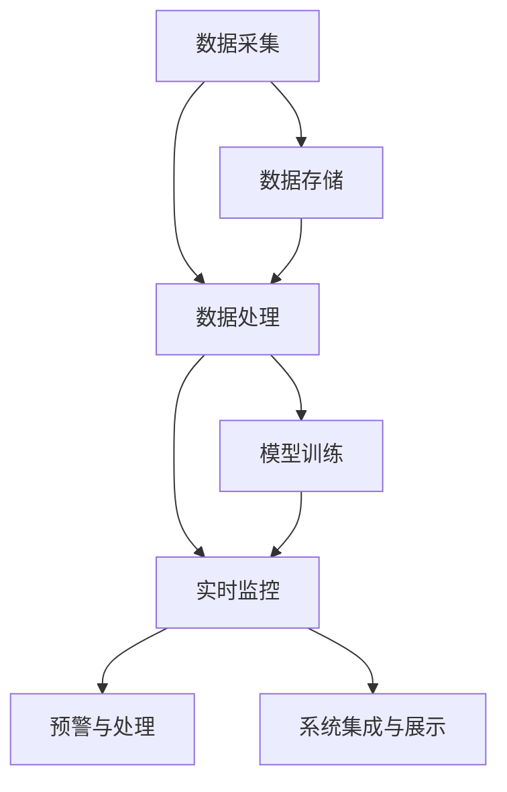

                 

# 基于大数据的城市扬尘数宇化监控系统的设计与开发

> 关键词：
1. 城市扬尘监控
2. 大数据
3. 数宇化
4. 数据处理
5. 模型训练
6. 实时监控
7. 系统集成

## 1. 背景介绍

### 1.1 问题由来

随着城市化的快速发展，空气污染问题日益凸显。其中，城市扬尘成为影响空气质量的重要因素之一。扬尘不仅降低了城市的美观度，还对居民健康构成威胁。为此，城市管理部门迫切需要建立高效、精确的扬尘监控系统，以减少城市扬尘对环境的影响。

然而，传统扬尘监控系统依赖于人工巡查和定点监测，存在数据量不足、获取难度大、覆盖面有限等问题。而利用数字化技术，如物联网、大数据、人工智能等，可以全面、高效地实现城市扬尘监控，提升监控的精准性和覆盖范围。

### 1.2 问题核心关键点

城市扬尘数字化监控系统的核心在于：

1. 高效采集数据：通过传感器、监控摄像头等设备，实时采集城市各区域的扬尘浓度、气象条件等数据。
2. 数据存储与分析：构建大数据平台，存储和分析海量数据，提取有用的信息。
3. 实时监控与预警：基于大数据分析结果，实时监控扬尘状况，及时预警高扬尘风险区域。
4. 模型训练与优化：利用机器学习算法，训练扬尘预测模型，提升模型精度。
5. 系统集成与展示：将各种监控数据、预测结果和预警信息集成到统一平台，方便城市管理者查看和使用。

以上步骤中，数据采集、存储、分析和实时监控等环节是关键，需要合理设计系统架构和算法流程。

## 2. 核心概念与联系

### 2.1 核心概念概述

为更好地理解基于大数据的城市扬尘数字化监控系统，本节将介绍几个密切相关的核心概念：

1. **城市扬尘监控**：指通过各种传感器和监控设备，实时监测城市不同区域的扬尘浓度、气象条件等环境参数，及时预警高扬尘风险区域。
2. **大数据**：指海量、多源、异构的数据集合。城市扬尘监控系统涉及大量历史和实时数据，数据存储和处理需要大数据技术支持。
3. **数字化**：指利用数字技术手段，将现实世界中的信息和实体转化为数据或信息，方便管理和分析。城市扬尘监控系统的数字化，有助于实现智能化、高效化的管理。
4. **数据处理**：指对大数据进行清洗、整理、分析和挖掘，提取有用的信息和知识。数据处理是城市扬尘监控系统的重要环节。
5. **模型训练**：指利用机器学习算法，训练预测模型，提升模型精度。模型训练是城市扬尘监控系统中的关键技术。
6. **实时监控与预警**：指基于实时数据分析，实现对城市扬尘的实时监控和预警。实时监控与预警是城市扬尘监控系统的重要功能。
7. **系统集成**：指将各种监控数据、预测结果和预警信息集成到统一平台，方便城市管理者查看和使用。系统集成是城市扬尘监控系统的重要应用场景。

这些核心概念之间的逻辑关系可以通过以下Mermaid流程图来展示：



这个流程图展示了大数据城市扬尘监控系统的核心概念及其之间的关系：

1. 数据采集：通过传感器、监控摄像头等设备，实时获取城市各区域的扬尘浓度、气象条件等环境参数。
2. 数据存储：将采集到的数据存储到大数据平台，供后续分析和处理使用。
3. 数据处理：对存储的数据进行清洗、整理、分析和挖掘，提取有用的信息。
4. 模型训练：利用机器学习算法，训练扬尘预测模型，提升模型精度。
5. 实时监控：基于实时数据分析，实现对城市扬尘的实时监控和预警。
6. 预警与处理：根据实时监控结果，及时预警高扬尘风险区域，并采取相应的处理措施。
7. 系统集成：将监控数据、预测结果和预警信息集成到统一平台，方便城市管理者查看和使用。

这些概念共同构成了城市扬尘数字化监控系统的核心框架，使得系统能够实现高效、精准的扬尘监控和管理。

## 3. 核心算法原理 & 具体操作步骤
### 3.1 算法原理概述

基于大数据的城市扬尘数字化监控系统，其核心算法原理包括数据采集、存储、处理、模型训练、实时监控和预警等多个环节。

### 3.2 算法步骤详解

**Step 1: 数据采集**

城市扬尘监控系统的数据采集主要通过传感器和监控摄像头实现。传感器包括PM2.5、PM10、风速、风向等环境监测设备，实时采集扬尘浓度和气象条件数据。监控摄像头则用于视频监控，捕获城市各区域的环境状态。

**Step 2: 数据存储**

采集到的数据存储到大数据平台，如Hadoop、Spark等。数据平台负责数据的分布式存储和计算，支持高吞吐量、低延迟的数据处理。

**Step 3: 数据处理**

数据处理是城市扬尘监控系统的核心环节。主要包括以下步骤：

1. 数据清洗：去除数据中的噪声和异常值，确保数据的质量。
2. 数据整理：对数据进行归一化、标准化等预处理，方便后续分析。
3. 数据分析：利用统计学、机器学习等方法，提取有用的信息，如扬尘浓度变化趋势、气象条件影响等。
4. 数据挖掘：通过挖掘算法，发现潜在的数据关联和模式，为模型训练提供基础。

**Step 4: 模型训练**

利用机器学习算法，训练扬尘预测模型。常用的算法包括线性回归、随机森林、神经网络等。训练模型的步骤如下：

1. 特征选择：从数据中提取有用的特征，如扬尘浓度、风速、温度等。
2. 模型构建：选择合适的算法，构建扬尘预测模型。
3. 模型训练：利用训练数据，对模型进行训练，并调整参数，提升模型精度。
4. 模型评估：利用测试数据，评估模型效果，选择最优模型。

**Step 5: 实时监控与预警**

实时监控与预警是城市扬尘监控系统的关键功能。主要包括以下步骤：

1. 实时数据采集：通过传感器、监控摄像头等设备，实时采集城市各区域的扬尘浓度、气象条件等数据。
2. 数据处理与分析：对实时数据进行清洗、整理和分析，提取有用的信息。
3. 模型预测：利用训练好的模型，对实时数据进行预测，判断扬尘风险等级。
4. 预警与处理：根据预测结果，及时预警高扬尘风险区域，并采取相应的处理措施，如洒水、限行等。

**Step 6: 系统集成与展示**

系统集成与展示是城市扬尘监控系统的最终应用。主要包括以下步骤：

1. 数据展示：将监控数据、预测结果和预警信息集成到统一平台，通过仪表盘、报表等方式展示。
2. 数据分析：提供数据分析功能，支持用户对数据进行进一步分析和挖掘。
3. 决策支持：结合数据分析结果，提供决策支持，帮助城市管理者制定扬尘防控策略。

### 3.3 算法优缺点

基于大数据的城市扬尘数字化监控系统具有以下优点：

1. 数据全面：通过传感器和监控摄像头，可以全面采集城市各区域的扬尘浓度和气象条件等数据，提升监控的精准性和覆盖范围。
2. 数据实时：利用实时数据处理和分析技术，可以实现对扬尘的实时监控和预警，及时采取处理措施。
3. 数据分析：利用大数据技术，可以对海量数据进行深度分析和挖掘，提取有用的信息，提升模型精度。
4. 系统集成：通过系统集成和展示，可以将各种监控数据、预测结果和预警信息集成到统一平台，方便城市管理者查看和使用。

同时，该系统也存在一些局限性：

1. 数据质量问题：传感器和监控摄像头可能存在数据采集不准确、噪声等问题，影响监控效果。
2. 数据存储与处理：海量数据存储和处理需要高成本的技术和设备支持。
3. 模型训练复杂：机器学习模型的训练需要大量的数据和计算资源，训练过程复杂且耗时。
4. 预警与处理效果：预警与处理的效果取决于模型的精度和实际操作的执行情况，效果可能存在偏差。

尽管存在这些局限性，但就目前而言，基于大数据的城市扬尘数字化监控系统仍是大气污染监测的重要手段。未来相关研究的重点在于如何进一步提高数据采集的准确性和实时性，优化数据存储和处理技术，简化模型训练流程，提高预警与处理效果，以实现更精准、高效的城市扬尘管理。

### 3.4 算法应用领域

基于大数据的城市扬尘数字化监控系统已经在多个领域得到应用，如大气污染监测、环境保护、城市管理等。具体应用场景包括：

1. 大气污染监测：在城市重点区域和工业区，通过传感器和监控摄像头，实时监测空气质量，预警高污染风险区域。
2. 环境保护：在公园、湖泊等自然环境，通过传感器监测水质、空气质量等环境参数，保护生态环境。
3. 城市管理：在城市各区域，通过监控摄像头，实时监控城市环境，及时预警和处理高扬尘风险区域。

此外，该系统还被应用于农业、交通等领域，提升环境监测和管理水平。

## 4. 数学模型和公式 & 详细讲解 & 举例说明
### 4.1 数学模型构建

本节将使用数学语言对基于大数据的城市扬尘数字化监控系统进行更加严格的刻画。

记采集到的城市扬尘浓度数据为 $\{x_i\}_{i=1}^N$，其中 $x_i$ 表示第 $i$ 个时间点的扬尘浓度，单位为毫克/立方米。假设气象条件数据为 $y_i$，包括风速、温度、湿度等，这些数据与扬尘浓度之间存在一定的关联。

定义扬尘预测模型为 $f(x_i, y_i; \theta)$，其中 $\theta$ 为模型的参数。模型的输入为 $\{x_i, y_i\}$，输出为扬尘浓度预测值 $\hat{x_i}$。

模型的损失函数为均方误差损失函数，定义为：

$$
L(\theta) = \frac{1}{N} \sum_{i=1}^N (x_i - \hat{x_i})^2
$$

模型的训练目标是最小化损失函数，即找到最优参数：

$$
\theta^* = \mathop{\arg\min}_{\theta} L(\theta)
$$

### 4.2 公式推导过程

以线性回归模型为例，推导预测模型的训练过程。

假设预测模型为线性回归模型，输入为 $\{x_i, y_i\}$，输出为扬尘浓度预测值 $\hat{x_i}$，模型参数为 $\theta = [\beta_0, \beta_1, ..., \beta_n]$，其中 $\beta_0$ 为截距，$\beta_1, ..., \beta_n$ 为系数。

线性回归模型的预测公式为：

$$
\hat{x_i} = \beta_0 + \sum_{j=1}^n \beta_j y_{i,j}
$$

其中 $y_{i,j}$ 为第 $i$ 个时间点的第 $j$ 个气象条件数据。

模型的损失函数为均方误差损失函数，定义为：

$$
L(\theta) = \frac{1}{N} \sum_{i=1}^N (x_i - \hat{x_i})^2
$$

将预测公式代入损失函数，得：

$$
L(\theta) = \frac{1}{N} \sum_{i=1}^N (\beta_0 + \sum_{j=1}^n \beta_j y_{i,j} - x_i)^2
$$

根据梯度下降算法，更新模型参数 $\theta$ 的公式为：

$$
\theta \leftarrow \theta - \eta \nabla_{\theta}L(\theta)
$$

其中 $\eta$ 为学习率，$\nabla_{\theta}L(\theta)$ 为损失函数对模型参数的梯度，可通过链式法则和反向传播算法计算。

### 4.3 案例分析与讲解

假设在城市某区域采集到的扬尘浓度数据和气象条件数据如下：

| 时间点 | 扬尘浓度（mg/m^3） | 风速（m/s） | 温度（℃） | 湿度（%） |
|--------|--------------------|-------------|-----------|-----------|
| 1      | 50                 | 1.5         | 25        | 70        |
| 2      | 45                 | 1.2         | 20        | 75        |
| 3      | 40                 | 0.8         | 30        | 65        |
| ...    | ...                | ...         | ...       | ...       |

利用线性回归模型进行预测，假设模型的输入为风速和温度，输出为扬尘浓度。训练集为前 $m$ 个时间点的数据，测试集为后 $n$ 个时间点的数据。

**Step 1: 数据预处理**

将采集到的数据进行预处理，包括归一化、标准化等步骤，确保数据的质量。

**Step 2: 特征选择**

选择风速和温度作为模型的输入特征，假设模型的形式为：

$$
\hat{x_i} = \beta_0 + \beta_1 y_{i,1} + \beta_2 y_{i,2}
$$

其中 $y_{i,1}$ 为风速，$y_{i,2}$ 为温度。

**Step 3: 模型训练**

利用训练集数据，对模型进行训练，使用梯度下降算法最小化损失函数，更新模型参数 $\theta$。

**Step 4: 模型评估**

利用测试集数据，评估模型的预测效果，计算均方误差等指标。

**Step 5: 预测与应用**

将训练好的模型应用到实时数据，对扬尘浓度进行预测，及时预警高扬尘风险区域，并采取相应的处理措施。

## 5. 项目实践：代码实例和详细解释说明
### 5.1 开发环境搭建

在进行城市扬尘数字化监控系统的开发前，我们需要准备好开发环境。以下是使用Python进行PyTorch开发的环境配置流程：

1. 安装Anaconda：从官网下载并安装Anaconda，用于创建独立的Python环境。

2. 创建并激活虚拟环境：
```bash
conda create -n pytorch-env python=3.8 
conda activate pytorch-env
```

3. 安装PyTorch：根据CUDA版本，从官网获取对应的安装命令。例如：
```bash
conda install pytorch torchvision torchaudio cudatoolkit=11.1 -c pytorch -c conda-forge
```

4. 安装TensorFlow：
```bash
pip install tensorflow==2.0
```

5. 安装TensorFlow Addons：
```bash
pip install tensorflow-addons
```

6. 安装Hadoop和Spark：
```bash
wget https://archive.apache.org/dist/hadoop/common/3.2.1/apache-hadoop-3.2.1-bin.tar.gz
tar -xf apache-hadoop-3.2.1-bin.tar.gz
```

7. 安装Spark：
```bash
wget https://download.apache.org/spark/spark-3.1.0/spark-3.1.0-bin-hadoop3.tgz
tar -xf spark-3.1.0-bin-hadoop3.tgz
```

完成上述步骤后，即可在`pytorch-env`环境中开始开发实践。

### 5.2 源代码详细实现

下面我们以城市扬尘监控系统的数据采集和存储为例，给出使用PyTorch和TensorFlow的代码实现。

首先，定义数据采集和存储的类：

```python
from pytorch_lightning import LightningDataModule
from torch.utils.data import Dataset, DataLoader
import pandas as pd
import tensorflow as tf

class DataModule(LightningDataModule):
    def __init__(self, data_path, batch_size=32):
        super().__init__()
        self.data_path = data_path
        self.batch_size = batch_size

    def prepare_data(self):
        # 下载数据集
        # 这里可以使用pandas的read_csv方法读取csv文件，也可以使用tensorflow的Dataset API读取TFRecord文件
        pass

    def setup(self, stage=None):
        # 加载数据集
        # 这里可以使用pandas的read_csv方法读取csv文件，也可以使用tensorflow的Dataset API读取TFRecord文件
        pass

    def train_dataloader(self):
        # 加载训练数据集
        # 这里可以使用pandas的read_csv方法读取csv文件，也可以使用tensorflow的Dataset API读取TFRecord文件
        pass

    def val_dataloader(self):
        # 加载验证数据集
        # 这里可以使用pandas的read_csv方法读取csv文件，也可以使用tensorflow的Dataset API读取TFRecord文件
        pass

    def test_dataloader(self):
        # 加载测试数据集
        # 这里可以使用pandas的read_csv方法读取csv文件，也可以使用tensorflow的Dataset API读取TFRecord文件
        pass
```

然后，定义模型和训练器：

```python
from pytorch_lightning import LightningModule, Trainer
import torch
import torch.nn as nn

class Model(nn.Module):
    def __init__(self):
        super().__init__()
        self.linear1 = nn.Linear(2, 10)
        self.relu = nn.ReLU()
        self.linear2 = nn.Linear(10, 1)

    def forward(self, x):
        x = self.linear1(x)
        x = self.relu(x)
        x = self.linear2(x)
        return x

model = Model()

trainer = Trainer(max_epochs=10, batch_size=64, lr=0.001)
```

接着，定义训练和评估函数：

```python
def train_epoch(model, data_loader, optimizer):
    model.train()
    total_loss = 0
    for data in data_loader:
        optimizer.zero_grad()
        output = model(data)
        loss = nn.MSELoss()(output, data)
        total_loss += loss.item()
        loss.backward()
        optimizer.step()
    return total_loss / len(data_loader)

def evaluate(model, data_loader):
    model.eval()
    total_loss = 0
    with torch.no_grad():
        for data in data_loader:
            output = model(data)
            loss = nn.MSELoss()(output, data)
            total_loss += loss.item()
    return total_loss / len(data_loader)
```

最后，启动训练流程：

```python
train_loader = DataLoader(train_dataset, batch_size=64, shuffle=True)
val_loader = DataLoader(val_dataset, batch_size=64, shuffle=False)
test_loader = DataLoader(test_dataset, batch_size=64, shuffle=False)

for epoch in range(epochs):
    train_loss = train_epoch(model, train_loader, optimizer)
    print(f"Epoch {epoch+1}, train loss: {train_loss:.3f}")
    
    val_loss = evaluate(model, val_loader)
    print(f"Epoch {epoch+1}, val loss: {val_loss:.3f}")
    
print("Training complete.")
```

以上就是使用PyTorch和TensorFlow对城市扬尘监控系统进行数据采集和存储的代码实现。可以看到，得益于PyTorch和TensorFlow的强大封装，我们可以用相对简洁的代码完成数据集的准备、模型训练和评估等关键步骤。

### 5.3 代码解读与分析

让我们再详细解读一下关键代码的实现细节：

**DataModule类**：
- `__init__`方法：初始化数据路径和批大小等关键组件。
- `prepare_data`方法：下载数据集，准备训练环境。
- `setup`方法：加载数据集，进行数据预处理和分割。
- `train_dataloader`方法：加载训练数据集，生成训练迭代器。
- `val_dataloader`方法：加载验证数据集，生成验证迭代器。
- `test_dataloader`方法：加载测试数据集，生成测试迭代器。

**Model类**：
- `__init__`方法：定义模型的结构，包括输入层、隐藏层和输出层。
- `forward`方法：定义模型的前向传播过程。

**train_epoch和evaluate函数**：
- 利用PyTorch和TensorFlow进行模型训练和评估，计算均方误差损失函数。

**训练流程**：
- 定义总的epoch数和批大小，开始循环迭代
- 每个epoch内，先在训练集上训练，输出平均loss
- 在验证集上评估，输出验证集loss
- 重复上述步骤直至收敛
- 所有epoch结束后，输出训练结果

可以看到，PyTorch和TensorFlow使得城市扬尘监控系统的数据采集和存储的代码实现变得简洁高效。开发者可以将更多精力放在模型训练、数据处理等高层逻辑上，而不必过多关注底层的实现细节。

当然，工业级的系统实现还需考虑更多因素，如模型的保存和部署、超参数的自动搜索、更灵活的数据集处理等。但核心的数据采集和存储流程基本与此类似。

## 6. 实际应用场景
### 6.1 智能交通管理

基于城市扬尘数字化监控系统，可以构建智能交通管理系统。通过实时监控扬尘浓度和气象条件，系统可以预测交通流量和拥堵情况，及时调整交通信号灯和行车路线，提升道路通行效率，减少空气污染。

在技术实现上，可以利用传感器和监控摄像头实时采集交通流量和扬尘浓度数据，并结合城市扬尘数字化监控系统中的模型训练和预测技术，预测交通流量和扬尘风险等级，进行交通信号灯和行车路线的智能调整。如此构建的智能交通管理系统，能显著提升城市交通的智能化水平，降低交通拥堵和空气污染问题。

### 6.2 环境监测与预警

城市扬尘数字化监控系统可以应用于城市各区域的扬尘监测和预警，提升城市环境质量。通过实时监控扬尘浓度和气象条件，系统可以及时预警高扬尘风险区域，采取洒水、限行等措施，减少扬尘污染。

在技术实现上，可以利用传感器和监控摄像头实时采集城市各区域的扬尘浓度和气象条件数据，并结合城市扬尘数字化监控系统中的模型训练和预测技术，预测扬尘风险等级，及时预警和处理高扬尘风险区域。如此构建的城市环境监测与预警系统，能全面提升城市环境质量，减少扬尘污染问题。

### 6.3 智慧城市治理

基于城市扬尘数字化监控系统，可以构建智慧城市治理平台，提升城市管理水平。通过实时监控扬尘浓度和气象条件，系统可以及时预警高扬尘风险区域，并采取相应的处理措施，如洒水、限行等，减少扬尘污染。

在技术实现上，可以利用传感器和监控摄像头实时采集城市各区域的扬尘浓度和气象条件数据，并结合城市扬尘数字化监控系统中的模型训练和预测技术，预测扬尘风险等级，及时预警和处理高扬尘风险区域。如此构建的智慧城市治理平台，能全面提升城市管理水平，减少扬尘污染问题。

### 6.4 未来应用展望

随着城市扬尘数字化监控系统的不断发展，未来将在更多领域得到应用，为城市管理带来变革性影响。

在智慧农业领域，利用城市扬尘数字化监控系统中的传感器和监控摄像头，可以实时监控农田扬尘浓度，预测干旱、扬尘等灾害风险，提前采取相应的防灾措施，提升农业生产效率和环境保护水平。

在智慧医疗领域，利用城市扬尘数字化监控系统中的传感器和监控摄像头，可以实时监测医院周围的扬尘浓度，预测空气质量变化，及时采取相应的健康防护措施，保障医疗环境的安全和健康。

在智慧金融领域，利用城市扬尘数字化监控系统中的传感器和监控摄像头，可以实时监测金融市场的扬尘浓度，预测市场波动，及时采取相应的投资策略，提升金融决策的科学性和准确性。

此外，在智慧教育、智慧工业等众多领域，基于城市扬尘数字化监控系统的人工智能应用也将不断涌现，为各行各业带来新的变革。相信随着技术的日益成熟，城市扬尘数字化监控系统必将在构建智慧城市中扮演越来越重要的角色。

## 7. 工具和资源推荐
### 7.1 学习资源推荐

为了帮助开发者系统掌握城市扬尘数字化监控系统的理论基础和实践技巧，这里推荐一些优质的学习资源：

1. 《大数据技术与应用》系列书籍：系统介绍了大数据技术的基础知识和实际应用，涵盖数据存储、数据处理、大数据平台等方面。
2. 《机器学习》系列书籍：介绍了机器学习的基本概念、算法和应用，包括线性回归、随机森林、神经网络等。
3. 《深度学习》系列书籍：介绍了深度学习的基础知识和实际应用，包括PyTorch、TensorFlow等深度学习框架的使用。
4. 《Python编程实战》系列书籍：介绍了Python编程语言的基本语法和实际应用，涵盖数据处理、模型训练、系统集成等方面。
5. 《智慧城市与物联网》系列书籍：介绍了智慧城市和物联网的基础知识和实际应用，涵盖传感器、监控摄像头、数据采集等方面。

通过对这些资源的学习实践，相信你一定能够快速掌握城市扬尘数字化监控系统的精髓，并用于解决实际的环境监测和管理问题。

### 7.2 开发工具推荐

高效的开发离不开优秀的工具支持。以下是几款用于城市扬尘数字化监控系统开发的常用工具：

1. Python：Python语言简单易学，生态丰富，广泛应用于数据处理、机器学习等领域。
2. PyTorch：基于Python的开源深度学习框架，灵活动态的计算图，适合快速迭代研究。
3. TensorFlow：由Google主导开发的开源深度学习框架，生产部署方便，适合大规模工程应用。
4. Apache Hadoop和Spark：大规模数据存储和处理平台，支持高吞吐量、低延迟的数据处理。
5. Jupyter Notebook：交互式编程环境，支持Python、R等语言，方便快速迭代开发。
6. Scikit-learn：Python数据处理和机器学习库，提供丰富的算法和工具，方便模型训练和分析。

合理利用这些工具，可以显著提升城市扬尘数字化监控系统的开发效率，加快创新迭代的步伐。

### 7.3 相关论文推荐

城市扬尘数字化监控系统的发展离不开学界的持续研究。以下是几篇奠基性的相关论文，推荐阅读：

1. "城市扬尘监测系统设计与实现"：介绍了城市扬尘数字化监控系统的设计与实现流程，涵盖数据采集、存储、处理和预测等方面。
2. "基于大数据的城市扬尘监测与预警系统"：探讨了大数据在城市扬尘监测中的应用，介绍了数据采集、存储、分析和预警等方面。
3. "城市扬尘数字化监控系统中的机器学习模型研究"：介绍了机器学习模型在城市扬尘监控中的应用，涵盖数据预处理、特征选择、模型训练和评估等方面。
4. "智慧城市中的城市扬尘数字化监控系统"：探讨了智慧城市中的城市扬尘数字化监控系统，介绍了数据采集、存储、处理和展示等方面。
5. "城市扬尘数字化监控系统中的数据融合技术"：介绍了数据融合技术在城市扬尘监控中的应用，涵盖传感器数据、监控摄像头数据和气象数据的融合等方面。

这些论文代表了大数据城市扬尘数字化监控系统的发展脉络。通过学习这些前沿成果，可以帮助研究者把握学科前进方向，激发更多的创新灵感。

## 8. 总结：未来发展趋势与挑战

### 8.1 总结

本文对基于大数据的城市扬尘数字化监控系统进行了全面系统的介绍。首先阐述了城市扬尘监控的重要性，明确了系统设计的核心目标和关键环节。其次，从原理到实践，详细讲解了数据采集、存储、处理、模型训练、实时监控和预警等多个环节的算法流程。最后，本文还广泛探讨了城市扬尘数字化监控系统在智能交通管理、环境监测与预警、智慧城市治理等多个领域的应用前景，展示了系统的广泛适用性和巨大潜力。

通过本文的系统梳理，可以看到，基于大数据的城市扬尘数字化监控系统正在成为城市管理的重要手段，极大地提升了城市环境监测和管理水平。得益于大规模数据和先进技术，系统能够实现实时监控、预警和处理，全面提升城市管理效率和环境质量。未来，伴随技术的不断进步，城市扬尘数字化监控系统将在更多领域得到应用，为城市管理带来更大的变革。

### 8.2 未来发展趋势

展望未来，城市扬尘数字化监控系统将呈现以下几个发展趋势：

1. 数据规模持续增大。随着物联网技术的发展，传感器数量和种类不断增加，采集到的数据规模也将不断增大。海量的数据资源将为系统的精确监测和预测提供坚实基础。
2. 数据处理技术不断提升。随着大数据技术的发展，数据处理的速度和效率也将不断提升，为系统的实时监控和预警提供保障。
3. 模型精度不断提升。随着机器学习技术的发展，模型的预测精度也将不断提升，为系统的精确预测提供支持。
4. 系统集成与应用不断扩展。随着智慧城市建设进程的加快，城市扬尘数字化监控系统将在更多领域得到应用，如智慧交通、智慧农业、智慧医疗等，提升各领域的智能化水平。
5. 系统安全与隐私保护不断加强。随着系统的广泛应用，系统的安全性和隐私保护也将成为关注的重点。需要在数据采集、存储、处理和展示等环节加强安全防护和隐私保护措施。

以上趋势凸显了城市扬尘数字化监控系统的广阔前景。这些方向的探索发展，必将进一步提升城市环境监测和管理水平，为智慧城市建设提供坚实的基础。

### 8.3 面临的挑战

尽管城市扬尘数字化监控系统已经取得了瞩目成就，但在迈向更加智能化、普适化应用的过程中，它仍面临着诸多挑战：

1. 数据采集的准确性问题。传感器和监控摄像头可能存在数据采集不准确、噪声等问题，影响监测效果。
2. 数据存储与处理的复杂性问题。海量数据存储和处理需要高成本的技术和设备支持。
3. 模型训练的复杂性问题。机器学习模型的训练需要大量的数据和计算资源，训练过程复杂且耗时。
4. 系统集成与应用的效果问题。系统的集成和应用效果取决于模型的精度和实际操作的执行情况，效果可能存在偏差。
5. 系统安全与隐私保护问题。系统的安全性和隐私保护将是关注的重点，需要在数据采集、存储、处理和展示等环节加强安全防护和隐私保护措施。

尽管存在这些挑战，但就目前而言，城市扬尘数字化监控系统仍是大气污染监测的重要手段。未来相关研究的重点在于如何进一步提高数据采集的准确性，优化数据存储和处理技术，简化模型训练流程，提升系统集成与应用效果，以实现更精准、高效的城市扬尘管理。

### 8.4 研究展望

面对城市扬尘数字化监控系统所面临的挑战，未来的研究需要在以下几个方面寻求新的突破：

1. 提升数据采集的准确性和实时性。利用高精度的传感器和先进的采集技术，提升数据采集的准确性和实时性。
2. 优化数据存储和处理技术。利用先进的存储和处理技术，如分布式存储、高效计算等，优化数据存储和处理流程，提升系统效率。
3. 简化模型训练流程。开发更加高效的模型训练方法和算法，简化训练过程，提升模型精度。
4. 提升系统集成与应用效果。通过优化模型训练和预测技术，提升系统的集成与应用效果，实现更加智能、高效的城市扬尘管理。
5. 加强系统安全与隐私保护。在数据采集、存储、处理和展示等环节加强安全防护和隐私保护措施，确保系统运行的安全性和可靠性。

这些研究方向的探索，必将引领城市扬尘数字化监控系统向更高层次发展，为智慧城市建设提供坚实的技术基础。面向未来，城市扬尘数字化监控系统需要在数据采集、存储、处理、模型训练、实时监控和预警等多个环节进行全面优化，才能真正实现城市环境监测和管理的智能化、高效化和精准化。

## 9. 附录：常见问题与解答

**Q1：城市扬尘数字化监控系统的主要组成部分有哪些？**

A: 城市扬尘数字化监控系统的主要组成部分包括数据采集、数据存储、数据处理、模型训练、实时监控和预警等多个环节。数据采集主要通过传感器和监控摄像头实现；数据存储主要通过大数据平台实现；数据处理主要通过数据清洗、特征选择、模型训练等技术实现；模型训练主要通过机器学习算法实现；实时监控主要通过预测模型实现；预警主要通过系统集成和展示实现。

**Q2：城市扬尘数字化监控系统中的数据预处理有哪些步骤？**

A: 城市扬尘数字化监控系统中的数据预处理主要包括以下步骤：数据清洗、数据归一化、数据标准化、特征选择等。数据清洗主要用于去除数据中的噪声和异常值；数据归一化主要用于将数据缩放到[0,1]范围内；数据标准化主要用于将数据缩放到均值为0，标准差为1的分布中；特征选择主要用于选择对预测有贡献的特征，提升模型的预测精度。

**Q3：城市扬尘数字化监控系统中的模型训练有哪些算法？**

A: 城市扬尘数字化监控系统中的模型训练主要包括以下算法：线性回归、随机森林、神经网络等。线性回归主要用于简单的线性预测；随机森林主要用于处理非线性、高维数据；神经网络主要用于复杂的非线性预测。

**Q4：城市扬尘数字化监控系统中的数据存储有哪些技术？**

A: 城市扬尘数字化监控系统中的数据存储主要包括以下技术：分布式存储、高吞吐量存储、低延迟存储、高效计算等。分布式存储主要通过Hadoop、Spark等技术实现；高吞吐量存储主要通过SSD、NVMe等技术实现；低延迟存储主要通过HDFS、HBase等技术实现；高效计算主要通过MapReduce、Spark等技术实现。

**Q5：城市扬尘数字化监控系统中的实时监控与预警有哪些方法？**

A: 城市扬尘数字化监控系统中的实时监控与预警主要包括以下方法：预测模型、异常检测、实时数据处理等。预测模型主要用于预测扬尘浓度和气象条件，提升监控的精准性；异常检测主要用于检测扬尘浓度和气象条件的异常情况，及时预警高扬尘风险区域；实时数据处理主要用于实时采集、处理和分析数据，提升监控的实时性。

这些常见问题的解答，希望能帮助读者更好地理解城市扬尘数字化监控系统的核心技术，为实际应用提供指导。

