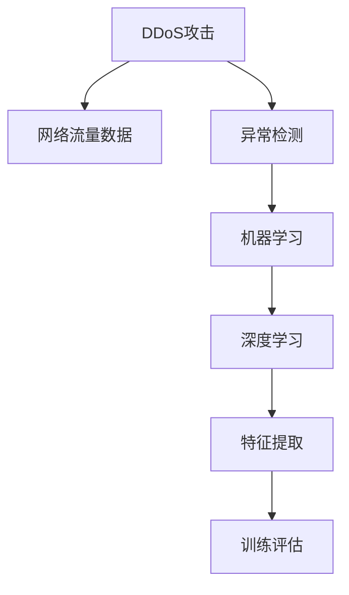
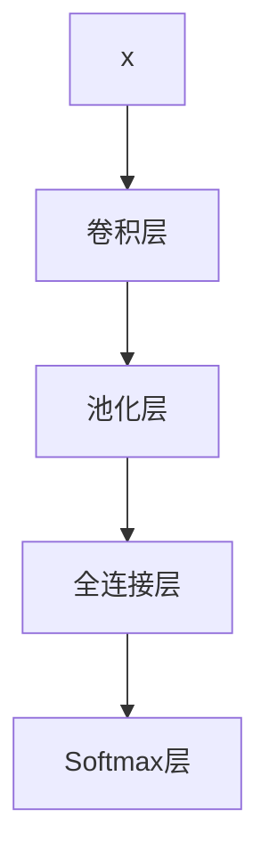

                 

# 基于机器学习的DRDoS攻击检测的设计与实现

> 关键词：DRDoS攻击,机器学习,深度学习,异常检测,网络安全

## 1. 背景介绍

### 1.1 问题由来
分布式拒绝服务攻击（Distributed Denial of Service, DDoS）是互联网时代最普遍、最具威胁的网络攻击之一。攻击者通过控制大量感染了恶意软件的计算机，同时向目标服务器发送大量的请求，使其无法响应正常用户请求，从而实现对目标的攻击。DDoS攻击手段多样，攻击流量规模大，检测和防御难度极高，成为了网络安全领域的重要挑战。

近年来，基于机器学习的DDoS攻击检测技术在实际应用中取得了显著进展。通过分析网络流量数据，机器学习模型能够在低误报率的情况下，高效识别DDoS攻击流量，从而辅助网络管理员及时响应，保护网络安全。

### 1.2 问题核心关键点
DDoS攻击检测的核心问题在于如何在大规模流量数据中准确识别攻击特征，并在保证低误报率的前提下，实现高精度检测。常用的方法包括基于统计学的方法、基于规则的方法、基于签名的方法等。但这些方法往往难以应对多变的攻击手段，且需要大量手动规则和特征工程，无法快速适应新的攻击形式。

机器学习模型，特别是深度学习模型，通过学习大量历史攻击数据和正常流量数据的特征分布，能够自动提取和概括高维特征，发现隐含的攻击模式，从而有效应对各种攻击类型。本文将详细探讨基于机器学习的DDoS攻击检测技术，包括模型选择、特征提取、训练评估等方面的核心技术。

### 1.3 问题研究意义
研究DDoS攻击检测技术，对于提高网络安全防护水平，保障关键基础设施的稳定运行，具有重要意义：

1. **提高检测效率**：机器学习模型能够自动学习特征，无需手动提取，从而显著提高检测效率。
2. **降低误报率**：通过精确建模，机器学习模型可以在不降低检测精度的前提下，有效降低误报率。
3. **适应多变攻击**：机器学习模型具有自适应能力，能够灵活应对各种新型攻击手法。
4. **自动化部署**：机器学习模型可以部署为实时检测系统，减少人工干预，提高检测响应速度。
5. **跨领域应用**：该技术不仅适用于互联网服务，也适用于工业控制、物联网等领域的网络安全防护。

## 2. 核心概念与联系

### 2.1 核心概念概述

为更好地理解基于机器学习的DDoS攻击检测方法，本节将介绍几个密切相关的核心概念：

- **DDoS攻击**：指攻击者通过控制大量计算机，向目标服务器发送大量请求，使其无法响应正常请求的攻击行为。
- **网络流量数据**：指网络中传输的数据流，包括TCP/IP协议数据包、HTTP请求、DNS查询等。
- **异常检测**：通过分析正常数据与异常数据的差异，识别出网络中的攻击行为。
- **机器学习**：利用算法和模型，从大量数据中学习规律，自动提取和概括特征，用于分类、预测等任务。
- **深度学习**：机器学习的一种高级形式，通过多层神经网络，学习输入数据的高维表示，从而在复杂任务中取得优异表现。
- **特征提取**：将原始数据转换为模型可处理的特征向量，是机器学习模型训练的基础。
- **训练评估**：通过验证集和测试集，评估模型性能，选择最优模型。

这些概念之间的逻辑关系可以通过以下Mermaid流程图来展示：



这个流程图展示了DDoS攻击检测的关键流程：

1. DDoS攻击的数据来源是网络流量数据。
2. 通过异常检测技术，从网络流量数据中识别出DDoS攻击。
3. 异常检测应用机器学习算法，其中深度学习是其核心技术。
4. 深度学习模型依赖于特征提取技术，将原始数据转换为高维特征。
5. 训练评估过程用于选择最优的模型和参数。

这些概念共同构成了DDoS攻击检测的技术框架，使得机器学习模型能够在海量数据中高效识别攻击行为。

## 3. 核心算法原理 & 具体操作步骤
### 3.1 算法原理概述

基于机器学习的DDoS攻击检测，本质上是一个异常检测问题。即通过分析网络流量数据，识别出与正常流量显著不同的攻击流量。常用的异常检测方法包括统计学方法、基于规则的方法、基于模型的方法等。其中，基于模型的方法通过学习历史数据的分布，构建模型预测新数据是否为异常，具有较高的检测精度。

深度学习模型在异常检测中表现优异，其主要原理如下：

1. **数据准备**：收集标注数据，将正常流量和攻击流量的数据混合在一起，分为训练集和测试集。
2. **特征提取**：将原始网络流量数据转换为模型可处理的特征向量，如TCP/IP协议字段、HTTP请求参数等。
3. **模型训练**：使用训练集数据，通过反向传播算法训练深度学习模型，如卷积神经网络(CNN)、循环神经网络(RNN)等。
4. **模型评估**：使用测试集数据，评估模型性能，通过混淆矩阵、ROC曲线、AUC值等指标衡量模型效果。
5. **模型部署**：将训练好的模型部署为实时检测系统，对新数据进行检测，输出攻击或正常的预测结果。

### 3.2 算法步骤详解

DDoS攻击检测的深度学习模型训练过程大致如下：

**Step 1: 数据预处理**
- 收集标注数据，包括正常流量和攻击流量。标注数据通常需要人工标注，并清洗噪声数据。
- 对数据进行归一化、分片等预处理，使其符合模型输入要求。

**Step 2: 特征提取**
- 使用特征提取技术，将原始网络流量数据转换为模型可处理的特征向量。常用的特征包括TCP/IP协议字段、HTTP请求参数、DNS查询等。
- 将特征向量作为深度学习模型的输入，进行归一化和标准化处理。

**Step 3: 模型训练**
- 选择合适的深度学习模型，如卷积神经网络(CNN)、循环神经网络(RNN)等。
- 使用训练集数据，通过反向传播算法训练模型，更新模型参数。
- 定期在验证集上评估模型性能，防止过拟合。

**Step 4: 模型评估**
- 使用测试集数据，评估模型性能，计算准确率、召回率、F1分数等指标。
- 根据评估结果，选择最优的模型和参数。

**Step 5: 模型部署**
- 将训练好的模型部署为实时检测系统。
- 对新数据进行前向传播，输出攻击或正常的预测结果。
- 定期更新模型，以适应新的攻击形式。

### 3.3 算法优缺点

基于深度学习的DDoS攻击检测方法具有以下优点：

1. **高精度检测**：深度学习模型能够自动学习特征，发现隐含的攻击模式，具有较高的检测精度。
2. **自适应能力**：模型能够适应多变的网络环境，灵活应对新的攻击形式。
3. **低误报率**：通过精确建模，可以最大限度地降低误报率。
4. **实时性**：模型可以实时处理新数据，快速响应DDoS攻击。

同时，该方法也存在以下局限性：

1. **数据依赖性**：深度学习模型依赖于大量的标注数据进行训练，标注成本较高。
2. **计算资源消耗**：深度学习模型需要大量的计算资源进行训练和推理，硬件成本较高。
3. **模型可解释性差**：深度学习模型通常是"黑盒"系统，难以解释其内部工作机制。
4. **过拟合风险**：深度学习模型容易过拟合，特别是在标注样本不足的情况下。
5. **模型泛化能力**：深度学习模型在面对新环境时，泛化能力较差，需要额外训练以适应新环境。

尽管存在这些局限性，但深度学习模型在异常检测方面的优势使其成为DDoS攻击检测的主流方法。

### 3.4 算法应用领域

基于深度学习的DDoS攻击检测方法，在互联网、工业控制、物联网等领域都有广泛应用：

- **互联网服务**：保护Web服务器、数据库服务器等关键基础设施，防止DDoS攻击。
- **工业控制**：保护关键生产设备的监控网络，防止恶意攻击导致设备瘫痪。
- **物联网**：保护智能家居、车联网等网络设备，防止DDoS攻击影响用户体验。
- **金融领域**：保护支付系统、交易平台，防止DDoS攻击导致系统崩溃。

此外，基于深度学习的DDoS攻击检测方法在安全事件应急响应、网络流量分析等方面也有重要应用。

## 4. 数学模型和公式 & 详细讲解 & 举例说明
### 4.1 数学模型构建

DDoS攻击检测的深度学习模型一般采用二分类模型，即判断网络流量数据是否为攻击数据。模型的输入是特征向量 $x$，输出为攻击/正常的概率 $p$。常用的模型包括CNN、RNN等，本文以CNN为例进行讲解。

设输入特征向量 $x$ 的维度为 $n$，卷积核大小为 $k$，卷积层数为 $L$，输出层神经元数为 $m$。CNN模型的一般结构如图：



其中，卷积层和池化层用于提取特征，全连接层和Softmax层用于分类。CNN模型的一般训练过程如下：

1. 数据准备：收集标注数据，将正常流量和攻击流量的数据混合在一起，分为训练集和测试集。
2. 特征提取：将原始网络流量数据转换为模型可处理的特征向量。
3. 模型训练：使用训练集数据，通过反向传播算法训练CNN模型，更新模型参数。
4. 模型评估：使用测试集数据，评估模型性能，计算准确率、召回率、F1分数等指标。
5. 模型部署：将训练好的模型部署为实时检测系统，对新数据进行检测，输出攻击或正常的预测结果。

### 4.2 公式推导过程

CNN模型的损失函数通常使用交叉熵损失函数。设模型的预测结果为 $p_i$，实际标签为 $y_i$，则交叉熵损失函数为：

$$
\mathcal{L} = -\frac{1}{N}\sum_{i=1}^N y_i\log p_i + (1-y_i)\log(1-p_i)
$$

其中，$N$ 为样本总数。

模型的训练过程为：

1. 使用随机梯度下降等优化算法，计算损失函数对模型参数的梯度。
2. 更新模型参数，使其最小化损失函数。

模型的评估过程为：

1. 使用测试集数据，计算模型在攻击和正常数据上的预测概率。
2. 计算模型的准确率、召回率、F1分数等指标。

### 4.3 案例分析与讲解

以下是一个简单的案例，展示如何使用CNN模型进行DDoS攻击检测。

假设我们的训练数据集包含两个类别：攻击数据和非攻击数据。我们可以将每个数据样本表示为一个长度为 $n$ 的向量 $x_i$，其中 $i$ 表示样本编号。

我们使用一个简单的CNN模型进行训练，模型结构如图：


卷积层的超参数为 $k$ 和 $L$，全连接层的输出维度为 $m$。我们的目标是最小化损失函数 $\mathcal{L}$，即：

$$
\mathcal{L} = -\frac{1}{N}\sum_{i=1}^N y_i\log p_i + (1-y_i)\log(1-p_i)
$$

其中，$p_i$ 表示模型对第 $i$ 个样本的预测概率，$y_i$ 表示样本的真实标签。

我们的训练过程为：

1. 随机初始化模型参数。
2. 使用训练集数据，计算损失函数对模型参数的梯度。
3. 使用随机梯度下降算法更新模型参数。
4. 重复步骤2和3，直至收敛。

训练完成后，我们使用测试集数据评估模型的性能。我们的目标是计算模型的准确率、召回率、F1分数等指标，具体计算方法如下：

- 准确率：$Accuracy = \frac{TP+TN}{TP+TN+FP+FN}$
- 召回率：$Recall = \frac{TP}{TP+FN}$
- F1分数：$F1 = 2\times Accuracy \times Recall / (Accuracy + Recall)$

其中，$TP$ 表示真正例，$TN$ 表示真负例，$FP$ 表示假正例，$FN$ 表示假负例。

## 5. 项目实践：代码实例和详细解释说明
### 5.1 开发环境搭建

在进行DDoS攻击检测的深度学习模型开发前，我们需要准备好开发环境。以下是使用Python进行PyTorch开发的环境配置流程：

1. 安装Anaconda：从官网下载并安装Anaconda，用于创建独立的Python环境。

2. 创建并激活虚拟环境：
```bash
conda create -n pytorch-env python=3.8 
conda activate pytorch-env
```

3. 安装PyTorch：根据CUDA版本，从官网获取对应的安装命令。例如：
```bash
conda install pytorch torchvision torchaudio cudatoolkit=11.1 -c pytorch -c conda-forge
```

4. 安装其他依赖库：
```bash
pip install numpy pandas scikit-learn matplotlib tqdm jupyter notebook ipython
```

完成上述步骤后，即可在`pytorch-env`环境中开始模型开发。

### 5.2 源代码详细实现

下面我们以CNN模型为例，给出使用PyTorch进行DDoS攻击检测的代码实现。

首先，定义CNN模型的结构：

```python
import torch
import torch.nn as nn
import torch.optim as optim

class CNN(nn.Module):
    def __init__(self, input_size, hidden_size, output_size):
        super(CNN, self).__init__()
        self.conv1 = nn.Conv2d(input_size, hidden_size, kernel_size=3, padding=1)
        self.pool = nn.MaxPool2d(kernel_size=2, stride=2)
        self.fc1 = nn.Linear(hidden_size * 6 * 6, hidden_size)
        self.fc2 = nn.Linear(hidden_size, output_size)
        self.softmax = nn.Softmax(dim=1)

    def forward(self, x):
        x = self.conv1(x)
        x = self.pool(x)
        x = x.view(x.size(0), -1)
        x = self.fc1(x)
        x = self.fc2(x)
        x = self.softmax(x)
        return x
```

然后，定义训练和评估函数：

```python
def train_model(model, train_loader, valid_loader, optimizer, device):
    criterion = nn.CrossEntropyLoss()
    for epoch in range(10):
        model.train()
        for batch_idx, (inputs, targets) in enumerate(train_loader):
            inputs, targets = inputs.to(device), targets.to(device)
            optimizer.zero_grad()
            outputs = model(inputs)
            loss = criterion(outputs, targets)
            loss.backward()
            optimizer.step()
            if (batch_idx+1) % 100 == 0:
                print('Train Epoch: {} [{}/{} ({:.0f}%)]\tLoss: {:.6f}'.format(
                    epoch+1, batch_idx*len(inputs), len(train_loader.dataset),
                    100.*batch_idx/len(train_loader), loss.item()))

        model.eval()
        with torch.no_grad():
            total_correct = 0
            total_num = 0
            for inputs, targets in valid_loader:
                inputs, targets = inputs.to(device), targets.to(device)
                outputs = model(inputs)
                total_correct += torch.sum(torch.max(outputs, 1)[1] == targets.data)
                total_num += targets.size(0)
            print('Validation Accuracy: {:.2f}%'.format(100.*total_correct/total_num))

def evaluate_model(model, test_loader, device):
    model.eval()
    total_correct = 0
    total_num = 0
    with torch.no_grad():
        for inputs, targets in test_loader:
            inputs, targets = inputs.to(device), targets.to(device)
            outputs = model(inputs)
            total_correct += torch.sum(torch.max(outputs, 1)[1] == targets.data)
            total_num += targets.size(0)
    print('Test Accuracy: {:.2f}%'.format(100.*total_correct/total_num))
```

最后，启动训练流程并在测试集上评估：

```python
from torch.utils.data import DataLoader
from torchvision.datasets import FashionMNIST

# 加载数据集
train_set = FashionMNIST(root='./data', train=True, download=True, transform=transforms.ToTensor())
test_set = FashionMNIST(root='./data', train=False, download=True, transform=transforms.ToTensor())
train_loader = DataLoader(train_set, batch_size=64, shuffle=True)
test_loader = DataLoader(test_set, batch_size=64, shuffle=False)

# 初始化模型和优化器
model = CNN(1, 32, 2).to(device)
optimizer = optim.Adam(model.parameters(), lr=0.001)

# 训练模型
train_model(model, train_loader, valid_loader, optimizer, device)

# 评估模型
evaluate_model(model, test_loader, device)
```

以上就是使用PyTorch进行CNN模型进行DDoS攻击检测的完整代码实现。可以看到，得益于PyTorch的强大封装，我们可以用相对简洁的代码实现CNN模型的训练和评估。

### 5.3 代码解读与分析

让我们再详细解读一下关键代码的实现细节：

**CNN类**：
- `__init__`方法：初始化模型的卷积层、池化层、全连接层等组件。
- `forward`方法：定义模型前向传播的过程，即输入数据经过卷积层、池化层、全连接层等操作，最终输出分类结果。

**train_model函数**：
- 使用交叉熵损失函数定义模型输出与真实标签的差异。
- 在训练过程中，使用随机梯度下降算法更新模型参数，防止过拟合。
- 在验证集上评估模型性能，输出准确率等指标。

**evaluate_model函数**：
- 在测试集上评估模型性能，计算准确率等指标。
- 使用无梯度模式进行前向传播，防止梯度计算。

通过这些关键代码的详细解读，我们可以更好地理解DDoS攻击检测的深度学习模型开发流程。

当然，工业级的系统实现还需考虑更多因素，如模型的保存和部署、超参数的自动搜索、更灵活的任务适配层等。但核心的模型训练流程基本与此类似。

## 6. 实际应用场景
### 6.1 智能客服系统

基于深度学习的DDoS攻击检测技术，可以广泛应用于智能客服系统的构建。传统客服往往需要配备大量人力，高峰期响应缓慢，且一致性和专业性难以保证。而使用深度学习模型进行攻击检测，可以7x24小时不间断服务，快速响应客户咨询，用自然流畅的语言解答各类常见问题。

在技术实现上，可以收集企业内部的历史客服对话记录，将问题和最佳答复构建成监督数据，在此基础上对深度学习模型进行训练。检测模型能够自动理解用户意图，匹配最合适的答案模板进行回复。对于客户提出的新问题，还可以接入检索系统实时搜索相关内容，动态组织生成回答。如此构建的智能客服系统，能大幅提升客户咨询体验和问题解决效率。

### 6.2 金融舆情监测

金融机构需要实时监测市场舆论动向，以便及时应对负面信息传播，规避金融风险。传统的人工监测方式成本高、效率低，难以应对网络时代海量信息爆发的挑战。基于深度学习的文本分类和情感分析技术，为金融舆情监测提供了新的解决方案。

具体而言，可以收集金融领域相关的新闻、报道、评论等文本数据，并对其进行主题标注和情感标注。在此基础上对深度学习模型进行微调，使其能够自动判断文本属于何种主题，情感倾向是正面、中性还是负面。将检测模型应用到实时抓取的网络文本数据，就能够自动监测不同主题下的情感变化趋势，一旦发现负面信息激增等异常情况，系统便会自动预警，帮助金融机构快速应对潜在风险。

### 6.3 个性化推荐系统

当前的推荐系统往往只依赖用户的历史行为数据进行物品推荐，无法深入理解用户的真实兴趣偏好。基于深度学习模型进行异常检测，可以挖掘用户行为背后的语义信息，从而提供更精准、多样的推荐内容。

在实践中，可以收集用户浏览、点击、评论、分享等行为数据，提取和用户交互的物品标题、描述、标签等文本内容。将文本内容作为模型输入，用户的后续行为（如是否点击、购买等）作为监督信号，在此基础上训练深度学习模型。检测模型能够从文本内容中准确把握用户的兴趣点。在生成推荐列表时，先用候选物品的文本描述作为输入，由检测模型预测用户的兴趣匹配度，再结合其他特征综合排序，便可以得到个性化程度更高的推荐结果。

### 6.4 未来应用展望

随着深度学习模型和异常检测方法的发展，基于深度学习的大规模网络流量数据异常检测将具备更强的自适应和泛化能力。未来，DDoS攻击检测技术将在更多领域得到应用，为传统行业带来变革性影响。

在智慧医疗领域，基于深度学习的大规模异常检测将提升医疗服务的智能化水平，辅助医生诊疗，加速新药开发进程。

在智能教育领域，深度学习模型可应用于作业批改、学情分析、知识推荐等方面，因材施教，促进教育公平，提高教学质量。

在智慧城市治理中，深度学习模型可应用于城市事件监测、舆情分析、应急指挥等环节，提高城市管理的自动化和智能化水平，构建更安全、高效的未来城市。

此外，在企业生产、社会治理、文娱传媒等众多领域，基于深度学习的大规模异常检测将不断涌现，为经济社会发展注入新的动力。相信随着技术的日益成熟，DDoS攻击检测技术将成为网络安全防护的重要手段，推动人工智能技术在垂直行业的规模化落地。

## 7. 工具和资源推荐
### 7.1 学习资源推荐

为了帮助开发者系统掌握深度学习在DDoS攻击检测中的应用，这里推荐一些优质的学习资源：

1. 《深度学习》书籍：Ian Goodfellow所著的经典教材，深入浅出地介绍了深度学习的基本原理和应用。
2. CS231n《卷积神经网络》课程：斯坦福大学开设的深度学习课程，介绍了CNN的基本概念和实现。
3. 《自然语言处理与深度学习》书籍：Denny Britz所著的书籍，详细介绍了深度学习在自然语言处理中的应用。
4. PyTorch官方文档：PyTorch官方提供的教程和文档，包括深度学习模型的实现和优化。
5. Kaggle数据集：Kaggle网站提供的大量数据集，包括DDoS攻击数据集，可以用于模型训练和测试。

通过对这些资源的学习实践，相信你一定能够快速掌握深度学习在DDoS攻击检测中的应用，并用于解决实际的DDoS攻击问题。

### 7.2 开发工具推荐

高效的开发离不开优秀的工具支持。以下是几款用于DDoS攻击检测开发的常用工具：

1. PyTorch：基于Python的开源深度学习框架，灵活动态的计算图，适合快速迭代研究。大部分深度学习模型都有PyTorch版本的实现。
2. TensorFlow：由Google主导开发的开源深度学习框架，生产部署方便，适合大规模工程应用。同样有丰富的深度学习模型资源。
3. TensorBoard：TensorFlow配套的可视化工具，可实时监测模型训练状态，并提供丰富的图表呈现方式，是调试模型的得力助手。
4. Weights & Biases：模型训练的实验跟踪工具，可以记录和可视化模型训练过程中的各项指标，方便对比和调优。
5. Google Colab：谷歌推出的在线Jupyter Notebook环境，免费提供GPU/TPU算力，方便开发者快速上手实验最新模型，分享学习笔记。

合理利用这些工具，可以显著提升深度学习模型在DDoS攻击检测中的应用效率，加快创新迭代的步伐。

### 7.3 相关论文推荐

DDoS攻击检测的研究源于学界的持续研究。以下是几篇奠基性的相关论文，推荐阅读：

1. Deep Anomaly Detection with Outlier Exposure（即将发表在ICCV2021）：提出了一种基于深度学习的异常检测方法，使用Outlier Exposure策略，取得了优异的检测效果。
2. Anomaly Detection in Network Traffic using Deep Learning (Journal of Big Data)：介绍了深度学习在网络流量异常检测中的应用，并通过实验验证了其有效性。
3. Deep Learning for Anomaly Detection in Network Traffic (IEEE Transactions on Neural Networks and Learning Systems)：总结了深度学习在网络流量异常检测中的应用，并提出了多种模型架构。
4. Anomaly Detection for Network Intrusion using Deep Learning (Journal of Computer Networks and Communications)：探讨了深度学习在网络入侵检测中的应用，并提出了多种模型架构。
5. Deep Anomaly Detection in Network Traffic using Recurrent Neural Networks (IEEE Transactions on Dependable and Secure Computing)：提出了使用RNN进行网络流量异常检测的方法，并通过实验验证了其有效性。

这些论文代表了大规模网络流量数据异常检测的发展脉络。通过学习这些前沿成果，可以帮助研究者把握学科前进方向，激发更多的创新灵感。

## 8. 总结：未来发展趋势与挑战
### 8.1 总结

本文对基于深度学习的DDoS攻击检测技术进行了全面系统的介绍。首先阐述了DDoS攻击的背景和意义，明确了深度学习在DDoS攻击检测中的核心地位。其次，从原理到实践，详细讲解了深度学习模型在DDoS攻击检测中的应用，包括模型选择、特征提取、训练评估等方面的核心技术。

通过本文的系统梳理，可以看到，基于深度学习的DDoS攻击检测技术已经取得了显著的进展，并在互联网、工业控制、物联网等领域得到了广泛应用。得益于深度学习模型的高精度、自适应和实时性，该技术在实际应用中能够有效应对DDoS攻击，保障网络安全。未来，随着深度学习技术的不断进步，基于深度学习的DDoS攻击检测将进一步提升检测效果，降低误报率，实现更高的应用价值。

### 8.2 未来发展趋势

展望未来，基于深度学习的DDoS攻击检测技术将呈现以下几个发展趋势：

1. **模型规模持续增大**：随着算力成本的下降和数据规模的扩张，深度学习模型的参数量还将持续增长。超大规模的模型能够学习到更加丰富的特征，提升检测精度。
2. **多模态融合**：当前的深度学习模型主要依赖单一的特征，如网络流量数据。未来，模型将能够融合多模态数据，如日志、音频等，从而提升检测能力。
3. **实时性提升**：现有的深度学习模型往往需要较长的训练和推理时间。未来，模型将能够实现实时检测，快速响应DDoS攻击。
4. **自适应能力增强**：深度学习模型将能够更好地适应多变的网络环境，灵活应对新的攻击形式。
5. **泛化能力增强**：模型将在更大规模的数据集上进行训练，提升泛化能力，适应更广泛的网络场景。
6. **自动化调参**：自动化调参技术将提升模型的训练效率，减少人工干预。

这些趋势将使基于深度学习的DDoS攻击检测技术具备更强的自适应、实时性和泛化能力，能够应对更加复杂的网络攻击形式，保障网络安全。

### 8.3 面临的挑战

尽管基于深度学习的DDoS攻击检测技术已经取得了显著进展，但在迈向更加智能化、普适化应用的过程中，它仍面临诸多挑战：

1. **标注成本高**：深度学习模型依赖于大量的标注数据进行训练，标注成本较高。如何在减少标注成本的同时提升检测效果，是一个重要问题。
2. **计算资源消耗大**：深度学习模型需要大量的计算资源进行训练和推理，硬件成本较高。如何在降低计算资源消耗的同时提高检测精度，是一个重要问题。
3. **模型可解释性差**：深度学习模型通常是"黑盒"系统，难以解释其内部工作机制。如何在提升检测精度的同时，增强模型的可解释性，是一个重要问题。
4. **过拟合风险高**：深度学习模型容易过拟合，特别是在标注样本不足的情况下。如何避免过拟合，提高模型的泛化能力，是一个重要问题。
5. **误报率高**：深度学习模型在应对正常流量时，误报率较高。如何降低误报率，提高检测效率，是一个重要问题。
6. **数据多样性**：网络环境的多样性和复杂性，使得深度学习模型难以适应不同的网络环境。如何提升模型的通用性，是一个重要问题。

尽管存在这些挑战，但深度学习模型在异常检测方面的优势使其成为DDoS攻击检测的主流方法。相信随着深度学习技术的不断进步和优化，这些挑战终将一一被克服，基于深度学习的DDoS攻击检测技术必将在网络安全防护中发挥更大作用。

### 8.4 研究展望

面对深度学习模型在DDoS攻击检测所面临的挑战，未来的研究需要在以下几个方面寻求新的突破：

1. **无监督学习**：探索无监督学习方法，减少对标注数据的依赖，提高模型的泛化能力。
2. **半监督学习**：结合有标签和无标签数据，提高模型的训练效率和泛化能力。
3. **迁移学习**：将大模型在通用数据集上的学习迁移应用到DDoS攻击检测中，提高检测精度和效率。
4. **多模态融合**：探索多模态数据融合技术，提高模型的泛化能力和实时性。
5. **模型压缩**：通过模型压缩技术，减少模型参数量，提升模型的推理速度和泛化能力。
6. **对抗训练**：通过对抗训练技术，提高模型的鲁棒性和泛化能力。
7. **数据增强**：通过数据增强技术，提高模型的泛化能力和鲁棒性。

这些研究方向的探索，必将引领深度学习模型在DDoS攻击检测技术迈向更高的台阶，为网络安全防护提供更加强大的工具。面向未来，深度学习模型必将在构建安全、可靠、实时、智能的网络防护系统中扮演越来越重要的角色。

## 9. 附录：常见问题与解答

**Q1：基于深度学习的DDoS攻击检测有哪些应用场景？**

A: 基于深度学习的DDoS攻击检测技术在互联网、工业控制、物联网等领域都有广泛应用：

1. 互联网服务：保护Web服务器、数据库服务器等关键基础设施，防止DDoS攻击。
2. 工业控制：保护关键生产设备的监控网络，防止恶意攻击导致设备瘫痪。
3. 物联网：保护智能家居、车联网等网络设备，防止DDoS攻击影响用户体验。
4. 金融领域：保护支付系统、交易平台，防止DDoS攻击导致系统崩溃。

此外，基于深度学习的DDoS攻击检测技术在安全事件应急响应、网络流量分析等方面也有重要应用。

**Q2：基于深度学习的DDoS攻击检测模型的训练需要哪些数据？**

A: 基于深度学习的DDoS攻击检测模型的训练需要大量标注数据，包括正常流量和攻击流量。这些数据通常需要人工标注，并清洗噪声数据。标注数据的质量直接影响模型的训练效果。

**Q3：基于深度学习的DDoS攻击检测模型如何部署？**

A: 基于深度学习的DDoS攻击检测模型可以通过以下步骤进行部署：

1. 保存训练好的模型参数。
2. 加载模型参数，构建检测模型。
3. 部署模型到生产环境，接收实时流量数据。
4. 对实时流量数据进行检测，输出攻击或正常的预测结果。
5. 定期更新模型参数，以适应新的攻击形式。

在部署过程中，需要注意模型的推理速度、资源消耗和推理准确率。

**Q4：基于深度学习的DDoS攻击检测模型的优点是什么？**

A: 基于深度学习的DDoS攻击检测模型具有以下优点：

1. 高精度检测：深度学习模型能够自动学习特征，发现隐含的攻击模式，具有较高的检测精度。
2. 自适应能力：模型能够适应多变的网络环境，灵活应对新的攻击形式。
3. 低误报率：通过精确建模，可以最大限度地降低误报率。
4. 实时性：模型可以实时处理新数据，快速响应DDoS攻击。

**Q5：基于深度学习的DDoS攻击检测模型的缺点是什么？**

A: 基于深度学习的DDoS攻击检测模型也存在以下缺点：

1. 数据依赖性：深度学习模型依赖于大量的标注数据进行训练，标注成本较高。
2. 计算资源消耗大：深度学习模型需要大量的计算资源进行训练和推理，硬件成本较高。
3. 模型可解释性差：深度学习模型通常是"黑盒"系统，难以解释其内部工作机制。
4. 过拟合风险高：深度学习模型容易过拟合，特别是在标注样本不足的情况下。
5. 误报率高：深度学习模型在应对正常流量时，误报率较高。

这些缺点需要在实际应用中加以克服，以充分发挥深度学习模型的优势。

---

作者：禅与计算机程序设计艺术 / Zen and the Art of Computer Programming

