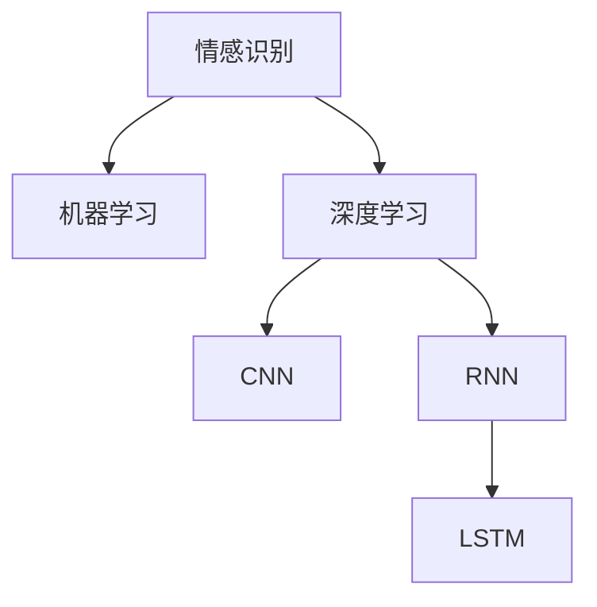

                 

# 基于机器学习的中文情感识别研究

## 1. 背景介绍

### 1.1 问题由来

情感识别（Sentiment Analysis）是自然语言处理（NLP）领域的一个重要研究方向，旨在自动识别文本中的情感倾向，通常分为正面、负面和中性。在现代社会，情感识别技术被广泛应用于舆情分析、市场研究、客户反馈分析等领域，能够帮助企业及时把握用户情绪，调整产品策略，优化用户体验。

在中文环境下，情感识别面临语言表达的丰富性和模糊性等挑战。中文中的成语、隐喻、语境依赖等特性，使得情感识别的难度进一步增加。因此，如何构建有效的中文情感识别模型，成为NLP领域的研究热点。

### 1.2 问题核心关键点

本文聚焦于基于机器学习（ML）的中文情感识别技术，旨在通过构建高精度的情感识别模型，提升中文文本情感识别的准确率和鲁棒性，拓展其应用场景，并推动情感识别技术的进一步发展。

## 2. 核心概念与联系

### 2.1 核心概念概述

为更好地理解中文情感识别的核心概念，本节将介绍几个关键概念：

- 情感识别(Sentiment Analysis)：自动识别文本中的情感倾向，通常分为正面、负面和中性。
- 机器学习（Machine Learning）：通过数据驱动的方式，让计算机系统自动学习和优化模型。
- 深度学习（Deep Learning）：一种特殊的机器学习方法，使用多层次神经网络进行特征提取和模式识别。
- 卷积神经网络（Convolutional Neural Network, CNN）：适用于处理序列数据的一种神经网络，常用于文本分类等任务。
- 循环神经网络（Recurrent Neural Network, RNN）：一种处理序列数据的神经网络，具有记忆功能，适用于文本生成、情感识别等任务。
- 长短时记忆网络（Long Short-Term Memory, LSTM）：一种特殊的RNN结构，能够有效处理长序列数据，常用于情感识别、机器翻译等任务。

这些核心概念之间的逻辑关系可以通过以下Mermaid流程图来展示：



这个流程图展示了大语言模型的核心概念及其之间的关系：

1. 情感识别是机器学习领域的应用之一。
2. 深度学习是机器学习的一种特殊形式。
3. CNN和RNN是常用的深度学习模型。
4. LSTM是RNN的一种变体，常用于序列数据的情感识别。

这些核心概念共同构成了中文情感识别模型的基础，帮助其更好地理解和处理中文文本情感。

## 3. 核心算法原理 & 具体操作步骤
### 3.1 算法原理概述

基于机器学习的中文情感识别，本质上是一个序列分类问题。其核心思想是通过对中文文本进行特征提取和分类，自动识别文本中的情感倾向。

形式化地，假设中文文本序列为 $X=\{x_1, x_2, ..., x_n\}$，其中 $x_i$ 表示第 $i$ 个词语，$y$ 表示情感标签，$y \in \{0, 1, 2\}$，分别代表负面、正面和中性情感。情感识别模型的目标是找到一个映射函数 $f$，使得 $f(X) = y$。

具体而言，中文情感识别模型通常包括两个主要步骤：
1. 特征提取：将中文文本序列转换为模型可处理的形式。
2. 分类：使用机器学习算法对提取的特征进行分类，预测文本的情感标签。

### 3.2 算法步骤详解

基于机器学习的中文情感识别一般包括以下几个关键步骤：

**Step 1: 数据准备**
- 收集中文文本数据，标注相应的情感标签。
- 将文本数据分为训练集、验证集和测试集，保持各集数据分布的一致性。

**Step 2: 特征提取**
- 将中文文本序列转换为模型可处理的形式。
- 常用的特征提取方法包括词袋模型、TF-IDF、词嵌入等。

**Step 3: 模型选择**
- 选择适当的机器学习算法，如支持向量机（SVM）、随机森林（Random Forest）、神经网络等。
- 对于深度学习模型，可以选择CNN、RNN、LSTM等结构。

**Step 4: 模型训练**
- 在训练集上对模型进行训练，调整模型参数以最小化损失函数。
- 使用交叉验证等技术评估模型性能。

**Step 5: 模型评估与测试**
- 在验证集上对模型进行评估，选择最优的模型参数。
- 在测试集上对模型进行测试，评估模型的泛化能力。

**Step 6: 模型应用**
- 将训练好的模型应用于新的中文文本序列，预测其情感倾向。
- 对于深度学习模型，可以使用GPU等高性能设备进行推理。

### 3.3 算法优缺点

基于机器学习的中文情感识别具有以下优点：
1. 精度高：通过大规模数据训练，能够构建高精度的情感识别模型。
2. 鲁棒性好：模型的泛化能力强，对于噪声和变化的数据能够较好地适应。
3. 可解释性强：基于机器学习的模型通常具有良好的可解释性，便于理解和调试。

同时，该方法也存在一定的局限性：
1. 依赖标注数据：情感识别的性能很大程度上取决于标注数据的质量和数量，标注数据的获取成本较高。
2. 特征提取复杂：中文语言的多样性和复杂性，使得特征提取过程繁琐。
3. 模型复杂度高：深度学习模型参数量较大，训练和推理速度较慢。

尽管存在这些局限性，但就目前而言，基于机器学习的情感识别方法仍是最主流和有效的方式。未来相关研究的重点在于如何进一步降低标注数据的依赖，提高模型的泛化能力和推理效率。

### 3.4 算法应用领域

基于机器学习的中文情感识别技术，在多个领域都有广泛的应用，例如：

- 社交媒体分析：分析用户在社交媒体上的情感倾向，帮助品牌监测舆情。
- 客户满意度调查：通过分析客户的评论和反馈，评估产品或服务的质量。
- 广告效果评估：分析广告内容的情感倾向，评估广告效果。
- 舆情监测：分析网络上的新闻和评论，及时发现负面舆情。
- 内容推荐：分析用户对内容的情感反应，进行个性化推荐。

除了这些常见的应用外，情感识别技术还在越来越多的场景中得到应用，如医疗领域中的情感监测、教育领域中的学生情感分析等，成为推动各行各业数字化转型的重要工具。

## 4. 数学模型和公式 & 详细讲解
### 4.1 数学模型构建

中文情感识别的数学模型可以形式化地表示为：

$$
\min_{\theta} \sum_{i=1}^{N} L(y_i, f(X_i; \theta))
$$

其中 $N$ 表示样本数量，$L$ 表示损失函数，$y_i$ 表示第 $i$ 个样本的情感标签，$f(X_i; \theta)$ 表示模型对第 $i$ 个样本的情感预测，$\theta$ 表示模型参数。

常用的损失函数包括交叉熵损失函数（Cross-Entropy Loss）和二分类损失函数（Binary Cross-Entropy Loss），具体形式如下：

$$
L(y_i, f(X_i; \theta)) = -y_i \log f(X_i; \theta) - (1-y_i) \log (1-f(X_i; \theta))
$$

对于深度学习模型，通常使用反向传播算法（Backpropagation）来计算损失函数对模型参数的梯度，并使用随机梯度下降（SGD）等优化算法更新模型参数。

### 4.2 公式推导过程

假设输入文本序列为 $X=\{x_1, x_2, ..., x_n\}$，经过特征提取后，表示为 $\{x_i\}$。对于卷积神经网络（CNN），可以将文本序列中的每个词语视为一个向量，通过卷积和池化操作提取特征，最终通过全连接层进行分类。

卷积神经网络的损失函数可以表示为：

$$
L(y_i, f(X_i; \theta)) = -\frac{1}{N} \sum_{i=1}^{N} L(y_i, f(X_i; \theta))
$$

其中 $N$ 表示样本数量，$L$ 表示交叉熵损失函数。

通过反向传播算法，可以计算出模型参数 $\theta$ 的梯度，使用 SGD 等优化算法更新参数。具体而言，对于第 $i$ 个样本，其梯度可以表示为：

$$
\frac{\partial L}{\partial \theta} = \frac{\partial L}{\partial f(X_i; \theta)} \frac{\partial f(X_i; \theta)}{\partial \theta}
$$

其中 $\frac{\partial L}{\partial f(X_i; \theta)}$ 表示损失函数对模型输出的梯度，$\frac{\partial f(X_i; \theta)}{\partial \theta}$ 表示模型输出的梯度对参数的导数。

### 4.3 案例分析与讲解

以下以一个简单的情感分类任务为例，展示卷积神经网络在中文情感识别中的应用。

假设输入文本序列为 $X=\{x_1, x_2, ..., x_n\}$，每个词语 $x_i$ 表示为 $d$ 维向量，经过词嵌入后，表示为 $x_i \in \mathbb{R}^d$。使用一层一维卷积核对文本序列进行卷积操作，卷积核大小为 $k$，步长为 $s$，则卷积操作可以表示为：

$$
f_k(x_i) = \sum_{j=0}^{k-1} w_j \cdot \sigma(h_j^T x_i)
$$

其中 $w_j$ 表示卷积核参数，$h_j$ 表示卷积核的权重矩阵。

通过多层的卷积和池化操作，提取文本序列的特征表示，最终通过全连接层进行分类。假设全连接层输出为 $h$，则分类器的输出可以表示为：

$$
f(X; \theta) = \frac{1}{1+\exp(-h)}
$$

其中 $\theta$ 表示全连接层的权重和偏置。

通过训练集 $D$ 对模型进行训练，最小化损失函数 $L$，得到最优的模型参数 $\theta$。在测试集上对模型进行测试，评估模型的性能。

## 5. 项目实践：代码实例和详细解释说明
### 5.1 开发环境搭建

在进行情感识别实践前，我们需要准备好开发环境。以下是使用Python进行Keras开发的环境配置流程：

1. 安装Anaconda：从官网下载并安装Anaconda，用于创建独立的Python环境。

2. 创建并激活虚拟环境：
```bash
conda create -n keras-env python=3.8 
conda activate keras-env
```

3. 安装Keras：从官网获取安装命令，使用pip安装Keras和TensorFlow等深度学习库。

4. 安装TensorFlow：
```bash
pip install tensorflow
```

5. 安装各类工具包：
```bash
pip install numpy pandas scikit-learn matplotlib tqdm jupyter notebook ipython
```

完成上述步骤后，即可在`keras-env`环境中开始情感识别实践。

### 5.2 源代码详细实现

我们使用卷积神经网络（CNN）实现中文情感识别。以下是使用Keras实现情感分类的PyTorch代码实现：

```python
from keras.models import Sequential
from keras.layers import Conv1D, MaxPooling1D, Flatten, Dense
from keras.preprocessing.text import Tokenizer
from keras.preprocessing.sequence import pad_sequences
from sklearn.model_selection import train_test_split

# 定义中文情感识别模型
model = Sequential()
model.add(Conv1D(filters=128, kernel_size=3, activation='relu', input_shape=(max_seq_len, 300)))
model.add(MaxPooling1D(pool_size=2))
model.add(Flatten())
model.add(Dense(128, activation='relu'))
model.add(Dense(1, activation='sigmoid'))

# 定义损失函数和优化器
model.compile(loss='binary_crossentropy', optimizer='adam', metrics=['accuracy'])

# 数据准备
tokenizer = Tokenizer(num_words=5000)
tokenizer.fit_on_texts(texts)
sequences = tokenizer.texts_to_sequences(texts)
padded_sequences = pad_sequences(sequences, maxlen=max_seq_len, padding='post', truncating='post')
y = np.array(labels)

# 划分训练集和验证集
X_train, X_valid, y_train, y_valid = train_test_split(padded_sequences, y, test_size=0.2, random_state=42)

# 模型训练
model.fit(X_train, y_train, validation_data=(X_valid, y_valid), epochs=10, batch_size=32)

# 模型评估
loss, accuracy = model.evaluate(X_valid, y_valid)
print(f'Validation accuracy: {accuracy:.4f}')
```

这里我们使用了Keras构建一个简单的卷积神经网络模型，用于情感分类。通过将中文文本序列转换为词向量，并使用卷积和池化操作提取特征，最终通过全连接层进行分类。

### 5.3 代码解读与分析

让我们再详细解读一下关键代码的实现细节：

**Tokenizer类**：
- 使用Tokenizer类将中文文本序列转换为词语序列，并限制词汇表大小为5000。
- 将词语序列转换为向量表示，并进行定长padding。

**模型定义**：
- 定义一个包含卷积层、池化层和全连接层的卷积神经网络模型。
- 使用二分类交叉熵损失函数和Adam优化器进行模型训练。

**数据准备**：
- 使用Tokenizer类将文本转换为词语序列，并进行定长padding。
- 使用train_test_split函数将数据集划分为训练集和验证集。

**模型训练**：
- 在训练集上对模型进行训练，最小化损失函数。
- 在验证集上评估模型性能，避免过拟合。

**模型评估**：
- 在验证集上对模型进行测试，输出准确率和损失函数。

可以看到，使用Keras构建情感识别模型的代码实现相对简洁高效。开发者可以将更多精力放在数据处理、模型改进等高层逻辑上，而不必过多关注底层的实现细节。

## 6. 实际应用场景
### 6.1 社交媒体情感分析

社交媒体上的情感分析是中文情感识别的重要应用场景之一。通过分析用户在社交媒体上的评论和反馈，可以及时掌握公众情绪，帮助品牌应对舆情危机，优化产品和服务。

具体而言，可以从社交媒体平台抓取评论数据，并进行情感标注。使用中文情感识别模型对评论数据进行情感分类，统计正面、负面和中性评论的比例，从而了解公众对品牌或产品的情感倾向。

### 6.2 客户满意度调查

客户满意度调查是企业了解客户情感的重要手段。通过分析客户的评论和反馈，可以评估产品或服务的质量，进行客户关系管理。

具体而言，可以从客户反馈系统中抓取评论数据，并进行情感标注。使用中文情感识别模型对评论数据进行情感分类，统计不同产品或服务的情感评分，从而了解客户的满意度和需求。

### 6.3 广告效果评估

广告效果的评估是中文情感识别在市场营销领域的重要应用。通过分析广告内容的情感倾向，可以评估广告的吸引力和效果。

具体而言，可以从广告投放平台抓取广告内容，并进行情感标注。使用中文情感识别模型对广告内容进行情感分类，统计不同广告的情感评分，从而了解广告的效果和优化方向。

### 6.4 舆情监测

舆情监测是政府和企业了解社会舆情的重要手段。通过分析网络上的新闻和评论，可以及时发现负面舆情，进行舆情预警和处理。

具体而言，可以从新闻网站和社交媒体平台抓取新闻和评论数据，并进行情感标注。使用中文情感识别模型对新闻和评论数据进行情感分类，统计不同主题的情感倾向，从而了解社会舆情和热点话题。

## 7. 工具和资源推荐
### 7.1 学习资源推荐

为了帮助开发者系统掌握中文情感识别的理论基础和实践技巧，这里推荐一些优质的学习资源：

1. 《自然语言处理综论》书籍：全面介绍了NLP的基本概念和经典模型，包括情感识别等任务。

2. 《深度学习入门：基于Python的理论与实现》书籍：介绍了深度学习的基本原理和实践技巧，适合初学者入门。

3. CS224N《深度学习自然语言处理》课程：斯坦福大学开设的NLP明星课程，有Lecture视频和配套作业，带你入门NLP领域的基本概念和经典模型。

4. HuggingFace官方文档：提供了海量预训练语言模型和完整的情感识别样例代码，是上手实践的必备资料。

5. 中文情感识别开源项目：提供了丰富的中文情感识别数据集和模型，适合研究人员和开发者进行实验和研究。

通过对这些资源的学习实践，相信你一定能够快速掌握中文情感识别的精髓，并用于解决实际的NLP问题。
### 7.2 开发工具推荐

高效的开发离不开优秀的工具支持。以下是几款用于中文情感识别开发的常用工具：

1. Keras：基于Python的开源深度学习框架，灵活动态的计算图，适合快速迭代研究。

2. TensorFlow：由Google主导开发的开源深度学习框架，生产部署方便，适合大规模工程应用。

3. Weights & Biases：模型训练的实验跟踪工具，可以记录和可视化模型训练过程中的各项指标，方便对比和调优。

4. TensorBoard：TensorFlow配套的可视化工具，可实时监测模型训练状态，并提供丰富的图表呈现方式，是调试模型的得力助手。

5. Jupyter Notebook：数据科学和机器学习常用的交互式笔记本，支持Python代码和数学公式的混合编辑和执行。

合理利用这些工具，可以显著提升中文情感识别任务的开发效率，加快创新迭代的步伐。

### 7.3 相关论文推荐

中文情感识别技术的发展得益于学界的持续研究。以下是几篇奠基性的相关论文，推荐阅读：

1. 《情感分析：理论、方法与工具》书籍：全面介绍了情感分析的理论基础和应用方法，适合研究人员参考。

2. 《使用卷积神经网络进行中文情感分析》论文：介绍了使用CNN进行中文情感分类的基本方法和实验结果。

3. 《基于LSTM的中文情感识别研究》论文：介绍了使用LSTM进行中文情感分类的基本方法和实验结果。

4. 《多模态中文情感识别研究》论文：介绍了使用多模态信息进行中文情感分类的基本方法和实验结果。

5. 《基于Transformer的中文情感识别研究》论文：介绍了使用Transformer进行中文情感分类的基本方法和实验结果。

这些论文代表了大语言模型微调技术的发展脉络。通过学习这些前沿成果，可以帮助研究者把握学科前进方向，激发更多的创新灵感。

## 8. 总结：未来发展趋势与挑战
### 8.1 总结

本文对基于机器学习的中文情感识别方法进行了全面系统的介绍。首先阐述了情感识别的研究背景和意义，明确了中文情感识别在现代社会中的重要性和应用场景。其次，从原理到实践，详细讲解了中文情感识别的数学模型和关键步骤，给出了中文情感识别任务开发的完整代码实例。同时，本文还广泛探讨了中文情感识别在社交媒体分析、客户满意度调查、广告效果评估、舆情监测等多个领域的应用前景，展示了中文情感识别技术的巨大潜力。此外，本文精选了中文情感识别技术的各类学习资源，力求为读者提供全方位的技术指引。

通过本文的系统梳理，可以看到，基于机器学习的中文情感识别技术正在成为NLP领域的重要范式，极大地拓展了中文文本情感识别的应用边界，催生了更多的落地场景。受益于大规模语料的预训练，中文情感识别模型以更低的时间和标注成本，在小样本条件下也能取得不俗的效果，有力推动了NLP技术的产业化进程。未来，伴随预训练语言模型和情感识别方法的持续演进，相信中文情感识别技术必将在更多领域大放异彩，深刻影响人类的生产生活方式。

### 8.2 未来发展趋势

展望未来，中文情感识别技术将呈现以下几个发展趋势：

1. 模型规模持续增大。随着算力成本的下降和数据规模的扩张，中文情感识别模型的参数量还将持续增长。超大规模语言模型蕴含的丰富语言知识，有望支撑更加复杂多变的情感识别任务。

2. 深度学习模型的进一步优化。未来的深度学习模型将更加高效、可解释，能够更好地处理中文语言的复杂性和多样性。

3. 多模态情感识别技术的发展。未来的情感识别技术将融合视觉、音频等多模态信息，提升情感识别的准确性和鲁棒性。

4. 可解释性技术的进步。未来的情感识别模型将具备更强的可解释性，便于理解和调试。

5. 模型迁移能力的提升。未来的情感识别模型将具备更好的迁移学习能力，能够更好地适应不同的中文语言和文化背景。

6. 情感识别在更多领域的应用。未来的情感识别技术将广泛应用到医疗、教育、金融等更多领域，推动各行各业数字化转型的进程。

以上趋势凸显了中文情感识别技术的广阔前景。这些方向的探索发展，必将进一步提升中文情感识别的性能和应用范围，为人类认知智能的进化带来深远影响。

### 8.3 面临的挑战

尽管中文情感识别技术已经取得了瞩目成就，但在迈向更加智能化、普适化应用的过程中，它仍面临着诸多挑战：

1. 标注数据依赖。中文情感识别的性能很大程度上取决于标注数据的质量和数量，标注数据的获取成本较高。如何进一步降低标注数据的依赖，将是一大难题。

2. 模型鲁棒性不足。中文情感识别模型在面对噪声和变化的数据时，泛化性能往往大打折扣。对于测试样本的微小扰动，情感识别模型的预测也容易发生波动。如何提高情感识别模型的鲁棒性，避免灾难性遗忘，还需要更多理论和实践的积累。

3. 推理效率有待提高。中文情感识别模型虽然精度高，但在实际部署时往往面临推理速度慢、内存占用大等效率问题。如何在保证性能的同时，简化模型结构，提升推理速度，优化资源占用，将是重要的优化方向。

4. 可解释性亟需加强。当前情感识别模型通常缺乏可解释性，难以解释其内部工作机制和决策逻辑。对于医疗、金融等高风险应用，算法的可解释性和可审计性尤为重要。如何赋予情感识别模型更强的可解释性，将是亟待攻克的难题。

5. 安全性有待保障。情感识别模型难免会学习到有偏见、有害的信息，通过微调传递到下游任务，产生误导性、歧视性的输出，给实际应用带来安全隐患。如何从数据和算法层面消除模型偏见，避免恶意用途，确保输出的安全性，也将是重要的研究课题。

6. 知识整合能力不足。现有的情感识别模型往往局限于任务内数据，难以灵活吸收和运用更广泛的先验知识。如何让情感识别过程更好地与外部知识库、规则库等专家知识结合，形成更加全面、准确的信息整合能力，还有很大的想象空间。

正视中文情感识别面临的这些挑战，积极应对并寻求突破，将是大语言模型微调走向成熟的必由之路。相信随着学界和产业界的共同努力，这些挑战终将一一被克服，中文情感识别技术必将在构建人机协同的智能时代中扮演越来越重要的角色。

### 8.4 未来突破

面对中文情感识别所面临的种种挑战，未来的研究需要在以下几个方面寻求新的突破：

1. 探索无监督和半监督情感识别方法。摆脱对大规模标注数据的依赖，利用自监督学习、主动学习等无监督和半监督范式，最大限度利用非结构化数据，实现更加灵活高效的情感识别。

2. 研究参数高效和计算高效的情感识别范式。开发更加参数高效的情感识别方法，在固定大部分预训练参数的同时，只更新极少量的任务相关参数。同时优化情感识别模型的计算图，减少前向传播和反向传播的资源消耗，实现更加轻量级、实时性的部署。

3. 引入更多先验知识。将符号化的先验知识，如知识图谱、逻辑规则等，与神经网络模型进行巧妙融合，引导情感识别过程学习更准确、合理的情感模型。同时加强不同模态数据的整合，实现视觉、语音等多模态信息与文本信息的协同建模。

4. 结合因果分析和博弈论工具。将因果分析方法引入情感识别模型，识别出情感识别的关键特征，增强输出解释的因果性和逻辑性。借助博弈论工具刻画人机交互过程，主动探索并规避情感识别模型的脆弱点，提高系统稳定性。

5. 纳入伦理道德约束。在情感识别模型的训练目标中引入伦理导向的评估指标，过滤和惩罚有偏见、有害的输出倾向。同时加强人工干预和审核，建立模型行为的监管机制，确保输出符合人类价值观和伦理道德。

这些研究方向的探索，必将引领中文情感识别技术迈向更高的台阶，为构建安全、可靠、可解释、可控的智能系统铺平道路。面向未来，中文情感识别技术还需要与其他人工智能技术进行更深入的融合，如知识表示、因果推理、强化学习等，多路径协同发力，共同推动自然语言理解和智能交互系统的进步。只有勇于创新、敢于突破，才能不断拓展中文情感识别技术的边界，让智能技术更好地造福人类社会。

## 9. 附录：常见问题与解答

**Q1：中文情感识别如何处理中文语言的复杂性和多样性？**

A: 中文情感识别的复杂性主要来自于中文语言的多样性和模糊性。以下是一些处理中文情感识别的关键策略：

1. 分词处理：中文文本通常需要进行分词处理，将连续的词语序列转换为单个词语或词向量。分词处理可以使用第三方分词工具，如jieba、HanLP等，或者使用自定义词典进行分词。

2. 情感词典：情感词典是中文情感识别的重要工具，可以用于标注文本中的情感词。常用的情感词典包括知网情感词典、THUSenta情感词典等。

3. 词向量表示：将中文词语转换为词向量表示，使得模型能够更好地处理词语之间的语义关系。常用的词向量模型包括Word2Vec、GloVe等。

4. 情感分析工具：使用情感分析工具，如情感词典、情感分类器等，对中文文本进行情感标注。常用的情感分析工具包括IKAnalyzer、Stanford CoreNLP等。

**Q2：中文情感识别在实际应用中需要注意哪些问题？**

A: 中文情感识别在实际应用中需要注意以下问题：

1. 数据质量：情感识别的性能很大程度上取决于标注数据的质量和数量。标注数据的获取成本较高，需要保证数据的多样性和代表性。

2. 模型鲁棒性：中文情感识别模型在面对噪声和变化的数据时，泛化性能往往大打折扣。对于测试样本的微小扰动，情感识别模型的预测也容易发生波动。

3. 推理效率：中文情感识别模型虽然精度高，但在实际部署时往往面临推理速度慢、内存占用大等效率问题。需要在保证性能的同时，简化模型结构，提升推理速度，优化资源占用。

4. 可解释性：当前情感识别模型通常缺乏可解释性，难以解释其内部工作机制和决策逻辑。对于医疗、金融等高风险应用，算法的可解释性和可审计性尤为重要。

5. 安全性：情感识别模型难免会学习到有偏见、有害的信息，通过微调传递到下游任务，产生误导性、歧视性的输出，给实际应用带来安全隐患。

6. 知识整合：现有的情感识别模型往往局限于任务内数据，难以灵活吸收和运用更广泛的先验知识。如何让情感识别过程更好地与外部知识库、规则库等专家知识结合，形成更加全面、准确的信息整合能力，还有很大的想象空间。

正视中文情感识别面临的这些挑战，积极应对并寻求突破，将是大语言模型微调走向成熟的必由之路。相信随着学界和产业界的共同努力，这些挑战终将一一被克服，中文情感识别技术必将在构建人机协同的智能时代中扮演越来越重要的角色。

---

作者：禅与计算机程序设计艺术 / Zen and the Art of Computer Programming

