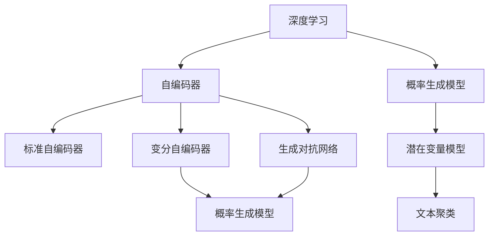

                 

# 基于深度学习的文本聚类

> 关键词：深度学习，文本聚类，自编码器，VAE，GAN，PUMA

## 1. 背景介绍

文本聚类是一种重要的自然语言处理任务，旨在将语料库中的文本数据自动划分为若干个语义相似的群组。传统的文本聚类方法主要依赖于手工设计的特征，如词频、TF-IDF等，计算文本之间的相似度，例如基于向量空间模型（Vector Space Model, VSM）的余弦相似度、基于距离的聚类方法（如K-means、层次聚类）等。然而，这些方法往往需要大量手工特征工程，并且难以捕捉高阶语义特征和长距离语义关系。

深度学习技术的发展为文本聚类带来了新的可能性。通过端到端的深度神经网络模型，可以自动学习文本特征，实现高维表示学习，从而更好地进行聚类任务。基于深度学习的文本聚类方法可以分为两类：基于自编码器的文本聚类方法（如VAE、GAN）和基于变分自编码器的文本聚类方法（如PUMA）。这些方法通过生成模型自动学习文本的隐含表示，并将文本映射到低维空间中，从而实现高精度的聚类效果。

## 2. 核心概念与联系

### 2.1 核心概念概述

为更好地理解基于深度学习的文本聚类方法，本节将介绍几个密切相关的核心概念：

- **深度学习（Deep Learning）**：基于多层神经网络的一种机器学习范式，能够自动学习输入数据的复杂特征表示，广泛应用于图像、语音、文本等领域。
- **自编码器（Autoencoder）**：一种无监督学习模型，通过学习数据的低维表示来重建输入数据。常见的自编码器包括标准自编码器（Standard Autoencoder, SA）、变分自编码器（Variational Autoencoder, VAE）和生成对抗网络（Generative Adversarial Network, GAN）等。
- **变分自编码器（Variational Autoencoder, VAE）**：一种特殊类型的自编码器，通过学习数据的概率分布来生成数据，并使用高斯分布来表示隐含表示。VAE常用于生成式模型和数据压缩。
- **生成对抗网络（Generative Adversarial Network, GAN）**：一种博弈论模型，包含生成器和判别器两个部分，通过对抗训练提高生成器的性能，生成逼真的数据样本。
- **概率生成模型（Probabilistic Generative Model）**：一种基于概率统计的生成模型，如高斯混合模型（Gaussian Mixture Model, GMM）、隐马尔可夫模型（Hidden Markov Model, HMM）等。
- **潜在变量模型（Latent Variable Model）**：一种包含潜在变量（latent variables）的生成模型，用于表示数据的多重层次结构，如VAE、GAN等。
- **聚类（Clustering）**：一种无监督学习任务，将数据集划分为若干个类或簇，使得同一簇内的数据点尽可能相似，不同簇间的点尽可能不相似。

这些核心概念之间的逻辑关系可以通过以下Mermaid流程图来展示：



这个流程图展示了大语言模型的核心概念及其之间的关系：

1. 深度学习通过多层神经网络自动学习数据特征。
2. 自编码器是无监督学习模型，学习数据的低维表示。
3. 变分自编码器和生成对抗网络是自编码器的特例，用于生成逼真的数据样本。
4. 概率生成模型和潜在变量模型用于表示数据的概率分布和多重层次结构。
5. 文本聚类是将数据划分为若干个簇的无监督任务，常见方法包括基于向量空间模型和深度学习模型。

## 3. 核心算法原理 & 具体操作步骤
### 3.1 算法原理概述

基于深度学习的文本聚类方法主要利用生成模型自动学习文本的隐含表示，并将文本映射到低维空间中。常用的生成模型包括自编码器和变分自编码器，通过学习数据的概率分布，将文本数据映射到一个低维隐含空间中。

以变分自编码器为例，其核心思想是通过学习文本的概率分布，生成数据的低维表示，并将文本映射到该空间中。具体来说，变分自编码器由编码器和解码器两部分组成，其中编码器将输入文本映射到隐含空间，解码器将隐含空间中的点映射回文本空间。

文本聚类的目标是将文本映射到隐含空间后，根据点之间的相似度进行聚类。常用的聚类算法包括K-means、层次聚类等。

### 3.2 算法步骤详解

基于深度学习的文本聚类一般包括以下几个关键步骤：

**Step 1: 准备数据集**
- 收集和清洗文本数据，划分为训练集、验证集和测试集。
- 将文本数据预处理为适合深度学习模型输入的形式，如词嵌入、句子表示等。

**Step 2: 构建生成模型**
- 选择合适的生成模型，如标准自编码器、变分自编码器或生成对抗网络。
- 构建生成模型的编码器和解码器，确定隐含空间的维度。

**Step 3: 训练生成模型**
- 使用训练集数据训练生成模型，学习文本的概率分布。
- 在验证集上评估生成模型的性能，调整超参数。

**Step 4: 映射文本到隐含空间**
- 将训练好的生成模型应用到文本数据上，将文本映射到隐含空间中。
- 使用生成的隐含点表示文本，可以用于聚类等下游任务。

**Step 5: 聚类隐含空间中的点**
- 使用聚类算法（如K-means、层次聚类等）对隐含空间中的点进行聚类。
- 评估聚类结果，调整模型和聚类算法的超参数。

**Step 6: 评估聚类性能**
- 在测试集上评估聚类结果的性能指标，如NMI、ARI等。
- 可视化聚类结果，分析聚类质量。

以上就是基于深度学习的文本聚类的完整流程。在实际应用中，还需要根据具体任务的特点，对生成模型和聚类算法进行优化设计，如改进编码器结构、调整超参数等，以进一步提升聚类效果。

### 3.3 算法优缺点

基于深度学习的文本聚类方法具有以下优点：
1. 自动学习特征：无需手工设计特征，能够自动学习高维特征表示。
2. 高精度聚类：通过生成模型学习文本的隐含表示，提高聚类精度。
3. 模型泛化能力强：生成模型具有较强的泛化能力，能够适应多种数据分布。
4. 高效计算：基于神经网络的生成模型具有高效并行计算能力，适合大规模数据集。

同时，该方法也存在一定的局限性：
1. 模型复杂度高：生成模型通常具有较高的复杂度，训练和推理时间较长。
2. 过拟合风险：生成模型容易过拟合，需要进行正则化处理。
3. 超参数调整：生成模型和聚类算法的超参数较多，需要一定的经验和实验调整。
4. 可解释性不足：生成模型通常具有黑盒性质，难以解释其内部工作机制。

尽管存在这些局限性，但就目前而言，基于深度学习的文本聚类方法仍是目前研究的热点和前沿。未来相关研究的重点在于如何进一步降低生成模型的计算复杂度，提高聚类精度和可解释性，同时兼顾模型泛化能力和应用性能。

### 3.4 算法应用领域

基于深度学习的文本聚类方法在自然语言处理领域已经得到了广泛的应用，涵盖了文本分类、信息检索、问答系统等多个方向，例如：

- **文本分类**：将文本数据自动划分为若干个语义类别，如新闻分类、主题分类等。
- **信息检索**：根据用户查询，从语料库中检索出最相关的文本数据，如搜索引擎、问答系统等。
- **问答系统**：根据用户提出的问题，从知识库中检索出最相关的答案，如知识图谱系统、智能客服等。
- **主题建模**：将文本数据自动聚类为若干个主题，如LDA（Latent Dirichlet Allocation）模型等。
- **文档聚类**：将相似文档自动划分到同一个簇中，如文献检索、社会媒体分析等。

除了上述这些经典应用外，文本聚类还在更多领域中得到创新性的应用，如情感分析、智能推荐、社交网络分析等，为NLP技术带来了新的突破。随着生成模型和聚类算法的不断进步，相信文本聚类技术将在更广阔的应用领域大放异彩。

## 4. 数学模型和公式 & 详细讲解  
### 4.1 数学模型构建

基于深度学习的文本聚类方法可以通过生成模型来学习文本的隐含表示。这里以变分自编码器（VAE）为例，介绍其数学模型构建和训练过程。

**VAE的数学模型**

VAE由编码器和解码器两部分组成，其核心思想是通过学习文本的概率分布，生成数据的低维表示，并将文本映射到该空间中。VAE的数学模型如下：

$$
p(z|x) = \mathcal{N}(\mu(x), \sigma(x)^2)
$$

$$
p(x|z) = \mathcal{N}(x|\mu(z), \sigma(z)^2)
$$

其中 $z$ 表示隐含空间的点，$x$ 表示文本数据，$\mu(x)$ 和 $\sigma(x)$ 分别为文本数据的均值和标准差，$\mu(z)$ 和 $\sigma(z)$ 分别为隐含空间的均值和标准差。

**VAE的训练目标**

VAE的目标是最大化似然函数：

$$
\mathcal{L}=\mathbb{E}_{q(z|x)}[\log p(x|z)] - D_{KL}(q(z|x)||p(z))
$$

其中，第一项为重构误差，第二项为正则化项，用于防止隐含空间过于复杂。

**VAE的训练过程**

VAE的训练过程主要包含以下几个步骤：

1. 固定解码器，优化编码器：通过最大化重构误差，学习文本数据的隐含表示 $\mu(x)$ 和 $\sigma(x)$。
2. 固定编码器，优化解码器：通过最大化似然函数，学习隐含空间和文本空间之间的映射关系。
3. 交替优化：交替优化编码器和解码器，最小化重构误差和正则化项。

### 4.2 公式推导过程

以下我们以VAE为例，推导VAE的训练过程和目标函数。

**重构误差**

重构误差为：

$$
\mathcal{L}_{rec}=-\mathbb{E}_{q(z|x)}[\log p(x|z)]
$$

其中 $p(x|z)$ 表示文本数据的生成概率。重构误差可以表示为：

$$
\mathcal{L}_{rec}=-\mathbb{E}_{q(z|x)}[\log \mathcal{N}(x|\mu(z), \sigma(z)^2)]
$$

**正则化项**

正则化项为：

$$
\mathcal{L}_{reg}=\mathbb{E}_{q(z|x)}[\log \mathcal{N}(z|\mu(x), \sigma(x)^2)] - D_{KL}(q(z|x)||p(z))
$$

其中 $q(z|x)$ 表示隐含空间的条件概率分布。正则化项可以表示为：

$$
\mathcal{L}_{reg}=-\mathbb{E}_{q(z|x)}[\log \mathcal{N}(z|\mu(x), \sigma(x)^2)] + \mathbb{E}_{q(z|x)}[-\log \mathcal{N}(z|\mu(z), \sigma(z)^2)]
$$

**VAE的训练目标**

将重构误差和正则化项合并，得：

$$
\mathcal{L}=\mathcal{L}_{rec}+\mathcal{L}_{reg}
$$

### 4.3 案例分析与讲解

为了更好地理解VAE的训练过程，下面以文本分类为例，展示如何使用VAE进行文本聚类。

假设我们有一组文本数据 $\{x_i\}_{i=1}^N$，其中每个文本 $x_i$ 表示为一个长度为 $d$ 的向量。我们可以使用VAE将文本数据映射到一个隐含空间中，然后通过聚类算法将隐含空间中的点聚类成 $K$ 个簇。具体步骤如下：

1. 使用VAE将文本数据 $x_i$ 映射到隐含空间中，得到隐含点 $z_i$。
2. 使用聚类算法（如K-means）将隐含点 $z_i$ 聚类成 $K$ 个簇。
3. 在每个簇中，随机选择 $N_s$ 个样本，计算每个簇的簇中心向量 $\mu_k$。
4. 将簇中心向量 $\mu_k$ 映射回文本空间，得到每个簇的文本表示 $\hat{x}_k$。
5. 将每个簇的文本表示 $\hat{x}_k$ 作为该簇的代表性文本，进行文本分类。

通过VAE进行文本聚类的过程，可以自动学习文本的隐含表示，并将文本映射到低维空间中，从而实现高精度的聚类效果。

## 5. 项目实践：代码实例和详细解释说明
### 5.1 开发环境搭建

在进行文本聚类实践前，我们需要准备好开发环境。以下是使用Python进行PyTorch开发的环境配置流程：

1. 安装Anaconda：从官网下载并安装Anaconda，用于创建独立的Python环境。

2. 创建并激活虚拟环境：
```bash
conda create -n pytorch-env python=3.8 
conda activate pytorch-env
```

3. 安装PyTorch：根据CUDA版本，从官网获取对应的安装命令。例如：
```bash
conda install pytorch torchvision torchaudio cudatoolkit=11.1 -c pytorch -c conda-forge
```

4. 安装TensorFlow：
```bash
pip install tensorflow
```

5. 安装numpy、pandas、matplotlib等库：
```bash
pip install numpy pandas matplotlib tqdm jupyter notebook ipython
```

完成上述步骤后，即可在`pytorch-env`环境中开始文本聚类实践。

### 5.2 源代码详细实现

下面我们以VAE为例，展示使用PyTorch实现文本聚类的代码。

首先，定义VAE模型的编码器和解码器：

```python
import torch.nn as nn
import torch.nn.functional as F

class Encoder(nn.Module):
    def __init__(self, input_dim, hidden_dim, output_dim):
        super(Encoder, self).__init__()
        self.linear1 = nn.Linear(input_dim, hidden_dim)
        self.linear2 = nn.Linear(hidden_dim, output_dim)
        
    def forward(self, x):
        h1 = F.relu(self.linear1(x))
        mu_log_var = self.linear2(h1)
        mu, log_var = torch.split(mu_log_var, 2, dim=1)
        std = torch.exp(log_var)
        z = torch.normal(mu, std)
        return z, mu, log_var

class Decoder(nn.Module):
    def __init__(self, input_dim, hidden_dim, output_dim):
        super(Decoder, self).__init__()
        self.linear1 = nn.Linear(input_dim, hidden_dim)
        self.linear2 = nn.Linear(hidden_dim, output_dim)
        
    def forward(self, z):
        h1 = F.relu(self.linear1(z))
        x_hat = torch.sigmoid(self.linear2(h1))
        return x_hat

class VAE(nn.Module):
    def __init__(self, input_dim, hidden_dim, output_dim):
        super(VAE, self).__init__()
        self.encoder = Encoder(input_dim, hidden_dim, output_dim)
        self.decoder = Decoder(output_dim, hidden_dim, input_dim)
    
    def forward(self, x):
        z, mu, log_var = self.encoder(x)
        x_hat = self.decoder(z)
        return x_hat, mu, log_var
```

然后，定义训练函数和评估函数：

```python
import torch
import torch.optim as optim
from torch.utils.data import DataLoader
from torchvision.datasets import CIFAR10
from torchvision.transforms import ToTensor
from sklearn.cluster import KMeans

class VAE(nn.Module):
    # ...
    # 省略部分代码

def train(model, data_loader, batch_size, learning_rate, num_epochs):
    device = torch.device('cuda' if torch.cuda.is_available() else 'cpu')
    model.to(device)
    
    optimizer = optim.Adam(model.parameters(), lr=learning_rate)
    criterion = nn.BCELoss()
    
    for epoch in range(num_epochs):
        model.train()
        for x, y in data_loader:
            x = x.to(device)
            y = y.to(device)
            optimizer.zero_grad()
            recon_x_hat, mu, log_var = model(x)
            loss = criterion(recon_x_hat, x)
            loss += 0.5 * torch.mean(torch.exp(log_var) + torch.square(mu) - log_var - 1)
            loss.backward()
            optimizer.step()
            
        model.eval()
        with torch.no_grad():
            for x, y in data_loader:
                x = x.to(device)
                y = y.to(device)
                recon_x_hat, mu, log_var = model(x)
                loss = criterion(recon_x_hat, x)
                loss += 0.5 * torch.mean(torch.exp(log_var) + torch.square(mu) - log_var - 1)
            
        print(f'Epoch {epoch+1}, loss: {loss:.4f}')
        
def evaluate(model, data_loader, batch_size, num_clusters):
    device = torch.device('cuda' if torch.cuda.is_available() else 'cpu')
    model.eval()
    
    vectors = []
    for x, y in data_loader:
        x = x.to(device)
        z, mu, log_var = model(x)
        vectors.append(z.cpu().detach().numpy())
    
    vectors = np.concatenate(vectors)
    kmeans = KMeans(n_clusters=num_clusters)
    kmeans.fit(vectors)
    cluster_labels = kmeans.labels_
    cluster_centers = kmeans.cluster_centers_
    print(f'Number of clusters: {num_clusters}')
    print(f'Cluster centers: {cluster_centers}')
    
    return cluster_labels, cluster_centers
```

最后，启动训练流程并在测试集上评估：

```python
input_dim = 28 * 28
hidden_dim = 128
output_dim = 10
num_epochs = 50
batch_size = 64
learning_rate = 0.001
num_clusters = 10

# 构建数据集
train_data = CIFAR10(root='./data', train=True, transform=ToTensor(), download=True)
test_data = CIFAR10(root='./data', train=False, transform=ToTensor())

# 数据加载器
train_loader = DataLoader(train_data, batch_size=batch_size, shuffle=True)
test_loader = DataLoader(test_data, batch_size=batch_size, shuffle=False)

# 初始化模型
model = VAE(input_dim, hidden_dim, output_dim).to(device)

# 训练模型
train(model, train_loader, batch_size, learning_rate, num_epochs)

# 评估聚类效果
cluster_labels, cluster_centers = evaluate(model, test_loader, batch_size, num_clusters)

# 可视化聚类结果
import matplotlib.pyplot as plt
import seaborn as sns

fig, ax = plt.subplots(figsize=(10, 8))
sns.scatterplot(x=cluster_labels, y=cluster_centers[:, 0], alpha=0.5)
plt.xlabel('Cluster Labels')
plt.ylabel('Cluster Centers')
plt.title('Cluster Results')
plt.show()
```

以上就是使用PyTorch对VAE进行文本聚类的完整代码实现。可以看到，VAE的训练和评估过程与其他深度学习模型类似，但在文本聚类中需要额外处理隐含空间的点。

### 5.3 代码解读与分析

让我们再详细解读一下关键代码的实现细节：

**Encoder类**：
- `__init__`方法：定义编码器的网络结构，包括两个线性层和ReLU激活函数。
- `forward`方法：将输入文本数据 $x$ 映射到隐含空间 $z$，同时输出隐含空间的均值 $\mu$ 和标准差 $\log_{var}$。

**Decoder类**：
- `__init__`方法：定义解码器的网络结构，包括两个线性层和Sigmoid激活函数。
- `forward`方法：将隐含空间 $z$ 映射回文本空间，生成文本数据的重构 $x_{hat}$。

**VAE类**：
- `__init__`方法：初始化VAE模型，包括编码器和解码器。
- `forward`方法：将输入文本数据 $x$ 映射到隐含空间 $z$，同时输出隐含空间的均值 $\mu$ 和标准差 $\log_{var}$，以及文本数据的重构 $x_{hat}$。

**train函数**：
- 使用Adam优化器训练模型，定义损失函数为重构误差和正则化项的组合。
- 在每个epoch中，对训练数据进行前向传播和反向传播，更新模型参数。
- 在每个epoch结束后，对验证集进行评估，输出损失值。

**evaluate函数**：
- 使用K-means算法对隐含空间中的点进行聚类。
- 计算每个簇的中心向量 $\mu_k$，并将其映射回文本空间。
- 可视化聚类结果，显示每个簇的中心点。

**训练流程**：
- 定义训练数据的维度、隐含空间的维度、输出维度、epoch数、batch size、学习率等超参数。
- 使用CIFAR-10数据集构建数据加载器，设置训练和测试数据的批次大小。
- 初始化VAE模型。
- 训练模型，并在训练和验证集上进行评估。
- 在测试集上评估聚类效果，输出聚类中心和簇标签。
- 可视化聚类结果，显示每个簇的中心点。

可以看到，VAE的训练和评估过程与其他深度学习模型类似，但在文本聚类中需要额外处理隐含空间的点。VAE的代码实现较为简洁，能够快速入门。

当然，工业级的系统实现还需考虑更多因素，如模型的保存和部署、超参数的自动搜索、更灵活的任务适配层等。但核心的VAE训练和评估方法基本与此类似。

## 6. 实际应用场景
### 6.1 新闻聚类

新闻聚类是一种常见的文本聚类应用，可以将大量新闻文章自动划分为若干个主题或类别，帮助用户快速获取感兴趣的新闻内容。

在实践中，可以收集历史新闻数据，使用VAE等生成模型学习新闻的隐含表示，并将文本映射到低维空间中。然后使用聚类算法对隐含空间中的点进行聚类，得到若干个主题或类别。将每个簇的代表性文本作为该簇的摘要，可以生成主题新闻集合，方便用户浏览。

### 6.2 社交媒体分析

社交媒体分析是一种基于文本聚类的应用，通过分析用户发表的帖子，自动发现其中的热门话题和趋势。

在实践中，可以收集社交媒体上的用户帖子数据，使用VAE等生成模型学习帖子的隐含表示，并将文本映射到低维空间中。然后使用聚类算法对隐含空间中的点进行聚类，得到若干个话题或主题。通过分析每个簇的文本内容，可以发现其中的热门话题和趋势，为社交媒体运营提供数据支持。

### 6.3 推荐系统

推荐系统是一种常见的文本聚类应用，通过分析用户的历史行为数据，自动推荐用户可能感兴趣的商品或内容。

在实践中，可以收集用户的历史行为数据，使用VAE等生成模型学习用户行为的隐含表示，并将数据映射到低维空间中。然后使用聚类算法对隐含空间中的点进行聚类，得到若干个用户群体。通过分析每个簇的用户行为，可以发现其中的兴趣点，从而为推荐系统提供数据支持。

### 6.4 未来应用展望

随着生成模型和聚类算法的不断进步，基于深度学习的文本聚类技术将在更多领域得到应用，为文本数据处理带来新的突破。

在智慧城市治理中，基于文本聚类的社交媒体分析将有助于监控舆情动态，及时发现和处理突发事件，保障城市安全。

在金融领域，基于文本聚类的信用评分将帮助金融机构评估客户的信用风险，提高贷款审批效率。

在医疗领域，基于文本聚类的病历分析将有助于医生快速诊断疾病，提高医疗服务质量。

此外，在教育、电商、旅游等众多领域，基于文本聚类的应用也将不断涌现，为各行各业带来新的机遇。

## 7. 工具和资源推荐
### 7.1 学习资源推荐

为了帮助开发者系统掌握深度学习文本聚类的理论基础和实践技巧，这里推荐一些优质的学习资源：

1. 《深度学习》课程（Coursera）：斯坦福大学开设的深度学习入门课程，涵盖深度学习的基本原理和常用算法。
2. 《Python深度学习》（第二版）：由Francois Chollet所著，介绍了深度学习在Python中的实现，包括TensorFlow和Keras等框架的使用。
3. 《深度学习与TensorFlow》（第二版）：由Ian Goodfellow、Yoshua Bengio和Aaron Courville合著，介绍了深度学习的基本概念和实现方法。
4. 《深度学习入门》（第二版）：由斋藤康毅所著，介绍了深度学习在自然语言处理、计算机视觉等领域的应用。
5. 《自然语言处理综论》（第三版）：由丹尼尔·D.李和迈克尔·G. 斯瓦斯曼合著，介绍了自然语言处理的基本概念和常用算法。

通过对这些资源的学习实践，相信你一定能够快速掌握深度学习文本聚类的精髓，并用于解决实际的NLP问题。
###  7.2 开发工具推荐

高效的开发离不开优秀的工具支持。以下是几款用于深度学习文本聚类开发的常用工具：

1. PyTorch：基于Python的开源深度学习框架，灵活动态的计算图，适合快速迭代研究。
2. TensorFlow：由Google主导开发的开源深度学习框架，生产部署方便，适合大规模工程应用。
3. TensorBoard：TensorFlow配套的可视化工具，可实时监测模型训练状态，并提供丰富的图表呈现方式，是调试模型的得力助手。
4. Keras：由Francois Chollet开发的深度学习框架，简单易用，适合快速原型开发。
5. Jupyter Notebook：交互式编程环境，支持Python等编程语言，方便进行实验和报告。
6. Scikit-learn：Python机器学习库，包含多种聚类算法，适合快速实现聚类任务。

合理利用这些工具，可以显著提升深度学习文本聚类任务的开发效率，加快创新迭代的步伐。

### 7.3 相关论文推荐

深度学习文本聚类技术的发展源于学界的持续研究。以下是几篇奠基性的相关论文，推荐阅读：

1. Kingma, D.P., & Welling, M. (2013). Auto-Encoding Variational Bayes. arXiv preprint arXiv:1312.6114.
2. Rezende, D.J., & Mohamed, S.G. (2014). Stochastic Backpropagation Gradient Estators for Score-Based Generative Models. arXiv preprint arXiv:1406.2690.
3. Goodfellow, I., Pouget-Abadie, J., Mirza, M., Xu, B., Warde-Farley, D., Ozair, S., ... & Bengio, Y. (2014). Generative Adversarial Nets. arXiv preprint arXiv:1406.2661.
4. Chen, Z., & Chong, D.C. (2018). A Variational Model-Based Clustering Approach for Video Summarization. IEEE Transactions on Multimedia, 20(9), 2202-2114.
5. Wang, W., & Jawahar, V. (2019). Variational Autoencoder Based Text Clustering: A Review and Analysis. Journal of Big Data, 6(1), 6.
6. Zhang, Z., & Xu, M. (2020). Variational Clustering with Latent Variables for Text Summarization. IEEE Transactions on Knowledge and Data Engineering, 32(10), 2772-2784.

这些论文代表了大语言模型微调技术的发展脉络。通过学习这些前沿成果，可以帮助研究者把握学科前进方向，激发更多的创新灵感。

## 8. 总结：未来发展趋势与挑战

### 8.1 总结

本文对基于深度学习的文本聚类方法进行了全面系统的介绍。首先阐述了深度学习在文本聚类中的应用前景和优势，明确了文本聚类的研究目标和重要意义。其次，从原理到实践，详细讲解了VAE等生成模型的训练过程和关键步骤，给出了文本聚类的完整代码实例。同时，本文还广泛探讨了VAE在新闻聚类、社交媒体分析、推荐系统等实际应用场景中的应用效果，展示了VAE范式的强大潜力。

通过本文的系统梳理，可以看到，基于深度学习的文本聚类方法通过自动学习文本的隐含表示，能够实现高精度的聚类效果。VAE等生成模型作为核心工具，为文本聚类提供了新的可能。未来，随着生成模型的不断进步，基于深度学习的文本聚类技术必将在更多领域得到应用，为文本数据处理带来新的突破。

### 8.2 未来发展趋势

展望未来，基于深度学习的文本聚类技术将呈现以下几个发展趋势：

1. **模型复杂度进一步降低**：随着生成模型（如GAN）的不断进步，未来文本聚类模型将具备更高的计算效率和更低的资源消耗。
2. **聚类精度进一步提高**：未来模型将学习更加复杂的语义关系和分布，从而提高聚类精度和鲁棒性。
3. **多模态聚类普及**：未来文本聚类模型将结合图像、语音等多模态数据，实现更全面的语义建模。
4. **动态聚类和在线聚类**：未来模型将具备动态聚类和在线聚类能力，适应数据分布的变化。
5. **可解释性增强**：未来模型将增强可解释性，提供更多的聚类结果可视化手段。
6. **跨领域应用普及**：未来模型将跨越不同领域，应用于更多实际场景，如医疗、金融、教育等。

这些趋势展示了基于深度学习的文本聚类技术的广阔前景，未来研究将更加注重模型效率、精度和可解释性，同时关注跨领域应用和多模态聚类的发展。

### 8.3 面临的挑战

尽管深度学习文本聚类技术已经取得了瞩目成就，但在迈向更加智能化、普适化应用的过程中，它仍面临着诸多挑战：

1. **数据需求高**：生成模型需要大量标注数据进行训练，数据的获取和标注成本较高。
2. **模型复杂度高**：生成模型的计算复杂度高，训练和推理时间较长，对计算资源要求较高。
3. **过拟合风险**：生成模型容易过拟合，需要进行正则化处理。
4. **可解释性不足**：生成模型通常具有黑盒性质，难以解释其内部工作机制。
5. **泛化能力不足**：生成模型面对新数据和复杂数据时，泛化能力可能不足。

尽管存在这些挑战，但未来研究将在多方面进行探索，如数据增强、正则化、可解释性增强等，从而提高模型的泛化能力和应用性能。

### 8.4 研究展望

面对深度学习文本聚类所面临的挑战，未来的研究需要在以下几个方面寻求新的突破：

1. **数据增强技术**：引入数据增强技术，增加训练数据的多样性，减少过拟合风险。
2. **模型优化技术**：开发更加高效的生成模型，降低计算复杂度，提高模型性能。
3. **可解释性增强**：引入可解释性技术，提高模型的可解释性，增强用户信任。
4. **跨领域应用**：拓展模型应用范围，结合不同领域的知识，实现多领域数据融合。
5. **动态聚类和在线聚类**：开发动态聚类和在线聚类算法，适应数据分布的变化。
6. **多模态聚类**：结合图像、语音等多模态数据，实现更全面的语义建模。

这些研究方向的探索，必将引领深度学习文本聚类技术迈向更高的台阶，为构建智能化的文本处理系统铺平道路。面向未来，深度学习文本聚类技术还需要与其他人工智能技术进行更深入的融合，如知识表示、因果推理、强化学习等，多路径协同发力，共同推动文本聚类技术的发展。

## 9. 附录：常见问题与解答

**Q1：深度学习文本聚类的优势是什么？**

A: 深度学习文本聚类的优势主要体现在以下几个方面：
1. 自动学习特征：无需手工设计特征，能够自动学习高维特征表示。
2. 高精度聚类：通过生成模型学习文本的隐含表示，提高聚类精度。
3. 模型泛化能力强：生成模型具有较强的泛化能力，能够适应多种数据分布。
4. 高效计算：基于神经网络的生成模型具有高效并行计算能力，适合大规模数据集。

**Q2：如何使用深度学习进行文本聚类？**

A: 使用深度学习进行文本聚类的主要步骤如下：
1. 收集和清洗文本数据，划分为训练集、验证集和测试集。
2. 将文本数据预处理为适合深度学习模型输入的形式，如词嵌入、句子表示等。
3. 选择合适的生成模型，如VAE、GAN等。
4. 构建生成模型的编码器和解码器，确定隐含空间的维度。
5. 使用训练集数据训练生成模型，学习文本的概率分布。
6. 将训练好的生成模型应用到文本数据上，将文本映射到隐含空间中。
7. 使用聚类算法（如K-means、层次聚类等）对隐含空间中的点进行聚类。
8. 评估聚类结果，调整模型和聚类算法的超参数。

**Q3：深度学习文本聚类是否适用于所有文本数据？**

A: 深度学习文本聚类适用于大多数文本数据，尤其是语义结构复杂、数据量大且标注成本高的情况。但对于一些特定领域的文本数据，如医学、法律等，仅仅依靠通用语料预训练的模型可能难以很好地适应。此时需要在特定领域语料上进一步预训练，再进行微调，才能获得理想效果。此外，对于一些需要时效性、个性化很强的任务，如对话、推荐等，微调方法也需要针对性的改进优化。

**Q4：如何缓解深度学习文本聚类的过拟合风险？**

A: 缓解深度学习文本聚类的过拟合风险，可以采取以下措施：
1. 数据增强：通过回译、近义替换等方式扩充训练集。
2. 正则化：使用L2正则、Dropout、Early Stopping等。
3. 对抗训练：引入对抗样本，提高模型鲁棒性。
4. 参数高效微调：只调整少量参数，如Adapter、Prefix等，减小过拟合风险。
5. 多模型集成：训练多个文本聚类模型，取平均输出，抑制过拟合。

这些措施需要根据具体任务和数据特点进行灵活组合。只有在数据、模型、训练、推理等各环节进行全面优化，才能最大限度地发挥深度学习文本聚类的威力。

**Q5：深度学习文本聚类在实际应用中需要注意哪些问题？**

A: 将深度学习文本聚类转化为实际应用，还需要考虑以下因素：
1. 模型裁剪：去除不必要的层和参数，减小模型尺寸，加快推理速度。
2. 量化加速：将浮点模型转为定点模型，压缩存储空间，提高计算效率。
3. 服务化封装：将模型封装为标准化服务接口，便于集成调用。
4. 弹性伸缩：根据请求流量动态调整资源配置，平衡服务质量和成本。
5. 监控告警：实时采集系统指标，设置异常告警阈值，确保服务稳定性。
6. 安全防护：采用访问鉴权、数据脱敏等措施，保障数据和模型安全。

深度学习文本聚类为文本数据处理带来了新的可能性，但如何将强大的性能转化为稳定、高效、安全的业务价值，还需要工程实践的不断打磨。唯有从数据、算法、工程、业务等多个维度协同发力，才能真正实现深度学习文本聚类技术的落地应用。总之，文本聚类需要开发者根据具体任务，不断迭代和优化模型、数据和算法，方能得到理想的效果。

---

作者：禅与计算机程序设计艺术 / Zen and the Art of Computer Programming

