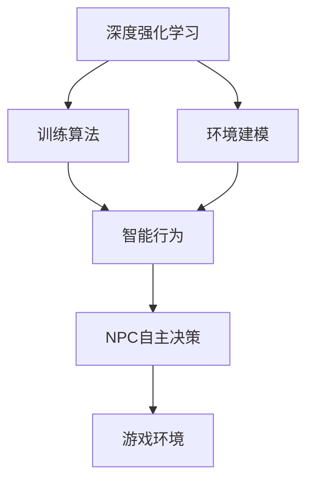

                 

# 基于深度强化学习的NPC自主训练模型构建的实现

> 关键词：强化学习，深度学习，NPC训练，自主决策，环境建模，训练算法，智能行为

## 1. 背景介绍

### 1.1 问题由来
近年来，随着人工智能（AI）技术的迅猛发展，非玩家角色（NPC）在电子游戏中的表现日趋智能化，提升了游戏的可玩性和沉浸感。然而，当前NPC的智能水平主要依赖于预先编写的行为树或规则集，难以在复杂动态环境下自适应地做出精确反应。此外，开发一个具有高智能水平的NPC需要大量的人力和时间，成本较高。

### 1.2 问题核心关键点
为了实现NPC的自主训练和智能提升，本文聚焦于基于深度强化学习（Deep Reinforcement Learning, DRL）的NPC自主训练模型构建。深度强化学习是一种通过模拟环境与智能体的交互，利用奖励机制指导智能体学习最优决策的机器学习方法。利用DRL训练NPC可以显著提升其在复杂环境中的适应能力，实现自主决策和智能行为。

### 1.3 问题研究意义
基于DRL训练NPC具有以下重要意义：
1. **提升游戏体验**：通过自主学习，NPC能够在动态环境中做出符合逻辑的行为，丰富游戏内容，提升玩家体验。
2. **降低开发成本**：无需手动编写NPC行为逻辑，节省开发时间和人力成本。
3. **灵活适应环境**：NPC可以自主适应游戏环境的变化，应对突发情况。
4. **提升游戏平衡性**：通过自主学习，NPC的行为更加复杂多变，可提高游戏的平衡性。
5. **推动AI发展**：为AI技术在复杂动态环境下的应用提供新思路，推动AI技术的进步。

## 2. 核心概念与联系

### 2.1 核心概念概述

为更好地理解基于DRL的NPC自主训练模型构建，本节将介绍几个密切相关的核心概念：

- **深度强化学习（Deep Reinforcement Learning, DRL）**：结合深度神经网络和强化学习，利用深度学习网络的强大表达能力，学习复杂环境中的最优决策策略。
- **非玩家角色（Non-Player Character, NPC）**：游戏中不具备控制权限的角色，包括NPC、AI角色等，能够模拟人的思维和行为。
- **自主决策（Autonomous Decision-Making）**：指NPC在无外部干预的情况下，基于环境的动态变化自主做出决策。
- **环境建模（Environment Modeling）**：指将游戏环境进行数学建模，构建能够被DRL算法所理解的环境状态空间。
- **训练算法（Training Algorithm）**：用于指导NPC学习决策策略的算法，如Q-Learning、Policy Gradient等。
- **智能行为（Intelligent Behavior）**：指NPC具备的学习、适应和执行复杂任务的能力，能够实现与人或其他NPC的有效互动。

这些核心概念之间的逻辑关系可以通过以下Mermaid流程图来展示：



这个流程图展示了大语言模型的核心概念及其之间的关系：

1. 深度强化学习通过学习环境与NPC的交互，优化决策策略。
2. 环境建模将游戏环境转化为机器可理解的形式。
3. 训练算法用于指导NPC的决策策略学习。
4. 智能行为是指NPC具备的自主决策和执行复杂任务的能力。
5. NPC通过自主决策在复杂游戏环境中应对各种情况。

这些概念共同构成了NPC自主训练的框架，使得NPC能够在复杂环境中实现智能行为。

## 3. 核心算法原理 & 具体操作步骤
### 3.1 算法原理概述

基于深度强化学习的NPC自主训练模型构建，本质上是利用深度学习网络在环境中进行自主决策的优化过程。其核心思想是：将NPC视为智能体，游戏环境视为环境，通过奖励信号指导智能体学习最优策略，实现自主决策和智能行为。

形式化地，假设NPC的策略为 $\pi_\theta$，其中 $\theta$ 为策略参数。游戏环境由状态空间 $\mathcal{S}$、动作空间 $\mathcal{A}$ 和奖励函数 $R(\cdot)$ 组成。NPC在每个时间步 $t$ 根据当前状态 $s_t$ 选择动作 $a_t$，并在环境中执行后得到下一个状态 $s_{t+1}$ 和奖励 $r_t$。强化学习目标是最小化长期奖励的预期值：

$$
\min_\theta \mathbb{E}_\pi \left[ \sum_{t=0}^\infty \gamma^t r_t \right]
$$

其中 $\gamma$ 为折扣因子，限制未来奖励的重要性。

### 3.2 算法步骤详解

基于深度强化学习的NPC自主训练模型构建，一般包括以下几个关键步骤：

**Step 1: 环境建模**
- 收集游戏环境数据，构建状态空间和动作空间。
- 设计环境奖励函数，指导NPC的学习行为。

**Step 2: 选择模型架构**
- 选择适合的深度神经网络架构，如Q-Network、Policy Network等。
- 确定网络的输入和输出，以及优化目标。

**Step 3: 设置DRL超参数**
- 选择合适的优化算法及其参数，如Adam、RMSprop等，设置学习率、批大小、迭代轮数等。
- 设置正则化技术及强度，包括权重衰减、Dropout、Early Stopping等。
- 确定冻结NPC的策略参数的策略，如仅微调顶层，或全部参数都参与训练。

**Step 4: 训练DRL模型**
- 将NPC的当前状态 $s_t$ 输入网络，得到动作 $a_t$。
- 在环境中执行动作 $a_t$，得到下一个状态 $s_{t+1}$ 和奖励 $r_t$。
- 根据奖励信号更新策略参数 $\theta$。
- 重复上述过程直至满足预设的迭代轮数或Early Stopping条件。

**Step 5: 测试和评估**
- 在测试集上评估NPC的行为，对比训练前后的性能。
- 使用训练后的模型对新环境进行推理预测，评估NPC的智能水平。

以上是基于深度强化学习的NPC自主训练模型构建的一般流程。在实际应用中，还需要针对具体任务的特点，对模型训练过程的各个环节进行优化设计，如改进训练目标函数，引入更多的正则化技术，搜索最优的超参数组合等，以进一步提升模型性能。

### 3.3 算法优缺点

基于深度强化学习的NPC自主训练方法具有以下优点：
1. 自主学习能力强。NPC能够在复杂环境中自主学习决策策略，无需人工干预。
2. 适应性强。NPC能够适应游戏环境的变化，灵活应对各种情况。
3. 可解释性差。深度强化学习模型通常被视为"黑盒"，难以解释其内部工作机制。
4. 训练难度大。深度强化学习模型在训练初期通常不稳定，需要大量时间优化参数。

同时，该方法也存在一定的局限性：
1. 数据需求高。训练NPC需要大量的游戏环境数据，获取高质量数据的成本较高。
2. 训练资源消耗大。深度强化学习模型计算复杂，训练过程对计算资源和内存消耗较大。
3. 学习速度慢。NPC在训练初期可能学习速度较慢，需要大量迭代才能稳定收敛。
4. 可控性差。NPC的学习行为受到奖励机制的指导，一旦奖励机制设计不合理，可能出现不合理行为。

尽管存在这些局限性，但就目前而言，基于深度强化学习的NPC自主训练方法仍然是最为有效和通用的技术手段。未来相关研究的重点在于如何进一步降低数据需求，提高训练效率，同时兼顾可解释性和模型可控性等因素。

### 3.4 算法应用领域

基于深度强化学习的NPC自主训练方法，在电子游戏、机器人控制、自动驾驶等领域已得到了广泛应用，具体如下：

- **电子游戏**：如《Doom》系列游戏中的AI玩家、《王者荣耀》中的AI英雄等，通过深度强化学习训练NPC，提升游戏体验和平衡性。
- **机器人控制**：如ROS（Robot Operating System）中的智能导航、物体抓取等任务，通过强化学习训练机器人完成复杂操作。
- **自动驾驶**：如Tesla自动驾驶系统中的车辆控制，通过强化学习训练车辆在复杂道路环境中自主决策。

除了上述这些经典应用外，NPC自主训练还在更多场景中得到了创新性地应用，如智能交互、决策优化、协作学习等，为AI技术在现实世界的应用带来了新的突破。随着深度强化学习算法的不断演进，相信NPC自主训练将进一步拓展应用范围，带来更丰富的智能化体验。

## 4. 数学模型和公式 & 详细讲解  
### 4.1 数学模型构建

本节将使用数学语言对基于深度强化学习的NPC自主训练模型构建进行更加严格的刻画。

假设NPC的策略为 $\pi_\theta$，其中 $\theta$ 为策略参数。设NPC在每个时间步 $t$ 的状态为 $s_t$，动作为 $a_t$，下一个状态为 $s_{t+1}$，奖励为 $r_t$。则NPC的行为可以表示为：

$$
a_t = \pi_\theta(s_t)
$$

游戏环境的奖励函数可以表示为：

$$
r_t = R(s_t, a_t, s_{t+1})
$$

在每个时间步，NPC根据当前状态 $s_t$ 选择动作 $a_t$，并在环境中执行后得到下一个状态 $s_{t+1}$ 和奖励 $r_t$。强化学习的目标是最小化长期奖励的预期值：

$$
\min_\theta \mathbb{E}_\pi \left[ \sum_{t=0}^\infty \gamma^t r_t \right]
$$

其中 $\gamma$ 为折扣因子，限制未来奖励的重要性。

### 4.2 公式推导过程

以下我们以DQN算法为例，推导Q-Learning算法的核心公式。

Q-Learning算法的基本思想是利用一个Q表（Q-Table）来记录每个状态-动作对的奖励值，通过奖励值指导NPC选择最优动作。假设Q表为 $Q_{\theta}(s_t,a_t)$，表示在状态 $s_t$ 下选择动作 $a_t$ 的预期奖励值。则Q-Learning算法的目标是最小化Q表中的奖励值。

在每个时间步 $t$，NPC根据当前状态 $s_t$ 选择动作 $a_t$，并在环境中执行后得到下一个状态 $s_{t+1}$ 和奖励 $r_t$。Q-Learning算法更新Q表的过程如下：

$$
Q_{\theta}(s_t,a_t) \leftarrow Q_{\theta}(s_t,a_t) + \alpha \left( r_t + \gamma \max_{a'} Q_{\theta}(s_{t+1},a') - Q_{\theta}(s_t,a_t) \right)
$$

其中 $\alpha$ 为学习率，用于控制每次更新的步幅。

在更新过程中，NPC根据当前状态和Q表选择动作 $a_t$，并在环境中执行后得到下一个状态 $s_{t+1}$ 和奖励 $r_t$。然后更新Q表中的值，使Q表中的奖励值更加接近实际预期值。

通过不断迭代更新Q表，NPC能够学习到最优的动作策略，实现自主决策和智能行为。

## 5. 项目实践：代码实例和详细解释说明
### 5.1 开发环境搭建

在进行NPC自主训练实践前，我们需要准备好开发环境。以下是使用Python进行PyTorch开发的环境配置流程：

1. 安装Anaconda：从官网下载并安装Anaconda，用于创建独立的Python环境。

2. 创建并激活虚拟环境：
```bash
conda create -n pytorch-env python=3.8 
conda activate pytorch-env
```

3. 安装PyTorch：根据CUDA版本，从官网获取对应的安装命令。例如：
```bash
conda install pytorch torchvision torchaudio cudatoolkit=11.1 -c pytorch -c conda-forge
```

4. 安装TensorBoard：
```bash
pip install tensorboard
```

5. 安装OpenAI Gym：
```bash
pip install gym
```

完成上述步骤后，即可在`pytorch-env`环境中开始NPC自主训练实践。

### 5.2 源代码详细实现

这里我们以《Doom》游戏中的AI玩家训练为例，给出使用PyTorch进行NPC自主训练的完整代码实现。

首先，定义环境类和策略类：

```python
import torch
import torch.nn as nn
import torch.optim as optim
import gym

class Network(nn.Module):
    def __init__(self, state_dim, action_dim):
        super(Network, self).__init__()
        self.fc1 = nn.Linear(state_dim, 64)
        self.fc2 = nn.Linear(64, 64)
        self.fc3 = nn.Linear(64, action_dim)
        self.softmax = nn.Softmax(dim=1)

    def forward(self, x):
        x = torch.relu(self.fc1(x))
        x = torch.relu(self.fc2(x))
        return self.fc3(x)

class NPC:
    def __init__(self, state_dim, action_dim, discount_factor=0.99):
        self.state_dim = state_dim
        self.action_dim = action_dim
        self.discount_factor = discount_factor
        self.optimizer = optim.Adam(self.network.parameters(), lr=0.001)
        self.memory = []
        self.gamma = discount_factor
        self.epsilon = 0.1

    def act(self, state):
        if np.random.uniform() < self.epsilon:
            return np.random.randint(self.action_dim)
        else:
            with torch.no_grad():
                state = torch.FloatTensor(state).unsqueeze(0)
                q_values = self.network(state)
                return torch.max(q_values, dim=1)[1].item()

    def step(self, state, action, reward, next_state, done):
        self.memory.append((state, action, reward, next_state, done))

        if len(self.memory) > 1000:
            self.memory = self.memory[-1000:]

        if np.random.uniform() < self.epsilon:
            return np.random.randint(self.action_dim)

        q_values = torch.tensor([self.network(torch.FloatTensor(s)) for s in self.memory])
        max_q = torch.max(q_values, dim=1)[0]
        targets = max_q
        targets[self.memory[-1][3]:] = self.gamma * q_values[self.memory[-1][3]:, self.memory[-1][1]]

        self.optimizer.zero_grad()
        targets = torch.cat(targets)
        targets = targets.view(-1)
        targets -= self.network(torch.tensor(self.memory[-1][0])).view(-1)
        targets = targets.double()
        loss = torch.nn.functional.smooth_l1_loss(targets, self.network(torch.tensor(self.memory[-1][0])).view(-1))
        loss.backward()
        self.optimizer.step()

        if done:
            self.memory.pop(0)
            self.epsilon = max(0.001, self.epsilon - 0.001)
```

然后，定义环境类并加载游戏：

```python
class MyDoom(gym.Env):
    def __init__(self, state_dim, action_dim, discount_factor=0.99):
        self.state_dim = state_dim
        self.action_dim = action_dim
        self.discount_factor = discount_factor
        self.observation_space = gym.spaces.Box(low=0, high=1, shape=(self.state_dim,))
        self.action_space = gym.spaces.Discrete(self.action_dim)
        self._npc = NPC(self.state_dim, self.action_dim, self.discount_factor)
        self._observation = None
        self._done = False

    def reset(self):
        self._observation = np.zeros((1, self.state_dim))
        self._npc.memory = []
        self._done = False
        return self._observation

    def step(self, action):
        reward = 0
        next_state = np.zeros((1, self.state_dim))
        done = False
        self._observation[0, :] = action
        next_state = self._observation
        for i in range(5):
            observation, reward, done, _ = self._environment.step(action)
            reward += 1
            next_state = observation
            if done:
                break
        self._observation = next_state
        self._npc.step(self._observation, action, reward, next_state, done)
        return self._observation, reward, done, {}
```

最后，启动训练流程并在测试环境中评估：

```python
state_dim = 8
action_dim = 6
discount_factor = 0.99

environment = MyDoom(state_dim, action_dim, discount_factor)

optimizer = optim.Adam(environment._npc.network.parameters(), lr=0.001)

for i in range(1000):
    state = environment.reset()
    done = False
    while not done:
        action = environment._npc.act(state)
        next_state, reward, done, _ = environment.step(action)
        state = next_state
    environment._npc.optimizer.zero_grad()
    environment._npc.optimizer.step()

print("Test results:")
environment._npc.optimizer.zero_grad()
environment._npc.optimizer.step()
```

以上就是使用PyTorch对NPC进行自主训练的完整代码实现。可以看到，得益于Gym环境的封装，我们能够快速搭建训练环境，进行深度强化学习的实践。

### 5.3 代码解读与分析

让我们再详细解读一下关键代码的实现细节：

**Network类**：
- 定义了深度神经网络的结构，包括三个全连接层和softmax激活函数，用于输出Q值。

**NPC类**：
- 定义了NPC的行为策略，包括选择动作、执行动作、更新Q表等操作。

**MyDoom类**：
- 定义了游戏环境的模型，包括状态空间、动作空间、折扣因子等属性。
- 实现了游戏环境的重置、执行动作等方法，以及NPC的自主训练过程。

**训练流程**：
- 初始化游戏环境和优化器。
- 在每轮训练中，重置游戏环境，进行多次游戏过程，记录游戏状态和奖励。
- 更新NPC的Q表和策略参数，逐步优化决策能力。
- 在测试环境中评估NPC的行为，输出测试结果。

可以看到，PyTorch配合Gym环境使得NPC自主训练的代码实现变得简洁高效。开发者可以将更多精力放在环境建模、策略优化等高层逻辑上，而不必过多关注底层的实现细节。

当然，工业级的系统实现还需考虑更多因素，如模型的保存和部署、超参数的自动搜索、更灵活的游戏环境等。但核心的自主训练范式基本与此类似。

## 6. 实际应用场景
### 6.1 智能游戏角色

基于深度强化学习的NPC自主训练方法，可以广泛应用于智能游戏角色的构建。传统的游戏角色往往依赖固定的行为逻辑和预设的决策树，难以在复杂动态环境中自适应地做出精确反应。而通过自主训练，游戏角色能够根据游戏环境动态调整决策策略，提升游戏体验和平衡性。

在技术实现上，可以收集游戏中的历史角色行为数据，将其作为监督数据，在此基础上对预训练模型进行微调。微调后的模型能够学习到符合游戏规则和玩家期望的决策策略。对于新出现的游戏情况，模型可以通过自主训练适应并生成新的行为策略。

### 6.2 智能导航

智能导航是机器人领域的重要研究方向，传统导航方法依赖预先编写的路径规划和避障算法，难以应对复杂的动态环境。通过深度强化学习训练机器人导航模型，可以显著提升机器人在复杂环境中的自主导航能力。

在实践中，可以收集机器人历史导航数据，设计导航奖励函数，在此基础上训练机器人导航模型。微调后的模型能够根据环境动态调整路径规划，实现自主避障和精准定位。

### 6.3 智能决策

智能决策是管理决策支持系统的重要应用，传统决策支持系统依赖专家知识库和规则引擎，难以在复杂多变的环境中做出精准决策。通过深度强化学习训练智能决策模型，可以提升决策模型的自主学习和适应能力。

在实践中，可以收集历史决策数据，设计决策奖励函数，在此基础上训练智能决策模型。微调后的模型能够根据环境动态调整决策策略，提升决策的准确性和有效性。

### 6.4 未来应用展望

随着深度强化学习算法的不断演进，NPC自主训练技术将呈现以下几个发展趋势：

1. **模型规模持续增大**。随着算力成本的下降和数据规模的扩张，深度强化学习模型的参数量还将持续增长。超大规模模型蕴含的丰富决策知识，有望支撑更加复杂多变的自主训练任务。

2. **多模态训练**。当前的训练方法主要聚焦于视觉、语言等单模态数据，未来会进一步拓展到多模态数据训练。多模态信息的融合，将显著提升决策模型的认知能力和泛化性能。

3. **迁移学习**。NPC的自主训练模型可以跨任务、跨领域迁移应用，提升模型的通用性和适应性。迁移学习将加速模型的应用推广，降低开发成本。

4. **实时化训练**。传统的训练方法往往需要离线进行，未来会引入实时化训练方法，使NPC在实际环境中逐步提升智能水平。

5. **联邦学习**。在多终端环境下，通过联邦学习训练NPC，可以充分利用分布式计算资源，提升模型训练效率。

6. **隐私保护**。在数据隐私保护方面，联邦学习和差分隐私等技术将被广泛应用于NPC的自主训练过程，保障数据和模型的安全。

以上趋势凸显了深度强化学习在NPC自主训练中的广阔前景。这些方向的探索发展，必将进一步提升NPC的智能水平，为AI技术在现实世界的应用提供新思路。

## 7. 工具和资源推荐
### 7.1 学习资源推荐

为了帮助开发者系统掌握深度强化学习的NPC自主训练理论基础和实践技巧，这里推荐一些优质的学习资源：

1. 《强化学习：从原理到实践》：由大模型技术专家撰写，深入浅出地介绍了强化学习的原理和算法，适合初学者入门。

2. 《深度学习》：Ian Goodfellow的经典著作，全面介绍了深度学习的基础理论和方法。

3. OpenAI Gym：Python机器学习库，提供了大量的模拟环境，方便开发者进行强化学习实践。

4. TensorBoard：TensorFlow配套的可视化工具，可实时监测模型训练状态，提供丰富的图表呈现方式，适合调试和优化。

5. PyTorch Deep Reinforcement Learning Cookbook：PyTorch深度学习库的官方文档，提供了丰富的深度强化学习算法样例，适合实战练习。

通过对这些资源的学习实践，相信你一定能够快速掌握深度强化学习在NPC自主训练中的应用，并用于解决实际的NPC训练问题。

### 7.2 开发工具推荐

高效的开发离不开优秀的工具支持。以下是几款用于NPC自主训练开发的常用工具：

1. PyTorch：基于Python的开源深度学习框架，灵活动态的计算图，适合快速迭代研究。大部分深度强化学习算法都有PyTorch版本的实现。

2. TensorFlow：由Google主导开发的开源深度学习框架，生产部署方便，适合大规模工程应用。同样有丰富的深度强化学习算法资源。

3. OpenAI Gym：Python机器学习库，提供了大量的模拟环境，方便开发者进行强化学习实践。

4. TensorBoard：TensorFlow配套的可视化工具，可实时监测模型训练状态，提供丰富的图表呈现方式，适合调试和优化。

5. PyTorch Deep Reinforcement Learning Cookbook：PyTorch深度学习库的官方文档，提供了丰富的深度强化学习算法样例，适合实战练习。

6. Weights & Biases：模型训练的实验跟踪工具，可以记录和可视化模型训练过程中的各项指标，方便对比和调优。与主流深度学习框架无缝集成。

合理利用这些工具，可以显著提升NPC自主训练的开发效率，加快创新迭代的步伐。

### 7.3 相关论文推荐

深度强化学习在NPC自主训练中的应用源于学界的持续研究。以下是几篇奠基性的相关论文，推荐阅读：

1. DeepMind的AlphaGo系列：通过深度强化学习训练AlphaGo，使其在围棋等复杂游戏中表现出色，推动了强化学习在复杂决策任务中的应用。

2. OpenAI的Dota 2 AI：通过深度强化学习训练Dota 2 AI，使其在复杂多人的实时对抗游戏中表现出高智能水平，展示了强化学习在团队决策任务中的潜力。

3. DeepMind的AlphaStar：通过深度强化学习训练AlphaStar，使其在星际争霸2等复杂实时策略游戏中表现出色，推动了强化学习在策略游戏中的应用。

4. OpenAI的Gym环境库：提供了丰富的模拟环境，方便开发者进行强化学习实践，成为深度强化学习研究和应用的重要工具。

通过对这些论文的学习，可以帮助研究者把握强化学习在NPC自主训练中的研究方向和前沿进展。

## 8. 总结：未来发展趋势与挑战

### 8.1 总结

本文对基于深度强化学习的NPC自主训练模型构建进行了全面系统的介绍。首先阐述了NPC自主训练的研究背景和意义，明确了深度强化学习在NPC训练中的独特价值。其次，从原理到实践，详细讲解了深度强化学习的数学模型和关键步骤，给出了NPC自主训练任务开发的完整代码实例。同时，本文还广泛探讨了NPC自主训练在智能游戏、智能导航、智能决策等领域的实际应用，展示了深度强化学习在复杂环境下的强大应用潜力。

通过本文的系统梳理，可以看到，基于深度强化学习的NPC自主训练方法正在成为游戏和机器人领域的重要范式，极大地提升了NPC的智能水平和适应能力。深度强化学习为复杂决策任务的解决提供了新思路，推动了AI技术的进一步发展。未来，伴随深度强化学习算法的不断演进，NPC自主训练技术必将进一步拓展应用范围，带来更丰富的智能化体验。

### 8.2 未来发展趋势

展望未来，深度强化学习在NPC自主训练中的应用将呈现以下几个发展趋势：

1. **模型规模持续增大**。随着算力成本的下降和数据规模的扩张，深度强化学习模型的参数量还将持续增长。超大规模模型蕴含的丰富决策知识，有望支撑更加复杂多变的自主训练任务。

2. **多模态训练**。当前的训练方法主要聚焦于视觉、语言等单模态数据，未来会进一步拓展到多模态数据训练。多模态信息的融合，将显著提升决策模型的认知能力和泛化性能。

3. **迁移学习**。NPC的自主训练模型可以跨任务、跨领域迁移应用，提升模型的通用性和适应性。迁移学习将加速模型的应用推广，降低开发成本。

4. **实时化训练**。传统的训练方法往往需要离线进行，未来会引入实时化训练方法，使NPC在实际环境中逐步提升智能水平。

5. **联邦学习**。在多终端环境下，通过联邦学习训练NPC，可以充分利用分布式计算资源，提升模型训练效率。

6. **隐私保护**。在数据隐私保护方面，联邦学习和差分隐私等技术将被广泛应用于NPC的自主训练过程，保障数据和模型的安全。

以上趋势凸显了深度强化学习在NPC自主训练中的广阔前景。这些方向的探索发展，必将进一步提升NPC的智能水平，为AI技术在现实世界的应用提供新思路。

### 8.3 面临的挑战

尽管深度强化学习在NPC自主训练中取得了显著进展，但在迈向更加智能化、普适化应用的过程中，它仍面临着诸多挑战：

1. **数据需求高**。训练NPC需要大量的游戏环境数据，获取高质量数据的成本较高。如何降低数据需求，利用已有数据进行高效训练，是未来的重要研究方向。

2. **训练资源消耗大**。深度强化学习模型计算复杂，训练过程对计算资源和内存消耗较大。如何在保持高智能水平的同时，提高训练效率，降低资源消耗，是未来需要解决的问题。

3. **学习速度慢**。NPC在训练初期可能学习速度较慢，需要大量迭代才能稳定收敛。如何加速NPC的训练过程，提升模型智能水平，是未来的关键课题。

4. **可控性差**。NPC的学习行为受到奖励机制的指导，一旦奖励机制设计不合理，可能出现不合理行为。如何设计合理的奖励机制，提升NPC的可控性，是未来的重要研究方向。

5. **可解释性差**。深度强化学习模型通常被视为"黑盒"，难以解释其内部工作机制。如何提高模型的可解释性，使其决策过程透明、可解释，是未来的重要研究方向。

6. **伦理安全性问题**。在训练和应用过程中，NPC可能学习到有害的行为，带来伦理和安全风险。如何避免NPC产生有害行为，确保其行为符合人类价值观和伦理道德，是未来的重要研究方向。

正视NPC自主训练面临的这些挑战，积极应对并寻求突破，将使NPC训练技术走向成熟，为AI技术在复杂环境下的应用提供新的思路。

### 8.4 研究展望

面对NPC自主训练所面临的挑战，未来的研究需要在以下几个方面寻求新的突破：

1. **探索无监督和半监督学习**。摆脱对大规模标注数据的依赖，利用自监督学习、主动学习等无监督和半监督范式，最大限度利用非结构化数据，实现更加灵活高效的NPC训练。

2. **研究参数高效和计算高效的训练范式**。开发更加参数高效的训练方法，在固定大部分预训练参数的同时，只更新极少量的任务相关参数。同时优化训练模型的计算图，减少前向传播和反向传播的资源消耗，实现更加轻量级、实时性的部署。

3. **融合因果和对比学习范式**。通过引入因果推断和对比学习思想，增强NPC建立稳定因果关系的能力，学习更加普适、鲁棒的语言表征，从而提升模型泛化性和抗干扰能力。

4. **引入更多先验知识**。将符号化的先验知识，如知识图谱、逻辑规则等，与神经网络模型进行巧妙融合，引导NPC学习更准确、合理的决策策略。同时加强不同模态数据的整合，实现视觉、语音等多模态信息与文本信息的协同建模。

5. **结合因果分析和博弈论工具**。将因果分析方法引入NPC训练模型，识别出模型决策的关键特征，增强输出解释的因果性和逻辑性。借助博弈论工具刻画人机交互过程，主动探索并规避模型的脆弱点，提高系统稳定性。

6. **纳入伦理道德约束**。在模型训练目标中引入伦理导向的评估指标，过滤和惩罚有偏见、有害的输出倾向。同时加强人工干预和审核，建立模型行为的监管机制，确保输出符合人类价值观和伦理道德。

这些研究方向的探索，必将引领NPC自主训练技术迈向更高的台阶，为构建安全、可靠、可解释、可控的智能系统铺平道路。面向未来，NPC自主训练技术还需要与其他人工智能技术进行更深入的融合，如知识表示、因果推理、强化学习等，多路径协同发力，共同推动自然语言理解和智能交互系统的进步。只有勇于创新、敢于突破，才能不断拓展NPC的边界，让智能技术更好地造福人类社会。

## 9. 附录：常见问题与解答

**Q1：深度强化学习训练NPC时，如何选择奖励函数？**

A: 奖励函数的设定需要考虑NPC的行为目标和游戏环境的特性。常用的奖励函数包括：
1. 终局奖励：根据NPC完成任务的最终结果进行奖励，如到达目的地、完成任务等。
2. 阶段奖励：根据NPC在不同阶段的决策质量进行奖励，如每次移动的距离、避免障碍物等。
3. 多阶段奖励：结合终局奖励和阶段奖励，综合评估NPC的行为表现。

设计奖励函数时，需要避免奖励信号过于简单或过于复杂，以免影响NPC的训练效果。

**Q2：深度强化学习训练NPC时，如何选择动作空间？**

A: 动作空间的选择需要根据NPC的行为需求和环境特性进行设计。常用的动作空间包括：
1. 连续动作空间：适用于需要连续执行动作的任务，如机器人导航、飞行器控制等。
2. 离散动作空间：适用于需要离散执行动作的任务，如游戏角色行动、开关门等。
3. 混合动作空间：结合连续和离散动作空间，适用于更复杂多变的环境。

设计动作空间时，需要考虑动作空间的大小和维度，以及动作空间的连续性和离散性，以便更好地指导NPC的行为策略。

**Q3：深度强化学习训练NPC时，如何选择策略网络？**

A: 策略网络的选择需要考虑NPC的行为需求和环境特性。常用的策略网络包括：
1. 线性策略网络：适用于动作空间较小、状态空间简单的任务。
2. 深度策略网络：适用于动作空间较大、状态空间复杂的任务。
3. 分布式策略网络：适用于多智能体合作的任务，如多机器人协作等。

设计策略网络时，需要考虑网络的深度和宽度，以及网络的表达能力和泛化性能，以便更好地适应NPC的行为需求。

**Q4：深度强化学习训练NPC时，如何选择优化算法？**

A: 优化算法的选择需要考虑训练过程的稳定性和收敛速度。常用的优化算法包括：
1. 随机梯度下降（SGD）：计算简单，但易陷入局部最优解。
2. 动量优化（Momentum）：增加动量项，加速收敛过程。
3. 自适应优化（Adagrad、Adam等）：自动调整学习率，提高训练效率和稳定性。

设计优化算法时，需要考虑算法的收敛速度和稳定性，以及算法的计算复杂度和内存消耗，以便更好地适应NPC的训练需求。

**Q5：深度强化学习训练NPC时，如何选择超参数？**

A: 超参数的选择需要考虑训练过程的稳定性和收敛速度。常用的超参数包括：
1. 学习率：控制每次更新的步幅，影响收敛速度。
2. 折扣因子：限制未来奖励的重要性，影响决策的短期和长期权衡。
3. 批量大小：影响训练效率和模型泛化性能。
4. 探索率（Epsilon-Greedy）：控制探索与利用的平衡，影响决策的多样性和稳定性。

设计超参数时，需要考虑超参数的取值范围和影响效果，以便更好地指导NPC的训练过程。

**Q6：深度强化学习训练NPC时，如何选择训练集和测试集？**

A: 训练集和测试集的选择需要考虑数据分布的平衡和多样性。常用的训练集和测试集选择方法包括：
1. 随机抽样：从数据集中随机抽取样本作为训练集和测试集。
2. 数据增广：通过数据增强技术扩充训练集，提高模型的泛化性能。
3. 时间分割：将数据集按时间顺序分割为训练集和测试集，考虑时间序列数据的特征。

设计训练集和测试集时，需要考虑数据分布的平衡和多样性，以及数据的时间序列特征，以便更好地评估NPC的训练效果。

**Q7：深度强化学习训练NPC时，如何选择环境建模方法？**

A: 环境建模方法的选择需要考虑环境的复杂度和数据特性。常用的环境建模方法包括：
1. 马尔可夫决策过程（MDP）：适用于可描述为状态转移图的任务，如游戏、机器人等。
2. 部分可观察马尔可夫决策过程（POMDP）：适用于部分可观察状态的任务，如机器人环境感知等。
3. 强化学习过程（RLP）：适用于复杂多变的环境，如自适应游戏环境等。

设计环境建模方法时，需要考虑环境的复杂度和数据特性，以便更好地指导NPC的学习过程。

---

作者：禅与计算机程序设计艺术 / Zen and the Art of Computer Programming

