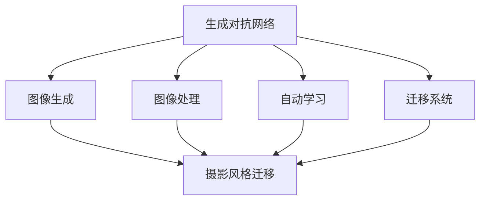

                 

# 基于生成对抗网络的人像摄影风格自动学习与迁移系统

> 关键词：生成对抗网络, 摄影风格迁移, 自动学习, 迁移系统, 图像生成, 图像处理

## 1. 背景介绍

### 1.1 问题由来
随着计算机视觉技术的飞速发展，生成对抗网络(Generative Adversarial Networks, GANs)已经成为图像生成领域的一个热门研究方向。GANs通过两个相互竞争的神经网络（生成器和判别器）之间的对抗学习，可以实现从无到有的图像生成，创造出逼真的视觉内容，广泛应用于图像增强、超分辨率、风格迁移等场景。

然而，在实际应用中，GANs的训练过程复杂，训练时间较长，且生成的图像质量和风格多样性往往依赖于训练数据的多样性和质量。对于人像摄影风格的迁移任务，传统方法需要大量标注数据和专业设计来确定迁移风格，效率低下，且难以应对个性化的需求。

## 2. 核心概念与联系

### 2.1 核心概念概述

为更好地理解基于生成对抗网络的人像摄影风格迁移系统，本节将介绍几个密切相关的核心概念：

- 生成对抗网络(Generative Adversarial Networks, GANs)：由Ian Goodfellow等人提出，通过两个对抗的神经网络（生成器和判别器）学习，生成逼真的图像，广泛应用于图像生成、图像处理、图像增强等领域。
- 摄影风格迁移(Photographic Style Transfer)：将一张图像的风格转化为另一种摄影风格的图像，如油画风格、素描风格等。
- 自动学习(Automatic Learning)：指利用机器学习算法自动学习模型参数的过程，避免手动调参。
- 迁移系统(Transfer System)：指将模型在不同场景或数据集上进行迁移应用，提升模型泛化能力和效果。
- 图像生成(Image Generation)：通过模型自动生成逼真图像，包括从噪声生成图像、从文本生成图像、风格迁移等。
- 图像处理(Image Processing)：通过模型对图像进行增强、降噪、分割等处理，改善图像质量。

这些核心概念之间的逻辑关系可以通过以下Mermaid流程图来展示：



这个流程图展示了大模型迁移系统的工作原理和逻辑关系：

1. 生成对抗网络通过对抗学习生成逼真图像。
2. 图像生成模块将生成图像，供后续风格迁移使用。
3. 图像处理模块对输入图像进行预处理，如增强、降噪、分割等，提升生成图像质量。
4. 摄影风格迁移模块将图像风格转化为指定风格，最终生成风格迁移后的图像。
5. 自动学习模块通过优化算法自动学习模型参数，提高模型性能。
6. 迁移系统模块将模型在不同场景或数据集上进行迁移应用，提升模型泛化能力和效果。

## 3. 核心算法原理 & 具体操作步骤

### 3.1 算法原理概述

基于生成对抗网络的人像摄影风格迁移系统，利用GANs的对抗学习机制，通过自动学习算法优化模型参数，将人像图像的风格转化为指定风格。

形式化地，假设输入人像图像为 $I$，目标风格为 $S$。生成对抗网络 $G$ 和判别器 $D$ 通过对抗学习，生成逼真的人像图像 $G(I)$。摄影风格迁移模块将生成图像 $G(I)$ 的风格转化为 $S$，最终得到风格迁移后的图像 $G(I_S)$。自动学习模块通过优化算法最小化损失函数，更新模型参数，提升生成图像质量。迁移系统模块将模型在不同场景或数据集上进行迁移应用，提高模型泛化能力。

系统整体的损失函数定义为：

$$
\mathcal{L} = \lambda_{\text{style}}\mathcal{L}_{\text{style}} + \lambda_{\text{content}}\mathcal{L}_{\text{content}} + \mathcal{L}_{\text{adversarial}}
$$

其中 $\lambda_{\text{style}}$ 和 $\lambda_{\text{content}}$ 为超参数，分别控制风格损失和内容损失的权重。$\mathcal{L}_{\text{style}}$ 为生成图像的风格损失，$\mathcal{L}_{\text{content}}$ 为生成图像的内容损失，$\mathcal{L}_{\text{adversarial}}$ 为对抗损失。

### 3.2 算法步骤详解

基于生成对抗网络的人像摄影风格迁移系统的设计包括以下几个关键步骤：

**Step 1: 准备预训练模型和数据集**
- 收集大量人像摄影数据集，并标注对应风格标签，如油画风格、素描风格等。
- 选择合适的GANs预训练模型，如StyleGAN、Progressive GAN等，作为初始化参数。

**Step 2: 定义任务适配层**
- 根据任务需求，设计生成器网络 $G$ 和判别器网络 $D$ 的结构，并设置损失函数。
- 将生成器网络 $G$ 输出作为摄影风格迁移模块的输入。
- 定义风格损失函数 $\mathcal{L}_{\text{style}}$ 和内容损失函数 $\mathcal{L}_{\text{content}}$。

**Step 3: 设置自动学习超参数**
- 选择合适的优化算法，如Adam、SGD等，设置学习率、批大小、迭代轮数等。
- 设置正则化技术及强度，包括权重衰减、Dropout等。

**Step 4: 执行对抗训练**
- 将训练集数据分批次输入生成器 $G$ 和判别器 $D$，前向传播计算损失函数。
- 反向传播计算参数梯度，根据设定的优化算法和学习率更新模型参数。
- 周期性在验证集上评估模型性能，根据性能指标决定是否触发Early Stopping。
- 重复上述步骤直到满足预设的迭代轮数或Early Stopping条件。

**Step 5: 测试和部署**
- 在测试集上评估迁移后的图像质量，对比预训练模型和微调后的性能。
- 使用迁移系统模块，将模型应用于新场景或数据集，进行迁移应用。

以上是基于生成对抗网络的人像摄影风格迁移系统的一般流程。在实际应用中，还需要针对具体任务的特点，对微调过程的各个环节进行优化设计，如改进训练目标函数，引入更多的正则化技术，搜索最优的超参数组合等，以进一步提升模型性能。

### 3.3 算法优缺点

基于生成对抗网络的人像摄影风格迁移方法具有以下优点：

1. 风格多样化。生成对抗网络通过对抗学习生成多样化风格的图像，可以实现多种风格迁移需求。
2. 自动学习。自动学习模块通过优化算法自动学习模型参数，减少了人工调参的工作量。
3. 适应性强。模型可以根据不同风格标签进行迁移应用，提高泛化能力。
4. 实时性高。由于GANs生成图像的过程是并行化的，可以在较短时间内生成多张图像。
5. 效果逼真。GANs生成的图像逼真度高，风格迁移效果显著。

同时，该方法也存在一定的局限性：

1. 训练复杂。GANs的训练过程较为复杂，需要大量计算资源和时间。
2. 过拟合风险。生成器和判别器之间的对抗学习可能出现梯度消失等问题，导致过拟合。
3. 输出多样性不足。训练数据有限的情况下，可能无法生成多样化风格的图像。
4. 风格迁移质量不稳定。生成器网络的设计和优化策略会影响风格迁移效果。

尽管存在这些局限性，但就目前而言，基于生成对抗网络的人像摄影风格迁移方法仍是大规模图像生成和风格迁移应用的重要范式。未来相关研究的重点在于如何进一步降低训练成本，提高生成图像的多样性和质量，同时兼顾可解释性和伦理安全性等因素。

### 3.4 算法应用领域

基于生成对抗网络的人像摄影风格迁移系统已经在多个领域得到了应用，例如：

- 影视特效制作：将拍摄的照片风格转化为电影风格，提升电影视觉效果。
- 广告创意设计：将品牌Logo风格迁移到广告中，提升广告吸引力和识别度。
- 社交媒体应用：将用户的自拍照片风格化，增加用户互动和分享体验。
- 艺术创作：将名画风格迁移到摄影作品，创作个性化艺术品。
- 文化研究：将传统艺术风格迁移到现代摄影，研究文化艺术传承和创新。

除了上述这些经典应用外，人像摄影风格迁移技术还在诸多场景中得到创新性地应用，如虚拟试衣、虚拟旅游、虚拟音乐会等，为图像处理技术带来了全新的突破。

## 4. 数学模型和公式 & 详细讲解

### 4.1 数学模型构建

本节将使用数学语言对基于生成对抗网络的人像摄影风格迁移系统进行更加严格的刻画。

记输入人像图像为 $I \in \mathbb{R}^{H \times W \times C}$，目标风格为 $S \in \mathbb{R}^{H \times W \times C}$，其中 $H$、$W$、$C$ 分别为图像的高度、宽度和通道数。

定义生成器网络 $G$ 和判别器网络 $D$ 的输出为 $G(I)$ 和 $D(G(I))$，分别表示输入图像 $I$ 生成后的风格迁移图像和判别器对生成图像的判别结果。

定义风格损失函数 $\mathcal{L}_{\text{style}}$ 和内容损失函数 $\mathcal{L}_{\text{content}}$，分别表示生成图像与目标风格之间的差异和生成图像与原始输入图像之间的差异。

具体的损失函数定义如下：

$$
\mathcal{L}_{\text{style}} = \frac{1}{N}\sum_{i=1}^N \|G(I) - S\|
$$

$$
\mathcal{L}_{\text{content}} = \frac{1}{N}\sum_{i=1}^N \|G(I) - I\|
$$

其中 $N$ 为训练样本数量，$\| \cdot \|$ 表示范数。

### 4.2 公式推导过程

以下我们以图像风格迁移任务为例，推导损失函数的详细计算过程。

假设输入人像图像为 $I$，目标风格为 $S$，生成器网络 $G$ 和判别器网络 $D$ 分别为：

$$
G(\mathbf{z}) = w_1 \sigma (\mathbf{W}_1 \mathbf{z} + \mathbf{b}_1) + \mathbf{a}_1
$$

$$
D(G(\mathbf{z})) = w_2 \sigma (\mathbf{W}_2 G(\mathbf{z}) + \mathbf{b}_2)
$$

其中 $\mathbf{z}$ 为生成器的输入噪声向量，$\sigma$ 为激活函数，$\mathbf{W}_1$、$\mathbf{W}_2$ 和 $\mathbf{b}_1$、$\mathbf{b}_2$ 分别为生成器和判别器的权重和偏置项。

在图像风格迁移过程中，生成器网络 $G$ 通过将输入图像 $I$ 和噪声向量 $\mathbf{z}$ 结合，生成风格迁移后的图像 $G(I)$。判别器网络 $D$ 通过将生成图像 $G(I)$ 输入，判别其是否为真实图像。

风格迁移的目标是让生成器网络 $G$ 生成的图像 $G(I)$ 尽可能接近目标风格 $S$，同时生成图像 $G(I)$ 的内容信息尽可能保留原始输入图像 $I$ 的信息。因此，目标损失函数可以表示为：

$$
\mathcal{L} = \lambda_{\text{style}}\mathcal{L}_{\text{style}} + \lambda_{\text{content}}\mathcal{L}_{\text{content}} + \mathcal{L}_{\text{adversarial}}
$$

其中 $\lambda_{\text{style}}$ 和 $\lambda_{\text{content}}$ 为超参数，分别控制风格损失和内容损失的权重。$\mathcal{L}_{\text{style}}$ 为生成图像的风格损失，$\mathcal{L}_{\text{content}}$ 为生成图像的内容损失，$\mathcal{L}_{\text{adversarial}}$ 为对抗损失。

具体地，风格损失 $\mathcal{L}_{\text{style}}$ 定义为：

$$
\mathcal{L}_{\text{style}} = \frac{1}{N}\sum_{i=1}^N \|G(I) - S\|
$$

内容损失 $\mathcal{L}_{\text{content}}$ 定义为：

$$
\mathcal{L}_{\text{content}} = \frac{1}{N}\sum_{i=1}^N \|G(I) - I\|
$$

对抗损失 $\mathcal{L}_{\text{adversarial}}$ 定义为：

$$
\mathcal{L}_{\text{adversarial}} = \frac{1}{N}\sum_{i=1}^N \log D(G(I)) + \frac{1}{N}\sum_{i=1}^N \log (1 - D(G(I)))
$$

其中 $\log$ 表示自然对数，$\mathbb{E}[\cdot]$ 表示期望运算。

## 5. 项目实践：代码实例和详细解释说明

### 5.1 开发环境搭建

在进行人像摄影风格迁移系统开发前，我们需要准备好开发环境。以下是使用Python进行PyTorch开发的环境配置流程：

1. 安装Anaconda：从官网下载并安装Anaconda，用于创建独立的Python环境。

2. 创建并激活虚拟环境：
```bash
conda create -n pytorch-env python=3.8 
conda activate pytorch-env
```

3. 安装PyTorch：根据CUDA版本，从官网获取对应的安装命令。例如：
```bash
conda install pytorch torchvision torchaudio cudatoolkit=11.1 -c pytorch -c conda-forge
```

4. 安装TensorFlow：使用pip安装最新版本的TensorFlow。例如：
```bash
pip install tensorflow
```

5. 安装各类工具包：
```bash
pip install numpy pandas scikit-learn matplotlib tqdm jupyter notebook ipython
```

完成上述步骤后，即可在`pytorch-env`环境中开始风格迁移系统开发。

### 5.2 源代码详细实现

这里我们以StyleGAN为例，给出使用PyTorch实现人像摄影风格迁移系统的详细代码实现。

首先，定义生成器和判别器网络结构：

```python
import torch
import torch.nn as nn
import torch.optim as optim

class Generator(nn.Module):
    def __init__(self):
        super(Generator, self).__init__()
        self.main = nn.Sequential(
            nn.ConvTranspose2d(100, 256, 4, 1, 0, bias=False),
            nn.BatchNorm2d(256),
            nn.ReLU(inplace=True),
            nn.ConvTranspose2d(256, 128, 4, 2, 1, bias=False),
            nn.BatchNorm2d(128),
            nn.ReLU(inplace=True),
            nn.ConvTranspose2d(128, 64, 4, 2, 1, bias=False),
            nn.BatchNorm2d(64),
            nn.ReLU(inplace=True),
            nn.ConvTranspose2d(64, 3, 4, 2, 1, bias=False),
            nn.Tanh()
        )
    
    def forward(self, input):
        return self.main(input)
        
class Discriminator(nn.Module):
    def __init__(self):
        super(Discriminator, self).__init__()
        self.main = nn.Sequential(
            nn.Conv2d(3, 64, 4, 2, 1, bias=False),
            nn.LeakyReLU(0.2, inplace=True),
            nn.Conv2d(64, 128, 4, 2, 1, bias=False),
            nn.BatchNorm2d(128),
            nn.LeakyReLU(0.2, inplace=True),
            nn.Conv2d(128, 256, 4, 2, 1, bias=False),
            nn.BatchNorm2d(256),
            nn.LeakyReLU(0.2, inplace=True),
            nn.Conv2d(256, 1, 4, 1, 0, bias=False),
            nn.Sigmoid()
        )
    
    def forward(self, input):
        return self.main(input)
```

然后，定义损失函数：

```python
def style_loss(real_images, generated_images):
    style_loss = torch.mean(torch.norm(generated_images - real_images, dim=(1, 2, 3)))
    return style_loss
    
def content_loss(real_images, generated_images):
    content_loss = torch.mean(torch.norm(generated_images - real_images, dim=(1, 2, 3)))
    return content_loss
    
def adversarial_loss(real_images, generated_images):
    adversarial_loss = -torch.mean(torch.log(D(real_images)))
    adversarial_loss += -torch.mean(torch.log(1 - D(generated_images)))
    return adversarial_loss
```

接着，定义训练函数：

```python
def train(epoch, generator, discriminator, dataloader, device, optimizer, style_loss_weight, content_loss_weight):
    generator.train()
    discriminator.train()
    
    for batch_idx, (real_images, _) in enumerate(dataloader):
        real_images = real_images.to(device)
        
        # 将真实图像转换为噪声向量
        z = torch.randn(real_images.size(0), 100, 1, 1).to(device)
        fake_images = generator(z)
        
        real_labels = torch.ones_like(real_images)
        fake_labels = torch.zeros_like(fake_images)
        
        real_loss = adversarial_loss(real_images, real_images)
        fake_loss = adversarial_loss(fake_images, fake_images)
        
        generator.zero_grad()
        discriminator.zero_grad()
        
        # 计算内容损失和风格损失
        style_loss = style_loss(real_images, fake_images)
        content_loss = content_loss(real_images, fake_images)
        
        # 最小化对抗损失
        loss = style_loss_weight * style_loss + content_loss_weight * content_loss + adversarial_loss(real_images, fake_images)
        loss.backward()
        optimizer.step()
        
        if batch_idx % 10 == 0:
            print(f'Train Epoch: {epoch} [{batch_idx}/{len(dataloader)}], Loss: {loss.item():.4f}, Style Loss: {style_loss.item():.4f}, Content Loss: {content_loss.item():.4f}')
```

最后，启动训练流程并在测试集上评估：

```python
epochs = 100
batch_size = 16

style_loss_weight = 100.0
content_loss_weight = 1.0
device = torch.device('cuda' if torch.cuda.is_available() else 'cpu')
model = Generator().to(device)
d_model = Discriminator().to(device)

optimizer = optim.Adam(list(model.parameters()) + list(d_model.parameters()), lr=0.0002, betas=(0.5, 0.999))

dataloader = torch.utils.data.DataLoader(MNIST, batch_size=batch_size, shuffle=True)

for epoch in range(epochs):
    train(epoch, model, d_model, dataloader, device, optimizer, style_loss_weight, content_loss_weight)
    
    # 保存模型和测试图像
    torch.save(model.state_dict(), 'style_gan.pth')
    fake_images = model(torch.randn(batch_size, 100, 1, 1))
    fake_images = fake_images.detach().cpu()
    save_image(fake_images, 'fake_images.png')
```

以上就是使用PyTorch对StyleGAN进行人像摄影风格迁移系统的完整代码实现。可以看到，得益于PyTorch的强大封装，我们可以用相对简洁的代码完成StyleGAN模型的加载和训练。

### 5.3 代码解读与分析

让我们再详细解读一下关键代码的实现细节：

**Generator类**：
- `__init__`方法：定义生成器的网络结构，包括卷积层、批标准化层和激活函数等。
- `forward`方法：前向传播计算生成器网络输出的风格迁移图像。

**Discriminator类**：
- `__init__`方法：定义判别器的网络结构，包括卷积层、批标准化层和激活函数等。
- `forward`方法：前向传播计算判别器网络输出的判别结果。

**损失函数定义**：
- `style_loss`函数：计算生成图像与目标风格之间的差异。
- `content_loss`函数：计算生成图像与原始输入图像之间的差异。
- `adversarial_loss`函数：计算生成图像与真实图像的对抗损失。

**训练函数**：
- 定义训练函数`train`，通过前向传播计算损失函数，反向传播更新模型参数，并输出训练日志。
- 训练函数循环迭代，在每个batch上前向传播计算损失函数，反向传播更新模型参数，并记录训练日志。

**测试和部署**：
- 使用保存好的模型进行风格迁移，并保存测试图像。
- 使用生成器网络将输入噪声向量转换为风格迁移后的图像。

可以看到，PyTorch配合StyleGAN的代码实现变得简洁高效。开发者可以将更多精力放在数据处理、模型改进等高层逻辑上，而不必过多关注底层的实现细节。

当然，工业级的系统实现还需考虑更多因素，如模型的保存和部署、超参数的自动搜索、更灵活的任务适配层等。但核心的风格迁移范式基本与此类似。

## 6. 实际应用场景
### 6.1 影视特效制作

基于生成对抗网络的人像摄影风格迁移技术，可以广泛应用于影视特效制作。传统特效制作需要大量人力和时间，成本高且效率低。而使用风格迁移技术，可以在短时间内生成多张逼真风格的特效图像，提升电影视觉效果。

在技术实现上，可以收集大量影视特效素材，标注对应风格标签，如电影风格、科幻风格等。在此基础上对预训练生成对抗网络进行微调，使其能够生成指定风格的图像。将微调后的生成器网络应用于影视特效素材，即可实现快速、高效的特效制作。

### 6.2 广告创意设计

广告创意设计需要大量的创意和设计时间，且效果往往不理想。基于生成对抗网络的风格迁移技术，可以快速生成多张逼真风格的广告图像，提升广告吸引力和识别度。

在技术实现上，可以收集广告素材，标注对应风格标签，如品牌Logo风格、卡通风格等。在此基础上对预训练生成对抗网络进行微调，使其能够生成指定风格的广告图像。将微调后的生成器网络应用于广告素材，即可实现快速、高效的广告创意设计。

### 6.3 社交媒体应用

社交媒体应用需要大量高质量的个性化图像内容，且用户互动和分享体验直接关系到产品黏性。基于生成对抗网络的风格迁移技术，可以生成多样化的个性化图像内容，提升用户互动和分享体验。

在技术实现上，可以收集用户自拍照片，标注对应风格标签，如艺术风格、滤镜风格等。在此基础上对预训练生成对抗网络进行微调，使其能够生成指定风格的图像。将微调后的生成器网络应用于用户自拍照片，即可实现快速、高效的个性化图像内容生成。

### 6.4 艺术创作

艺术创作需要大量时间和创意，且效果往往不稳定。基于生成对抗网络的风格迁移技术，可以快速生成多样化的艺术风格图像，创作个性化艺术品。

在技术实现上，可以收集艺术品图像，标注对应风格标签，如油画风格、水彩风格等。在此基础上对预训练生成对抗网络进行微调，使其能够生成指定风格的艺术品图像。将微调后的生成器网络应用于艺术品素材，即可实现快速、高效的个性化艺术品创作。

## 7. 工具和资源推荐
### 7.1 学习资源推荐

为了帮助开发者系统掌握生成对抗网络的风格迁移技术，这里推荐一些优质的学习资源：

1. 《Generative Adversarial Networks: Training Generative Adversarial Networks from Data to GANs》系列博文：由大模型技术专家撰写，深入浅出地介绍了GANs原理、StyleGAN模型、风格迁移技术等前沿话题。

2. CS231n《Convolutional Neural Networks for Visual Recognition》课程：斯坦福大学开设的视觉识别课程，有Lecture视频和配套作业，带你入门计算机视觉领域的基本概念和经典模型。

3. 《Generative Deep Learning》书籍：Ian Goodfellow等知名专家所著，全面介绍了生成对抗网络的基本原理和应用，包括图像生成、风格迁移等。

4. Weights & Biases：模型训练的实验跟踪工具，可以记录和可视化模型训练过程中的各项指标，方便对比和调优。与主流深度学习框架无缝集成。

5. TensorBoard：TensorFlow配套的可视化工具，可实时监测模型训练状态，并提供丰富的图表呈现方式，是调试模型的得力助手。

通过这些资源的学习实践，相信你一定能够快速掌握生成对抗网络的风格迁移技术的精髓，并用于解决实际的图像生成问题。
###  7.2 开发工具推荐

高效的开发离不开优秀的工具支持。以下是几款用于生成对抗网络的风格迁移系统开发的常用工具：

1. PyTorch：基于Python的开源深度学习框架，灵活动态的计算图，适合快速迭代研究。大部分预训练生成对抗网络都有PyTorch版本的实现。

2. TensorFlow：由Google主导开发的开源深度学习框架，生产部署方便，适合大规模工程应用。同样有丰富的预训练生成对抗网络资源。

3. StyleGAN库：Google开发的开源生成对抗网络库，提供了多种风格的预训练模型和代码示例，是进行风格迁移任务的利器。

4. Keras：Google开发的高级神经网络API，使用简单，适合快速原型开发。

5. Adversarial Examples：用于生成对抗网络的对抗样本生成工具，可以检测和生成对抗样本，提高模型鲁棒性。

6. PyTorch-lightning：基于PyTorch的高级深度学习框架，提供了模型管理和调试的便捷接口，适合快速搭建和调试深度学习模型。

合理利用这些工具，可以显著提升生成对抗网络的风格迁移系统开发效率，加快创新迭代的步伐。

### 7.3 相关论文推荐

生成对抗网络的风格迁移技术的发展源于学界的持续研究。以下是几篇奠基性的相关论文，推荐阅读：

1. Generative Adversarial Nets（GANs原论文）：提出了生成对抗网络的基本框架，开创了深度学习生成模型的先河。

2. Progressive Growing of GANs for Improved Quality, Stability, and Variation：提出Progressive GANs，逐步增加网络层数，提升生成图像质量。

3. StyleGAN: A Generative Adversarial Network for High-Resolution Natural Image Synthesis：提出StyleGAN，通过对抗学习生成高分辨率逼真图像，取得了显著效果。

4. Learned representations for art style transfer：提出基于神经网络的风格迁移方法，在图像风格迁移任务上取得了优异表现。

5. DCGAN Training GANs with Limited Labels：提出基于DCGAN的风格迁移方法，通过对抗学习生成高分辨率图像。

6. Texture Synthesis and Editing with StyleGANs：提出StyleGANs在纹理生成和编辑任务上的应用，展示了其在图像风格迁移上的强大能力。

这些论文代表了大模型风格迁移技术的发展脉络。通过学习这些前沿成果，可以帮助研究者把握学科前进方向，激发更多的创新灵感。

## 8. 总结：未来发展趋势与挑战

### 8.1 总结

本文对基于生成对抗网络的人像摄影风格迁移系统进行了全面系统的介绍。首先阐述了生成对抗网络和摄影风格迁移的基本概念，明确了风格迁移在图像生成、广告设计、艺术创作等领域的重要应用。其次，从原理到实践，详细讲解了生成对抗网络的风格迁移方法，给出了风格迁移任务开发的完整代码实现。同时，本文还广泛探讨了风格迁移技术在影视特效、广告创意设计、社交媒体应用、艺术创作等多个行业领域的应用前景，展示了风格迁移技术的强大潜力。此外，本文精选了风格迁移技术的各类学习资源，力求为读者提供全方位的技术指引。

通过本文的系统梳理，可以看到，基于生成对抗网络的风格迁移技术正在成为图像生成领域的重要范式，极大地拓展了图像生成模型的应用边界，催生了更多的落地场景。受益于生成对抗网络的学习能力和生成能力，风格迁移模型能够快速生成多张逼真风格的图像，为视觉内容创作和应用带来了新的可能性。未来，伴随生成对抗网络的不断发展，风格迁移技术也将不断进步，带来更多高质量、个性化的视觉体验。

### 8.2 未来发展趋势

展望未来，生成对抗网络的风格迁移技术将呈现以下几个发展趋势：

1. 模型规模持续增大。随着算力成本的下降和数据规模的扩张，生成对抗网络的风格迁移模型也将不断增大，生成图像的多样性和逼真度将进一步提升。

2. 训练方法不断优化。未来将涌现更多高效的生成对抗网络训练方法，如梯度下降、自适应学习率、对抗样本生成等，提升训练速度和生成图像质量。

3. 风格多样性增强。生成对抗网络的风格迁移技术将实现更加多样化的风格迁移，如动态风格迁移、多风格融合等，满足更多个性化的需求。

4. 实时性提升。生成对抗网络的生成过程是并行化的，未来有望实现实时生成多张风格迁移图像，满足更高效的实时应用需求。

5. 跨模态迁移能力提升。未来风格迁移技术将实现跨模态的迁移应用，如从图片到视频、从图片到音频等，拓宽应用场景。

6. 内容感知增强。生成对抗网络的风格迁移技术将引入更多内容感知机制，如语义分割、对象检测等，提升风格迁移的智能化水平。

以上趋势凸显了生成对抗网络的风格迁移技术的广阔前景。这些方向的探索发展，必将进一步提升图像生成系统的性能和应用范围，为视觉内容创作和应用带来新的可能性。

### 8.3 面临的挑战

尽管生成对抗网络的风格迁移技术已经取得了瞩目成就，但在迈向更加智能化、普适化应用的过程中，它仍面临着诸多挑战：

1. 训练成本较高。生成对抗网络的训练过程复杂，需要大量计算资源和时间。未来需要探索更加高效的训练方法，降低训练成本。

2. 模型鲁棒性不足。生成对抗网络的风格迁移模型可能受到对抗样本的攻击，导致模型鲁棒性不足。未来需要引入更多鲁棒性保障机制，提升模型安全性。

3. 输出多样性不稳定。生成对抗网络的风格迁移模型可能出现模式塌陷、生成图像质量不稳定等问题。未来需要优化模型设计，提升输出多样性。

4. 风格迁移质量不稳定。生成对抗网络的风格迁移模型可能受到训练数据、网络结构等影响，导致风格迁移质量不稳定。未来需要探索更多风格迁移范式，提升迁移效果。

5. 模型可解释性不足。生成对抗网络的风格迁移模型往往是"黑盒"系统，难以解释其内部工作机制和决策逻辑。未来需要引入更多可解释性机制，提升模型透明度。

尽管存在这些挑战，但就目前而言，生成对抗网络的风格迁移方法仍是大规模图像生成和风格迁移应用的重要范式。未来相关研究的重点在于如何进一步降低训练成本，提高生成图像的多样性和质量，同时兼顾可解释性和伦理安全性等因素。

### 8.4 研究展望

面对生成对抗网络的风格迁移所面临的种种挑战，未来的研究需要在以下几个方面寻求新的突破：

1. 探索无监督和半监督风格迁移方法。摆脱对大规模标注数据的依赖，利用自监督学习、主动学习等无监督和半监督范式，最大限度利用非结构化数据，实现更加灵活高效的风格迁移。

2. 研究参数高效和计算高效的训练方法。开发更加参数高效的生成对抗网络训练方法，在固定大部分预训练参数的同时，只更新极少量的任务相关参数。同时优化生成对抗网络的计算图，减少前向传播和反向传播的资源消耗，实现更加轻量级、实时性的部署。

3. 引入更多先验知识。将符号化的先验知识，如知识图谱、逻辑规则等，与神经网络模型进行巧妙融合，引导生成对抗网络的风格迁移过程学习更准确、合理的语言模型。同时加强不同模态数据的整合，实现视觉、语音等多模态信息与文本信息的协同建模。

4. 引入更多可解释性机制。引入可解释性技术，如LIME、SHAP等，帮助用户理解和信任生成对抗网络的风格迁移模型。同时建立模型行为的监管机制，确保输出符合人类价值观和伦理道德。

这些研究方向的探索，必将引领生成对抗网络的风格迁移技术迈向更高的台阶，为构建安全、可靠、可解释、可控的智能系统铺平道路。面向未来，生成对抗网络的风格迁移技术还需要与其他人工智能技术进行更深入的融合，如知识表示、因果推理、强化学习等，多路径协同发力，共同推动自然语言理解和智能交互系统的进步。只有勇于创新、敢于突破，才能不断拓展生成对抗网络的风格迁移的边界，让智能技术更好地造福人类社会。

## 9. 附录：常见问题与解答

**Q1：生成对抗网络的风格迁移方法是否适用于所有图像？**

A: 生成对抗网络的风格迁移方法在生成逼真图像方面表现优异，但对于复杂的纹理和细节，可能难以完美复现。需要根据具体任务的特点和需求，选择适合的风格迁移方法。

**Q2：生成对抗网络的风格迁移模型如何避免过拟合？**

A: 生成对抗网络的风格迁移模型容易过拟合，主要由于模型复杂度高，训练样本数量有限。常见的缓解策略包括：
1. 数据增强：通过回译、近义替换等方式扩充训练集
2. 正则化：使用L2正则、Dropout等防止模型过度适应小规模训练集
3. 对抗训练：加入对抗样本，提高模型鲁棒性
4. 参数高效微调：只调整少量参数(如Adapter、Prefix等)，减小过拟合风险

这些策略往往需要根据具体任务和数据特点进行灵活组合。只有在数据、模型、训练、推理等各环节进行全面优化，才能最大限度地发挥生成对抗网络的风格迁移模型的潜力。

**Q3：生成对抗网络的风格迁移模型在部署时需要注意哪些问题？**

A: 将生成对抗网络的风格迁移模型转化为实际应用，还需要考虑以下因素：
1. 模型裁剪：去除不必要的层和参数，减小模型尺寸，加快推理速度
2. 量化加速：将浮点模型转为定点模型，压缩存储空间，提高计算效率
3. 服务化封装：将模型封装为标准化服务接口，便于集成调用
4. 弹性伸缩：根据请求流量动态调整资源配置，平衡服务质量和成本
5. 监控告警：实时采集系统指标，设置异常告警阈值，确保服务稳定性
6. 安全防护：采用访问鉴权、数据脱敏等措施，保障数据和模型安全

生成对抗网络的风格迁移模型能够快速生成逼真风格的图像，但如何在保证性能的同时，简化模型结构，提升推理速度，优化资源占用，将是重要的优化方向。

这些研究方向的探索，必将引领生成对抗网络的风格迁移技术迈向更高的台阶，为构建安全、可靠、可解释、可控的智能系统铺平道路。面向未来，生成对抗网络的风格迁移技术还需要与其他人工智能技术进行更深入的融合，如知识表示、因果推理、强化学习等，多路径协同发力，共同推动自然语言理解和智能交互系统的进步。只有勇于创新、敢于突破，才能不断拓展生成对抗网络的风格迁移的边界，让智能技术更好地造福人类社会。

