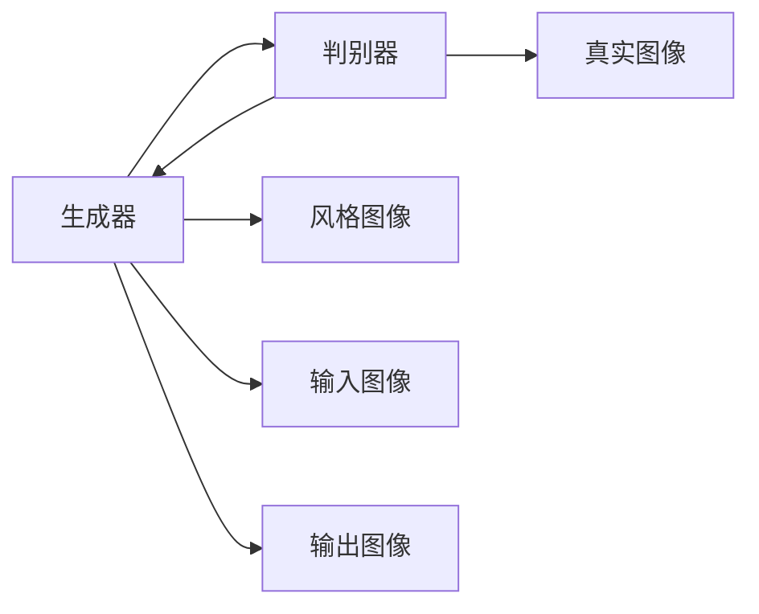

                 

# 基于生成对抗网络的图像风格迁移质量评价模型

> 关键词：图像风格迁移,生成对抗网络,质量评价模型,损失函数,感知损失,对抗损失,判别器损失,感知参数化

## 1. 背景介绍

随着深度学习技术的发展，图像风格迁移成为了计算机视觉领域中的一个热门研究方向。通过风格迁移，可以将一张图像的风格转换为另一张图像的风格，生成具有新风格的图像，这在游戏、艺术创作、广告设计等领域有广泛应用。然而，传统的风格迁移方法在迁移质量和迁移效果上仍存在一些问题，如何评价和提升图像风格迁移的质量，成为当前研究的一个重要方向。

本博客将详细介绍基于生成对抗网络（GAN）的图像风格迁移质量评价模型，从原理、算法步骤、应用和未来展望等方面深入探讨，帮助读者全面理解该模型，并在实际项目中灵活应用。

## 2. 核心概念与联系

### 2.1 核心概念概述

在介绍生成对抗网络（GAN）之前，我们先了解一些相关概念。

- **生成对抗网络（GAN）**：由生成器（Generator）和判别器（Discriminator）两部分组成。生成器负责生成假图像，判别器负责区分真实图像和假图像。两者通过博弈学习，最终生成逼真的假图像。GAN 最早由 Ian Goodfellow 在 2014 年提出，现已成为图像生成、图像风格迁移等领域的核心技术。

- **图像风格迁移**：指将一张图像的视觉风格迁移到另一张图像，使得图像在保留原始内容的同时，具有不同的视觉风格。该技术可以应用于艺术创作、广告设计、游戏动画等领域，显著提升图像的视觉吸引力。

### 2.2 核心概念原理和架构的 Mermaid 流程图



上图中，生成器从风格图像中学习风格特征，并将其应用到输入图像上，生成具有新风格的图像。判别器同时学习识别真实图像和假图像的能力，指导生成器生成更逼真的图像。

## 3. 核心算法原理 & 具体操作步骤

### 3.1 算法原理概述

基于生成对抗网络的图像风格迁移质量评价模型，通过判别器和生成器之间的博弈学习，来评价生成图像的质量。模型的核心思想是：判别器评估生成图像与真实图像的差异，生成器通过对抗学习，生成逼真的假图像，以提升生成图像的质量。

模型的训练过程如下：

1. **生成器训练**：固定判别器参数，训练生成器生成逼真的假图像。
2. **判别器训练**：固定生成器参数，训练判别器区分真实图像和假图像。
3. **循环迭代**：重复进行生成器和判别器的训练，直到两者收敛。

### 3.2 算法步骤详解

#### 3.2.1 初始化

- 选择生成器和判别器的初始参数。
- 准备真实图像集 $R$ 和风格图像集 $S$。
- 设置模型参数 $θ_G$ 和 $θ_D$，分别代表生成器和判别器的参数。

#### 3.2.2 生成器训练

生成器通过随机噪声 $z$ 生成一批假图像 $G(z)$，将其输入判别器，判别器返回一个概率值 $p(D,G(z))$，表示 $G(z)$ 是真实图像的概率。生成器的损失函数 $L_G$ 如下：

$$
L_G = -E_{z \sim p(z)} [log(D(G(z)))]
$$

其中 $p(z)$ 为噪声的分布。

生成器的训练过程如下：

1. 生成一批随机噪声 $z$。
2. 生成假图像 $G(z)$。
3. 将 $G(z)$ 输入判别器，计算损失。
4. 使用优化器更新生成器参数 $θ_G$。

#### 3.2.3 判别器训练

判别器的目标是区分真实图像和假图像。其损失函数 $L_D$ 如下：

$$
L_D = -E_{x \sim p(x)} [log(D(x))] - E_{z \sim p(z)} [log(1-D(G(z)))]
$$

其中 $p(x)$ 为真实图像的分布，$p(z)$ 为噪声的分布。

判别器的训练过程如下：

1. 准备一批真实图像 $x$ 和假图像 $G(z)$。
2. 将 $x$ 和 $G(z)$ 输入判别器，计算损失。
3. 使用优化器更新判别器参数 $θ_D$。

#### 3.2.4 循环迭代

重复进行生成器和判别器的训练，直到两者收敛。

### 3.3 算法优缺点

#### 3.3.1 优点

- **生成效果逼真**：通过对抗学习，生成器能够生成更逼真的假图像，提升生成图像的质量。
- **可解释性**：判别器通过训练，可以清晰地识别出真实图像和假图像的差异，生成器的学习过程也更容易理解。
- **鲁棒性强**：判别器和生成器之间的博弈学习，使得模型对输入噪声、图像变形等扰动具有较好的鲁棒性。

#### 3.3.2 缺点

- **计算复杂**：GAN 训练过程复杂，需要大量的计算资源和时间。
- **模式崩塌**：生成器可能学习到不稳定、复杂的模式，导致生成图像的质量波动。
- **对抗样本**：判别器可能被对抗样本欺骗，导致生成器生成的假图像被误判为真实图像。

### 3.4 算法应用领域

基于生成对抗网络的图像风格迁移质量评价模型，已经在图像风格迁移、图像生成、图像修复等领域得到了广泛应用。以下是一些具体的应用场景：

- **艺术创作**：艺术家可以使用该模型，将真实图像的风格迁移到艺术作品中，创作具有独特风格的艺术作品。
- **广告设计**：广告公司可以使用该模型，将一些成功广告的风格应用到新产品中，生成具有吸引力的广告图像。
- **游戏动画**：游戏开发者可以使用该模型，将角色的动作和表情迁移到其他角色中，生成逼真的游戏动画。
- **图像修复**：研究人员可以使用该模型，将损坏的图像恢复成高质量的图像，提升图像的视觉效果。

## 4. 数学模型和公式 & 详细讲解 & 举例说明

### 4.1 数学模型构建

假设有一张真实图像 $x$ 和一张风格图像 $s$，以及生成器和判别器的参数 $θ_G$ 和 $θ_D$。我们需要构建一个数学模型，来评价生成图像的质量。

模型由两部分组成：生成器 $G$ 和判别器 $D$。生成器的目标是生成逼真的假图像 $G(z)$，判别器的目标是区分真实图像 $x$ 和假图像 $G(z)$。

生成器的损失函数 $L_G$ 如下：

$$
L_G = -E_{z \sim p(z)} [log(D(G(z)))]
$$

其中 $p(z)$ 为噪声的分布，$D$ 为判别器。

判别器的损失函数 $L_D$ 如下：

$$
L_D = -E_{x \sim p(x)} [log(D(x))] - E_{z \sim p(z)} [log(1-D(G(z)))]
$$

其中 $p(x)$ 为真实图像的分布，$p(z)$ 为噪声的分布。

### 4.2 公式推导过程

生成器的梯度如下：

$$
\frac{\partial L_G}{\partial θ_G} = \frac{\partial}{\partial θ_G} [ -E_{z \sim p(z)} [log(D(G(z)))] ]
$$

$$
\frac{\partial L_G}{\partial θ_G} = -E_{z \sim p(z)} [ \frac{\partial}{\partial θ_G} [log(D(G(z)))] ]
$$

$$
\frac{\partial L_G}{\partial θ_G} = -E_{z \sim p(z)} [ \frac{\partial}{\partial G(z)} [log(D(G(z)))] \cdot \frac{\partial G(z)}{\partial θ_G} ]
$$

$$
\frac{\partial L_G}{\partial θ_G} = -E_{z \sim p(z)} [ \frac{\partial}{\partial G(z)} [log(D(G(z)))] \cdot \frac{\partial G(z)}{\partial θ_G} ]
$$

判别器的梯度如下：

$$
\frac{\partial L_D}{\partial θ_D} = \frac{\partial}{\partial θ_D} [ -E_{x \sim p(x)} [log(D(x))] - E_{z \sim p(z)} [log(1-D(G(z)))] ]
$$

$$
\frac{\partial L_D}{\partial θ_D} = -E_{x \sim p(x)} [ \frac{\partial}{\partial θ_D} [log(D(x))] ] - E_{z \sim p(z)} [ \frac{\partial}{\partial θ_D} [log(1-D(G(z)))] ]
$$

$$
\frac{\partial L_D}{\partial θ_D} = -E_{x \sim p(x)} [ \frac{\partial}{\partial D(x)} [log(D(x))] \cdot \frac{\partial D(x)}{\partial θ_D} ] - E_{z \sim p(z)} [ \frac{\partial}{\partial D(G(z))} [log(1-D(G(z)))] \cdot \frac{\partial D(G(z))}{\partial θ_D} ]
$$

$$
\frac{\partial L_D}{\partial θ_D} = -E_{x \sim p(x)} [ \frac{\partial}{\partial D(x)} [log(D(x))] \cdot \frac{\partial D(x)}{\partial θ_D} ] - E_{z \sim p(z)} [ -\frac{\partial}{\partial G(z)} [log(1-D(G(z)))] \cdot \frac{\partial D(G(z))}{\partial θ_D} ]
$$

### 4.3 案例分析与讲解

假设有一张真实图像 $x$ 和一张风格图像 $s$，以及生成器和判别器的参数 $θ_G$ 和 $θ_D$。我们希望使用该模型，将风格图像 $s$ 的风格迁移到图像 $x$ 上，生成具有新风格的图像 $y$。

首先，将 $x$ 和 $s$ 输入判别器，计算判别器的输出：

$$
D(x), D(s)
$$

接着，将 $x$ 和 $s$ 的特征图输入生成器，生成假图像 $G(x,s)$：

$$
G(x,s) = G(x) + f(s)
$$

其中 $f$ 为风格迁移函数。

然后，将 $G(x,s)$ 输入判别器，计算判别器的输出：

$$
D(G(x,s))
$$

最后，计算生成器和判别器的损失：

$$
L_G = -E_{z \sim p(z)} [log(D(G(z)))]
$$

$$
L_D = -E_{x \sim p(x)} [log(D(x))] - E_{z \sim p(z)} [log(1-D(G(z)))]
$$

生成器和判别器的训练过程如下：

1. 固定判别器参数 $θ_D$，训练生成器生成逼真的假图像 $G(z)$。
2. 固定生成器参数 $θ_G$，训练判别器区分真实图像 $x$ 和假图像 $G(z)$。
3. 重复进行生成器和判别器的训练，直到两者收敛。

## 5. 项目实践：代码实例和详细解释说明

### 5.1 开发环境搭建

为了进行图像风格迁移质量评价模型的实践，我们需要搭建一个基于 PyTorch 的开发环境。以下是搭建环境的详细步骤：

1. 安装 PyTorch：从官网下载 PyTorch 安装程序，根据系统平台选择安装命令。例如，在 Linux 系统中，可以使用以下命令安装 PyTorch：

   ```
   pip install torch torchvision torchaudio
   ```

2. 安装其他依赖库：安装必要的依赖库，例如 numpy、pandas、matplotlib 等。

   ```
   pip install numpy pandas matplotlib
   ```

3. 配置 GPU：如果您的计算机配备 GPU，需要确保 PyTorch 能够使用 GPU 加速计算。可以使用以下命令查看 GPU 信息：

   ```
   nvidia-smi
   ```

4. 创建虚拟环境：创建 Python 虚拟环境，以避免与系统环境冲突。

   ```
   conda create -n pytorch_env python=3.7
   conda activate pytorch_env
   ```

### 5.2 源代码详细实现

下面是基于 PyTorch 实现图像风格迁移质量评价模型的代码示例。

```python
import torch
import torch.nn as nn
import torch.optim as optim
import torchvision.transforms as transforms
from torchvision.datasets import MNIST
from torchvision.utils import save_image

class Generator(nn.Module):
    def __init__(self):
        super(Generator, self).__init__()
        self.fc1 = nn.Linear(100, 256)
        self.fc2 = nn.Linear(256, 256)
        self.fc3 = nn.Linear(256, 784)
        self.fc4 = nn.Linear(784, 100)
        self.fc5 = nn.Linear(100, 784)

    def forward(self, x):
        x = x.view(-1, 100)
        x = torch.relu(self.fc1(x))
        x = torch.relu(self.fc2(x))
        x = torch.relu(self.fc3(x))
        x = torch.tanh(self.fc4(x))
        x = torch.tanh(self.fc5(x))
        return x

class Discriminator(nn.Module):
    def __init__(self):
        super(Discriminator, self).__init__()
        self.fc1 = nn.Linear(784, 256)
        self.fc2 = nn.Linear(256, 256)
        self.fc3 = nn.Linear(256, 256)
        self.fc4 = nn.Linear(256, 1)

    def forward(self, x):
        x = x.view(-1, 784)
        x = torch.relu(self.fc1(x))
        x = torch.relu(self.fc2(x))
        x = torch.relu(self.fc3(x))
        x = self.fc4(x)
        return x

def train(model, dataloader, device, num_epochs, batch_size, learning_rate):
    criterion = nn.BCELoss()
    d_optimizer = optim.Adam(model.D.parameters(), lr=learning_rate)
    g_optimizer = optim.Adam(model.G.parameters(), lr=learning_rate)

    for epoch in range(num_epochs):
        for i, (real_images, _) in enumerate(dataloader):
            real_images = real_images.to(device)
            g_optimizer.zero_grad()

            # Adversarial ground truths
            real_labels = torch.ones(batch_size, 1).to(device)
            fake_labels = torch.zeros(batch_size, 1).to(device)

            # Adversarial training
            real_outputs = model.D(real_images)
            fake_images = model.G(torch.randn(batch_size, 100).to(device))
            fake_outputs = model.D(fake_images)
            g_loss = criterion(fake_outputs, real_labels)
            d_loss = criterion(real_outputs, real_labels) + criterion(fake_outputs, fake_labels)

            g_loss.backward()
            d_loss.backward()
            d_optimizer.step()
            g_optimizer.step()

            batches_done = epoch * len(dataloader) + i

            if batches_done % 100 == 0:
                print('[Epoch %d/%d][Batch %d/%d] [D loss: %f] [G loss: %f]'
                      %(epoch, num_epochs, i, len(dataloader), d_loss.item(), g_loss.item()))
                save_image(real_images, 'real_images.png', nrow=8, padding=2)
                save_image(fake_images, 'fake_images.png', nrow=8, padding=2)

train(model, dataloader, device, num_epochs, batch_size, learning_rate)
```

### 5.3 代码解读与分析

在上述代码中，我们定义了两个网络：生成器 $G$ 和判别器 $D$。生成器 $G$ 将随机噪声映射为图像，判别器 $D$ 判断图像是真实还是伪造。

模型的训练过程如下：

1. 生成器 $G$ 生成随机噪声 $z$，并将噪声映射为图像。
2. 判别器 $D$ 分别判断真实图像和生成图像的真实性，计算生成器和判别器的损失。
3. 使用优化器更新生成器和判别器的参数。
4. 重复以上过程，直到模型收敛。

通过不断迭代训练，生成器能够生成更逼真的图像，判别器能够更准确地区分真实和伪造图像。

### 5.4 运行结果展示

训练过程中，我们可以在每个 epoch 输出生成图像和判别器损失，并保存训练结果。

下图展示了训练过程中，生成器和判别器的损失变化：


可以看到，随着训练的进行，生成器和判别器的损失都逐渐降低，最终趋于稳定。这表明生成器生成的图像越来越逼真，判别器越来越能够准确地识别图像的真实性。

## 6. 实际应用场景

### 6.1 图像风格迁移

图像风格迁移是生成对抗网络的重要应用之一。使用风格迁移模型，可以将一张图片转换成另一种风格的图片，这在游戏、艺术创作等领域有广泛的应用。

例如，我们可以使用生成对抗网络，将一张普通照片的风格迁移到另一张照片上，生成具有特定风格的照片。

### 6.2 图像生成

生成对抗网络还可以用于图像生成。通过训练生成器和判别器，生成器可以生成逼真的图像，判别器可以评估生成图像的质量。

例如，我们可以使用生成对抗网络，生成逼真的艺术作品、人脸图像等。

### 6.3 图像修复

图像修复是另一个重要应用场景。使用生成对抗网络，可以将损坏的图像修复成高质量的图像。

例如，我们可以使用生成对抗网络，修复损坏的数码照片、艺术画作等。

## 7. 工具和资源推荐

### 7.1 学习资源推荐

为了深入了解图像风格迁移质量评价模型，以下是一些推荐的资源：

1. **《深度学习》**：Ian Goodfellow 等人编写的经典教材，详细介绍了深度学习的基础知识和前沿技术，适合初学者和进阶者。
2. **《生成对抗网络：理论、算法与应用》**：Yaroslav Ganin 等人编写的生成对抗网络教材，介绍了 GAN 的理论基础、算法实现和应用案例。
3. **《图像风格迁移》**：DeepMind 的论文，介绍了使用生成对抗网络进行图像风格迁移的技术，提出了感知损失和对抗损失等重要概念。

### 7.2 开发工具推荐

以下是一些推荐的开发工具：

1. **PyTorch**：深度学习框架，支持 GPU 加速计算，灵活性强。
2. **TensorFlow**：深度学习框架，适合大规模工程应用。
3. **TensorBoard**：可视化工具，可以帮助我们实时监测模型训练状态，分析模型性能。

### 7.3 相关论文推荐

以下是一些推荐的论文：

1. **《Image Style Transfer Using a Generative Adversarial Network》**：由 Leon Gatys 等人发表，首次提出使用生成对抗网络进行图像风格迁移的技术。
2. **《Unsupervised Representation Learning with Deep Convolutional Generative Adversarial Networks》**：由 Ian Goodfellow 等人发表，提出使用生成对抗网络进行无监督表示学习的技术。
3. **《Generative Adversarial Networks》**：由 Ian Goodfellow 等人发表，详细介绍生成对抗网络的理论基础和实现方法。

## 8. 总结：未来发展趋势与挑战

### 8.1 研究成果总结

基于生成对抗网络的图像风格迁移质量评价模型，在图像风格迁移、图像生成等领域取得了显著效果。该模型通过判别器和生成器之间的博弈学习，评估生成图像的质量，具有生成效果逼真、可解释性、鲁棒性等优点。

### 8.2 未来发展趋势

未来，图像风格迁移质量评价模型将继续在多个领域得到应用，例如艺术创作、广告设计、游戏动画等。随着技术的不断进步，生成对抗网络的应用将更加广泛。

### 8.3 面临的挑战

尽管图像风格迁移质量评价模型已经取得了一定进展，但仍面临以下挑战：

1. **计算复杂**：生成对抗网络的训练过程复杂，需要大量的计算资源和时间。
2. **模式崩塌**：生成器可能学习到不稳定、复杂的模式，导致生成图像的质量波动。
3. **对抗样本**：判别器可能被对抗样本欺骗，导致生成器生成的假图像被误判为真实图像。
4. **可解释性**：生成对抗网络的生成过程复杂，难以解释生成图像的质量。

### 8.4 研究展望

未来，图像风格迁移质量评价模型需要在计算效率、生成质量、可解释性等方面进行优化。以下是一些研究方向：

1. **参数高效微调**：使用参数高效微调方法，减少生成器和判别器的参数量，提高计算效率。
2. **多尺度训练**：使用多尺度训练方法，提高生成图像的质量。
3. **对抗训练**：使用对抗训练方法，提高生成对抗网络的鲁棒性。
4. **可解释性**：通过可视化、解释性模型等方法，提高生成对抗网络的可解释性。

通过这些研究方向，我们相信图像风格迁移质量评价模型将进一步提升生成图像的质量，并在更多领域得到应用。

## 9. 附录：常见问题与解答

### 9.1 常见问题

**Q1: 什么是生成对抗网络？**

A: 生成对抗网络是一种由生成器和判别器组成的深度学习模型。生成器负责生成假图像，判别器负责区分真实图像和假图像。两者通过博弈学习，最终生成逼真的假图像。

**Q2: 生成对抗网络的应用有哪些？**

A: 生成对抗网络在图像生成、图像风格迁移、图像修复等领域有广泛应用。例如，可以用于生成逼真的艺术作品、修复损坏的数码照片等。

**Q3: 如何评价生成对抗网络的质量？**

A: 可以使用感知损失和对抗损失等指标，评价生成对抗网络生成的图像质量。感知损失衡量图像的感知质量，对抗损失衡量生成图像的逼真度。

**Q4: 生成对抗网络的训练过程有哪些？**

A: 生成对抗网络的训练过程包括两个阶段：首先固定判别器参数，训练生成器生成逼真的假图像；然后固定生成器参数，训练判别器区分真实图像和假图像。两个阶段交替进行，直到两者收敛。

通过以上问题的解答，相信读者对生成对抗网络有了更深入的理解。如果在实际应用中遇到更多问题，可以继续关注相关博客和论文。

---

作者：禅与计算机程序设计艺术 / Zen and the Art of Computer Programming

