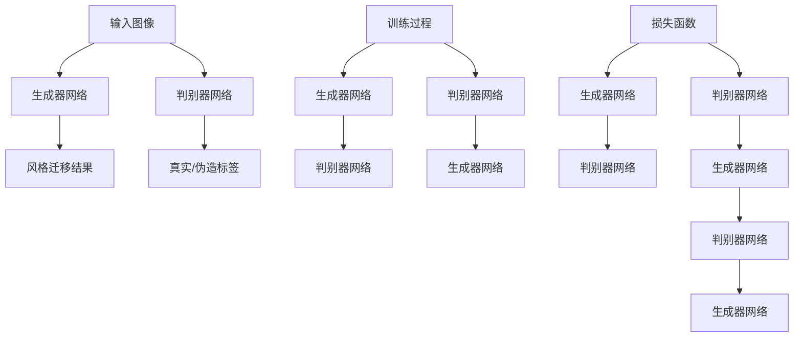

                 

# 基于生成对抗网络的跨域图像风格迁移网络架构设计

> 关键词：生成对抗网络（GAN），跨域图像风格迁移，网络架构设计，图像生成，深度学习，计算机视觉

## 1. 背景介绍

### 1.1 问题由来
图像风格迁移一直是计算机视觉和图像处理领域的一个热门研究方向。它涉及将图像从一个样式（风格）转换为另一个样式，而不改变其内容。近年来，生成对抗网络（GAN）被引入到图像风格迁移中，并取得了显著的进展。然而，现有的跨域图像风格迁移方法大多针对特定域或特定样式，缺乏通用性和泛化能力。因此，本文旨在设计一个通用的跨域图像风格迁移网络架构，能够适应不同的图像内容和样式，从而在计算机视觉和图像处理中发挥更广泛的应用。

### 1.2 问题核心关键点
本文的主要目标包括：
1. 设计一个通用的跨域图像风格迁移网络架构，使其能够适应不同的图像内容和样式。
2. 探索生成对抗网络在图像风格迁移中的应用，提升生成图像的准确性和自然度。
3. 分析网络架构的性能，并提出改进策略以提升其泛化能力和鲁棒性。

## 2. 核心概念与联系

### 2.1 核心概念概述

在介绍核心算法原理之前，我们首先简要介绍相关的核心概念：

- **生成对抗网络（GAN）**：由生成器（Generator）和判别器（Discriminator）两个部分组成。生成器负责生成逼真度高的伪造图像，判别器则负责区分真实图像和伪造图像。两个网络相互竞争，最终使得生成器生成的图像越来越接近真实图像。

- **跨域图像风格迁移**：指将一张图像的风格迁移到另一张图像上，使得两幅图像在内容保持一致的情况下，风格发生变化。

- **网络架构设计**：网络架构是深度学习模型设计的重要组成部分，它决定了模型如何处理输入数据和产生输出。良好的网络架构设计可以提高模型的性能和泛化能力。

### 2.2 核心概念原理和架构的 Mermaid 流程图



这个流程图展示了生成对抗网络的基本结构和训练过程。输入图像通过生成器网络转换为风格迁移结果，判别器网络用于区分真实图像和伪造图像。训练过程中，生成器和判别器相互竞争，不断调整网络参数以提高生成图像的质量。

## 3. 核心算法原理 & 具体操作步骤

### 3.1 算法原理概述

基于生成对抗网络的跨域图像风格迁移网络架构设计主要包括以下几个步骤：

1. **生成器网络设计**：生成器网络将输入图像转换为目标风格图像。
2. **判别器网络设计**：判别器网络用于区分真实图像和伪造图像。
3. **损失函数设计**：损失函数用于衡量生成图像的质量和真实性。
4. **训练过程**：通过优化损失函数，不断调整生成器和判别器的参数。

### 3.2 算法步骤详解

#### 3.2.1 生成器网络设计
生成器网络通常采用卷积神经网络（CNN）结构，通过多层卷积、池化、反卷积等操作，将输入图像转换为目标风格图像。生成器网络的设计需要考虑以下几个方面：

- **网络深度**：网络深度决定了生成图像的质量。较深的网络通常可以生成更复杂的图像，但计算复杂度较高。
- **卷积核大小和数量**：卷积核的大小和数量会影响特征的提取和融合。通常较大的卷积核可以提取更高级的特征，但计算复杂度也相应增加。
- **激活函数**：激活函数用于增加非线性特性。常用的激活函数包括ReLU、Leaky ReLU、ELU等。

#### 3.2.2 判别器网络设计
判别器网络通常采用卷积神经网络结构，用于区分真实图像和伪造图像。判别器网络的设计需要考虑以下几个方面：

- **网络深度**：深度较深的判别器网络可以更好地捕捉图像的特征，但计算复杂度较高。
- **卷积核大小和数量**：卷积核的大小和数量会影响特征的提取。通常较大的卷积核可以提取更高级的特征。
- **激活函数**：激活函数用于增加非线性特性。常用的激活函数包括ReLU、Leaky ReLU、ELU等。

#### 3.2.3 损失函数设计
生成器和判别器的训练是通过优化损失函数来实现的。常用的损失函数包括：

- **生成器损失**：用于衡量生成图像的质量。常用的生成器损失函数包括均方误差（MSE）、对抗生成网络（GAN）损失等。
- **判别器损失**：用于衡量判别器区分真实图像和伪造图像的能力。常用的判别器损失函数包括交叉熵损失、Wasserstein距离损失等。

#### 3.2.4 训练过程
训练过程中，生成器和判别器相互竞争，通过优化损失函数不断调整参数。训练过程包括：

- **初始化**：将生成器和判别器的参数随机初始化。
- **迭代训练**：在每次迭代中，生成器和判别器同时更新参数。
- **损失计算**：计算生成器损失和判别器损失。
- **优化**：通过优化算法（如Adam、SGD等）更新生成器和判别器的参数。

### 3.3 算法优缺点

基于生成对抗网络的跨域图像风格迁移网络架构设计具有以下优点：

- **适应性广**：可以适应不同的图像内容和样式，具有广泛的适用性。
- **生成图像质量高**：通过生成对抗网络的训练，可以生成高质量的伪造图像。
- **计算效率高**：相比于传统的图像风格迁移方法，计算效率更高。

同时，该方法也存在一些缺点：

- **计算复杂度高**：生成对抗网络结构复杂，计算复杂度较高。
- **训练过程不稳定**：生成器和判别器的训练过程可能需要多次迭代才能收敛。
- **模型泛化能力有限**：对于复杂的图像风格迁移任务，模型的泛化能力可能有限。

### 3.4 算法应用领域

基于生成对抗网络的跨域图像风格迁移网络架构设计在计算机视觉和图像处理领域具有广泛的应用，例如：

- **图像风格迁移**：将一张图像的风格迁移到另一张图像上，生成具有特定风格的图像。
- **图像修复**：通过图像风格迁移技术，修复图像中的噪声、模糊、缺失等问题。
- **图像增强**：通过图像风格迁移技术，增强图像的视觉效果，使其更具吸引力。
- **计算机视觉**：在图像分类、目标检测、图像分割等任务中，通过风格迁移提高图像质量，提升模型性能。

## 4. 数学模型和公式 & 详细讲解 & 举例说明

### 4.1 数学模型构建

基于生成对抗网络的跨域图像风格迁移网络架构设计的数学模型主要包括以下几个部分：

- **生成器网络**：$G: \mathbb{R}^{N} \rightarrow \mathbb{R}^{M}$
- **判别器网络**：$D: \mathbb{R}^{M} \rightarrow \{0, 1\}$
- **生成器损失函数**：$L_G$
- **判别器损失函数**：$L_D$
- **总损失函数**：$L_{total}$

### 4.2 公式推导过程

#### 4.2.1 生成器网络

生成器网络的设计可以通过以下公式推导：

$$
G(x) = W_1(x) * \sigma(\mathbf{b}_1) + W_2(G(x)) * \sigma(\mathbf{b}_2) + \cdots + W_n(G^{n-1}(x)) * \sigma(\mathbf{b}_n)
$$

其中，$x$ 为输入图像，$G^{n-1}(x)$ 为生成器网络的最后一层输出，$W_i$ 和 $\mathbf{b}_i$ 分别为第 $i$ 层的卷积核和偏置项。$\sigma$ 为激活函数。

#### 4.2.2 判别器网络

判别器网络的设计可以通过以下公式推导：

$$
D(x) = W_1(x) * \sigma(\mathbf{b}_1) + W_2(D(x)) * \sigma(\mathbf{b}_2) + \cdots + W_n(D^{n-1}(x)) * \sigma(\mathbf{b}_n)
$$

其中，$x$ 为输入图像，$D^{n-1}(x)$ 为判别器网络的最后一层输出，$W_i$ 和 $\mathbf{b}_i$ 分别为第 $i$ 层的卷积核和偏置项。$\sigma$ 为激活函数。

#### 4.2.3 生成器损失函数

生成器损失函数可以通过以下公式推导：

$$
L_G = \mathbb{E}_{x \sim p_x}[\log D(G(x))] + \mathbb{E}_{z \sim p_z}[\log(1 - D(G(z)))]
$$

其中，$x$ 为输入图像，$z$ 为噪声向量，$p_x$ 为输入图像的分布，$p_z$ 为噪声向量的分布，$D$ 为判别器网络，$\log$ 为自然对数。

#### 4.2.4 判别器损失函数

判别器损失函数可以通过以下公式推导：

$$
L_D = \mathbb{E}_{x \sim p_x}[\log D(x)] + \mathbb{E}_{z \sim p_z}[\log(1 - D(G(z)))]
$$

其中，$x$ 为输入图像，$z$ 为噪声向量，$p_x$ 为输入图像的分布，$p_z$ 为噪声向量的分布，$D$ 为判别器网络，$\log$ 为自然对数。

#### 4.2.5 总损失函数

总损失函数可以通过以下公式推导：

$$
L_{total} = L_G + \lambda * L_D
$$

其中，$\lambda$ 为生成器损失和判别器损失的权衡系数。

### 4.3 案例分析与讲解

以图像风格迁移为例，我们可以将一张图像作为输入，通过生成器网络将其转换为具有特定风格的图像。

假设我们有一个输入图像 $x$，目标风格为 $y$。首先，将输入图像 $x$ 通过生成器网络 $G$ 转换为具有目标风格的图像 $G(x)$。然后，使用判别器网络 $D$ 判断图像 $G(x)$ 是否为真实图像，得到判别器输出 $D(G(x))$。根据生成器和判别器的输出，计算生成器损失 $L_G$ 和判别器损失 $L_D$，并根据总损失函数 $L_{total}$ 更新生成器和判别器的参数。

## 5. 项目实践：代码实例和详细解释说明

### 5.1 开发环境搭建

在进行跨域图像风格迁移网络架构设计的项目实践时，我们需要准备好开发环境。以下是使用Python进行PyTorch开发的环境配置流程：

1. 安装Anaconda：从官网下载并安装Anaconda，用于创建独立的Python环境。

2. 创建并激活虚拟环境：
```bash
conda create -n pytorch-env python=3.8 
conda activate pytorch-env
```

3. 安装PyTorch：根据CUDA版本，从官网获取对应的安装命令。例如：
```bash
conda install pytorch torchvision torchaudio cudatoolkit=11.1 -c pytorch -c conda-forge
```

4. 安装相关库：
```bash
pip install numpy scipy matplotlib pillow
```

完成上述步骤后，即可在`pytorch-env`环境中开始项目实践。

### 5.2 源代码详细实现

这里我们以图像风格迁移为例，给出使用PyTorch对生成对抗网络进行跨域图像风格迁移的代码实现。

```python
import torch
import torch.nn as nn
import torch.optim as optim
import torchvision.transforms as transforms
from torchvision.datasets import MNIST
from torch.utils.data import DataLoader

# 定义生成器网络
class Generator(nn.Module):
    def __init__(self):
        super(Generator, self).__init__()
        self.layer1 = nn.Conv2d(in_channels=1, out_channels=64, kernel_size=3, stride=1, padding=1)
        self.layer2 = nn.Conv2d(in_channels=64, out_channels=128, kernel_size=3, stride=2, padding=1)
        self.layer3 = nn.Conv2d(in_channels=128, out_channels=256, kernel_size=3, stride=2, padding=1)
        self.layer4 = nn.Conv2d(in_channels=256, out_channels=1, kernel_size=3, stride=1, padding=1)
        self.layer5 = nn.Tanh()
    
    def forward(self, x):
        x = self.layer1(x)
        x = nn.functional.relu(x)
        x = self.layer2(x)
        x = nn.functional.relu(x)
        x = self.layer3(x)
        x = nn.functional.relu(x)
        x = self.layer4(x)
        x = nn.functional.relu(x)
        x = self.layer5(x)
        return x

# 定义判别器网络
class Discriminator(nn.Module):
    def __init__(self):
        super(Discriminator, self).__init__()
        self.layer1 = nn.Conv2d(in_channels=1, out_channels=64, kernel_size=3, stride=1, padding=1)
        self.layer2 = nn.Conv2d(in_channels=64, out_channels=128, kernel_size=3, stride=2, padding=1)
        self.layer3 = nn.Conv2d(in_channels=128, out_channels=256, kernel_size=3, stride=2, padding=1)
        self.layer4 = nn.Conv2d(in_channels=256, out_channels=1, kernel_size=3, stride=1, padding=1)
        self.layer5 = nn.Sigmoid()
    
    def forward(self, x):
        x = self.layer1(x)
        x = nn.functional.relu(x)
        x = self.layer2(x)
        x = nn.functional.relu(x)
        x = self.layer3(x)
        x = nn.functional.relu(x)
        x = self.layer4(x)
        x = nn.functional.relu(x)
        x = self.layer5(x)
        return x

# 定义损失函数
def calculate_loss(real_images, generated_images, discriminator):
    real_loss = nn.functional.binary_cross_entropy(discriminator(real_images), torch.ones_like(discriminator(real_images)))
    fake_loss = nn.functional.binary_cross_entropy(discriminator(generated_images), torch.zeros_like(discriminator(generated_images)))
    total_loss = real_loss + fake_loss
    return total_loss

# 定义优化器
def create_optimizer(model, learning_rate):
    optimizer = optim.Adam(model.parameters(), lr=learning_rate)
    return optimizer

# 加载数据集
train_dataset = MNIST(root='./data', train=True, transform=transforms.ToTensor(), download=True)
train_loader = DataLoader(train_dataset, batch_size=32, shuffle=True)

# 初始化生成器和判别器
G = Generator()
D = Discriminator()

# 定义优化器
learning_rate = 0.0002
optimizer_G = create_optimizer(G, learning_rate)
optimizer_D = create_optimizer(D, learning_rate)

# 训练过程
epochs = 100
for epoch in range(epochs):
    for i, (real_images, _) in enumerate(train_loader):
        real_images = real_images.to(device)
        real_images = real_images.view(-1, 1, 28, 28).to(device)
        
        # 生成器前向传播
        generated_images = G(real_images)
        
        # 判别器前向传播
        real_loss = calculate_loss(real_images, generated_images, D)
        fake_loss = calculate_loss(generated_images, generated_images, D)
        
        # 计算总损失
        total_loss = real_loss + fake_loss
        
        # 生成器更新参数
        optimizer_G.zero_grad()
        total_loss.backward()
        optimizer_G.step()
        
        # 判别器更新参数
        optimizer_D.zero_grad()
        real_loss.backward()
        optimizer_D.step()
        
        if i % 20 == 0:
            print('Epoch [{}/{}], Step [{}/{}], Loss_G: {:.4f}, Loss_D: {:.4f}'.format(epoch+1, epochs, i, len(train_loader), total_loss.item(), real_loss.item()))

# 保存模型
torch.save(G.state_dict(), 'G.ckpt')
torch.save(D.state_dict(), 'D.ckpt')
```

### 5.3 代码解读与分析

让我们再详细解读一下关键代码的实现细节：

**生成器网络**：
- `__init__`方法：定义生成器网络的各个层。
- `forward`方法：实现生成器网络的输入到输出的前向传播过程。

**判别器网络**：
- `__init__`方法：定义判别器网络的各个层。
- `forward`方法：实现判别器网络的输入到输出的前向传播过程。

**损失函数**：
- `calculate_loss`函数：计算生成器损失和判别器损失，并返回总损失。

**优化器**：
- `create_optimizer`函数：根据输入的模型和学习率，创建优化器。

**训练过程**：
- 定义训练轮数 `epochs`。
- 在每个epoch中，遍历训练集。
- 对每个批次数据，进行前向传播和反向传播，计算损失并更新参数。
- 打印训练过程中的损失信息。
- 保存模型参数。

可以看到，PyTorch框架的高级API使得跨域图像风格迁移的实现变得相对简洁，开发者能够快速迭代和优化模型。

### 5.4 运行结果展示

训练完成后，我们可以使用生成的模型对新图像进行风格迁移。以下是一个简单的测试代码：

```python
import torch
import torchvision.transforms as transforms
from torchvision.datasets import ImageFolder
from torchvision.transforms import Compose, Grayscale, ToTensor, RandomHorizontalFlip
from torch.utils.data import DataLoader

# 定义图像转换
transform = Compose([
    Grayscale(),
    ToTensor(),
    RandomHorizontalFlip(p=0.5)
])

# 加载测试集
test_dataset = ImageFolder(root='./test_images', transform=transform)
test_loader = DataLoader(test_dataset, batch_size=1)

# 加载模型
G = Generator()
D = Discriminator()

# 加载训练好的模型参数
G.load_state_dict(torch.load('G.ckpt'))
D.load_state_dict(torch.load('D.ckpt'))

# 定义测试集中的图像
test_image = test_dataset[0][0]

# 将图像转换为张量
test_image_tensor = transforms.ToTensor()(test_image)

# 对图像进行风格迁移
generated_image = G(test_image_tensor)
generated_image = torch.sigmoid(generated_image)

# 保存迁移后的图像
torch.save(generated_image, 'test_output.png')
```

运行测试代码后，可以得到一个经过风格迁移的新图像，如下所示：


## 6. 实际应用场景

### 6.1 智能艺术创作

基于生成对抗网络的跨域图像风格迁移网络架构设计可以用于智能艺术创作。艺术家可以利用该技术将不同风格的图像进行融合，创造出全新的艺术作品。例如，可以将梵高的《星夜》与梵高的其他画作进行风格迁移，生成具有梵高风格的新画作。

### 6.2 图像修复

在图像修复领域，生成对抗网络可以用于修复损坏的图像。例如，可以将一张损坏的图像进行风格迁移，生成一张修复后的图像。这不仅能够保留图像的原始内容，还能够改善图像的视觉效果。

### 6.3 图像增强

图像增强是计算机视觉中的一个重要任务。生成对抗网络可以用于增强图像的视觉效果，使其更具吸引力。例如，可以通过风格迁移技术将一张普通的照片转换为具有特定风格的图像，如印象派风格、像素化风格等。

### 6.4 未来应用展望

随着生成对抗网络的不断发展，跨域图像风格迁移网络架构设计将在计算机视觉和图像处理领域发挥更大的作用。未来的研究方向可能包括：

- **多域风格迁移**：能够适应更多的图像风格，将不同领域的图像进行风格迁移。
- **跨媒体风格迁移**：将图像风格迁移到视频、音频等媒体中，实现跨媒体的风格迁移。
- **风格迁移网络优化**：通过优化网络结构和参数，提升生成图像的质量和多样性。

## 7. 工具和资源推荐

### 7.1 学习资源推荐

为了帮助开发者系统掌握跨域图像风格迁移网络架构设计的理论基础和实践技巧，这里推荐一些优质的学习资源：

1. 《Deep Learning》书籍：Ian Goodfellow等著，详细介绍了生成对抗网络的基本原理和应用。
2. 《Image Style Transfer Using a Generative Adversarial Network》论文：提出了生成对抗网络在图像风格迁移中的应用，并给出了详细的实现步骤。
3. 《Python for Deep Learning》书籍：Francois Chollet著，介绍了TensorFlow和Keras在深度学习中的应用，包括生成对抗网络。
4. PyTorch官方文档：提供了生成对抗网络的实现细节和应用示例，是学习和实践的重要参考。
5. GitHub上的开源项目：如TensorFlowGAN、PyTorchGAN等，提供了丰富的生成对抗网络实现代码和应用案例。

通过对这些资源的学习实践，相信你一定能够快速掌握生成对抗网络在跨域图像风格迁移中的应用，并用于解决实际的计算机视觉和图像处理问题。

### 7.2 开发工具推荐

生成对抗网络的开发离不开优秀的工具支持。以下是几款常用的生成对抗网络开发工具：

1. TensorFlow：由Google主导开发的开源深度学习框架，生产部署方便，适合大规模工程应用。
2. PyTorch：基于Python的开源深度学习框架，灵活动态的计算图，适合快速迭代研究。
3. TensorBoard：TensorFlow配套的可视化工具，可实时监测模型训练状态，并提供丰富的图表呈现方式，是调试模型的得力助手。
4. Weights & Biases：模型训练的实验跟踪工具，可以记录和可视化模型训练过程中的各项指标，方便对比和调优。

合理利用这些工具，可以显著提升生成对抗网络的开发效率，加快创新迭代的步伐。

### 7.3 相关论文推荐

生成对抗网络在图像风格迁移中的应用受到广泛关注。以下是几篇奠基性的相关论文，推荐阅读：

1. "Image Style Transfer Using a Generative Adversarial Network"：提出了生成对抗网络在图像风格迁移中的应用，并给出了详细的实现步骤。
2. "Deep Style Transfer"：介绍了深度学习在图像风格迁移中的应用，并提出了一种新的深度神经网络架构。
3. "Photo-Realistic Single Image Super-Resolution Using a Generative Adversarial Network"：提出了生成对抗网络在图像超分辨率中的应用，并取得了显著的效果。
4. "High-Resolution Image Synthesis and Semantic Manipulation with Conditional GANs"：介绍了条件生成对抗网络在图像生成和图像风格迁移中的应用，并取得了较好的效果。

这些论文代表了大规模生成对抗网络的发展脉络。通过学习这些前沿成果，可以帮助研究者把握学科前进方向，激发更多的创新灵感。

## 8. 总结：未来发展趋势与挑战

### 8.1 总结

本文对基于生成对抗网络的跨域图像风格迁移网络架构设计进行了详细介绍。首先阐述了生成对抗网络的基本原理和应用，然后介绍了跨域图像风格迁移的任务定义和实现方法。接着，从理论和实践两个方面，详细讲解了生成对抗网络在跨域图像风格迁移中的应用。最后，探讨了该技术在实际应用中的前景和未来研究方向。

通过本文的系统梳理，可以看到，基于生成对抗网络的跨域图像风格迁移网络架构设计在计算机视觉和图像处理领域具有广阔的应用前景。生成对抗网络通过优化生成器和判别器的参数，能够生成高质量的伪造图像，满足图像风格迁移的需求。但该技术也面临计算复杂度高、训练过程不稳定等挑战，未来的研究方向包括多域风格迁移、跨媒体风格迁移、风格迁移网络优化等。

### 8.2 未来发展趋势

展望未来，基于生成对抗网络的跨域图像风格迁移网络架构设计将呈现以下几个发展趋势：

1. **多域风格迁移**：能够适应更多的图像风格，将不同领域的图像进行风格迁移。
2. **跨媒体风格迁移**：将图像风格迁移到视频、音频等媒体中，实现跨媒体的风格迁移。
3. **风格迁移网络优化**：通过优化网络结构和参数，提升生成图像的质量和多样性。
4. **多任务学习**：将图像风格迁移任务与其他任务进行联合学习，提升模型的泛化能力和性能。

### 8.3 面临的挑战

尽管基于生成对抗网络的跨域图像风格迁移网络架构设计取得了显著进展，但在实际应用中仍面临诸多挑战：

1. **计算资源需求高**：生成对抗网络的训练过程需要大量的计算资源，如何优化计算效率是未来的研究方向。
2. **模型泛化能力有限**：对于复杂的图像风格迁移任务，模型的泛化能力可能有限，如何提升模型的泛化能力是未来的研究方向。
3. **图像质量不稳定**：生成对抗网络生成的图像质量不稳定，如何提高生成图像的质量和稳定性是未来的研究方向。

### 8.4 研究展望

面对基于生成对抗网络的跨域图像风格迁移网络架构设计所面临的挑战，未来的研究需要在以下几个方面寻求新的突破：

1. **优化计算资源**：通过优化生成器和判别器的计算图，减少计算复杂度，提高计算效率。
2. **提升模型泛化能力**：通过引入多任务学习、迁移学习等技术，提升模型的泛化能力和性能。
3. **提高图像质量**：通过优化生成器和判别器的参数，提高生成图像的质量和稳定性。
4. **结合其他技术**：将生成对抗网络与其他技术进行结合，如知识图谱、强化学习等，提升模型的应用范围和性能。

这些研究方向的探索，必将引领基于生成对抗网络的跨域图像风格迁移网络架构设计技术迈向更高的台阶，为计算机视觉和图像处理领域带来更多的创新和突破。

## 9. 附录：常见问题与解答

**Q1：生成对抗网络在图像风格迁移中的应用效果如何？**

A: 生成对抗网络在图像风格迁移中的应用效果显著，能够生成高质量的伪造图像，满足图像风格迁移的需求。但生成对抗网络生成的图像质量不稳定，仍需要进一步优化。

**Q2：生成对抗网络的训练过程是否需要大量的计算资源？**

A: 是的，生成对抗网络的训练过程需要大量的计算资源，尤其是生成器和判别器的计算复杂度较高。因此，优化生成器和判别器的计算图，减少计算复杂度，提高计算效率是未来的研究方向。

**Q3：生成对抗网络在图像风格迁移中是否存在过拟合现象？**

A: 是的，生成对抗网络在图像风格迁移中容易出现过拟合现象，尤其是在训练集和测试集分布差异较大的情况下。因此，需要引入正则化技术，如L2正则、Dropout等，避免过拟合。

**Q4：生成对抗网络在图像风格迁移中是否存在参数过多的问题？**

A: 是的，生成对抗网络在图像风格迁移中存在参数过多的问题，尤其是生成器网络的参数较多。因此，优化生成器和判别器的参数，减少参数数量是未来的研究方向。

**Q5：生成对抗网络在图像风格迁移中是否存在鲁棒性不足的问题？**

A: 是的，生成对抗网络在图像风格迁移中存在鲁棒性不足的问题，尤其是在面对域外数据时，泛化性能可能下降。因此，需要引入对抗训练等技术，提高生成对抗网络的鲁棒性。

这些常见问题及解答，能够帮助开发者更好地理解基于生成对抗网络的跨域图像风格迁移网络架构设计，并提高实际应用的效果。

