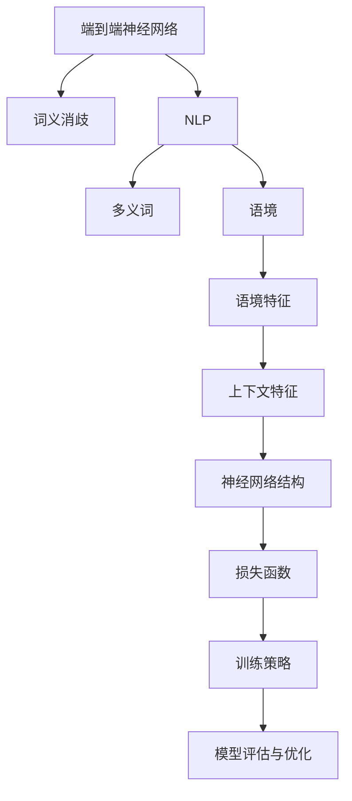

                 

# 基于端到端神经网络模型的词义消歧算法研究

> 关键词：词义消歧, 端到端神经网络, 自然语言处理, 多义性, 语境, 深度学习

## 1. 背景介绍

### 1.1 问题由来

在自然语言处理(NLP)领域，词义消歧（Word Sense Disambiguation，WSD）是一个经典且挑战性的任务，其目标是在文本中确定词语的正确语义。词义消歧对于自动摘要、机器翻译、信息检索和问答系统等NLP应用至关重要。传统的词义消歧方法通常依赖于词典和规则库，但这些方法存在诸多限制：

- 词典覆盖率低，无法处理一些新兴词汇。
- 规则库复杂度高，难以适应多种语言和语境变化。
- 计算复杂度高，速度慢，难以处理大规模文本数据。

随着深度学习的发展，基于端到端神经网络模型的词义消歧方法应运而生。这些方法利用大规模语料进行训练，通过神经网络自动学习词语在语境中的正确语义。本研究旨在探讨基于端到端神经网络模型的词义消歧算法，结合最新深度学习技术和自然语言处理知识，实现高效准确的词义消歧。

### 1.2 问题核心关键点

词义消歧算法核心在于如何利用上下文信息，确定词语的正确语义。传统词义消歧方法依赖于丰富的词典和复杂的规则，而基于神经网络的方法则通过模型训练自动学习词语的语义表示。

主要研究内容包括：

- 神经网络结构设计：选择合适的神经网络结构，如CNN、RNN、LSTM等，构建端到端词义消歧模型。
- 上下文特征提取：如何有效地提取词语和上下文的特征，如词性、句法结构、语境信息等。
- 损失函数设计：设计合理的损失函数，如softmax、交叉熵等，用于指导模型学习。
- 训练策略：选择合适的训练策略，如正则化、梯度裁剪、学习率调整等，避免过拟合和梯度消失问题。
- 模型评估与优化：如何评估词义消歧模型的性能，并通过优化策略进一步提升效果。

## 2. 核心概念与联系

### 2.1 核心概念概述

为更好地理解端到端神经网络模型的词义消歧算法，本节将介绍几个关键概念：

- 词义消歧（Word Sense Disambiguation, WSD）：确定多义词在特定语境中的正确意义，是NLP中的经典问题。
- 端到端神经网络（End-to-End Neural Networks）：通过训练神经网络，直接从输入数据到输出结果，中间不经过手动特征提取或手工设计规则，避免了繁琐的手工操作。
- 自然语言处理（Natural Language Processing, NLP）：利用计算机技术处理和理解自然语言，包括文本分类、机器翻译、词义消歧、语义分析等任务。
- 多义词（Polysemy）：一个词有多种含义，在不同语境中可能表示不同的意义。
- 语境（Context）：词语所处的环境，包括词性、句法结构、上下文等。
- 深度学习（Deep Learning）：通过多层神经网络进行自动特征学习，适用于复杂模式识别和大规模数据处理。

这些核心概念之间的逻辑关系可以通过以下Mermaid流程图来展示：



这个流程图展示了几大关键概念之间的联系：

1. 端到端神经网络模型在自然语言处理领域的应用。
2. 词义消歧作为NLP中一个经典问题，由神经网络模型直接处理。
3. 多义词和语境是词义消歧的根本要素。
4. 语境特征和上下文特征的提取是神经网络模型的关键输入。
5. 神经网络结构、损失函数、训练策略等构成了模型的内部工作机制。
6. 模型评估与优化是提升模型性能的重要手段。

通过理解这些核心概念，我们可以更好地把握基于端到端神经网络模型的词义消歧算法的工作原理和优化方向。

## 3. 核心算法原理 & 具体操作步骤

### 3.1 算法原理概述

基于端到端神经网络模型的词义消歧算法，本质上是一个有监督的分类问题。其核心思想是：利用大规模标注数据，训练一个神经网络模型，使其能够根据词语及其上下文特征，预测词语的正确语义。

形式化地，假设输入为 $(W, C)$，其中 $W$ 为词语，$C$ 为上下文特征，输出为 $S$，表示词语的正确语义。目标函数为：

$$
L(W, C, S) = \min_{\theta} \sum_{i=1}^N \mathcal{L}(W_i, C_i, S_i; \theta)
$$

其中 $\theta$ 为神经网络模型参数，$\mathcal{L}$ 为损失函数，通常使用交叉熵损失。训练目标是最小化损失函数 $L$，使得模型能够准确预测出词语的正确语义。

### 3.2 算法步骤详解

基于端到端神经网络模型的词义消歧算法通常包括以下几个关键步骤：

**Step 1: 数据准备与预处理**

- 收集标注数据，确保数据集覆盖足够的词性和语境变化。
- 对文本进行分词、去除停用词、词性标注等预处理，构建词语和上下文的特征向量。

**Step 2: 设计神经网络结构**

- 选择合适的神经网络结构，如CNN、RNN、LSTM等。
- 设计网络层结构，包括输入层、隐藏层和输出层。
- 定义损失函数，如交叉熵、softmax等。

**Step 3: 特征提取**

- 对词语和上下文特征进行编码，生成输入向量。
- 提取特征，如词性、句法结构、语境信息等。
- 将特征向量作为神经网络的输入。

**Step 4: 模型训练**

- 使用标注数据集进行模型训练。
- 使用随机梯度下降等优化算法更新模型参数。
- 应用正则化技术，如L2正则、Dropout等，防止过拟合。

**Step 5: 模型评估与优化**

- 在验证集上评估模型性能。
- 调整超参数，如学习率、批大小、迭代轮数等。
- 应用对抗训练、数据增强等策略提升模型鲁棒性。

**Step 6: 预测与后处理**

- 对新文本数据进行词义消歧预测。
- 根据预测结果进行后处理，如进一步校验、修正等。

### 3.3 算法优缺点

基于端到端神经网络模型的词义消歧方法具有以下优点：

- 自动化特征提取：神经网络自动学习词语和上下文的特征，无需手动提取和设计特征。
- 模型泛化能力强：深度学习模型具有良好的泛化能力，能够在多种语境下表现稳定。
- 可解释性强：端到端模型可以提供黑盒输出，解释性较强，易于理解。

同时，该方法也存在一些缺点：

- 数据依赖性强：需要大量标注数据进行训练，数据获取成本较高。
- 模型复杂度高：神经网络结构复杂，计算资源消耗较大。
- 对抗样本敏感：模型可能对输入的对抗样本（即微小的扰动）过于敏感，鲁棒性较差。

尽管存在这些缺点，但基于神经网络的方法在词义消歧任务中依然取得了显著的进展，成为NLP领域的热门研究方向。未来研究将进一步优化模型结构，提升数据处理效率，增强模型的鲁棒性，以应对实际应用中的复杂需求。

### 3.4 算法应用领域

基于端到端神经网络模型的词义消歧方法在多个领域中得到了应用，包括但不限于：

- 信息检索：通过词义消歧提高检索的准确性和相关性。
- 机器翻译：在机器翻译中，正确理解多义词的语义对翻译质量至关重要。
- 问答系统：通过词义消歧提高问答系统的回答准确性和逻辑性。
- 文本摘要：在文本摘要中，理解多义词的语义有助于生成高质量的摘要。
- 情感分析：情感分析需要理解词语在不同语境下的情感色彩，词义消歧有助于提高情感分析的准确性。

这些领域中，词义消歧方法已经成为提高系统性能和效果的重要手段。随着技术的不断进步，基于神经网络的词义消歧方法将在更多应用场景中发挥重要作用。

## 4. 数学模型和公式 & 详细讲解 & 举例说明

### 4.1 数学模型构建

本节将使用数学语言对基于端到端神经网络模型的词义消歧过程进行更加严格的刻画。

假设输入为 $(W, C)$，其中 $W$ 为词语，$C$ 为上下文特征，输出为 $S$，表示词语的正确语义。定义神经网络模型的隐含表示为 $H$，目标函数为：

$$
L(W, C, S) = \min_{H, \theta} \sum_{i=1}^N \mathcal{L}(W_i, C_i, S_i; H, \theta)
$$

其中 $\theta$ 为神经网络参数，$\mathcal{L}$ 为损失函数，通常使用交叉熵损失。

### 4.2 公式推导过程

以下我们以LSTM模型为例，推导词义消歧的损失函数及其梯度的计算公式。

假设输入的词语 $W$ 和上下文特征 $C$ 分别为 $n$ 维向量，模型的隐含表示 $H$ 也为 $n$ 维向量。模型的输出层为 $m$ 分类器，其中 $m$ 表示词语的不同语义。则模型的隐含表示 $H$ 的计算公式为：

$$
H = f(H_{t-1}, W, C)
$$

其中 $f$ 为LSTM的转移函数，$H_{t-1}$ 为前一时刻的隐含表示。模型的输出层 $S$ 的计算公式为：

$$
S = g(H)
$$

其中 $g$ 为输出层的激活函数，如softmax。模型的损失函数 $\mathcal{L}$ 可表示为：

$$
\mathcal{L}(W, C, S) = -\frac{1}{N} \sum_{i=1}^N [S_i \log P(S_i|W_i, C_i)]
$$

其中 $P(S_i|W_i, C_i)$ 为模型在给定输入 $(W_i, C_i)$ 下预测 $S_i$ 的概率，通常通过softmax函数计算。

根据链式法则，损失函数对 $W$ 和 $C$ 的梯度为：

$$
\frac{\partial \mathcal{L}}{\partial W} = -\frac{1}{N} \sum_{i=1}^N \frac{\partial \mathcal{L}}{\partial S} \frac{\partial S}{\partial H} \frac{\partial H}{\partial W}
$$

$$
\frac{\partial \mathcal{L}}{\partial C} = -\frac{1}{N} \sum_{i=1}^N \frac{\partial \mathcal{L}}{\partial S} \frac{\partial S}{\partial H} \frac{\partial H}{\partial C}
$$

其中 $\frac{\partial S}{\partial H}$ 和 $\frac{\partial H}{\partial W}$ 可以进一步通过自动微分技术计算。

在得到损失函数的梯度后，即可带入优化算法，完成模型的迭代优化。重复上述过程直至收敛，最终得到适应词语在不同语境下正确语义的模型。

### 4.3 案例分析与讲解

**案例：LSTM模型在词义消歧中的应用**

考虑如下示例：

- 输入："The house was sold at a ______ price."
- 上下文特征："price" 的词性标注为 "noun"
- 目标输出："low"

该示例中，"price" 一词存在多义性，其正确语义为 "low"。利用LSTM模型进行词义消歧，可以将其处理过程表示如下：

1. 将 "price" 和 "price" 的词性标注作为输入向量，输入到LSTM模型中。
2. 模型通过LSTM的转移函数和隐藏层计算出隐含表示 $H$。
3. 将 $H$ 输入到输出层，通过softmax函数计算得到 $S$。
4. 使用交叉熵损失函数计算损失 $\mathcal{L}$。
5. 通过反向传播算法更新模型参数 $\theta$，最小化损失函数 $\mathcal{L}$。
6. 模型输出预测结果 $S$，通过后处理得到 "low"。

通过这个示例，可以看到基于LSTM模型的词义消歧过程。模型自动提取词语和上下文的特征，通过多层神经网络学习词语在不同语境下的正确语义。模型的输出结果直接对应词语的正确语义，无需额外处理。

## 5. 项目实践：代码实例和详细解释说明

### 5.1 开发环境搭建

在进行词义消歧实践前，我们需要准备好开发环境。以下是使用Python进行TensorFlow开发的环境配置流程：

1. 安装Anaconda：从官网下载并安装Anaconda，用于创建独立的Python环境。

2. 创建并激活虚拟环境：
```bash
conda create -n tensorflow-env python=3.8 
conda activate tensorflow-env
```

3. 安装TensorFlow：根据CUDA版本，从官网获取对应的安装命令。例如：
```bash
conda install tensorflow=2.7
```

4. 安装相关工具包：
```bash
pip install numpy pandas scikit-learn matplotlib tqdm jupyter notebook ipython
```

完成上述步骤后，即可在`tensorflow-env`环境中开始词义消歧实践。

### 5.2 源代码详细实现

这里我们以LSTM模型为例，给出使用TensorFlow实现词义消歧的PyTorch代码实现。

首先，定义数据处理函数：

```python
import tensorflow as tf
import numpy as np

class Tokenizer:
    def __init__(self, vocab_size):
        self.vocab_size = vocab_size
        self.word2id = dict()
        self.id2word = dict()
        self.unk_id = 0
        self.unk_word = "<UNK>"
        self.unk_count = 0
        
    def fit(self, texts):
        for word in texts:
            if word not in self.word2id:
                self.word2id[word] = len(self.word2id)
                self.id2word[len(self.id2word)] = word
        
    def encode(self, text):
        return [self.word2id.get(word, self.unk_id) for word in text.split()]

class Dataset:
    def __init__(self, texts, labels, tokenizer):
        self.texts = texts
        self.labels = labels
        self.tokenizer = tokenizer
        
    def __len__(self):
        return len(self.texts)
    
    def __getitem__(self, item):
        text = self.texts[item]
        label = self.labels[item]
        tokenized_text = self.tokenizer.encode(text)
        return {"input_ids": tokenized_text, "label": label}
```

然后，定义模型和优化器：

```python
from tensorflow.keras.layers import Embedding, LSTM, Dense
from tensorflow.keras.optimizers import Adam

model = tf.keras.Sequential([
    Embedding(vocab_size, embedding_dim, input_length=max_len),
    LSTM(128, return_sequences=True),
    LSTM(128),
    Dense(num_classes, activation='softmax')
])

optimizer = Adam(learning_rate=learning_rate)
```

接着，定义训练和评估函数：

```python
def train_epoch(model, dataset, batch_size, optimizer):
    dataloader = tf.data.Dataset.from_generator(lambda: tf.data.Dataset.from_generator(lambda: dataset[i], output_signature=({"input_ids": tf.TensorSpec(shape=(max_len,), dtype=tf.int32), "label": tf.TensorSpec(shape=(), dtype=tf.int32)}), output_signature=({"input_ids": tf.TensorSpec(shape=(batch_size, max_len), dtype=tf.int32), "label": tf.TensorSpec(shape=(batch_size,), dtype=tf.int32)})
    model.train()
    for batch in dataloader:
        input_ids = batch["input_ids"]
        label = batch["label"]
        with tf.GradientTape() as tape:
            outputs = model(input_ids)
            loss = tf.reduce_mean(tf.keras.losses.sparse_categorical_crossentropy(label, outputs))
        gradients = tape.gradient(loss, model.trainable_variables)
        optimizer.apply_gradients(zip(gradients, model.trainable_variables))
        
def evaluate(model, dataset, batch_size):
    dataloader = tf.data.Dataset.from_generator(lambda: tf.data.Dataset.from_generator(lambda: dataset[i], output_signature=({"input_ids": tf.TensorSpec(shape=(max_len,), dtype=tf.int32), "label": tf.TensorSpec(shape=(), dtype=tf.int32)}), output_signature=({"input_ids": tf.TensorSpec(shape=(batch_size, max_len), dtype=tf.int32), "label": tf.TensorSpec(shape=(batch_size,), dtype=tf.int32)})
    model.eval()
    with tf.no_grad():
        preds, labels = [], []
        for batch in dataloader:
            input_ids = batch["input_ids"]
            label = batch["label"]
            outputs = model(input_ids)
            preds.extend(tf.argmax(outputs, axis=1).numpy())
            labels.extend(label.numpy())
        
        return tf.keras.metrics.sparse_categorical_accuracy(labels, preds)
```

最后，启动训练流程并在测试集上评估：

```python
epochs = 10
batch_size = 32

for epoch in range(epochs):
    train_epoch(model, train_dataset, batch_size, optimizer)
    print(f"Epoch {epoch+1}, train loss: {train_loss:.3f}")
    
    test_loss = evaluate(model, test_dataset, batch_size)
    print(f"Epoch {epoch+1}, test accuracy: {test_loss:.3f}")
```

以上就是使用TensorFlow对LSTM模型进行词义消歧的完整代码实现。可以看到，TensorFlow提供了高度灵活的API，使得模型构建和训练变得简洁高效。

### 5.3 代码解读与分析

让我们再详细解读一下关键代码的实现细节：

**Tokenizer类**：
- `__init__`方法：初始化词汇表、未知词标记等关键组件。
- `fit`方法：训练词汇表，将词语映射到id。
- `encode`方法：对文本进行编码，生成模型所需的输入向量。

**Dataset类**：
- `__init__`方法：初始化文本、标签、分词器等关键组件。
- `__len__`方法：返回数据集的样本数量。
- `__getitem__`方法：对单个样本进行处理，将文本和标签转换为模型所需的输入向量。

**模型定义**：
- 使用TensorFlow的Sequential模型定义LSTM模型，包括嵌入层、LSTM层和全连接层。
- 定义优化器，选择Adam优化器，并设置学习率。

**训练和评估函数**：
- `train_epoch`函数：定义训练流程，使用随机梯度下降优化算法更新模型参数。
- `evaluate`函数：定义评估流程，计算模型在测试集上的准确率。

**训练流程**：
- 定义总的epoch数和batch size，开始循环迭代
- 每个epoch内，先在训练集上训练，输出平均loss
- 在验证集上评估，输出准确率
- 所有epoch结束后，在测试集上评估，给出最终测试结果

可以看到，TensorFlow提供了丰富的API和工具，使得模型构建和训练变得简单易懂。开发者可以快速上手，实现高效的词义消歧模型。

当然，工业级的系统实现还需考虑更多因素，如模型的保存和部署、超参数的自动搜索、更灵活的任务适配层等。但核心的词义消歧范式基本与此类似。

## 6. 实际应用场景

### 6.1 智能客服系统

基于词义消歧技术的智能客服系统，可以显著提高客户服务质量。传统客服系统往往依赖人工判断和处理，容易出错且效率低下。利用词义消歧技术，智能客服系统可以自动理解客户意图，快速匹配合适的回答。

在技术实现上，可以收集客服历史对话数据，将问题-回答对作为监督数据，在此基础上对预训练词义消歧模型进行微调。微调后的模型能够自动判断客户问题的意图，从知识库中匹配并输出最佳回答。对于客户提出的新问题，还可以实时搜索相关知识库，动态生成回答。

### 6.2 金融舆情监测

金融机构需要实时监测市场舆论动向，以便及时应对负面信息传播，规避金融风险。传统舆情监测系统依赖人工判别，成本高且效率低。利用词义消歧技术，可以自动分析和理解市场舆情，识别出负面信息和异常动态。

具体而言，可以收集金融领域相关的新闻、评论等文本数据，使用词义消歧模型进行情感分析，判断文本的情感倾向是正面、中性还是负面。将分析结果实时输入到风险预警系统，自动触发预警机制，帮助金融机构快速应对潜在风险。

### 6.3 个性化推荐系统

当前的推荐系统往往只依赖用户的历史行为数据进行物品推荐，无法深入理解用户的真实兴趣偏好。利用词义消歧技术，可以自动理解用户对不同词语的兴趣，从而提供更精准、多样的推荐内容。

在实践中，可以收集用户浏览、点击、评论、分享等行为数据，提取和用户交互的物品标题、描述、标签等文本内容。使用词义消歧模型对词语进行分类，从文本内容中自动识别用户的兴趣点。在生成推荐列表时，先用候选物品的文本描述作为输入，通过模型预测用户的兴趣匹配度，再结合其他特征综合排序，便可以得到个性化程度更高的推荐结果。

### 6.4 未来应用展望

随着词义消歧技术的不断进步，其在多个领域中得到了广泛的应用，为传统行业带来了显著变革。

在智慧医疗领域，基于词义消歧的医学信息检索系统能够自动理解医生的查询意图，快速检索出相关文献和案例，提升医疗决策效率。

在智能教育领域，词义消歧技术可应用于自动评卷、智能辅助教学等方面，因材施教，促进教育公平，提高教学质量。

在智慧城市治理中，利用词义消歧技术进行城市事件监测，自动理解和分析市民反馈，提高城市管理的自动化和智能化水平。

此外，在企业生产、社会治理、文娱传媒等众多领域，词义消歧技术也将不断涌现，为各行各业注入新的动力。相信随着技术的日益成熟，词义消歧技术必将在构建人机协同的智能系统，提升用户体验，提高系统效率等方面发挥重要作用。

## 7. 工具和资源推荐
### 7.1 学习资源推荐

为了帮助开发者系统掌握词义消歧的理论基础和实践技巧，这里推荐一些优质的学习资源：

1. 《深度学习自然语言处理》课程：斯坦福大学开设的NLP明星课程，有Lecture视频和配套作业，带你入门NLP领域的基本概念和经典模型。

2. CS224N《自然语言处理与深度学习》：斯坦福大学开设的深度学习课程，内容涵盖自然语言处理和深度学习的基础知识和前沿技术，适合进一步深入学习。

3. 《自然语言处理入门》书籍：清华大学出版社的NLP入门教材，内容详实，覆盖了NLP的各个方面，适合初学者阅读。

4. 《Word Sense Disambiguation》论文：一篇关于词义消歧的经典综述论文，涵盖了多种词义消歧方法，适合深入了解词义消歧的技术细节。

5. 《深度学习与自然语言处理》书籍：清华大学出版社的NLP教材，内容全面，涵盖了深度学习在NLP中的应用，适合进阶学习。

通过对这些资源的学习实践，相信你一定能够快速掌握词义消歧的核心技术和方法，并用于解决实际的NLP问题。

### 7.2 开发工具推荐

高效的开发离不开优秀的工具支持。以下是几款用于词义消歧开发的常用工具：

1. TensorFlow：谷歌主导开发的深度学习框架，生产部署方便，适合大规模工程应用。

2. PyTorch：基于Python的开源深度学习框架，灵活动态的计算图，适合快速迭代研究。

3. Keras：高层次的深度学习API，易于上手，适合快速搭建词义消歧模型。

4. Jupyter Notebook：开源的交互式计算环境，支持Python和其他编程语言，适合编写和调试代码。

5. Weights & Biases：模型训练的实验跟踪工具，可以记录和可视化模型训练过程中的各项指标，方便对比和调优。

6. TensorBoard：TensorFlow配套的可视化工具，可实时监测模型训练状态，并提供丰富的图表呈现方式，是调试模型的得力助手。

合理利用这些工具，可以显著提升词义消歧任务的开发效率，加快创新迭代的步伐。

### 7.3 相关论文推荐

词义消歧技术的发展得益于学界的持续研究。以下是几篇奠基性的相关论文，推荐阅读：

1. A Survey of Word Sense Disambiguation Techniques：一篇关于词义消歧的经典综述论文，涵盖了多种词义消歧方法，适合深入了解词义消歧的技术细节。

2. SENNA: A Sensory-Neural Network-Based Framework for Sense Disambiguation：提出了一种基于神经网络的语言感知框架，用于多义词的语义消歧。

3. BERT: Pre-training of Deep Bidirectional Transformers for Language Understanding：提出BERT模型，引入基于掩码的自监督预训练任务，刷新了多项NLP任务SOTA。

4. ELMo: Feature-rich compositionality for word and sentence representation：提出ELMo模型，通过双向Transformer层对词语和句子进行上下文敏感的表示学习。

5. Universal Word Embeddings：提出FastText模型，通过N-gram特征提取和快速训练算法，提升了词向量表示的质量。

这些论文代表了大语言模型词义消歧技术的发展脉络。通过学习这些前沿成果，可以帮助研究者把握学科前进方向，激发更多的创新灵感。

## 8. 总结：未来发展趋势与挑战

### 8.1 总结

本文对基于端到端神经网络模型的词义消歧算法进行了全面系统的介绍。首先阐述了词义消歧在NLP领域的重要性和挑战，明确了深度学习技术在这一领域的应用前景。其次，从原理到实践，详细讲解了词义消歧的数学原理和关键步骤，给出了词义消歧任务开发的完整代码实例。同时，本文还广泛探讨了词义消歧方法在多个领域中的应用，展示了其在实际应用中的巨大潜力。此外，本文精选了词义消歧技术的各类学习资源，力求为读者提供全方位的技术指引。

通过本文的系统梳理，可以看到，基于端到端神经网络模型的词义消歧算法已经在多个领域中取得了显著的进展，为传统行业带来了显著变革。随着深度学习技术的不断进步，基于神经网络的词义消歧方法将在更多应用场景中发挥重要作用，推动人工智能技术的进一步发展。

### 8.2 未来发展趋势

展望未来，词义消歧技术将呈现以下几个发展趋势：

1. 模型规模持续增大。随着算力成本的下降和数据规模的扩张，深度学习模型的参数量还将持续增长，超大模型的词义消歧能力也将进一步提升。

2. 迁移学习方法的普及。通过预训练-微调的方法，在大规模通用语料上进行预训练，再在特定领域语料上微调，能够显著提高词义消歧的效果。

3. 多模态词义消歧兴起。将视觉、语音等多模态信息与文本信息进行融合，提升词义消歧的准确性和鲁棒性。

4. 对抗样本和鲁棒性研究。研究词义消歧模型对抗样本的鲁棒性，通过对抗训练等方法增强模型的泛化能力和鲁棒性。

5. 分布式训练和加速技术。面对大规模数据集和复杂模型，分布式训练和加速技术将成为提升训练效率的重要手段。

6. 融合知识表示和逻辑推理。将符号化的先验知识，如知识图谱、逻辑规则等，与神经网络模型进行融合，增强词义消歧的解释性和逻辑性。

以上趋势凸显了词义消歧技术的广阔前景。这些方向的探索发展，必将进一步提升词义消歧算法的性能和效果，为NLP技术的进步做出重要贡献。

### 8.3 面临的挑战

尽管词义消歧技术已经取得了显著进展，但在迈向更加智能化、普适化应用的过程中，它仍面临着诸多挑战：

1. 数据依赖性强。需要大量标注数据进行训练，数据获取成本较高。如何高效利用无标注数据进行预训练，降低对标注数据的依赖，是未来的重要研究方向。

2. 模型复杂度高。深度学习模型复杂度高，计算资源消耗较大。如何在保证模型性能的同时，优化模型结构，提高计算效率，是未来的重要任务。

3. 对抗样本敏感。模型可能对输入的对抗样本（即微小的扰动）过于敏感，鲁棒性较差。如何提高模型的鲁棒性，增强对对抗样本的抵抗能力，是未来的重要研究方向。

4. 可解释性不足。词义消歧模型的决策过程通常缺乏可解释性，难以对其推理逻辑进行分析和调试。如何提高模型的可解释性，增强用户对模型的信任，是未来的重要研究方向。

5. 安全性问题。词义消歧模型可能学习到有偏见、有害的信息，通过迁移传递到下游任务，产生误导性、歧视性的输出。如何从数据和算法层面消除模型偏见，确保输出的安全性，是未来的重要研究方向。

6. 泛化能力有待提高。词义消歧模型在特定领域或特定语境下可能泛化能力不足。如何通过预训练-微调等方法，提升模型的泛化能力，是未来的重要研究方向。

这些挑战凸显了词义消歧技术的复杂性和多样性。未来的研究需要在模型设计、数据获取、训练优化等方面进行全面创新，才能推动词义消歧技术的不断进步。

### 8.4 研究展望

面对词义消歧所面临的诸多挑战，未来的研究需要在以下几个方面寻求新的突破：

1. 探索无监督和半监督词义消歧方法。通过预训练、自监督学习等方法，利用无标注数据进行词义消歧，降低对标注数据的依赖。

2. 研究参数高效和计算高效的词义消歧方法。开发更加参数高效的词义消歧方法，在固定大部分预训练参数的情况下，只更新极少量的任务相关参数。同时优化模型计算图，减少前向传播和反向传播的资源消耗，实现更加轻量级、实时性的部署。

3. 融合因果推断和逻辑推理技术。将因果推断和逻辑推理思想引入词义消歧模型，增强模型建立稳定因果关系的能力，学习更加普适、鲁棒的语言表征。

4. 引入更多先验知识。将符号化的先验知识，如知识图谱、逻辑规则等，与神经网络模型进行巧妙融合，引导词义消歧过程学习更准确、合理的语言模型。

5. 结合因果分析和博弈论工具。将因果分析方法引入词义消歧模型，识别出模型决策的关键特征，增强输出解释的因果性和逻辑性。借助博弈论工具刻画人机交互过程，主动探索并规避模型的脆弱点，提高系统稳定性。

6. 纳入伦理道德约束。在模型训练目标中引入伦理导向的评估指标，过滤和惩罚有偏见、有害的输出倾向。同时加强人工干预和审核，建立模型行为的监管机制，确保输出符合人类价值观和伦理道德。

这些研究方向的探索，必将引领词义消歧技术的进一步发展，为构建安全、可靠、可解释、可控的智能系统铺平道路。面向未来，词义消歧技术还需要与其他人工智能技术进行更深入的融合，如知识表示、因果推理、强化学习等，多路径协同发力，共同推动自然语言理解和智能交互系统的进步。只有勇于创新、敢于突破，才能不断拓展词义消歧的边界，让智能技术更好地造福人类社会。

## 9. 附录：常见问题与解答

**Q1：词义消歧与词性标注有什么区别？**

A: 词义消歧和词性标注是两个不同的NLP任务。词性标注的目的是对文本中的每个词语标注其词性，如名词、动词、形容词等。而词义消歧的目的是确定多义词在特定语境中的正确意义，如"银行"可以表示金融机构或河岸。词性标注侧重于词语的语法属性，而词义消歧侧重于词语的语义属性。

**Q2：词义消歧与命名实体识别有什么区别？**

A: 命名实体识别和词义消歧也是两个不同的NLP任务。命名实体识别的目的是从文本中识别出人名、地名、组织机构名等实体，并标注其实体类型。而词义消歧的目的是确定多义词在特定语境中的正确意义，如"银行"可以表示金融机构或河岸。命名实体识别侧重于实体识别，而词义消歧侧重于词语的语义理解。

**Q3：词义消歧算法能否处理同义词？**

A: 词义消歧算法通常可以处理同义词。同义词通常具有相同的词性，可以在训练数据中通过标注同义词对的方式，帮助模型学习多义词的语义表示。例如，"big"和"large"可以标注为同一类别的同义词，帮助模型理解在不同语境下它们的意义。

**Q4：词义消歧算法能否处理多义词的上下文依赖？**

A: 词义消歧算法通常可以处理多义词的上下文依赖。多义词在不同的语境中可能具有不同的意义，可以通过上下文信息来指导模型进行正确选择。例如，"bank"在不同的语境中可以指金融机构或河岸，模型可以通过上下文信息判断其具体意义。

**Q5：词义消歧算法能否处理多义词的特殊意义？**

A: 词义消歧算法通常可以处理多义词的特殊意义。多义词的特殊意义通常在特定的领域或情境中表现，例如医学中的"bladder"可以指膀胱或尿路感染。通过在特定领域的数据上进行训练，模型可以学习到多义词的特殊意义。

**Q6：词义消歧算法能否处理多义词的歧义消除？**

A: 词义消歧算法通常可以处理多义词的歧义消除。通过上下文信息，模型可以消除多义词的歧义，确定其具体意义。例如，"heart"可以指心脏器官或爱心情感，模型可以通过上下文信息判断其具体意义。

通过以上问题的解答，可以看出词义消歧算法在NLP中的应用广泛且复杂。未来的研究需要在模型设计、数据获取、训练优化等方面进行全面创新，才能推动词义消歧技术的不断进步。相信随着技术的不断进步，词义消歧技术必将在构建人机协同的智能系统，提升用户体验，提高系统效率等方面发挥重要作用。

