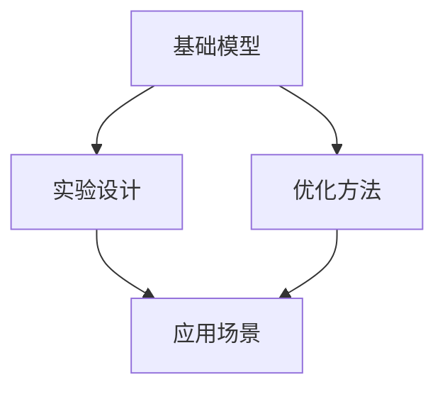

                 

## 1. 背景介绍

在深度学习的广阔天地中，基础模型的密集实验研究是一项耗时且关键的任务。无论是传统的卷积神经网络（CNN）还是现代的Transformer架构，每一种模型都需要经过细致的实验验证，才能应用于实际问题的解决。随着模型复杂度的增加，密集实验的需求也在不断上升，这对于研究人员和开发者来说是一个巨大的挑战。本文将探讨基础模型的密集实验需求，涵盖实验设计、优化方法以及应用场景等方面，以期为相关领域的从业者提供指导。

## 2. 核心概念与联系

### 2.1 核心概念概述

- **基础模型（Fundamental Model）**：指用于解决特定问题或任务的基本深度学习模型，如卷积神经网络（CNN）、循环神经网络（RNN）、Transformer等。
- **密集实验（Intensive Experiment）**：指在模型训练和优化过程中，进行大量的实验来寻找最优的模型参数和训练策略，以提升模型性能。
- **实验设计（Experiment Design）**：指在密集实验中，如何构建实验流程、选择实验条件、制定评估标准等。
- **优化方法（Optimization Technique）**：指在密集实验中，用于提高模型性能的算法和技术，如梯度下降、学习率调度、正则化等。
- **应用场景（Application Scenario）**：指基础模型密集实验研究的具体应用领域，如计算机视觉、自然语言处理、语音识别等。

这些核心概念之间存在紧密的联系，共同构成了基础模型密集实验的框架。理解这些概念的原理和架构，对于掌握密集实验的核心技术至关重要。

### 2.2 核心概念原理和架构的 Mermaid 流程图



这个流程图展示了基础模型、实验设计、优化方法、应用场景之间的逻辑关系：

1. **基础模型**是实验和优化的起点。
2. **实验设计**是实验流程的构建过程。
3. **优化方法**是提升模型性能的技术手段。
4. **应用场景**是实验结果的应用领域。

这些核心概念通过相互作用，共同推动了基础模型的密集实验研究。

## 3. 核心算法原理 & 具体操作步骤

### 3.1 算法原理概述

基础模型的密集实验研究，本质上是模型参数和训练策略的优化过程。通过大量实验，寻找最优的模型参数组合和训练策略，以提升模型的性能和泛化能力。这一过程通常包括以下几个关键步骤：

1. **模型选择**：选择合适的基础模型架构。
2. **数据准备**：收集和预处理数据集。
3. **实验设计**：设计实验流程和评估标准。
4. **模型训练**：使用优化算法进行模型训练。
5. **性能评估**：评估模型在测试集上的性能。
6. **参数优化**：调整模型参数和训练策略，以提高性能。

### 3.2 算法步骤详解

#### 3.2.1 模型选择

选择合适的基础模型是密集实验的第一步。例如，对于计算机视觉任务，可以选择卷积神经网络（CNN）；对于自然语言处理任务，可以选择Transformer等。选择合适的模型架构，需要考虑任务的复杂度、数据量大小以及可用的计算资源等因素。

#### 3.2.2 数据准备

数据准备是密集实验的重要环节。通常需要收集和预处理大量数据集，以确保实验的可靠性。数据预处理包括数据清洗、数据增强、标准化等步骤。

#### 3.2.3 实验设计

实验设计决定了实验流程和评估标准。需要明确实验的目标、实验条件、评估指标等。例如，在计算机视觉任务中，可以设计不同的网络深度、学习率、正则化等实验条件，并使用准确率、损失值等评估指标。

#### 3.2.4 模型训练

模型训练是密集实验的核心步骤。通常使用优化算法（如随机梯度下降、Adam等）进行模型训练。训练过程中需要调整学习率、批次大小、迭代次数等超参数，以寻找最优的训练策略。

#### 3.2.5 性能评估

性能评估是判断模型是否达到预期目标的关键步骤。通常使用测试集对模型进行评估，并根据评估结果调整模型参数和训练策略。

#### 3.2.6 参数优化

参数优化是提升模型性能的关键步骤。通过不断调整模型参数和训练策略，如增加网络深度、调整学习率、使用不同的正则化方法等，以提高模型的性能和泛化能力。

### 3.3 算法优缺点

基础模型的密集实验研究具有以下优点：

1. **提高模型性能**：通过大量实验，可以找到最优的模型参数和训练策略，显著提升模型性能。
2. **泛化能力强**：密集实验得到的模型，通常具有较强的泛化能力，能够更好地适应新的数据和任务。
3. **可复现性强**：通过详细的实验记录和参数设置，实验结果具有较强的可复现性，便于后续研究和改进。

然而，密集实验也存在以下缺点：

1. **资源消耗大**：密集实验需要大量计算资源，如GPU、TPU等，成本较高。
2. **实验周期长**：密集实验需要进行大量实验，每个实验可能需要数天或数周时间，周期较长。
3. **模型复杂度高**：密集实验得到的模型通常具有较高的复杂度，推理速度较慢。

### 3.4 算法应用领域

基础模型的密集实验研究在多个领域得到了广泛应用，例如：

- **计算机视觉**：在图像分类、目标检测、图像生成等任务中，密集实验用于寻找最优的模型架构和训练策略。
- **自然语言处理**：在机器翻译、文本生成、问答系统等任务中，密集实验用于提升模型的语言理解能力和生成能力。
- **语音识别**：在语音识别和语音合成任务中，密集实验用于提高模型的声学模型和语言模型性能。
- **推荐系统**：在推荐系统任务中，密集实验用于优化模型的用户画像和物品画像，提升推荐效果。

## 4. 数学模型和公式 & 详细讲解 & 举例说明

### 4.1 数学模型构建

基础模型的密集实验研究涉及多个数学模型，例如卷积神经网络（CNN）、循环神经网络（RNN）、Transformer等。这些模型的构建通常遵循以下几个步骤：

1. **输入层**：将输入数据（如图像、文本、语音等）转换为模型可以处理的格式。
2. **隐藏层**：通过一系列线性变换和非线性激活函数，提取输入数据的特征。
3. **输出层**：将隐藏层的特征映射为任务的输出结果（如分类、回归、生成等）。

### 4.2 公式推导过程

以卷积神经网络（CNN）为例，其前向传播的计算过程如下：

$$
h^{[l]} = \sigma(\mathbf{W}^{[l]}\mathbf{x}^{[l-1]} + \mathbf{b}^{[l]})
$$

其中，$h^{[l]}$ 表示隐藏层$l$的输出，$\sigma$ 表示激活函数，$\mathbf{W}^{[l]}$ 和 $\mathbf{b}^{[l]}$ 表示权重和偏置。通过不断叠加多个隐藏层，CNN能够提取输入数据的特征，并最终输出结果。

### 4.3 案例分析与讲解

以自然语言处理（NLP）中的Transformer为例，其前向传播的计算过程如下：

$$
\mathbf{y} = \text{MultiHeadSelfAttention}(\mathbf{x})
$$

其中，$\mathbf{x}$ 表示输入序列，$\text{MultiHeadSelfAttention}$ 表示多头自注意力机制。Transformer通过并行化计算和自注意力机制，能够高效地处理长文本序列，并捕捉其语义关系。

## 5. 项目实践：代码实例和详细解释说明

### 5.1 开发环境搭建

为了进行基础模型的密集实验研究，需要搭建一个适合大规模深度学习模型训练的开发环境。以下是使用Python和PyTorch搭建开发环境的示例：

1. 安装Anaconda：
```
conda install anaconda
```

2. 创建虚拟环境：
```
conda create --name pytorch-env python=3.8
conda activate pytorch-env
```

3. 安装PyTorch和相关库：
```
pip install torch torchvision torchaudio
```

4. 安装TensorBoard：
```
pip install tensorboard
```

### 5.2 源代码详细实现

以Transformer为例，以下是使用PyTorch实现Transformer模型的示例代码：

```python
import torch
import torch.nn as nn
import torch.nn.functional as F

class MultiHeadAttention(nn.Module):
    def __init__(self, dim, num_heads):
        super(MultiHeadAttention, self).__init__()
        self.dim = dim
        self.num_heads = num_heads
        self.head_dim = dim // num_heads
        self.fc_q = nn.Linear(dim, dim)
        self.fc_k = nn.Linear(dim, dim)
        self.fc_v = nn.Linear(dim, dim)
        self.fc_o = nn.Linear(dim, dim)

    def forward(self, query, key, value):
        # 将query、key、value映射为多头形式
        query = self.fc_q(query)
        key = self.fc_k(key)
        value = self.fc_v(value)
        # 将query、key、value矩阵转换为多头形式
        batch_size, seq_len, dim = query.size()
        query = query.view(batch_size, seq_len, self.num_heads, self.head_dim).transpose(1, 2)
        key = key.view(batch_size, seq_len, self.num_heads, self.head_dim).transpose(1, 2)
        value = value.view(batch_size, seq_len, self.num_heads, self.head_dim).transpose(1, 2)
        # 计算多头注意力
        attn = torch.matmul(query, key.transpose(2, 3)) / math.sqrt(self.head_dim)
        attn = F.softmax(attn, dim=-1)
        # 计算多头注意力输出
        attn_o = torch.matmul(attn, value)
        attn_o = attn_o.transpose(1, 2).contiguous().view(batch_size, seq_len, dim)
        attn_o = self.fc_o(attn_o)
        return attn_o
```

### 5.3 代码解读与分析

以上代码实现了Transformer中的多头自注意力机制。通过将输入序列分解为多个头，计算每个头的注意力权重，并最终将多头输出的结果进行线性变换，可以得到最终的多头注意力输出。

## 6. 实际应用场景

### 6.1 计算机视觉

基础模型的密集实验研究在计算机视觉领域得到了广泛应用。例如，在图像分类任务中，密集实验用于寻找最优的卷积网络架构和训练策略。通过大量的实验，可以选择合适的网络深度、卷积核大小、激活函数等超参数，以提高模型的分类精度和泛化能力。

### 6.2 自然语言处理

在自然语言处理任务中，密集实验研究也具有重要意义。例如，在机器翻译任务中，密集实验用于优化编码器、解码器以及注意力机制的参数。通过大量的实验，可以找到最优的超参数组合，提升翻译的质量和速度。

### 6.3 推荐系统

推荐系统中的密集实验研究主要集中在用户画像和物品画像的构建上。通过密集实验，可以优化特征选择、模型结构和训练策略，提升推荐效果和用户满意度。

### 6.4 未来应用展望

未来，基础模型的密集实验研究将更加广泛地应用于各个领域。例如，在医疗领域，密集实验可以用于优化疾病预测模型和图像诊断模型；在金融领域，密集实验可以用于优化信用评分模型和风险预测模型。

## 7. 工具和资源推荐

### 7.1 学习资源推荐

1. 《深度学习》（Ian Goodfellow, Yoshua Bengio, Aaron Courville 著）：全面介绍了深度学习的基础知识和算法。
2. CS231n《卷积神经网络》课程：斯坦福大学开设的计算机视觉课程，包含大量实验和代码实现。
3. CS224n《自然语言处理》课程：斯坦福大学开设的NLP课程，涵盖多种NLP任务的实验和模型。
4. Kaggle竞赛：参与Kaggle比赛，通过实际问题解决提升实验技能。

### 7.2 开发工具推荐

1. PyTorch：强大的深度学习框架，提供了丰富的模型和优化器。
2. TensorFlow：Google开发的深度学习框架，适合大规模工程应用。
3. Jupyter Notebook：交互式的编程环境，便于实验记录和共享。
4. TensorBoard：可视化工具，用于实时监测模型训练状态。

### 7.3 相关论文推荐

1. AlexNet: ImageNet Classification with Deep Convolutional Neural Networks：引入卷积神经网络，开启计算机视觉领域的大规模实验研究。
2. Attention Is All You Need：提出Transformer结构，开创了NLP领域的密集实验研究新方向。
3. CNN Architectures for Scene Understanding：介绍卷积神经网络的结构和实验设计，推动计算机视觉的发展。
4. Deep Learning for Natural Language Processing：总结了NLP任务的实验设计方法和效果评估标准。

## 8. 总结：未来发展趋势与挑战

### 8.1 总结

本文对基础模型的密集实验需求进行了详细探讨，涵盖了实验设计、优化方法以及应用场景等方面。密集实验是提升模型性能和泛化能力的关键步骤，也是深度学习研究的重要环节。通过系统的理论学习和实践训练，掌握密集实验的核心技术，有助于研究人员和开发者更好地应对未来的挑战。

### 8.2 未来发展趋势

未来，基础模型的密集实验研究将呈现以下几个发展趋势：

1. **自动化实验设计**：通过自动化工具和算法，自动选择最优的实验条件和评估指标，提升实验效率。
2. **联邦学习**：利用分布式计算资源，实现大规模模型的协同训练和实验，降低计算成本。
3. **模型压缩和量化**：通过模型压缩和量化技术，提升模型的推理速度和计算效率，满足实际应用的需求。
4. **多模态学习**：融合视觉、语音、文本等多模态数据，构建更加全面、高效的深度学习模型。
5. **元学习**：通过学习如何学习，提升模型对新任务的适应能力和泛化能力。

### 8.3 面临的挑战

基础模型的密集实验研究虽然具有重要的应用价值，但也面临诸多挑战：

1. **计算资源限制**：密集实验需要大量的计算资源，如GPU、TPU等，成本较高。
2. **实验周期较长**：密集实验需要进行大量实验，每个实验可能需要数天或数周时间，周期较长。
3. **实验结果可复现性不足**：密集实验中存在大量超参数和随机因素，实验结果的可复现性不足。
4. **模型复杂度高**：密集实验得到的模型通常具有较高的复杂度，推理速度较慢。
5. **数据获取困难**：获取高质量的数据集是密集实验的前提，但数据获取和标注往往需要大量人力和时间。

### 8.4 研究展望

为了应对这些挑战，未来的研究需要在以下几个方面进行探索：

1. **自动化实验平台**：构建自动化实验平台，优化实验流程，提高实验效率和可复现性。
2. **分布式计算**：利用分布式计算资源，实现大规模模型的并行训练和实验，降低计算成本。
3. **模型压缩和量化**：研究模型压缩和量化技术，提升模型的推理速度和计算效率。
4. **多模态学习**：探索多模态数据的融合方法，构建更加全面、高效的深度学习模型。
5. **元学习**：研究元学习技术，提升模型对新任务的适应能力和泛化能力。

通过这些研究方向的研究和实践，有望进一步提升基础模型的密集实验研究水平，推动深度学习技术在各个领域的应用和发展。

## 9. 附录：常见问题与解答

**Q1: 为什么需要进行密集实验？**

A: 密集实验是提升模型性能和泛化能力的关键步骤。通过大量的实验，可以找到最优的模型参数和训练策略，显著提升模型性能。

**Q2: 如何进行高效的密集实验？**

A: 使用自动化工具和算法，自动选择最优的实验条件和评估指标，提升实验效率。同时，利用分布式计算资源，实现大规模模型的并行训练和实验。

**Q3: 密集实验中需要注意哪些问题？**

A: 需要注意计算资源限制、实验周期较长、实验结果可复现性不足、模型复杂度高、数据获取困难等问题。通过优化实验流程、研究自动化实验平台、分布式计算等技术手段，可以有效解决这些问题。

**Q4: 如何选择合适的基础模型？**

A: 需要考虑任务的复杂度、数据量大小以及可用的计算资源等因素。选择合适的模型架构，可以显著提升实验效率和模型性能。

**Q5: 如何处理密集实验中的过拟合问题？**

A: 可以通过数据增强、正则化、对抗训练等方法缓解过拟合问题，确保模型在测试集上具有较好的泛化能力。

---

作者：禅与计算机程序设计艺术 / Zen and the Art of Computer Programming

