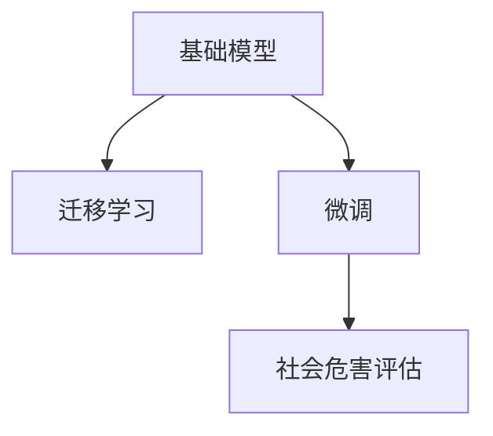

                 

# 基础模型的社会危害评估

## 1. 背景介绍

随着人工智能技术的迅猛发展，基础模型如BERT、GPT等在自然语言处理(NLP)、计算机视觉、语音识别等领域展现出了强大的性能。然而，这些模型的开发和使用，不仅会带来技术层面的挑战，更会对社会产生深远的影响。本文将从基础模型的定义、社会危害以及评估方法等方面进行详细探讨，以期为社会各界提供参考。

## 2. 核心概念与联系

### 2.1 核心概念概述

为了更好地理解基础模型的社会危害评估，本节将介绍几个密切相关的核心概念：

- **基础模型(Foundation Models)**：指在大规模无监督数据上预训练并用于迁移学习、微调等任务的通用模型。例如，BERT、GPT系列模型。
- **迁移学习(Transfer Learning)**：指将在大规模无标签数据上预训练的模型，应用于具体任务时的知识迁移过程。
- **微调(Fine-Tuning)**：指在基础模型上进行微调，以适应特定任务，如自然语言处理任务。
- **社会危害(Social Harm)**：指基础模型对社会产生的负面影响，包括但不限于数据偏见、隐私泄露、伦理问题等。
- **模型评估(Evaluation)**：指对基础模型的性能和影响进行评估，以确保其安全、公平、可解释性。

这些核心概念之间存在紧密联系，共同构成了基础模型及其社会危害评估的框架。通过理解这些概念，我们可以更好地把握基础模型的开发和使用，减少其潜在的社会危害。

### 2.2 核心概念原理和架构的 Mermaid 流程图



这个流程图展示了基础模型通过迁移学习和微调，应用于具体任务的过程，并在评估过程中识别其社会危害。

## 3. 核心算法原理 & 具体操作步骤

### 3.1 算法原理概述

基础模型的社会危害评估，本质上是对其在具体任务应用中的负面影响进行识别和度量。评估过程通常包括以下几个关键步骤：

1. **数据收集与处理**：收集与模型应用相关的数据，并进行预处理。
2. **特征提取与分析**：从数据中提取特征，并使用统计方法或机器学习模型进行分析。
3. **危害识别与度量**：识别模型应用中的社会危害，并量化其程度。
4. **危害缓解与优化**：提出改进措施，减少或消除模型的社会危害。

### 3.2 算法步骤详解

以下是基础模型社会危害评估的一般流程：

**Step 1: 数据收集与处理**
- 收集与模型应用相关的数据，如社交媒体评论、医疗记录、招聘信息等。
- 对数据进行清洗、去噪、归一化等预处理，确保数据质量和一致性。

**Step 2: 特征提取与分析**
- 从处理后的数据中提取关键特征，如文本长度、情感倾向、主题等。
- 使用统计方法或机器学习模型分析这些特征，识别出可能的负面影响。

**Step 3: 危害识别与度量**
- 使用定性或定量的方法识别模型的社会危害，如数据偏见、隐私泄露、伦理问题等。
- 量化危害程度，如偏见强度、隐私泄露范围等。

**Step 4: 危害缓解与优化**
- 针对识别出的社会危害，提出改进措施，如数据清洗、模型优化、算法调整等。
- 验证改进措施的有效性，确保减少或消除社会危害。

### 3.3 算法优缺点

基础模型的社会危害评估方法具有以下优点：

- **全面性**：评估方法覆盖了模型应用的各个方面，包括数据偏见、隐私泄露、伦理问题等。
- **可操作性**：评估结果可以直接指导模型改进和优化，具有较高的实用性。
- **透明性**：评估过程透明，能够接受外部监督和审查。

同时，该方法也存在以下局限性：

- **复杂性**：评估过程涉及多方面因素，需要综合考虑，较为复杂。
- **主观性**：某些危害的识别和度量可能存在主观偏见，需要多角度分析。
- **数据依赖**：评估结果依赖于数据质量和数量，数据不足可能影响评估的准确性。

### 3.4 算法应用领域

基础模型的社会危害评估在多个领域都有应用，包括但不限于：

- **NLP领域**：评估语言模型在文本生成、情感分析等任务中的偏见和歧视问题。
- **计算机视觉**：分析图像识别模型在种族、性别等方面可能带来的歧视和偏见。
- **医疗领域**：评估医疗影像分析模型在疾病诊断、治疗方案推荐等方面的伦理问题。
- **金融领域**：分析金融算法在贷款审批、信用评估等任务中的偏见和公平性问题。

## 4. 数学模型和公式 & 详细讲解 & 举例说明

### 4.1 数学模型构建

基础模型社会危害评估的数学模型通常包括以下几个部分：

- **数据集**：$D=\{(x_i, y_i)\}_{i=1}^N$，其中 $x_i$ 为输入样本，$y_i$ 为对应的标签。
- **特征提取函数**：$f(x)$，用于从样本中提取关键特征。
- **评估函数**：$h(f(x_i))$，用于衡量特征的潜在危害。
- **危害度量函数**：$L$，用于量化危害程度。

### 4.2 公式推导过程

以数据偏见为例，假设有一组数据 $D$，其中包含 $m$ 个种族和 $n$ 个性别。我们定义一个特征 $f(x)$ 来表示样本的种族和性别组合，即 $f(x)=(r, g)$，其中 $r$ 为种族标签，$g$ 为性别标签。

定义一个评估函数 $h(f(x))$ 来衡量种族和性别组合的偏见程度。例如，可以使用卡方检验统计量 $h(r, g) = \sum_i \frac{(o_i - e_i)^2}{e_i}$，其中 $o_i$ 为实际观测值，$e_i$ 为期望值。

假设存在 $k$ 种不同的偏见，我们定义一个危害度量函数 $L = \sum_{i=1}^k w_i h_i(f(x))$，其中 $w_i$ 为第 $i$ 种偏见的权重。

### 4.3 案例分析与讲解

考虑一个基于BERT的情感分析模型，用于对社交媒体评论进行情感分类。我们收集了包含种族偏见的数据集，其中某些评论对特定种族表现出明显的歧视性语言。

首先，我们使用BERT提取评论中的特征，如词语、短语、情感倾向等。然后，使用卡方检验统计量来衡量这些特征的偏见程度。最后，将结果输入危害度量函数，计算出模型在种族偏见方面的危害程度。

## 5. 项目实践：代码实例和详细解释说明

### 5.1 开发环境搭建

在进行社会危害评估实践前，我们需要准备好开发环境。以下是使用Python进行PyTorch开发的环境配置流程：

1. 安装Anaconda：从官网下载并安装Anaconda，用于创建独立的Python环境。

2. 创建并激活虚拟环境：
```bash
conda create -n pytorch-env python=3.8 
conda activate pytorch-env
```

3. 安装PyTorch：根据CUDA版本，从官网获取对应的安装命令。例如：
```bash
conda install pytorch torchvision torchaudio cudatoolkit=11.1 -c pytorch -c conda-forge
```

4. 安装Pandas：
```bash
pip install pandas
```

5. 安装其他工具包：
```bash
pip install numpy sklearn seaborn matplotlib tqdm jupyter notebook ipython
```

完成上述步骤后，即可在`pytorch-env`环境中开始社会危害评估实践。

### 5.2 源代码详细实现

以下是一个使用Pandas进行数据处理，使用Scikit-learn进行特征提取和分析的代码示例：

```python
import pandas as pd
import numpy as np
from sklearn.feature_extraction.text import TfidfVectorizer
from sklearn.metrics import chi2_contingency

# 数据集
data = pd.read_csv('social_media_data.csv')

# 特征提取
vectorizer = TfidfVectorizer(stop_words='english')
X = vectorizer.fit_transform(data['comment'])
y = data['label']

# 评估
chi2, p, dof, expected = chi2_contingency(X, y, method='exact')
print(f"Chi-square test statistic: {chi2:.2f}, p-value: {p:.2f}")
```

### 5.3 代码解读与分析

以上代码使用了Pandas进行数据读取和预处理，使用Scikit-learn的TfidfVectorizer进行特征提取，使用chi2_contingency函数进行卡方检验统计量的计算。

## 6. 实际应用场景

### 6.1 社交媒体分析

基础模型在社交媒体分析中的应用，可以帮助识别和预防网络暴力、仇恨言论等问题。通过收集社交媒体上的评论数据，进行社会危害评估，可以及时发现和处理有害内容，保护用户权益。

在技术实现上，可以构建基础模型，使用TfidfVectorizer提取评论文本的特征，然后使用卡方检验统计量评估评论中存在的偏见和歧视问题。

### 6.2 医疗影像分析

医疗影像分析模型在疾病诊断和疗效评估中的应用，可能会引入数据偏见和伦理问题。通过社会危害评估，可以确保模型在应用中的公平性和可解释性。

在实践中，可以收集医疗影像数据，使用基础模型提取特征，然后使用危害评估方法识别和量化数据偏见和伦理问题。

### 6.3 金融贷款审批

金融贷款审批模型在评估贷款申请人的信用时，可能会引入种族、性别等偏见。通过社会危害评估，可以确保模型在贷款审批中的公平性，避免歧视性决策。

在技术实现上，可以收集贷款申请数据，使用基础模型提取特征，然后使用危害评估方法识别和量化模型中的偏见。

### 6.4 未来应用展望

随着基础模型的广泛应用，社会危害评估也将成为必要环节。未来，在以下几个方面有望取得进展：

1. **多模态数据处理**：结合文本、图像、语音等多种数据源，进行更全面的社会危害评估。
2. **自动化评估工具**：开发自动化评估工具，减少人工干预，提高评估效率。
3. **实时评估与监控**：实现实时数据流评估和监控，及时发现和处理潜在社会危害。
4. **跨领域应用**：将社会危害评估技术应用于更多领域，如教育、司法等，提升整体社会福祉。

## 7. 工具和资源推荐

### 7.1 学习资源推荐

为了帮助开发者系统掌握基础模型的社会危害评估理论基础和实践技巧，这里推荐一些优质的学习资源：

1. 《人工智能伦理与责任》系列博文：由人工智能伦理专家撰写，深入探讨人工智能技术可能带来的伦理问题及其应对策略。

2. 《机器学习中的公平性与偏见》课程：由Coursera等平台提供的机器学习课程，涵盖公平性与偏见的基本概念和评估方法。

3. 《数据科学伦理》书籍：全面介绍数据科学中的伦理问题，包括数据偏见、隐私保护等。

4. 《机器学习与道德》书籍：结合机器学习技术与伦理道德的讨论，探讨如何在技术开发中融入伦理考量。

5. 《社会危害评估工具与方法》论文：介绍当前社会危害评估的主要工具和方法，为相关研究提供参考。

通过对这些资源的学习实践，相信你一定能够快速掌握基础模型的社会危害评估的精髓，并用于解决实际的问题。

### 7.2 开发工具推荐

高效的开发离不开优秀的工具支持。以下是几款用于基础模型社会危害评估开发的常用工具：

1. PyTorch：基于Python的开源深度学习框架，灵活动态的计算图，适合快速迭代研究。大部分基础模型都有PyTorch版本的实现。

2. TensorFlow：由Google主导开发的开源深度学习框架，生产部署方便，适合大规模工程应用。同样有丰富的基础模型资源。

3. Pandas：数据分析和处理的重要工具，能够高效处理多维度数据。

4. Scikit-learn：机器学习工具库，提供了大量的特征提取和统计分析方法。

5. NLTK：自然语言处理工具库，支持文本处理、词性标注等功能。

合理利用这些工具，可以显著提升基础模型社会危害评估的开发效率，加快创新迭代的步伐。

### 7.3 相关论文推荐

基础模型社会危害评估的研究源于学界的持续研究。以下是几篇奠基性的相关论文，推荐阅读：

1. "Bias in Deep Neural Networks: Analysis and Improvement"：分析了深度神经网络中的数据偏见及其改进方法。

2. "Fairness in Machine Learning: A Survey"：综述了机器学习中的公平性和偏见问题，提出了多种评估和改进策略。

3. "Towards Fair and Transparent AI"：探讨了人工智能中的伦理问题，提出了构建公平、透明AI的建议。

4. "Ethical Considerations in AI: A Review"：综合讨论了人工智能技术中的伦理问题，包括隐私、安全性、可解释性等。

5. "A Survey on Fairness, Accountability, and Transparency in Machine Learning and Data Mining"：系统总结了机器学习中的公平性和透明性问题，提供了多种评估和改进方法。

这些论文代表了大语言模型社会危害评估的发展脉络。通过学习这些前沿成果，可以帮助研究者把握学科前进方向，激发更多的创新灵感。

## 8. 总结：未来发展趋势与挑战

### 8.1 总结

本文对基础模型的社会危害评估方法进行了全面系统的介绍。首先阐述了基础模型的定义、社会危害以及评估方法等核心概念，明确了评估在基础模型开发和使用中的重要意义。其次，从原理到实践，详细讲解了社会危害评估的数学原理和关键步骤，给出了社会危害评估任务开发的完整代码实例。同时，本文还广泛探讨了社会危害评估在多个行业领域的应用前景，展示了评估范式的巨大潜力。此外，本文精选了社会危害评估技术的各类学习资源，力求为读者提供全方位的技术指引。

通过本文的系统梳理，可以看到，基础模型的社会危害评估正在成为人工智能技术应用中的必要环节。评估方法通过识别和量化模型的潜在风险，指导模型改进和优化，有助于构建更加安全、公平、可解释的人工智能系统。未来，伴随评估技术的不断演进，人工智能技术将在更多领域得到广泛应用，为社会进步和人类福祉带来深远影响。

### 8.2 未来发展趋势

展望未来，基础模型的社会危害评估技术将呈现以下几个发展趋势：

1. **自动化与智能化**：自动化评估工具和智能化算法将提高评估效率，减少人工干预，实现实时评估。
2. **跨领域应用**：社会危害评估技术将在更多领域得到应用，提升整体社会福祉。
3. **多模态数据融合**：结合文本、图像、语音等多种数据源，进行更全面的社会危害评估。
4. **透明性与可解释性**：评估结果的透明性和可解释性将成为重要研究方向，提升模型的可信度。
5. **隐私保护**：评估过程中注重隐私保护，确保评估数据的安全和合法使用。

这些趋势凸显了基础模型社会危害评估技术的广阔前景。这些方向的探索发展，必将进一步提升人工智能系统的性能和安全性，为社会带来更加广泛的应用。

### 8.3 面临的挑战

尽管基础模型的社会危害评估技术已经取得了显著进展，但在迈向更加智能化、普适化应用的过程中，仍面临诸多挑战：

1. **数据质量与数量**：评估结果依赖于数据质量和数量，数据不足可能影响评估的准确性。
2. **评估方法的多样性**：不同数据和任务需要不同的评估方法，如何选择合适的方法是一个挑战。
3. **模型复杂性**：基础模型的复杂性增加，评估过程也变得更加复杂，需要更多的资源和算法支持。
4. **伦理与法律**：评估过程中涉及伦理和法律问题，需要综合考虑，确保合规性。
5. **技术标准**：目前缺乏统一的基础模型社会危害评估标准，标准的不统一会影响评估结果的可比性和可解释性。

### 8.4 研究展望

面对基础模型社会危害评估所面临的种种挑战，未来的研究需要在以下几个方面寻求新的突破：

1. **数据增强与数据共享**：通过数据增强技术提高评估数据的质量和数量，同时建立数据共享机制，促进数据的多样性和公平性。
2. **模型优化与算法创新**：开发更加高效和准确的评估算法，如集成学习、神经网络等，提升评估效果。
3. **隐私保护与伦理考量**：在评估过程中注重隐私保护和伦理考量，确保评估数据的安全和合法使用。
4. **跨学科合作**：跨学科合作研究，将社会学、伦理学、法律学等多学科知识融入评估中，提升评估的全面性和深度。
5. **标准化研究**：建立统一的基础模型社会危害评估标准，提升评估结果的可比性和可解释性。

这些研究方向的探索，必将引领基础模型社会危害评估技术迈向更高的台阶，为构建安全、公平、可解释的人工智能系统铺平道路。面向未来，基础模型社会危害评估技术还需要与其他人工智能技术进行更深入的融合，如知识表示、因果推理、强化学习等，多路径协同发力，共同推动人工智能技术的进步。

## 9. 附录：常见问题与解答

**Q1：如何评估基础模型的社会危害？**

A: 评估基础模型的社会危害通常包括以下步骤：
1. 收集与模型应用相关的数据，并进行预处理。
2. 从数据中提取关键特征，如文本长度、情感倾向、主题等。
3. 使用统计方法或机器学习模型分析这些特征，识别出可能的负面影响。
4. 量化危害程度，如偏见强度、隐私泄露范围等。

**Q2：社会危害评估对基础模型开发有什么指导意义？**

A: 社会危害评估对基础模型开发具有以下指导意义：
1. 识别潜在的负面影响，如数据偏见、隐私泄露等。
2. 指导模型改进和优化，确保模型的公平性和可解释性。
3. 促进开发者在模型开发过程中融入伦理考量，提升模型的社会责任。

**Q3：社会危害评估的自动化程度如何？**

A: 目前社会危害评估的自动化程度相对较低，需要人工介入进行数据收集和处理、特征提取和分析。未来，随着自动化评估工具和智能化算法的不断发展，评估效率和准确性将显著提升。

**Q4：社会危害评估中的隐私保护措施有哪些？**

A: 在社会危害评估过程中，隐私保护措施包括：
1. 数据匿名化处理，去除或模糊化敏感信息。
2. 限制数据访问权限，确保评估数据的安全。
3. 数据共享时采取加密和传输安全措施，防止数据泄露。

**Q5：社会危害评估结果的透明性与可解释性如何实现？**

A: 社会危害评估结果的透明性与可解释性可以通过以下方法实现：
1. 公开评估方法和数据来源，确保评估过程的透明。
2. 提供评估结果的可解释性报告，解释评估结果的生成过程和依据。
3. 使用可视化工具展示评估结果，提高结果的可理解性。

---

作者：禅与计算机程序设计艺术 / Zen and the Art of Computer Programming

