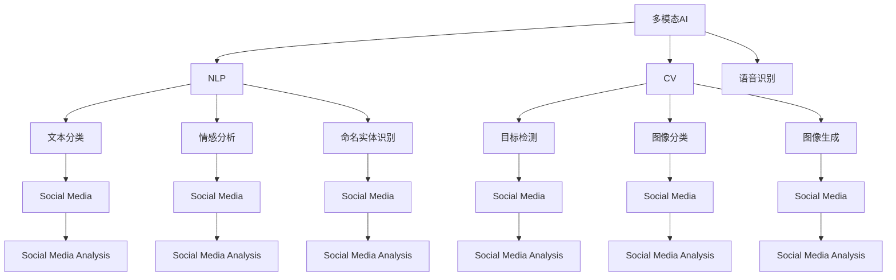

                 

# 多模态AI在社交媒体分析中的应用

> 关键词：多模态AI,社交媒体分析,自然语言处理(NLP),计算机视觉(CV),语音识别,情感分析,趋势预测

## 1. 背景介绍

### 1.1 问题由来
社交媒体（Social Media）作为信息传播的新型渠道，已经深刻影响了人们的日常生活和商业活动。通过监测和分析社交媒体数据，可以获取社会情感、舆论动态、趋势变化等重要信息。传统的文本分析方法往往只能捕捉到文字信息，而忽略了图片、视频、音频等多模态数据的价值。因此，如何综合利用多模态数据，提升社交媒体分析的全面性和准确性，成为了当前研究的热点。

### 1.2 问题核心关键点
多模态AI（Multimodal AI）是一种能够处理、理解和生成多模态数据（如文本、图像、音频等）的技术。在社交媒体分析中，多模态AI可以充分利用文字、图片、视频、音频等多模态信息，实现更全面、准确和深入的情感分析、事件监测、趋势预测等应用。其主要优点包括：
1. **多源数据融合**：融合多种类型的数据，提升信息的全面性。
2. **多维度分析**：同时分析文本、图像、音频等多维数据，提升分析的深度和准确性。
3. **实时处理能力**：支持实时数据流处理，提升事件监测和趋势预测的及时性。
4. **自动化和高效性**：自动化的数据采集和分析流程，降低人工成本，提高处理效率。

当前，多模态AI在社交媒体分析中的应用已经展现出了巨大的潜力，得到了广泛关注和应用。本文将详细探讨多模态AI在社交媒体分析中的应用原理、关键算法、具体实现和实际应用场景，以期为相关领域的开发者和研究者提供参考。

## 2. 核心概念与联系

### 2.1 核心概念概述

为了更好地理解多模态AI在社交媒体分析中的应用，我们先介绍几个关键概念及其相互联系：

- **多模态AI**：指能够处理和分析多种类型数据（如文本、图像、音频等）的AI技术。多模态AI能够从多源数据中提取有价值的信息，提升系统的综合性能。
- **社交媒体分析**：指利用自然语言处理（NLP）、计算机视觉（CV）、语音识别等技术，对社交媒体上的内容进行监测、分析和预测，从而获取社会情感、舆论趋势、用户行为等信息。
- **自然语言处理（NLP）**：指处理和分析人类语言的技术，包括文本分类、情感分析、命名实体识别、机器翻译等任务。
- **计算机视觉（CV）**：指处理和分析图像、视频等视觉数据的AI技术，包括目标检测、图像分类、图像生成等任务。
- **语音识别**：指将人类语音转换成文本的技术，是语音助手、智能对话系统等应用的基础。

这些概念之间的逻辑关系可以通过以下Mermaid流程图来展示：



这个流程图展示了多模态AI、NLP、CV和语音识别等技术在社交媒体分析中的应用关系。

## 3. 核心算法原理 & 具体操作步骤

### 3.1 算法原理概述

多模态AI在社交媒体分析中的应用，主要包括以下几个关键步骤：

1. **数据采集与预处理**：从社交媒体平台采集数据，并对其进行清洗、标注等预处理。
2. **特征提取与融合**：提取文本、图像、音频等多种模态的特征，并对其进行融合，形成统一的多模态特征向量。
3. **多模态模型训练**：使用多模态数据训练多模态AI模型，进行分类、情感分析、趋势预测等任务。
4. **模型评估与优化**：使用验证集和测试集评估模型性能，并根据评估结果进行模型优化和调参。
5. **应用部署与迭代**：将训练好的模型部署到实际应用中，持续收集数据并迭代优化模型。

### 3.2 算法步骤详解

**Step 1: 数据采集与预处理**

社交媒体数据采集是应用多模态AI的第一步。常见的数据源包括Twitter、Facebook、Instagram等社交媒体平台。可以通过API接口或者爬虫等方式获取数据。

1. **API接口**：通过社交媒体平台的API接口，获取公开的数据流或者历史数据。不同平台的API接口可能有所不同，需要根据具体需求进行配置。
2. **爬虫工具**：使用如Scrapy、BeautifulSoup等爬虫工具，爬取社交媒体上的公开数据。需要注意的是，爬虫操作需要遵守社交媒体平台的规定，避免对平台的正常使用造成影响。

数据预处理包括清洗、标注和归一化等步骤。

1. **清洗**：去除数据中的噪声，如HTML标签、特殊字符等，提取有用信息。
2. **标注**：给数据添加标签信息，如情感标签、事件标签等。标注可以手动完成，也可以使用自动化工具，如自然语言处理工具NLTK、Stanford CoreNLP等。
3. **归一化**：将不同模态的数据进行归一化处理，如将文本转换为小写，图像进行尺寸调整等。

**Step 2: 特征提取与融合**

多模态数据的特征提取是应用多模态AI的关键步骤。

1. **文本特征提取**：使用词袋模型（Bag of Words）、TF-IDF、Word2Vec、BERT等技术提取文本特征。
2. **图像特征提取**：使用CNN、ResNet、Inception等卷积神经网络模型提取图像特征。
3. **音频特征提取**：使用MFCC（Mel-Frequency Cepstral Coefficients）、ConvNet等技术提取音频特征。

特征融合是关键步骤之一，将不同模态的特征向量进行合并，形成统一的多模态特征向量。常见的特征融合方法包括：

1. **特征拼接**：将不同模态的特征向量直接拼接在一起，形成一个多模态特征向量。
2. **特征加权**：根据不同模态特征的重要性，给不同的特征向量分配权重，再合并。
3. **特征融合网络**：使用多模态融合网络（如MVNN、MLP、CNN）将不同模态的特征进行融合。

**Step 3: 多模态模型训练**

多模态模型的训练是应用多模态AI的核心。

1. **模型选择**：选择适合多模态数据的模型，如多模态卷积神经网络（MM-CNN）、多模态循环神经网络（MM-RNN）、多模态注意力机制（MM-Attention）等。
2. **模型训练**：使用多模态数据训练多模态模型，进行分类、情感分析、事件监测等任务。
3. **超参数调优**：根据模型在验证集上的表现，调整模型的超参数，如学习率、批量大小、迭代次数等。

**Step 4: 模型评估与优化**

模型评估与优化是多模态AI应用的必要步骤。

1. **模型评估**：使用验证集和测试集评估模型的性能，计算准确率、召回率、F1-score等指标。
2. **模型优化**：根据评估结果，优化模型的结构、超参数等，提升模型的性能。
3. **交叉验证**：使用交叉验证技术，确保模型的泛化能力。

**Step 5: 应用部署与迭代**

应用部署与迭代是多模态AI应用的最终环节。

1. **模型部署**：将训练好的模型部署到实际应用中，如搭建Web服务、集成到移动应用等。
2. **数据收集与迭代**：持续收集新的数据，对模型进行迭代优化，提升模型性能。

### 3.3 算法优缺点

多模态AI在社交媒体分析中的应用，具有以下优点：

1. **全面性**：能够利用多种类型的数据，提升信息的全面性和准确性。
2. **深度分析**：同时分析文本、图像、音频等多维数据，提升分析的深度和准确性。
3. **实时处理**：支持实时数据流处理，提升事件监测和趋势预测的及时性。
4. **自动化**：自动化的数据采集和分析流程，降低人工成本，提高处理效率。

同时，多模态AI也存在以下缺点：

1. **数据量大**：多模态数据通常量较大，需要高性能的硬件设备和大量的计算资源。
2. **模型复杂**：多模态模型结构复杂，训练和调参的难度较大。
3. **数据融合困难**：不同模态数据之间的融合难度较大，需要精心设计融合方法。
4. **应用场景复杂**：多模态AI应用场景复杂，需要针对具体任务进行优化。

## 4. 数学模型和公式 & 详细讲解 & 举例说明

### 4.1 数学模型构建

本节将使用数学语言对多模态AI在社交媒体分析中的应用进行更加严格的刻画。

假设社交媒体上的文本数据为 $T=\{x_1, x_2, \cdots, x_n\}$，图像数据为 $I=\{i_1, i_2, \cdots, i_m\}$，音频数据为 $A=\{a_1, a_2, \cdots, a_k\}$。对于每条社交媒体数据，我们定义其情感标签为 $y$。

定义文本特征提取器为 $F_{text}$，图像特征提取器为 $F_{image}$，音频特征提取器为 $F_{audio}$。假设多模态融合网络为 $F_{fusion}$，输出多模态特征向量为 $V$。

多模态AI模型的损失函数为：

$$
\mathcal{L} = \frac{1}{N} \sum_{i=1}^N \mathcal{L}(F_{fusion}(F_{text}(x_i), F_{image}(i_i), F_{audio}(a_i)), y)
$$

其中，$\mathcal{L}$ 为多模态分类损失函数，可以是交叉熵损失函数等。

### 4.2 公式推导过程

以下我们以情感分析任务为例，推导多模态分类模型的训练公式。

假设文本特征向量为 $v_{text}$，图像特征向量为 $v_{image}$，音频特征向量为 $v_{audio}$。多模态融合网络输出的多模态特征向量为 $V = F_{fusion}(v_{text}, v_{image}, v_{audio})$。

分类任务的损失函数为交叉熵损失函数：

$$
\mathcal{L} = -\frac{1}{N} \sum_{i=1}^N y_i \log \hat{y}_i + (1 - y_i) \log(1 - \hat{y}_i)
$$

其中，$\hat{y}_i$ 为模型预测的情感标签概率。

根据链式法则，损失函数对每个特征向量的梯度为：

$$
\frac{\partial \mathcal{L}}{\partial v_{text}} = -\frac{1}{N} \sum_{i=1}^N y_i \frac{\partial \log \hat{y}_i}{\partial V} \frac{\partial V}{\partial v_{text}}
$$

$$
\frac{\partial \mathcal{L}}{\partial v_{image}} = -\frac{1}{N} \sum_{i=1}^N y_i \frac{\partial \log \hat{y}_i}{\partial V} \frac{\partial V}{\partial v_{image}}
$$

$$
\frac{\partial \mathcal{L}}{\partial v_{audio}} = -\frac{1}{N} \sum_{i=1}^N y_i \frac{\partial \log \hat{y}_i}{\partial V} \frac{\partial V}{\partial v_{audio}}
$$

其中，$\frac{\partial \log \hat{y}_i}{\partial V}$ 为多模态分类器对多模态特征向量的梯度，$\frac{\partial V}{\partial v_{text}}$、$\frac{\partial V}{\partial v_{image}}$、$\frac{\partial V}{\partial v_{audio}}$ 分别为多模态融合网络对每个模态特征向量的梯度。

在得到每个模态特征向量的梯度后，即可带入对应的特征提取器和融合网络，更新模型参数。重复上述过程直至收敛，最终得到适应社交媒体情感分析任务的多模态AI模型。

## 5. 项目实践：代码实例和详细解释说明

### 5.1 开发环境搭建

在进行多模态AI应用开发前，我们需要准备好开发环境。以下是使用Python进行TensorFlow开发的环境配置流程：

1. 安装Anaconda：从官网下载并安装Anaconda，用于创建独立的Python环境。

2. 创建并激活虚拟环境：
```bash
conda create -n tf-env python=3.8 
conda activate tf-env
```

3. 安装TensorFlow：根据CUDA版本，从官网获取对应的安装命令。例如：
```bash
conda install tensorflow tensorflow-gpu=cuda11.1 -c pytorch -c conda-forge
```

4. 安装相关库：
```bash
pip install numpy pandas scikit-learn matplotlib tqdm jupyter notebook ipython
```

完成上述步骤后，即可在`tf-env`环境中开始多模态AI应用开发。

### 5.2 源代码详细实现

下面我们以社交媒体情感分析任务为例，给出使用TensorFlow进行多模态AI模型训练的Python代码实现。

首先，定义多模态特征提取函数：

```python
import tensorflow as tf
from tensorflow.keras.layers import Dense, Input, Dropout, concatenate
from tensorflow.keras.models import Model
from tensorflow.keras.optimizers import Adam

def multimodal_feature_extractor(text_input, image_input, audio_input):
    text_model = text_extractor(text_input)
    image_model = image_extractor(image_input)
    audio_model = audio_extractor(audio_input)
    
    multimodal_features = concatenate([text_model, image_model, audio_model])
    return multimodal_features
```

然后，定义多模态分类模型：

```python
def multimodal_classifier(multimodal_features, num_classes):
    x = Dense(128, activation='relu')(multimodal_features)
    x = Dropout(0.5)(x)
    x = Dense(num_classes, activation='softmax')(x)
    
    model = Model(inputs=multimodal_features, outputs=x)
    return model
```

接着，定义模型训练函数：

```python
def train_model(model, train_data, train_labels, val_data, val_labels, num_epochs, batch_size):
    model.compile(optimizer=Adam(learning_rate=0.001), loss='categorical_crossentropy', metrics=['accuracy'])
    model.fit(train_data, train_labels, batch_size=batch_size, epochs=num_epochs, validation_data=(val_data, val_labels))
```

最后，启动训练流程并在测试集上评估：

```python
text_data, image_data, audio_data, train_labels, val_labels, test_labels = load_data()

multimodal_features = multimodal_feature_extractor(text_data, image_data, audio_data)
multimodal_model = multimodal_classifier(multimodal_features, num_classes=len(set(train_labels)))

train_model(multimodal_model, train_data=train_data, train_labels=train_labels, val_data=val_data, val_labels=val_labels, num_epochs=10, batch_size=32)

test_loss, test_acc = multimodal_model.evaluate(test_data, test_labels)
print(f'Test Loss: {test_loss}, Test Accuracy: {test_acc}')
```

以上就是使用TensorFlow进行多模态情感分析任务训练的完整代码实现。可以看到，多模态AI应用的代码实现相对简洁，利用TensorFlow的高级API和预定义层，可以快速搭建和训练多模态模型。

### 5.3 代码解读与分析

让我们再详细解读一下关键代码的实现细节：

**multimodal_feature_extractor函数**：
- 定义了三个特征提取器，分别用于提取文本、图像、音频特征。
- 使用`concatenate`函数将三个特征向量拼接在一起，形成多模态特征向量。

**multimodal_classifier函数**：
- 定义了一个多模态分类器，使用了Dense层和Dropout层进行特征映射和正则化。
- 使用`softmax`激活函数输出分类概率。

**train_model函数**：
- 使用`compile`函数指定优化器、损失函数和评估指标。
- 使用`fit`函数训练模型，指定训练数据、验证数据、批次大小和迭代次数。

**训练流程**：
- 首先加载数据，包括文本、图像、音频数据和标签。
- 使用`multimodal_feature_extractor`函数提取多模态特征。
- 使用`multimodal_classifier`函数构建多模态分类器。
- 使用`train_model`函数训练模型，在训练集上进行迭代。
- 在验证集上评估模型性能，并调整超参数。
- 在测试集上评估模型性能，给出最终测试结果。

可以看到，TensorFlow提供了强大的多模态建模和训练功能，使得开发者能够快速实现多模态AI应用。当然，实际应用中还需要考虑更多因素，如多模态数据的采集、清洗、标注等，以及模型的推理优化等，但核心的多模态建模流程与上述示例类似。

## 6. 实际应用场景

### 6.1 社交媒体情感分析

多模态AI在社交媒体情感分析中的应用，能够有效识别和分析用户的情感倾向，从而帮助企业了解市场舆情、用户反馈等重要信息。

在技术实现上，可以采集社交媒体上的评论、图片、视频等数据，使用多模态模型进行情感分析。多模态模型可以同时分析文本、图像、音频等多种类型的数据，提升情感分析的全面性和准确性。

例如，可以构建一个多模态情感分析系统，对社交媒体上的用户评论进行情感分析，输出情感倾向（如正面、负面、中性），并统计不同情感类型的评论数量。系统还可以对热点事件进行实时监测，分析公众情绪变化趋势，辅助企业决策。

### 6.2 事件监测与趋势预测

多模态AI在事件监测和趋势预测中的应用，能够帮助企业及时发现和应对突发事件，预测市场趋势变化，提升决策的及时性和准确性。

在技术实现上，可以采集社交媒体上的新闻、报道、评论等文本数据，以及相关图片、视频、音频等多模态数据。使用多模态模型进行事件监测和趋势预测，识别出热点事件、舆情变化、市场动态等关键信息。系统可以根据多模态数据的变化，自动触发警报，帮助企业及时应对风险和把握机会。

例如，可以构建一个多模态事件监测系统，对社交媒体上的新闻进行事件分类和情感分析，输出热点事件和情感倾向。系统还可以根据事件的发展趋势，预测未来的市场变化和舆情走向，提供决策参考。

### 6.3 社交媒体趋势预测

多模态AI在社交媒体趋势预测中的应用，能够帮助企业了解市场动态、用户需求等变化趋势，从而制定更为科学的市场策略。

在技术实现上，可以采集社交媒体上的历史数据和实时数据，使用多模态模型进行趋势预测。多模态模型可以同时分析不同类型的数据，提升趋势预测的准确性和可靠性。

例如，可以构建一个多模态趋势预测系统，对社交媒体上的用户行为进行分析和预测，输出市场变化趋势和用户需求。系统可以根据趋势预测结果，优化产品设计、调整营销策略，提升市场竞争力。

### 6.4 未来应用展望

随着多模态AI技术的不断发展，其在社交媒体分析中的应用前景广阔。未来，多模态AI将在以下几个方面取得更大突破：

1. **多模态数据的融合**：多模态数据融合技术的不断改进，使得不同类型数据之间的整合更加高效和准确。未来，多模态模型将能够更好地利用多源数据，提升分析的全面性和深度。
2. **实时处理能力的提升**：多模态AI实时处理能力的提升，将使得社交媒体事件监测和趋势预测更加及时和准确。未来，系统将能够实现秒级数据流处理，真正实现实时分析。
3. **模型的自动化和优化**：自动化建模和优化技术的不断进步，将使得多模态AI应用的开发更加高效和便捷。未来，系统将能够自动构建和优化多模态模型，提升应用的自动化程度。
4. **应用场景的扩展**：多模态AI在更多领域的应用拓展，将带来更大的价值和收益。未来，系统将能够应用于智能客服、医疗诊断、金融分析等众多垂直行业，实现多场景的智能化应用。

## 7. 工具和资源推荐

### 7.1 学习资源推荐

为了帮助开发者系统掌握多模态AI在社交媒体分析中的应用，这里推荐一些优质的学习资源：

1. TensorFlow官方文档：TensorFlow作为多模态AI应用的主要工具，其官方文档提供了详细的API说明和示例代码，是学习多模态建模的重要资源。
2. PyTorch官方文档：PyTorch是另一种常用的深度学习框架，其官方文档提供了多模态建模的高级API和预定义层，适用于多种应用场景。
3. 《深度学习与多模态学习》书籍：该书系统介绍了深度学习和多模态学习的基本原理和应用，适合初学者和进阶开发者阅读。
4. 《多模态学习》课程：斯坦福大学开设的高级课程，深入讲解多模态数据的融合、建模和应用，适合深入学习。
5. 《多模态学习笔记》博客：博客作者通过一系列文章，介绍了多模态AI的应用和实践经验，适合实战学习。

通过对这些资源的学习实践，相信你一定能够快速掌握多模态AI在社交媒体分析中的应用，并用于解决实际的NLP问题。

### 7.2 开发工具推荐

高效的开发离不开优秀的工具支持。以下是几款用于多模态AI应用开发的常用工具：

1. TensorFlow：基于Python的开源深度学习框架，提供丰富的API和预定义层，适用于多模态建模。
2. PyTorch：基于Python的开源深度学习框架，动态计算图，适用于多模态建模和优化。
3. OpenCV：开源计算机视觉库，提供图像处理和分析工具，适用于多模态数据处理。
4. FFmpeg：开源音频处理工具，提供音频解码、编码和处理功能，适用于多模态数据处理。
5. Hadoop/Spark：分布式计算框架，适用于大规模多模态数据处理和分析。

合理利用这些工具，可以显著提升多模态AI应用的开发效率，加快创新迭代的步伐。

### 7.3 相关论文推荐

多模态AI在社交媒体分析中的应用，得到了广泛关注和研究。以下是几篇奠基性的相关论文，推荐阅读：

1. "Multimodal Machine Learning: A Survey"：综述了多模态学习的基本概念和常用技术，适合初学者了解多模态AI的应用。
2. "Multimodal Sentiment Analysis Using Fusion Rules"：提出了一种基于多模态数据融合的情感分析方法，展示了多模态数据的优势。
3. "Multimodal Event Extraction from Social Media"：提出了一种基于多模态数据的多事件提取方法，展示了多模态数据的融合效果。
4. "Multimodal Social Media Analysis: A Survey"：综述了多模态社交媒体分析的最新进展，适合了解多模态AI的最新应用。
5. "Multimodal Trend Prediction Using Deep Learning"：提出了一种基于深度学习的趋势预测方法，展示了多模态数据的预测能力。

这些论文代表了大规模多模态AI研究的发展脉络。通过学习这些前沿成果，可以帮助研究者把握学科前进方向，激发更多的创新灵感。

## 8. 总结：未来发展趋势与挑战

### 8.1 总结

本文对多模态AI在社交媒体分析中的应用进行了全面系统的介绍。首先阐述了多模态AI和社交媒体分析的研究背景和意义，明确了多模态AI在社交媒体分析中的重要性和应用前景。其次，从原理到实践，详细讲解了多模态AI在社交媒体分析中的核心算法和具体操作步骤，给出了多模态模型训练的完整代码实现。同时，本文还探讨了多模态AI在社交媒体情感分析、事件监测、趋势预测等实际应用场景中的应用，展示了多模态AI的强大能力。最后，本文精选了多模态AI的学习资源、开发工具和相关论文，力求为开发者和研究者提供全方位的技术指引。

通过本文的系统梳理，可以看到，多模态AI在社交媒体分析中具有广泛的应用前景，可以充分利用多源数据，提升分析的全面性和准确性。未来，多模态AI将在更多领域得到应用，为社会和经济的发展带来更大的价值和收益。

### 8.2 未来发展趋势

展望未来，多模态AI在社交媒体分析中的应用将呈现以下几个发展趋势：

1. **多模态数据的融合**：多模态数据融合技术的不断改进，使得不同类型数据之间的整合更加高效和准确。未来，多模态模型将能够更好地利用多源数据，提升分析的全面性和深度。
2. **实时处理能力的提升**：多模态AI实时处理能力的提升，将使得社交媒体事件监测和趋势预测更加及时和准确。未来，系统将能够实现秒级数据流处理，真正实现实时分析。
3. **模型的自动化和优化**：自动化建模和优化技术的不断进步，将使得多模态AI应用的开发更加高效和便捷。未来，系统将能够自动构建和优化多模态模型，提升应用的自动化程度。
4. **应用场景的扩展**：多模态AI在更多领域的应用拓展，将带来更大的价值和收益。未来，系统将能够应用于智能客服、医疗诊断、金融分析等众多垂直行业，实现多场景的智能化应用。

### 8.3 面临的挑战

尽管多模态AI在社交媒体分析中的应用已经取得了不少进展，但在迈向更加智能化、普适化应用的过程中，仍然面临诸多挑战：

1. **数据量大**：多模态数据通常量较大，需要高性能的硬件设备和大量的计算资源。如何高效处理大规模多模态数据，提升计算效率，是一个重要的研究方向。
2. **模型复杂**：多模态模型结构复杂，训练和调参的难度较大。如何设计高效的多模态模型，提升模型的性能，是一个关键问题。
3. **数据融合困难**：不同模态数据之间的融合难度较大，需要精心设计融合方法。如何高效融合多模态数据，提升融合效果，是一个重要挑战。
4. **应用场景复杂**：多模态AI应用场景复杂，需要针对具体任务进行优化。如何设计适用于不同应用场景的多模态模型，是一个重要研究方向。
5. **模型泛化能力不足**：多模态AI模型在特定场景下表现良好，但在新场景下泛化能力有限。如何提升模型的泛化能力，是一个关键问题。
6. **隐私和安全问题**：多模态AI模型通常需要处理敏感数据，如何保障数据的隐私和安全，是一个重要问题。

### 8.4 研究展望

面对多模态AI在社交媒体分析中所面临的挑战，未来的研究需要在以下几个方面寻求新的突破：

1. **高效多模态数据处理技术**：开发高效的多模态数据处理技术，提升数据的融合和处理效率。例如，使用分布式计算框架处理大规模多模态数据。
2. **高效多模态模型设计**：设计高效的多模态模型，提升模型的性能和泛化能力。例如，使用轻量化模型结构，提升模型的推理效率。
3. **多模态数据融合方法**：设计高效的多模态数据融合方法，提升融合效果。例如，使用融合网络或特征映射技术，提升数据融合的准确性。
4. **多模态AI应用场景优化**：针对具体应用场景，优化多模态AI模型。例如，针对特定领域的微调，提升模型在特定场景下的性能。
5. **多模态数据隐私保护**：开发多模态数据的隐私保护技术，保障数据的隐私和安全。例如，使用数据加密和差分隐私技术，保护数据的隐私。
6. **多模态AI伦理和安全**：研究多模态AI的伦理和安全问题，确保模型的公平性、透明性和安全性。例如，引入伦理导向的评估指标，过滤和惩罚有害的输出。

这些研究方向将引领多模态AI在社交媒体分析中的应用，进一步提升分析的全面性、准确性和实时性，为社会和经济的发展带来更大的价值和收益。

## 9. 附录：常见问题与解答

**Q1：多模态AI在社交媒体分析中如何处理多样化的数据类型？**

A: 多模态AI通过使用不同类型的数据提取器，可以处理多样化的数据类型。例如，文本数据可以使用自然语言处理技术提取特征，图像数据可以使用计算机视觉技术提取特征，音频数据可以使用语音识别技术提取特征。在融合这些特征时，可以使用拼接、加权、融合网络等方法，形成统一的多模态特征向量。

**Q2：多模态AI在实时处理大规模数据时面临哪些挑战？**

A: 实时处理大规模数据是多模态AI面临的主要挑战。在处理大规模数据时，需要高效的数据处理和存储技术，如分布式计算、数据流处理、数据压缩等。此外，还需要设计高效的模型结构和优化算法，以提高模型的推理速度和资源利用率。

**Q3：多模态AI在社交媒体分析中如何提升模型的泛化能力？**

A: 提升模型的泛化能力是多模态AI在社交媒体分析中的关键问题。常用的方法包括：
1. 数据增强：使用数据增强技术，增加训练数据的多样性，提升模型的泛化能力。
2. 迁移学习：通过迁移学习，将预训练模型在大规模数据上学习的知识迁移到社交媒体数据上，提升模型的泛化能力。
3. 自监督学习：使用自监督学习技术，在无标注数据上预训练模型，提升模型的泛化能力。
4. 模型集成：使用模型集成技术，组合多个模型的预测结果，提升模型的泛化能力。

**Q4：多模态AI在社交媒体分析中如何保障数据的隐私和安全？**

A: 保障数据的隐私和安全是多模态AI在社交媒体分析中的重要问题。常用的方法包括：
1. 数据加密：使用数据加密技术，保护数据在传输和存储过程中的安全。
2. 差分隐私：使用差分隐私技术，保护数据隐私，防止数据泄露。
3. 匿名化处理：对数据进行匿名化处理，减少数据泄露的风险。
4. 访问控制：设计严格的访问控制机制，确保数据只能被授权用户访问。

**Q5：多模态AI在社交媒体分析中如何提升模型的实时性？**

A: 提升模型的实时性是多模态AI在社交媒体分析中的关键问题。常用的方法包括：
1. 分布式计算：使用分布式计算框架，提升数据处理和模型推理的效率。
2. 数据流处理：使用数据流处理技术，实时处理数据流，提升模型的实时性。
3. 模型压缩：使用模型压缩技术，减小模型的存储空间和计算资源消耗，提升模型的实时性。
4. 模型优化：使用模型优化技术，提升模型的推理速度和资源利用率，提升模型的实时性。

通过这些方法，可以有效提升多模态AI在社交媒体分析中的实时性，满足实际应用的需求。

---

作者：禅与计算机程序设计艺术 / Zen and the Art of Computer Programming

