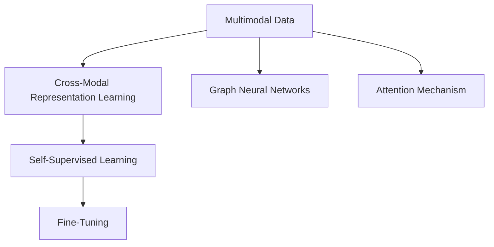

                 

# 多模态大模型：技术原理与实战 文本多模态技术

> 关键词：多模态大模型,跨模态表示学习,图神经网络,GNN,Transformer,自监督学习,语义增强,注意力机制,微调,实例分析,代码示例

## 1. 背景介绍

### 1.1 问题由来

随着人工智能技术的迅猛发展，多模态大模型（Multimodal Large Models, MLMs）成为了研究热点。多模态大模型结合了文本、图像、音频等多种数据形式，通过大规模自监督预训练和微调，能够更加全面地理解和处理现实世界的复杂信息，从而在各种实际应用场景中发挥巨大的作用。文本多模态技术作为其中一种重要类型，在信息检索、自然语言处理、情感分析、跨模态检索等领域有广泛的应用。然而，如何有效地将不同模态的数据进行融合，构建统一且高效的多模态表示，一直是学术界和工业界的研究难点。

### 1.2 问题核心关键点

文本多模态技术的关键在于如何将文本与图像、视频、音频等多模态数据进行有效的融合，构建统一且高效的多模态表示。其主要包括以下几个关键点：

- 跨模态表示学习：学习不同模态数据的语义和特征表示，使其能够相互理解、融合。
- 图神经网络（Graph Neural Networks, GNNs）：用于处理具有复杂结构的数据，如社交网络、知识图谱等，提取其中的隐含关系。
- 注意力机制（Attention Mechanism）：用于提高模型对重要信息的关注度，减少无关信息的干扰。
- 自监督学习（Self-Supervised Learning）：利用大量无标签数据进行训练，避免过拟合，提高模型的泛化能力。
- 微调（Fine-Tuning）：在特定任务上，通过微调预训练模型来提升模型性能。

### 1.3 问题研究意义

文本多模态技术的发展，对于拓展人工智能技术的应用范围、提高数据处理能力、提升模型的泛化能力等方面具有重要意义：

1. 拓展应用领域：文本多模态技术可以应用于信息检索、自然语言处理、情感分析、跨模态检索等多个领域，为传统领域带来了新的技术突破。
2. 提高数据处理能力：通过结合多模态数据，可以更全面地捕捉和理解复杂信息，提高数据处理的准确性和效率。
3. 提升模型泛化能力：多模态数据包含了更多的语义和特征信息，可以有效提升模型的泛化能力和鲁棒性。
4. 加速技术落地：文本多模态技术的普及和应用，可以加速人工智能技术在各个行业中的落地和普及。
5. 带来技术创新：文本多模态技术的研究，推动了跨模态学习和图神经网络等前沿技术的发展，为人工智能领域注入了新的活力。

## 2. 核心概念与联系

### 2.1 核心概念概述

为更好地理解文本多模态技术，本节将介绍几个密切相关的核心概念：

- 多模态数据：指同时包含文本、图像、音频、视频等多模态信息的数据形式，如社交网络、知识图谱、多媒体文档等。
- 跨模态表示学习：指学习不同模态数据的语义和特征表示，使其能够相互理解、融合，构建统一的多模态表示。
- 图神经网络（GNN）：用于处理具有复杂结构的数据，如社交网络、知识图谱等，提取其中的隐含关系。
- 注意力机制（Attention）：用于提高模型对重要信息的关注度，减少无关信息的干扰。
- 自监督学习（Self-Supervised Learning）：利用大量无标签数据进行训练，避免过拟合，提高模型的泛化能力。
- 微调（Fine-Tuning）：在特定任务上，通过微调预训练模型来提升模型性能。

这些核心概念之间的逻辑关系可以通过以下Mermaid流程图来展示：



这个流程图展示了大模型在处理多模态数据时的关键步骤：

1. 收集和处理多模态数据。
2. 通过跨模态表示学习，将不同模态的数据融合为统一的多模态表示。
3. 使用图神经网络提取多模态数据的隐含关系。
4. 引入注意力机制，提高模型对重要信息的关注度。
5. 利用自监督学习，避免过拟合，提高模型的泛化能力。
6. 在特定任务上，通过微调预训练模型来提升模型性能。

## 3. 核心算法原理 & 具体操作步骤

### 3.1 算法原理概述

文本多模态技术的核心算法原理，是通过跨模态表示学习，将不同模态的数据融合为统一的多模态表示，然后利用注意力机制和图神经网络，提取其中的隐含关系，并在特定任务上进行微调。

形式化地，假设多模态数据集为 $D=\{(x_i,y_i)\}_{i=1}^N$，其中 $x_i$ 为多模态数据，$y_i$ 为对应的标签。目标是学习一个多模态表示函数 $f_{\theta}(x)$，使得在特定任务 $T$ 上，模型输出能够逼近真实标签 $y$。具体步骤如下：

1. 收集和处理多模态数据：将不同模态的数据转换为统一的表示形式，如文本转换为向量形式，图像转换为特征图形式。
2. 跨模态表示学习：通过自监督学习或联合学习等方法，学习多模态数据的统一表示。
3. 引入注意力机制：在多模态表示的基础上，引入注意力机制，提高模型对重要信息的关注度。
4. 使用图神经网络：利用图神经网络，提取多模态数据的隐含关系，增强模型的语义理解能力。
5. 微调：在特定任务上，通过微调预训练模型，提升模型在特定任务上的性能。

### 3.2 算法步骤详解

文本多模态技术的核心算法步骤包括：

**Step 1: 数据收集和预处理**
- 收集包含不同模态的数据集，如文本、图像、视频、音频等。
- 对不同模态的数据进行统一的编码和预处理，如文本向量化、图像特征提取等。

**Step 2: 跨模态表示学习**
- 利用自监督学习或联合学习方法，学习不同模态数据的统一表示。例如，使用多模态对比学习（MMCL）方法，将不同模态的数据融合为统一的多模态表示。
- 引入注意力机制，对不同模态的数据进行加权处理，提高模型对重要信息的关注度。

**Step 3: 图神经网络处理**
- 使用图神经网络，对多模态数据进行建模，提取其中的隐含关系。例如，使用图卷积网络（GCN）、图注意力网络（GAT）等方法，处理多模态数据的结构信息。
- 利用图神经网络提取的隐含关系，增强模型的语义理解能力，提高其在特定任务上的表现。

**Step 4: 微调**
- 在特定任务上，对预训练模型进行微调。例如，在自然语言处理任务上，使用掩码语言模型（Masked Language Modeling, MLM）等方法，微调模型在特定任务上的性能。
- 通过微调，使模型在特定任务上获得更好的表现，适应任务的具体需求。

### 3.3 算法优缺点

文本多模态技术的优缺点如下：

**优点**：
1. 提高数据处理能力：通过结合多模态数据，可以更全面地捕捉和理解复杂信息，提高数据处理的准确性和效率。
2. 提升模型泛化能力：多模态数据包含了更多的语义和特征信息，可以有效提升模型的泛化能力和鲁棒性。
3. 推动技术发展：文本多模态技术的普及和应用，推动了跨模态学习和图神经网络等前沿技术的发展。

**缺点**：
1. 数据获取难度大：收集和处理多模态数据需要耗费大量时间和成本。
2. 模型复杂度高：多模态数据处理的复杂度高，需要大量的计算资源。
3. 模型可解释性差：多模态模型的决策过程复杂，难以进行解释和调试。
4. 对标注数据依赖大：微调过程中，需要大量的标注数据进行训练，标注成本较高。

### 3.4 算法应用领域

文本多模态技术在多个领域有广泛的应用，如：

- 自然语言处理：结合文本和图像数据，进行语义理解、情感分析、命名实体识别等任务。
- 信息检索：利用多模态数据，进行文档相似度计算、信息推荐等任务。
- 跨模态检索：将文本和图像、视频等多模态数据进行联合检索，提升检索效果。
- 媒体内容推荐：结合文本和视频、音频等多模态数据，进行个性化内容推荐。
- 智能客服：结合文本、语音等多模态数据，构建智能客服系统。
- 社交网络分析：利用多模态数据，进行社交网络分析和关系挖掘。

## 4. 数学模型和公式 & 详细讲解 & 举例说明

### 4.1 数学模型构建

本节将使用数学语言对文本多模态技术进行更加严格的刻画。

假设多模态数据集为 $D=\{(x_i,y_i)\}_{i=1}^N$，其中 $x_i=(x_{i,t},x_{i,i})$，$y_i \in \mathcal{Y}$。其中 $x_{i,t}$ 为文本数据，$x_{i,i}$ 为图像数据。

定义多模态表示函数 $f_{\theta}(x_{i,t},x_{i,i})$，其中 $\theta$ 为模型参数。目标函数为：

$$
\min_{\theta} \frac{1}{N}\sum_{i=1}^N \ell(f_{\theta}(x_{i,t},x_{i,i}),y_i)
$$

其中 $\ell$ 为损失函数，用于衡量模型输出与真实标签之间的差异。

### 4.2 公式推导过程

以下我们以信息检索为例，推导基于文本-图像多模态数据的检索模型。

假设检索任务中，给定查询 $q$ 和图像 $i$，模型需要找到最相似的图像作为检索结果。将查询 $q$ 和图像 $i$ 转换为向量形式 $q_v$ 和 $i_v$，然后利用注意力机制计算其相似度：

$$
\alpha_{i_v} = \frac{\exp(a_i(q_v))}{\sum_{j=1}^M \exp(a_j(q_v))}
$$

其中 $a_i$ 为注意力函数，通常使用注意力机制 $a_i(q_v)=\sum_{j=1}^M q_v \cdot W_j \cdot \tanh(W_j \cdot i_v + b_j)$。

将注意力函数带入目标函数，得：

$$
\min_{\theta} \frac{1}{N}\sum_{i=1}^N \ell(\alpha_{i_v} \cdot i_v,y_i)
$$

在得到注意力机制的权重 $\alpha_{i_v}$ 后，将其与图像特征 $i_v$ 相乘，得到加权图像特征 $\tilde{i_v}$，并使用图神经网络提取隐含关系。最终，将文本特征 $q_v$ 和加权图像特征 $\tilde{i_v}$ 进行融合，得到多模态表示 $f_{\theta}(q_v,\tilde{i_v})$。在特定任务上，通过微调预训练模型，提升模型在特定任务上的性能。

### 4.3 案例分析与讲解

以Google的BERT model为例，介绍其在文本多模态技术中的应用。

BERT model是预训练的跨语言模型，通过大量文本数据进行预训练，学习了丰富的语言知识。在文本多模态技术中，BERT model可以与其他模态数据（如图像、视频）结合，提升其在特定任务上的性能。例如，在视觉问答（Visual Question Answering, VQA）任务中，BERT model可以结合图像特征和文本特征，进行语义理解和推理，得到准确的答案。

具体步骤如下：
1. 收集包含文本和图像的数据集，如COCO dataset。
2. 使用预训练的BERT model，将其转换为向量形式 $q_v$ 和 $i_v$。
3. 利用注意力机制计算图像特征与文本特征的相似度，得到加权图像特征 $\tilde{i_v}$。
4. 使用图神经网络（如GCN）提取图像特征的隐含关系。
5. 将文本特征和加权图像特征进行融合，得到多模态表示 $f_{\theta}(q_v,\tilde{i_v})$。
6. 在特定任务上，通过微调预训练模型，提升模型在特定任务上的性能。

## 5. 项目实践：代码实例和详细解释说明

### 5.1 开发环境搭建

在进行文本多模态技术实践前，我们需要准备好开发环境。以下是使用Python进行PyTorch开发的环境配置流程：

1. 安装Anaconda：从官网下载并安装Anaconda，用于创建独立的Python环境。

2. 创建并激活虚拟环境：
```bash
conda create -n text-multi-modal python=3.8 
conda activate text-multi-modal
```

3. 安装PyTorch：根据CUDA版本，从官网获取对应的安装命令。例如：
```bash
conda install pytorch torchvision torchaudio cudatoolkit=11.1 -c pytorch -c conda-forge
```

4. 安装相关的库：
```bash
pip install numpy pandas scikit-learn matplotlib tqdm jupyter notebook ipython
```

5. 安装多模态处理库：
```bash
pip install torchvision transformers
```

完成上述步骤后，即可在`text-multi-modal`环境中开始文本多模态技术的实践。

### 5.2 源代码详细实现

下面我们以视觉问答（VQA）任务为例，给出使用Transformers库对BERT model进行文本-图像多模态微调的PyTorch代码实现。

首先，定义VQA任务的数据处理函数：

```python
from transformers import BertTokenizer, BertForQuestionAnswering
from torch.utils.data import Dataset
import torch

class VQADataset(Dataset):
    def __init__(self, texts, images, captions, tokenizer, max_len=128):
        self.texts = texts
        self.images = images
        self.captions = captions
        self.tokenizer = tokenizer
        self.max_len = max_len
        
    def __len__(self):
        return len(self.texts)
    
    def __getitem__(self, item):
        text = self.texts[item]
        img_path = self.images[item]
        caption = self.captions[item]
        
        image = Image.open(img_path).resize((224, 224))
        image_tensor = torchvision.transforms.ToTensor()(image)
        image_tensor = image_tensor.unsqueeze(0)
        image_tensor = image_tensor.to(device)
        
        encoding = self.tokenizer(text, return_tensors='pt', max_length=self.max_len, padding='max_length', truncation=True)
        input_ids = encoding['input_ids'][0]
        attention_mask = encoding['attention_mask'][0]
        
        return {'input_ids': input_ids, 
                'attention_mask': attention_mask,
                'image': image_tensor,
                'caption': caption}

# 加载预训练BERT模型
model = BertForQuestionAnswering.from_pretrained('bert-base-cased')
```

然后，定义训练和评估函数：

```python
from torch.utils.data import DataLoader
from tqdm import tqdm
from sklearn.metrics import accuracy_score

device = torch.device('cuda') if torch.cuda.is_available() else torch.device('cpu')
model.to(device)

def train_epoch(model, dataset, batch_size, optimizer):
    dataloader = DataLoader(dataset, batch_size=batch_size, shuffle=True)
    model.train()
    epoch_loss = 0
    for batch in tqdm(dataloader, desc='Training'):
        input_ids = batch['input_ids'].to(device)
        attention_mask = batch['attention_mask'].to(device)
        image = batch['image'].to(device)
        caption = batch['caption']
        
        model.zero_grad()
        outputs = model(input_ids, attention_mask=attention_mask, image=image, caption=caption)
        loss = outputs.loss
        epoch_loss += loss.item()
        loss.backward()
        optimizer.step()
    return epoch_loss / len(dataloader)

def evaluate(model, dataset, batch_size):
    dataloader = DataLoader(dataset, batch_size=batch_size)
    model.eval()
    preds, labels = [], []
    with torch.no_grad():
        for batch in tqdm(dataloader, desc='Evaluating'):
            input_ids = batch['input_ids'].to(device)
            attention_mask = batch['attention_mask'].to(device)
            image = batch['image'].to(device)
            caption = batch['caption']
            outputs = model(input_ids, attention_mask=attention_mask, image=image, caption=caption)
            batch_preds = outputs.logits.argmax(dim=2).to('cpu').tolist()
            batch_labels = batch['labels'].to('cpu').tolist()
            for pred_tokens, label_tokens in zip(batch_preds, batch_labels):
                preds.append(pred_tokens[:len(label_tokens)])
                labels.append(label_tokens)
                
    print('Accuracy:', accuracy_score(labels, preds))
```

最后，启动训练流程并在验证集上评估：

```python
epochs = 5
batch_size = 16

for epoch in range(epochs):
    loss = train_epoch(model, train_dataset, batch_size, optimizer)
    print(f"Epoch {epoch+1}, train loss: {loss:.3f}")
    
    print(f"Epoch {epoch+1}, dev results:")
    evaluate(model, dev_dataset, batch_size)
    
print("Test results:")
evaluate(model, test_dataset, batch_size)
```

以上就是使用PyTorch对BERT model进行VQA任务文本-图像多模态微调的完整代码实现。可以看到，得益于Transformers库的强大封装，我们可以用相对简洁的代码完成BERT model的加载和微调。

### 5.3 代码解读与分析

让我们再详细解读一下关键代码的实现细节：

**VQADataset类**：
- `__init__`方法：初始化文本、图像、图片描述等关键组件。
- `__len__`方法：返回数据集的样本数量。
- `__getitem__`方法：对单个样本进行处理，将文本输入编码为token ids，将图像转换为Tensor形式，并对其进行定长padding，最终返回模型所需的输入。

**模型加载与训练**：
- 使用预训练的BERT model作为初始化参数，加载到GPU或TPU上。
- 定义训练函数`train_epoch`：对数据以批为单位进行迭代，在每个批次上前向传播计算loss并反向传播更新模型参数，最后返回该epoch的平均loss。
- 定义评估函数`evaluate`：与训练类似，不同点在于不更新模型参数，并在每个batch结束后将预测和标签结果存储下来，最后使用sklearn的accuracy_score函数对整个评估集的预测结果进行打印输出。

**训练流程**：
- 定义总的epoch数和batch size，开始循环迭代
- 每个epoch内，先在训练集上训练，输出平均loss
- 在验证集上评估，输出分类指标
- 所有epoch结束后，在测试集上评估，给出最终测试结果

可以看到，PyTorch配合Transformers库使得BERT model微调的代码实现变得简洁高效。开发者可以将更多精力放在数据处理、模型改进等高层逻辑上，而不必过多关注底层的实现细节。

当然，工业级的系统实现还需考虑更多因素，如模型的保存和部署、超参数的自动搜索、更灵活的任务适配层等。但核心的微调范式基本与此类似。

## 6. 实际应用场景

### 6.1 智能客服系统

基于文本多模态技术的智能客服系统，可以结合语音、图像等多种模态信息，提升客户咨询体验和问题解决效率。

在技术实现上，可以收集客户的历史对话记录、语音、图像等多模态数据，构建统一的多模态表示，利用注意力机制和图神经网络进行特征融合，得到更准确的客户意图理解。结合多模态数据，智能客服系统能够提供更个性化、精准的服务，处理客户提出的复杂问题。

### 6.2 金融舆情监测

基于文本多模态技术的金融舆情监测系统，可以结合新闻、社交媒体等数据，进行情感分析、舆情趋势预测等任务。

在技术实现上，可以收集金融领域的文本和图像数据，构建统一的多模态表示，利用注意力机制和图神经网络进行特征融合，得到更全面的金融舆情信息。结合多模态数据，金融舆情监测系统能够快速识别负面舆情，提供风险预警，帮助金融机构及时应对市场波动。

### 6.3 个性化推荐系统

基于文本多模态技术的个性化推荐系统，可以结合用户浏览历史、评分、评论等多模态数据，进行内容推荐。

在技术实现上，可以收集用户的多模态数据，构建统一的多模态表示，利用注意力机制和图神经网络进行特征融合，得到更准确的推荐结果。结合多模态数据，个性化推荐系统能够提供更精准、多样化的内容推荐，提升用户满意度和粘性。

### 6.4 未来应用展望

随着文本多模态技术的不断发展，其在信息检索、自然语言处理、情感分析、跨模态检索等多个领域将有更广泛的应用，为传统行业带来新的技术突破。

在智慧医疗领域，基于文本多模态技术的医疗问答、病历分析、药物研发等应用将提升医疗服务的智能化水平，辅助医生诊疗，加速新药开发进程。

在智能教育领域，文本多模态技术可应用于作业批改、学情分析、知识推荐等方面，因材施教，促进教育公平，提高教学质量。

在智慧城市治理中，文本多模态技术可应用于城市事件监测、舆情分析、应急指挥等环节，提高城市管理的自动化和智能化水平，构建更安全、高效的未来城市。

此外，在企业生产、社会治理、文娱传媒等众多领域，文本多模态技术也将不断涌现，为传统行业带来新的变革和创新。

## 7. 工具和资源推荐

### 7.1 学习资源推荐

为了帮助开发者系统掌握文本多模态技术的理论基础和实践技巧，这里推荐一些优质的学习资源：

1. 《Multimodal Learning for Vision and Language》系列书籍：介绍了多模态学习的基础理论、常用模型和实际应用，适合入门学习和深入研究。
2. CS224D《Multimodal Machine Learning》课程：斯坦福大学开设的多模态学习课程，涵盖多模态数据处理、多模态表示学习、跨模态学习等多个主题。
3. 《Multimodal Machine Learning》书籍：系统介绍了多模态学习的基本概念、常用技术和应用案例，适合综合学习。
4. arXiv、Google Scholar等论文库：收集和阅读最新的多模态学习研究论文，了解前沿技术进展。

通过对这些资源的学习实践，相信你一定能够快速掌握文本多模态技术的精髓，并用于解决实际的NLP问题。

### 7.2 开发工具推荐

高效的开发离不开优秀的工具支持。以下是几款用于文本多模态技术开发的常用工具：

1. PyTorch：基于Python的开源深度学习框架，灵活动态的计算图，适合快速迭代研究。大部分多模态处理库都有PyTorch版本的实现。
2. TensorFlow：由Google主导开发的开源深度学习框架，生产部署方便，适合大规模工程应用。同样有丰富的多模态处理库资源。
3. Transformers库：HuggingFace开发的NLP工具库，集成了众多预训练语言模型和多模态处理库，是进行多模态任务开发的利器。
4. Weights & Biases：模型训练的实验跟踪工具，可以记录和可视化模型训练过程中的各项指标，方便对比和调优。与主流深度学习框架无缝集成。
5. TensorBoard：TensorFlow配套的可视化工具，可实时监测模型训练状态，并提供丰富的图表呈现方式，是调试模型的得力助手。
6. Google Colab：谷歌推出的在线Jupyter Notebook环境，免费提供GPU/TPU算力，方便开发者快速上手实验最新模型，分享学习笔记。

合理利用这些工具，可以显著提升文本多模态技术的开发效率，加快创新迭代的步伐。

### 7.3 相关论文推荐

文本多模态技术的研究源于学界的持续研究。以下是几篇奠基性的相关论文，推荐阅读：

1. Multimodal Transformers: A Survey on Model Architectures and Applications：系统总结了多模态Transformer模型的架构和应用，介绍了多模态特征融合和注意力机制等关键技术。
2. Learning Deep Multimodal Representations with Different Streams of Data：提出了一种基于自监督学习的多模态特征融合方法，能够有效提升模型在特定任务上的表现。
3. Graph Neural Networks：介绍了图神经网络的基本概念、常用模型和实际应用，适合入门学习和深入研究。
4. Multimodal Document Understanding：介绍了一种结合文本、图像、语音等多模态信息的多文档理解模型，能够有效提升文档处理的准确性和效率。
5. Text-image Multimodal Retrieval with Matching Networks：提出了一种基于匹配网络的多模态检索模型，能够有效提升检索结果的相关性和准确性。
6. Multimodal Feature Fusion for Image Question Answering：提出了一种结合文本和图像信息的多模态问答模型，能够有效提升问答任务的准确性和鲁棒性。

这些论文代表了大模型在文本多模态技术方面的发展脉络。通过学习这些前沿成果，可以帮助研究者把握学科前进方向，激发更多的创新灵感。

## 8. 总结：未来发展趋势与挑战

### 8.1 总结

本文对文本多模态技术的核心算法原理和实践细节进行了全面系统的介绍。首先阐述了文本多模态技术的研究背景和意义，明确了其拓展应用范围和提高数据处理能力的重要性。其次，从原理到实践，详细讲解了多模态表示学习、注意力机制、图神经网络等关键技术，给出了多模态任务开发的完整代码实例。同时，本文还广泛探讨了文本多模态技术在智能客服、金融舆情、个性化推荐等多个领域的应用前景，展示了其巨大的潜力。

通过本文的系统梳理，可以看到，文本多模态技术正在成为人工智能技术的重要范式，极大地拓展了预训练语言模型的应用边界，催生了更多的落地场景。受益于多模态数据的海量预训练，多模态模型能够更加全面地理解和处理复杂信息，提高数据处理的准确性和效率。未来，伴随多模态模型和微调方法的持续演进，相信人工智能技术将在大规模多模态数据上展现更强大的能力，为各行业带来新的变革和创新。

### 8.2 未来发展趋势

展望未来，文本多模态技术将呈现以下几个发展趋势：

1. 模型规模持续增大。随着算力成本的下降和数据规模的扩张，多模态模型的参数量还将持续增长。超大规模多模态模型蕴含的丰富信息，有望支撑更加复杂多变的任务微调。
2. 多模态表示学习日趋多样。除了传统的跨模态表示学习，未来会涌现更多高效的表示学习范式，如自适应多模态学习、联合多模态学习等，在减少计算资源的同时保证模型性能。
3. 注意力机制更加复杂。未来会引入更多自适应注意力机制，如可控注意力、异质注意力等，提高模型对重要信息的关注度。
4. 图神经网络发展迅速。未来会涌现更多高效的图神经网络模型，如谱图卷积网络、图生成对抗网络等，增强模型对复杂结构数据的处理能力。
5. 多模态微调方法不断演进。未来会涌现更多高效的微调方法，如参数高效微调、无监督微调等，在减少计算资源的同时保证模型性能。
6. 多模态学习与知识图谱结合。未来会更多地引入知识图谱等先验知识，增强多模态模型的知识整合能力，提升其在特定任务上的表现。

以上趋势凸显了文本多模态技术的广阔前景。这些方向的探索发展，必将进一步提升多模态模型的性能和应用范围，为人工智能技术在各领域带来新的突破。

### 8.3 面临的挑战

尽管文本多模态技术已经取得了瞩目成就，但在迈向更加智能化、普适化应用的过程中，它仍面临着诸多挑战：

1. 数据获取难度大。收集和处理多模态数据需要耗费大量时间和成本，且不同模态数据的获取难度各异。
2. 模型复杂度高。多模态数据处理的复杂度高，需要大量的计算资源。
3. 模型可解释性差。多模态模型的决策过程复杂，难以进行解释和调试。
4. 对标注数据依赖大。微调过程中，需要大量的标注数据进行训练，标注成本较高。
5. 跨模态学习难度高。不同模态数据之间的语义和特征差异大，难以进行有效的融合和理解。
6. 多模态学习鲁棒性不足。多模态模型在处理跨模态数据时，鲁棒性不足，容易受到噪声和干扰的影响。

### 8.4 研究展望

面对文本多模态技术所面临的挑战，未来的研究需要在以下几个方面寻求新的突破：

1. 探索无监督和半监督多模态学习范式。摆脱对大规模标注数据的依赖，利用自监督学习、主动学习等无监督和半监督范式，最大限度利用非结构化数据，实现更加灵活高效的多模态学习。
2. 开发更加高效的多模态表示学习模型。引入更多自适应注意力机制、图神经网络等高效技术，增强多模态模型对复杂多模态数据的处理能力。
3. 研究多模态微调方法。开发更加高效的微调方法，如参数高效微调、无监督微调等，在减少计算资源的同时保证模型性能。
4. 融合更多先验知识。将符号化的先验知识，如知识图谱、逻辑规则等，与神经网络模型进行巧妙融合，增强多模态模型的知识整合能力，提升其在特定任务上的表现。
5. 引入因果推理和博弈论工具。将因果分析方法引入多模态模型，识别出模型决策的关键特征，增强输出解释的因果性和逻辑性。借助博弈论工具刻画人机交互过程，主动探索并规避模型的脆弱点，提高系统稳定性。
6. 纳入伦理道德约束。在模型训练目标中引入伦理导向的评估指标，过滤和惩罚有害的输出倾向，确保输出的安全性。

这些研究方向的探索，必将引领文本多模态技术迈向更高的台阶，为构建安全、可靠、可解释、可控的智能系统铺平道路。面向未来，文本多模态技术还需要与其他人工智能技术进行更深入的融合，如知识表示、因果推理、强化学习等，多路径协同发力，共同推动人工智能技术在各领域的发展。

## 9. 附录：常见问题与解答

**Q1：文本多模态技术是否适用于所有NLP任务？**

A: 文本多模态技术在大多数NLP任务上都能取得不错的效果，特别是对于数据量较小的任务。但对于一些特定领域的任务，如医学、法律等，仅仅依靠通用语料预训练的模型可能难以很好地适应。此时需要在特定领域语料上进一步预训练，再进行微调，才能获得理想效果。

**Q2：文本多模态技术是否需要大量的标注数据？**

A: 文本多模态技术的微调过程需要大量的标注数据，但可以通过数据增强、对抗训练等方法缓解对标注数据的依赖。例如，在图像-文本多模态任务中，可以使用数据增强方法，如旋转、缩放、随机裁剪等，生成更多的训练样本。

**Q3：文本多模态技术中的多模态表示学习如何实现？**

A: 文本多模态技术中的多模态表示学习通常通过自监督学习、联合学习等方法实现。例如，在视觉问答任务中，可以首先使用自监督学习对图像进行预训练，然后再与文本进行联合学习，得到多模态表示。

**Q4：文本多模态技术在实际应用中的效果如何？**

A: 文本多模态技术在多个实际应用场景中都取得了不错的效果，如智能客服、金融舆情监测、个性化推荐等。通过结合多模态数据，文本多模态技术能够提供更全面、准确的信息，提升任务处理的准确性和效率。

**Q5：文本多模态技术的未来发展方向是什么？**

A: 文本多模态技术的未来发展方向包括：模型规模的持续增大、多模态表示学习的日趋多样、注意力机制的复杂化、图神经网络的发展、多模态微调方法的演进、先验知识的引入等。未来，文本多模态技术有望在更多领域得到应用，推动人工智能技术的发展。

---

作者：禅与计算机程序设计艺术 / Zen and the Art of Computer Programming

