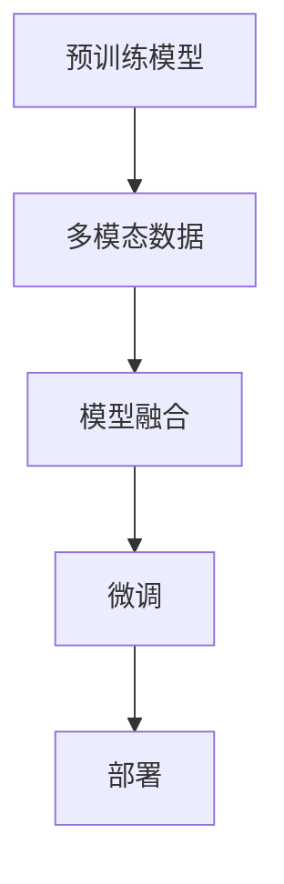

                 

# 多模态大模型：技术原理与实战 部署环境准备

> 关键词：多模态大模型,技术原理,实战部署,环境准备,模型训练,模型优化,资源管理,硬件要求

## 1. 背景介绍

### 1.1 问题由来

随着人工智能技术的发展，多模态大模型（Multi-modal Large Models）在计算机视觉、自然语言处理（NLP）、语音识别等交叉领域的应用变得越来越广泛。这些模型通过同时处理图像、文本和语音等多模态数据，具备更强的泛化能力和理解深度，能够更好地适应现实世界的复杂性。然而，多模态模型的构建和部署涉及多种技术细节和资源配置，使得开发者在实践过程中面临诸多挑战。

### 1.2 问题核心关键点

本节将详细阐述多模态大模型的核心概念、技术原理、应用场景及其实践中的关键点：

- **多模态大模型（Multi-modal Large Models）**：指同时处理图像、文本、语音等多种模态数据的深度学习模型，能够进行跨模态理解和生成，如ImageNet上的预训练模型、BERT等。
- **技术原理**：包括预训练、微调、迁移学习、数据增强、对抗训练等，用于提升模型的泛化能力和理解深度。
- **实战部署**：涉及到模型的保存、加载、推理、监控等环节，要求开发者具备一定的工程实践能力。
- **环境准备**：包括开发环境搭建、训练资源配置、部署平台选择等，是进行模型开发和实验的基础。

这些关键点共同构成了多模态大模型的技术框架，对于理解其在实际应用中的表现和优化至关重要。

## 2. 核心概念与联系

### 2.1 核心概念概述

多模态大模型（Multi-modal Large Models）是将深度学习模型应用于处理多种模态数据（如文本、图像、音频等）的技术。这类模型通常具有以下特点：

- **跨模态融合能力**：能够将不同模态的数据进行联合建模，提升对多模态数据的理解能力。
- **大规模预训练**：基于大规模无标注数据进行预训练，学习通用特征表示。
- **多任务学习**：能够同时学习多个任务，如分类、生成、匹配等，适应不同的应用场景。
- **多模态表示学习**：学习不同模态数据的联合表示，提升模型在不同模态上的理解深度。

### 2.2 核心概念原理和架构的 Mermaid 流程图



- **A: 预训练模型**：如BERT、ResNet、VGGNet等，是进行多模态理解的基础。
- **B: 多模态数据**：包括图像、文本、音频等多种类型的数据，是多模态模型的输入。
- **C: 模型融合**：通过融合不同模态的特征表示，构建多模态的联合表示。
- **D: 微调**：在预训练模型基础上，针对具体任务进行有监督训练，提升模型性能。
- **E: 部署**：将训练好的模型部署到实际应用中，进行推理和预测。

这些步骤构成了一个多模态大模型从构建到应用的全流程，其中每一环节都依赖于前一个环节的输出，共同支持模型的最终表现。

## 3. 核心算法原理 & 具体操作步骤

### 3.1 算法原理概述

多模态大模型的构建主要包括以下几个步骤：

1. **数据收集与预处理**：收集并预处理多模态数据，确保数据的质量和一致性。
2. **预训练模型选择**：选择合适的预训练模型作为基础，如BERT、ResNet等。
3. **模型融合**：通过特定的融合方式，将不同模态的特征表示进行联合建模。
4. **微调**：在预训练模型基础上，针对具体任务进行微调，提升模型性能。
5. **部署与监控**：将训练好的模型部署到实际应用中，并进行性能监控和优化。

### 3.2 算法步骤详解

以下是多模态大模型的详细步骤：

#### 1. 数据收集与预处理

- **数据收集**：收集多模态数据，如图像、文本、音频等，确保数据的丰富性和多样性。
- **数据预处理**：进行数据清洗、标准化、归一化等处理，确保数据的一致性和可用性。

#### 2. 预训练模型选择

- **模型选择**：根据任务类型选择适合的预训练模型。如处理图像任务可以选择ResNet、Inception等，处理文本任务可以选择BERT、GPT等。
- **预训练**：在大量无标注数据上进行预训练，学习通用的特征表示。

#### 3. 模型融合

- **特征融合**：使用不同的特征提取器提取多模态数据的特征表示，如使用VGGNet提取图像特征，使用BERT提取文本特征。
- **联合表示**：通过一定的融合方法（如拼接、残差连接等），将不同模态的特征表示联合起来，形成多模态的联合表示。

#### 4. 微调

- **任务适配**：根据具体任务需求，设计相应的输出层和损失函数，如分类任务使用交叉熵损失，生成任务使用均方误差损失。
- **模型训练**：在标注数据集上进行有监督训练，优化模型参数。

#### 5. 部署与监控

- **模型保存**：将训练好的模型保存为静态或动态模型文件，方便后续的推理和预测。
- **模型部署**：将模型部署到实际应用环境中，进行推理预测。
- **性能监控**：实时监控模型性能，发现问题并进行优化。

### 3.3 算法优缺点

#### 优点：

- **强大的泛化能力**：多模态模型能够同时处理多种数据模态，具备更强的泛化能力和理解深度。
- **高效的数据利用**：能够充分利用不同模态的数据，提高模型对复杂环境的适应性。
- **提升任务表现**：在多种任务上（如分类、生成、匹配等）都能取得优于单模态模型的表现。

#### 缺点：

- **数据需求高**：需要收集和处理大量的多模态数据，对数据资源和存储要求较高。
- **训练复杂度高**：多模态融合和联合表示学习过程复杂，需要更多的计算资源和时间。
- **部署难度大**：模型的推理和预测需要考虑多种模态数据的融合，增加了部署和调优的难度。

### 3.4 算法应用领域

多模态大模型在多个领域得到了广泛应用，包括但不限于：

- **计算机视觉**：图像分类、目标检测、图像生成等任务。
- **自然语言处理**：情感分析、文本分类、机器翻译等任务。
- **语音识别**：语音识别、情感分析、语音合成等任务。
- **机器人学**：人机交互、机器人视觉、机器人语音识别等任务。
- **智能医疗**：医疗影像分析、病历文本分析、语音交互等任务。

这些领域的多模态数据具有高度的相关性和互补性，通过多模态大模型能够更好地处理和理解这些数据，提升系统的性能和用户体验。

## 4. 数学模型和公式 & 详细讲解

### 4.1 数学模型构建

#### 4.1.1 预训练模型构建

多模态预训练模型的构建通常包括以下步骤：

1. **数据收集**：收集大规模无标注数据，如ImageNet上的图像数据、大规模文本语料等。
2. **数据预处理**：对数据进行清洗、标准化、归一化等处理。
3. **模型选择**：选择合适的预训练模型，如ResNet、VGGNet、BERT等。
4. **模型训练**：在大量无标注数据上进行预训练，学习通用的特征表示。

#### 4.1.2 微调模型构建

在预训练模型基础上，针对具体任务进行微调，构建微调模型：

1. **任务适配**：根据具体任务需求，设计相应的输出层和损失函数。
2. **模型训练**：在标注数据集上进行有监督训练，优化模型参数。

### 4.2 公式推导过程

#### 4.2.1 图像分类任务

假设有一个图像分类任务，使用预训练的ResNet模型进行多模态融合，模型结构如下：

```
input -> feature extractor (ResNet) -> feature fusion -> classifier
```

其中，`feature extractor`为图像特征提取器，`feature fusion`为特征融合层，`classifier`为分类器。模型的输入为图像数据，输出为图像类别。

##### 输入表示

输入图像经过特征提取器后，得到一组特征向量表示。设特征向量的维数为$D$，特征提取器的输出表示为$X \in \mathbb{R}^D$。

##### 特征融合

假设使用平均池化进行特征融合，将多个模态的特征表示进行加权平均，得到联合特征表示$Y \in \mathbb{R}^D$。

$$
Y = \frac{X + T + L}{3}
$$

其中，$T$和$L$分别表示文本和语音特征向量，$1/3$为各模态特征的权重。

##### 微调模型

微调模型的损失函数为交叉熵损失，输出层为全连接层，设输出层参数为$W$，则微调模型的输出为：

$$
Z = YW
$$

其中，$Z \in \mathbb{R}^C$，$C$为类别数。

微调模型的损失函数为：

$$
\mathcal{L} = \frac{1}{N} \sum_{i=1}^N [y_i \log \sigma(Z^i) + (1-y_i) \log (1-\sigma(Z^i))]
$$

其中，$y_i \in \{0,1\}$为标签，$\sigma$为sigmoid函数。

### 4.3 案例分析与讲解

#### 4.3.1 文本分类

假设有一个文本分类任务，使用预训练的BERT模型进行多模态融合，模型结构如下：

```
input -> feature extractor (BERT) -> feature fusion -> classifier
```

其中，`feature extractor`为文本特征提取器，`feature fusion`为特征融合层，`classifier`为分类器。模型的输入为文本数据，输出为文本类别。

##### 输入表示

输入文本经过BERT特征提取器后，得到一组特征向量表示。设特征向量的维数为$D$，特征提取器的输出表示为$X \in \mathbb{R}^D$。

##### 特征融合

假设使用注意力机制进行特征融合，将多个模态的特征表示进行加权融合，得到联合特征表示$Y \in \mathbb{R}^D$。

$$
Y = \sum_{i=1}^k \alpha_i X_i
$$

其中，$X_i$为不同模态的特征向量，$\alpha_i$为注意力权重。

##### 微调模型

微调模型的损失函数为交叉熵损失，输出层为全连接层，设输出层参数为$W$，则微调模型的输出为：

$$
Z = YW
$$

其中，$Z \in \mathbb{R}^C$，$C$为类别数。

微调模型的损失函数为：

$$
\mathcal{L} = \frac{1}{N} \sum_{i=1}^N [y_i \log \sigma(Z^i) + (1-y_i) \log (1-\sigma(Z^i))]
$$

其中，$y_i \in \{0,1\}$为标签，$\sigma$为sigmoid函数。

## 5. 项目实践：代码实例和详细解释说明

### 5.1 开发环境搭建

#### 5.1.1 环境要求

- **Python**：Python 3.8及以上版本。
- **PyTorch**：PyTorch 1.6及以上版本。
- **TensorFlow**：TensorFlow 2.0及以上版本。
- **CUDA**：CUDA 10.2及以上版本。
- **GPU**：至少一张NVIDIA GTX/RTX系列显卡。

#### 5.1.2 环境配置

```bash
# 创建虚拟环境
conda create -n myenv python=3.8

# 激活虚拟环境
conda activate myenv

# 安装依赖包
pip install torch torchvision transformers

# 安装TensorFlow（可选）
pip install tensorflow

# 安装CUDA和CUDNN（可选）
conda install -c pytorch torchvision
```

### 5.2 源代码详细实现

#### 5.2.1 数据准备

假设我们有一个文本分类任务，使用预训练的BERT模型进行微调，数据集为IMDB影评数据集。

```python
import torch
import torch.nn as nn
import torch.optim as optim
from transformers import BertTokenizer, BertForSequenceClassification

# 加载数据集
train_data = ...
test_data = ...

# 加载BERT预训练模型和分词器
model = BertForSequenceClassification.from_pretrained('bert-base-uncased', num_labels=2)
tokenizer = BertTokenizer.from_pretrained('bert-base-uncased')

# 定义损失函数和优化器
criterion = nn.CrossEntropyLoss()
optimizer = optim.Adam(model.parameters(), lr=2e-5)

# 数据预处理
def preprocess(text):
    tokens = tokenizer.encode(text, add_special_tokens=True)
    tokens = tokens + [0] * (768 - len(tokens))
    tokens = torch.tensor(tokens, dtype=torch.long)
    return tokens

# 训练过程
def trainEpoch(model, data_loader, optimizer, criterion):
    model.train()
    total_loss = 0
    for batch in data_loader:
        inputs, labels = batch
        inputs = preprocess(inputs)
        labels = labels
        optimizer.zero_grad()
        outputs = model(inputs)
        loss = criterion(outputs, labels)
        loss.backward()
        optimizer.step()
        total_loss += loss.item()
    return total_loss / len(data_loader)

# 测试过程
def testEpoch(model, data_loader, criterion):
    model.eval()
    total_loss = 0
    for batch in data_loader:
        inputs, labels = batch
        inputs = preprocess(inputs)
        labels = labels
        outputs = model(inputs)
        loss = criterion(outputs, labels)
        total_loss += loss.item()
    return total_loss / len(data_loader)
```

### 5.3 代码解读与分析

#### 5.3.1 数据预处理

在数据预处理阶段，我们使用了BertTokenizer对文本进行分词和编码，同时进行了padding和truncation操作，确保每个样本的特征表示长度一致。

#### 5.3.2 模型训练

在模型训练阶段，我们使用了Adam优化器和交叉熵损失函数，对模型参数进行更新。通过`trainEpoch`函数进行单epoch的训练，并返回该epoch的平均损失。

#### 5.3.3 模型评估

在模型评估阶段，我们同样使用了交叉熵损失函数，对模型在测试集上的性能进行评估，并返回该epoch的平均损失。

### 5.4 运行结果展示

```python
# 训练过程
for epoch in range(5):
    loss = trainEpoch(model, train_loader, optimizer, criterion)
    print(f"Epoch {epoch+1}, train loss: {loss:.3f}")

# 测试过程
loss = testEpoch(model, test_loader, criterion)
print(f"Test loss: {loss:.3f}")
```

## 6. 实际应用场景

### 6.1 智能医疗

在智能医疗领域，多模态大模型可以用于医学影像分析、病历文本分析、语音交互等多种应用。

#### 6.1.1 医学影像分析

多模态大模型可以对医学影像（如CT、MRI等）进行联合分析，帮助医生进行疾病诊断和治疗方案的制定。

#### 6.1.2 病历文本分析

多模态大模型可以对医生的病历记录进行文本分析，提取出关键信息，如患者症状、诊断结果等，辅助医生进行决策。

#### 6.1.3 语音交互

多模态大模型可以对语音输入进行理解和生成，辅助医生进行语音交互，提高诊疗效率。

### 6.2 智慧城市

在智慧城市领域，多模态大模型可以用于城市事件监测、舆情分析、应急指挥等多种应用。

#### 6.2.1 城市事件监测

多模态大模型可以对城市中的视频、图像、传感器数据等进行联合分析，及时发现并响应城市事件。

#### 6.2.2 舆情分析

多模态大模型可以对社交媒体、新闻、评论等文本数据进行情感分析，了解公众对城市问题的态度和意见。

#### 6.2.3 应急指挥

多模态大模型可以对实时数据进行分析和融合，辅助应急指挥中心进行灾害预警和应急响应。

### 6.3 智能家居

在智能家居领域，多模态大模型可以用于智能设备和环境的联合控制，提高用户的生活质量和体验。

#### 6.3.1 智能设备控制

多模态大模型可以对用户的语音指令进行理解和生成，控制智能设备（如灯光、窗帘、温控等），实现家居自动化。

#### 6.3.2 环境监测

多模态大模型可以对家庭环境进行监测和分析，如温度、湿度、空气质量等，提供健康建议和生活指导。

#### 6.3.3 智能安防

多模态大模型可以对家庭安防设备进行联合分析，及时发现异常情况，提供预警和应对措施。

## 7. 工具和资源推荐

### 7.1 学习资源推荐

#### 7.1.1 在线课程

- **Coursera**：提供深度学习、计算机视觉、自然语言处理等领域的在线课程，适合初学者入门。
- **edX**：提供多模态学习、智能系统等领域的课程，涵盖从基础到高级的知识点。
- **Udacity**：提供深度学习、强化学习、机器学习等领域的纳米学位课程，适合系统学习。

#### 7.1.2 书籍

- **《深度学习》**：Ian Goodfellow等著，深度学习领域的经典教材，涵盖深度学习的基础理论和实践。
- **《自然语言处理综论》**：Daniel Jurafsky等著，NLP领域的权威教材，涵盖NLP的各个方面。
- **《计算机视觉：算法与应用》**：Richard Szeliski等著，计算机视觉领域的经典教材，涵盖计算机视觉的基础理论和应用。

#### 7.1.3 博客和论坛

- **Kaggle**：数据科学和机器学习社区，提供丰富的数据集和竞赛，适合实践和交流。
- **arXiv**：科研论文预印平台，提供最新的科研成果和进展，适合学术研究。
- **GitHub**：开源社区，提供丰富的开源项目和代码库，适合学习和借鉴。

### 7.2 开发工具推荐

#### 7.2.1 深度学习框架

- **PyTorch**：灵活动态的深度学习框架，适合研究和开发。
- **TensorFlow**：生产部署友好的深度学习框架，适合工程应用。
- **MXNet**：高效的深度学习框架，支持多种编程语言和分布式训练。

#### 7.2.2 模型管理工具

- **Weights & Biases**：模型训练的实验跟踪工具，记录和可视化训练过程。
- **TensorBoard**：TensorFlow配套的可视化工具，监控模型训练状态和性能。
- **MLflow**：模型生命周期的管理工具，记录和部署模型训练过程。

#### 7.2.3 数据管理工具

- **DVC**：数据版本控制工具，管理训练数据和模型版本。
- **AWS S3**：云端存储服务，适合存储大规模数据集。
- **Google Cloud Storage**：云端存储服务，适合存储大规模数据集和模型。

### 7.3 相关论文推荐

#### 7.3.1 计算机视觉

- **R-CNN: Rich Feature Hierarchies for Accurate Object Detection and Semantic Segmentation**：提出了R-CNN模型，开创了深度学习在目标检测和语义分割领域的应用。
- **ResNet: Deep Residual Learning for Image Recognition**：提出了ResNet模型，解决了深度神经网络中的梯度消失问题，提高了网络的训练深度。
- **Faster R-CNN: Towards Real-Time Object Detection with Region Proposal Networks**：提出了Faster R-CNN模型，在目标检测领域取得了SOTA性能。

#### 7.3.2 自然语言处理

- **BERT: Pre-training of Deep Bidirectional Transformers for Language Understanding**：提出了BERT模型，通过掩码语言模型和下一句预测任务进行预训练，提升了语言模型的理解能力。
- **GPT-3: Language Models are Unsupervised Multitask Learners**：提出了GPT-3模型，通过大规模无监督学习，实现了零样本和少样本学习。
- **T5: Exploring the Limits of Transfer Learning with a Unified Text-to-Text Transformer**：提出了T5模型，通过统一的多任务训练框架，提升了模型在文本生成和推理任务上的表现。

#### 7.3.3 语音识别

- **Deep Speech 2: End-to-End Speech Recognition in English and Mandarin**：提出了Deep Speech 2模型，通过深度学习实现了语音识别的端到端训练。
- **Attention is All You Need**：提出了Transformer模型，在语音识别领域取得了SOTA性能。
- **WaveNet: A Generative Model for Raw Audio**：提出了WaveNet模型，实现了高保真的语音生成。

## 8. 总结：未来发展趋势与挑战

### 8.1 未来发展趋势

#### 8.1.1 更强的泛化能力

随着预训练模型的不断增强，多模态大模型的泛化能力也将得到提升，能够更好地处理复杂多变的现实环境。

#### 8.1.2 更高的效率

随着硬件和算法技术的进步，多模态大模型的训练和推理效率将得到提升，能够更快地进行模型部署和推理预测。

#### 8.1.3 更广泛的应用场景

随着技术的不断进步，多模态大模型将在更多领域得到应用，如智能医疗、智慧城市、智能家居等。

#### 8.1.4 更高的安全性

随着模型透明度的提升，多模态大模型将具备更高的安全性，能够有效防止模型被滥用或攻击。

#### 8.1.5 更强的可解释性

随着模型透明度的提升，多模态大模型将具备更强的可解释性，能够提供更可靠的决策依据和建议。

### 8.2 未来研究展望

#### 8.2.1 多模态融合方法

研究更加高效的多模态融合方法，提升不同模态数据之间的信息共享和融合效果。

#### 8.2.2 联合训练算法

研究联合训练算法，提高多模态模型在多任务上的性能和泛化能力。

#### 8.2.3 跨模态理解

研究跨模态理解方法，提升模型在不同模态上的理解深度和推理能力。

#### 8.2.4 模型压缩与优化

研究模型压缩与优化技术，提高多模态模型的推理速度和计算效率。

#### 8.2.5 多模态数据集

研究多模态数据集的构建与优化，提升模型的训练效果和泛化能力。

## 9. 附录：常见问题与解答

### 9.1 常见问题

#### Q1: 多模态大模型与单模态模型的区别是什么？

A: 多模态大模型可以同时处理多种模态数据，如文本、图像、语音等，而单模态模型只能处理一种模态数据。多模态大模型通过联合不同模态的信息，具备更强的泛化能力和理解深度。

#### Q2: 多模态大模型在训练时需要注意哪些问题？

A: 多模态大模型在训练时需要考虑不同模态数据之间的平衡，避免某一种模态数据占比过高或过低。同时需要选择合适的损失函数和优化器，确保模型能够有效地融合不同模态的信息。

#### Q3: 多模态大模型的应用场景有哪些？

A: 多模态大模型可以应用于计算机视觉、自然语言处理、语音识别、机器人学等多个领域，提供跨模态的联合理解和生成能力。

#### Q4: 多模态大模型的优缺点是什么？

A: 优点包括强大的泛化能力、高效的数据利用、提升任务表现等；缺点包括数据需求高、训练复杂度高、部署难度大等。

### 9.2 解答

#### Q1: 多模态大模型与单模态模型的区别是什么？

A: 多模态大模型可以同时处理多种模态数据，如文本、图像、语音等，而单模态模型只能处理一种模态数据。多模态大模型通过联合不同模态的信息，具备更强的泛化能力和理解深度。

#### Q2: 多模态大模型在训练时需要注意哪些问题？

A: 多模态大模型在训练时需要考虑不同模态数据之间的平衡，避免某一种模态数据占比过高或过低。同时需要选择合适的损失函数和优化器，确保模型能够有效地融合不同模态的信息。

#### Q3: 多模态大模型的应用场景有哪些？

A: 多模态大模型可以应用于计算机视觉、自然语言处理、语音识别、机器人学等多个领域，提供跨模态的联合理解和生成能力。

#### Q4: 多模态大模型的优缺点是什么？

A: 优点包括强大的泛化能力、高效的数据利用、提升任务表现等；缺点包括数据需求高、训练复杂度高、部署难度大等。

---

作者：禅与计算机程序设计艺术 / Zen and the Art of Computer Programming

