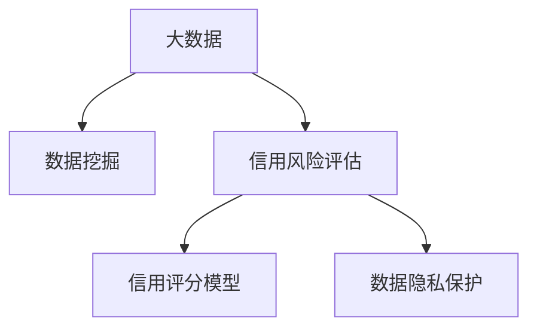

                 

# 大数据背景下的银行个人征信体系研究

## 1. 背景介绍

### 1.1 问题由来

随着互联网金融的兴起和信用经济的发展，银行等金融机构越来越依赖于大数据技术，来评估和控制个人和企业的信用风险。个人征信体系作为金融机构风险管理的核心组成部分，其准确性和完整性直接影响着金融服务的质量和安全性。传统的人力审核、现场调查等征信手段已经难以适应海量数据和高频交易的需求。

大数据背景下，银行个人征信体系的研究显得尤为重要。本文将探讨大数据技术在银行个人征信体系中的应用，从数据采集、存储、处理、分析等多个环节入手，全面阐述如何构建一个高效、准确、安全的银行个人征信体系。

### 1.2 问题核心关键点

银行个人征信体系的研究核心关键点在于：
- 如何高效采集和存储海量个人信用数据。
- 如何利用大数据技术进行数据预处理和清洗，提取有价值的信息。
- 如何通过数据分析和建模，准确评估客户的信用风险。
- 如何构建多维度的信用评分模型，实现全面风险控制。
- 如何保障数据的隐私和安全，防止信息滥用和数据泄露。

本文旨在回答以上问题，通过系统性分析和深入研究，提出构建高效、准确、安全的银行个人征信体系的方法和策略。

## 2. 核心概念与联系

### 2.1 核心概念概述

为更好地理解大数据背景下的银行个人征信体系，本节将介绍几个密切相关的核心概念：

- 大数据（Big Data）：指规模巨大、类型多样、速度极快的数据集，通常以TB或PB计。大数据技术包括数据采集、存储、处理、分析等环节。
- 数据挖掘（Data Mining）：通过分析大量数据，发现隐藏在数据中的规律、趋势、模式等。在征信体系中，数据挖掘可以帮助提取信用记录、消费行为、社交网络等有价值的信息。
- 信用风险评估（Credit Risk Assessment）：评估个人或企业的违约风险，预测其还款能力。是银行个人征信体系的核心环节。
- 信用评分模型（Credit Scoring Model）：通过分析客户的历史信用行为和现状，构建数学模型，预测客户的信用风险。常见的信用评分模型包括Logistic回归、决策树、随机森林等。
- 数据隐私保护（Data Privacy Protection）：在处理个人信用数据时，必须确保数据的安全和隐私，防止数据滥用和泄露。

这些核心概念之间的逻辑关系可以通过以下Mermaid流程图来展示：



这个流程图展示了大数据技术在银行个人征信体系中的应用过程：

1. 通过大数据技术采集和存储个人信用数据。
2. 利用数据挖掘技术，从数据中提取有价值的信息。
3. 根据提取的信息，构建信用风险评估模型。
4. 利用评估模型，构建信用评分模型。
5. 在模型构建和应用过程中，注重数据隐私保护。

## 3. 核心算法原理 & 具体操作步骤

### 3.1 算法原理概述

银行个人征信体系的核心算法原理主要包括以下几个方面：

1. **数据预处理与清洗**：通过ETL（Extract, Transform, Load）流程，从各种数据源中采集数据，并进行清洗和处理，以去除噪音和无关信息，提取有用的特征。

2. **信用风险评估**：利用统计学、机器学习和人工智能技术，对客户的信用记录、财务状况、消费行为等数据进行分析，评估客户的信用风险。

3. **信用评分模型构建**：基于评估结果，构建数学模型，预测客户的信用风险。常见的信用评分模型包括Logistic回归、决策树、随机森林等。

4. **模型优化与验证**：通过交叉验证等方法，对模型进行优化和验证，以提高模型的准确性和鲁棒性。

5. **数据隐私保护**：在数据采集和处理过程中，应用数据脱敏、加密等技术，保障数据隐私和安全。

### 3.2 算法步骤详解

以下是银行个人征信体系构建的核心步骤：

**Step 1: 数据采集与存储**

1. **数据源选择**：确定需要采集的数据源，包括银行内部系统、第三方信用记录、社交网络等。
2. **数据采集**：通过API接口、爬虫等方式，从数据源中获取数据。
3. **数据存储**：将采集到的数据存储到分布式数据库中，如Hadoop、Spark等。

**Step 2: 数据预处理与清洗**

1. **ETL流程**：使用ETL工具，如Apache Nifi，对数据进行提取、转换和加载。
2. **数据清洗**：去除重复、缺失、异常等噪音数据，保证数据的完整性和准确性。
3. **特征提取**：对清洗后的数据进行特征工程，提取有价值的特征，如收入、支出、信用历史等。

**Step 3: 信用风险评估**

1. **特征选择**：选择与信用风险相关的特征，如收入、负债、还款记录等。
2. **数据建模**：构建信用风险评估模型，如Logistic回归、决策树等。
3. **模型训练**：使用历史数据对模型进行训练，评估模型的准确性和稳定性。

**Step 4: 信用评分模型构建**

1. **模型选择**：选择适合的信用评分模型，如Logistic回归、随机森林等。
2. **模型训练**：使用训练好的信用风险评估模型对客户数据进行评分。
3. **模型优化**：通过交叉验证等方法，对模型进行优化和验证。

**Step 5: 数据隐私保护**

1. **数据脱敏**：对敏感数据进行脱敏处理，如姓名、身份证号等。
2. **数据加密**：使用加密技术，保护数据在传输和存储过程中的安全。
3. **访问控制**：设置严格的访问权限，防止未授权人员访问敏感数据。

### 3.3 算法优缺点

大数据背景下的银行个人征信体系具有以下优点：
1. 数据来源广泛，涵盖客户全方位的信息，提升了信用评估的准确性。
2. 数据处理能力强，能够实时分析和处理海量数据，提升风险控制的效率。
3. 信用评分模型多样化，可以根据不同需求选择合适的模型，提高风险评估的灵活性。
4. 数据隐私保护措施完善，保障了客户数据的安全和隐私。

同时，该方法也存在一些局限性：
1. 数据采集和存储成本高，需要大量资金和技术投入。
2. 数据质量难以保证，数据噪音和错误会影响模型效果。
3. 模型复杂度高，构建和维护成本高。
4. 数据隐私保护技术复杂，需要高水平的技术团队支持。

尽管存在这些局限性，但就目前而言，大数据技术在银行个人征信体系中的应用，仍然是大势所趋，具有重要意义。

### 3.4 算法应用领域

基于大数据技术的银行个人征信体系，主要应用于以下几个领域：

- **贷款审批**：通过对客户的信用记录、财务状况、消费行为等数据进行综合分析，评估其还款能力，决定是否发放贷款。
- **信用卡审批**：通过分析客户的消费行为、收入、负债等数据，评估其信用风险，决定是否发放信用卡。
- **风险预警**：通过实时监测客户的信用记录、消费行为等数据，及时发现风险隐患，进行预警和干预。
- **欺诈检测**：通过分析客户的交易记录、行为模式等数据，检测和防范欺诈行为。
- **金融产品推荐**：通过分析客户的消费行为、偏好等数据，推荐个性化的金融产品和服务。

## 4. 数学模型和公式 & 详细讲解 & 举例说明

### 4.1 数学模型构建

银行个人征信体系中的数学模型主要包括以下几个方面：

- **数据预处理**：包括数据清洗、特征提取等步骤，保证数据的质量和完整性。
- **信用风险评估模型**：常用的模型包括Logistic回归、决策树、随机森林等。
- **信用评分模型**：常用的模型包括Logistic回归、线性回归等。

### 4.2 公式推导过程

以Logistic回归模型为例，其基本公式为：

$$
P(y=1|x) = \frac{1}{1+e^{-z}} = \frac{1}{1+e^{-\theta^T x}}
$$

其中，$z=\theta^T x$，$\theta$ 为模型参数，$x$ 为输入特征向量，$y$ 为输出结果。

Logistic回归模型的目标是最小化损失函数，通常采用交叉熵损失函数：

$$
\mathcal{L}(\theta) = -\frac{1}{N}\sum_{i=1}^N [y_i\log \hat{y_i} + (1-y_i)\log(1-\hat{y_i})]
$$

其中，$N$ 为样本数量，$y_i$ 为真实标签，$\hat{y_i}$ 为模型预测结果。

### 4.3 案例分析与讲解

假设某银行准备构建一个个人信用评分模型。首先，需要采集客户的个人基本信息、收入、负债、消费记录等数据，进行数据预处理和清洗。然后，选择Logistic回归模型进行信用风险评估，构建信用评分模型。最后，通过交叉验证等方法对模型进行优化和验证。

## 5. 项目实践：代码实例和详细解释说明

### 5.1 开发环境搭建

在进行银行个人征信体系开发前，我们需要准备好开发环境。以下是使用Python进行Scikit-Learn开发的环境配置流程：

1. 安装Anaconda：从官网下载并安装Anaconda，用于创建独立的Python环境。

2. 创建并激活虚拟环境：
```bash
conda create -n pytorch-env python=3.8 
conda activate pytorch-env
```

3. 安装Scikit-Learn：
```bash
conda install scikit-learn
```

4. 安装各类工具包：
```bash
pip install numpy pandas scikit-learn matplotlib tqdm jupyter notebook ipython
```

完成上述步骤后，即可在`pytorch-env`环境中开始开发。

### 5.2 源代码详细实现

以下是一个简单的银行个人征信体系的Scikit-Learn代码实现：

```python
import pandas as pd
from sklearn.model_selection import train_test_split
from sklearn.linear_model import LogisticRegression
from sklearn.metrics import classification_report
from sklearn.preprocessing import StandardScaler

# 加载数据
data = pd.read_csv('credit_data.csv')

# 数据预处理
data = data.dropna()
data['income'] = pd.cut(data['income'], bins=[0, 3000, 6000, 10000], labels=[0, 1, 2, 3])
data = data.drop(['gender', 'marital', 'education'], axis=1)

# 特征选择
X = data[['age', 'income', 'loanAmount', 'loanTerm']]
y = data['default']

# 数据标准化
scaler = StandardScaler()
X = scaler.fit_transform(X)

# 模型训练
X_train, X_test, y_train, y_test = train_test_split(X, y, test_size=0.2, random_state=42)
model = LogisticRegression()
model.fit(X_train, y_train)

# 模型评估
y_pred = model.predict(X_test)
print(classification_report(y_test, y_pred))
```

### 5.3 代码解读与分析

让我们再详细解读一下关键代码的实现细节：

**数据预处理**：
- `dropna`：删除缺失值。
- `pd.cut`：对收入进行分箱处理。
- `drop`：删除无关特征。

**特征选择**：
- 选择年龄、收入、贷款金额、贷款期限等特征。

**数据标准化**：
- 使用`StandardScaler`对特征进行标准化处理。

**模型训练**：
- `train_test_split`：将数据划分为训练集和测试集。
- `LogisticRegression`：选择逻辑回归模型。
- `fit`：模型训练。

**模型评估**：
- `predict`：模型预测。
- `classification_report`：输出模型评估指标。

**代码实现细节**：
- `data`：加载数据集。
- `model`：构建逻辑回归模型。
- `X`：输入特征。
- `y`：目标变量。

## 6. 实际应用场景

### 6.1 贷款审批

银行通过个人征信体系，可以对客户的信用记录、财务状况、消费行为等数据进行综合分析，评估其还款能力。根据评估结果，决定是否发放贷款。如果客户信用评分较高，可以给予更优惠的贷款条件，反之则需要进行风险控制或拒绝贷款。

### 6.2 信用卡审批

银行通过个人征信体系，可以评估客户的消费行为、收入、负债等数据，评估其信用风险。根据评估结果，决定是否发放信用卡。如果客户信用评分较高，可以给予更高的信用额度，反之则需要限制信用额度或拒绝申请。

### 6.3 风险预警

银行通过实时监测客户的信用记录、消费行为等数据，及时发现风险隐患，进行预警和干预。例如，发现客户的消费行为突然大幅增加，可能有欺诈风险，银行可以立即采取措施，如冻结信用卡、联系客户等。

### 6.4 欺诈检测

银行通过分析客户的交易记录、行为模式等数据，检测和防范欺诈行为。例如，发现客户的交易模式与正常行为有较大差异，可能有欺诈风险，银行可以立即采取措施，如锁定账户、报警等。

### 6.5 金融产品推荐

银行通过分析客户的消费行为、偏好等数据，推荐个性化的金融产品和服务。例如，发现客户近期频繁查询信用卡额度，可能对信用卡有需求，银行可以推荐信用卡，并提供相关优惠活动。

## 7. 工具和资源推荐

### 7.1 学习资源推荐

为了帮助开发者系统掌握银行个人征信体系的理论基础和实践技巧，这里推荐一些优质的学习资源：

1. 《Python数据分析与统计》系列博文：由数据科学专家撰写，深入浅出地介绍了Python在数据处理、数据分析中的应用。

2. 《大数据技术与银行风险管理》课程：由金融科技专家开设的线上课程，介绍了大数据技术在银行风险管理中的应用，包括信用风险评估、信用评分模型等。

3. 《金融工程与量化投资》书籍：该书详细介绍了金融工程和量化投资的基本原理和技术，包括信用风险评估、信用评分模型等。

4. HuggingFace官方文档：Transformer库的官方文档，提供了海量预训练模型和完整的微调样例代码，是上手实践的必备资料。

5. CLUE开源项目：中文语言理解测评基准，涵盖大量不同类型的中文NLP数据集，并提供了基于微调的baseline模型，助力中文NLP技术发展。

通过对这些资源的学习实践，相信你一定能够快速掌握银行个人征信体系的精髓，并用于解决实际的NLP问题。

### 7.2 开发工具推荐

高效的开发离不开优秀的工具支持。以下是几款用于银行个人征信体系开发的常用工具：

1. Jupyter Notebook：提供交互式编程环境，便于调试和验证代码。

2. Scikit-Learn：基于Python的机器学习库，提供了丰富的模型和算法，包括逻辑回归、决策树等。

3. PySpark：基于Python的分布式计算框架，适用于处理大规模数据。

4. Apache Spark：基于Java的分布式计算框架，适用于处理大规模数据。

5. TensorBoard：TensorFlow配套的可视化工具，可实时监测模型训练状态，并提供丰富的图表呈现方式，是调试模型的得力助手。

6. Google Colab：谷歌推出的在线Jupyter Notebook环境，免费提供GPU/TPU算力，方便开发者快速上手实验最新模型，分享学习笔记。

合理利用这些工具，可以显著提升银行个人征信体系的开发效率，加快创新迭代的步伐。

### 7.3 相关论文推荐

银行个人征信体系的研究源于学界的持续研究。以下是几篇奠基性的相关论文，推荐阅读：

1. Logistic Regression for Credit Risk Assessment：介绍Logistic回归在信用风险评估中的应用。

2. Decision Trees in Credit Risk Assessment：介绍决策树在信用风险评估中的应用。

3. Random Forests for Credit Risk Assessment：介绍随机森林在信用风险评估中的应用。

4. Data Privacy Protection in Credit Risk Assessment：介绍数据隐私保护在信用风险评估中的应用。

5. Credit Scoring Model with Deep Learning：介绍深度学习在信用评分模型中的应用。

这些论文代表了大数据技术在银行个人征信体系中的应用脉络。通过学习这些前沿成果，可以帮助研究者把握学科前进方向，激发更多的创新灵感。

## 8. 总结：未来发展趋势与挑战

### 8.1 研究成果总结

本文对大数据背景下的银行个人征信体系进行了全面系统的介绍。首先阐述了银行个人征信体系的研究背景和意义，明确了数据采集、存储、处理、分析等多个环节的重要性。其次，从算法原理和操作步骤角度，详细讲解了基于大数据的银行个人征信体系构建过程。最后，对未来的发展趋势和挑战进行了展望，提出了构建高效、准确、安全的银行个人征信体系的方法和策略。

### 8.2 未来发展趋势

展望未来，银行个人征信体系的研究将呈现以下几个发展趋势：

1. 数据多样化：未来银行个人征信体系将更加注重多维度的数据采集，包括社交媒体、地理位置、消费行为等，以提供更加全面和准确的信用评估。

2. 模型自动化：未来的信用评分模型将更多地采用自动化机器学习技术，如AutoML，以提高模型的构建效率和效果。

3. 实时处理：未来的银行个人征信体系将实现实时处理和分析，支持高频交易和实时风险控制。

4. 隐私保护：未来的数据隐私保护技术将更加先进，能够有效防止数据泄露和滥用。

5. 跨领域融合：未来的银行个人征信体系将更多地与其他金融技术融合，如区块链、智能合约等，提升信用评估的透明度和安全性。

以上趋势凸显了大数据技术在银行个人征信体系中的广阔前景。这些方向的探索发展，必将进一步提升银行个人征信体系的性能和应用范围，为金融服务质量的提升和风险控制的增强带来新的突破。

### 8.3 面临的挑战

尽管银行个人征信体系在大数据技术支持下取得了一定的进展，但在迈向更加智能化、普适化应用的过程中，仍面临诸多挑战：

1. 数据获取难度大：银行需要从多个渠道获取客户数据，存在数据获取难度大、成本高的问题。

2. 数据质量难以保证：数据噪音和错误会影响模型效果，如何提高数据质量是关键。

3. 模型复杂度高：构建和维护信用评分模型需要高水平的技术团队支持，成本高。

4. 隐私保护技术复杂：数据隐私保护技术需要不断升级和改进，保障客户数据安全。

5. 模型解释性不足：模型结果难以解释，客户无法理解信用评估过程，存在信任问题。

6. 法律合规难度大：银行个人征信体系需要符合严格的法律法规要求，合规难度大。

尽管存在这些挑战，但通过不断探索和改进，相信银行个人征信体系的研究能够逐步克服这些困难，实现更加智能化、普适化的应用。

### 8.4 研究展望

未来的银行个人征信体系研究需要在以下几个方面寻求新的突破：

1. 探索无监督和半监督学习技术：摆脱对大规模标注数据的依赖，利用自监督学习、主动学习等无监督和半监督范式，最大限度利用非结构化数据，实现更加灵活高效的信用评估。

2. 研究参数高效和计算高效的模型构建方法：开发更加参数高效的信用评分模型，在固定大部分预训练参数的情况下，只更新极少量的任务相关参数。同时优化模型的计算图，减少前向传播和反向传播的资源消耗，实现更加轻量级、实时性的部署。

3. 引入因果分析和博弈论思想：将因果分析方法引入信用评估模型，识别出模型决策的关键特征，增强输出解释的因果性和逻辑性。借助博弈论工具刻画人机交互过程，主动探索并规避模型的脆弱点，提高系统稳定性。

4. 纳入伦理道德约束：在模型训练目标中引入伦理导向的评估指标，过滤和惩罚有偏见、有害的输出倾向。加强人工干预和审核，建立模型行为的监管机制，确保输出符合人类价值观和伦理道德。

这些研究方向的探索，必将引领银行个人征信体系研究迈向更高的台阶，为构建安全、可靠、可解释、可控的智能系统铺平道路。面向未来，银行个人征信体系的研究还需要与其他人工智能技术进行更深入的融合，如知识表示、因果推理、强化学习等，多路径协同发力，共同推动自然语言理解和智能交互系统的进步。只有勇于创新、敢于突破，才能不断拓展银行个人征信体系的边界，让智能技术更好地造福人类社会。

## 9. 附录：常见问题与解答

**Q1：如何确保数据隐私和安全性？**

A: 在数据采集和处理过程中，应采用数据脱敏、加密等技术，保障数据隐私和安全。例如，对敏感数据进行脱敏处理，如姓名、身份证号等。同时，设置严格的访问权限，防止未授权人员访问敏感数据。

**Q2：数据质量对信用评估有何影响？**

A: 数据质量对信用评估的影响非常大。如果数据存在噪音和错误，模型结果的准确性会降低，导致信用评估不准确。因此，数据预处理和清洗至关重要，需要去除重复、缺失、异常等噪音数据，保证数据的完整性和准确性。

**Q3：如何构建高效的信用评分模型？**

A: 高效的信用评分模型应具备以下特点：
1. 能够处理多样化、高维度的数据。
2. 能够实时处理和分析数据。
3. 能够自适应地更新模型参数，适应数据分布的变化。
4. 能够解释模型结果，增强客户信任。

**Q4：银行个人征信体系的未来发展方向是什么？**

A: 银行个人征信体系的未来发展方向包括：
1. 数据多样化：采集更多的维度数据，如社交媒体、地理位置、消费行为等。
2. 模型自动化：采用自动化机器学习技术，提高模型的构建效率和效果。
3. 实时处理：实现实时处理和分析，支持高频交易和实时风险控制。
4. 隐私保护：采用先进的数据隐私保护技术，防止数据泄露和滥用。
5. 跨领域融合：与其他金融技术融合，提升信用评估的透明度和安全性。

**Q5：银行个人征信体系有哪些应用场景？**

A: 银行个人征信体系的主要应用场景包括：
1. 贷款审批：评估客户的还款能力，决定是否发放贷款。
2. 信用卡审批：评估客户的信用风险，决定是否发放信用卡。
3. 风险预警：实时监测客户的信用记录和行为，及时发现风险隐患。
4. 欺诈检测：检测和防范欺诈行为。
5. 金融产品推荐：根据客户偏好，推荐个性化的金融产品和服务。

通过本文的系统梳理，可以看到，大数据技术在银行个人征信体系中的应用具有重要的现实意义和广泛的前景。未来，通过不断探索和改进，相信银行个人征信体系的研究能够实现更加智能化、普适化的应用，为金融服务质量的提升和风险控制的增强带来新的突破。

---

作者：禅与计算机程序设计艺术 / Zen and the Art of Computer Programming

