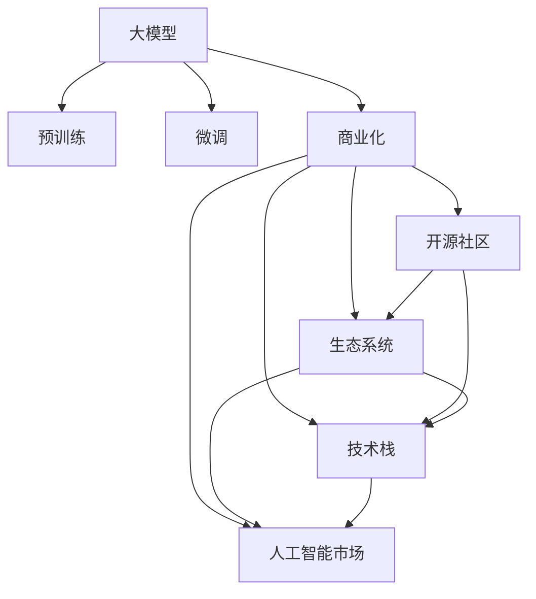

                 

# 大模型产业化:新商业模式和生态系统

> 关键词：大模型, 工业化, 商业化, 开源社区, 生态系统, 技术栈, 人工智能市场, 创新与竞争

## 1. 背景介绍

### 1.1 问题由来
近年来，随着深度学习技术的飞速发展，人工智能(AI)正日益成为引领新一轮科技革命和产业变革的关键驱动力。尤其是在自然语言处理(NLP)、计算机视觉(CV)、语音识别(Speech Recognition)等领域，大模型（Large Models）的应用已经取得了突破性的进展。大模型通过大规模预训练（Pre-training）学习到海量的知识，能够在无需大量标注数据的情况下，进行各种自然语言处理任务。

然而，尽管大模型在技术层面取得了突破，但其产业化的过程却相对滞后。如何将大模型技术转化为大规模工业应用，创造商业价值，是当前AI领域亟需解决的核心问题。本文旨在探讨大模型产业化的新商业模式和生态系统，分析大模型产业化所面临的机遇与挑战，并展望未来发展趋势。

## 2. 核心概念与联系

### 2.1 核心概念概述

- **大模型(Large Models)**：指通过在大规模无标签数据上进行预训练，学习到广泛知识的人工智能模型。常用的有大语言模型（如BERT、GPT-3）和大型计算机视觉模型（如ResNet、ViT）。
- **预训练(Pre-training)**：指在无标签数据上对模型进行训练，学习到通用的知识表示。
- **微调(Fine-tuning)**：指在预训练模型的基础上，使用下游任务的少量标注数据进行有监督训练，提升模型在该任务上的性能。
- **商业化(Commercialization)**：指将AI技术转化为商业产品或服务，形成可操作的商业模式。
- **开源社区(Open Source Community)**：指围绕AI开源项目和代码的开发和使用的社区，促进技术共享和创新。
- **生态系统(Ecosystem)**：指由硬件、软件、服务、人才等要素构成的综合系统，支持AI技术的持续发展和应用。
- **技术栈(Technical Stack)**：指在特定应用场景下，所需的技术组件和工具链，包括模型、框架、库、服务等。
- **人工智能市场(AI Market)**：指AI技术的商业化和应用市场，涵盖各类AI产品和服务。
- **创新与竞争(Competition and Innovation)**：指在AI技术发展中，各类公司、研究机构和开发者之间的技术创新和市场竞争。

这些概念之间相互关联，构成了一个复杂而动态的AI产业生态。通过理解这些核心概念，我们可以更好地把握大模型产业化过程中面临的关键问题。

### 2.2 核心概念原理和架构的 Mermaid 流程图(Mermaid 流程节点中不要有括号、逗号等特殊字符)



此流程图展示了大模型从预训练到商业化的全流程，以及其在开源社区、生态系统、技术栈和人工智能市场中的互动关系。

## 3. 核心算法原理 & 具体操作步骤
### 3.1 算法原理概述

大模型的产业化涉及多个层面的算法和技术，包括模型训练、微调、部署、优化等。其中，微调和部署是产业化过程中的两个关键环节：

- **微调**：在预训练模型的基础上，使用下游任务的少量标注数据进行有监督训练，提升模型在该任务上的性能。微调是实现大模型商业化应用的核心步骤。
- **部署**：将训练好的模型部署到生产环境中，进行实时推理和服务调用。部署的效率和稳定性直接影响用户体验和商业模式可持续性。

### 3.2 算法步骤详解

1. **预训练模型选择与定制**：根据应用场景需求，选择合适的预训练模型，并进行必要的定制化修改。
2. **数据准备与标注**：收集和准备训练数据，并根据任务需求进行标注。标注数据应尽可能覆盖不同的应用场景，以保证模型泛化能力。
3. **微调模型训练**：使用标注数据训练模型，调整模型参数以适应特定任务。微调应采用合理的学习率和优化器，避免过拟合。
4. **模型评估与调优**：在验证集上评估模型性能，根据评估结果调整模型参数，进行模型调优。
5. **模型部署与监控**：将训练好的模型部署到生产环境中，进行实时推理。同时，实时监控模型性能和资源消耗，确保系统稳定性和性能。

### 3.3 算法优缺点

大模型的微调和部署算法具有以下优点：
- **高效性**：使用预训练模型进行微调，能够在少量标注数据下快速提升模型性能，缩短研发周期。
- **可扩展性**：模型可以按需进行扩展，支持多任务、多模型的组合使用，提高资源利用率。
- **稳定性**：预训练模型经过大量数据训练，具有较好的稳定性和鲁棒性。

同时，也存在一些缺点：
- **数据依赖**：微调效果依赖于标注数据的质量和数量，标注数据获取成本较高。
- **资源需求**：大模型的训练和推理对硬件资源有较高要求，尤其是GPU、TPU等高性能设备。
- **模型更新**：随着数据分布的变化，模型需要定期重新微调，增加了维护成本。

### 3.4 算法应用领域

大模型微调和部署技术广泛应用于各类NLP、CV、语音识别等任务，具体应用领域包括但不限于：

- **智能客服**：使用微调后的对话模型进行客户咨询的自动回复。
- **金融风控**：使用微调后的文本分类模型进行舆情监测和风险评估。
- **医疗诊断**：使用微调后的文本生成模型辅助医生进行诊断和治疗建议。
- **智能安防**：使用微调后的视觉识别模型进行人脸识别和行为分析。
- **自动驾驶**：使用微调后的视觉感知模型辅助无人车进行环境理解和决策。
- **智能推荐**：使用微调后的推荐模型进行个性化物品推荐。
- **智能家居**：使用微调后的语音识别模型进行语音交互和场景控制。

## 4. 数学模型和公式 & 详细讲解 & 举例说明（备注：数学公式请使用latex格式，latex嵌入文中独立段落使用 $$，段落内使用 $)
### 4.1 数学模型构建

大模型的产业化过程中，需要构建一系列数学模型来描述模型训练、微调和部署的各个环节。

以语言模型为例，常见的模型包括：

1. **语言模型(语言生成模型)**：用于预测给定文本序列的概率分布，常用于文本生成任务。
2. **序列到序列模型(Seq2Seq)**：用于将输入序列映射到输出序列，常用于翻译、摘要等任务。
3. **序列标注模型(Sequence Labeling)**：用于对文本序列中的每个元素进行标注，常用于命名实体识别、情感分析等任务。
4. **知识图谱嵌入模型**：用于将知识图谱中的实体和关系映射到低维向量空间，常用于知识推理和推荐任务。

这些模型均基于深度学习框架（如TensorFlow、PyTorch）构建，通过定义损失函数和优化器，进行模型训练和微调。

### 4.2 公式推导过程

以序列标注模型为例，其目标是将输入文本序列$x = (x_1, x_2, \dots, x_n)$标注为输出序列$y = (y_1, y_2, \dots, y_n)$，其中$y_i \in \mathcal{Y}$，$\mathcal{Y}$为标注空间。

假设模型输出为$h_t = f(h_{t-1}, x_t)$，其中$h_t$为模型在时间$t$的状态，$f$为模型状态更新函数。定义交叉熵损失函数为：

$$
\mathcal{L} = -\sum_{i=1}^n \log p(y_i|h_i)
$$

其中$p(y_i|h_i)$为模型在时间$i$预测$y_i$的条件概率。

### 4.3 案例分析与讲解

以情感分析任务为例，使用BERT模型进行情感分类：

1. **数据准备**：收集电影评论文本和对应情感标签，将文本和标签划分为训练集和测试集。
2. **预训练模型加载**：加载预训练的BERT模型，并根据任务需求进行微调。
3. **模型训练**：使用训练集进行有监督训练，优化模型参数。
4. **模型评估**：在测试集上评估模型性能，使用准确率、召回率等指标进行评估。
5. **模型部署**：将训练好的模型部署到生产环境中，进行实时情感分析。

## 5. 项目实践：代码实例和详细解释说明
### 5.1 开发环境搭建

- **Python环境配置**：安装Anaconda，创建虚拟环境，安装必要的依赖库，如TensorFlow、PyTorch、transformers等。
- **数据准备**：收集并准备训练数据，进行文本清洗和标注。
- **模型训练**：加载预训练模型，定义训练循环，进行模型训练。
- **模型评估**：在测试集上评估模型性能，调整模型参数。
- **模型部署**：将训练好的模型部署到生产环境中，进行实时推理。

### 5.2 源代码详细实现

以BERT情感分类模型为例，代码实现如下：

```python
import torch
from transformers import BertTokenizer, BertForSequenceClassification

# 加载预训练模型和tokenizer
model = BertForSequenceClassification.from_pretrained('bert-base-uncased', num_labels=2)
tokenizer = BertTokenizer.from_pretrained('bert-base-uncased')

# 数据预处理
def preprocess(text):
    tokens = tokenizer.encode_plus(text, add_special_tokens=True, max_length=512, return_tensors='pt')
    return tokens['input_ids'], tokens['attention_mask']

# 模型训练
device = torch.device('cuda') if torch.cuda.is_available() else torch.device('cpu')
model.to(device)

# 定义损失函数和优化器
loss_fn = torch.nn.CrossEntropyLoss()
optimizer = torch.optim.Adam(model.parameters(), lr=1e-5)

# 训练循环
for epoch in range(5):
    for batch in train_loader:
        input_ids, attention_mask, labels = batch
        input_ids, attention_mask = input_ids.to(device), attention_mask.to(device)
        labels = labels.to(device)
        
        # 前向传播
        outputs = model(input_ids, attention_mask=attention_mask)
        logits = outputs[0]
        loss = loss_fn(logits, labels)
        
        # 反向传播和参数更新
        optimizer.zero_grad()
        loss.backward()
        optimizer.step()
        
        # 输出训练结果
        print(f"Epoch {epoch+1}, loss: {loss.item()}")

# 模型评估
model.eval()
with torch.no_grad():
    correct = 0
    total = 0
    for batch in test_loader:
        input_ids, attention_mask, labels = batch
        input_ids, attention_mask = input_ids.to(device), attention_mask.to(device)
        labels = labels.to(device)
        
        # 前向传播
        outputs = model(input_ids, attention_mask=attention_mask)
        logits = outputs[0]
        _, predicted = torch.max(logits, dim=1)
        total += labels.size(0)
        correct += (predicted == labels).sum().item()
        
    print(f"Accuracy: {correct/total * 100}%")
```

### 5.3 代码解读与分析

- **数据预处理**：使用BertTokenizer对文本进行分词和编码，得到模型所需的输入张量和掩码。
- **模型训练**：在训练循环中，将模型、损失函数和优化器进行定义，并在每个epoch中对模型进行前向传播、损失计算和反向传播。
- **模型评估**：在测试集上评估模型性能，计算准确率。
- **模型部署**：将训练好的模型部署到生产环境中，使用TorchServe等工具进行模型推理。

## 6. 实际应用场景
### 6.1 智能客服系统

智能客服系统是大模型产业化的一个重要应用场景。通过微调BERT等预训练模型，构建智能客服系统，能够实现7x24小时自动应答，提升客户咨询体验和问题解决效率。

### 6.2 金融舆情监测

金融舆情监测是大模型在金融领域的重要应用之一。使用BERT等模型对金融舆情进行情感分析和主题分类，能够实时监测市场舆情，帮助金融机构及时发现风险点，进行风险预警。

### 6.3 医疗诊断辅助

医疗诊断辅助是大模型在医疗领域的重要应用之一。通过微调BERT等模型，能够辅助医生进行疾病诊断和治疗方案推荐，提高医疗服务质量和效率。

### 6.4 智能推荐系统

智能推荐系统是大模型在电商和社交平台的重要应用之一。通过微调BERT等模型，能够实现个性化推荐，提升用户体验和平台黏性。

### 6.5 智能安防

智能安防是大模型在公共安全领域的重要应用之一。通过微调BERT等模型，能够实现人脸识别、行为分析和异常检测，提高公共安全水平。

## 7. 工具和资源推荐
### 7.1 学习资源推荐

- **TensorFlow官方文档**：提供完整的TensorFlow框架和API文档，帮助开发者快速上手和深入学习。
- **PyTorch官方文档**：提供完整的PyTorch框架和API文档，帮助开发者快速上手和深入学习。
- **HuggingFace官方文档**：提供完整的Transformers库和预训练模型文档，帮助开发者进行模型微调和应用。
- **《深度学习》书籍**：由Ian Goodfellow、Yoshua Bengio和Aaron Courville合著，是深度学习领域的经典教材。
- **《深度学习与自然语言处理》课程**：斯坦福大学开设的NLP明星课程，提供视频和配套作业，帮助开发者系统学习NLP知识。

### 7.2 开发工具推荐

- **TensorBoard**：TensorFlow配套的可视化工具，用于实时监测模型训练状态和性能。
- **TensorFlow-Serving**：TensorFlow的模型部署工具，支持多种模型格式和推理引擎。
- **Jupyter Notebook**：交互式的Python开发环境，支持代码编写、数据可视化、模型训练等。
- **HuggingFace Transformers库**：提供预训练模型和微调API，支持多种NLP任务的开发。
- **Keras**：基于TensorFlow和Theano的高层API，提供易用的模型构建和训练接口。

### 7.3 相关论文推荐

- **Attention is All You Need**：Transformer原论文，提出自注意力机制，开启大模型的时代。
- **BERT: Pre-training of Deep Bidirectional Transformers for Language Understanding**：提出BERT预训练模型，刷新多项NLP任务SOTA。
- **Parameter-Efficient Transfer Learning for NLP**：提出Adapter等参数高效微调方法，提高微调效率。
- **Fine-tuning Methods for Continual Learning**：提出Fine-tuning方法，提升模型的持续学习和泛化能力。
- **Composing Questions and Passages for Consistent Multimodal Knowledge Graph Inference**：提出知识图谱嵌入模型，用于多模态知识推理。

## 8. 总结：未来发展趋势与挑战

### 8.1 研究成果总结

大模型的产业化是一个复杂而动态的过程，涉及模型训练、微调、部署等多个环节。本文从算法原理、具体操作和应用实践等多个角度，系统地介绍了大模型的产业化过程。通过分析当前产业化的成功案例和存在的问题，为未来的产业化提供参考和指导。

### 8.2 未来发展趋势

未来大模型的产业化将呈现以下趋势：

- **规模化部署**：大模型将在更多行业和领域得到应用，形成规模化的商业应用。
- **开源化**：开源社区将进一步发展，推动大模型的共享和创新。
- **商业化创新**：更多的商业模式和技术栈将出现，推动大模型的市场化进程。
- **技术融合**：大模型将与其他AI技术进行深度融合，形成更加综合的解决方案。
- **跨界应用**：大模型将在更多领域得到应用，推动产业升级和创新。

### 8.3 面临的挑战

大模型的产业化在取得一定成果的同时，也面临诸多挑战：

- **数据获取成本高**：标注数据获取成本较高，限制了微调效果的提升。
- **模型资源需求高**：大模型对硬件资源需求较高，制约了模型的推广和应用。
- **算法复杂性高**：大模型的训练和微调过程复杂，需要高水平的算法和工程能力。
- **应用场景限制**：大模型在一些特定领域的应用效果有限，需要进一步优化和适应。
- **伦理和安全问题**：大模型的应用涉及伦理和安全问题，需要谨慎处理。

### 8.4 研究展望

未来大模型的产业化需要从多个方面进行研究和创新：

- **数据获取与标注**：探索无监督和半监督微调方法，降低标注数据的需求。
- **模型优化与部署**：开发更高效的模型训练和推理算法，提高模型的部署效率和稳定性。
- **跨界融合与创新**：推动大模型与其他AI技术进行深度融合，形成更加综合的解决方案。
- **伦理与安全**：加强对大模型的伦理和安全研究，确保模型应用的安全和合规性。

## 9. 附录：常见问题与解答

**Q1：大模型产业化过程中的数据获取有哪些方法？**

A: 大模型产业化过程中，数据获取可以通过以下方法：
- **公开数据集**：利用已有的公开数据集进行模型微调，如GLUE、CoNLL等。
- **企业数据**：收集企业内部的历史数据，进行定制化微调。
- **众包数据**：利用众包平台收集用户生成内容，进行标注和微调。
- **爬虫技术**：使用爬虫技术获取网络上的数据，进行清洗和标注。

**Q2：大模型产业化过程中需要注意哪些问题？**

A: 大模型产业化过程中需要注意以下问题：
- **数据隐私和安全**：确保数据隐私和安全，防止数据泄露和滥用。
- **模型性能评估**：设计合适的模型评估指标，进行模型性能评估。
- **模型部署与监控**：确保模型部署和推理性能，进行实时监控和维护。
- **用户反馈与迭代**：收集用户反馈，进行模型迭代和优化。
- **法律合规性**：确保模型应用符合法律法规和行业规范。

**Q3：大模型产业化过程中如何确保模型公平性和公正性？**

A: 大模型产业化过程中，确保模型公平性和公正性需要从以下几个方面入手：
- **数据平衡**：确保训练数据中各类样本均衡分布，防止模型出现偏见。
- **公平性评估**：设计公平性评估指标，评估模型的公平性表现。
- **公平性优化**：通过数据增强、算法优化等方法，提高模型的公平性。
- **公平性监控**：实时监控模型输出，防止模型出现偏见和歧视。

**Q4：大模型产业化过程中如何确保模型安全性和稳定性？**

A: 大模型产业化过程中，确保模型安全性和稳定性需要从以下几个方面入手：
- **安全审计**：定期进行安全审计，检测模型漏洞和安全隐患。
- **安全防护**：加强安全防护措施，防止恶意攻击和数据泄露。
- **稳定监控**：实时监控模型性能，防止模型失效和异常。
- **容错机制**：设计容错机制，提高系统的稳定性和鲁棒性。

---

作者：禅与计算机程序设计艺术 / Zen and the Art of Computer Programming

