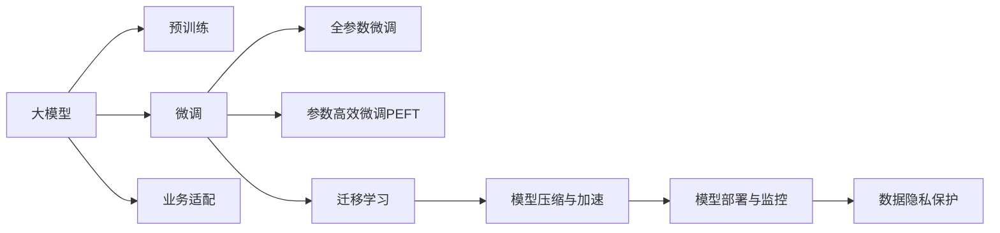

                 

# 大模型应用落地加速，AI商业化进程提速

## 1. 背景介绍

### 1.1 问题由来

近年来，随着深度学习技术的快速发展，人工智能(AI)技术在商业化进程中取得了显著的进展。然而，将大模型应用于实际业务场景，仍面临诸多挑战。这些问题主要包括：

1. **模型训练成本高**：大规模大模型训练需要强大的计算资源和大量数据，这对于多数企业来说是不可承受之重。
2. **模型部署复杂**：大模型通常具有庞大的参数和复杂的结构，部署到生产环境需要大量的硬件和软件资源。
3. **数据隐私与合规**：大模型通常依赖于大量用户数据进行训练，如何在保障数据隐私的同时合规使用数据是一个重要问题。
4. **模型性能不稳定性**：大模型在实际应用中可能会因环境、数据等因素的影响，导致性能波动，影响业务稳定性。
5. **模型解释性与可控性**：大模型的决策过程往往是"黑盒"的，缺乏可解释性，难以满足高风险业务对模型可控性的需求。

为了应对这些挑战，加速AI技术的商业化落地，本文将详细介绍如何通过大模型的微调(Fine-tuning)和参数高效微调(Parameter-Efficient Fine-tuning, PEFT)技术，将预训练模型的强大能力转化为实际业务价值，同时降低成本、提高效率、保障隐私和稳定性能。

## 2. 核心概念与联系

### 2.1 核心概念概述

为了更好地理解如何加速大模型应用落地，本文将介绍几个核心概念：

- **大模型(Large Models)**：指的是具有大规模参数和复杂结构的深度学习模型，如BERT、GPT系列等。这些模型通常是通过在大规模无标签数据上进行预训练，学习到通用的语言或图像表示。
- **微调(Fine-tuning)**：指的是在预训练模型基础上，通过有监督的学习方式，优化模型在特定任务上的性能。通常只需调整模型的一小部分参数，以适应具体业务需求。
- **参数高效微调(PEFT)**：与传统全参数微调不同，PEFT仅微调模型的一部分参数，保持大部分预训练权重不变，以降低计算成本和避免过拟合。
- **迁移学习(Transfer Learning)**：通过在大规模无标签数据上进行预训练，然后在特定任务上微调，利用已有的知识提高模型性能。
- **模型压缩与加速**：通过模型剪枝、量化、模型蒸馏等技术，减少模型参数量，加速模型推理速度。
- **模型部署与监控**：将模型部署到生产环境，并进行实时监控，确保模型稳定运行和性能优化。
- **数据隐私保护**：通过差分隐私、联邦学习等技术，保护用户数据隐私，合规使用用户数据。

这些核心概念共同构成了大模型应用落地的基本框架，通过深入理解这些概念及其相互关系，可以帮助开发者更好地设计和实现大模型的落地应用。

### 2.2 核心概念原理和架构的 Mermaid 流程图(Mermaid 流程节点中不要有括号、逗号等特殊字符)



这个流程图展示了从大模型的预训练到应用落地的整体流程，以及各环节的相互联系和依赖关系。

## 3. 核心算法原理 & 具体操作步骤

### 3.1 算法原理概述

大模型应用落地的核心是微调和参数高效微调技术。微调是指在预训练模型基础上，通过有监督学习，优化模型在特定任务上的性能。参数高效微调则是在微调过程中，仅微调部分参数，保持大部分预训练权重不变，以降低计算成本和避免过拟合。

基于大模型的微调算法原理如下：

1. **数据准备**：收集并准备用于微调的任务数据集，并将其划分为训练集、验证集和测试集。
2. **任务适配**：根据具体任务，设计并添加任务适配层，如分类器、解码器等，以适应任务需求。
3. **模型初始化**：将预训练模型作为初始化参数，即模型的参数初始值。
4. **优化器选择**：选择适当的优化算法，如Adam、SGD等，并设置学习率、批大小、迭代轮数等超参数。
5. **模型训练**：在训练集上，使用优化算法和任务适配层，对模型进行优化，最小化任务损失函数。
6. **模型评估**：在验证集上评估模型性能，防止过拟合，根据评估结果调整超参数。
7. **模型测试**：在测试集上评估模型性能，确认模型在实际应用中的表现。
8. **模型部署**：将优化后的模型部署到生产环境，并进行实时监控和维护。

### 3.2 算法步骤详解

以下是基于大模型的微调和参数高效微调的详细步骤：

#### 3.2.1 数据准备

1. **数据收集**：收集与目标任务相关的标注数据，数据量需足够多以覆盖任务的所有场景。
2. **数据处理**：对数据进行清洗、标准化等预处理，确保数据质量。
3. **数据划分**：将数据集划分为训练集、验证集和测试集，用于模型的训练、调参和性能评估。

#### 3.2.2 任务适配

1. **任务定义**：明确任务的定义和目标，如分类、回归、生成等。
2. **适配层设计**：根据任务类型，设计合适的适配层，如添加分类头、解码器等。
3. **损失函数选择**：根据任务类型，选择适当的损失函数，如交叉熵、均方误差等。

#### 3.2.3 模型初始化

1. **加载预训练模型**：使用HuggingFace等工具库，加载预训练模型，如BERT、GPT等。
2. **任务适配层添加**：在预训练模型顶层添加任务适配层。

#### 3.2.4 优化器选择

1. **优化器选择**：选择合适的优化器，如Adam、SGD等，并设置学习率、批大小、迭代轮数等超参数。
2. **超参数调整**：根据任务需求和数据特性，调整超参数，以获得最佳性能。

#### 3.2.5 模型训练

1. **模型训练**：使用训练集数据，对模型进行优化，最小化任务损失函数。
2. **学习率调整**：根据验证集上的性能表现，调整学习率，防止过拟合。
3. **模型评估**：在验证集上评估模型性能，防止过拟合。

#### 3.2.6 模型测试

1. **模型测试**：使用测试集数据，评估模型性能。
2. **结果分析**：分析测试结果，确认模型是否满足实际应用需求。

#### 3.2.7 模型部署

1. **模型压缩与加速**：使用模型压缩、量化等技术，优化模型大小和推理速度。
2. **模型部署**：将模型部署到生产环境，如AWS、Google Cloud等云平台。
3. **实时监控**：对模型进行实时监控，确保模型稳定运行。

#### 3.2.8 数据隐私保护

1. **差分隐私**：使用差分隐私技术，保护用户数据隐私。
2. **联邦学习**：使用联邦学习技术，在不共享用户数据的情况下，进行模型训练和优化。

### 3.3 算法优缺点

基于大模型的微调和参数高效微调技术具有以下优点：

1. **计算成本低**：仅微调模型的一部分参数，保持大部分预训练权重不变，大幅降低计算成本。
2. **泛化能力强**：利用预训练模型的强大能力，可以在少量数据上获得不错的性能。
3. **业务适配性高**：通过任务适配层设计，可以灵活适配各类业务需求。
4. **稳定性高**：通过合理设计任务适配层和优化器，可以有效防止过拟合，提高模型稳定性。

然而，这些技术也存在一些缺点：

1. **模型解释性差**：微调后的模型通常是"黑盒"系统，难以解释其决策过程。
2. **数据依赖性强**：微调效果依赖于标注数据的数量和质量，数据获取成本较高。
3. **泛化能力有限**：微调模型面对不同领域的数据时，泛化能力可能不足。
4. **维护成本高**：模型部署到生产环境后，需要进行实时监控和维护，维护成本较高。

## 4. 数学模型和公式 & 详细讲解 & 举例说明

### 4.1 数学模型构建

假设我们有预训练模型 $M_{\theta}$ 和任务 $T$，其中 $\theta$ 为模型参数。在任务 $T$ 上，我们收集到 $N$ 个标注数据 $D=\{(x_i,y_i)\}_{i=1}^N$，其中 $x_i$ 为输入数据，$y_i$ 为标注标签。我们的目标是通过微调优化模型参数，使其在任务 $T$ 上表现最佳。

定义任务 $T$ 上的损失函数为 $L(\theta)$，则微调的目标为最小化损失函数：

$$
\theta^* = \arg\min_{\theta} L(\theta)
$$

其中 $L(\theta)$ 可以基于不同的任务类型选择不同的损失函数，如分类任务中的交叉熵损失函数，生成任务中的负对数似然损失函数等。

### 4.2 公式推导过程

以分类任务为例，假设我们的预训练模型 $M_{\theta}$ 在输入 $x$ 上的输出为 $\hat{y}=M_{\theta}(x)$，其中 $\hat{y}$ 为模型对输入 $x$ 的预测概率分布。给定训练数据集 $D$，我们的目标是通过微调，使得模型输出与真实标签 $y$ 尽可能接近。假设损失函数为交叉熵损失函数，则有：

$$
L(\theta) = -\frac{1}{N} \sum_{i=1}^N \sum_{k=1}^K y_i \log M_{\theta}(x_i,k)
$$

其中 $K$ 为类别数，$k$ 为类别编号。对于每个样本 $(x_i,y_i)$，损失函数 $L_i(\theta)$ 可写为：

$$
L_i(\theta) = -y_i \log M_{\theta}(x_i,y_i) - (1-y_i) \log (1-M_{\theta}(x_i,y_i))
$$

通过反向传播算法，计算损失函数对模型参数 $\theta$ 的梯度，使用优化算法（如Adam）更新模型参数：

$$
\theta \leftarrow \theta - \eta \nabla_{\theta} L(\theta)
$$

其中 $\eta$ 为学习率。

### 4.3 案例分析与讲解

以BERT模型在文本分类任务上的微调为例：

1. **任务定义**：文本分类任务是将输入文本分类为预定义的类别，如新闻分类、情感分析等。
2. **数据准备**：收集与任务相关的标注数据，如新闻文章及其分类标签。
3. **模型初始化**：加载预训练的BERT模型，并添加线性分类器。
4. **优化器选择**：使用Adam优化器，设置学习率为 $2e-5$。
5. **模型训练**：在训练集上，对模型进行优化，最小化交叉熵损失函数。
6. **模型测试**：在验证集和测试集上评估模型性能，使用准确率、精确率、召回率等指标。
7. **模型部署**：将优化后的模型部署到生产环境，进行实时监控和维护。

## 5. 项目实践：代码实例和详细解释说明

### 5.1 开发环境搭建

以下是使用PyTorch和Transformers库搭建开发环境的步骤：

1. **安装Anaconda**：从官网下载并安装Anaconda，用于创建独立的Python环境。
2. **创建并激活虚拟环境**：
```bash
conda create -n pytorch-env python=3.8 
conda activate pytorch-env
```
3. **安装PyTorch**：根据CUDA版本，从官网获取对应的安装命令。例如：
```bash
conda install pytorch torchvision torchaudio cudatoolkit=11.1 -c pytorch -c conda-forge
```
4. **安装Transformers库**：
```bash
pip install transformers
```
5. **安装各类工具包**：
```bash
pip install numpy pandas scikit-learn matplotlib tqdm jupyter notebook ipython
```

### 5.2 源代码详细实现

以下是一个简单的代码示例，展示了如何使用PyTorch和Transformers库对BERT模型进行文本分类任务的微调：

```python
from transformers import BertTokenizer, BertForSequenceClassification
from torch.utils.data import Dataset, DataLoader
from torch import nn, optim
from tqdm import tqdm
from sklearn.metrics import accuracy_score

# 数据准备
class TextDataset(Dataset):
    def __init__(self, texts, labels, tokenizer, max_len):
        self.texts = texts
        self.labels = labels
        self.tokenizer = tokenizer
        self.max_len = max_len
        
    def __len__(self):
        return len(self.texts)
    
    def __getitem__(self, idx):
        text = self.texts[idx]
        label = self.labels[idx]
        encoding = self.tokenizer(text, max_length=self.max_len, padding='max_length', truncation=True)
        input_ids = encoding['input_ids']
        attention_mask = encoding['attention_mask']
        return {'input_ids': input_ids, 'attention_mask': attention_mask, 'labels': label}

# 模型初始化
model = BertForSequenceClassification.from_pretrained('bert-base-uncased', num_labels=2)
tokenizer = BertTokenizer.from_pretrained('bert-base-uncased')
max_len = 512

# 优化器设置
optimizer = optim.Adam(model.parameters(), lr=2e-5)
device = 'cuda' if torch.cuda.is_available() else 'cpu'

# 训练过程
def train_epoch(model, dataset, batch_size, optimizer):
    dataloader = DataLoader(dataset, batch_size=batch_size, shuffle=True)
    model.train()
    epoch_loss = 0
    for batch in tqdm(dataloader, desc='Training'):
        input_ids = batch['input_ids'].to(device)
        attention_mask = batch['attention_mask'].to(device)
        labels = batch['labels'].to(device)
        model.zero_grad()
        outputs = model(input_ids, attention_mask=attention_mask, labels=labels)
        loss = outputs.loss
        epoch_loss += loss.item()
        loss.backward()
        optimizer.step()
    return epoch_loss / len(dataloader)

# 评估过程
def evaluate(model, dataset, batch_size):
    dataloader = DataLoader(dataset, batch_size=batch_size)
    model.eval()
    preds, labels = [], []
    with torch.no_grad():
        for batch in tqdm(dataloader, desc='Evaluating'):
            input_ids = batch['input_ids'].to(device)
            attention_mask = batch['attention_mask'].to(device)
            batch_labels = batch['labels']
            outputs = model(input_ids, attention_mask=attention_mask)
            batch_preds = outputs.logits.argmax(dim=1).to('cpu').tolist()
            batch_labels = batch_labels.to('cpu').tolist()
            for pred, label in zip(batch_preds, batch_labels):
                preds.append(pred)
                labels.append(label)
    accuracy = accuracy_score(labels, preds)
    print(f'Accuracy: {accuracy:.4f}')

# 训练与评估
train_dataset = TextDataset(train_texts, train_labels, tokenizer, max_len)
dev_dataset = TextDataset(dev_texts, dev_labels, tokenizer, max_len)
test_dataset = TextDataset(test_texts, test_labels, tokenizer, max_len)

epochs = 5
batch_size = 16

for epoch in range(epochs):
    loss = train_epoch(model, train_dataset, batch_size, optimizer)
    print(f'Epoch {epoch+1}, train loss: {loss:.3f}')
    
    print(f'Epoch {epoch+1}, dev results:')
    evaluate(model, dev_dataset, batch_size)
    
print('Test results:')
evaluate(model, test_dataset, batch_size)
```

### 5.3 代码解读与分析

在上述代码中，我们首先定义了一个 `TextDataset` 类，用于处理文本数据。然后，加载了预训练的BERT模型，并设置了优化器和超参数。在训练过程中，我们使用了 `train_epoch` 函数来更新模型参数，使用 `evaluate` 函数来评估模型性能。最后，在测试集上评估模型性能。

通过这段代码，我们可以快速上手使用BERT模型进行文本分类任务的微调，并且可以根据具体任务进行灵活调整。

## 6. 实际应用场景

### 6.1 智能客服系统

智能客服系统是人工智能在企业服务中的重要应用之一。通过微调BERT模型，可以构建高效、智能的客服系统，提升客户服务质量，降低人工成本。具体实现步骤如下：

1. **数据收集**：收集企业历史客服聊天记录，标记用户意图和问题类型。
2. **任务适配**：根据客服任务需求，设计适配层和损失函数。
3. **模型微调**：使用历史聊天记录对模型进行微调，提高对客户意图的理解和回答准确性。
4. **部署与监控**：将微调后的模型部署到生产环境，进行实时监控和维护。

### 6.2 金融舆情监测

金融舆情监测是金融行业风险管理的重要手段。通过微调BERT模型，可以实时监测金融市场舆情，预测市场走势，及时应对潜在的金融风险。具体实现步骤如下：

1. **数据收集**：收集金融领域相关的新闻、评论、社交媒体等数据。
2. **任务适配**：根据金融舆情监测需求，设计适配层和损失函数。
3. **模型微调**：使用金融舆情数据对模型进行微调，提升对舆情事件的识别和分析能力。
4. **部署与监控**：将微调后的模型部署到金融系统，进行实时监控和维护。

### 6.3 个性化推荐系统

个性化推荐系统是电商、新闻、视频等领域的重要应用。通过微调BERT模型，可以构建更智能、更个性化的推荐系统，提升用户体验，增加业务转化率。具体实现步骤如下：

1. **数据收集**：收集用户浏览、点击、评论、分享等行为数据。
2. **任务适配**：根据推荐任务需求，设计适配层和损失函数。
3. **模型微调**：使用行为数据对模型进行微调，提升推荐系统的个性化和精准度。
4. **部署与监控**：将微调后的模型部署到推荐系统，进行实时监控和维护。

## 7. 工具和资源推荐

### 7.1 学习资源推荐

1. **《Transformer from the Inside Out》系列博文**：详细介绍了Transformer和BERT模型的原理和实现，适合入门学习和进阶理解。
2. **CS224N《深度学习自然语言处理》课程**：斯坦福大学开设的NLP明星课程，涵盖了NLP的基本概念和前沿技术。
3. **《Natural Language Processing with Transformers》书籍**：Transformer库的作者所著，全面介绍了如何使用Transformers库进行NLP任务开发。
4. **HuggingFace官方文档**：Transformers库的官方文档，提供了海量预训练模型和微调样例代码。
5. **CLUE开源项目**：中文语言理解测评基准，包含大量不同类型的中文NLP数据集，并提供了基于微调的baseline模型。

### 7.2 开发工具推荐

1. **PyTorch**：基于Python的开源深度学习框架，灵活动态的计算图，适合快速迭代研究。
2. **TensorFlow**：由Google主导开发的开源深度学习框架，生产部署方便，适合大规模工程应用。
3. **Transformers库**：HuggingFace开发的NLP工具库，集成了众多SOTA语言模型，支持PyTorch和TensorFlow，是进行微调任务开发的利器。
4. **Weights & Biases**：模型训练的实验跟踪工具，可以记录和可视化模型训练过程中的各项指标。
5. **TensorBoard**：TensorFlow配套的可视化工具，可实时监测模型训练状态，并提供丰富的图表呈现方式。
6. **Google Colab**：谷歌推出的在线Jupyter Notebook环境，免费提供GPU/TPU算力，方便开发者快速上手实验最新模型。

### 7.3 相关论文推荐

1. **Attention is All You Need**：提出了Transformer结构，开启了NLP领域的预训练大模型时代。
2. **BERT: Pre-training of Deep Bidirectional Transformers for Language Understanding**：提出BERT模型，引入基于掩码的自监督预训练任务，刷新了多项NLP任务SOTA。
3. **Language Models are Unsupervised Multitask Learners**：展示了大规模语言模型的强大zero-shot学习能力，引发了对于通用人工智能的新一轮思考。
4. **Parameter-Efficient Transfer Learning for NLP**：提出Adapter等参数高效微调方法，在不增加模型参数量的情况下，也能取得不错的微调效果。
5. **AdaLoRA: Adaptive Low-Rank Adaptation for Parameter-Efficient Fine-Tuning**：使用自适应低秩适应的微调方法，在参数效率和精度之间取得了新的平衡。
6. **Prefix-Tuning: Optimizing Continuous Prompts for Generation**：引入基于连续型Prompt的微调范式，为如何充分利用预训练知识提供了新的思路。

这些论文代表了大模型微调技术的发展脉络，通过学习这些前沿成果，可以帮助研究者把握学科前进方向，激发更多的创新灵感。

## 8. 总结：未来发展趋势与挑战

### 8.1 总结

本文详细介绍了大模型微调及其参数高效微调技术的原理和实践方法，并通过实例展示了其在实际应用中的效果。通过微调和参数高效微调，我们可以将大模型的强大能力转化为业务价值，同时降低计算成本、提高效率、保障隐私和稳定性能。大模型微调技术已经在多个领域得到了应用，展示了其在商业化落地中的广阔前景。

### 8.2 未来发展趋势

展望未来，大模型微调技术将呈现以下几个发展趋势：

1. **模型规模持续增大**：随着算力成本的下降和数据规模的扩张，预训练语言模型的参数量还将持续增长。超大规模语言模型蕴含的丰富语言知识，有望支撑更加复杂多变的下游任务微调。
2. **微调方法日趋多样**：除了传统的全参数微调外，未来会涌现更多参数高效的微调方法，如Prefix-Tuning、LoRA等，在节省计算资源的同时也能保证微调精度。
3. **持续学习成为常态**：随着数据分布的不断变化，微调模型也需要持续学习新知识以保持性能。如何在不遗忘原有知识的同时，高效吸收新样本信息，将成为重要的研究课题。
4. **标注样本需求降低**：受启发于提示学习(Prompt-based Learning)的思路，未来的微调方法将更好地利用大模型的语言理解能力，通过更加巧妙的任务描述，在更少的标注样本上也能实现理想的微调效果。
5. **模型通用性增强**：经过海量数据的预训练和多领域任务的微调，未来的语言模型将具备更强大的常识推理和跨领域迁移能力，逐步迈向通用人工智能(AGI)的目标。

### 8.3 面临的挑战

尽管大模型微调技术已经取得了瞩目成就，但在迈向更加智能化、普适化应用的过程中，它仍面临着诸多挑战：

1. **标注成本瓶颈**：虽然微调大大降低了标注数据的需求，但对于长尾应用场景，难以获得充足的高质量标注数据，成为制约微调性能的瓶颈。如何进一步降低微调对标注样本的依赖，将是一大难题。
2. **模型鲁棒性不足**：当前微调模型面对域外数据时，泛化性能往往大打折扣。对于测试样本的微小扰动，微调模型的预测也容易发生波动。如何提高微调模型的鲁棒性，避免灾难性遗忘，还需要更多理论和实践的积累。
3. **推理效率有待提高**：大规模语言模型虽然精度高，但在实际部署时往往面临推理速度慢、内存占用大等效率问题。如何在保证性能的同时，简化模型结构，提升推理速度，优化资源占用，将是重要的优化方向。
4. **可解释性亟需加强**：当前微调模型更像是"黑盒"系统，难以解释其内部工作机制和决策逻辑。对于医疗、金融等高风险业务，算法的可解释性和可控性尤为重要。如何赋予微调模型更强的可解释性，将是亟待攻克的难题。
5. **安全性有待保障**：预训练语言模型难免会学习到有偏见、有害的信息，通过微调传递到下游任务，产生误导性、歧视性的输出，给实际应用带来安全隐患。如何从数据和算法层面消除模型偏见，避免恶意用途，确保输出的安全性，也将是重要的研究课题。

### 8.4 研究展望

面对大模型微调所面临的种种挑战，未来的研究需要在以下几个方面寻求新的突破：

1. **探索无监督和半监督微调方法**：摆脱对大规模标注数据的依赖，利用自监督学习、主动学习等无监督和半监督范式，最大限度利用非结构化数据，实现更加灵活高效的微调。
2. **研究参数高效和计算高效的微调范式**：开发更加参数高效的微调方法，在固定大部分预训练参数的同时，只更新极少量的任务相关参数。同时优化微调模型的计算图，减少前向传播和反向传播的资源消耗，实现更加轻量级、实时性的部署。
3. **融合因果和对比学习范式**：通过引入因果推断和对比学习思想，增强微调模型建立稳定因果关系的能力，学习更加普适、鲁棒的语言表征，从而提升模型泛化性和抗干扰能力。
4. **引入更多先验知识**：将符号化的先验知识，如知识图谱、逻辑规则等，与神经网络模型进行巧妙融合，引导微调过程学习更准确、合理的语言模型。同时加强不同模态数据的整合，实现视觉、语音等多模态信息与文本信息的协同建模。
5. **结合因果分析和博弈论工具**：将因果分析方法引入微调模型，识别出模型决策的关键特征，增强输出解释的因果性和逻辑性。借助博弈论工具刻画人机交互过程，主动探索并规避模型的脆弱点，提高系统稳定性。
6. **纳入伦理道德约束**：在模型训练目标中引入伦理导向的评估指标，过滤和惩罚有偏见、有害的输出倾向。同时加强人工干预和审核，建立模型行为的监管机制，确保输出符合人类价值观和伦理道德。

这些研究方向的探索，必将引领大语言模型微调技术迈向更高的台阶，为构建安全、可靠、可解释、可控的智能系统铺平道路。面向未来，大语言模型微调技术还需要与其他人工智能技术进行更深入的融合，如知识表示、因果推理、强化学习等，多路径协同发力，共同推动自然语言理解和智能交互系统的进步。只有勇于创新、敢于突破，才能不断拓展语言模型的边界，让智能技术更好地造福人类社会。

## 9. 附录：常见问题与解答

**Q1：大模型微调是否适用于所有NLP任务？**

A: 大模型微调在大多数NLP任务上都能取得不错的效果，特别是对于数据量较小的任务。但对于一些特定领域的任务，如医学、法律等，仅仅依靠通用语料预训练的模型可能难以很好地适应。此时需要在特定领域语料上进一步预训练，再进行微调，才能获得理想效果。此外，对于一些需要时效性、个性化很强的任务，如对话、推荐等，微调方法也需要针对性的改进优化。

**Q2：微调过程中如何选择合适的学习率？**

A: 微调的学习率一般要比预训练时小1-2个数量级，如果使用过大的学习率，容易破坏预训练权重，导致过拟合。一般建议从1e-5开始调参，逐步减小学习率，直至收敛。也可以使用warmup策略，在开始阶段使用较小的学习率，再逐渐过渡到预设值。需要注意的是，不同的优化器(如AdamW、Adafactor等)以及不同的学习率调度策略，可能需要设置不同的学习率阈值。

**Q3：采用大模型微调时会面临哪些资源瓶颈？**

A: 目前主流的预训练大模型动辄以亿计的参数规模，对算力、内存、存储都提出了很高的要求。GPU/TPU等高性能设备是必不可少的，但即便如此，超大批次的训练和推理也可能遇到显存不足的问题。因此需要采用一些资源优化技术，如梯度积累、混合精度训练、模型并行等，来突破硬件瓶颈。同时，模型的存储和读取也可能占用大量时间和空间，需要采用模型压缩、稀疏化存储等方法进行优化。

**Q4：如何缓解微调过程中的过拟合问题？**

A: 过拟合是微调面临的主要挑战，尤其是在标注数据不足的情况下。常见的缓解策略包括：
1. 数据增强：通过回译、近义替换等方式扩充训练集
2. 正则化：使用L2正则、Dropout、Early Stopping等避免过拟合
3. 对抗训练：引入对抗样本，提高模型鲁棒性
4. 参数高效微调：只调整少量参数(如Adapter、Prefix等)，减小过拟合风险
5. 多模型集成：训练多个微调模型，取平均输出，抑制过拟合

这些策略往往需要根据具体任务和数据特点进行灵活组合。只有在数据、模型、训练、推理等各环节进行全面优化，才能最大限度地发挥大模型微调的威力。

**Q5：微调模型在落地部署时需要注意哪些问题？**

A: 将微调模型转化为实际应用，还需要考虑以下因素：
1. 模型裁剪：去除不必要的层和参数，减小模型尺寸，加快推理速度
2. 量化加速：将浮点模型转为定点模型，压缩存储空间，提高计算效率
3. 服务化封装：将模型封装为标准化服务接口，便于集成调用
4. 弹性伸缩：根据请求流量动态调整资源配置，平衡服务质量和成本
5. 监控告警：实时采集系统指标，设置异常告警阈值，确保服务稳定性
6. 安全防护：采用访问鉴权、数据脱敏等措施，保障数据和模型安全

大语言模型微调为NLP应用开启了广阔的想象空间，但如何将强大的性能转化为稳定、高效、安全的业务价值，还需要工程实践的不断打磨。唯有从数据、算法、工程、业务等多个维度协同发力，才能真正实现人工智能技术在垂直行业的规模化落地。总之，微调需要开发者根据具体任务，不断迭代和优化模型、数据和算法，方能得到理想的效果。

