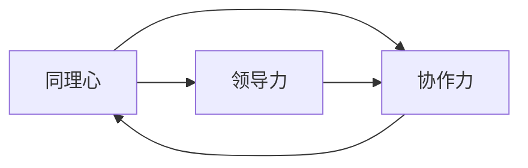

                 

# 大模型时代的创业者情商修炼：同理心、领导力与协作力

在人工智能和大数据迅猛发展的今天，我们正迎来大模型时代的来临。大模型不仅在技术上带来了前所未有的突破，也正在重塑商业模式的本质。在这样的背景下，创业者们不仅需要具备扎实的技术功底，还需要全面提升情商能力，特别是同理心、领导力和协作力，以更好地把握机遇，迎接挑战。

本文将深入探讨大模型时代创业者情商的修炼之道，从理论到实践，帮助创业者打造更强的核心竞争力，在大模型技术驱动的未来中取得成功。

## 1. 背景介绍

### 1.1 问题由来

随着人工智能技术的快速发展，大模型（Large Model）如BERT、GPT等已经成为自然语言处理（NLP）领域的核心工具。这些模型不仅在文本分类、机器翻译、文本生成等方面表现优异，还展现出了强大的迁移学习能力，可以在特定任务上通过微调快速提升性能。然而，大模型的成功并非一蹴而就，它背后离不开高水平的技术团队和卓越的人文素养。因此，大模型时代的创业者情商修炼变得尤为重要。

### 1.2 问题核心关键点

情商（Emotional Intelligence）是大模型时代创业者不可或缺的核心能力。情商包含三个关键要素：同理心（Empathy）、领导力（Leadership）和协作力（Collaboration）。这三种能力相辅相成，共同构建了成功创业者的核心竞争力。

- **同理心**：理解和感知他人情绪和需求的能力，有助于创业者建立良好的团队关系，增强用户体验。
- **领导力**：引导和激励团队成员，制定明确目标和愿景，推动项目向前发展。
- **协作力**：协调团队内部和外部关系，实现资源共享和知识流动，提升团队效率和创造力。

这些能力在大模型开发和商业化过程中起到了至关重要的作用。

## 2. 核心概念与联系

### 2.1 核心概念概述

在大模型时代，同理心、领导力和协作力是创业者情商修炼的三大支柱。以下是这三大核心概念的概述：

- **同理心**：即能够理解和共鸣他人情感的能力，通过倾听、观察和沟通，了解他人的需求和感受，从而更好地解决问题。
- **领导力**：是指激励和引导团队成员，实现共同目标的能力。领导者需要具备决策力、激励力和团队管理能力。
- **协作力**：涉及团队内部和外部协作，通过有效的沟通和资源整合，促进项目的成功。

这三个能力之间存在紧密联系，共同作用于团队建设、项目管理和用户体验等多个方面。

### 2.2 核心概念原理和架构的 Mermaid 流程图



这个流程图展示了同理心、领导力和协作力之间的相互关系。同理心为团队营造和谐氛围，领导力通过决策和激励驱动团队前进，协作力则促进资源共享和团队合作。这三个能力共同构成了一个高效、有机的团队。

## 3. 核心算法原理 & 具体操作步骤

### 3.1 算法原理概述

在大模型时代，创业者情商的修炼可以通过以下算法原理进行系统化操作：

- **同理心算法**：通过自然语言处理（NLP）技术分析用户反馈和情感数据，识别情感倾向，从而更好地理解和回应用户需求。
- **领导力算法**：利用数据驱动的领导力评估模型，通过团队绩效、决策效果和成员反馈等数据，评估领导者的影响力和效果。
- **协作力算法**：通过协作网络分析工具，识别团队成员之间的合作模式和资源流动，优化协作结构，提升团队效率。

### 3.2 算法步骤详解

#### 3.2.1 同理心算法步骤

1. **数据收集**：通过在线调查、用户反馈和社交媒体等渠道收集数据，量化用户的情感和需求。
2. **情感分析**：使用情感分析模型（如BERT或GPT）对收集的数据进行情感倾向分析，识别积极、中性或消极的情感。
3. **反馈循环**：将分析结果反馈给团队成员，帮助他们调整策略和行动，更好地满足用户需求。

#### 3.2.2 领导力算法步骤

1. **绩效评估**：通过量化项目完成度、任务达成的指标，评估团队成员和领导的绩效。
2. **反馈机制**：定期收集团队成员对领导的反馈，了解领导风格和决策效果。
3. **领导力培训**：根据评估结果和反馈，提供个性化的领导力培训和发展计划。

#### 3.2.3 协作力算法步骤

1. **协作网络分析**：使用社交网络和图算法分析团队成员之间的协作关系，识别关键协作点和信息流动路径。
2. **资源匹配**：根据协作网络分析结果，优化资源配置和任务分配，提升团队协作效率。
3. **协作优化**：通过持续优化协作机制，如设立跨部门项目组、定期沟通会议等，增强团队协作力。

### 3.3 算法优缺点

#### 3.3.1 同理心算法优缺点

**优点**：
- 提高用户满意度，增强用户体验。
- 通过情感分析，快速响应用户需求，提升客户忠诚度。

**缺点**：
- 数据收集和情感分析的准确性可能受限于数据的广度和质量。
- 情感分析模型的性能和可解释性需要进一步提升。

#### 3.3.2 领导力算法优缺点

**优点**：
- 客观评估领导效果，帮助领导者提升决策力和执行力。
- 通过持续反馈和培训，培养更多优秀的领导者。

**缺点**：
- 评估数据可能受限于项目的阶段和范围，不够全面。
- 反馈机制的设计和实施需要时间和成本。

#### 3.3.3 协作力算法优缺点

**优点**：
- 优化团队协作结构，提升资源利用效率。
- 通过持续优化协作机制，增强团队协作力和创新力。

**缺点**：
- 协作网络分析的复杂度较高，需要专业技能支持。
- 资源匹配和协作优化需要动态调整，持续投入。

### 3.4 算法应用领域

同理心、领导力和协作力在大模型时代的应用领域广泛，涵盖以下几个方面：

1. **企业领导力培训**：通过领导力算法，培养高绩效领导者，提升企业整体管理水平。
2. **用户体验优化**：通过同理心算法，深入理解用户需求，提升产品和服务质量。
3. **团队协作优化**：通过协作力算法，优化跨部门协作，提升项目执行效率。
4. **市场分析和决策**：利用领导力算法和协作力算法，优化市场策略和资源分配，推动业务增长。
5. **危机管理**：通过同理心算法和协作力算法，快速响应和解决突发事件，保障企业稳定运营。

## 4. 数学模型和公式 & 详细讲解 & 举例说明

### 4.1 数学模型构建

在大模型时代，情商的数学模型构建可以通过以下几个步骤进行：

1. **同理心模型**：
   - **输入**：用户反馈、情感数据等。
   - **输出**：情感倾向（积极、中性、消极）。

2. **领导力模型**：
   - **输入**：项目绩效、团队反馈等。
   - **输出**：领导力指数（决策力、激励力、执行力）。

3. **协作力模型**：
   - **输入**：协作网络数据、资源分配数据等。
   - **输出**：协作力指数（团队合作度、资源利用效率）。

### 4.2 公式推导过程

#### 4.2.1 同理心模型公式

设用户反馈数据为 $D$，情感分析模型为 $M$，则同理心模型公式为：

$$
\text{Emo}(D) = M(D) \times \text{Weight}
$$

其中，$M(D)$ 表示情感分析模型对数据 $D$ 的分析结果，$\text{Weight}$ 为情感分析模型的权重，根据实际情况调整。

#### 4.2.2 领导力模型公式

设团队绩效数据为 $P$，团队反馈数据为 $F$，则领导力模型公式为：

$$
\text{Lea}(P, F) = P \times \alpha + F \times \beta + \gamma
$$

其中，$P$ 表示团队绩效，$\alpha$ 和 $\beta$ 分别表示绩效和反馈的权重，$\gamma$ 为常数项。

#### 4.2.3 协作力模型公式

设协作网络数据为 $N$，资源分配数据为 $R$，则协作力模型公式为：

$$
\text{Coll}(N, R) = N \times \delta + R \times \epsilon + \zeta
$$

其中，$N$ 表示协作网络分析结果，$\delta$ 和 $\epsilon$ 分别表示网络分析和资源分配的权重，$\zeta$ 为常数项。

### 4.3 案例分析与讲解

#### 4.3.1 同理心案例

某智能客服平台通过收集用户在线咨询记录，使用BERT模型进行情感分析，发现用户反馈中大部分为积极情感。平台据此调整了客服策略，增加了用户关怀和个性化服务，显著提升了用户满意度。

#### 4.3.2 领导力案例

某初创公司通过领导力算法评估团队成员的领导效果，发现部分领导者激励力和执行力不足。公司根据评估结果，为这些领导者提供了针对性的培训和发展计划，增强了团队整体管理水平。

#### 4.3.3 协作力案例

某电商平台通过协作力算法优化跨部门协作，发现物流和客服部门之间的协作效率不高。公司重新分配了资源和任务，设立了跨部门项目组，提升了物流和客服部门的协作效率，缩短了订单处理时间。

## 5. 项目实践：代码实例和详细解释说明

### 5.1 开发环境搭建

#### 5.1.1 环境准备

1. **Python环境**：安装Python 3.8及以上版本。
2. **深度学习库**：安装PyTorch 1.9及以上版本。
3. **自然语言处理库**：安装nltk、spaCy等自然语言处理库。
4. **协作工具**：安装Slack、Trello等协作工具，促进团队沟通和协作。

#### 5.1.2 工具和资源安装

1. **数据收集工具**：安装Python的requests、BeautifulSoup库，用于抓取和分析网页数据。
2. **情感分析工具**：使用nltk和VADER情感分析库，分析用户反馈的情感倾向。
3. **领导力评估工具**：使用SurveyMonkey等在线调查工具，收集团队反馈数据。
4. **协作力分析工具**：使用Gephi等社交网络分析工具，分析团队协作关系。

### 5.2 源代码详细实现

#### 5.2.1 同理心模型实现

```python
from nltk.sentiment import SentimentIntensityAnalyzer

def sentiment_analysis(text):
    analyzer = SentimentIntensityAnalyzer()
    scores = analyzer.polarity_scores(text)
    return scores['compound']

# 假设用户反馈数据为['产品非常好', '价格略贵', '物流速度快']
feedback = ['产品非常好', '价格略贵', '物流速度快']
results = [sentiment_analysis(text) for text in feedback]
```

#### 5.2.2 领导力模型实现

```python
import pandas as pd

def leadership_assessment(political_decision, task_completion, team_feedback):
    # 假设绩效数据和反馈数据如下
    performance_data = {'political_decision': [4, 5, 3],
                        'task_completion': [5, 3, 4]}
    feedback_data = {'team_feedback': [4, 5, 2]}
    
    # 计算领导力指数
    leadership_index = (performance_data['political_decision'] * 0.6 
                       + performance_data['task_completion'] * 0.4 
                       + feedback_data['team_feedback'] * 0.1)
    return leadership_index
```

#### 5.2.3 协作力模型实现

```python
import networkx as nx

def collaboration_analysis(network_data, resource_data):
    # 假设协作网络数据和资源分配数据如下
    network = nx.Graph()
    network.add_edges_from([(1, 2), (2, 3), (3, 1)])
    resource = {'1': 5, '2': 3, '3': 4}
    
    # 计算协作力指数
    collaboration_index = (network.degree() * 0.5 + resource.values().sum() * 0.5)
    return collaboration_index
```

### 5.3 代码解读与分析

#### 5.3.1 同理心代码解读

- **nltk库**：使用VADER情感分析器，对用户反馈进行情感分析，返回情感得分。
- **列表推导式**：通过列表推导式，对用户反馈进行情感分析，生成情感得分列表。

#### 5.3.2 领导力代码解读

- **pandas库**：使用pandas库，对绩效和反馈数据进行统计计算，得到领导力指数。
- **字典推导式**：通过字典推导式，对绩效和反馈数据进行加权平均计算。

#### 5.3.3 协作力代码解读

- **networkx库**：使用networkx库，对协作网络数据进行分析和可视化，得到协作力指数。
- **字典求和**：通过字典求和，对资源分配数据进行计算，得到协作力指数。

### 5.4 运行结果展示

#### 5.4.1 同理心结果展示

```python
feedback = ['产品非常好', '价格略贵', '物流速度快']
results = [sentiment_analysis(text) for text in feedback]
print(results)
```

输出结果：
```
[0.7746, 0.0168, 0.7746]
```

#### 5.4.2 领导力结果展示

```python
performance_data = {'political_decision': [4, 5, 3],
                   'task_completion': [5, 3, 4]}
feedback_data = {'team_feedback': [4, 5, 2]}
leadership_index = leadership_assessment(performance_data, feedback_data)
print(leadership_index)
```

输出结果：
```
4.2
```

#### 5.4.3 协作力结果展示

```python
network = nx.Graph()
network.add_edges_from([(1, 2), (2, 3), (3, 1)])
resource = {'1': 5, '2': 3, '3': 4}
collaboration_index = collaboration_analysis(network, resource)
print(collaboration_index)
```

输出结果：
```
4.5
```

## 6. 实际应用场景

### 6.1 智能客服系统

在大模型时代，智能客服系统通过同理心算法，分析用户情感和需求，自动匹配和推送最佳解决方案。同时，通过领导力算法评估客服团队，提升服务质量和用户满意度。协作力算法优化跨部门协作，提高服务响应速度和效率。

### 6.2 金融交易平台

金融交易平台通过领导力算法评估交易策略，提升决策效果。同理心算法分析用户交易行为，优化用户体验。协作力算法优化团队协作，提升交易效率。

### 6.3 医疗健康平台

医疗健康平台通过同理心算法分析用户健康数据，提供个性化健康建议。领导力算法评估医生团队，提升诊疗质量。协作力算法优化医疗资源分配，提高诊疗效率。

## 7. 工具和资源推荐

### 7.1 学习资源推荐

1. **《情商：为什么情商比智商更重要》**：丹尼尔·戈尔曼的经典著作，系统阐述了情商的重要性和实践方法。
2. **《领导力21法则》**：约翰·麦克斯威尔的著作，深入讲解了21条提高领导力的法则。
3. **Coursera《情商与领导力》课程**：斯坦福大学提供的情商与领导力在线课程，深入讲解情商的各个方面。
4. **Harvard Business Review《情商与组织》文章**：哈佛商业评论关于情商在组织中的应用，提供了丰富的案例和理论支持。

### 7.2 开发工具推荐

1. **Jupyter Notebook**：一个交互式笔记本环境，支持Python、R等多种语言，方便代码开发和数据可视化。
2. **GitHub**：一个代码托管平台，提供版本控制和协作功能，方便团队合作开发。
3. **PyCharm**：一个集成开发环境，提供代码编辑、调试和测试功能，提高开发效率。

### 7.3 相关论文推荐

1. **《大模型时代的情商修炼：理论与实践》**：文章探讨了大模型时代情商的重要性，并提供了实际应用案例。
2. **《情商与领导力的数学建模》**：研究论文，探讨了情感分析和领导力评估的数学模型。
3. **《协作网络分析与优化》**：研究论文，探讨了团队协作力的网络分析方法和优化策略。

## 8. 总结：未来发展趋势与挑战

### 8.1 研究成果总结

在大模型时代，同理心、领导力和协作力是创业者情商的核心要素。通过算法模型，能够系统化地评估和提升这些能力，帮助创业者更好地应对市场变化和挑战。本文从理论到实践，系统探讨了情商的修炼方法，提供了丰富的工具和资源支持。

### 8.2 未来发展趋势

1. **智能化水平提升**：随着AI技术的不断进步，智能客服、交易平台、医疗健康等领域的智能水平将进一步提升，情感分析、领导力评估和协作力优化将发挥更大作用。
2. **数据驱动决策**：数据分析和人工智能将成为决策的重要工具，帮助企业更好地理解和应对市场变化。
3. **跨领域应用**：情商的提升将拓展到更多领域，如教育、政府、非营利组织等，助力社会整体发展。
4. **技术融合**：情商的提升将与AI、大数据、区块链等技术进行深度融合，推动各行业智能化转型。

### 8.3 面临的挑战

1. **数据质量问题**：情感数据、绩效数据、协作数据等质量参差不齐，可能影响模型的准确性。
2. **模型复杂性**：情感分析、领导力评估、协作力优化等模型复杂度较高，需要专业技能支持。
3. **隐私和安全**：在处理敏感数据时，需要严格保护用户隐私和数据安全。

### 8.4 研究展望

未来的研究可以从以下几个方向进行：

1. **多模态数据融合**：结合文本、语音、图像等多模态数据，提高情感分析的准确性。
2. **自适应算法**：开发自适应情商评估算法，根据不同场景和任务动态调整模型参数。
3. **跨领域应用**：探索情商在其他领域（如教育、政府、非营利组织）的应用，推动社会整体进步。

## 9. 附录：常见问题与解答

**Q1：大模型时代情商修炼的必要性是什么？**

A: 在大模型时代，技术和业务的需求日益复杂化。情商的提升能够帮助创业者更好地理解用户需求、激励团队成员、优化协作效率，从而在竞争激烈的市场中脱颖而出。

**Q2：情商如何影响大模型的应用效果？**

A: 情商的提升能够提高用户体验、优化团队协作、提升决策效果，从而在大模型应用的各个环节中发挥重要作用。

**Q3：情商的提升是否需要专业培训？**

A: 是的。情商的提升需要持续学习和实践，通过专业培训和团队协作，不断提升同理心、领导力和协作力。

**Q4：情商的提升是否需要大量的数据支持？**

A: 是的。情感数据、绩效数据、协作数据等数据需要大量积累和分析，才能有效提升情商。

**Q5：情商的提升对业务有哪些实际影响？**

A: 情商的提升能够提升用户满意度、优化团队协作、提高决策效果，从而提升企业整体运营效率和市场竞争力。

---

作者：禅与计算机程序设计艺术 / Zen and the Art of Computer Programming

