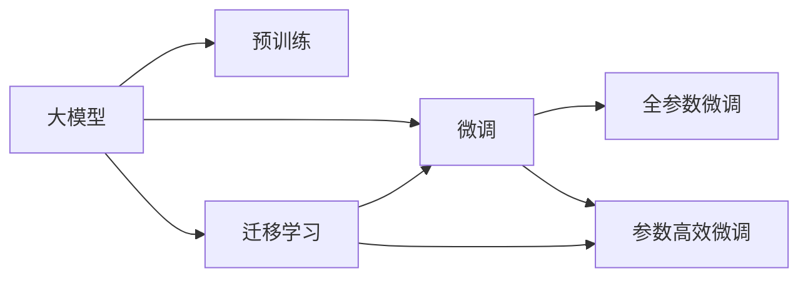

                 

## 1. 背景介绍

### 1.1 问题由来

随着深度学习和大数据技术的发展，大模型在各种领域的应用已经变得越来越广泛。从计算机视觉到自然语言处理，从自动驾驶到医疗诊断，大模型正在逐步替代传统的机器学习算法，成为推动技术进步和产业升级的重要力量。

但是，尽管大模型在许多场景中表现出色，其应用也面临着一些挑战：

1. **数据需求**：大模型通常需要大量的标注数据进行训练，这使得在某些领域（如医疗、法律等）获取高质量标注数据变得困难。
2. **计算成本**：大模型的训练和推理需要大量的计算资源，这对硬件要求较高。
3. **模型复杂度**：大模型的参数量往往极大，这增加了模型训练和推理的难度。
4. **模型泛化**：大模型在面对新任务时，往往需要重新训练，无法很好地适应新场景。

为了解决这些问题，研究者们开始探索如何在大模型上实现高效的微调（Fine-Tuning），即在不重新训练整个模型的前提下，通过少量标注数据对模型进行优化，使其能够适应特定的任务。

### 1.2 问题核心关键点

微调技术的关键在于如何平衡预训练模型的通用性和任务模型的专有性。预训练模型通过在大规模无标签数据上训练，学习到了广泛的特征表示，而微调则是将这些特征表示进一步优化，以适应特定的任务。

微调的主要步骤如下：

1. **数据准备**：收集任务的标注数据，并将数据集划分为训练集、验证集和测试集。
2. **模型选择**：选择合适的预训练模型，并将其作为微调的起点。
3. **任务适配**：根据任务类型，修改模型的输出层和损失函数，以适应特定任务。
4. **微调训练**：使用训练集对模型进行微调，并使用验证集进行调参。
5. **评估和部署**：在测试集上评估微调后的模型性能，并将其部署到实际应用中。

## 2. 核心概念与联系

### 2.1 核心概念概述

为了更好地理解大模型的微调技术，首先需要了解一些相关的核心概念：

- **大模型（Large Models）**：通常指具有大量参数的深度学习模型，如BERT、GPT等。这些模型通过在大规模无标签数据上预训练，学习到丰富的特征表示。
- **预训练（Pre-training）**：指在大规模无标签数据上训练模型，使其学习到通用的特征表示。
- **微调（Fine-Tuning）**：指在预训练模型的基础上，使用少量标注数据对模型进行优化，使其能够适应特定任务。
- **迁移学习（Transfer Learning）**：指将预训练模型在一种任务上的特征表示，迁移到另一种任务上的学习范式。

这些概念之间的联系可以通过以下Mermaid流程图来展示：



这个流程图展示了从大模型到微调的整个过程，以及各种微调方法之间的关系。

### 2.2 核心概念原理和架构

大模型通常由一个编码器和一个解码器组成，其中编码器负责将输入数据转换为特征表示，解码器则负责将特征表示转换为输出结果。在大模型中，编码器通常由Transformer等架构组成，解码器则可以是线性层、softmax层等。

在预训练阶段，大模型通过在大规模无标签数据上学习通用的特征表示。这些特征表示能够捕捉到数据中的复杂模式，从而在各种任务上取得较好的表现。

在微调阶段，研究者们通过修改大模型的输出层和损失函数，使其能够适应特定的任务。对于分类任务，输出层通常是一个softmax层，用于将特征表示映射到类别概率上。对于生成任务，则通常使用自回归模型，如GPT等。

## 3. 核心算法原理 & 具体操作步骤

### 3.1 算法原理概述

大模型微调的核心思想是利用预训练模型在无标签数据上学习到的特征表示，通过有标签数据对模型进行优化，使其能够适应特定任务。

在微调过程中，研究者们通常会将预训练模型的参数固定，只对模型输出层或解码器的参数进行优化。这不仅能够避免破坏预训练模型的特征表示，还能够降低微调过程中的计算复杂度。

### 3.2 算法步骤详解

以下是微调的主要操作步骤：

1. **数据准备**：收集任务的标注数据，并将数据集划分为训练集、验证集和测试集。
2. **模型选择**：选择合适的预训练模型，并将其作为微调的起点。
3. **任务适配**：根据任务类型，修改模型的输出层和损失函数，以适应特定任务。
4. **微调训练**：使用训练集对模型进行微调，并使用验证集进行调参。
5. **评估和部署**：在测试集上评估微调后的模型性能，并将其部署到实际应用中。

### 3.3 算法优缺点

大模型微调的主要优点包括：

- **高效性**：微调可以通过少量标注数据进行优化，减少了数据收集和标注的成本。
- **泛化能力**：预训练模型通常具有较好的泛化能力，能够在新任务上取得较好的表现。
- **可解释性**：微调后的模型通常更加可解释，研究者们可以更容易地理解模型的决策过程。

但同时也存在一些缺点：

- **数据需求**：微调需要一定的标注数据，这对于某些领域（如医疗、法律等）可能难以满足。
- **计算成本**：微调需要一定的计算资源，对于一些硬件设备较为有限的场景可能不适用。
- **模型复杂度**：大模型本身较为复杂，微调过程需要一定的技术积累。

### 3.4 算法应用领域

大模型微调技术已经在多个领域得到了广泛的应用，例如：

- **计算机视觉**：在图像分类、目标检测、图像分割等任务中，微调大模型可以取得较好的效果。
- **自然语言处理**：在情感分析、文本分类、机器翻译等任务中，微调大模型可以提升模型的性能。
- **医疗**：在医学影像分析、病理诊断等任务中，微调大模型可以辅助医生的诊断决策。
- **金融**：在风险评估、股票预测等任务中，微调大模型可以提供更为准确的市场分析。

## 4. 数学模型和公式 & 详细讲解 & 举例说明

### 4.1 数学模型构建

在微调过程中，研究者们通常会构建一个损失函数，用于衡量模型在特定任务上的表现。常见的损失函数包括交叉熵损失、均方误差损失等。

假设模型的输入为 $x$，输出为 $y$，则交叉熵损失函数可以表示为：

$$
L(x, y) = -\sum_{i=1}^n y_i \log \hat{y}_i
$$

其中 $\hat{y}_i$ 为模型预测的概率分布。

### 4.2 公式推导过程

在大模型微调过程中，研究者们通常会使用梯度下降算法对模型进行优化。梯度下降算法的基本思想是通过计算损失函数对模型参数的梯度，逐步调整模型参数，使得损失函数最小化。

假设模型的参数为 $\theta$，则梯度下降算法的更新公式可以表示为：

$$
\theta = \theta - \alpha \nabla L(\theta)
$$

其中 $\alpha$ 为学习率，$\nabla L(\theta)$ 为损失函数对模型参数的梯度。

### 4.3 案例分析与讲解

以图像分类任务为例，我们可以使用预训练的ResNet模型作为微调的起点。在微调过程中，研究者们需要修改模型的输出层和损失函数，以适应图像分类任务。假设输出层为一个softmax层，则微调的损失函数可以表示为：

$$
L(x, y) = -\sum_{i=1}^n y_i \log \hat{y}_i
$$

其中 $y_i$ 为图像的真实标签，$\hat{y}_i$ 为模型预测的概率分布。

## 5. 项目实践：代码实例和详细解释说明

### 5.1 开发环境搭建

在进行微调实践前，需要准备好开发环境。以下是使用Python进行PyTorch开发的环境配置流程：

1. 安装Anaconda：从官网下载并安装Anaconda，用于创建独立的Python环境。
2. 创建并激活虚拟环境：
```bash
conda create -n pytorch-env python=3.8 
conda activate pytorch-env
```

3. 安装PyTorch：根据CUDA版本，从官网获取对应的安装命令。例如：
```bash
conda install pytorch torchvision torchaudio cudatoolkit=11.1 -c pytorch -c conda-forge
```

4. 安装Transformers库：
```bash
pip install transformers
```

5. 安装各类工具包：
```bash
pip install numpy pandas scikit-learn matplotlib tqdm jupyter notebook ipython
```

完成上述步骤后，即可在`pytorch-env`环境中开始微调实践。

### 5.2 源代码详细实现

以下是一个使用PyTorch进行图像分类微调的示例代码：

```python
from transformers import ResNetModel, AdamW

# 加载预训练模型
model = ResNetModel.from_pretrained('resnet50')

# 修改输出层为分类层
num_classes = 10
model.fc = nn.Linear(model.fc.in_features, num_classes)

# 定义损失函数
criterion = nn.CrossEntropyLoss()

# 定义优化器
optimizer = AdamW(model.parameters(), lr=2e-5)

# 加载训练数据
train_data = ...
train_loader = ...

# 加载验证数据
val_data = ...
val_loader = ...

# 加载测试数据
test_data = ...
test_loader = ...

# 训练过程
for epoch in range(num_epochs):
    # 训练
    model.train()
    for images, labels in train_loader:
        optimizer.zero_grad()
        outputs = model(images)
        loss = criterion(outputs, labels)
        loss.backward()
        optimizer.step()

    # 验证
    model.eval()
    with torch.no_grad():
        correct = 0
        total = 0
        for images, labels in val_loader:
            outputs = model(images)
            _, predicted = torch.max(outputs.data, 1)
            total += labels.size(0)
            correct += (predicted == labels).sum().item()

    print(f'Epoch {epoch+1}, validation accuracy: {correct/total * 100:.2f}%')

# 测试过程
model.eval()
with torch.no_grad():
    correct = 0
    total = 0
    for images, labels in test_loader:
        outputs = model(images)
        _, predicted = torch.max(outputs.data, 1)
        total += labels.size(0)
        correct += (predicted == labels).sum().item()

print(f'Test accuracy: {correct/total * 100:.2f}%')
```

### 5.3 代码解读与分析

在上述代码中，我们首先加载了预训练的ResNet模型，并将其输出层修改为分类层。然后定义了交叉熵损失函数和AdamW优化器，用于微调过程。接下来，我们加载了训练数据、验证数据和测试数据，并在训练过程中不断调整模型参数，以最小化损失函数。最后，在验证集和测试集上评估了微调后的模型性能。

## 6. 实际应用场景

### 6.1 智能医疗

在大模型微调技术中，智能医疗领域的应用尤为广泛。医疗影像分析、病理诊断、患者风险评估等任务中，研究者们可以使用微调后的模型来辅助医生的诊断决策，提高医疗服务的效率和准确性。

以医学影像分析为例，研究者们可以使用预训练的ResNet模型，将其输出层修改为分类层，并使用特定的医学影像数据进行微调。微调后的模型可以自动识别出影像中的病变区域，并给出相应的诊断结果。

### 6.2 自动驾驶

自动驾驶领域中，大模型微调技术也得到了广泛应用。自动驾驶系统需要实时处理大量的传感器数据，并做出决策。通过微调大模型，可以提升自动驾驶系统的鲁棒性和准确性。

研究者们可以使用预训练的卷积神经网络模型，如ResNet、Inception等，将其输出层修改为分类层或回归层，并使用自动驾驶数据进行微调。微调后的模型可以自动识别出道路标志、行人、车辆等目标，并做出相应的驾驶决策。

### 6.3 智能客服

在智能客服领域，大模型微调技术可以提升客户服务体验。传统客服系统需要大量人力，且无法提供24小时服务。通过微调大模型，可以构建智能客服系统，实现自动回答客户咨询，提升服务效率和质量。

研究者们可以使用预训练的语言模型，如BERT、GPT等，将其输出层修改为分类层或回归层，并使用历史客服数据进行微调。微调后的模型可以自动理解客户咨询内容，并给出相应的回答。

## 7. 工具和资源推荐

### 7.1 学习资源推荐

为了帮助开发者系统掌握大模型微调技术，这里推荐一些优质的学习资源：

1. 《深度学习理论与实践》系列博文：由深度学习专家撰写，深入浅出地介绍了深度学习的基本理论和实践技巧。
2. 《自然语言处理与深度学习》课程：斯坦福大学开设的NLP课程，涵盖了自然语言处理的基本概念和深度学习模型。
3. 《深度学习实战》书籍：详细介绍了深度学习模型的构建、训练和优化，适合实战学习。
4. HuggingFace官方文档：Transformer库的官方文档，提供了丰富的预训练模型和微调样例代码。
5. CLUE开源项目：中文语言理解测评基准，涵盖大量不同类型的中文NLP数据集，并提供了基于微调的baseline模型。

通过对这些资源的学习实践，相信你一定能够快速掌握大模型微调技术的精髓，并用于解决实际的NLP问题。

### 7.2 开发工具推荐

高效的开发离不开优秀的工具支持。以下是几款用于大模型微调开发的常用工具：

1. PyTorch：基于Python的开源深度学习框架，灵活动态的计算图，适合快速迭代研究。
2. TensorFlow：由Google主导开发的开源深度学习框架，生产部署方便，适合大规模工程应用。
3. Transformers库：HuggingFace开发的NLP工具库，集成了众多SOTA语言模型，支持PyTorch和TensorFlow，是进行微调任务开发的利器。
4. Weights & Biases：模型训练的实验跟踪工具，可以记录和可视化模型训练过程中的各项指标，方便对比和调优。
5. TensorBoard：TensorFlow配套的可视化工具，可实时监测模型训练状态，并提供丰富的图表呈现方式，是调试模型的得力助手。
6. Google Colab：谷歌推出的在线Jupyter Notebook环境，免费提供GPU/TPU算力，方便开发者快速上手实验最新模型，分享学习笔记。

合理利用这些工具，可以显著提升大模型微调任务的开发效率，加快创新迭代的步伐。

### 7.3 相关论文推荐

大模型微调技术的发展源于学界的持续研究。以下是几篇奠基性的相关论文，推荐阅读：

1. Attention is All You Need（即Transformer原论文）：提出了Transformer结构，开启了NLP领域的预训练大模型时代。
2. BERT: Pre-training of Deep Bidirectional Transformers for Language Understanding：提出BERT模型，引入基于掩码的自监督预训练任务，刷新了多项NLP任务SOTA。
3. Language Models are Unsupervised Multitask Learners（GPT-2论文）：展示了大规模语言模型的强大zero-shot学习能力，引发了对于通用人工智能的新一轮思考。
4. Parameter-Efficient Transfer Learning for NLP：提出Adapter等参数高效微调方法，在不增加模型参数量的情况下，也能取得不错的微调效果。
5. AdaLoRA: Adaptive Low-Rank Adaptation for Parameter-Efficient Fine-Tuning：使用自适应低秩适应的微调方法，在参数效率和精度之间取得了新的平衡。
6. Prompt-based Transfer Learning: A Survey and A Future Vision：总结了基于提示的微调方法，展望了未来发展的方向。

这些论文代表了大模型微调技术的发展脉络。通过学习这些前沿成果，可以帮助研究者把握学科前进方向，激发更多的创新灵感。

## 8. 总结：未来发展趋势与挑战

### 8.1 总结

本文对大模型的微调技术进行了全面系统的介绍。首先阐述了大模型和微调技术的研究背景和意义，明确了微调在拓展预训练模型应用、提升下游任务性能方面的独特价值。其次，从原理到实践，详细讲解了微调的数学原理和关键步骤，给出了微调任务开发的完整代码实例。同时，本文还广泛探讨了微调方法在智能医疗、自动驾驶、智能客服等多个领域的应用前景，展示了微调范式的巨大潜力。最后，本文精选了微调技术的各类学习资源，力求为读者提供全方位的技术指引。

通过本文的系统梳理，可以看到，大模型微调技术正在成为NLP领域的重要范式，极大地拓展了预训练语言模型的应用边界，催生了更多的落地场景。受益于大规模语料的预训练，微调模型以更低的时间和标注成本，在小样本条件下也能取得不错的效果，有力推动了NLP技术的产业化进程。未来，伴随预训练语言模型和微调方法的持续演进，相信NLP技术将在更广阔的应用领域大放异彩。

### 8.2 未来发展趋势

展望未来，大模型微调技术将呈现以下几个发展趋势：

1. 模型规模持续增大。随着算力成本的下降和数据规模的扩张，预训练语言模型的参数量还将持续增长。超大规模语言模型蕴含的丰富语言知识，有望支撑更加复杂多变的下游任务微调。
2. 微调方法日趋多样。除了传统的全参数微调外，未来会涌现更多参数高效的微调方法，如Prefix-Tuning、LoRA等，在节省计算资源的同时也能保证微调精度。
3. 持续学习成为常态。随着数据分布的不断变化，微调模型也需要持续学习新知识以保持性能。如何在不遗忘原有知识的同时，高效吸收新样本信息，将成为重要的研究课题。
4. 标注样本需求降低。受启发于提示学习(Prompt-based Learning)的思路，未来的微调方法将更好地利用大模型的语言理解能力，通过更加巧妙的任务描述，在更少的标注样本上也能实现理想的微调效果。
5. 多模态微调崛起。当前的微调主要聚焦于纯文本数据，未来会进一步拓展到图像、视频、语音等多模态数据微调。多模态信息的融合，将显著提升语言模型对现实世界的理解和建模能力。
6. 模型通用性增强。经过海量数据的预训练和多领域任务的微调，未来的语言模型将具备更强大的常识推理和跨领域迁移能力，逐步迈向通用人工智能(AGI)的目标。

以上趋势凸显了大模型微调技术的广阔前景。这些方向的探索发展，必将进一步提升NLP系统的性能和应用范围，为人类认知智能的进化带来深远影响。

### 8.3 面临的挑战

尽管大模型微调技术已经取得了瞩目成就，但在迈向更加智能化、普适化应用的过程中，它仍面临着诸多挑战：

1. 标注成本瓶颈。虽然微调大大降低了标注数据的需求，但对于长尾应用场景，难以获得充足的高质量标注数据，成为制约微调性能的瓶颈。如何进一步降低微调对标注样本的依赖，将是一大难题。
2. 模型鲁棒性不足。当前微调模型面对域外数据时，泛化性能往往大打折扣。对于测试样本的微小扰动，微调模型的预测也容易发生波动。如何提高微调模型的鲁棒性，避免灾难性遗忘，还需要更多理论和实践的积累。
3. 推理效率有待提高。大规模语言模型虽然精度高，但在实际部署时往往面临推理速度慢、内存占用大等效率问题。如何在保证性能的同时，简化模型结构，提升推理速度，优化资源占用，将是重要的优化方向。
4. 可解释性亟需加强。当前微调模型更像是"黑盒"系统，难以解释其内部工作机制和决策逻辑。对于医疗、金融等高风险应用，算法的可解释性和可审计性尤为重要。如何赋予微调模型更强的可解释性，将是亟待攻克的难题。
5. 安全性有待保障。预训练语言模型难免会学习到有偏见、有害的信息，通过微调传递到下游任务，产生误导性、歧视性的输出，给实际应用带来安全隐患。如何从数据和算法层面消除模型偏见，避免恶意用途，确保输出的安全性，也将是重要的研究课题。
6. 知识整合能力不足。现有的微调模型往往局限于任务内数据，难以灵活吸收和运用更广泛的先验知识。如何让微调过程更好地与外部知识库、规则库等专家知识结合，形成更加全面、准确的信息整合能力，还有很大的想象空间。

正视微调面临的这些挑战，积极应对并寻求突破，将是大模型微调走向成熟的必由之路。相信随着学界和产业界的共同努力，这些挑战终将一一被克服，大模型微调必将在构建人机协同的智能时代中扮演越来越重要的角色。

### 8.4 研究展望

面对大模型微调所面临的种种挑战，未来的研究需要在以下几个方面寻求新的突破：

1. 探索无监督和半监督微调方法。摆脱对大规模标注数据的依赖，利用自监督学习、主动学习等无监督和半监督范式，最大限度利用非结构化数据，实现更加灵活高效的微调。
2. 研究参数高效和计算高效的微调范式。开发更加参数高效的微调方法，在固定大部分预训练参数的同时，只更新极少量的任务相关参数。同时优化微调模型的计算图，减少前向传播和反向传播的资源消耗，实现更加轻量级、实时性的部署。
3. 融合因果和对比学习范式。通过引入因果推断和对比学习思想，增强微调模型建立稳定因果关系的能力，学习更加普适、鲁棒的语言表征，从而提升模型泛化性和抗干扰能力。
4. 引入更多先验知识。将符号化的先验知识，如知识图谱、逻辑规则等，与神经网络模型进行巧妙融合，引导微调过程学习更准确、合理的语言模型。同时加强不同模态数据的整合，实现视觉、语音等多模态信息与文本信息的协同建模。
5. 结合因果分析和博弈论工具。将因果分析方法引入微调模型，识别出模型决策的关键特征，增强输出解释的因果性和逻辑性。借助博弈论工具刻画人机交互过程，主动探索并规避模型的脆弱点，提高系统稳定性。
6. 纳入伦理道德约束。在模型训练目标中引入伦理导向的评估指标，过滤和惩罚有偏见、有害的输出倾向。同时加强人工干预和审核，建立模型行为的监管机制，确保输出符合人类价值观和伦理道德。

这些研究方向的探索，必将引领大模型微调技术迈向更高的台阶，为构建安全、可靠、可解释、可控的智能系统铺平道路。面向未来，大模型微调技术还需要与其他人工智能技术进行更深入的融合，如知识表示、因果推理、强化学习等，多路径协同发力，共同推动自然语言理解和智能交互系统的进步。只有勇于创新、敢于突破，才能不断拓展语言模型的边界，让智能技术更好地造福人类社会。

## 9. 附录：常见问题与解答

**Q1：大模型微调是否适用于所有NLP任务？**

A: 大模型微调在大多数NLP任务上都能取得不错的效果，特别是对于数据量较小的任务。但对于一些特定领域的任务，如医学、法律等，仅仅依靠通用语料预训练的模型可能难以很好地适应。此时需要在特定领域语料上进一步预训练，再进行微调，才能获得理想效果。此外，对于一些需要时效性、个性化很强的任务，如对话、推荐等，微调方法也需要针对性的改进优化。

**Q2：微调过程中如何选择合适的学习率？**

A: 微调的学习率一般要比预训练时小1-2个数量级，如果使用过大的学习率，容易破坏预训练权重，导致过拟合。一般建议从1e-5开始调参，逐步减小学习率，直至收敛。也可以使用warmup策略，在开始阶段使用较小的学习率，再逐渐过渡到预设值。需要注意的是，不同的优化器(如AdamW、Adafactor等)以及不同的学习率调度策略，可能需要设置不同的学习率阈值。

**Q3：采用大模型微调时会面临哪些资源瓶颈？**

A: 目前主流的预训练大模型动辄以亿计的参数规模，对算力、内存、存储都提出了很高的要求。GPU/TPU等高性能设备是必不可少的，但即便如此，超大批次的训练和推理也可能遇到显存不足的问题。因此需要采用一些资源优化技术，如梯度积累、混合精度训练、模型并行等，来突破硬件瓶颈。同时，模型的存储和读取也可能占用大量时间和空间，需要采用模型压缩、稀疏化存储等方法进行优化。

**Q4：如何缓解微调过程中的过拟合问题？**

A: 过拟合是微调面临的主要挑战，尤其是在标注数据不足的情况下。常见的缓解策略包括：
1. 数据增强：通过回译、近义替换等方式扩充训练集
2. 正则化：使用L2正则、Dropout、Early Stopping等避免过拟合
3. 对抗训练：引入对抗样本，提高模型鲁棒性
4. 参数高效微调：只调整少量参数(如Adapter、Prefix等)，减小过拟合风险
5. 多模型集成：训练多个微调模型，取平均输出，抑制过拟合

这些策略往往需要根据具体任务和数据特点进行灵活组合。只有在数据、模型、训练、推理等各环节进行全面优化，才能最大限度地发挥大模型微调的威力。

**Q5：微调模型在落地部署时需要注意哪些问题？**

A: 将微调模型转化为实际应用，还需要考虑以下因素：
1. 模型裁剪：去除不必要的层和参数，减小模型尺寸，加快推理速度
2. 量化加速：将浮点模型转为定点模型，压缩存储空间，提高计算效率
3. 服务化封装：将模型封装为标准化服务接口，便于集成调用
4. 弹性伸缩：根据请求流量动态调整资源配置，平衡服务质量和成本
5. 监控告警：实时采集系统指标，设置异常告警阈值，确保服务稳定性
6. 安全防护：采用访问鉴权、数据脱敏等措施，保障数据和模型安全

大模型微调为NLP应用开启了广阔的想象空间，但如何将强大的性能转化为稳定、高效、安全的业务价值，还需要工程实践的不断打磨。唯有从数据、算法、工程、业务等多个维度协同发力，才能真正实现人工智能技术在垂直行业的规模化落地。总之，微调需要开发者根据具体任务，不断迭代和优化模型、数据和算法，方能得到理想的效果。

---

作者：禅与计算机程序设计艺术 / Zen and the Art of Computer Programming

