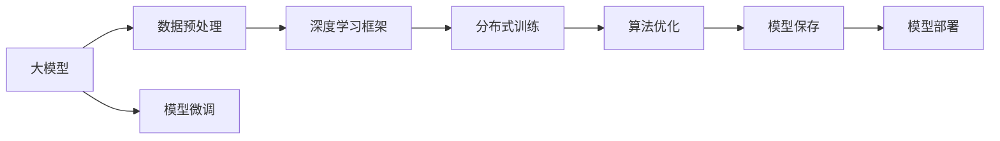

                 

# 大模型训练的技术挑战:基础设施、算法与数据处理

> 关键词：
大模型训练, 基础设施, 算法优化, 数据处理, 深度学习, 高性能计算, 分布式训练

## 1. 背景介绍

在人工智能(AI)技术快速发展的今天，大模型训练成为了实现高级人工智能应用的关键步骤。大模型（如BERT, GPT-3等）通过大量的数据和计算资源进行训练，以学习复杂的语言、图像或其他形式的表示。然而，大模型训练面临诸多挑战，包括数据预处理、算法优化和基础设施支持。本文将深入探讨这些问题，并提出解决方案，以指导未来的模型训练实践。

## 2. 核心概念与联系

### 2.1 核心概念概述

在大模型训练过程中，以下概念至关重要：

- **大模型**: 指具有数百万甚至数十亿参数的深度学习模型，用于学习复杂的数据表示。
- **深度学习**: 基于神经网络模型的学习范式，通过多层非线性映射学习数据特征。
- **分布式训练**: 使用多台计算机同时训练模型，以加速模型训练。
- **数据预处理**: 包括数据清洗、归一化、分割等步骤，确保数据质量。
- **算法优化**: 包括模型架构、损失函数、优化器等的调整，以提高模型训练效率。

### 2.2 核心概念原理和架构的 Mermaid 流程图



此流程图显示了从数据预处理到模型部署的整个大模型训练过程，其中数据预处理、深度学习框架、分布式训练、算法优化和模型微调等环节均对大模型训练的效率和效果有重要影响。

## 3. 核心算法原理 & 具体操作步骤

### 3.1 算法原理概述

大模型训练的算法原理主要包括以下几个方面：

1. **深度学习框架**: 如TensorFlow、PyTorch、MXNet等，提供了灵活的深度学习模型构建和训练功能。
2. **优化器**: 如SGD、Adam等，用于更新模型参数，以最小化损失函数。
3. **损失函数**: 如交叉熵、均方误差等，衡量模型预测与真实值之间的差异。
4. **正则化**: 如L1、L2正则化，防止过拟合。

### 3.2 算法步骤详解

1. **数据准备**: 收集并清洗数据，进行数据分割，划分训练集、验证集和测试集。
2. **模型定义**: 使用深度学习框架定义模型架构，选择合适的网络结构（如卷积神经网络CNN、循环神经网络RNN、Transformer等）。
3. **模型训练**: 在训练集上进行模型训练，使用优化器更新模型参数，最小化损失函数。
4. **验证集评估**: 在验证集上评估模型性能，避免过拟合。
5. **测试集评估**: 在测试集上评估模型性能，提供最终评估指标。
6. **模型保存与部署**: 保存训练好的模型，并部署到生产环境中。

### 3.3 算法优缺点

#### 优点
- **高效率**: 分布式训练大大加速了模型训练过程。
- **广泛应用**: 深度学习框架支持多种模型和优化器，适用于各种任务。
- **灵活性**: 正则化技术可灵活调整，避免过拟合。

#### 缺点
- **资源需求高**: 大模型训练需要大量的计算资源和存储空间。
- **时间成本高**: 模型训练过程耗时较长。
- **模型复杂性**: 大模型难以解释，缺乏可解释性。

### 3.4 算法应用领域

大模型训练技术广泛用于图像识别、自然语言处理、语音识别、推荐系统等领域，具有广泛的应用前景。例如，在大规模文本分类任务中，BERT模型通过预训练和微调，能够获得优异的性能。

## 4. 数学模型和公式 & 详细讲解 & 举例说明

### 4.1 数学模型构建

以大模型在图像分类任务中的训练为例，数学模型构建过程如下：

- **输入**: $x$ 为输入图像，$y$ 为真实标签。
- **模型**: $h_{\theta}(x)$ 为模型输出，其中 $\theta$ 为模型参数。
- **损失函数**: $L(y, h_{\theta}(x))$ 衡量模型预测与真实标签之间的差异。
- **优化器**: $\nabla_{\theta}L(y, h_{\theta}(x))$ 为损失函数对模型参数的梯度。

### 4.2 公式推导过程

以交叉熵损失函数为例，其推导过程如下：

$$
L(y, h_{\theta}(x)) = -\frac{1}{N}\sum_{i=1}^N y_i\log h_{\theta}(x_i)
$$

其中 $y_i$ 为样本 $i$ 的真实标签，$h_{\theta}(x_i)$ 为模型对样本 $i$ 的预测输出。

### 4.3 案例分析与讲解

以ImageNet数据集上的ResNet模型训练为例，该模型通过五层卷积层和三层全连接层构成，使用SGD优化器进行训练。在训练过程中，模型通过反向传播算法更新参数，最小化交叉熵损失函数。

## 5. 项目实践：代码实例和详细解释说明

### 5.1 开发环境搭建

为了进行大模型训练，需要以下开发环境：

- **Python 3.x**: 作为主要编程语言。
- **深度学习框架**: 如TensorFlow、PyTorch、MXNet等。
- **高性能计算资源**: 如GPU、TPU等，用于加速模型训练。
- **分布式计算框架**: 如Hadoop、Spark等，用于分布式训练。

### 5.2 源代码详细实现

以下是一个使用TensorFlow框架训练ResNet模型的代码示例：

```python
import tensorflow as tf
from tensorflow.keras import layers

# 定义模型
model = tf.keras.Sequential([
    layers.Conv2D(64, (3, 3), activation='relu', padding='same', input_shape=(224, 224, 3)),
    layers.Conv2D(64, (3, 3), activation='relu', padding='same'),
    layers.MaxPooling2D((2, 2)),
    layers.Conv2D(128, (3, 3), activation='relu', padding='same'),
    layers.Conv2D(128, (3, 3), activation='relu', padding='same'),
    layers.MaxPooling2D((2, 2)),
    layers.Conv2D(256, (3, 3), activation='relu', padding='same'),
    layers.Conv2D(256, (3, 3), activation='relu', padding='same'),
    layers.MaxPooling2D((2, 2)),
    layers.Conv2D(512, (3, 3), activation='relu', padding='same'),
    layers.Conv2D(512, (3, 3), activation='relu', padding='same'),
    layers.MaxPooling2D((2, 2)),
    layers.Flatten(),
    layers.Dense(1024, activation='relu'),
    layers.Dropout(0.5),
    layers.Dense(1000, activation='softmax')
])

# 编译模型
model.compile(optimizer=tf.keras.optimizers.SGD(learning_rate=0.01),
              loss=tf.keras.losses.SparseCategoricalCrossentropy(from_logits=True),
              metrics=[tf.keras.metrics.SparseCategoricalAccuracy()])

# 训练模型
model.fit(train_dataset, epochs=10, validation_data=val_dataset)
```

### 5.3 代码解读与分析

以上代码展示了使用TensorFlow进行ResNet模型训练的过程。代码中，首先定义了ResNet模型架构，包括卷积层、池化层、全连接层等。然后，使用SGD优化器进行模型编译，并指定交叉熵损失函数和准确率指标。最后，使用fit方法进行模型训练，并在验证集上评估模型性能。

## 6. 实际应用场景

### 6.1 图像分类

在大规模图像分类任务中，如ImageNet、CIFAR-10等，使用大模型训练技术可以显著提升模型性能。例如，ResNet模型通过在大规模图像数据上进行预训练和微调，可以准确识别图像中的物体类别，应用于安防、医疗等领域。

### 6.2 自然语言处理

在自然语言处理领域，大模型训练同样发挥重要作用。例如，BERT模型通过在大规模无标签文本上进行预训练，并在特定任务上进行微调，可以提升文本分类、命名实体识别、情感分析等任务的性能。

### 6.3 语音识别

在语音识别领域，大模型训练可以提升语音识别精度。例如，使用Transformer架构的大模型，通过在大量语音数据上进行预训练和微调，可以更好地理解自然语言，应用于智能助手、语音翻译等领域。

### 6.4 未来应用展望

未来，大模型训练技术将在更多领域得到应用，如自动驾驶、医学影像分析、金融预测等。随着技术不断进步，大模型训练将更加高效、灵活，能够处理更多复杂任务。

## 7. 工具和资源推荐

### 7.1 学习资源推荐

为了深入学习大模型训练技术，以下是一些推荐的学习资源：

1. **TensorFlow官方文档**: 提供了详细的TensorFlow教程和示例，适合初学者入门。
2. **PyTorch官方文档**: 提供了丰富的PyTorch教程和样例，涵盖深度学习模型训练的各个方面。
3. **Deep Learning Specialization**: 由Andrew Ng教授主讲的深度学习课程，适合系统学习深度学习理论和实践。
4. **Grokking Deep Learning**: 一本深入浅出的深度学习书籍，适合快速了解深度学习模型训练流程。

### 7.2 开发工具推荐

为了提高大模型训练效率，以下是一些推荐的工具：

1. **TensorFlow**: 由Google开发的深度学习框架，支持分布式训练和模型优化。
2. **PyTorch**: 由Facebook开发的深度学习框架，灵活性高，支持动态图。
3. **MXNet**: 由Apache开发的深度学习框架，支持多种深度学习模型和优化器。
4. **Horovod**: 由Uber开发的分布式深度学习训练框架，支持多GPU、多节点训练。

### 7.3 相关论文推荐

以下是一些大模型训练相关的经典论文，推荐阅读：

1. **ImageNet Classification with Deep Convolutional Neural Networks**: Krizhevsky等人提出的AlexNet模型，标志着深度学习在图像分类任务上的突破。
2. **Large-Scale Image Recognition with Deep Convolutional Neural Networks**: Hinton等人提出的GoogleNet模型，通过Inception模块提升了模型效率。
3. **Deep Residual Learning for Image Recognition**: He等人提出的ResNet模型，通过残差连接解决了深层网络退化问题。
4. **Language Models are Unsupervised Multitask Learners**: Vaswani等人提出的Transformer模型，推动了自然语言处理领域的预训练大模型研究。
5. **BERT: Pre-training of Deep Bidirectional Transformers for Language Understanding**: Devlin等人提出的BERT模型，通过掩码语言模型预训练，提升了自然语言处理任务的性能。

## 8. 总结：未来发展趋势与挑战

### 8.1 总结

大模型训练技术在深度学习领域中扮演着重要角色，推动了人工智能应用的快速发展。本文详细介绍了大模型训练的原理和操作步骤，并提供了丰富的学习资源和开发工具。通过系统学习，开发者可以掌握大模型训练技术，应用于实际项目中，提升模型性能和训练效率。

### 8.2 未来发展趋势

未来，大模型训练技术将呈现以下发展趋势：

1. **模型规模进一步增大**: 随着计算资源和数据量的增长，大模型的参数规模将持续扩大，能够处理更复杂的任务。
2. **分布式训练技术不断优化**: 分布式训练框架将不断改进，支持更大规模的模型训练和更高效的数据处理。
3. **算法优化持续创新**: 新的优化器、正则化技术等算法将不断涌现，提升模型训练速度和效果。
4. **模型压缩与量化技术发展**: 模型压缩和量化技术将提高模型推理效率，降低计算资源需求。
5. **边缘计算与本地训练**: 边缘计算技术将使模型训练更加灵活，适用于更多场景。

### 8.3 面临的挑战

尽管大模型训练技术不断发展，但仍面临以下挑战：

1. **计算资源成本高**: 大模型训练需要大量的计算资源，成本较高。
2. **数据标注困难**: 高质量标注数据的获取难度较大，限制了大模型训练的规模。
3. **模型可解释性不足**: 大模型往往难以解释其内部工作机制，缺乏可解释性。
4. **过拟合问题严重**: 大模型容易过拟合，需要更多正则化技术进行缓解。
5. **数据隐私与安全问题**: 大模型训练涉及大量敏感数据，如何保护数据隐私和安全是一个重要问题。

### 8.4 研究展望

面对大模型训练技术面临的挑战，未来的研究方向包括：

1. **高效的模型压缩与量化**: 通过模型压缩和量化技术，提高模型推理效率，降低计算资源需求。
2. **更灵活的分布式训练技术**: 发展更加灵活的分布式训练框架，支持更大规模的模型训练和更高效的数据处理。
3. **数据增强与生成技术**: 通过数据增强和生成技术，提高数据集的多样性和规模，缓解数据标注困难的问题。
4. **可解释性增强**: 开发可解释性强的深度学习模型，提高模型的透明性和可解释性。
5. **隐私保护与安全性研究**: 研究隐私保护技术，确保模型训练过程中的数据隐私和安全。

## 9. 附录：常见问题与解答

### Q1: 大模型训练需要哪些计算资源？

A: 大模型训练需要高性能计算资源，如GPU、TPU等。通常，GPU训练速度较快，而TPU支持更大规模的模型训练和更高效的数据处理。

### Q2: 如何避免大模型训练的过拟合问题？

A: 使用正则化技术，如L1、L2正则化，Dropout等，可以有效缓解过拟合问题。此外，使用对抗训练、数据增强等方法，也可以提升模型的泛化能力。

### Q3: 大模型训练的计算效率如何提升？

A: 使用分布式训练框架，如TensorFlow、PyTorch、Horovod等，可以显著提升大模型训练的计算效率。同时，使用模型压缩、量化等技术，可以降低模型计算资源需求，提高推理效率。

### Q4: 大模型训练的硬件成本如何降低？

A: 使用边缘计算技术，将模型训练任务分布在多个设备上，可以减少对高性能计算设备的依赖，降低硬件成本。

### Q5: 大模型训练的优化器如何选择？

A: 常用的优化器包括SGD、Adam等。SGD适合小规模模型训练，而Adam适合大规模模型训练。根据具体任务和模型规模，选择合适的优化器。

---

作者：禅与计算机程序设计艺术 / Zen and the Art of Computer Programming

