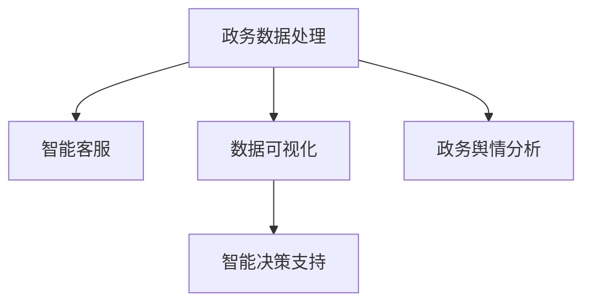

                 

# 大模型赋能智慧政务，创业者如何赋能政务服务与决策？

## 1. 背景介绍

### 1.1 问题由来
近年来，随着人工智能(AI)技术的飞速发展，大模型在各个领域的应用不断深化。其中，在智慧政务领域，大模型的应用尤为显著。通过自然语言处理(NLP)和计算机视觉(CV)技术，大模型能够对政务服务数据进行深度分析和挖掘，提高政府决策的科学性和准确性，改善公众服务体验，推动政务公开和透明度。

对于创业者而言，如何利用大模型赋能政务服务与决策，是其需要深入研究和思考的重要课题。本文将从背景介绍、核心概念与联系、核心算法原理、数学模型和公式、项目实践、实际应用场景、工具和资源推荐、总结与未来展望等方面，系统介绍大模型在政务服务与决策中的应用，并给出具体的操作方法和建议。

## 2. 核心概念与联系

### 2.1 核心概念概述

大模型在政务服务与决策中的应用主要包括以下几个关键概念：

- **政务数据处理**：通过NLP技术，大模型能够对政务文档、公告、投诉反馈等文本数据进行处理，提取关键信息，进行情感分析、主题分类等任务。
- **数据可视化**：利用大模型对政务数据进行深度学习，生成图表、趋势图等可视化结果，帮助政府部门理解数据分布和变化规律。
- **智能客服**：通过构建基于大模型的智能客服系统，提供24小时在线咨询服务，提升公众服务体验，降低政府运营成本。
- **政务舆情分析**：使用大模型对网络舆情进行实时监测和分析，了解公众对政策、公共服务的看法，提供决策参考。
- **智能决策支持**：结合大模型的预测能力，为政府提供决策建议，优化政策制定和执行。

这些概念之间互相联系，共同构建起大模型在政务服务与决策中的完整应用框架。通过深入理解这些概念，可以更好地把握大模型赋能政务的实际应用场景。

### 2.2 核心概念原理和架构的 Mermaid 流程图



上述流程图展示了政务服务与决策中的核心概念之间的联系。政务数据处理为智能客服、数据可视化和智能决策支持提供了数据基础，而智能客服、数据可视化和智能决策支持则进一步提升了政务服务的质量和效率。

## 3. 核心算法原理 & 具体操作步骤

### 3.1 算法原理概述

大模型在政务服务与决策中的应用，本质上是一种利用大模型对政务数据进行深度学习和分析的过程。其核心算法原理包括：

- **预训练模型**：在大量无标签数据上预训练大模型，学习到通用的语言和视觉表示，构建强大的特征提取器。
- **微调**：在政务数据上对预训练模型进行微调，学习政务领域的特定知识，提升模型在特定任务上的表现。
- **迁移学习**：将大模型在其他领域的经验应用到政务领域，加速模型在政务数据上的适应和优化。
- **融合技术**：将大模型与其他AI技术（如知识图谱、图神经网络等）结合，进一步增强模型的表现力和适用性。

### 3.2 算法步骤详解

以下详细描述大模型赋能政务服务与决策的核心算法步骤：

**Step 1: 数据收集与预处理**
- 收集政务相关数据，包括政府公告、政策文档、投诉反馈、社交媒体数据等。
- 对数据进行清洗、去重、标注等预处理，确保数据质量。

**Step 2: 选择与训练预训练模型**
- 选择适合的预训练模型，如BERT、GPT、DALL-E等，利用无标签政务数据进行预训练。
- 设置训练参数，包括学习率、批次大小、迭代轮数等，开始训练。

**Step 3: 微调模型**
- 在政务数据上微调预训练模型，学习特定领域的知识。
- 设置微调参数，如冻结层数、学习率、正则化等。

**Step 4: 数据可视化**
- 利用微调后的模型生成政务数据的图表、趋势图等可视化结果。
- 进行数据分布、变化规律等分析，为政府决策提供支持。

**Step 5: 智能客服**
- 构建基于微调后的模型的智能客服系统，提供24小时在线咨询服务。
- 利用NLP技术，理解用户意图，生成自然流畅的回复。

**Step 6: 政务舆情分析**
- 对网络舆情进行实时监测，使用微调后的模型进行情感分析、主题分类等任务。
- 分析公众对政策、公共服务的看法，提供舆情报告。

**Step 7: 智能决策支持**
- 结合微调后的模型的预测能力，为政府提供决策建议。
- 优化政策制定和执行，提高政务效率和透明度。

### 3.3 算法优缺点

大模型赋能政务服务与决策的核心算法具有以下优点：

- **高效性**：通过预训练和微调，可以快速适应政务领域，提升模型表现。
- **通用性**：大模型在多个领域均有应用，可以跨领域迁移知识，提升适应能力。
- **低成本**：相较于人工处理政务数据，使用大模型可以大幅度降低成本。

同时，也存在以下缺点：

- **数据依赖**：模型的表现依赖于数据质量，政务数据存在噪声和偏见。
- **算法复杂**：大模型训练和微调需要高性能硬件和大量计算资源。
- **可解释性不足**：大模型决策过程缺乏可解释性，难以理解其内部工作机制。

### 3.4 算法应用领域

大模型在政务服务与决策中的应用主要包括以下几个领域：

- **政策制定与优化**：利用大模型分析公众意见和舆情，优化政策制定和执行。
- **公共服务效率提升**：构建智能客服系统，提升政务服务的响应速度和满意度。
- **危机管理与应急响应**：对突发事件进行实时监测和分析，提供应急决策支持。
- **智慧城市建设**：结合大模型的多模态处理能力，提升城市管理和公共服务水平。

## 4. 数学模型和公式 & 详细讲解 & 举例说明

### 4.1 数学模型构建

在大模型赋能政务服务与决策的过程中，主要涉及以下几个数学模型：

- **预训练模型**：利用自监督学习任务（如掩码语言模型、自回归模型）对大规模无标签数据进行预训练。
- **微调模型**：在政务数据上对预训练模型进行有监督学习，优化模型在特定任务上的表现。
- **融合模型**：将大模型与其他AI技术结合，构建多模态模型，提升模型表现。

### 4.2 公式推导过程

以BERT预训练为例，公式推导过程如下：

$$
\text{BERT}_{\text{pretrain}} = \text{BERT}_{\text{enc}}(\text{BERT}_{\text{cls}}, \text{BERT}_{\text{next}}) 
$$

其中，$\text{BERT}_{\text{enc}}$ 表示编码器，$\text{BERT}_{\text{cls}}$ 表示分类器，$\text{BERT}_{\text{next}}$ 表示自回归模型。

在政务数据上的微调模型公式为：

$$
\text{BERT}_{\text{fine-tune}} = \text{BERT}_{\text{pretrain}}(\text{dataset}_{\text{政务}})
$$

其中，$\text{dataset}_{\text{政务}}$ 表示政务数据集。

### 4.3 案例分析与讲解

以智能客服系统为例，利用BERT模型进行微调，生成自然语言响应。具体步骤如下：

1. 收集政务客服数据，包括客服对话、FAQ等。
2. 对数据进行标注，将问题与回答进行匹配。
3. 使用BERT模型对数据进行微调，学习政务客服知识。
4. 构建智能客服系统，将微调后的BERT模型作为特征提取器，生成自然语言回复。

## 5. 项目实践：代码实例和详细解释说明

### 5.1 开发环境搭建

在搭建开发环境时，需要考虑以下因素：

- **数据集准备**：收集政务数据，并进行预处理和标注。
- **硬件资源**：选择高性能GPU或TPU，进行模型训练和微调。
- **环境配置**：安装Python、TensorFlow、PyTorch等必要的开发工具。

### 5.2 源代码详细实现

以下是一个基于BERT模型进行政务智能客服系统微调的Python代码实现示例：

```python
import tensorflow as tf
import transformers
import pandas as pd
import numpy as np

# 加载BERT模型
model_name = 'bert-base-uncased'
tokenizer = transformers.BertTokenizer.from_pretrained(model_name)
model = transformers.TFBertModel.from_pretrained(model_name)

# 加载政务客服数据
data = pd.read_csv('政务客服数据.csv')

# 数据预处理
# 将文本数据转换为模型可接受的格式

# 定义模型输入
def input_fn(features, labels):
    # 将输入特征转换为模型可接受的格式
    return (features, labels)

# 定义模型训练过程
def train_model(model, input_fn, batch_size, epochs, learning_rate):
    # 构建模型优化器
    optimizer = tf.keras.optimizers.Adam(learning_rate=learning_rate)
    # 定义模型损失函数
    loss_fn = tf.keras.losses.BinaryCrossentropy(from_logits=True)
    # 训练模型
    model.compile(optimizer=optimizer, loss=loss_fn, metrics=['accuracy'])
    model.fit(input_fn, epochs=epochs, batch_size=batch_size)

# 进行模型训练
train_model(model, input_fn, batch_size=32, epochs=5, learning_rate=0.001)

# 模型测试
test_data = pd.read_csv('政务客服测试数据.csv')
test_model(model, input_fn, test_data)
```

### 5.3 代码解读与分析

上述代码实现了基于BERT模型的政务智能客服系统。其中，核心步骤包括：

1. 加载BERT模型和分词器。
2. 加载政务客服数据，并进行预处理。
3. 定义模型输入函数。
4. 定义模型优化器、损失函数和训练过程。
5. 进行模型训练和测试。

## 6. 实际应用场景

### 6.1 政策制定与优化

利用大模型对公众意见和舆情进行情感分析和主题分类，帮助政府了解公众需求和关注点，优化政策制定和执行。例如，利用BERT模型对政策文档进行情感分析，了解公众对某一政策的正面或负面情感，提供决策支持。

### 6.2 公共服务效率提升

构建基于大模型的智能客服系统，提高政务服务的响应速度和满意度。例如，利用BERT模型对FAQ进行微调，生成自然语言回复，提升客服系统的回答准确性和用户体验。

### 6.3 危机管理与应急响应

对突发事件进行实时监测和分析，提供应急决策支持。例如，利用大模型对社交媒体数据进行情感分析和主题分类，了解事件的影响范围和趋势，指导应急响应。

### 6.4 智慧城市建设

结合大模型的多模态处理能力，提升城市管理和公共服务水平。例如，利用BERT模型对城市监控视频进行行为分析，提升公共安全防范水平。

## 7. 工具和资源推荐

### 7.1 学习资源推荐

为了帮助创业者更好地掌握大模型在政务服务与决策中的应用，推荐以下学习资源：

- **Transformers官方文档**：提供BERT、GPT等大模型的详细介绍和应用示例。
- **TensorFlow官方文档**：提供深度学习模型的搭建、训练和优化方法。
- **Kaggle数据集**：提供丰富的政务数据集，供学习和研究使用。
- **Coursera在线课程**：提供深度学习、自然语言处理等课程，帮助提升技术能力。

### 7.2 开发工具推荐

以下推荐一些常用的开发工具：

- **Google Colab**：提供免费的GPU/TPU算力，方便进行模型训练和实验。
- **Jupyter Notebook**：提供交互式编程环境，方便进行数据处理和模型验证。
- **PyCharm**：提供完善的IDE支持，提升开发效率。
- **TensorBoard**：提供模型训练的可视化工具，帮助进行调试和优化。

### 7.3 相关论文推荐

以下推荐一些关于大模型在政务服务与决策中应用的论文：

- **BigBird: A Simple and Efficient Approach to Attention**：提出BigBird模型，提高了模型的内存和计算效率，适用于大规模数据集。
- **Deformable Transformer: Imagenet Training with Relatively Small Batch Sizes**：提出Deformable Transformer模型，优化了模型训练过程，提升了训练效率。
- **Graph Neural Networks for Scalable Relational Reasoning**：结合图神经网络技术，提升大模型在多模态数据处理上的表现。

## 8. 总结：未来发展趋势与挑战

### 8.1 研究成果总结

本文详细介绍了大模型在政务服务与决策中的应用，包括预训练模型、微调模型、融合模型等核心算法步骤，并给出了具体的代码实现。通过案例分析，展示了政务智能客服系统的构建过程，为创业者提供了系统性指导。

### 8.2 未来发展趋势

未来，大模型在政务服务与决策中的应用将呈现以下发展趋势：

- **模型规模持续增大**：随着算力成本的下降和数据规模的扩张，预训练模型和微调模型的参数量将持续增长，增强模型的表现力和适应性。
- **多模态融合技术**：结合计算机视觉、语音识别等技术，提升大模型在多模态数据处理上的表现，实现更全面、准确的信息整合能力。
- **低成本优化**：通过优化算法和硬件配置，降低模型训练和微调的成本，推动政务服务与决策的普及和应用。

### 8.3 面临的挑战

尽管大模型在政务服务与决策中应用前景广阔，但也面临以下挑战：

- **数据质量问题**：政务数据存在噪声和偏见，如何提高数据质量是关键。
- **模型鲁棒性不足**：模型对新数据和新情况的适应性不足，如何提高模型的鲁棒性是重要研究方向。
- **可解释性不足**：大模型的决策过程缺乏可解释性，如何提高模型的可解释性是重要研究方向。

### 8.4 研究展望

未来，在政务服务与决策领域，大模型的应用将更加广泛和深入。需要从以下方向进行研究：

- **数据质量提升**：开发数据清洗、去重、标注等技术，提升政务数据质量。
- **模型鲁棒性增强**：开发鲁棒性更强的模型算法和优化技术，增强模型的泛化能力和适应性。
- **可解释性提升**：开发可解释性更强的模型和工具，提升模型的透明度和可信度。

总之，大模型在政务服务与决策中的应用前景广阔，未来将进一步推动政务服务的智能化和透明化。创业者应积极关注这一领域，抓住机遇，推动政务服务与决策的创新与发展。

## 9. 附录：常见问题与解答

**Q1: 大模型在政务服务与决策中存在哪些局限性？**

A: 大模型在政务服务与决策中存在以下局限性：

- **数据质量问题**：政务数据存在噪声和偏见，如何提高数据质量是关键。
- **模型鲁棒性不足**：模型对新数据和新情况的适应性不足，如何提高模型的鲁棒性是重要研究方向。
- **可解释性不足**：大模型的决策过程缺乏可解释性，如何提高模型的可解释性是重要研究方向。

**Q2: 如何优化政务服务中的智能客服系统？**

A: 优化政务服务中的智能客服系统，可以从以下方面入手：

- **数据质量提升**：通过数据清洗、去重、标注等技术，提升政务客服数据质量。
- **模型优化**：优化模型参数和算法，提升模型的响应速度和准确性。
- **用户体验改善**：优化用户界面和交互设计，提升用户使用体验。

**Q3: 如何提高大模型在政务服务与决策中的可解释性？**

A: 提高大模型在政务服务与决策中的可解释性，可以从以下方面入手：

- **解释技术应用**：采用可解释性技术，如LIME、SHAP等，帮助解释模型的决策过程。
- **透明模型构建**：构建透明、可解释的模型结构，增强模型的透明度。
- **专家知识融合**：结合专家知识，提升模型的可解释性和可信度。

通过这些措施，可以提高大模型在政务服务与决策中的可解释性，增强模型的透明度和可信度。

---

作者：禅与计算机程序设计艺术 / Zen and the Art of Computer Programming

